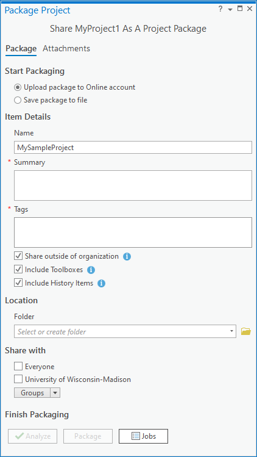

# ArcGIS Pro Project Package (PPKX) Data Curation Primer 

Authors: Jaime Martindale, Aditya Ranganath, Amy Work, Melinda Kernik

Mentor: Melinda Kernik

Affiliate Contributors (peer reviewers): Erich Purpur, Leighton Christiansen, and Keith Jenkins

Suggested Citation: Martindale, Jaime; Ranganath, Aditya; Work, Amy; Kernik, Melinda. (2023). ArcGIS Pro Package Data Curation Primer. Data Curation Network [GitHub Repository](https://github.com/DataCurationNetwork/data-primers).

# Table of Contents
[Format Overview](#format-overview)

[Introduction](#introduction)

[Description of format](#description-of-format)

[Examples](#examples)

[Key questions to ask yourself](#key-questions-to-ask-yourself)

[Key clarifications to get from researcher](#key-clarifications-to-get-from-researcher)

[Software and resources for reviewing data](#software-and-resources-for-reviewing-data) 
> [ArcGIS Pro](#arcgis-pro)   [7-Zip or other compression utilities](#zip-or-other-compression-utilities)   [ArcGIS Online for Organizations](#arcgis-online-for-organizations)   [QGIS](#qgis)

[Checking the components of a PPKX](#checking-the-components-of-a-ppkx) 
> [Reviewing a PPKX in ArcGIS Pro](#reviewing-a-ppkx-in-arcgis-pro)   [Reviewing an uncompressed PPKX](#reviewing-an-uncompressed-ppkx)

[Applicable metadata standard, core elements and readme requirements](#applicable-metadata-standard-core-elements-and-readme-requirements) 
> [Embedding metadata with geospatial datasets (inside the PPKX)](#embedding-metadata-with-geospatial-datasets-inside-the-ppkx)   [Project-level metadata options for PPKX](#project-level-metadata-options-for-ppkx)    [Researcher Metadata Recommendations:](#researcher-metadata-recommendations)   [Curator Metadata Recommendations:](#curator-metadata-recommendations)

[Preservation Actions](#preservation-actions)

[FAIR Principles](#fair-principles) 
> [Findable](#findable)   [Accessible](#accessible)   [Interoperable](#interoperable)   [Reusable](#reusable)

[Unresolved Issues/Further Questions:](#unresolved-issuesfurther-questions)

[Appendix 1: Process to create a PPKX (Project Package)](#appendix-1-process-to-create-a-ppkx-project-package) 

[Appendix 2: Example PPKX File Manifest](#appendix-2-example-ppkx-file-manifest) 

## Format Overview 

| Topic                                    | Description                                                                                                                |
|------------------------------------------|----------------------------------------------------------------------------------------------------------------------------|
| File Extension                           | PPKX                                                                                                                       |
| MIME Type                                |                                                                                                                            |
| Structure                                | Compressed folder containing data, map document (.aprx), and related project materials                                     |
| Versions                                 |                                                                                                                            |
| Primary fields or areas of use           | Any field that makes use of geospatial data. Example research topics include: geology, climate, transportation             |
| Source and affiliation                   | Proprietary file format developed and managed by ESRI                                                                      |
| Metadata standards                       | ISO19115, ISO19110, ISO19139, FGDC CSDGM                                                                                   |
| Tools for curation review                | [ArcGIS Pro](https://www.esri.com/en-us/arcgis/products/arcgis-pro/overview), [7Zip](https://www.7-zip.org/) |
| Date Created                             | (Draft Feb 27, 2023)                                                                                                       |
| Created by                               | Jaime Martindale, Aditya Ranganath, Amy Work, Melinda Kernik                                                               |
| Date updated and summary of changes made |                                                                                                                            |

## Introduction
 Geographic Information Systems (GIS) are computer-based tools used to store, visualize, analyze, and interpret geospatial data. Projects that use GIS can contain multiple datasets, programs, subsidiary files, maps, scripts, and layers. The proliferation of files and geospatial data in a typical GIS project poses a challenge for reproducible research. In particular, different elements within a GIS project are often interrelated in complex ways, and these interrelationships can be difficult to understand and reproduce outside the context in which they were originally created (given, for example, the problem of missing dependencies or changing file paths across different computing environments). When data repositories provide the elements of a GIS project as disaggregated individual files, it can be time-consuming and labor-intensive for end-users to use these files to recreate, reproduce, or extend published results that rely on GIS analysis or visualization. The ArcGIS Pro Project Package (PPKX) file format addresses this challenge by allowing researchers to share all of the elements of their project as a single file. ArcGIS Pro Project Packages are great for researchers sharing files within the same software environment (i.e. ArcGIS Pro), but the proprietary nature of the format and rapid versioning of the software makes decisions about long-term archiving difficult. In addition to introducing the file format, we hope this primer helps you think through questions such as:

- Should data and other files be made available outside of the project package to make them more accessible to people without ArcGIS software? In which situations would this be appropriate?

- In documentation about the project, should data layers be described as they would be viewed from within ArcGIS software or with the actual file names (only visible if you uncompress the package)?
 This primer describes tips for opening and reviewing this overarching project file. Curators are encouraged to consult additional DCN Data Primers for curation checklists for component file types (like [geodatabases](https://github.com/DataCurationNetwork/data-primers/blob/master/Geodatabase%20Data%20Curation%20Primer/Geodata-Primer.md) and [geotiffs](https://github.com/DataCurationNetwork/data-primers/blob/master/GeoTIFF%20Data%20Curation%20Primer/geotiff-data-curation-primer.md)). A note about software: This primer includes a method for accessing data included in a Project Package with open source software. ArcGIS Pro is required, however, to fully view the components of a PPKX file.

## Description of format
 The Project Package format (extension .PPKX) is a proprietary file format for use with Esri’s ArcGIS Pro software. Its primary function is to allow for sharing or publishing of GIS projects either publicly or within specific organizations. There are many [types of package formats available](https://pro.arcgis.com/en/pro-app/latest/help/sharing/overview/introduction-to-sharing-packages.htm).[^1] The PPXK is an all encompassing file share package, which functions similar to ZIP or TAR. The .PPKX file creates a ‘wrapper’ around an entire GIS project. It is a compressed version of an ArcGIS Pro Project -consolidating the dependent elements of the project into one file location. It can include:

- Maps and 3D views (.aprx)

- Data and layers used in the maps (.gdb, .tiff, .shp, etc)

- Toolboxes

- Styles and layouts

- Attachments and related documents

- Geoprocessing history and folder connections
 To see a full list of the items that can be included in a PPKX, please see this [ESRI resource table](https://pro.arcgis.com/en/pro-app/latest/help/sharing/overview/project-package.htm).[^2] From a data curation standpoint, saving PPKX files outside of individual organizations (publicly) is recommended to ensure universal access to all dependent elements of the geospatial project.

## Examples

Version refers to the earliest version of ArcGIS Pro in which the
example will open. Project packages should be forward compatible. (In
other words, you can open packages saved for version 1.X in version 2.X,
3.X, etc)

- [Transit Tools: Routes and Stops](https://www.arcgis.com/home/item.html?id=079fa4b862a744ffb3a12edb99a4b16c)[^3] - Version 1.X Includes a map, python scripts, ArcGIS toolboxes, tasks, shapefiles, and a geodatabase

- [National Park Service Trail Proximity to Surrounding Features](https://www.arcgis.com/home/item.html?id=41ca25210ca345a88b2008dce88792ac)[^4] - Version 2.X Includes a map, geodatabases, a python script, and an ArcGIS toolbox

- [Daily COVID-19 USA Testing Data](https://www.arcgis.com/home/item.html?id=68074308e21c42a48aee677de6abfe89)[^5]- Version 2.X Includes a map, python script tool, geodatabase, and attachments (.lyrx and .ipynb)

- [Crime Analysis Project: ESRI Canada](https://www.arcgis.com/home/item.html?id=57233cb5a0da4d01bf5e28053d61c987)[^6] **-** Version 2.X Includes a map and geodatabases

- [An Experimental Study of Drainage Network Development by Surface and Subsurface Flow in Low-Gradient Landscapes Raster Datasets](https://doi.org/10.13020/7a27-tg76)[^7] - Version 2.X Includes five maps, geodatabases, shapefiles, and tiffs

- [Explore Climate Projections](https://arc-gis-hub-home-arcgishub.hub.arcgis.com/content/01bb69f1466d4d2490183b31cad54210/about)[^8] Version 2.X Includes a map, toolbox/model, geodatabase, and attachments (netCDFs and .doc)

## Key questions to ask yourself

- What components are present in this package (ie. maps, data, toolboxes, additional documents)? Is it clear how the components are related to one another?

- What documentation has the researcher provided? Do the names used in the documentation match the file names or the data layers as viewed through ArcGIS Pro? (See [Applicable metadata standard, core elements and readme requirements](#applicable-metadata-standard-core-elements-and-readme-requirements) and [Preservation actions](#preservation-actions) for discussion)

- What is the purpose of this project? Is the primary goal to share research data or to walk someone through a process that would require ArcGIS Pro? (See [Preservation actions](#preservation-actions) for discussion of how this might impact your curation process)

## Key clarifications to get from researcher

- Are there datasets within the project package that are intellectual contributions in their own right, which you would also like to archive separately?

- What is the relationship between the layers, tools, and items within the PPKX? What overview documentation can you provide for this file?

- In what version of software was this file created? Was it saved to be backwards compatible? (See [Reviewing an uncompressed PPKX](#reviewing-an-uncompressed-ppkx) for tips guessing what the settings might have been)

## Software and resources for reviewing data

This section gives a high-level overview of the primary tools for
opening, sharing, and reviewing PPKX. The next section “[Checking
Components of a PPKX](#checking-the-components-of-a-ppkx)” provides
more specific details about how to use the tools.

#### ArcGIS Pro
 ArcGIS Pro is required in order to fully view the contents of a PPKX file. The version of ArcGIS Pro that was used to create the PPKX file is important. While there is some forwards compatibility in opening PPKX files in newer versions of ArcGIS Pro, backwards compatibility has limited support or is not supported. Projects, project packages, and project templates (.aprx, .ppkx, and .aptx files) saved with any version of ArcGIS Pro 1.x can be opened and used by any version of ArcGIS Pro. However, projects saved using ArcGIS Pro 2.x cannot be opened by ArcGIS Pro 1.x. You cannot save a copy of an ArcGIS Pro 2.x project that can be opened with any 1.x version of ArcGIS Pro. If a project is saved with a recent version of ArcGIS Pro, such as 2.3, it can be opened with previous versions of ArcGIS Pro 2.x, such as 2.0, but the project will be downgraded in a manner appropriate for the previous version. ([ESRI Documentation: Open a project](https://pro.arcgis.com/en/pro-app/2.9/help/projects/open-a-project.htm)[^9]) How the PPKX file is created in ArcGIS Pro determines how elements inside the project are accessed by others. Project packages can be created within specific organizations (authorizing access to enterprise geodatabases or universal naming convention (UNC) data paths to only those users inside the organization) or they can be created publicly (authorizing access to all enterprise or UNC data as extracted, standalone files saved inside the project package file). If the desire is to share the PPKX with others, the researcher should check the box to “Share outside of Organization” or make the project public. See the [Reviewing a PPKX in ArcGIS Pro](#reviewing-a-ppkx-in-arcgis-pro) section below for tips identifying which settings were used.

#### 7-Zip or other compression utilities
 There may be situations where there is a desire to open the PPKX outside of the ArcGIS Pro environment. It is possible to use a compression utility platform to uncompress the components of a PPKX. Be careful with uncompressing the original. Making a second copy and uncompressing the copy will ensure that the original remains intact. You can uncompress the PPKX directly or you can rename the file extension from .PPXK to .ZIP (or .7z). At the time of writing, while uncompressing the PPKX enables access to all files that make up the PPXK, including the data sources, python scripts and other file format, compressing the files back together was not possible due to a protection on the .aprx file. ([GIS StackExchange post about editing APRX](https://gis.stackexchange.com/questions/351253/arcgis-pro-open-aprx-files-to-edit-file-paths)[^10]). Uncompressing the PPKX is a great way to get access to the various files that make up a PPKX, granting access to files and scripts that can be used in other software platforms such as QGIS, Jupyter Notebooks, or other.

#### ArcGIS Online for Organizations
 ArcGIS Online for Organizations is a cloud-based storage and mapping platform that is part of the ArcGIS product suite. ArcGIS Online can be used to store and share PPKX files with other users inside the organization or publicly. When PPKX is shared using ArcGIS Online, it is best to have the share setting set to public. Access from ArcGIS Online provides a link for the PPKX to be downloaded to a local computer and can be opened using ArcGIS Pro or 7-zip.

#### QGIS 
 QGIS is an open source geospatial software program that is widely used. It is not possible to directly open a PPKX file in QGIS. At the time of writing, it is also not possible to open the project file (APRX) that is made accessible after uncompressing a PPKX without a paid license, but this might become possible in the future. ([SLYR: ESRI to QGIS Compatibility Suite](https://north-road.com/slyr/)[^11])

## Checking the components of a PPKX

### Reviewing a PPKX in ArcGIS Pro

When you click to open a .PPKX file in ArcGIS Pro, it will open the
.APRX file included in the package. When you first open the file,
usually there will be at least one map present. You can view and explore
data displayed on this map in the Content Pane.

If there are any broken data connections (denoted by red exclamation
points), it is likely that the researcher did not choose to “Share
outside of organization” when creating the project package. If this is
the case, some of the data for the project were not included with the
PPKX and you will need to follow-up with the researcher to have them
repackage the PPKX. See the appendix [Process to create a
PPKX](#_j8rlp4gueny2) for more information.

You will want to check whether there are toolboxes, scripts, or
additional files associated with the project. These can be found by
choosing “View” and then “Catalog Pane” (Figure 1)

<figure>  <fig caption>Figure 1: View of the top menu options in ArcGIS Pro with the ‘View’ tab active and the “Catalog Pane” emphasized.</figcaption> </figure>   

Through the Catalog Pane, you can explore Toolboxes, Tasks, and other
components that may be associated with the Project. Open each expandable
section to inventory all possible components. (Note that Projects by
default have one geodatabase and one toolbox. These defaults have the
same name as the overall project, are marked by a small house icon, and
may not contain any files.) One of the expandable options in the Catalog
Pane is “Folders.” Check the subfolders “commondata” and “userdata” if
present. Subfolders “p1”, “p2”, or “p3” will contain duplicates of
information linked in other parts of the Catalog Pane.

<figure>  <fig caption> Figure 2: View of an example dataset in the Catalog Pane. In this example, there are two toolboxes, three tasks, and two shapefiles that should be considered during curation. There is also an empty toolbox and empty geodatabase.</figcaption> </figure>  

### Reviewing an uncompressed PPKX

The following method describes an open source option for accessing the
components of a PPKX. It is a good approach if you do not have access to
ArcGIS Pro software, but it does not preserve map display and data
organization choices. For example, data layers may have been renamed
within the project file (.aprx) that are not reflected in file names.

Within a project folder uncompressed using 7zip, there will be several
subfolders (Figure 3)

<figure>  <fig caption>Figure 3.  The contents of an uncompressed PPKX folder viewed in File Explorer</figcaption> </figure>  

If the PPKX has been saved to be compatible with multiple versions of
the software. You will see multiple folders with the naming convention
“p##” (e.g. “p20” or “p30”). These folders will contain similar files
but for different versions of the software. For example, files within
“p20” are compatible with ArcGIS Pro 2.x.x.

Within the “esriinfo” folder you will find a thumbnail and brief
metadata describing the project file as a whole. (Figure 4)

<figure>  <fig caption>Figure 4. The contents of the “esriinfor” folder viewed in File Explorer</figcaption> </figure>  

Within the “p20” (or “p30” etc.) folder, you will find the primary
project file (.aprx) (which requires ArcGIS Pro to open), geodatabases
(.gdb), toolboxes (.tbx), and other python scripts (.py).

<figure>  <fig caption>Figure 5. The contents of a “p20” folder viewed in File Explorer</figcaption> </figure>  

If the project has geospatial data in other file formats (such as
shapefiles or geotiffs), they will appear in a folder called
“commondata”. If other “attachments” have been added (such as
supplemental documentation or non-geospatial data files), they will be
included within a subfolder called “userdata.”

## Applicable metadata standard, core elements and readme requirements

When a researcher creates metadata to describe a PPKX and its contents,
the information is stored in two primary ways: (1) metadata attached to
(embedded with) individual geospatial datasets stored inside the PPKX,
and (2) simple external metadata that describes the entire project and
all relevant components can be added at the time the PPKX file is
created. The curator may also recommend including a more detailed text
file README summarizing and explaining the relationships between data
and scripts in order to supplement the limited external metadata options
available in ArcGIS Pro.

The process to add or edit embedded geospatial metadata is available in
the [View and Edit Metadata Documentation from
ESRI](https://pro.arcgis.com/en/pro-app/latest/help/metadata/view-and-edit-metadata.htm)[^12].
The process a researcher goes through to create external metadata is
described in [Appendix 1: Process to Create a PPKX (Project
Package)](#appendix-1-process-to-create-a-ppkx-project-package).

### Embedding metadata with geospatial datasets (inside the PPKX)

ArcGIS Pro supports the creation and editing of various geospatial
metadata content and XML encoding standards including:

- ISO ISO-19115-1 & 19115-3 XML Schema Implementation

- ISO 19139 Implementation Specification

- FGDC CSDGM Metadata

- INSPIRE Metadata Directive

- North American Profile

When individual geospatial datasets are stored and packaged inside a
PPKX file, any original metadata a researcher may have created for those
datasets(in the metadata editor) stays embedded with the data and are
visible within the software when the PPKX is opened. Metadata editor
entry forms have a variety of “views” that can be selected to enter
descriptive elements for the standards listed above. At the most basic
level, all of the metadata elements for a geospatial dataset are stored
in ArcGIS Pro software in the “ArcGIS Format” metadata schema when added
via the metadata editor in Catalog View. Some embedded geospatial
metadata is generated automatically by the software, but most is created
by the author of the data. Information on how to view embedded
geospatial metadata in ArcGIS Pro, is available in the [View and Edit
Metadata Documentation from
ESRI](https://pro.arcgis.com/en/pro-app/latest/help/metadata/view-and-edit-metadata.htm).[^13]

When a researcher describes geospatial datasets inside a PPKX, metadata
elements in the chosen schema should be entered as completely as
possible to describe titles and names, description and purpose, spatial
properties, credits and contacts, etc. Best practice would be to
describe the individual datasets as you would if they were being
archived alone or separate from a PPKX or project).

### Project-level metadata options for PPKX

How a researcher creates metadata for inclusion with a PPKX is an
important process for a curator to be aware of. There are limitations to
how some of this information may be consumed by a curator. When a PPKX
file is created and shared publicly as a standalone file or to an online
account (ArcGIS Online) - the process to add project-level metadata that
describes all aspects of the included data, tools, processes, reports,
or attachments is limited to the short form displayed prior to saving
and exporting the file.

There are field entries in the Project Package dialog box where a
researcher can add a project **name**, **descriptive summary**, and
**relevant tags**. These are project-level “metadata elements” that
would be helpful for a user to better understand the project, why it was
created and/or what data, maps or other materials may be included. While
not official entries in any formal metadata content standards, these
details are indicative of select “Item Description” elements commonly
seen in ESRI software like ArcGIS Pro. It is important to note that
these entries are the only options for documentation researchers have to
inform potential curators about the project.

When saved as a standalone file, the details that a researcher uses to
describe the PPKX file added in the Package Project window (shown in
detail in Figure 6) are not viewable in the Catalog View within ArcGIS
Pro. The only way to view information entered here is to uncompress the
PPKX. The details can then be located in an ‘iteminfo.xml file. This is
shown in more detail in the [Reviewing an uncompressed
PPKX](#reviewing-an-uncompressed-ppkx) section of this primer.

<figure>  <fig caption>Figure 6A shows the metadata entry fields with the option to save as a standalone file selected. </figcaption> </figure>  
<figure>  <fig caption>Figure 6B shows the metadata entry fields but with the option to save to an online account selected.</figcaption> </figure>  

If the project file is shared online (ArcGIS Online account), the
details that were added in the “Package Project” window at the time of
creation show up in ArcGIS Online, associated with this PPKX file (as
shown in Figure 7.). In addition, there are other metadata details in
the Item Description view that can be easily augmented here to further
describe the project. Unlike the ArcGIS Pro software environment, it is
also possible to utilize the *Metadata editor* in ArcGIS Online to enter
more robust details about the project as necessary.

<figure>  <fig caption>Figure 7. Sample PPKX in ArcGIS Online with the metadata button at the right. Clicking the Metadata button at the right opens the full metadata editor window where additional details can be captured.</figcaption> </figure>  

<figure>  <fig caption>Figure 8. The metadata editor window in ArcGIS Online - where researchers can add informative details about the project.</figcaption> </figure>  

### Researcher Metadata Recommendations:

1.  Metadata that follows an existing standard for geospatial data is recommended to be included with every geospatial dataset within a PPKX (embedded). Ideally this documentation should be created during the project development process (or be retained from original sources if the data was created elsewhere) with an appropriate amount of detail for the data to be accessible as standalone files outside of the PPKX or project environment. Researchers can export existing metadata for datasets or maps from ArcGIS Pro as standalone XML files using the [Export Metadata to a Standalone Format instructions from ESRI](https://pro.arcgis.com/en/pro-app/latest/help/metadata/export-metadata-to-a-standard-format.htm).[^14]

2.  Because of a lack of descriptive metadata for the PPKX (or project) itself as a standalone file, it is recommended that researchers create a separate README file that is accessible outside of the Esri environment, and offers a more robust description of the project. This documentation can be created in a simple text editor and included as an “attachment” when creating the PPKX file. README details might include:   A. Title of the project   B. Geographic extent   C. Description of the project that provides context for use; include descriptions of
 tools, scripts, maps or other relevant materials   D. Purpose of the work - why was the project created and what function does it serve?   E. Author, Originator, Creator or Credits and associated contact details   F. Relevant dates (i.e. content, creation, publication, revision)

### Curator Metadata Recommendations:

1.  It is not assumed that the wide variety of digital preservation environments at different institutions will take into account metadata or documentation that are accessible *only* via ArcGIS Online or within Esri software. Because of this, PPKX files to be preserved outside of the Esri environment should include a separate, descriptive README metadata file to aid in preservation.

2.  Documentation provided by the researcher in the form of a README can be used to aid the curator in determining what details are most important to apply to institutional preservation or discovery. Because of the variability in institutional adopted metadata schemas, repository structures, and workflows for preservation, understanding how a researcher describes the PPKX and its contents will help a curator communicate with the researcher to determine the most appropriate metadata details to include for preservation.

3.  If the curator has access to ArcGIS Pro and/or ArcGIS Online, metadata created by the researcher for the PPKX and its contents may be viewed and possibly used in the process of creating preservation or discovery metadata for an institutional repository. Information on how to view existing metadata in ArcGIS Pro, is available in the [View and Edit Metadata Documentation from ESRI](https://pro.arcgis.com/en/pro-app/latest/help/metadata/view-and-edit-metadata.htm).[^15]

## Preservation Actions

As noted earlier, a PPKX file is a container for the many different
geospatial data files and scripts that comprise a geospatial project;
one of the main advantages of a PPKX file from the standpoint of
long-term preservation and reusability is that it allows end-users who
have access to Esri software to reproduce a geospatial project that
contains complex data structures and interdependencies. However, because
the PPKX file format is a proprietary Esri format, it is important that
instructions are provided to non-Esri users about how they can access
the data contained within the PPKX file; in particular, the
documentation for a PPKX file should emphasize that end-users who do not
have access to an ESRI subscription can access the underlying data
contained within the PPKX file by renaming the “.ppkx” extension to .7z,
and uncompressing the file using 7-zip.

Once all of the project files are wrapped up in a PPKX file, and
instructions are provided to end-users (who are not Esri users) on how
to transform the PPKX file into .7z file, the locus of preservation
efforts can shift to the individual files that are contained within the
PPKX file. It is likely that complex projects will contain a large
variety of geospatial file types and scripts. Curators will want to
follow the preservation recommendations offered in a variety of DCN
primers to inform their file-level preservation activities, such as the
[Primer on
GeoJSON](https://github.com/DataCurationNetwork/data-primers/blob/master/GeoJSON%20Data%20Curation%20Primer/GeoJSON-data-curation-primer.md)[^16]
and the [Primer on
GeoTIFF](https://github.com/DataCurationNetwork/data-primers/blob/master/GeoTIFF%20Data%20Curation%20Primer/geotiff-data-curation-primer.md),[^17]
which provide useful guidance on curating those file types, as well as
vector and raster data more generally. Another useful resource is the
[Primer on
Geodatabases](https://github.com/DataCurationNetwork/data-primers/blob/master/Geodatabase%20Data%20Curation%20Primer/Geodata-Primer.md).[^18]
A geodatabase is also a spatial data object that serves as a “container”
for other file formats, though they can also by packaged within a PPKX
file along with other geospatial files and objects; the geodatabase
primer offers useful advice on curating and preserving the variety of
data file types that are stored in “container”-type data objects.

In light of the variety of data files and objects that are likely to
exist within a PPKX file container, it is important that a “file
manifest” is provided, which contains the various files included in the
PPKX file, along with relevant metadata about each of these files. The
manifest should also include a descriptive overview of how the various
files are interrelated. (See Appendix 2 for an [Example File
Manifest](#example-manifest)) In some cases, given the diversity of
files that a curator might encounter within a PPKX file, it may be
useful to explore a team-based approach to curation preservation,
especially if the PPKX file contains scripts that would benefit from the
expertise of someone with expertise in a given programming language
(typically, the scripts encountered within a PPKX file will be in
Python).

One disadvantage of the way that PPKX files effectively bundle together
various geospatial (and other data) files into a single container is
that it may inhibit the discovery of individual files within the PPKX.
In particular, some of the data files within a PPKX file may be of
interest in their own right (even outside the context of a given project
that is preserved within a PPKX container), and these files could be
easier to discover by interested future users if they are published
separately. The decision about whether the individual data files
contained within a PPKX file ought to be archived separately, outside
the context of a PPKX file, is one which should be made in consultation
with the researcher. If certain datasets within a PPKX file are
considered to be “high-impact” datasets that represent substantial or
novel intellectual contributions in their own right, curators should
consider publishing the PPKX file, but also archiving the datasets that
deserve greater visibility separately (and assigning them their own DOIs
that are separate from the DOI assigned to the parent PPKX file). In
short, the decision about whether it is appropriate or desirable to
archive individual data files contained within a PPKX file container as
separate objects (with their own DOIs), depends on the context of the
broader project and the files in question, and should be made in
conjunction with the researcher.

Finally, it is worth noting that the PPKX file format is the most
general and encompassing Esri file format for storing a container file
that facilitates sharing and reproducibility. There are also narrower
and more specific container file formats that are designed with
particular data types, tasks, or workflows in mind. These narrower
sharing packages might, in some cases, be more appropriate or efficient
ways to archive data in the context of certain projects, and curators
will want to be aware of these options. This website provides a catalog
of these sharing packages, which curators may wish to peruse before
deciding whether the PPKX file container is the most appropriate vehicle
for archiving the data and code that underpins a geospatial project:
[https://pro.arcgis.com/en/pro-app/2.9/help/sharing/overview/introduction-to-sharing-packages.htm](https://pro.arcgis.com/en/pro-app/2.9/help/sharing/overview/introduction-to-sharing-packages.htm)

## FAIR Principles

As a proprietary file format, PPKX files are intrinsically incompatible
with certain FAIR principles. In particular, while it is possible for
PPKX files to be assigned a persistent identifier within a repository
(thereby making it findable), the proprietary nature of PPKX files poses
particular challenges for accessibility, interoperability, and
reusability, since end-users require proprietary software to fully
engage with the data that is stored by these files. Nevertheless, there
are certain steps that curators can take to ensure PPKX files are
aligned (to the full extent possible) with FAIR principles, and that
non-ESRI subscribers are able to engage with the underlying data stored
within PPKX files (even if they cannot benefit from the proprietary user
interface that unlocks the full richness of the PPKX file format).
Below, we consider some of these steps that curators can take to ensure
that PPKX data files are FAIR.

### Findable

1.  Assign the PPKX file a unique and persistent identifier

2.  Include tags describing the various file formats contained within the PPKX file

3.  Work with researcher to create the most complete and robust metadata possible, both within PPKX elements and files, but also external supporting documentation, such as data dictionaries, etc.

### Accessible 

1.  Since PPKX is a relatively new format, it may be useful to include instructions for end-users on how to access the underlying data. ([Example instructions](https://www.esri.com/arcgis-blog/products/arcgis-pro/sharing-collaboration/project-packages-ppkx-files/#what)[^19])

2.  Because a PPKX file will usually contain multiple types of data, it is important to ensure that all of the data in the collection has the same access and reuse rights. If not, it is important to explicitly clarify any exceptions or special cases.

3.  As noted earlier, saving PPKX files outside of individual organizations (publicly) is recommended to ensure universal access to all dependent elements of the geospatial project.

### Interoperable

1.  There are likely to be non-ESRI subscribers among the data’s end-users. It is important to ensure that instructions are provided on accessing the data for these users (i.e. through the 7-zip method); alternatively, the curator may upload the various files individually (as a Zip file), in addition to the PPKX file.

2.  To the extent possible, the underlying data files in the PPKX file should be in open and/or widely used formats that can be read by both Esri and open-source geospatial applications.

3.  Ensure backwards compatibility in PPKX files by selecting the “All versions” option for the *Package Version”* option when using the “Package Project” tool in ArcGIS Pro to create a standalone PPKX file. See [Appendix 1: Process to Create a PPKX (Project Package)](#appendix-1-process-to-create-a-ppkx-project-package) for instructions.

### Reusable 

1.  In addition to providing the PPKX file, it may make sense to upload the various files individually (as a Zip file), so that the relevant data is easily reusable by researchers who are not ESRI users, and so that users can easily extract the specific data they are interested in.

2.  Include a file manifest and/or Readme to provide a collection-level overview of data that clarifies how various data components. It is also important to ensure that individual data files have relevant geospatial metadata, so that they can be reused individually (i.e. coordinate system and projection information).

## 

##  Unresolved Issues/Further Questions:

- When and how to preserve metadata embedded in data layers outside of the project package

- Whether project-level metadata for a PPKX added through ArcGIS Online will be included when the file is downloaded

## Appendix 1: Process to create a PPKX (Project Package)

The process a researcher uses to create a PPKX can be useful for a
curator to understand by allowing for better understanding of the
various decisions a researcher makes when deciding to share a project.
This section illustrates what is involved and outlines the decisions a
researcher makes with regard to access and documentation. During your
review of the PPKX, if any changes need to be made the project will have
to be repackaged. The following section describes nuances of the process
that may help you when communicating with the researcher.

There are two ways to create a PPKX in ArcGIS Pro 2.x and 3.0:

\(1\) via the ‘Share’ tab, by clicking on the “Project” icon in the
“Package” group:

<figure>  <fig caption>Figure 9. View of the top menu bar options in ArcGIS Pro with the Project menu selected and the ‘Share’ tab active. Share ‘Project’ is the first option shown at the left (highlighted in light blue).</figcaption> </figure>  

Or (2) using the Package Project tool via the Geoprocessing toolbox.
When locating tools or toolboxes in ArcGIS Pro, the simple command
search function can be very useful. Search for ‘PPKX’ in the command
search box and select ‘Package Project’ to view the PPKX tool window. 

<figure>  <fig caption>Figure 10. View of the Command Search option visible at the top of the screen in ArcGIS Pro.</figcaption> </figure>  

<figure>  <fig caption>Figure 11. View the searching for the Package Project tool through the Command Search in ArcGIS Pro.</figcaption> </figure>  

There are some differences between the two methods. When using the
*Share Tab* option, one can opt to share the PPKX via ArcGIS Online as
well as create a stand alone file. The Data Management Tool *“Package
Project*” accessed via the Toolbox in ArcGIs Pro (2.9 or 3.0) simply
creates the standalone PPKX file. Both methods offer an opportunity to
enter keyword tags and a project summary describing the PPKX contents
and rationale, as well as attachments. When using the Share Tab method
for creating the PPKX, it will create two copies of your project: one
for the current version of ArcGIS Pro and one for the last major
release. For example, if **MyProject1.ppkx** was created with ArcGIS Pro
3.0, it will contain a **p30** folder with a 3.0 version of the project
and a **p20** folder with a 2.9 version of the project ([Guide to
ArcGIS Pro project
packages](https://www.esri.com/arcgis-blog/products/arcgis-pro/sharing-collaboration/project-packages-ppkx-files/#how)).
However, in the “Package project” Tool accessible via the Toolbox, users
can specify individual software version(s) the PPKX shall be compatible
with. This would allow someone to choose only one (i.e. the most
current) version of the software and reduce the total size of the PPKX
file that is created.

<figure>  <fig caption>Figure 12A. Sample dialog for “Share tab” method of saving as PPKX (Refer back to Figure 9).</figcaption> </figure>  
<figure>  <fig caption>Figure 12B Sample dialog for “Data Management Tools “Package Project” from the Toolbox  (Refer back to Figures 10 and 11).</figcaption> </figure>  

### More on Versions and Compatibility

If using the Geoprocessing tool “Package Project” to create a standalone
PPKX file (Figure 12A), the recommendation is to choose “All versions”
for *Package Version* to make sure the PPKX is accessible in older
versions of ArcGIS Pro. This avoids issues with backwards compatibility,
even though this means a larger file size.. The Package Version
“specifies the version of the geodatabases that will be created in the
resulting package. Specifying a version allows packages to be shared
with earlier versions of ArcGIS and supports backward compatibility. A
package saved to an earlier version may lose properties available only
in the later version.” ([ESRI Documentation: Package Project
tool](https://pro.arcgis.com/en/pro-app/latest/tool-reference/data-management/package-project.htm))
Ex: *All versions*— The package will contain geodatabases and maps
compatible with all versions (ArcGIS Pro 2.1 and later). It is important
to note the limitation on any geoprocessing tools included in the PPKX
which may not function properly when accessed in previous versions of
ArcGIS Pro.

## Appendix 2: Example PPKX File Manifest 

When archiving a PPKX, it is important to document the files contained
within a PPKX and their relationships. The file manifest should be
provided in the repository as a supplemental file outside of the PPXK
and should describe files in a manner that would make sense for someone
without access to ArcGIS Pro. It is fine to note how data layers are
referred to in maps, but actual file names should also be used. When
[reviewing an uncompressed
PPKX](#reviewing-an-uncompressed-ppkx), there will be some
administrative files (e.g. the “esriinfo” folder), but we recommend
focusing the file manifest on the files containing data (in the
“commondata” or pXX folders). The example in this appendix is based on
the PPKX: [National Park Service Trail Proximity to Surrounding
Feature](https://www.arcgis.com/home/item.html?id=41ca25210ca345a88b2008dce88792ac).
Figure 13 shows what the example looks like when viewed using three
different methods.

<figure>  <fig caption>Figure 13A shows uncompressed data in File Explorer.</figcaption> </figure>  

<figure>  <fig caption>Figure 13B shows the Ctalog Pane view in ArcGIS Pro.</figcaption> </figure>  

<figure>  <fig caption>Figure 13C shows the content Pane of associated map in ArcGIS Pro</figcaption> </figure>  

*Alt text: The File Explorer display shows 7 files: 4 .gdb folders, 1 .py, 1 .aprx, 1.tbx. In the Catalog Pane view, there are many nested folders. There is one data layer nested within each . gdb folder. The .tbx (toolbox) has two sub-items - a model “Buffers for NPS Trails” and and a python script “Script for NPS Trail Buffer. In the Content Pane view, there are 6 data layers whose names do not match the file names used in the other views.*

### Example Manifest:

#### Geodatabases:

##### Primary data layer:

Filename: Final.gdb

Feature classes:

layer name: NPSTrails_Buffer

description: 10 mile buffers around National Park Service trails
calculated with “Buffers for NPS
 Trails.py”

##### Data layers for included for context: 

Filename: dtl_riv.gdb

Feature classes:

layer name: dtl_riv

map alias: USA Detailed Streams

description: Linear water features and stream segments that comprise the
surface water drainage
 system of United States

source: U.S. Geological Survey in cooperation with U.S. Environmental
Protection Agency

Filename: ghospitl.gdb

Feature classes:

layer name: ghospitl

map alias: USA Hospitals

description: hospitals in the United States and its Territories as of
March 2021, described using the

federal standard for geographic nomenclature

source: United States Geological Survey and Environmental Systems
Research Institute (ESRI)

Filename: lakes.gdb

Feature classes:

Layer name: lakes

Map alias: USA Major Lakes

Description: Major lakes within the United States, published in 2021

Source: Environmental Systems Research Institute (ESRI)

\*An additional two layers "USA Parks" and "NPS Trails" are only visible
from within ArcGIS Pro

Link for USA Parks web service:
https://services.arcgis.com/P3ePLMYs2RVChkJx/arcgis/rest/services/USA_Parks/FeatureServer

Link for NPS Trails web service:
https://services2.arcgis.com/FiaPA4ga0iQKduv3/arcgis/rest/services/National_Park_Service_Trails/FeatureServer

#### 

#### Toolboxes and Python Scripts:

Name: Buffers for NPS Trials.py

Description: python script that can be used to calculate a buffer given
an Feature Class and buffer distance as inputs

Name: Final.tbx

Description: Legacy toolbox allowing the python script to be read within
ArcGIS Pro and storing the path of
 the tool's processing script (ie. Buffers for NPS Trails,py) relative to the toolbox file.

[^1]: https://pro.arcgis.com/en/pro-app/latest/help/sharing/overview/introduction-to-sharing-packages.htm

[^2]: https://pro.arcgis.com/en/pro-app/latest/help/sharing/overview/project-package.htm

[^3]: https://www.arcgis.com/home/item.html?id=079fa4b862a744ffb3a12edb99a4b16c

[^4]: https://www.arcgis.com/home/item.html?id=41ca25210ca345a88b2008dce88792ac

[^5]: https://www.arcgis.com/home/item.html?id=68074308e21c42a48aee677de6abfe89

[^6]: https://www.arcgis.com/home/item.html?id=57233cb5a0da4d01bf5e28053d61c987

[^7]: https://doi.org/10.13020/7a27-tg76

[^8]: https://arc-gis-hub-home-arcgishub.hub.arcgis.com/content/01bb69f1466d4d2490183b31cad54210/about

[^9]: https://pro.arcgis.com/en/pro-app/2.9/help/projects/open-a-project.htm

[^10]: https://gis.stackexchange.com/questions/351253/arcgis-pro-open-aprx-files-to-edit-file-paths

[^11]: https://north-road.com/slyr/

[^12]: https://pro.arcgis.com/en/pro-app/latest/help/metadata/view-and-edit-metadata.htm

[^13]: https://pro.arcgis.com/en/pro-app/latest/help/metadata/view-and-edit-metadata.htm

[^14]: https://pro.arcgis.com/en/pro-app/latest/help/metadata/export-metadata-to-a-standard-format.htm

[^15]: https://pro.arcgis.com/en/pro-app/latest/help/metadata/view-and-edit-metadata.htm

[^16]: https://github.com/DataCurationNetwork/data-primers/blob/master/GeoJSON%20Data%20Curation%20Primer/GeoJSON-data-curation-primer.md

[^17]: https://github.com/DataCurationNetwork/data-primers/blob/master/GeoTIFF%20Data%20Curation%20Primer/geotiff-data-curation-primer.md

[^18]: https://github.com/DataCurationNetwork/data-primers/blob/master/Geodatabase%20Data%20Curation%20Primer/Geodata-Primer.md

[^19]: https://www.esri.com/arcgis-blog/products/arcgis-pro/sharing-collaboration/project-packages-ppkx-files/#what
