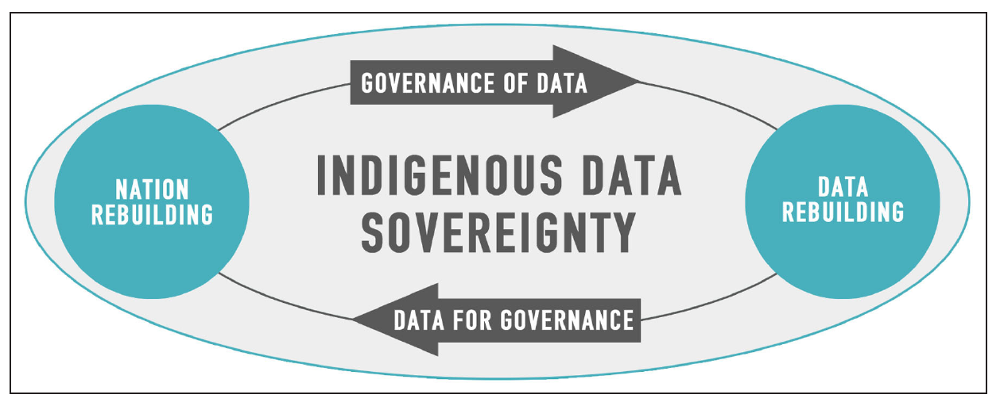

# CARE Data Principles, Indigenous data, Data related to Indigenous Peoples and Interest 

Authors (in alphabetical order): Sarah Barsness, Jewel Cummins, Maria
Victoria Fernandez, Ann Myatt James, Katie Pierce Farrier, Jonathan
Pringle, SR Carroll, Riley Taitingfong, Alex Wieker

Mentors: Wanda Marsolek, Shanda Hunt

Peer reviewers: An Garagiola; Sandi Caldrone; Matthew Harp

**Preferred citation:** Barsness, S., Cummins, J., Fernandez, M., James, A.,
Pierce Farrier K., Pringle, J., Carroll, SR. Taitingfong, R., &
Wieker, A. (2023). CARE Data Principles Primer. [Data Curation Network GitHub Repository.](https://github.com/DataCurationNetwork/data-primers)

## Abstract

|   Topic   |   Description   |
| :------------- | :------------- |
| Primary fields or areas of use | Data involving Indigenous Peoples, interests, lands, environments, resources, territories, traditions, cultures, archives, and histories are all subject to CARE principles.    Example fields:   <li>**Health Sciences**: Clinical, Public Health, Neuroscience, Biomedical Engineering</li><li>**Behavioral and Social Sciences:** Sociology, Demography, Economics, Anthropology, History, etc.</li><li>**Environmental:** Ecology, Natural or Environmental Resource Management, Botany</li> |
| Metadata standards | Metadata standards vary. Responsible practices include:   <li>Include <a href="https://localcontexts.org/labels/traditional-knowledge-labels/">Traditional Knowledge Labels</a> when appropriate.</li><li>Avoid culturally insensitive or problematic terminologies. Use preferred terms whenever possible. Suggested <a href="https://indigenouslis.ca/the-use-our-words-toolkit/">“Use Our Words” Toolkit.</a></li><li>Include acknowledgements of Indigenous contributions, ownership, and sovereignty in a README file.</li><li>See section on <a href="#examples-of-implementing-care">Examples of Implementing CARE</a>.</li> |
| Key questions for curation review | <li>Is there indication that the appropriate Tribal representative was contacted, fully informed, and consented to the research project?</li><li>Is your repository the most appropriate home for this data?</li><li>Is there a copy of a data use, data sharing, and/or data licensing agreement included?</li><li>Are there any permissions or access restrictions? If so, what are they and how can they be accommodated?</li><li>Is the Tribal or Indigenous affiliation appropriately acknowledged in the metadata and/or README? (Double check punctuation and spelling).</li> |
| Date Created | May 15, 2023 |
| Created By | Sarah Barsness - University of Minnesota  <a href="mailto:bars13@umn.edu">bars13@umn.edu</a>  <a href="https://orcid.org/0009-0007-4786-9298">https://orcid.org/0009-0007-4786-9298</a>  Jewel Cummins- University of Arizona Native Nations Institute <a href="mailto:jewelcummins@arizona.edu">jewelcummins@arizona.edu</a> <a href="https://orcid.org/0000-0002-7576-3905">https://orcid.org/0000-0002-7576-3905</a>  Maria Victoria Fernandez- University of Chicago  Ann Myatt James- George Washington University <a href="mailto:ajames31@gwu.edu">ajames31@gwu.edu</a> <a href="https://orcid.org/0000-0002-2137-7961">https://orcid.org/0000-0002-2137-7961</a>  Katie Pierce Farrier - University of North Texas Health Science Center  <a href="mailto:katie.pierce-farrier@unthsc.edu">katie.pierce-farrier@unthsc.edu</a> <a href="https://orcid.org/0009-0006-8559-0223">https://orcid.org/0009-0006-8559-0223</a>  Jonathan Pringle- University of New Mexico Health Sciences Library and Informatics Center  <a href="mailto:jpringle@salud.unm.edu">jpringle@salud.unm.edu</a>   <a href="https://orcid.org/0000-0001-6354-9971">https://orcid.org/0000-0001-6354-9971</a>  Stephanie Russo Carroll - University of Arizona, Native Nations Institute   <a href="https://orcid.org/0000-0002-8996-8071">https://orcid.org/0000-0002-8996-8071</a>   Riley Taitingfong- University of Arizona Native Nations Institute    Alex Wieker - University of Minnesota   <a href="mailto:wiek0008@umn.edu">wiek0008@umn.edu</a>  <a href="https://orcid.org/0000-0002-0606-4510">https://orcid.org/0000-0002-0606-4510</a>|
| Funding Acknowledgement | This project was supported by the National Library of Medicine of the National Institutes of Health under Award number U4LM012345. The content is solely the responsibility of the authors and does not necessarily represent the official view of the National Institutes of Health. |

# Table of Contents

[Summary/Scope](#summaryscope)

[Positionality Statement](#positionality-statement)

[A Note on Terminology](#a-note-on-terminology)

[Overview of Tribal Sovereignty](#overview-of-tribal-sovereignty)

[Building Relationships and Engaging with Indigenous Peoples](#building-relationships-and-engaging-with-indigenous-peoples)

[Introduction to CARE Principles](#introduction-to-care-principles)

[Examples of Implementing CARE](#examples-of-implementing-care)

[Pre-Curation Actions](#pre-curation-actions)

[Troubleshooting and Checklist for Data Curators](#troubleshooting-and-checklist-for-data-curators)

[Appendix A - Glossary of Terms](#appendix-a---glossary-of-terms)

[Appendix B - Recommended Resources by Section](#appendix-b---recommended-resources-by-section)

[Bibliography and Further Reading](#bibliography-and-further-reading)

# Summary/Scope

The CARE Principle Data Primer is intended to provide an introduction to the CARE Principles for Indigenous Data Governance (Collective benefit, Authority to control, Responsibility and Ethics) and to explore broader topics of equitable data stewardship. The primer will guide information professionals and researchers in understanding Tribal sovereignty, cultural context, and the historical misuse of Indigenous data. Resources will include appropriate labeling of traditional knowledge practices, modern day Tribal reservation locations, and ways to provide culturally responsive data access and use. While the ethics and standards discussed in this primer focus on CARE principles specific to Indigenous communities residing in the contemporary United States, these principles are applicable across many fields of research and communities.

# Positionality Statement 

Stephanie Russo Carroll, DrPH, MPH, is Ahtna, a citizen of the Native Village of Kluti-Kaah in Alaska, and of Sicilian descent and lives and works in Chukson on O’odham and Yaqui lands. She is an associate professor at the University of Arizona. Stephanie directs the
[Collaboratory for Indigenous Data Governance](https://indigenousdatalab.org/), co-edited the book [*Indigenous Data Sovereignty and Policy*](https://doi.org/10.4324/9780429273957) and co-led the publication of the ‘[CARE Principles for Indigenous Data Governance](https://www.gida-global.org/care)’.

Sarah Barsness, Katie Pierce Farrier, John Pringle and Alex Wieker are settlers and not affiliated with any Tribal Nations. As co-conspirators and contributors to this project, we have sought to learn from and share the work of Indigenous researchers and their expertise in data curation and sovereignty.

We are grateful to the co-authors and collaborators of this primer, both Indigenous and not, who gave to us so generously of their time and knowledge.

# A Note on Terminology

Throughout this primer and in the linked resources, there is a wide range of terminology used to refer to Indigenous, Aboriginal, Native, First Nations, Metis, and Inuit Peoples. Indigenous Peoples are not a monolith and the connotations, acceptance, and accuracy of these terms depend on the context and the specific community or group involved.

For the purpose of this primer, we acknowledge that no single term is universally applicable. This is because this primer is written from U.S. centered lenses and focuses on the history, context, and policies within the U.S. Accordingly, this primer often uses the word ‘community’ to denote the group(s) of Indigenous Peoples potentially involved or impacted by the collection, use, or sharing of data.The term ‘community’ is used to be inclusive of the intersectional, multilayered, multidimensional ways a group may identify as Indigenous. The term we use most often is ‘Indigenous Peoples’ to acknowledge the varied cultures and groups and to align with the verbiage used by [Global Indigenous Data Alliance](https://www.gida-global.org/). For more information and guidance about terminology please see [University of British Columbia Indigenous Peoples: Language Guidelines](https://indigenous.ubc.ca/indigenous-engagement/featured-initiatives/indigenous-peoples-language-guideline/). This terminology guide was selected because it is more comprehensive and
centers Indigenous advocacy.

# Overview of Tribal Sovereignty 

## Definition of Tribal Sovereignty

The United Nations reaffirms the inherent right of Indigenous Peoples “to promote, develop and maintain their institutional structures and their distinctive customs, spirituality, traditions, procedures, \[and\] practices” (United Nations, 2007). The concept of Tribal sovereignty shares its foundations with broader ideas of socio-political sovereignty. Tribal sovereignty extends sovereignty to unique Indigenous nations (whether that nation be rooted in culture, geography, or other unifying factors) and has a right to self-government and self-determination (Cobb, 2005). When conducting research with Indigenous Peoples, researchers must understand and respect Tribal sovereignty, which references Indigenous Peoples’ rights. Additionally, Tribal governments have a responsibility to their communities to protect their homeland, people, cultural traditions, and intellectual patrimony (Harding et al., 2012). By recognizing Tribal sovereignty, researchers uphold Indigenous Peoples right to self-determination and the continuation of their cultural and spiritual identities (Cobb, 2005). Tribes are sovereign governments and researchers must adhere to Tribal laws, regulations, policies, and wishes.Tribal sovereignty has been established in numerous judicial and legislative decisions, most notably in Worcester v. The State of Georgia which described Indigenous Peoples as “distinct political communities, having territorial boundaries, within which their authority is exclusive, and having a right to all the lands within those boundaries, which is not only acknowledged, but guaranteed by the United States” (1832).

At present, there are 574 federally recognized Tribes in the United States (U.S. Department of Indian Affairs, 2022), approximately 60 state-recognized Tribes, and hundreds more that are unrecognized by federal or state governments, including Indigenous Peoples in Federated States of Micronesia, Guam, Hawaii, Marshall Islands, Northern Mariana Islands, Palau, Puerto Rico, and Samoa. Regardless of federal recognition, when engaging with Indigenous communities, researchers must recognize the sovereignty, rights, and interests of Indigenous Peoples.

## Past Violations of Tribal Sovereignty by Researchers 

Tribal Nations and Indigenous Peoples have been historically excluded, marginalized, and mistreated by researchers, academic institutions, and government bodies. Such abuses include but are not limited to misrepresentation, stereotyping, generalizing Tribal identity, and negatively framing and disregarding cultural identity and beliefs, which has caused significant harm and led to Tribal communities not trusting the research community (Saunkeah et al., 2021). Historically, research communities have disregarded the ethical imperative of informed consent and misled Indigenous People on the research they are conducting, how they plan to use collected data, and possible future uses of their data.

For example, during the Cold War, Kaare Rodahl was contracted by the US government to learn from Indigenous Peoples of Iñupiaq and Gwich’in in preparation for potential combat in extremely cold environments (Lanzarotta, 2020). Rodahl had developed relations with the Tribes by offering medical advice, medicines, and vaccinations. However, he took advantage of this relationship. Rodahl instructed Indigenous People to ingest Iodine-131, which they believed was medication; instead the iodine was in fact used for a thyroid function study without their consent (Lanzarotta, 2020). It was later determined that the thyroid function study caused physical harm to
participants due to radiation exposure. Ultimately, the actions of Rodahl and researcher colleagues did more than cause physical harm,
their actions also caused psychological distress (Lanzarotta, 2020).

An Arizona State University (ASU) study provided another example of abuses of research ethical standards and norms of behavior in US human subjects research. In 1989, members of the Havasupai Tribe consented to providing blood samples for a diabetes study. Later, without informed consent for the activities, the researchers used the study to research mental illness and proposed theories on the origin of the Tribe that conflicted with Tribal creation stories and spiritual beliefs (Kelley et al., 2013). Eventually in 2010, the Havasupai Tribe and Arizona Board of Regents reached a settlement resulting in financial compensation and return of the Tribe’s DNA samples (Garrison, 2013). However, the resulting mistrust had long term effects on the Tribes’ willingness to participate with research projects in Arizona. The Havasupai Tribe barred ASU researchers and employees from the reservation and halted all research, and the Navajo Nation passed a moratorium on genetic research within their boundaries (Garrison, 2013).

The thyroid function study and the diabetes study are only two examples of research malpractice conducted by the research community with Indigenous Peoples. Past violations of trust and consent reinforce the belief that research done on Indigenous Peoples is an extension of colonialism and does not benefit Indigenous Peoples (Kelley et al., 2013). Researchers should be mindful of the history and past wrongs when engaging in research with Indigenous Peoples.

When researchers are addressing areas of historical trauma and harm, building trust can begin with recognition of those past harms. Where appropriate, consider including acknowledgments. Acknowledgements can happen in different ways and at different times, so decisions about
acknowledgements should be thoughtful and respect community priorities and needs.

## Contemporary Research Relationships 

While the research community has been admonished for research malpractice in the 20th century, Tribal sovereignty still continues to not always be recognized. The research community continues to subvert the fundamental rights of Indigenous Peoples by depicting, defining, and narrating Indigenous culture in ways that conflict with their knowledge systems, beliefs, and oral traditions (Emanuel & Bird, 2022). When research propagates colonial narratives, it causes harm to Tribal communities because Tribal sovereignty is not recognized and Indigenous voices are ignored (Emanuel & Bird, 2022). Additionally, researchers should acknowledge the use of Indigenous Knowledge Systems
when utilizing or building upon Indigenous knowledge systems in their research. In order that research aligns with Indigenous values, knowledge systems, and oral traditions, it is important that researchers build relations with Tribal communities and allow them to have oversight on research.

# Building Relationships and Engaging with Indigenous Peoples 

Building strong relationships with Tribes is critical to promoting the CARE Principles for Indigenous Data Governance. It is essential to establish respectful relationships with Tribal communities that support capacity development, increase community data capabilities, and embed data within Indigenous languages and cultures (Carroll et al., 2020). Key concepts to relationship building include respect, relevance, reciprocity, and responsibility (Kirkness and Barnhardt, 1991), a reconciliatory framework that underpins the aspirational goals shared by everyone involved in the collaboration.

To better build relationships with Tribes, researchers should recognize the diversity of Tribal communities and their unique histories, cultures, and values. Indigenous Peoples are the experts of the particular and heterogenous traditions, customs, and data practices they steward. Respectful relations require actively learning about the histories and cultures of particular nations and communities and honoring their practices of self-identification.

Another important aspect of engaging with Tribes is establishing effective communication channels. This necessitates identifying key individuals within the Tribal community, such as Tribal leaders, cultural experts, and community members, and establishing regular communication with them. This may involve identifying and engaging through community defined communication channels, such as through Tribal councils, elders, or cultural intermediaries.

In addition, researchers are responsible for understanding, respecting,and adhering to community protocols for data access and use, including data management plans and data sharing agreements with Indigenous communities. Protocols developed in collaboration with the Tribal community ensure they reflect Indigenous values and priorities. Researchers should work with community partners to identify and uphold Indigenous data management and sharing practices and preferences, and safeguard against risk by following community protocols for future data access and sharing.

Researchers should recognize the importance of building long-term relationships with Tribes. This may involve investing time and resources in building trust and rapport with the community, as well as establishing ongoing partnerships and collaborations. Researchers can work with Tribal leaders and community members to identify areas of mutual interest and develop projects and initiatives that benefit the community and build local capacity.

Ultimately, building relationships with Tribes requires a commitment to ethical and respectful data practices and a willingness to approach these relationships with humility, respect, and a readiness to listen and learn. By doing so, we can promote the CARE Principles for Indigenous Data Governance and ensure that data is used in ways that advance Indigenous Peoples’ self-determination and collective benefit.

Adhering to the CARE Principles requires researchers to go beyond the minimum standards for ethical and informed research. Funders and institutions require researchers to comply with federal, Tribal, state, or local policies, but that may not be enough. “By only addressing consent and not cultural concerns, research will fail to achieve justice for those communities participating in research” (Garrison, 2013, pg. 206). Such policies may address informed consent, but they do not consider the historical trauma, context, and mistrust these communities experience.

# Introduction to CARE Principles 

## Indigenous Data Sovereignty

Indigenous Peoples have been data collectors, users, stewards, and scientists since time immemorial, conveying protocols, practices, and principles through knowledges and knowledge systems (NCAI 2018, p. 1). For example, many Indigenous knowledge systems are based on generations of gathered data compiled through experience and observation that inform Indigenous protocols, practices and ways of relating and interacting with the natural world and other peoples (Carroll et al. 2019). These data are evidenced in winter counts, calendar sticks, oral histories, totem poles, and other instruments storing information to benefit entire communities (Rodriguez-Lonebear 2016; Carroll et al. 2019).

Indigenous data and knowledge systems ensure Indigenous ways of being, knowing, and doing. This information is transmitted across and amongst generations. Within this context, knowledge belongs to the collective with individuals having responsibilities and roles to steward this knowledge (Cajete 2000; Carroll et al. 2019). Therefore, Indigenous data includes tangible and intangible data, information, biospecimens, and knowledges about Indigenous Peoples as individuals and collectives, about their governments, and about non-humans, such as water, animals, and air, to which they relate (Carroll et al. 2019; Nickerson 2017).

Tribal sovereignty includes Indigenous Peoples’ inherent sovereignty over data and traditional knowledge systems created by Indigenous Peoples, as well as data collected about, from, or involving Indigenous Peoples and their interests. Indigenous Data Sovereignty (IDS) “is the right of Indigenous Peoples and Tribes to govern the collection, ownership, and application of their own data” (Rainie et al. 2017). For example, Indigenous Peoples have sovereignty over collected biomedical data that tracks disease prevalence, just as they have sovereignty over ecology data collected about flora and fauna found on Indigenous territories. Rooted in Indigenous Peoples’ inherent sovereignty and right to govern their lands, resources, and peoples (Support of US Indigenous Data Sovereignty and inclusion of Tribes in the development of Tribal Data, 2018), IDS is enacted only by Indigenous Peoples, nations or communities. Non-Indigenous nations, communities, peoples, or entities cannot implement IDS because it is not theirs to practice.

## Indigenous Data Governance

Indigenous Data Governance (IDG) is a mechanism through which Indigenous institutions, communities, nations can enact IDS. “Governance of data is an extension of the rights and practices that originate in the sovereignty of nation states”(Carroll et al. 2019, p. 4). IDG applies Indigenous principles, frameworks, and values to the control and stewardship of Indigenous data throughout the data lifecycle and across data ecosystems (Carroll et al. 2019; Rainie et al. 2017, Walter et al. 2018). IDG is crucial to upholding IDS. Such ecosystems include the interacting systems, infrastructures or applications used in capturing, analyzing, storing, and preserving data.

At its core, IDG is the “power to decide how and when Indigenous data are gathered, analyzed, accessed, and used” (Walter et al. 2018, p. 3). The implementation of IDG is a fluid process that evolves as data are decolonized, new data are created, technology advances, and Tribal government activities change (Carroll et al. 2019). IDG is interrelated with the processes of decolonizing data whereby “external, non-Indigenous norms and priorities” are replaced with Indigenous principles and frameworks defining data and informing how it is collected and used (Carroll et al. 2019).

Governance of data and data for governance form a reciprocal relationship underpinning IDG. Governance of data is about the ownership and control of data and involves answering the question “can Native nations manage, protect, and use that data?” (Carroll et al. 2019, p. 5). Data for governance is the quality, access and relevance of data and involves answering the question “can Native nations obtain the data they need for governance?” (Carroll et al. 2019, p. 5). The CARE Principles provides high level, minimal guidance to inform this reciprocal relationship to aid in nation building and decolonization of data. As Indigenous communities work to rebuild governance institutions and increase their capacity to govern their data, the community “facilitates stronger evidence-based decision-making” (Carroll et al. 2019, p. 5). This rebuilding involves implementing “mechanisms to honor, protect, and control their information both internally and externally,” thereby working to decolonize their data (Carroll et al. 2019, p. 5).

<figure>  <figcaption>*Image from Carroll, Rodriguez-Lonebear, & Martinez, 2019.*</figcaption> </figure>

## About CARE Principles

The CARE Principles are a series of four concepts which include Collective Benefit, Authority to Control, Responsibility, and Ethics. They are the result of Indigenous Peoples’ efforts worldwide to recognize and uphold their sovereignty, rights, and cultural traditions. The high level principles reinforce and expand upon Tribal sovereignty by directing those interacting with Indigenous data to engage with the communities that relate to those data.

In 2018, Stephanie Russo Carroll and Maui Hudson organized the “Indigenous Data Sovereignty Principles for the Governance of Indigenous Data” workshop to draft the CARE principles (Carroll, et al., 2020). Contributors included the Research Data Alliance (RDA) International Indigenous Data Sovereignty Interest Group, US Indigenous Data Sovereignty Network, Te Mana Raraunga Māori Data Sovereignty Network, and Maiam nayri Wingara Aboriginal and Torres Strait Islander Data Sovereignty Collective communities (Carroll, et al., 2020).

The FAIR Data Principles is about making data findable, accessible, interoperable, and reusable. While FAIR seeks to make data more open and machine actionable (GO FAIR, 2023), the CARE Principles provide a framework for respecting cultural boundaries when sharing data and prioritizing Indigenous Data Sovereignty.

CARE Principles pertain to and should be applied from initial planning and collection to long term preservation and future uses. Indigenous data goes beyond information collected about individuals. Data involving Indigenous interests, lands, environments, resources, territories, traditions, cultures, archives, and histories are all subject to CARE principles (Carroll et al., 2021).

The [Global Indigenous Data Alliance](https://www.gida-global.org/care) provides more information about Indigenous data sovereignty and the CARE principles, as well as Indigenous Peoples’ Rights in Data.

Below, we explain the CARE principles in more detail, and offer reflection points after each step. These considerations may be beyond a curator's control, as questions may be most appropriately asked at the beginning of the research process. However, we encourage all involved with the research lifecycle to consider these questions from different perspectives, and how their role impacts the flourishing, self-governance, and well-being of Indigenous communities.

### Collective Benefit

Collective Benefit refers to maximizing potential benefits for the communities impacted or involved in the collection, use, or sharing of data. Communities must be able to use the data to generate value within their own communities. Data and its benefits should be grounded in the community’s values and be used to improve the community’s wellbeing.

Data ecosystems shall be designed and function in ways that enable Indigenous Peoples to derive benefit from the data including:

- For inclusive development and innovation

- For improved governance and citizen engagement

- For equitable outcomes (Carroll, et. al, 2022, p. 4)

> **Ask yourself:** Does the collection, use, and sharing of this data empower the community to make self-directed, informed decisions that further the communities’ well-being?

### Authority to Control

Authority to Control refers to Indigenous Peoples’ right to dictate what data is collected, how it is used, and under what circumstances it is shared and preserved. This includes data about people, land, resources, territories, cultural knowledge, and traditions. In other words, Authority to Control involves communities in the development of data collection policies and protocols.

Indigenous Peoples’ rights and interests in Indigenous data must be recognized and their authority to control such data respected including:

- Recognizing rights and interests

- Data for governance

- Governance of data (Carroll, et. al, 2022, p. 4)

> **Ask yourself:** Has the community been fully informed and consented to plans and processes regarding the collection, future use, and sharing of this data? Have they had the opportunity to participate in creation and implementation of protocols? Will the data be returned or shared with the community? Will access to the data be controlled in ways that respect the laws, cultural practices, views, and wishes of the community?

### Responsibility 

Responsibility means that the Collective Benefit and Ethical use of data should be evident and meaningful. Responsibility includes sustainable, mutually beneficial relationships that expand the capability and capacity of the community that relate to that data, empowering them to collect, steward, use, and preserve their own data.

Those working with Indigenous data have a responsibility to share how those data are used to support Indigenous Peoples’ self-determination and collective benefit including:.

- For positive relationships

- For expanding capability and capacity

- For Indigenous languages and worldviews (Carroll, et. al, 2022, p. 4)

> **Ask yourself:** What is being done to support the involved community as they create, collect, manage, and steward their own data? Is the collection, use, and sharing of this data part of a sustainable, reciprocal relationship that respects the views and experiences of the community?

### Ethics 

Going beyond the principles of Collective Benefit, Ethics prioritizes Indigenous Peoples’ rights and well-being, as determined by their ethical frameworks and values. Using external ethical frameworks, or portraying Indigenous Peoples’ cultures and knowledge as deficits violates the rights affirmed in the United Nations Declaration on the Rights of Indigenous Peoples (United Nations, 2007). Ethical data addresses and accounts for the power and social imbalances that hinder Indigenous communities from fully asserting their rights and interests.

Indigenous Peoples’ rights and wellbeing should be the primary concern at all stages of the data life cycle and across the data ecosystem including:

- For minimizing harm and maximizing benefit

- For justice

- For future use (Carroll, et. al, 2022, p. 4)

> **Ask yourself:** From the perspective and ethical values of the involved community, what are the potential benefits and harms of collecting, using, or sharing these data now and in the future? Does the data play into harmful stereotypes and stigmas or does it empower the community to assert their rights and interests? Are the provenances, purposes, and use limitations stated in the metadata? Do metadata standards incorporate the Indigenous communities values and concepts?

# Examples of Implementing CARE 

When determining how best to implement and adopt the CARE principles, it is important to view the standard as *descriptive* rather than *prescriptive* in its methodological application. Meaning, there are a wide range of approaches that institutions can apply to meet their objectives vis-a-vis adherence to the CARE principles. Decisions around specific approaches will seldom be done in isolation; meaningful collaboration with Indigenous communities at the center of the data is critical to a project’s successful application, sustainability, and benefit.

Best practices for effective collaboration often include observations and/or promotion of mutual benefits for non-Indigenous and Indigenous individuals engaged in the collaboration (Joffrion and Hernandez, 2015). Related standards that support this and the CARE principles have focused on reciprocal tasks to be undertaken by *both* Indigenous communities and non-Indigenous partners wishing to collaborate (First Archivist Circle, 2006). Other approaches put the onus on non-Indigenous institutions to reconcile with and redress historic harm and trauma through demonstrable actions to (re)establish trust (Steering Committee on Canada’s Archives, 2022). Such standards speak to the CARE principles and how each of the sections within CARE--while presented in divisible units--can comprise a myriad of methodological approaches that simultaneously and uniquely address collective benefit, authority, responsibility, and ethics.

## Collective Benefit

Research has demonstrated improvements in health outcomes when communities have access to culturally relevant health information (Vincze et. al 2021, Barnabe 2021), with other research showing additional benefits (i.e., engagement & empowerment) when communities participate in addressing health information needs (Hartfield et. al 2018). Housed at the University of New Mexico’s Health Sciences Library & Informatics Center (HSLIC), the [*Native Health Database*](https://nativehealthdatabase.net/) contains bibliographic information and abstracts of health-related articles, reports, surveys, and other resource documents pertaining to the health and health care of American Indians, Alaska Natives, and Canadian First Nations. The database provides information for the benefit, use, and education of organizations and individuals with an interest in health-related issues, programs, and initiatives regarding North American Indigenous peoples (Native Health Database, 2023). It has recently migrated to a platform that provides communities with tools to engage and collaborate in this information exchange, helping shape a resource that can more appropriately respond to the needs of the audience it seeks to benefit.

## Authority to Control

The systems in which information is exchanged often dictate authority and codify power. Without appropriate mechanisms in place, the flow of information can go unchecked and ultimately promulgate dominant narratives - at the exclusion of those in the margins. Washington State University’s Center for Digital Scholarship and Curation collaborated with the Warumugu Indigenous Peoples of Australia in developing the open source [*Mukurtu CMS*](https://mukurtu.org/) (Content Management System), which centers Indigenous control over the exchange of resources.

Within these principles, the concept of Authority to Control means that communities can apply unique cultural protocols that dictate who can specifically see certain content (or its metadata). For example, a community can apply a protocol dictating that content cannot be viewed until formally reviewed by specifically-identified members of that community. Another protocol could state that some items should not be viewed by anyone below a certain age and/or that a person of a particular gender should not view some content. Similarly, [Local Contexts](https://localcontexts.org/) has created a range of Traditional Knowledge (TK) and Biocultural (BC) Labels for communities to apply to content. The Labels attribute cultural authority of heritage and data to knowledge and help Indigenous communities gain control over how their data is collected, managed, displayed, accessed, and used in the future (Local Contexts, 2023).

## Responsibility

The systems of knowledge that provide structure for and to Indigenous data should be supported through the concepts of respect, responsibility, and reciprocity. Responsibility connotes a sense of ownership or awareness on the history (and impact) of colonialism and pivoting towards restoration of justice for Indigenous peoples, including the establishment of fair and just reciprocal relationships between the holding institutions and the Indigenous peoples who created the original expressions (Littletree et al., 2020). For example the Oklahoma State University (OSU) College of Medicine at Cherokee Nation is the nation’s only Tribally affiliated medical school. The Cherokee Nation continues to be heavily involved in the administration and funding of the medical college. The organization is built on the Cherokee Reservation and is largely funded by the nation. The college is guided by Cherokees education philosophies and is a dedicated investment to the next generation (Oklahoma State University, 2022).

## Ethics

Trauma-informed practice considers that individuals have likely experienced trauma and that trauma affects all parts of a person’s life (Dudak, 2023). Ethical approaches to Indigenous data should consider both the individual and the collective, historic trauma for these communities and embed approaches and tools that maximize benefit while reducing harm. This includes considerations for how materials are accessed--both intentionally and accidentally--and the ways in which both materials and peoples are described.

People-first language is one extension of this; the way communities are represented in literature then categorized through bibliographic records and metadata can easily re-traumatize. The Government of British Columbia has created a *Writing Guide for Indigenous Content* that touches on creating content that respects the cultural integrity of Indigenous Peoples, including the choice of terminology; the use of Indigenous names; and how to avoid possessive terms and other harmful framing (Government of British Columbia, 2023). Others exist as well. Many advocates support simply inquiring with the source community about identifying a term that is appropriate for the work being created or described. Using accurate terms specific to the community promotes cultural sensitivity and understanding and can prevent stereotyping (Native Knowledge 360, 2023). See Section B for examples of authoritative lexicons.

# Pre-Curation Actions 

Key information is needed from researchers to understand how the CARE principles have been integrated into the research project and its resulting data. Before publishing Indigenous data in your repository, data curators should identify key pieces of information such as:

- Verify that the researcher has contacted a representative or official from the Tribe or community.

- Verify that clear, explicit permissions were obtained to conduct the research project. Communications should include data ownership, future uses, access restrictions, and permissions.

- Confirm any agreements or obligations that require moderating access to data, acknowledgements, or licensing details that should be included in the collection’s metadata. Include relevant information in the metadata.

Example of Metadata language:

- “The Grand Portage Band of Lake Superior Chippewa (GPBLSC) is a sovereign indigenous nation that owns the data shared here. Those data are protected under the principles of data sovereignty and are shared under a data sharing and ownership agreement with the University of Minnesota for analysis and publication of scientific products. See the ReadMe.txt file for more information about licensing and reuse of this data”( Severudet al., 2022).

Example of repository procedures:

- The Data Repository for the University of Minnesota has an automated email for every DRUM submission which alerts the submitter that the data was received. In that email are additional instructions: “If you submitted data that was collected from, with, or about a Tribal agency please provide documentation about who owns the data. We seek to apply the [CARE Principles](https://www.gida-global.org/care) of Collective Benefit, Authority to Control, Responsibility, and Ethics.”

# Troubleshooting and Checklist for Data Curators

The data curation process is an important opportunity to review the application of CARE principles within a dataset, to determine its quality and appropriateness. The CARE Principles CURATED checklist provides data curators with a starting point for reviewing and remediating issues. When the checklist is insufficient to deal with problems identified, the data curator should work with members of impacted communities wherever possible, as well as researchers and leaders within their institution to create a plan that remediates harms caused, reduces future harms, and respects Tribal data sovereignty.

Adapted from the [CURATED steps and checklists](https://datacurationnetwork.org/outputs/workflows/) and [Human Participants Data Primer](https://github.com/DataCurationNetwork/data-primers/blob/master/Human%20Participants%20Data%20Essentials%20Data%20Curation%20Primer/human-participants-data-essentials-data-curation-primer.md#appendix-c-human-participant-curated-checklist) from the Data Curation Network.

## Check files and read documentation

- Review participant agreement and data use agreements. Consider:

  - Are current and potential future uses clearly stipulated

  - Indigenous interests including lands, environments, resources, territories, traditions, cultures, archives, and histories

  - Tribal consent to the storage, duration, and access to the data.

- If agreements and consents are not specific and clear, document for the “Request” step.

## Understand the data

- Understand the type of data submitted and the likelihood of whether it was obtained using informed consent, a consent information sheet, participant agreement, data use agreement, or nothing.

- Understand access restrictions that may need to be created to respect Tribal data ownership and sharing stipulations.

## Request missing information or changes

- Request the consent form or agreement(s) if it was not submitted with the data, but you believe the data may have been obtained with one.

- Request to view the data agreement with the Tribal agency.

- If necessary, request that the research team consult with appropriate Tribal leadership or representatives. The research team may also need to consult with an ethics board specializing in Indigenous interests or Tribal institutional review board (IRB).

  - [Indian Health Service IRB](https://www.ihs.gov/dper/research/hsrp/instreviewboards/)

  - [Guidelines for Researchers](https://naair.arizona.edu/sites/default/files/gachupin_altered.pdf) - List of independent Tribal IRBs page 24

## Augment metadata for findability

- Include in the metadata a log of conversations with the Tribal representative on consent, use, and de-identification.

- Augment the internal record with a copy of the consent form or agreement(s).

- Include acknowledgements for the involved communities.

- Detail use limitations and reasoning. If applicable, include contact information for obtaining use permissions.

  - See *SHARING/ACCESS INFORMATION* in the README file of the [example shared dataset](https://hdl.handle.net/11299/225296).

## Transform file formats for reuse

- Transform consent form or agreement(s) to a text or pdf file for preservation.

- Propose open source or more reusable formats when appropriate

## Evaluate for CARE

- Evaluate the record to ensure that it respects Indigenous sovereignty and rights. This means that the consent process is documented either internally as part of the repository’s metadata record or publicly as part of the readme file. Use limitations are clearly stated and explained, and Tribal contributions and participation are acknowledged.

- Evaluate that language used is free of harmful or racist stereotypes and avoids portraying individuals or communities as a deficit.

# Appendix A - Glossary of Terms

**Cultural Humility** – a framework for understanding cultural differences. A lifelong effort to evaluate one’s own cultural identities and beliefs, learn about other cultures, and recognize the individual and systemic power imbalances across different cultures.

**Data ecosystems** – the tools, systems, and infrastructures used to collect, store, share, and preserve data.

**Decolonize/decolonization** – the continual journey of dismantling the political, cultural, and economic systems created by and for the benefit of colonizers and reclaiming the practices, languages, and cultural norms of Indigenous Peoples prior to colonization.

**FAIR Data Principles** – increasing the Findability, Accessibility, Interoperability, and Reusability of digital assets to promote open science, open data, and open access. FAIR focuses on increasing machine actionability to increase the speed of creating and using data.

**Indigenous** – native to and inhabiting an area before the arrival of colonists and/or peoples

**Indigenous Peoples** – peoples and communities who self-identify as Indigenous.

**Indigenous Data Governance (IDG)** – mechanisms for how Indigenous People assert sovereignty over the collection, use, sharing, and preservation of their data for the benefit of their communities.

**Indigenous Data Sovereignty (IDS)** – the right of Indigenous Peoples to govern collection, use, sharing, and preservation of data about them or their interests

**Participatory Research** – research that includes community stakeholders in efforts that prioritize that community’s needs, cultures, and concerns. Community stakeholders take an active role in providing context, designing the methodology, and the execution of a research project. This research approach is also known as community based participatory research or participatory action research.

**Traditional Knowledge** – Indigenous knowledge systems based in traditional and cultural practices

**Sovereignty** – the inherent right of a state to govern themselves. Tribal sovereignty refers specifically to the right of Indigenous nations, Tribes, and communities to govern themselves.

# Appendix B - Recommended Resources by Section

## A Note on Terminology

[University of British Columbia Indigenous Peoples’ Language Guide](https://indigenous.ubc.ca/indigenous-engagement/featured-initiatives/indigenous-peoples-language-guideline/) - Provides researchers information to facilitate their navigation of terminologies and meanings associated with Indigenous People to promote and ensure respective, culturally responsive communications.

[Writing Guide for Indigenous Content](https://www2.gov.bc.ca/gov/content/governments/services-for-government/service-experience-digital-delivery/web-content-development-guides/web-style-guide/writing-guide-for-indigenous-content) - This guide is to help writers create content that respects the cultural integrity of Indigenous Peoples and enables writers to find terminology, grammar, names, and spellings.

## Overview of Tribal Sovereignty

[Tribal Leaders Directory and List of Federally Recognized Tribes](https://www.bia.gov/service/tribal-leaders-directory) - Directory of contact information for federally recognized Tribes located in the United States developed by the Bureau of Indian Affairs.

[National Congress of American Indians’ Tribal Directory](https://www.ncai.org/tribal-directory) - An online directory which currently includes listings of Tribal members, associate organizations, Tribal organizations, and Alaska Native Corporations.

[Native Land Digital](https://native-land.ca/) - A Canadian, Indigenous-led nonprofit organization which provides an interactive map of historically Indigenous lands and territories

## Brief Introduction to Engaging with Indigenous Peoples

[Guiding Principles for Engaging in Research with Native American Communities](https://hsc.unm.edu/vision2020/common/docs/guiding_principles_research_native_communities2012.pdf) - University of New Mexico – Intended to provide guidance on challenges encountered in research relationships and processes, prompt thoughtful conversation amongst researchers, and increase awareness of the investigators responsibilities to individuals and communities participating in research.

[Participatory Action Research and Evaluation](https://organizingengagement.org/models/participatory-action-research-and-evaluation/) - Models and resources on community-driven approaches to research, evaluation, and social change that intentionally include the people who are most affected by an inquiry in the design and execution of the process.

[SAR Guidelines for Collaboration](https://guidelinesforcollaboration.info/) - A collaboration between Native and non-Native museum professionals, cultural leaders. and artists intended to support the understanding, stewardship and care of collections.  
  
[Steps for Conducting Research and Evaluation in Native Communities](https://www.samhsa.gov/sites/default/files/nace-steps-conducting-research-evaluation-native-communities.pdf) -
Native American Center for Excellence– Explores the lessons and challenges of research and evaluation in Indigenous Peoples’ communities, identifies steps in conducting research and evaluation in these communities and offers personal stories of successful evaluation experiences.

[Washington University Effort to Improve Stewardship of Indigenous Data](https://ischool.uw.edu/news/2022/01/ischool-leads-effort-improve-stewardship-indigenous-data)- article about a project with UW Libraries and Information School to develop a framework for libraries and data repositories to ensure ethical care and stewardship of Indigenous research data.

## Indigenous Data Sovereignty and Governance

[Collaboratory for Indigenous Data Governance](https://indigenousdatalab.org/) - List of 32 Indigenous ethics documents developed by Indigenous Nations, communities, and working groups from around the world, used to guide analyses of federal research and Tribal engagement standards. The guide focuses on environmental and public health.

[Indigenous Peoples’ Rights in Data Flyer](https://www.gida-global.org/data-rights) - Online handout produced by the Global Indigenous Data Alliance which outlines a set of rights for Indigenous Peoples’ rights in data.

[Native Nations Institute](https://nni.arizona.edu/)- the leading research, education, and outreach organization supporting the nation-rebuilding efforts of Indigenous peoples worldwide as they seek to strengthen their internal governance capacities and realize their own political, economic, and community development objectives.

## About CARE Principles

[FAIR Data Principles](https://www.go-fair.org/fair-principles/) - Published guidelines to improve the Findability, Accessibility, Interoperability, and Reuse of digital assets. Principles emphasize machine actionability, the capacity of computer systems to find, access, interoperate, and reuse data with little or no human intervention.

[Global Indigenous Data Alliance
(GIDA)](https://www.gida-global.org/) - An international network dedicated to advancing Indigenous data sovereignty and governance, assert Indigenous peoples’ rights and interests in data, advocate for data for the self-determined wellbeing of Indigenous Peoples, and reinforce the rights to engage in decision-making in accordance with Indigenous values and collective interests.

## Applications of CARE

[American Indian College Fund’s Resource Center](https://resources.collegefund.org/) - Online repository of scholarly, non-scholarly, and administrative resources to further understandings of Native higher education, Tribal colleges and universities, and Indigenous students.

[Digital Archive of Indigenous Language Persistence (DAILP)](https://dailp.northeastern.edu/) - a community-based digital archive created with help from the Digital Scholarship Group at Northeastern University. This digital archive includes a repository of digital resources to support Indigenous Peoples’ knowledge, interpretations, and representations of the past.

[ICES Indigenous Portfolio](https://www.ices.on.ca/About-ICES/Collaborations-and-Partnerships/Indigenous-Portfolio) - a nonprofit research institute designed to engage, promote, and facilitate access to a diversity of Ontario’s health-related data. Indigenous Portfolio worked closely with Indigenous partners on topics, such as data governance, analysis, sharing, and preservation.

[Local Contexts](https://localcontexts.org/)- Local Contexts is a global initiative that supports Indigenous communities with tools that attribute cultural authority of heritage and data. By focusing on Indigenous Cultural and Intellectual Property and Indigenous Data Sovereignty, Local Contexts help Indigenous communities repatriate knowledge and gain control over how their data is collected, managed, displayed, accessed, and used in the future.

[Mukurtu Content Management System](https://mukurtu.org/) - Mukurtu (MOOK-oo-too) is a grassroots project aiming to empower communities to manage, share, and exchange their digital heritage in culturally relevant and ethically-minded ways. It is a free, mobile, and open source platform built with Indigenous communities.

[Native BioData Consortium](https://nativebio.org/about-us/) - a flagship 501c3 nonprofit research institute initiated and guided by Indigenous scientists and Tribal members. The organization is designed to ensure research and learning on genetics and health benefit all Indigenous Peoples. BioData samples are stored on sovereign native lands of the Cheyenne River Sioux Tribe.

[Native Land Information System](https://nativeland.info/) - Data and learning repository designed to help protect and defend Native lands for the benefit of Native peoples. Thematic areas of focus include agriculture, resource management, food systems, and lands/land tenure in the United States.

[Native Health Database](https://nativehealthdatabase.net/) - The Native Health Database contains bibliographic information and abstracts of health-related articles, reports, surveys, and other resource documents pertaining to the health and health care of American Indians, Alaska Natives, and Canadian First Nations.

[“Use Our Words” Toolkit](https://indigenouslis.ca/the-use-our-words-toolkit/) - For academic and public libraries conducting an evaluation of the subject headings in their catalogs in the decolonization process of removing culturally insensitive headings that cause harm to Indigenous communities. It includes a guide on finding problematic subject headings; suggested alternative terminologies; links to relevant resources; and training activities for cataloging staff.

# Bibliography and Further Reading 

Cajete, G. (2000). *Native Science: Natural Laws of Interdependence*. Santa Fe, NM: Clear Light Publishers.

Carroll, S. R., Garba, I., Plevel, R., Small-Rodriguez, D., Hiratsuka, V. Y., Hudson, M., & Garrison, N. A. (2022). Using indigenous standards to implement the care principles: Setting Expectations through Tribal research codes. *Frontiers in Genetics*, *13*. 1-10. https://doi.org/10.3389/fgene.2022.823309

Carroll, S., Garba, I., Figueroa-Rodriguez, O., Holbrook, J., Lovett, R., Materehera, S., Parsons, M., Raseroka, K., Rodriguez-Lonebear, D., Rowe, R., Sara, R., Walker, J., Anderson, J., & Hudson, M. (2020). The CARE Principles for Indigenous Data Governance. Data Science Journal, 19, 1–12. [https://doi.org/10.5334/dsj-2020-042](https://doi.org/10.5334/dsj-2020-042)

Carroll, S.R., Rodriguez-Lonebear, D. and Martinez, A. (2019). Indigenous Data Governance: Strategies from United States Native Nations. *Data Science Journal*, *18*(31), 1-15. <http://doi.org/10.5334/dsj-2019-031>

Cobb, A. (2005). Understanding Tribal Sovereignty: Definitions, Conceptualizations, and Interpretations. *American Studies*, *46*(3/4), 115–132. [https://www.jstor.org/stable/40643893](https://www.jstor.org/stable/40643893)

Dudak, L. (2023, February 14). *Working Toward Wellness: Exploring trauma-informed librarianship*. Library Journal. https://www.libraryjournal.com/story/Working-Toward-Wellness-Exploring-Trauma-Informed-Librarianship

Emanuel, R.E., & Bird, K.D. (2022). Stories We Tell: Unpacking Extractive Research and Its Legacy of Harm to Lumbee People. *Southern Cultures* *28*(3), 48-69. [doi:10.1353/scu.2022.0025](http://doi.org/10.1353/scu.2022.0025).

Garrison N. A. (2013). Genomic Justice for Native Americans: Impact of the Havasupai Case on Genetic Research. *Science, technology & human values*, *38*(2), 201–223. [https://doi.org/10.1177/0162243912470009](https://doi.org/10.1177/0162243912470009)

GO FAIR. (2022, January 21). *Fair principles*. GO FAIR. https://www.go-fair.org/fair-principles/

Government of British Columbia, M. of C. (2023, February 24). Writing Guide for Indigenous Content. https://www2.gov.bc.ca/gov/content/governments/services-for-government/service-experience-digital-delivery/web-content-development-guides/web-style-guide/writing-guide-for-indigenous-content

Harding, A., Harper, B., Stone, D., O'Neill, C., Berger, P., Harris, S., & Donatuto, J. (2012). Conducting research with Tribal communities: sovereignty, ethics, and data-sharing issues. *Environmental health perspectives*, *120*(1), 6–10. https://doi.org/10.1289/ehp.1103904

Kelley, A., Belcourt-Dittloff, A., Belcourt, C., & Belcourt, G. (2013). Research ethics and Indigenous communities. *American Journal of Public Health*, *103*(12), 2146–2152. [https://doi.org/10.2105/ajph.2013.301522](https://doi.org/10.2105/ajph.2013.301522)

Lanzarotta T. (2020). Ethics in retrospect: Biomedical research, colonial violence, and Iñupiat sovereignty in the Alaskan Arctic. *Social studies of science*, *50*(5), 778–801. [https://doi.org/10.1177/0306312720943678](https://doi.org/10.1177/0306312720943678)

Local Contexts. (2023). *Grounding Indigenous Rights*. Local Contexts – Grounding Indigenous Rights. Retrieved April 17, 2023, from https://localcontexts.org/

Native Health Database. (2023). *Native health database*. Native Health Database. https://nativehealthdatabase.net/

Native Knowledge 360. (2023). *The Impact of Words and Tips for Using Appropriate Terminology: Am I Using the Right Word?*. Smithsonian . https://americanindian.si.edu/nk360/informational/impact-words-tips

Nickerson, M. (2017) First Nations’ Data Governance: Measuring the Nation-to-Nation Relationship. *British Columbia First Nations’ Data Governance Initiative.* [https://static1.squarespace.com/static/558c624de4b0574c94d62a61/t/618c60f2abd843215add85cf/1636589811532/NATION-TO-NATION_FN_DATA_GOVERNANCE\_-\_FINAL\_-\_EN.pdf](https://static1.squarespace.com/static/558c624de4b0574c94d62a61/t/618c60f2abd843215add85cf/1636589811532/NATION-TO-NATION_FN_DATA_GOVERNANCE_-_FINAL_-_EN.pdf)

Oklahoma State University . (2022, May 9). *College of Medicine at the Cherokee Nation*. OSU COM at the Cherokee Nation . https://medicine.okstate.edu/cherokee/

Rainie, S. C., Rodriguez-Lonebear, D., & Martinez, A. (2017, January 1). *Policy brief: Data governance for native nation rebuilding*. Native Nations Institute. Retrieved April 13, 2023, from https://nni.arizona.edu/publications/policy-brief-data-governance-native-nation-rebuilding

Rodriguez-Lonebear, D. (2016). Building a data revolution in Indian country. In: Kukutai, T and Taylor, J (eds.), *Indigenous data sovereignty: Toward an agenda*, pp. 253–272. Canberra, Australia: Australian National University Press. DOI: https://doi.org/10.22459/CAEPR38.11.2016.14

Saunkeah, B., Beans, J. A., Peercy, M. T., Hiratsuka, V. Y., & Spicer, P. (2021). Extending Research Protections to Tribal Communities. *The American journal of bioethics : AJOB*, *21*(10), 5–12. [https://doi.org/10.1080/15265161.2020.1865477](https://doi.org/10.1080/15265161.2020.1865477)

Severud, W., Petz Gigure, M., Walters, T., Garwood, T., Teager, K., Marchetto, K., Oliveira-Santos, L.G.R., Moore, S., Wolf, T.. (2022). R code and data for "Terrestrial gastropod species-specific responses to forest management: implications for Parelaphostrongylus tenuis transmission to moose". Retrieved from the Data Repository for the University of Minnesota, [https://doi.org/10.13020/dhhw-cy54](https://doi.org/10.13020/dhhw-cy54).

Support of US Indigenous Data Sovereignty and inclusion of Tribes in the development of Tribal Data, KAN-18-011, Mid-Year National Congress of American Indians (2018). Retrieved April 17, 2023, from https://www.ncai.org/resources/resolutions/support-of-us-indigenous-data-sovereignty-and-inclusion-of-tribes-in-the-development-of-Tribal-data

U.S. Department of Indian Affairs. (2022). Tribal Leaders Directory. Retrieved April 13, 2023, from https://www.bia.gov/service/Tribal-leaders-directory

United Nations . (2007, September 13). *United Nations declaration on the rights of indigenous peoples*. 107th plenary meeting. Retrieved April 13, 2023, from https://www.un.org/development/desa/indigenouspeoples/wp-content/uploads/sites/19/2018/11/UNDRIP_E_web.pdf

University of British Columbia. (2021, May 20). *Indigenous peoples: Language guideline*. Indigenous Portal. Retrieved April 17, 2023, from https://indigenous.ubc.ca/indigenous-engagement/featured-initiatives/indigenous-peoples-language-guideline/

Walter, M., Lovett, R., Bodkin Andrews, G., and Lee, V. (2018). Indigenous Data Sovereignty Briefing Paper 1. *Miaim nayri Wingara Data Sovereignty Group and the Australian Indigenous Governance Institute*. We acknowledge the pioneering contribution of John Taylor.

Worcester v. The State of Georgia, 31 U.S. 6 Pet. 515 . 1832 [https://thorpe.law.ou.edu/treatises/cases/Worcester.html](https://thorpe.law.ou.edu/treatises/cases/Worcester.html)
