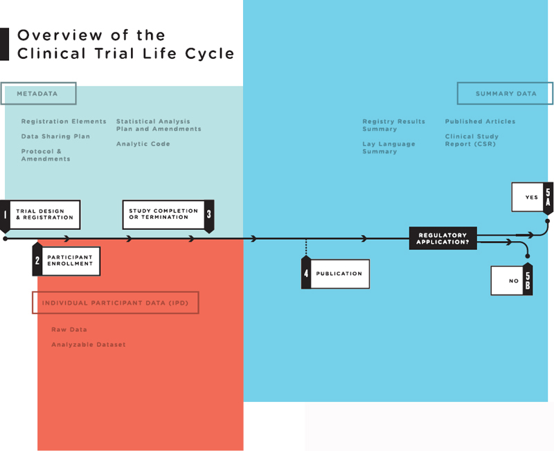
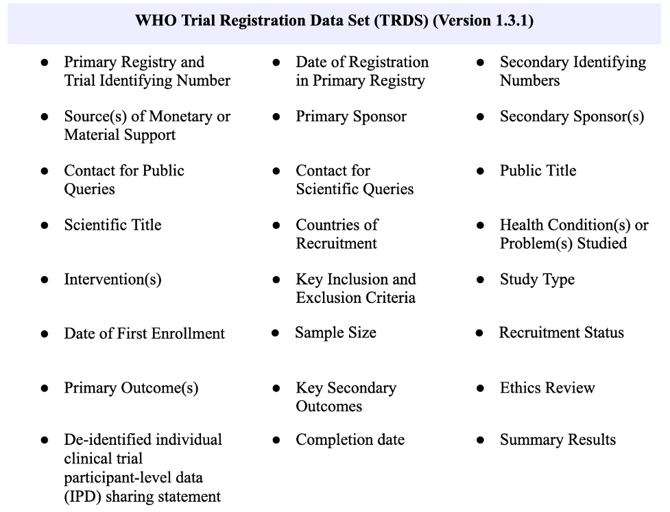

# Clinical Trials Data Primer

Authors: Liliana Gonzalez1, Mikala Narlock (mnarlock@umn.edu), Shawna Taylor (staylor@arl.edu)

DCN Mentors: Jen Darragh - Duke University (jennifer.darragh@duke.edu); Sophia Lafferty-Hess, Duke University (sophia.lafferty.hess@duke.edu)

Affiliate Contributors (external peer reviewers): Lisa Federer, Genevieve Milliken 

## Executive Summary

|   Topic   |   Description   |
| :------------- | :------------- |
| Primary fields or areas of use | <li>Health sciences</li> <li>Behavioral sciences</li><li>Biomedical Research</li>|
| Key questions for curation review| <li>Have consent forms been appropriately collected?</li><li>Do the consent forms align with the proposed manner of data sharing?</li><li>Has data been fully de-identified?</li><li>Is individual participant-level data (IPD) required?</li><li>Are all versions of trial protocol present?</li> |
| Tools for curation review | <li>Original software used to record the project</li><li>Original data collection instrument</li><li>Project codebook</li><li>[TrialMaster](https://www.anjusoftware.com/trialmaster-edc)</li><li>[REDCap](https://www.project-redcap.org/)</li><li>[ARX Data Anonymization Tool](https://arx.deidentifier.org/)</li><li>[Vivli](https://vivli.org/)</li> |
| Date Created | 2022-12-01 |
| Created by | Liliana Gonzalez- National Center for Data Services  Mikala Narlock - University of Minnesota   Shawna Taylor - Association of Research Libraries   DCN Mentors - Jen Darragh – Duke University   Sophia Lafferty-Hess – Duke University  |

1 *This project was partially funded by Federal funds from the National Library of Medicine (NLM), National Institutes of Health (NIH), under cooperative agreement number UG4LM01234 with the University of Massachusetts Chan Medical School, Lamar Soutter Library. The content is solely the responsibility of the authors and does not necessarily represent the official views of the National Institutes of Health. 

----------------------------
**Suggested Citation:** Gonzalez, Liliana; Narlock, Mikala; and Taylor, Shawna. (2022). Clinical Trials Data Primer. [Data Curation Network GitHub Repository.](https://github.com/DataCurationNetwork/data-primers)

----------------------------

# Table of Contents

[Summary](#summary)

[Introduction to Clinical Trials Data](#introduction-to-clinical-trials-data )

[Benefits of Sharing Clinical Trial Data](#benefits-of-sharing-clinical-trial-data)

[Potential Data Sharing Challenges](#potential-data-sharing-challenges)

[Selecting a Repository](#selecting-a-repository)

[Clinical Trial Registration](#clinical-trial-registration)

> [Why Is Trial Registration Important?](#why-is-trial-registration-important?)   [U.S. National Institutes of Health](#us-national-institutes-of-health)   [The World Health Organization ](#the-world-health-organization)   [International Committee of Medical Journal Editors](#international-committee-of-medical-journal-editors)   [Trial Registration Data Elements](#trial-registration-data-elements)   
[Core Metadata Elements and Documentation Requirements](#core-metadata-elements-and-documentation-requirements)   

[Key Curation Considerations](#key-curation-considerations)
>[DCN CURATE(D) Steps](#dcn-curated-steps)

[Related Primers](#related-primers)

[Helpful Resources](#helpful-resources)

[Bibliography](#bibliography)

# Summary

This primer provides a basic foundation for what goes into evaluating data from clinical trials for curation, sharing, and preservation purposes, specifically from the perspective of a data curator. It broadly covers: the benefits of sharing clinical trial data, potential data sharing challenges, selecting a repository, clinical trial registration requirements, including those of U.S.-based clinicaltrials.gov and the World Health Organization’s International Clinical Trials Registry Platform, the International Committee of Medical Journal Editors data sharing requirements, core metadata elements, including trial registration data elements, and key data curation steps. This primer is not a complete guide to clinical trials research or managing data of scholarly outputs, and is not intended to provide guidance on how to manage identifying sensitive information that may be present in human participant data. Instead, this primer is intended to provide an overview of the curation challenges and opportunities specific to clinical trial data. The laws and regulations mentioned in this primer are primarily situated within the U.S. context; when possible, international resources and recommendations have been identified. The ethical considerations discussed may be broader and apply across jurisdictions, although some will be context or culture-specific. This primer is not meant to provide comprehensive guidance or legal advice.

# Introduction to Clinical Trials Data

Clinical trials data are a specific type of [human participant data](https://github.com/DataCurationNetwork/data-primers/blob/master/Human%20Participants%20Data%20Essentials%20Data%20Curation%20Primer/human-participants-data-essentials-data-curation-primer.md). This data is generated through a clinical study in which a new drug or medical approach is studied for therapeutic, preventative, or diagnostic uses on individuals; clinical studies and their data determine if these new drugs or medical approaches are deemed both safe and effective for people. [These studies](https://clinicaltrials.gov/ct2/about-studies/learn#WhatIs) can also show researchers whether existing research is confirmed, if there are better approaches, or if there are potential harms to participants (U.S. National Library of Medicine, 2019, March).

Clinical trials are a type of clinical study that takes a controlled approach to studying the effects of new medical devices and drugs, or new methods and behaviors for participants. Since these trials are introducing something new into the lives of participants, they are also called interventional studies. These are different from observational studies, which are a different type of clinical study that will not be covered in this primer. There are many different types of clinical trials such as open, single-blind, crossover, etc., and documentation and data will differ depending on the [type of clinical trial](https://www.scientific-european-federation-osteopaths.org/different-types-of-clinical-trials/).

<figure>  <figcaption></figcaption> </figure>

(Source: [Institute of Medicine of the National Academies (IOM)](https://nap.nationalacademies.org/read/18998/chapter/2#10), 2015 )

Clinical trials data can include many different components of a research project. Over the course of the trial, an enormous amount of data and different types of data may be collected, “including individual participant data (i.e., raw data and the analyzable data set); metadata, or “data about the data” (e.g., protocol, statistical analysis plan, and analytic code); and summary-level data (e.g., summary-level results posted on registries, lay summaries, publications, and Clinical Study Reports)” (Institute of Medicine of the National Academies (IOM), 2015). With the exception of the raw data, most data outputs of the trial can be de-identified and shared. While each component is represented as a distinct item below, some data elements may overlap or be part of another.

**Individual Participant Data**

- Raw data: This is the source data for the project. It can be collected from instruments, images, narrative text, and other data collection processes. This data is typically not shared, as it often is protected, human participants data in a raw format. However, there are exceptions where raw data are shared via controlled access platforms such as [Vivli](https://vivli.org/). In addition to requiring additional work to make the data computational, raw data can also be significantly larger and more difficult to store, process, and analyze. Raw data has the greatest potential for risk of participant identification.

- Analyzable dataset: After the trial is complete, the raw data will be processed, edited, and converted into an analyzable dataset. The analyzable dataset may include de-identified (anonymized) participant-level data. Typically the analyzable dataset has the most utility, as it has been cleaned for analysis, it is the most computational and usable. Additionally, many studies will only use a portion of the analyzable dataset in the analysis; sharing this data will allow unused data to be leveraged by other researchers. Careful documentation should be kept on how the raw data is converted into an analyzable form.

**Metadata and Trial Documentation**

- Trial protocol: When a trial is registered in an appropriate registry, investigators submit a trial protocol, which outlines how the data will be collected, processed, and analyzed, how participants will be recruited, and how consent will be collected. Informed consent language is also included in the trial protocol. As trials progress, the trial protocol may be adjusted. The first trial protocol, the final protocol, and a summary of changes all need to be submitted as part of the final data package.

- Statistical analysis plan (SAP): This plan, which is submitted with the trial protocol, articulates exactly which statistical methods will be used to analyze the data, as well as the different software and programs that will be utilized.

- Analytic code: This is programming and statistical code(s) used to analyze the data. 

- Codebook: A detailed document that describes how data has been entered and coded to ensure future reusability. For an advanced use case of codebook reuse see de Ridder and Beliën’s 2022 article, [The iCRF Generator: Generating interoperable electronic case report forms using online codebooks.](https://www.ncbi.nlm.nih.gov/pmc/articles/PMC7291075/) 

**Summary-level data**

- Scholarly Outputs: These can be peer-reviewed articles published in academic journals that report on the study and key findings, [preprints](https://www.ncbi.nlm.nih.gov/pmc/about/nihpreprints/), the study’s analyzable dataset (described above), software, devices or products, or other artifacts. Summaries of parts of the analyzable clinical trial data may be included in publications and other outputs.

- Summaries on trial registry site(s), such as clinicaltrials.gov: Summaries are typically submitted within twelve months of project completion and should use easily understandable language to a lay person (e.g., the general public and research participants).

- Clinical Study Report: These are created when submitting to a regulatory agency for marketing and approval. These are extensive reports that include all of the trial documentation, metadata and analyzable data (e.g., not the raw data) associated with a project, including publications. Clinical Study Reports are shared  following regulatory approval.

Different clinical trial data should be shared at different phases of the research project. More information provided below.

# Benefits of Sharing Clinical Trial Data

In addition to compliance with funder and journal mandates, which increasingly require data be accessible in an online repository, appropriate sharing of clinical trial data has far-reaching impacts, beyond the Principal Investigators and research study team. Due to the fact that “[c]linical studies are designed to add to medical knowledge related to the treatment, diagnosis, and prevention of diseases or conditions,” providing access to research outputs empowers clinicians, patients, and the general population (U.S. National Library of Medicine, 2019, March). The most direct and immediate beneficiaries of shared clinical trial data are clinicians and their patients. This data will help inform the clinician of what is likely, or unlikely, to have a positive impact on their patients, whether it be a new treatment or prevention method. Accessing as much of the trial data as possible provides clinicians a better understanding of the benefits and potential risks of an intervention. 

For patients, information found on the registries can be empowering and educational as they, for instance, navigate a medical diagnosis, explore treatment options, and assess potential risks. This applies to the general public as well, as they are able to access this information even if they simply want to learn about research pertaining to medical diagnoses or potential treatments. Of note, for trials that are funded in part or whole by a public funder, e.g., NIH, the information learned in a trial and the data behind that knowledge could be understood as a public good, and should be made available to anyone interested in learning more. 

For researchers, sharing clinical trial data is a contribution to the collective knowledge of the medical community, adheres to the medical industry’s ethical standards, and reduces repeated trial research done by other researchers. Furthermore, funding agencies can make decisions on future clinical trials based on results and impacts that are found in shared clinical trial data. This furthers the possibility of appropriate investments in clinical study research. In addition, allowing individuals access to clinical trials data or results may be empowering for the general population, as individuals can decide which risks they are willing to take. When data are available on a topic, other researchers can reuse the data and patients will not be exposed to the same risks on an intervention that has already been tested.

Shared data can also be leveraged by secondary users (typically researchers), who may use the data when “carrying out additional analyses, analyzing unpublished data, reproducing published findings, and conducting exploratory analyses to generate new research hypotheses” (Committee on Strategies for Responsible Sharing of Clinical Trial Data Sharing, 2015). Data must be managed in a “responsible manner that mitigates the risks involved,” benefits all stakeholders, and advances patient care (Committee on Strategies for Responsible Sharing of Clinical Trial Data Sharing, 2015). However, this is not to say that there are no risks associated with data sharing. Not all data and trial documentation generated in the course of a clinical trial will be shared, such as the raw data that contains Personal Identifiable Information (PII). The Committee on Strategies for Responsible Sharing of Clinical Trial Data’s [Guiding Principles for Sharing Clinical Trial Data](https://www.ncbi.nlm.nih.gov/books/NBK285999/) offers guidance on sharing data responsibility and ethically, while promoting public and scientific trust.

# Potential Data Sharing Challenges

One of the biggest data sharing challenges and risks is the potential for participant harm. Clinical trial data, including the raw and analyzable datasets, contains sensitive Personal Identifiable Information (PII) or Protected Health Information (PHI). When preparing to share data, researchers will need to collaborate with statisticians and others with advanced de-identification expertise. De-identified (anonymized) data must protect participant privacy, adhere to the methodology and processes previously described in clinical study documentation, including the trial protocol and trial registration (described below). Ensure language used in the informed consent forms matches how data are curated and stored during active research or preservation phases in the research lifecycle. Shared data must be described with enough detail that it can be utilized for reproducibility and secondary analyses. This must be done in conjunction with experts, such as a statistician, the project PI, or project team member, and should not fall solely to the data curator. 

Additional data sharing challenges stem from researchers, who might worry about competition and others building on their work, especially in the case of secondary or ancillary findings. Arguably, this demonstrates another reason that sharing is important - researchers should be credited for their work if it has been formally deposited with a reputable repository and registered on clinicaltrials.gov or another trial registry. Datasets are often assigned a persistent identifier after deposit in a repository and this may deter competitors from taking other researchers' work without giving sufficient credit. This benefit, then, is that sharing data will likely lead to increased data citations.

Another issue, which has been mostly mitigated through registration requirements, is switching the hypothesis or end goals (also known as "HARKing" or "hypothesizing after the results are known") in the middle of a trial. There have been cases where a study started in one direction and then went down an entirely new path to chase a more desirable outcome. For instance, researchers or investigators may simply be reporting on favorable outcomes while ignoring other results to make it look as though the study only saw success; this is an unethical practice that can lead to clinicians, patients, and researchers attempting to recreate something that was not presented transparently. Clinical studies should be meticulously described with pre-registration and reported on throughout the process.

# Selecting a Repository

When sharing clinical trial data, it is important to select a data repository that will best suit PII and PHI data, both of which are sensitive types of information. Researchers typically need to review their Institutional Review Board (IRB) policies to ensure data management and sharing practices comply with IRB guidance; this is in addition to any campus-wide data management and sharing policies, or retention policies, required at the institution-level. While every repository will have different features, the main considerations to take into account when selecting a repository for clinical trial data include: protections for participant privacy, minimization of risk of participant reidentification, and evaluating for alignment with the FAIR principles (Wilkinson et al, 2016). Each project will have its own requirements, which should be considered at the start of the project, and will need to be shared in a manner that complies with previous documentation. Consulting with repository managers at the start of a project, ideally in the proposal stage, will make the transition from data collection, through analysis, and to publishing data, less burdensome. The following questions are presented in a non-prioritized order, and serve as foundation for the types of questions a researcher might consider when selecting a repository:

- Can the data be shared openly, or does it require additional restrictions or protections, such as embargoes (delaying access to data for a period of time) or requiring user authorization or the completion of Data Use Agreements? 
    -	 If applicable, how does the repository review access requests? Is there a data access committee that reviews usage requests to ensure usage is consistent with participant privacy requirements and in alignment with the study’s informed consent?

- Can the repository provide the appropriate level of protection to meet relevant legal or regulatory requirements?

- Does the repository have a plan or protections in place for unintended data breaches?
    -	 Does the repository have a plan in place to deal with data reuse violations?

- Is there a cost associated with uploading to the repository?

- Will the repository be able to provide the datasets with a unique and persistent identifier? 

- Does this repository use broadly applicable vocabularies? 
    -	 Does the repository have adequate metadata fields to enable findability?

- Does the repository support the data format? 

- Does the data need to be accessed for a period of time (e.g., 5-7 years)?  
    -	 Does the repository provide support for the data after the requisite timeframe? 

- If the repository were to suspend service, is there a backup plan for preservation of the data? 

- Does the repository provide curation support to ensure data submission packages include sufficient documentation?  
    -	 If not, are data curators and specialists available within the institution?

If the repository will hold a large amount of clinical trial data, it is recommended to consider selecting a specialized clinical data sharing repository or platform over generalist or institutional repositories. [Vivli](https://vivli.org/) is currently the most popular specialized repository for clinical trial data and has many features required for ethical data sharing and storing and data reuse. Features include: a requirement for data to be de-identified prior to submission, access to de-identified individual patient-level data (IPD), a secure research platform in which researchers can work with the requested data, established partnerships with anonymization experts that researchers can access, supporting data documentation for secondary use, and implementation of data use agreements (DUAs), which requires users to agree to terms of use before they can access the data for reuse. Due to these features, Vivli has become the de facto repository for sharing clinical trials data; submitting data to Vivli means a study will be discoverable in many other locations (Vasquez et al, 2021). However, designated downloadable datasets require, per the terms of use agreement, that downloaded data be destroyed. Furthermore, every “action taken on the Vivli platform is recorded in an audit trail on the platform. Every time data is accessed either via the secure research environment or downloaded the action is recorded in the platform” (Vivli, "How Vivli meets the NIH ‘Desirable Characteristics for Data Repositories’"). Dataset metadata are assigned PIDs and made discoverable via Google Scholar and Google Dataset searches.  

Another excellent resource for reputable scientific data repositories is the [NIH-supported Scientific Data Repositories list](https://sharing.nih.gov/data-management-and-sharing-policy/sharing-scientific-data/repositories-for-sharing-scientific-data), which includes discipline specific repositories that support the domain specific needs of researchers. 

# Clinical Trial Registration 

## Why Is Trial Registration Important?

Trial registration is often a prerequisite in many countries to proceed with clinical studies involving human participants. Funders, either private or public, may also require trial registration to comply with grant conditions. Aside from federal government and funder requirements, registering and sharing clinical trial data and clinical study results, as well as study methodologies, promotes scientific best practice, strengthens the transparency, validity, and value of the scientific evidence. The World Health Organization (WHO) identifies several key areas as to why trial registration promotes good scientific practice:
- It is difficult to make informed decisions if publication bias and selective reporting are present.
- Improving awareness of similar or identical trials will make it possible for researchers and funding agencies to avoid unnecessary duplication.
- Describing clinical trials in progress can make it easier to identify gaps in clinical trials research.
- Making researchers and potential participants aware of recruiting trials may facilitate recruitment.
- Enabling researchers and health care practitioners to identify trials in which they may have an interest could result in more effective collaboration among researchers. The type of collaboration may include prospective meta-analysis.
- Registries checking data as part of the registration process may lead to improvements in the quality of clinical trials by making it possible to identify potential problems (such as problematic randomization methods) early in the research process (WHO Trial Registration).

On clinicaltrials.gov, the results of registered trials (in clinicaltrials.gov) database is incorporated into the public facing trial registry and the principal investigator or sponsor updates the registry with summary level information on the study’s results as the study proceeds. Descriptive results or “facets” may be legally required information in the U.S. (depending on the type of study and granting agency), and includes summaries of:
- Participant Flow: The progress of participants through each stage of a study, and includes the numbers of participants who started, completed, and dropped out of each period of the study based on the sequence in which interventions were assigned.
- Baseline Characteristics: Data collected at the beginning of a study for all participants. Demographics, such as age and gender, and study-specific measures are included.
- Outcome Measures and Statistical Analyses: Outcome measure values and any appropriate statistical analyses.
- Adverse Events: Anticipated and unanticipated serious adverse events, and other adverse events exceeding a specific frequency threshold (U.S. National Library of Medicine, 2018, March). 

The tables below, modified from the ‘Why Should I Register and Submit Results?’ page on clinicaltrials.gov, indicate the purpose of the trial registry and results database, and note the particular groups that benefit from shared trial data (U.S. National Library of Medicine, 2021, May).

|   Registry Purpose   |   Groups that Benefit   |
| :------------- | :------------- |
| Fulfill ethical obligations to participants and the research community  | Participants, patients, the general public, the research community, granting agencies |
| Provide information to potential participants and referring clinicians  | Participants, patients, clinicians |
| Reduce publication bias  | Users of the medical literature, the general public |
| Help editors and others understand the context of study results  | Journal editors, users of the medical literature, secondary users of the research data |
| Promote more efficient allocation of research funds  | Granting agencies, the research community, the general public |
| Help institutional review boards (IRBs) determine the appropriateness of a research study  | IRBs, the research community, participants |

Modified from: Zarin DA, Keselman A. [Registering a clinical trial in ClinicalTrials.gov.](https://pubmed.ncbi.nlm.nih.gov/17303677/) Chest. 2007;131(3):909-12. [https://pubmed.ncbi.nlm.nih.gov/17303677/](https://pubmed.ncbi.nlm.nih.gov/17303677/)

 

|   Results Database Purpose   |   Groups that Benefit   |
| :------------- | :------------- |
| Provide a public record of basic study results in a standardized format  | Researchers, journal editors, IRBs, patients, the general public |
| Promote the fulfillment of ethical obligations to participants and the overall contribution of research results to medical knowledge  | Participants, patients, the general public, the research community, granting agencies |
| Reduce publication and outcome reporting biases  | Users of the medical literature, the general public |
| Facilitate systematic reviews and other analyses of the research literature  | Researchers, policymakers |

Modified from: Tse T, Williams RJ, Zarin DA. [Reporting "basic results" in ClinicalTrials.gov.](https://pubmed.ncbi.nlm.nih.gov/19584212/) Chest. 2009;136(1):295-303. [https://pubmed.ncbi.nlm.nih.gov/19584212/](https://pubmed.ncbi.nlm.nih.gov/19584212/)

## U.S. National Institutes of Health

The U.S. National Library of Medicine (NLM) at the National Institutes of Health (NIH) maintains a database of privately and publicly funded clinical studies conducted around the world. [Clinicaltrials.gov](http://clinicaltrials.gov) is a website that provides a robust and user-friendly way for clinicians, patients, researchers, and the general public to find clinical studies information on an extensive array of subjects. Studies are registered by the clinical trial investigator(s) and are regularly updated throughout the duration of the study. Study information may also be updated at the end of the study and include final results. 

In the United States, Section 801 of the Food and Drug Administration Amendments Act of 2007, known as FDAAA 801, as well as the Final Rule for Clinical Trials Registration and Results Information Submission, known as 42 CFR Part 11, detail clinical trial [registration requirements.](https://clinicaltrials.gov/ct2/manage-recs/fdaaa#OtherFDAAA801Requirements)

As of January 25, 2023, the NIH has implemented a Data Management and Sharing Policy (DMS), which applies to scientific data, including clinical trials data, generated as part of NIH-sponsored research. For more information of this policy, visit the [NIH DMS website.](https://sharing.nih.gov/data-management-and-sharing-policy/about-data-management-and-sharing-policies/data-management-and-sharing-policy-overview)

## The World Health Organization

The World Health Organization (WHO) regards trial registration as “the publication of an  internationally-agreed set of information about the design, conduct and administration of clinical trials” (WHO, ICTRP Registry Network). Trial details are made publicly available in the International Clinical Trials Registry Platform (ICTRP), however, the WHO ICTRP is not itself a clinical trials registry. Rather, the ICTRP aggregates clinical trial registrations from registries which meet WHO criteria. These criteria are grouped into six content areas: Content, Quality and Validity, Accessibility, Unambiguous, Identification, Technical Capacity, and Administration and Governance (WHO, ICTRP Registry Network). This collection of registries, known as the WHO Registry Network, is composed of:

- [Primary Registries](https://www.who.int/clinical-trials-registry-platform/network/primary-registries) meet WHO criteria listed above as well as the requirements of the International Committee of Medical Journal Editors (ICMJE) (described below). 
- [Partner Registries](https://www.who.int/clinical-trials-registry-platform/network/partner-registries) are affiliated with either a Primary Registry in the WHO Registry Network or an ICMJE approved registry. 
- [Data Providers](https://www.who.int/clinical-trials-registry-platform/network)
- [Registries working with the ICTRP towards becoming Primary Registries](https://www.who.int/clinical-trials-registry-platform/network)

[The ICTRP Search Portal](https://trialsearch.who.int/Default.aspx) is the public-facing point of access for information about ongoing and completed clinical trials and includes information from all WHO Registry Network registries. 

## International Committee of Medical Journal Editors

The International Committee of Medical Journal Editors (ICMJE) is a group of general medical journal editors who meet annually to update the [Recommendations for the Conduct, Reporting, Editing and Publication of Scholarly Work in Medical Journals](https://www.icmje.org/icmje-recommendations.pdf). These recommendations are the “best practice[s] and ethical standards in the conduct and reporting of research and other material published in medical journals,” and are considered the industry standard for medical research publication (International Committee of Medical Journal Editors, 2022). There are currently over 5,000 journals that report to follow the ICMJE recommendations, however, there is no compliance protocol to ensure recommendations are followed. Clinical trial registration is included in these recommendations and ICMJE requires “all medical journal editors require registration of clinical trials in a public trials registry” prospectively (before the first participant enrollment)” (International Committee of Medical Journal Editors, Recommendations ("The Uniform Requirements")). 

In 2018, the ICMJE implemented a required data sharing statement policy for manuscripts publishing results of clinical trials, submitted to ICMJE journals. Data sharing statements must include: 
Whether individual de-identified participant data (including data dictionaries) will be shared (“undecided” is not an acceptable answer).
- What data in particular will be shared.
- Whether additional, related documents will be available (e.g., study protocol, statistical analysis plan, etc.).
- When the data will become available and for how long.
- By what access criteria data will be shared (including with whom, for what types of analyses, and by what mechanism) (ICMJE Clinical Trials). 

Furthermore, as of 2019, the ICMJE added an additional requirement to the data sharing statement, and now requires a data sharing plan in all clinical trials registrations (ICMJE Data Sharing Statements).

## Trial Registration Data Elements

Each trial registry requires specific information about the registering clinical trial. This collection of descriptive data elements, often known as the trial registration data set, is required for a trial to be considered fully registered. Although these requirements vary, the WHO’s primary and partner registries must require a minimum amount of trial data elements to comply with WHO requirements. These required data elements, known as the WHO Trial Registration Dataset (TRDS), is currently composed of 24 descriptive elements and are listed below (WHO Trial Registration Data Set). Additional fields are required for clinicaltrials.gov [protocol registrations](https://prsinfo.clinicaltrials.gov/definitions.html) and [results data](https://prsinfo.clinicaltrials.gov/results_definitions.html).

<figure>  <figcaption></figcaption> </figure>

Source: [WHO Trial Registration Data Set (Version 1.3.1).](https://www.who.int/clinical-trials-registry-platform/network/who-data-set)

# Core Metadata Elements and Documentation Requirements

Trial registration data elements, while not necessarily adhering to a particular metadata schema, do provide structured metadata for trial datasets. Metadata standards are always evolving and, as such, structured metadata elements in the form of trial registrations “represent a class of descriptive metadata about the high-level characteristics of a clinical trial” (Miron et al, 2020). Persistent identifiers (PIDs) should be added to trial registration data, where appropriate, as these identifiers augment data FAIRness. Furthermore, including “registry metadata in systematic reviews can help to identify selective reporting bias by comparing published outcomes to prespecified outcomes, and adverse events are more likely to be reported in clinical trial registries than in published literature” (Miron et al, 2020). 

The 24 WHO data elements listed above can be considered the core data elements needed for clinical trial metadata; however, additional elements may be required, depending on which registry is used.

Common Data Elements, or CDE, are “a standardized, precisely defined question, paired with a set of allowable responses, used systematically across different sites, studies, or clinical trials to ensure consistent data collection” (NIH CDE Repository). Using CDE provides consistency within discipline areas by standardizing how data is collected, described, and formatted (COMPASS, Importance of Common Data Elements (CDEs)). By using CDE, researchers can not only save time when creating and launching their research project, but can also increase the FAIRness of their research outputs, ensure consistency of data collection, and meet funder requirements. Leveraging the CDE also facilitates data integration, and therefore meta-analyses, and replicability of research across disciplines and studies. 

[The CDISC Foundational Standards](https://www.cdisc.org/standards) may be helpful at every stage of the research project to collect, analyze, and exchange data in a standardized manner. CDISC creates and manages different standards for clinical trial researchers to facilitate data reusability, interoperability, and accessibility. The standards [span the clinical trial lifecycle](https://www.cdisc.org/standards) and are divided into different categories: [data exchange](https://www.cdisc.org/standards/data-exchange), [foundational standards](https://www.cdisc.org/standards/foundational), [controlled terminology](https://www.cdisc.org/standards/terminology/controlled-terminology), and others. 

Similarly, requirements from the publication industry and funders around data sharing policies and data sharing statements can be reappropriated for clinical study data management and sharing plans (DMSP), also referred to as data management plans (DMPs). For instance, data sharing statements required by the ICMJE can be modified to be included in the study’s DMSP, README files, and other study documentation. Likewise, beginning 2023 the NIH issued a DMSP requirement, which encourages researchers to include information about data type, anticipated tools for collection and analysis, and which standards will be used; this new policy also permits allowable costs data sharing requirements and services above and beyond the routine costs of doing research. The ICMJE  and NIH have slightly different requirements, however, when developing a data sharing statement, broadly consider the following questions: 
- What data in particular will be collected? Which data will be shared?
- What other documents will be available?
- When will data be available (start and end dates)? Are there any access restrictions necessary for the data?
- With whom will the data be shared?
- For what types of analyses?
- By what mechanism will data be made available? (International Committee of Medical Journal Editors, Clinical Trials)

Study documentation can note compliance with, for example, ICMJE recommendations and considerations, and this record helps potential data reusers understand and trust industry-standard primary data. 

# Key Curation Considerations

When preparing data from a clinical trial for sharing, there are numerous considerations researchers and curators need to consider. For the purposes of this primer, this focus is on how to curate different components of a complete data package; however, different data will need to be shared at different stages of the research process. 

Regardless of which portion(s) are being shared, it is essential that all data sharing and storage considerations prioritize the protection and privacy of participant data, including  communities as well as individuals. The [CARE Principles for Indigenous Data Governance](https://www.gida-global.org/care#:~:text=The%20CARE%20Principles%20for%20Indigenous%20Data%20Governance%20are%20people%20and,Indigenous%20innovation%20and%20self%2Ddetermination) provide guidelines for protecting and collaborating with communities participating in clinical trial studies. See more about how to review [consent forms](https://github.com/DataCurationNetwork/data-primers/blob/master/Consent%20Forms%20Data%20Curation%20Primer/consent-forms-data-curation-primer.md) or [check for informed consent](https://github.com/DataCurationNetwork/data-primers/blob/master/Human%20Participants%20Data%20Essentials%20Data%20Curation%20Primer/human-participants-data-essentials-data-curation-primer.md#brief-introduction-to-consent-review-and-communicating-about-informed-consent-with-a-depositor) in other DCN primers.

A comprehensive data package, typically shared by publication or the end of the performance period of the supporting funding (whichever comes first), should contain the following:

- **Analyzable dataset:** This is the processed, edited, and computational version of the data. This dataset needs to be deidentified in collaboration with an expert. 
    -	 This must include documentation of how the raw data was processed to create the analyzable data. This will be important for future re-users of the data to understand the decisions the research team made.

- **Trial protocol:** The first trial protocol, the final protocol, and a summary of changes all need to be submitted as part of the final data package. This needs to include consent forms and recruitment mechanisms. 
    -	 **Statistical analysis plan (SAP):** Include specific information about which programs were used in analyzing the data, which versions, and any necessary packages or dependencies. 

- **Analytic Code:** The code(s) that were used in analyzing the dataset and producing the results. These need to be sufficient for a fellow member of the field to be able to reproduce the results.

## DCN CURATE(D) Steps

Use the [Data Curation Network’s CURATE(D)](http://z.umn.edu/curate) checklist to finalize your data for submission:

### **Check** files and read documentation (review for appropriate levels of sharing, ensuring privacy and ethical standards are upheld, review file inventory and file appraisal/selection)
- Review the [consent form](https://github.com/DataCurationNetwork/data-primers/blob/master/Consent%20Forms%20Data%20Curation%20Primer/consent-forms-data-curation-primer.md) template, if available, to confirm data are being shared as described to the participants before agreeing to participate in the study
- Review analyzable code and check for methodology description for converting data from raw to analyzable formats
    -	 If needed, connect researcher(s) to de-identification specialists. 
- Check for trial registration on clinicaltrials.gov or other appropriate registry  
- If necessary, ensure participants provided their consent to participate autonomously and without coercion 
- If necessary, assess whether a representative for the participant group needs to review the data (further description in the Request step below)
- If a group of participants are being referred to with a demographic label, ensure this label is one that best represents them; consultation with the group may be required
    -	 For a case study on community-based participatory research, [review Understanding community-based participatory research through a social movement framework: a case study of the Kahnawake Schools Diabetes Prevention Project](https://bmcpublichealth.biomedcentral.com/articles/10.1186/s12889-018-5412-y) (Tremblay et al, 2018). 
- If this data has been used for regulatory approval (e.g., FDA approval for devices, etc.) ensure licenses are appropriate

### **Understand** the data (or try to), if not… (run files/environment, QA/QC issues, readme)
- Ensure that someone with similar qualifications could look at this data and both understand it and be able to reuse it
    -	 Are all headings clear? 
    -	 Is there missing participant data that needs to be accounted for?
    -	 Is the methodology of intervention clear and sufficient?
- If possible, try running the analytic code

### **Request** missing information or changes (tracking provenance of any changes and why)
- Review questions/concerns from the previous step - how can these be addressed? 
- Have participants been notified that their data will be shared in addition to being published?
    -	 Is further communication needed to ensure they know how their data are being used/will potentially be used in future work

### **Augment** metadata for findability (DOIs, metadata standards, discoverability)
- Does the dataset have an appropriate identifier that will allow others to discover this work?
    -	 Has sufficient descriptive metadata been created? 
    -	 When relevant and appropriate, have the Common Data Elements (CDE) been utilized?
- Ensure appropriate links between trial registry and published datasets are included

### **Transform** file formats for reuse (data preservation, conversion tools, data visualization)
- Do file formats need specialized software to open? If so, is this software free or widely available? 
    -	 Change file formats into open source formats if appropriate
    -	 Will any information potentially be lost with file transformation? Make note of this decision
- Ensure the data can be exported to a non-proprietary format (e.g. csv, txt)
- Keep copies of original file formats
- Standardize file names 
- Ensure accessibility if any data visualizations are included
- Organize files as needed

### **Evaluate** for FAIRness (licenses, responsibility standards, metrics for tracking use)
- Review the FAIRness of the data (findable, accessible, interoperable, reusable)
- Follow [CARE](https://www.gida-global.org/care) and [FATE](https://www.microsoft.com/en-us/research/theme/fate/) principles by centering community input and community-driven participation
- Perform a final check for potential ethical concerns such as de-identification and harmful language
- Verify files are working and have transformed correctly, when applicable 

### **Document** curation activities (Curator Log, correspondence)
- Include documentation, such as consent forms and IRB approval, in final data submission or deposit
- Log ongoing changes and updates to data in the documentation
    -	 This can include correspondence about the dataset, metadata, and changes from the Transform step
- Include any other relevant documentation for the dataset

## Related Primers

- [Informed Consent Curation Primer](https://github.com/DataCurationNetwork/data-primers/blob/master/Consent%20Forms%20Data%20Curation%20Primer/consent-forms-data-curation-primer.md) 
- [Human Participants Data Essentials Primer](https://github.com/DataCurationNetwork/data-primers/blob/master/Human%20Participants%20Data%20Essentials%20Data%20Curation%20Primer/human-participants-data-essentials-data-curation-primer.md#brief-introduction-to-identifiers-and-communicating-about-de-identification-with-a-depositor) 
- [Qualitative Data Primer](https://github.com/DataCurationNetwork/data-primers/blob/master/Qualitative%20Data%20Curation%20Primer/qualitative-data-curation-primer.md#workflow-based-on-the-data-curation-network-curated-steps) 
- [SPSS Data Curation Primer](https://github.com/DataCurationNetwork/data-primers/blob/master/SPSS%20Data%20Curation%20Primer/SPSS-data-curation-primer.md#Appendix-A-Using-CURATE-with-SPSS-Data) 

## Helpful Resources

- [ARX - Data Anonymization Tool](https://arx.deidentifier.org/): Full-featured freeware for statistical risk assessment and anonymization. Requires knowledge of techniques. 
- [Selecting a Data Repository-NIH](https://sharing.nih.gov/data-management-and-sharing-policy/sharing-scientific-data/selecting-a-data-repository) 
- [REDCap](https://www.project-redcap.org/) 
- [TrialMaster](https://www.anjusoftware.com/trialmaster-edc) 
- [Vivli](https://vivli.org/) 
- [WHO Primary Registries](https://www.who.int/clinical-trials-registry-platform/network/primary-registries) 
- [Data Management and Sharing Plan Guidance](https://osf.io/uadxr/), created by the U.S.-based librarian NIH DMSP Guidance Working Group 

## Bibliography

Committee on Strategies for Responsible Sharing of Clinical Trial Data; Board on Health Sciences Policy; Institute of Medicine. (2015, April 20). _Sharing Clinical Trial Data: Maximizing Benefits, Minimizing Risk._ Washington (DC): National Academies Press (US); [https://www.ncbi.nlm.nih.gov/books/NBK285993/](https://www.ncbi.nlm.nih.gov/books/NBK285993/)

Comprehensive Center for the Advancement of Scientific Strategies (COMPASS). (n.d.). _Importance of Common Data Elements (CDEs)._ [https://www.compass.fhcrc.org/compass/bin/tech/cdes.aspx](https://www.compass.fhcrc.org/compass/bin/tech/cdes.aspx)

Institute of Medicine of the National Academies. 2015. _Sharing Clinical Trial Data: Maximizing benefits, minimizing risk._ Washington, DC: The National Academies Press. [https://doi.org/10.17226/18998](https://doi.org/10.17226/18998)

International Committee of Medical Journal Editors. (n.d.). _Clinical Trials._ [https://www.icmje.org/recommendations/browse/publishing-and-editorial-issues/clinical-trial-registration.html](https://www.icmje.org/recommendations/browse/publishing-and-editorial-issues/clinical-trial-registration.html)

International Committee of Medical Journal Editors. (n.d.). _ICMJE Recommendations ("The Uniform Requirements")._
[https://www.icmje.org/about-icmje/faqs/icmje-recommendations/](https://www.icmje.org/about-icmje/faqs/icmje-recommendations/)

International Committee of Medical Journal Editors. (2022, May). _Recommendations for the Conduct, Reporting, Editing, and Publication of Scholarly Work in Medical Journals._ [https://www.icmje.org/icmje-recommendations.pdf](https://www.icmje.org/icmje-recommendations.pdf)

Miron, L., Gonçalves, R. S., & Musen, M. A. (2020). Obstacles to the reuse of study metadata in ClinicalTrials.gov. Scientific Data (Vol. 7, Issue 1). Springer Science and Business Media LLC. [https://doi.org/10.1038/s41597-020-00780-z](https://doi.org/10.1038/s41597-020-00780-z)

National Institutes of Health. (n.d.). _Repositories for Sharing Scientific Data._ 
[https://sharing.nih.gov/data-management-and-sharing-policy/sharing-scientific-data/repositories-for-sharing-scientific-data](https://sharing.nih.gov/data-management-and-sharing-policy/sharing-scientific-data/repositories-for-sharing-scientific-data) 

Raftery J, Young A, Stanton L, Milne, R, Cook A, Turner D, & Davidson, P. (2015, February). Chapter 2, Data quality and reporting in existing clinical trial registries: a review of existing databases. _Clinical trial metadata: defining and extracting metadata on the design, conduct, results and costs of 125 randomised clinical trials funded by the National Institute for Health Research Health Technology Assessment programme._ Southampton (UK): NIHR Journals Library; (Health Technology Assessment, No. 19.11.). [https://www.ncbi.nlm.nih.gov/books/NBK274341/](https://www.ncbi.nlm.nih.gov/books/NBK274341/)

Scientific European Federation of Osteopaths. (2014, September 10). _Different Types of Clinical Trials._ [https://www.scientific-european-federation-osteopaths.org/different-types-of-clinical-trials/](https://www.scientific-european-federation-osteopaths.org/different-types-of-clinical-trials/) 

Taichman, D. B., Sahni, P., Pinborg, A., Peiperl, L., Laine, C., James, A., Hong, S.-T., Haileamlak, A., Gollogly, L., Godlee, F., Frizelle, F. A., Florenzano, F., Drazen, J. M., Bauchner, H., Baethge, C., & Backus, J. (2017). Data Sharing Statements for Clinical Trials: A Requirement of the International Committee of Medical Journal Editors. Annals of Internal Medicine (67)1, 63–65. American College of Physicians. [https://doi.org/10.7326/m17-1028](https://doi.org/10.7326/m17-1028)

U.S. National Library of Medicine. (2022, June). _How to Register Your Study._ ClinicalTrials.gov. [https://clinicaltrials.gov/ct2/manage-recs/how-register](https://clinicaltrials.gov/ct2/manage-recs/how-register) 

U.S. National Library of Medicine. (2022, January). _FDAAA 801 and the Final Rule - Other FDAAA 801 Requirements: NIH and FDA._ ClinicalTrials.gov. https://clinicaltrials.gov/ct2/manage-recs/fdaaa#OtherFDAAA801Requirements

U.S. National Library of Medicine. (2021, May). _Why Should I Register and Submit Results? - Trial Registry Purposes and Benefits for Various Groups._ ClinicalTrials.gov. [https://clinicaltrials.gov/ct2/manage-recs/background](https://clinicaltrials.gov/ct2/manage-recs/background) 

U.S. National Library of Medicine. (2019, March). _Learn About Clinical Studies - Reasons for Conducting Clinical Studies._ ClinicalTrials.gov. [https://clinicaltrials.gov/ct2/about-studies/learn#ReasonsForConducting](https://clinicaltrials.gov/ct2/about-studies/learn#ReasonsForConducting) 

U.S. National Library of Medicine. (2019, March). _Learn About Clinical Studies - What is a Clinical Study?_ ClinicalTrials.gov. [https://clinicaltrials.gov/ct2/about-studies/learn#WhatIs](https://clinicaltrials.gov/ct2/about-studies/learn#WhatIs)

U.S. National Library of Medicine. (2018, March). _About the Results Database._ ClinicalTrials.gov. [https://clinicaltrials.gov/ct2/about-site/results](https://clinicaltrials.gov/ct2/about-site/results)

Vazquez, E., Gouraud, H., Naudet, F., Gross, C. P., Krumholz, H. M., Ross, J. S., & Wallach, J. D. (2021). Characteristics of available studies and dissemination of research using major clinical data sharing platforms. _Clinical trials_ (London, England), 18(6), 657–666. [https://doi.org/10.1177/17407745211038524](https://doi.org/10.1177/17407745211038524)

Vivli. (n.d.). _How Vivli meets the NIH ‘Desirable Characteristics for Data Repositories.’_ [https://vivli.org/about/nih-grei-project/nih-grei-project-desireable-characteristics/](https://vivli.org/about/nih-grei-project/nih-grei-project-desireable-characteristics/)

Wilkinson, M.D., Dumontier, M., Aalbersberg, I.J., Appleton, G., Axton, M., Baak, A., Blomberg, N., Boiten, J.W., Bonino da Silva Santos, L., Bourne, P.E., Bouwman, J., Brookes, A.J., Clark, T., Crosas, M., Dillo, I., Dumon, O., Edmunds S., Evelo, C.T., Finkers, R., … Mons, B. “The FAIR Guiding Principles for scientific data management and stewardship." Scientific data 3.1 (2016): 1-9. [https://doi.org/10.1038/sdata.2016.18](https://doi.org/10.1038/sdata.2016.18)

World Health Organization. (n.d.). _ICTRP Registry Network._ [https://www.who.int/clinical-trials-registry-platform/network](https://www.who.int/clinical-trials-registry-platform/network)

World Health Organization. (n.d.). _ICRTP Registry Network - Trial registration._
[https://www.who.int/clinical-trials-registry-platform/network/trial-registration](https://www.who.int/clinical-trials-registry-platform/network/trial-registration)

World Health Organization (n.d.) _International Clinical Trials Registry Platform (ICTRP)._ [https://www.who.int/clinical-trials-registry-platform](https://www.who.int/clinical-trials-registry-platform)

World Health Organization (n.d.). _WHO Trial Registration Data Set (Version 1.3.1)._ 
[https://www.who.int/clinical-trials-registry-platform/network/who-data-set](https://www.who.int/clinical-trials-registry-platform/network/who-data-set)

