# Column Binary Data Curation Primer

Authors: Jessica Ko, Cornell University; Kelsie Norek, Cornell University

Affiliate Contributors (peer reviewers): Marley Kalt, Jane Fry

## Executive Summary

|   Topic   |   Description   |
| :------------- | :------------- |
| File Extensions | <li>.bin</li> <li>.colbin</li>   The file extension may vary and is sometimes based on the content of the file|
| MIME Type [^1]|application/octet-stream|
| Structure|Binary format|
| Primary fields or areas of use | Survey research|
| Source and affiliation [^2]| IBM (80-column IBM Card patented in 1928)|
| Metadata standards | Data Documentation Initiative (DDI)|
| Key questions for curation review| Pre-Conversion <li>Is the documentation associated with the data file sufficient for conversion? Are column locations and response codes included?</li>   Post-Conversion<li>Do frequencies match what is expected based on documentation (e.g., toplines, reports) or common sense checks?</li><li>Are the variables and values clearly and accurately labeled?</li>|
| Tools for curation review | <li>SAS</li><li>SPSS</li><li>.xls/.xlsx editor</li><li>Document viewer software</li> |
| Date Created | 2023-03-15 |
| Created by | Jessica Ko - Cornell University   Kelsie Norek - Cornell University     DCN Mentors - Wendy Kozlowski – Cornell University   Neggin Keshavarzian – Princeton University  |

----------------------------
**Suggested Citation:** Ko, Jessica and Norek, Kelsie. (2023). Column Binary Data Curation Primer. [Data Curation Network GitHub Repository.](https://github.com/DataCurationNetwork/data-primers)

----------------------------

# Table of Contents

[Description of Format](#description-of-format)

[Software for Viewing or Analyzing Data](#software-for-viewing-or-analyzing-data )

[Examples](#examples)

[Resources for Reviewing Data After a Conversion](#resources-for-reviewing-data-after-a-conversion)

[Key Considerations](#key-considerations)
> [Interpreting the Codebook](#interpreting-the-codebook)   [Multiple Cards](#multiple-cards)   [X-ray Files](#x-ray-files)   [Multi-punched columns](#multi-punched-columns)   [Columns v. Variables](#columns-v-variables)   
[Logic Flows](#logic-flows)   [Merge v. Append](#merge-v-append)   [Checking Converted Frequencies](#checking-converted-frequencies)  

[Column Binary Conversion Process](#column-binary-conversion-process)
> [Import Data into SPSS](#import-data-into-spss)   [Recode Variables](#recode-variables)   [Clean Data](#clean-data)   [Rename Variables and Assign Variable Labels](#rename-variables-and-assign-variable-labels)   [Check Conversions](#check-conversions)   

[Applicable Metadata Standard, Core Elements, and README Requirements](#applicable-metadata-standard-core-elements-and-readme-requirements)

[Preservation Actions](#preservation-actions)

[Documentation of Curation Process: What to Capture](#documentation-of-curation)

[Ways in Which Fields May Use this Format](#ways-in-which-fields-may-use-this-format)

[Bibliography](#bibliography)
> [Cited in Text](#cited-in-text)   [Additional Useful Resources](#additional-useful-resources)   

[Appendix A: Column Binary CURATE(D) Checklist](#appendix-a)

[Appendix B: Recommended Metadata Elements for Survey Research](#appendix-b)

# Description of Format

Column binary (or colbin) is a file format that is most frequently used to store survey data from punched cards, which are paper cards in which holes are punched to represent data points. There are different types of punched cards, but one of the most common is the 80-column IBM card (see Figures 1 and 2). These cards are organized in an array that is 80 columns wide and 10 rows tall, with additional space for 2 rows at the top.

<figure> 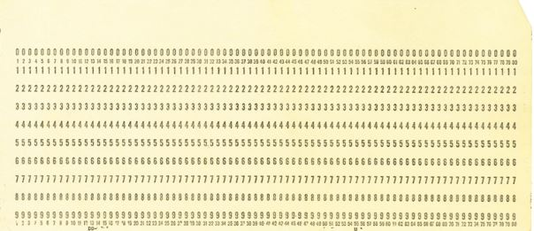 <figcaption></figcaption> </figure>

**Figure 1. Blank card.** Source: [IBM100—The IBM Punched Card](https://www.ibm.com/ibm/history/ibm100/us/en/icons/punchcard/breakthroughs/). (2012, March 7). [CTB14]. IBM; IBM Corporation.[^3]

<figure> 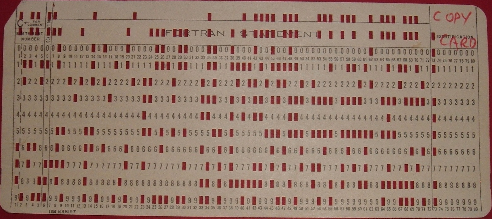 <figcaption></figcaption> </figure>

**Figure 2. Punched Card.** Source: Reinhold, A. (2006). [Binary punched card.](https://commons.wikimedia.org/wiki/File:IBM1130CopyCard.agr.jpg) [Online image]. Wikimedia Commons.[^4]

The small numbers are column identifier numbers. These are never punched because they don’t represent question responses. The numbers that represent possible question responses are arranged vertically, from 0-9. The “digit” section of the card includes digits 1-9. The section above, starting with 0, is called the “zone” section. The two additional spots above the 0 represent extra values, which allow more data to be stored on a single card. The zone values are coded in several different ways, depending on the company or organization that processed them (see Table 1).

|   Punched Card Value   |   Codebook Value   |   Data File Value   |
| :------------- | :------------- | :------------- |
| 0  | 0 or 10 | 0 |
| X (blank directly above 0)  | X, 11, -, or (rarely) 10 | X or - |
| Y (highest spot)  | Y, 12, V, R, /, or & | Y, V, R, /, or & |

Table 1: Coding of Zone Section Values.

Column 10 (see Figure 3) is an example of a single-punched column, where only the response value 2 is punched (i.e., selected by the respondent). Column 14 is an example of a multi-punched column, where more than one value is punched. In this case, the respondent apparently selected Y, 0, 1, 2, 5, and 6.

<figure> 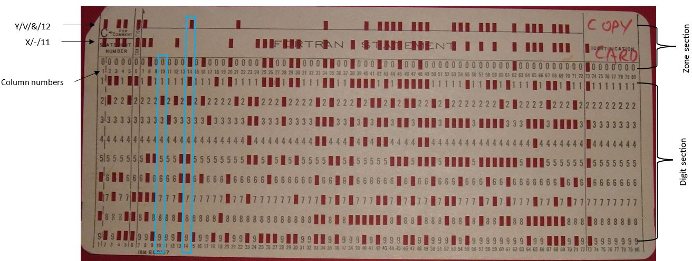 <figcaption></figcaption> </figure>

**Figure 3. Annotated Punched Card.** Edited by authors. Original image source: Reinhold, A. (2006). [Binary punched card.](https://commons.wikimedia.org/wiki/File:IBM1130CopyCard.agr.jpg) [Online image]. Wikimedia Commons.

The data on completed punched cards were converted into digital data points using card readers. These files may have .colbin or .bin extensions, but they can also have extensions that reflect the content of the file. In these cases, the extension name will begin with “c”, followed by a series of numbers that identify the dataset. For example, “PURDUE.c0038” is the name of the column binary file for Purdue Opinion Panel # 38.5.[^5] *(This dataset is currently unconverted in the Roper Center archive. See link for snapshot information about the survey; see example files for codebook and column binary file.)*

In Windows File Explorer, the file type typically reflects the extension name, except in the case of .bin files, which are misidentified as video files (see Figure 4).

<figure> 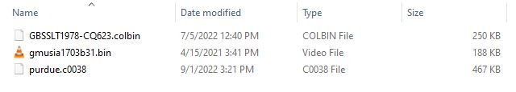 <figcaption></figcaption> </figure>

**Figure 4. Examples of Column Binary File Extensions.** 

In column binary files, each bit represents a single data point, unlike today’s data formats, which use 64 bits to represent a single data point. Consequently, the colbin format is unreadable to today’s machines and software because they try to read 64 bits, rather than 1, for each data point.

# Software for Viewing or Analyzing Data

Column binary files must undergo a conversion process so that the data can be read on modern computers. The raw data are then coded and labeled in order to make the dataset independently understandable for future users.

[SAS](https://www.sas.com/en_us/home.html) code can be used to create a .sav file containing the raw column binary data (see example files). It is also used to create an x-ray, which shows the structure of the data (i.e., the frequencies for each value in each column). (For more information, see [X-ray files.](#x-ray-files)) The raw data can then be coded and labeled using [SPSS](https://www.ibm.com/products/spss-statistics) syntax. Alternatively, it can be exported to another statistical program, such as [Stata](https://www.stata.com/) or [R](https://www.r-project.org/), for coding.

Codebooks are critical in the conversion process as they provide information on which column variables are stored in and how responses are coded. Depending on the format of the codebook, a text editor (such as Notepad or TextEdit) or document viewer (such as [Adobe Acrobat](https://www.adobe.com/acrobat.html)) can be used to view the file. If study documentation is currently only available in paper format, it should be scanned as part of the curation process. 

In order to make the coding and labeling process more efficient, it may be helpful to create a template for generating the syntax in [Microsoft Excel](https://www.microsoft.com/en-us/microsoft-365/excel) or a similar program. 

# Examples

Column binary was once the standard data format used in survey research, and it is common to encounter older survey data (e.g., data from approximately the 1930s-1960s) that is only available in column binary format. Typically a data curator would be asked to curate a survey that is relevant to the user’s area of academic research (e.g., [German Demoskopie surveys](https://bit.ly/3gFuNmY) beginning in the 1930s), a survey that falls under a grant-funded project (e.g., the [British Gallup surveys](https://ropercenter.cornell.edu/ipoll/search?collection=LSM&experimental=NON&org=9896ce75-db8f-4e14-82fa-57df68a3e236&tab=STUDY)), or a survey that is either not widely available through other archives or not available through other archives at all. 

Opening the file in a text editor is a good first step in verifying that it is, in fact, a column binary file. Doing so can rule out the possibility that it is a plain text file with an unusual extension. To do this in Windows, double-click the file and open in Notepad or a similar program (see Figure 5). Notepad’s attempt to read a column binary file will result in a series of uninterpretable characters (see Figure 6).

<figure>  <figcaption></figcaption> </figure>

**Figure 5. Column Binary File in Windows File Explorer.** 

<figure> 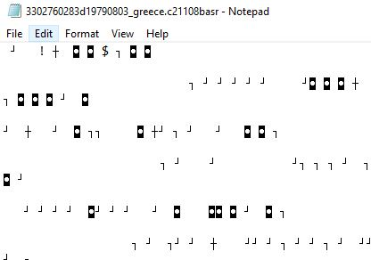 <figcaption></figcaption> </figure>

**Figure 6. Column Binary Data Opened in Notepad.** 

Column binary files can be opened in TextEdit on Mac (see Figures 7 and 8). As with Notepad, TextEdit will be unable to read the file and will instead display random characters that do not reflect the actual contents of the file (see Figure 9).

<figure> 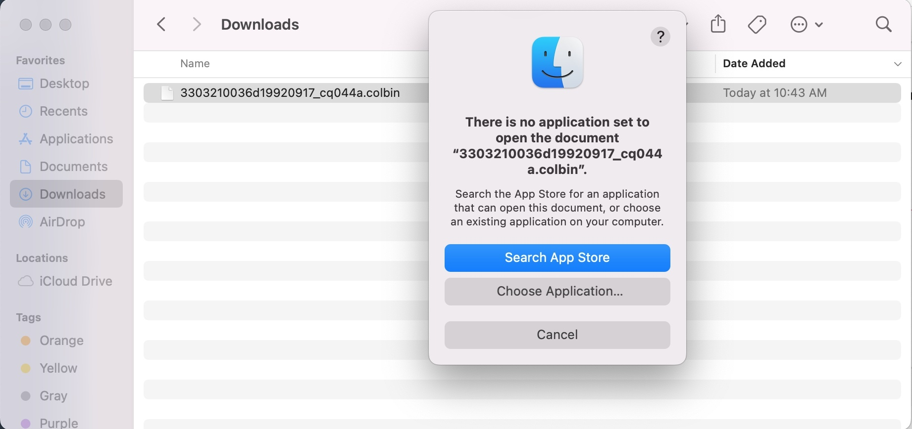 <figcaption></figcaption> </figure>

**Figure 7. Column Binary File in Mac Finder.** 

<figure> 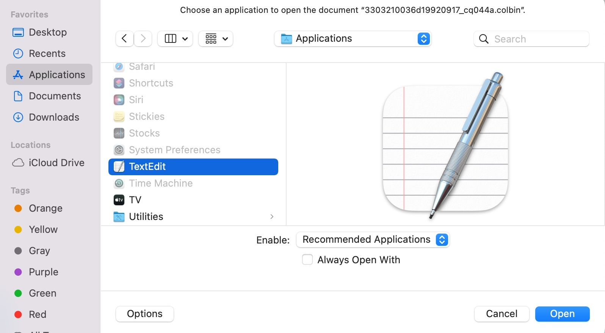 <figcaption></figcaption> </figure>

**Figure 8. Choosing TextEdit to Open Column Binary File.** 

<figure> 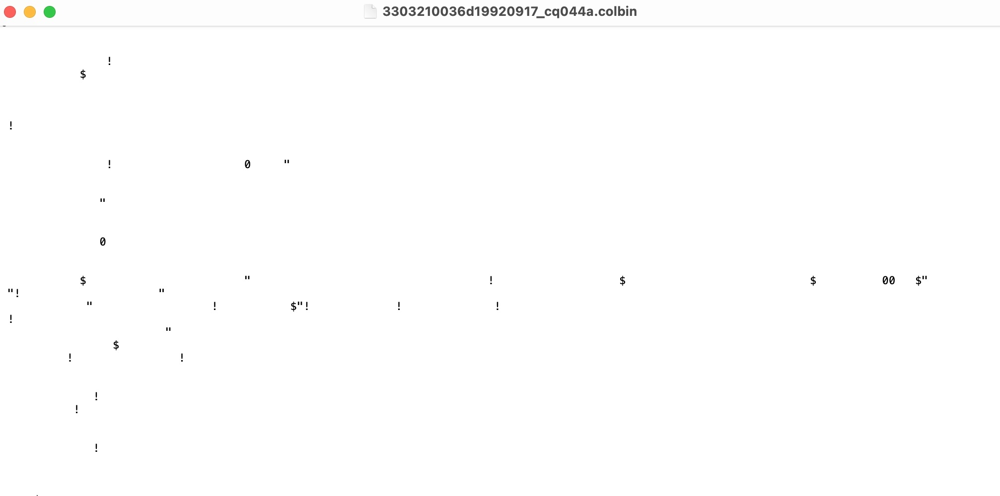 <figcaption></figcaption> </figure>

**Figure 9. Column Binary Data Opened in TextEdit.** 

After checking the file in a text editor, try importing the raw data into SPSS (see [Import data into SPSS](#import-data-spss)). A column binary file that has been correctly imported into SPSS will look similar to Figures 10 and 11. The rows represent cases/respondents, and the variables represent punched card columns for single-punched columns (like those in Figure 10) and individual punches for multi-punched columns (like Column 1 in Figure 11). For more information, see [Multi-punched columns](#multi-punched-columns) and [Columns vs. variables](#columns-vs-variables).

<figure> 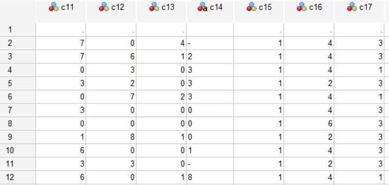 <figcaption></figcaption> </figure>

**Figure 10. Raw Data in SPSS - Singled-punched.** 

<figure> 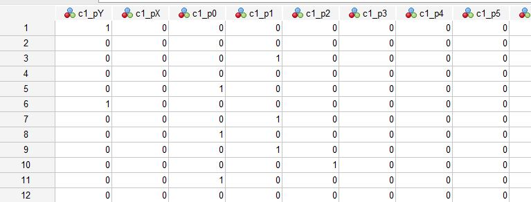 <figcaption></figcaption> </figure>

**Figure 11. Raw Data in SPSS - Multi-punched.** 

<figure> 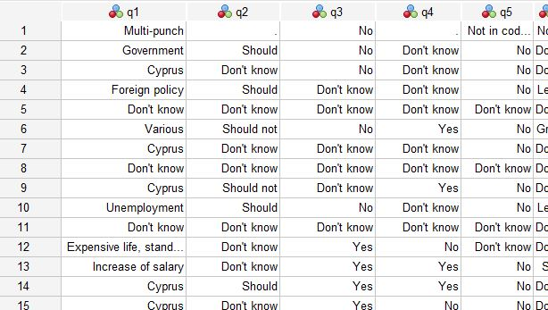 <figcaption></figcaption> </figure>

**Figure 12. Completed Conversion in SPSS.** 

# Resources for reviewing data after a conversion

After a curator completes a column binary conversion, it is recommended that a second curator reviews the conversion. The following resources are useful for column binary conversion review.

- SAS-generated x-ray: The frequencies in the converted dataset can be checked against the x-ray frequencies to ensure that errors were not made in the coding process (see [X-ray files](#x-ray-files)).

- Codebook: The coding decisions, variable names, and variable and value labels should reflect the available information on column locations, question wording, and response codes.

- Original frequencies: Response frequencies are sometimes available in the study codebook. It may also be possible to find frequencies in reports, books, or other published materials.

# Key Considerations

## Interpreting the codebook

It can be challenging to interpret old codebooks and understand where particular questions are stored in the dataset. This is often due to issues such as poor scan quality, illegibility of handwritten notes, and missing pages. Missing pages were sometimes purposely redacted because they contained proprietary data; in other cases, they may have simply been lost or not included when the documentation was scanned.

Additionally, there are often supplemental codes in the back of the codebook that inform how you should assign value labels for variables, so reading the whole codebook is the only way to make sure you haven’t missed any information.

## Multiple cards

In many cases, surveys were fairly long, so more than one card was needed to record all of a respondent’s answers. You can often tell that a dataset has more than one card because the x-ray file^ will show some multiple of the number of observations indicated in the codebook, and this will be coupled with the correct number of observations distributed across punches in one of the first several columns (punches 1 and 2 for two card surveys, punches 1, 2, and 3 for three card surveys, etc.). It’s also possible for the card number to be located in one of the last columns, but this is less common.

^ An x-ray file will automatically generate using the RUNXRAY.SAS syntax file (see [X-ray files](#x-ray-files)). It is best practice to always review the x-ray file and use it to decipher unconverted data and to check against converted data. 

For example, the documentation in Figure 13 indicates that the column binary dataset for [British Gallup Poll CQ 44A6](https://doi.org/10.25940/ROPER-31074052)[^6] has 2 cards and a sample size of 1078. If the dataset is imported as if it only has one card, it will have 2156 records (see Figure 14). The x-ray in Figure 15 shows that Column 2 has 1078 punches for response 1 and 1078 for response 2, which is an indicator that the card number is stored in that column. You can also see that the sum column indicates that there are 2156 responses through Column 16. When the dataset is imported as a multi-card dataset with the card number recorded as Column 2, the total number of records is still 2156 (see Figure 16), but the number of records per card is 1078 (see Figure 17). Figures 18 and 19 reflect punches for each card individually (check Col. 2 to see which card is being shown). Figure 19 helps us understand why the first x-ray had 2156 punches only through Col. 15—card 2 only has data through Col. 15!

<figure> 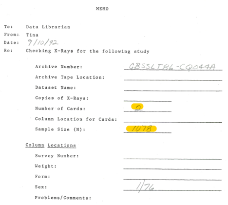 <figcaption></figcaption> </figure>

**Figure 13. Documentation for British Gallup Poll CQ 44A.** 

<figure> 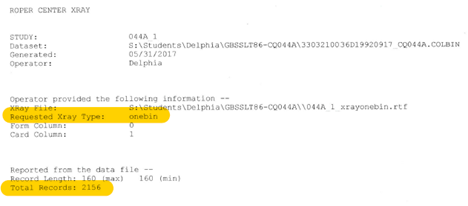 <figcaption></figcaption> </figure>

**Figure 14. British Gallup Poll CQ 44A Imported as One-card Survey.** 

<figure> 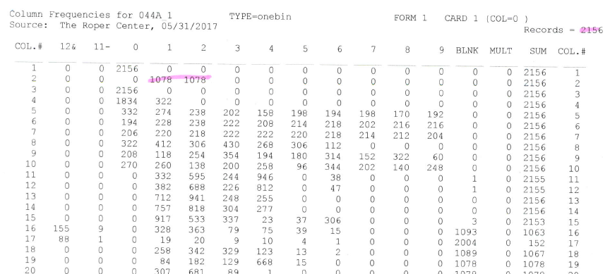 <figcaption></figcaption> </figure>

**Figure 15. British Gallup Poll CQ 44A One-card X-ray.** 

<figure> 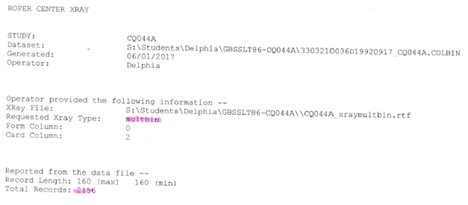 <figcaption></figcaption> </figure>

**Figure 16. British Gallup Poll CQ 44A Imported as Multi-card Survey.** 

<figure> 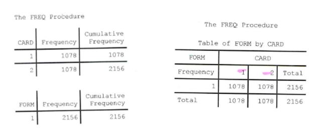 <figcaption></figcaption> </figure>

**Figure 17. British Gallup Poll CQ 44A Multi-card Frequencies.** 

<figure> 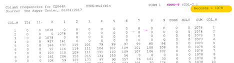 <figcaption></figcaption> </figure>

**Figure 18. British Gallup Poll CQ 44A X-ray - Card 1.** 

<figure> 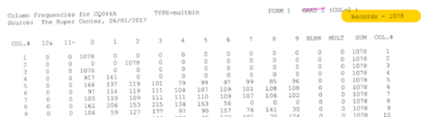 <figcaption></figcaption> </figure>

**Figure 19. British Gallup Poll CQ 44A X-ray - Card 2.** 

<figure> 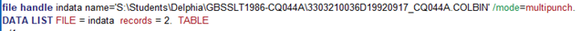 <figcaption></figcaption> </figure>

**Figure 20. British Gallup Poll CQ 44A SPSS Import Syntax.** 

## X-ray files

X-ray files are files generated using SAS that are unique to each dataset, as they record the frequencies for each value in each column of the data. 

<figure> 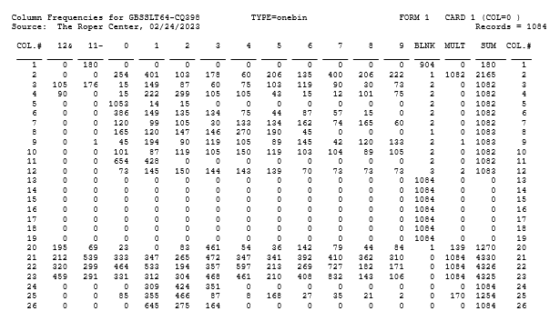 <figcaption></figcaption> </figure>

**Figure 21. X-ray Example.** 

To create an x-ray file:
1. Copy the SAS example files into a folder of your choosing. 
2. Open the RUNXRAY.SAS file and change each of the directories to the appropriate file paths for each SAS file.
3. Set the directory for the colbin data file you would like to input to the file path where the colbin data file is located.
4. Change the archive number in the “%LET ARCHNO=” statement to an identifier that you would like to appear at the top of each page of the x-ray file.
5. Set the x-ray type in the “%LET XRAYTYPE=” statement to “onebin” if using a one card colbin file or to “multbin” if using a multiple card colbin file. (Note: Your codebook should ideally contain information on how many cards your dataset has.)
6. Set the SPSS setting in the “%LET SPSSTYPE=” statement to “fullspss” if you would like an SPSS setup file generated (recommended) or to “nospss” if you do not need an SPSS setup file.
7. Set the number of cards in the “%LET CARD=” statement to the number of cards associated with your colbin dataset.
8. Click submit (the running man icon on the toolbar at the top) to run your code. Once run, you should have an .rtf file generated in your designated folder. This will be your x-ray file. If you selected “fullspss” in step 6, you should also have a .sps file (setup file) appear in your designated folder. (See Import data into SPSS for information on how and when to use your .sps file.)

## Multi-punched columns

Computing power and materials were expensive, so the punched cards were used as efficiently as possible. While each column often represented a single question and would only have one punch/response/value, this is not always the case. There are three reasons that a column can have multiple punches, and determining why the column is multi-punched is key to understanding how to recode the data correctly.

- First, columns frequently contained the answers to two or more questions. These questions are not always sequential (e.g., not always 2a and 2b).  
    -	 This type of multi-punch is typically identified while reading through the codebook. For example, you might see that Question 2a is listed as being in Column 14 and that Question 2b is also listed as being in Column 14. This would create a multi-punch scenario, as more than one response per respondent would be entered into a single column.

- Second, sometimes a question asked a respondent to select "all that apply" and multiple answers would be recorded. 
    -	 This type of multi-punch is typically identified by reading through the codebook. For example, you may see “Select all the apply” in parentheses following the question when there is only one column listed as being assigned to that question. Alternatively, it may be indicated in the way the question itself is worded. For example, if a question asked, “Which of the following items do you have in your household?”, but there was only one column listed as being assigned to that question, this would indicate that multiple responses were not only allowed for that question, but they were recorded in the same column, creating a multi-punch scenario.

- Third, a multi-punch can indicate a mistake in the data. If an incorrect answer was (mistakenly) punched, the only way to fix it was to also punch the correct answer, which created a multi-punched column.
    -	 This type of multi-punch is typically identified by consulting the data and/or the codebook. Sometimes, for example, you might see that a respondent entered 2 responses for the same question, but that question did not ask for multiple answers. It sometimes happens that one of the responses recorded in the data was a response that was listed in the codebook, but that the other response recorded in the data was not a response that was listed in the codebook. In such a case, you would know that the response recorded in the data that did not correspond to a response listed in the codebook was incorrect. 

## Columns v. Variables

Often, the column and question/variable correspond directly to one another, so that Col. 2 = Question 2. When a column corresponds to a single question with only one answer, Col. 2 is imported as a single variable when the colbin file is imported. When columns contain a multi-punch for any reason (see [Multi-punched columns](#multi-punched-columns)), the column can no longer be imported as a single variable. 

This makes sense if you think about it. For each variable, a respondent can only have one value (e.g., can’t be equal to both 4 and 7). If a single column has two questions or the question is “select all that apply”, then there is no way for one variable to represent both values that a respondent reports, so the column cannot be imported as a single variable. The only way to faithfully import data in which respondents have more than one answer/value/punch in a column is to create a binary variable for every single punch—functionally turning every value in the column into a “Did the respondent pick this answer? Y/N” question. Thus, one multi-punched column will be imported as 12 different variables. These are sometimes referred to as "sprayed" values or variables. Because the program cannot determine why there is a multi-punch in a column, the curator will have to identify which answers can be recoded into a single variable and which must remain separate variables.

## Logic flows

Sometimes the meaning of a column’s punches relies on a previous question. For example, Col. 1 might ask if the respondent is male or female, and Col. 2 might represent the answers for two different questions—one for men and one for women. Thus, all men and women will have answers in Col. 2, but those responses will need to be separated into two different variables—one for men and one for women—and labeled based on the answer to Col. 1.

In Figure 22, the codes for Q16H depend on whether respondents answered “Satisfactory” or “Unsatisfactory” to Q16G. SPSS syntax for analyzing and recoding conditional questions can be found in the example files (logic_flows.sps). 

<figure> 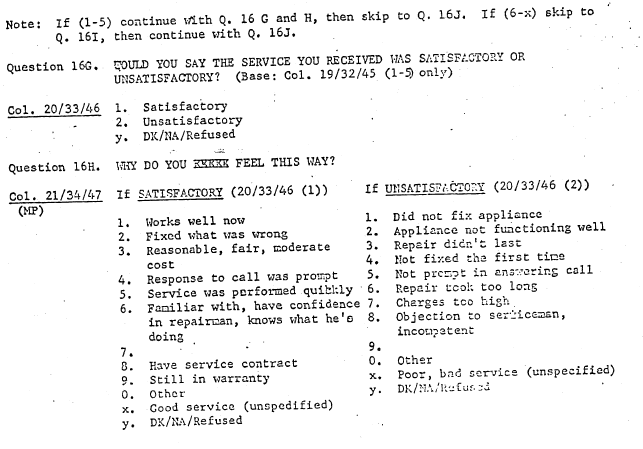 <figcaption></figcaption> </figure>

**Figure 22. Questions 16G and 16H from General Electric Quarterly Survey 68-02.[^7]** 

## Merge vs. append

Sometimes a column binary study will actually have more than one dataset. More than one card can be stored in the same dataset, so multiple datasets are sometimes a result of previous conversions gone poorly. If the datasets represent new information on the same people (i.e., more questions), then you will need to merge the two datasets using a unique respondent ID so that each respondent/case will have more variables. If there is no way to uniquely identify observations that match across the two datasets (i.e., if there is no unique respondent ID found in the datasets), then you will probably not be able to merge the datasets. If the second dataset is the same set of questions/variables but includes additional people, then you will append that dataset to the first dataset.

## Checking converted frequencies

Codebooks will sometimes include frequencies against which one can check converted dataset frequencies, but other times they are not provided, making it more difficult to determine whether the conversion was completed correctly. 

In these cases, you may search online or in other libraries and archives to see if the frequencies have been preserved in newspapers, magazines, journals, or published books. Publishing frequencies in these ways was much more common prior to the 1980s.

Sometimes, though, frequencies may be unavailable either in the codebook or public record. In such instances you will need to simply review the frequencies–without anything to check them against–to make sure that the answers at least make sense. For example, if a question asked respondents’ preferred political party, you could reasonably expect the percentages to approximately match with other preferred party data from that time. You may consider it a red flag if a minor party corresponded to the highest percentage of responses. Such cases should be documented in a study note.

# Column binary conversion process

Note: This section focuses on using SPSS for column binary conversion, but the steps can be adapted for other statistical software programs, such as Stata or R.

1. Converting column binary data to another format involves the following steps:
2. Importing the data
3. Recoding variables
4. Cleaning data
5. Renaming variables and assigning variable/value labels
6. Checking the conversion

## Import data into SPSS

1. Run x-ray.
    -	 Using the RUNXRAY.SAS file, set your directories and operator name.
    -	 Enter an identifier for your dataset under item 2—this can be almost anything you want. If your dataset has one record per case, enter “1” under item 7 and “onebin” under item 5. If your dataset has multiple records per case, enter the number of records per case under item 7 and “multbin” under item 5. Click run. (Note: The number of cards (i.e., records per case) can almost always be found in the codebook.)

<figure> 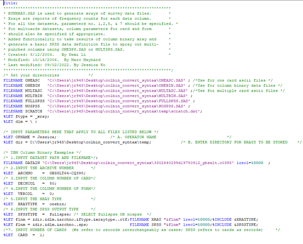 <figcaption></figcaption> </figure>

**Figure 23. Example of SAS Syntax.** 

2. Open the generated syntax file and run the FILE HANDLE, DATA LIST, and ALTER TYPE commands. The syntax file will be titled FULLSPSS.sps. This will import the data from the colbin file into SPSS.

3. Open the generated SPSS file and proceed to recoding the variables.

## Recode variables

So you’ve imported the data. Now you’ll need to recode the variables so that they accurately reflect the codebook. 

### Identify and recode multi-punches

The first step is to identify multi-punches. There are multiple ways you can do this. One involves using the x-ray, while another involves relying heavily on the data imported into your preferred statistical software (in this case SPSS). We typically use both of these methods in tandem.

#### How to identify multi-punches using the x-ray.

You can use the x-ray to visually help you understand the structure of the data, and it can serve as a reference point for making coding decisions in the SPSS syntax. 

1. Do the number of records/respondents/observations match the codebook/file? 
    - Yes: Great!
    - No: Is it possible they don’t match because there is more than one card? (Usually double or triple the expected number of records and/or an easily identifiable column with equal numbers of 1 and 2 punches)
        - Do all values correspond to the codebook?
            - Y: Great!
            - N: How many multi-punches are in non-corresponding value?
                - Lots: Check the back of the codebook—is it possible there are answers that amend the original codebook?
                - Few: Maybe it’s a mistake/bad punch.
2. Do non-corresponding values cause multi-punch issues? 
    - No: Recode as part of the column-variable and attach the value label “Not in codebook”
    - Yes: If you remove that punch from the crosstab, does it fix the multi-punch issue?
        - Yes: Delete those values (this should only ever be done if there are only 1 or 2 multi-punched cases) OR recode the values as their own binary variable named “Potential mistake”
        - No: The multi-punch issues are in the variable itself, and you do not need to recode the values 
3. Which columns have multi-punch issues? Is the multi-column greater than 0? 
4. If multi>0:
    - Is the question “select all”?
        - Y: Keep as separate variables
        - N: Next question
    - Are there multiple questions recorded in the column?
        - Y: Recode into separate variables and recheck for multi-punches
        - N: Maybe can’t fix unless easy to ID bad punch that doesn’t correspond to codebook; otherwise keep as separate variables
    - Is it only 1 or 2?
        - Y: Go to 4bii. (N: Maybe can't...)
        - N: Read through the codebook carefully and double-check your answers above—is there any additional information in the codebook?
5. Are there any conditional questions that will need to be separated out into multiple variables? (See [Logic flows](#logic-flows).)

#### How to identify multi-punches in SPSS.

After you import the colbin file into SPSS, you can run crosstabs on the values within each column to help identify the multi-punches and make sure that the way you are planning to recode the variables is correct. Figure 24 shows how to interpret multi-punch crosstabs output. For example multi-punch crosstabs syntax, see ITDOXA54-0333.sps in the example files.

<figure> 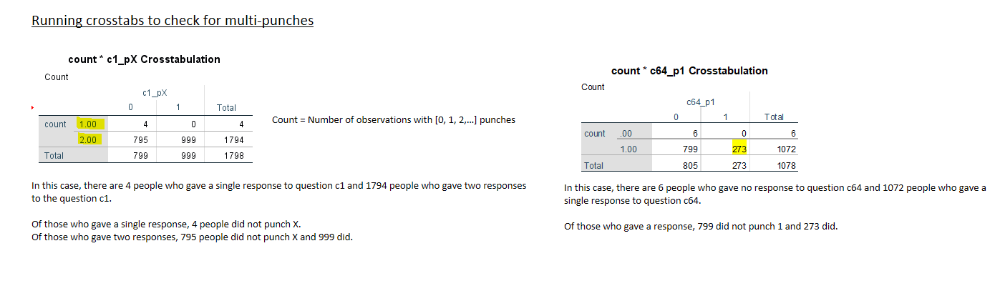 <figcaption></figcaption> </figure>

**Figure 24. Visual for Interpreting Multi-punch Crosstabs.** 

If multiple questions are stored in a single column, run multi-punch crosstabs again with the punches separated according to the codebook to verify that this will resolve the multi-punches. If so, the questions can be recoded into separate single-punched variables.

If a column contains a “select all that apply” question, the sprayed variables should be kept separate. 

If there are only one or two multi-punches, and it’s a question for which multiple responses don’t make sense (e.g., income), it is likely a mistake. If you can identify one of the punches as a stray punch –  if one is not in the codebook and the other one is – the stray punch can be recoded into its own separate variable and the rest of the responses can be recoded into a single variable. If the multi-punch values are all in the codebook, it is impossible to identify which is the “true” response, and the punches should be kept as separate variables.

### Recode string variables

If a single punched column contains an X or Y punch, the entire column will be imported as a string variable. Multi-punched variables will be imported as a set of dummies/binary numeric variables. For example, in Figure 25, Cols. 37 and 38 will be imported as string, while Col. 39 will be imported as a set of binary variables. This is also evident in the syntax file (see Figure 26).To facilitate analysis, string variables should be converted to numeric variables, and any X/- and Y/& values will need to be recoded to 11 and 12, respectively.

*Note: Do **not** recode your X and Y values to 11 and 12 until you have checked to be sure the width is set to at least 2. In SPSS, this is accomplished using “ALTER TYPE [insert variable names] (F2).”. If recoding of X and Y values is attempted prior to adjusting the width to 2 (if necessary), the X and Y values will be recoded as 1 instead of 11 and 12, and the dataset may need to be re-converted.*

<figure> 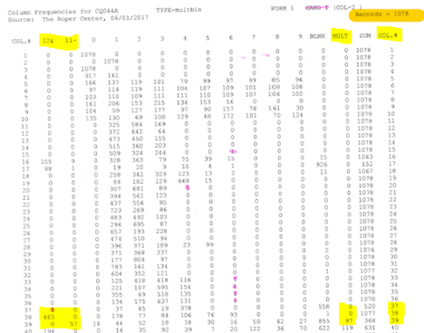 <figcaption></figcaption> </figure>

**Figure 25. String Values in X-ray.** 

<figure> 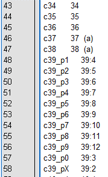 <figcaption></figcaption> </figure>

**Figure 26. String Values in SPSS Syntax.** 

### Additional Recodes

For some datasets, additional recoding may be helpful. One common example is that the survey number is often stored across several columns. These can be recoded to condense them into one variable.
A less common example is that sometimes a single question might span two or more columns. Often these are questions for which numeric answers over 9 are possible. For example, in Figure 27, a punch of 2 in c48 means 200 if 0 was punched in c47, but it means 1200 if 1 was punched in c47. 

<figure> 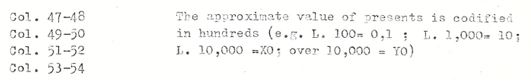 <figcaption></figcaption> </figure>

**Figure 27. Question Spanning Multiple Columns.** 

## Clean data

Delete old variables that aren’t needed (i.e., variables that you have recoded into new variables or variables that do not contain any data and are not found in the codebook).

Additionally, recoded variables drop to the bottom of the list of variables, which throws the question numbers out of order. In SPSS, the “add files” syntax can be used to re-order them (see ITDOXA54-0333.sps in the example files). Be sure to include “all.” at the end of the syntax – otherwise, any variable not listed will be removed from the dataset. The variables will be re-ordered in the order in which they are listed. Any variables in the dataset that are not included in the list will come after the listed variables (in their original order). 

## Rename Variables and Assign Variable Labels

At this point, any variables that have not been renamed yet should be renamed, and labels should be added to reflect the codebook. It can be helpful to generate the syntax for naming and labeling variables in an Excel template (see GBSSLT86-CQ044A_processing_readlabels.xlsx in example files), then cut and paste from Excel into SPSS.

### Variable names

There are two primary considerations for naming variables: 1) consistency across and within surveys and 2) ease of interpretation for the end user. In our opinion, the second consideration should take precedence over the first, especially because we want people to use our data and find it helpful and easy to access. Additionally, colbin files vary so much over time and across surveys that a standard naming convention might be difficult to implement, although consistency within a survey is worth striving for so that users can identify and use the logic of variable names to help them make sense of the data and its structure. 

Often a question/variable and column share a number, and in that case the name is quite straightforward (e.g., Col. 1= Q1). If a column contains more than one variable, they will frequently be labeled with a letter suffix (e.g., 1a, 1b, 1c) in the codebook, which also translates easily into variable names. The most difficult variables to name are those that represent multi-punched columns, and the easiest way to do that is to append a suffix that makes the punch value clear (e.g., _p1, _p2, _p3 correspond to values of 1, 2, and 3). This has the added bonus of embedding the original data structure into the naming convention so that users can easily identify variables as part of a multi-punched column, which can help them interpret old and complex codebooks.

### Variable labels

Variable labels should reflect the question wording in the codebook. If the variables are left in a multi-punched (i.e., "sprayed") format, it is recommended that the value label be included in parentheses at the beginning of the variable label. For example:
Q1_p1 "(Democrat) Do you consider yourself a Democrat, Republican, Independent, or Other?"
Q1_p2 "(Republican) Do you consider yourself a Democrat, Republican, Independent, or Other?" 
Q1_p3 "(Independent) Do you consider yourself a Democrat, Republican, Independent, or Other?" 
Q1_p4 "(Other) Do you consider yourself a Democrat, Republican, Independent, or Other?" 
Q1_p5 "(Don't Know) Do you consider yourself a Democrat, Republican, Independent, or Other?"
Q1_p6 "(Refused) Do you consider yourself a Democrat, Republican, Independent, or Other?"

### Value labels

It is very common to have values in the dataset that don’t appear in the codebook (e.g., some respondents have selected 6, but there is no 6 option in the codebook). Sometimes these are a mistake or they are answers to questions that don’t appear in the codebook; if that’s the case, usually the odd answer(s) are multi-punches. If the answers aren’t multi-punches, there’s a good chance that the survey firm added additional answers OR assigned categories to open-ended responses after the codebook had been written. These additional codes often are in the back of the codebook. Additionally, sometimes there is an option that actually corresponds to “blank” or “no punch” or “skip”, as in the case of logic flows.
If none of these things seems to apply, simply label the value that has no identifier in the codebook as “Not in codebook”. This way, the end user can decide what to do with these odd responses.

## Check conversion

When checking conversions, you will first want to look in the codebook for handwritten calculated percentages to check against. However, many times these are not provided. If frequencies are not available in the codebook or in public record, you can check the converted dataset frequencies against the original x-ray and do common sense checks (see Checking converted frequencies). Finally, you will want to check for possible spelling errors made during the process of coding labels.

# Applicable Metadata Standard, Core Elements, and README Requirements

While there are no standards specific to column binary files, the [Data Documentation Initiative](https://ddialliance.org) (DDI)[^8] metadata standards are applicable to survey data more generally. More information on DDI standards can be found in the [SPSS Data Curation](https://github.com/DataCurationNetwork/data-primers/blob/master/SPSS%20Data%20Curation%20Primer/SPSS-data-curation-primer.md#Appendix-D-DDI-Metadata) primer.[^9]

Study metadata includes survey organization, field dates, sample size, and sample population description. File level metadata includes the original codebook sent by the survey organization and information on the structure and content of the converted dataset. For details on recommended metadata elements, see [Appendix B](#appendix-b). 

# Preservation actions

 - Converted column binary data should be saved in plain text formats (e.g., .por, .csv, .dat)
 - It is recommended that codebooks and other supporting documentation be saved in Portable Document Format/Archival (PDF/A)

# Documentation of curation process: What to capture

 - The syntax used to bring the raw data into a statistical software program such as SPSS
 - The syntax used to code and label variables
 - A study note describing how any issues have been handled. Such issues include:
  - Unclear or missing documentation
  - Discrepancies between dataset frequencies and frequencies found in documentation
  - Dataset frequencies that don’t make sense based on question content (e.g., 100% presidential approval rating)

# Ways in which fields may use this format 

Converted datasets can be used for quantitative analysis of survey data. Converted column binary data is primarily of interest to historians, public opinion researchers, and political scientists studying long-term trends.

# Bibliography

## Cited in Text

[^1] Common MIME types—HTTP | MDN. (n.d.). MDN Web Docs. Retrieved October 24, 2022, from https://developer.mozilla.org/en-US/docs/Web/HTTP/Basics_of_HTTP/MIME_types/Common_types

[^2] IBM Archives: 1928. (2003, January 23). [TS200]. IBM. https://www.ibm.com/ibm/history/history/year_1928.html

[^3] IBM100—The IBM Punched Card. (2012, March 7). [CTB14]. IBM; IBM Corporation. https://www.ibm.com/ibm/history/ibm100/us/en/icons/punchcard/breakthroughs/

[^4] Reinhold, A. (2006). Binary punched card. [Online image]. Wikimedia Commons. https://commons.wikimedia.org/wiki/File:IBM1130CopyCard.agr.jpg

[^5] The Purdue Opinion Panel. (1954). Purdue Opinion Panel # 38: Some Ethical Values of Youth, Compared over the years (Version 1) [Dataset]. Cornell University, Ithaca, NY: Roper Center for Public Opinion Research. doi:10.25940/ROPER-31096337

[^6] Social Surveys (Gallup Poll) Limited. British Gallup Poll CQ 44A, 1986 [Dataset]. Roper #31074052, Version 2. Social Surveys (Gallup Poll) Limited [producer]. Cornell University, Ithaca, NY: Roper Center for Public Opinion Research [distributor]. doi:10.25940/ROPER-31074052

[^7] General Electric. General Electric Quarterly Survey 68-02, 1968 [Dataset]. Roper #31092117, Version 4. Trendex, Inc. [producer]. Cornell University, Ithaca, NY: Roper Center for Public Opinion Research [distributor]. doi:10.25940/ROPER-31092117

[^8] DDI Alliance. (2023, February 24). DDI. https://ddialliance.org/

[^9] Deng, Sai; Dull, Joshua; Finn, Jeanine; Khair, Shahira (2019). SPSS Data Curation Primer. Data Curation Network GitHub Repository. Retrieved March 8, 2023 from https://github.com/DataCurationNetwork/data-primers/blob/master/SPSS%20Data%20Curation%20Primer/SPSS-data-curation-primer.md

## Additional Useful Resources

Punched card—Wikipedia. (n.d.). Wikipedia. Retrieved October 24, 2022, from [https://en.wikipedia.org/wiki/Punched_card](https://en.wikipedia.org/wiki/Punched_card)

Douglas W. Jones’s punched card index. (n.d.). Retrieved October 24, 2022, from [https://homepage.divms.uiowa.edu/~jones/cards/](https://homepage.divms.uiowa.edu/~jones/cards/)

# Appendix A: Column Binary CURATE(D) Checklist

The following is an adaption of the DCN's [CURATE(D) Checklist](z.umn.edu/curate):

## C - CHECK

 - Verify that the data file is, in fact, a column binary file
 - Review the contents of the codebook and other supporting documentation

**Curator checklist:**

Data:
- [ ] Data file is in column binary format

Available Documentation:

- [ ] Codebook
- [ ] Frequencies
- [ ] Methodology report
- [ ] Other: _____________

## U - UNDERSTAND

 - Use SAS to create x-ray and bring raw data into SPSS (or other statistical program)
 - Save syntax file
 - Review raw data
 - Check x-ray against information in the codebook
 - Check for missing coding information

**Curator checklist:**

Data file and x-ray

- [ ] Raw data file can be opened
- [ ] X-ray can be opened
- [ ] Data structure in x-ray matches what is expected based on the column locations in the codebook
- [ ] Contents of raw data file match what is expected based on x-ray

Available coding information:

Column locations
- [ ] Complete
- [ ] Incomplete: _____________
- [ ] Missing

Question wording:
- [ ] Complete
- [ ] Incomplete: _____________
- [ ] Missing

## R - REQUEST

 - Identify and investigate potential sources of missing documentation information

**Curator checklist:**

Due to the historical nature of column binary data, it is usually not possible to contact those who were involved in designing and conducting the survey for information missing from the documentation. Books, articles, or other sources referencing the survey may be helpful in filling in the gaps, however.

## A - AUGMENT

 - Recode variables as needed
 - Apply variable and value labels
 - Remove variables that create privacy concerns as needed (e.g., zip code, phone number)
 - Update metadata for data record

**Curator checklist:**

- [ ] Variables recoded according to codebook
- [ ] Variable and value labels match questions and responses in the codebook
- [ ] Dataset frequencies match frequencies in documentation (if available) and x-ray frequencies
- [ ] Dataset does not contain personally identifying information
- [ ] Study metadata updated to reflect converted dataset and any previously unavailable documentation

## T - TRANSFORM

 - After reviewing the converted data file, save in multiple data formats to provide greater accessibility
 - Create data locations and x-ray files for ASCII file
 - Scanned paper documentation as needed
 - Save documentation

**Curator checklist:**
Data file saved in the following formats:
- [ ] SPSS
- [ ] Stata
- [ ] ASCII
- [ ] CSV
- [ ] Other: _____________

Documentation

- [ ] Additional materials (e.g., ASCII data locations and x-ray, study note) added to documentation file
- [ ] Main documentation file and any other supporting documentation files (e.g., reports) saved in PDF/A format

## E - EVALUATE

Evaluate data for [FAIR](https://www.go-fair.org/fair-principles/)ness 

**Curator checklist:**

Findability
- [ ] Study assigned unique Persistent ID (archive number, DOI)
- [ ] Files archived
- [ ] Metadata accurate and as complete as possible
- [ ] Study entry available in archive/database search results

Accessibility
- [ ] Metadata accessible in study entry
- [ ] Files made available for download with authentication and authorization
- [ ] Data cleaned to ensure clarity/easier use

Interoperability
- [ ] Standardized metadata
- [ ] Data available in multiple formats

Reusability
- [ ] Study documentation (including study note) is as complete as possible
- [ ] Data usage Terms & Conditions are clear

## D - DOCUMENT

 - Document conversion process using syntax and readme files
 - Document helpful information (e.g., special coding decisions) and address any issues (e.g., incomplete codelists) in a study note for users

**Curator checklist:**

Internal elements
- [ ] Syntax file (e.g., .sps file) documenting code for:
  - Bringing data into SPSS (or other statistical program)
  - Coding and labeling variables
  - Saving converted data file in other formats
- [ ] Internal readme file documenting:
  - Study identifier
  - Date processed
  - Variables removed due to privacy issues
  - Number of variables and cases in converted data file
  - Other information as needed

External elements (available as part of main documentation file)
- [ ] Cover sheet with core metadata
- [ ] Study note
- [ ] ASCII data locations
- [ ] X-ray for ASCII file

# Appendix B: Recommended metadata elements for survey research

The following items are recommended as best practice for archival work in Roper Center’s DDI-based system. However, DDI-based standards can sometimes present challenges. In such cases, simply creating a well-documented codebook and/or including a readme file with important metadata and notes can be a useful alternative.

Note: Some recommended elements may not be available or applicable for a given survey.

1. Study metadata
 - Study level
  - Processing state (This indicates whether the study is awaiting curation, in progress, on hold, ready for review by another curator, or completed.)
  - Date last updated
  - Primary processor
  - Primary QA
  - Depositor
  - Submission source
  - Date of record creation
  - Submission date
  - Title of data collection
  - Survey organization
  - Survey sponsor
  - Project lead
  - Data collection date(s)
  - Grant funding
      - PI
      - PI affiliation
      - Funder
      - Grant number
  - Geographic coverage area(s)
  - Abstract
  - Usage notes
  - Embargo date
  - Sample population description
  - Mode of data collection
  - Sample design
      - Sample size
      - Procedure (e.g., probability-based, non-probability, quota, etc.)
  - Response rate
      - Percentage
      - Definition (e.g., AAPOR RR3, etc.)
  - Sampling error estimate
      - Percentage
      - Confidence level
  - Number of variables
  - Location and format of weight variable
  - Data-related publications
  - Additional items for internal use
 - File level
  - File name
  - File title (for external display)
  - File description (for external display, if applicable)
  - File size
  - File type
  - File format
  - Version number
  - Language(s) used in file
  - Access level
  - Source of file
  - Archive status
2. Data level metadata 
 - Codebook originally sent by survey organization (details pre-conversion information)
  - Question text
  - Response options (text and associated numeric value)
  - Data locations
 - Codebook created for converted dataset
  - Data locations (post-conversion)
  - List of truncated variable names
  - Study notes (noting oddities/unresolvable issues, if applicable)

