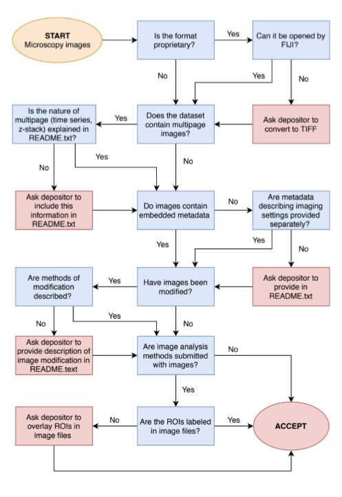
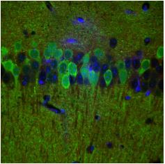

# Confocal Microscopy Data: A Primer for Curators

## Executive summary

|   Topic   |   Description   |
| :------------- | :------------- |
| File Extensions | .lsm (Zeiss - proprietary)[^1]   .czi (Zeiss - proprietary)   .nd2 (Nikon NIS-Elements 2 - proprietary)   .lif (Lecia - proprietary)   .oib (Olympus - proprietary)   .zip   .tiff (open source - recommended for archiving)[^2]   |
| MIME Type | Image/tiff |
| Structure | Tiff stack, images and text |
| Versions | Multiple (20xx-2019) |
| Primary fields or areas of use | Biology, health, engineering, chemistry |
| Source and affiliation | Multiple companies - microscopy software |
| Metadata | ABCD: [Access to Biological Collections Data](https://github.com/tdwg/abcd) (ABCD) (Version 3.0 2019)[^3]   OME: [OME-XML - Open Microscopy Environment XML](https://github.com/tdwg/abcd) (2012)[^4] |
| Tools for curation review | Word or text editor, ImageJ or image viewer |
| Date Created | 2019-07-01 |
| Created by | Susan Ivey- North Carolina State University   Amy Koshoffer - University of Cincinnati   Gretchen Sneff - Temple University   Huajin Wang - Carnegie Mellon University   Team Mentor - Lisa Johnston – University of Minnesota |

----------------------------
**Suggested Citation:** Ivey, Susan; Koshoffer, Amy; Sneff, Gretchen; Wang, Huajin. (2019). Confocal Microscopy Images Data Curation Primer. [Data Curation Network GitHub Repository.](https://github.com/DataCurationNetwork/data-primers)

This work was created as part of the “Specialized Data Curation” Workshop #2 held at Johns Hopkins University in Baltimore, MD on April 17-18, 2019. These workshops have been generously funded by the Institute of Museum and Library Services # RE-85-18-0040-18.

----------------------------
## Curation workflow decision tree

Figure 1. Curation flowchart.

Notes:

1. This flowchart contains workflow for confocal image-specific curation questions. Generic data curation questions should be inspected as usual but are not included in this chart.

2. Image analysis process is out of scope for this primer

*It is recommended to document your curation process per your institution's or your repository’s best practices.

## Primer sections

[Executive summary](#executive-summary)
  
[Curation workflow decision tree](#curation-workflow-decision-tree) 

[Primer sections](#primer-sections) 

> [Introduction](#introduction)   [Confocal data format description](#confocal-data-format-description)   [Key curatorial questions](#key-curatorial-questions)   [Applicable metadata standards, core elements, and readme requirements](#applicable-metadata-standards-core-elements-and-readme-requirements)   [Resources/Software for viewing or analyzing data](#resourcessoftware-for-viewing-or-analyzing-data)   [Preservation actions](#preservation-actions)   [What to look for to make sure this file meets FAIR principles](#what-to-look-for-to-make-sure-this-file-meets-fair-principles)   [Ways in which fields may use this format](#ways-in-which-fields-may-use-this-format)   [Unresolved issues/further questions beyond the scope of this initial primer](#unresolved-issuesfurther-questions-beyond-the-scope-of-this-initial-primer)   [Additional recommended reading](#additional-recommended-reading)   [Primer references](#primer-references)

### Introduction

Confocal microscopy is a type of microscopy technique to image objects that are too small to view with the unassisted human eye. It uses narrow wavelengths of light (in the visible spectrum 380 nm to 700 nm) generated from a laser to image different types of materials (biological, material). The light is also directed through a spatial pinhole so that out of focus light is not used in creating the image. The advantages to researchers of using confocal microscopy over simple light microscopy are mainly: 1) the ability to view thin sections of an optically thick sample (e.g., a whole cell) by blocking out-of-plane light, 2) the ability to label and image different cell or tissue types concurrently, and 3) reconstruction of 3-dimensional structures by stacking 2-dimensional images collected through the entire depth-offield of the sample. Researchers are able to “optically section” a sample to look through it at high resolution. The high-resolution 3D images (often called “z-stacks”) that can be created through confocal microscopy are one attribute of confocal image data that distinguishes it from other types of image data.

To generate a confocal image from a sample (i.e. biological or material specimen), the samples are fixed to preserve the subcellular structure and stained with dyes that are targeted to specific proteins or subcellular structures. These dyes emit fluorescent light under laser beams of specific wavelengths, allowing the illumination of the target subcellular structure with a confocal microscope. Then samples are mounted on a glass slide and covered with a glass coverslip. The specimen is then placed on the microscope platform and the parameters of the microscope are optimized to capture the fluorescent light image(s) (at specific excitation/emission wavelengths) and sometimes a brightfield (white light) image. The result is often multiple images of the same area of sample captured at different wavelengths. Images of the different lasers and brightfield can be separated into individual channels or merged as a multicolor image. Also, with most microscopes, the parameters can be saved and reused for future experiments[^5]. Some of the parameters are: pinhole size, objectives used, zoom and digital magnification, height of microscope platform, number of scans (which gives distance in height captured or z length), speed of scan, image averaging, lasers used, power of laser, and brightfield image settings. After the images are captured, they are sometimes processed for region of interest, background subtraction, and other post capture modifications. The final images that will be used for publication can be the single channel image, a merged image, a processed image, a z-stack, or a cropped version of these previously mentioned images.

Many microscopes operate using proprietary software (e.g. Zeiss confocal scopes generate the .czi file format). However, best practice is to save images in both the raw data format, which may or may not be a proprietary format with specific instrument and experiment metadata, and a lossless format such as a .tiff file. To preserve and protect the raw data, make copies of images, then convert and export the images as .tiff files.

When researchers share their data via a data repository, they may share the raw, intermediate, and or processed data. Raw data would be all the images captured directly off the microscope without processing. However, it sometimes makes sense to share intermediate data converted for image analysis or ease of access. A researcher should document any post capture processing if submitting processed images. In order to share this data in a repository, the data generator needs to provide documentation on:

- the origin of samples

- samples preparation procedures

- microscopy settings

- the context of channels (colors)

- intended audience

The purpose of this primer is to guide a data curator through the curation process for confocal images. It describes the image specifics, as well as what details and metadata from the instrumentation and experiment is needed to understand the images and use them for further research or educational purposes.

### Confocal data format description

Many microscopes produce proprietary formats, but it is recommended that users convert to TIFF to be submitted to repository, because it is sufficient to reproduce analysis using the TIFF format.

(Example confocal image - Localization of Metabotropic Glutamate Receptors in Alpha Synuclein Overexpressing Mouse[^6])

[**Cell Image Library:**](http://www.cellimagelibrary.org/home)[^7] a well  curated cell imaging database, where datasets are associated with a project ID, and tagged by biological properties (e.g. species, process, cell type), equipment type (e.g. confocal or EM), imaging settings, sample preparation method, etc. This repository is an appropriate subject repository for these types of data.

- CIL Project: P1723, Localization of Metabotropic Glutamate Receptors in Alpha Synuclein[^8], is an example of a project that contains many well-documented datasets.

- However, not all examples in the library are well labeled. For example, CIP Project 38979, a confocal image of breast cancer cells in culture[^9], has no details, and only gives DOI and ARK.

### Key curatorial questions

1. What are the depositor's expectations about future reuse?

2. What are the minimum files required to meet depositor’s expectations for reuse?

3. Are the minimally required files and metadata present?

4. Do the files need to be migrated to a more open/interoperable format (i.e. from .lsm to .tiff)?

5. Does the structure of the dataset make sense?

6. Is the documentation robust enough for others to understand the dataset (i.e. can the biological or other significance of image be understood from documentation)?

7. Who is the intended user community (researchers, education, media outlet, general public)?

8. Are there any search, discovery, or access requirements that need to be met for this community (example – contribution page of [Cell Image Library:](http://www.cellimagelibrary.org/home) [^10])?

9. Does any of the data need to be restricted due to privacy concerns?

### Applicable metadata standards, core elements, and readme requirements

**Metadata standards:** There are two standards commonly used for microscopy images.

- The OME Model [^11] is a specification for storing data on biological imaging. The model includes image parameters, such as XYZ dimensions* and pixels type, as well as extensive metadata on, for example, image acquisition, annotation, and regions of interest (ROIs). This common specification is essential for the exchange of image data between different software packages

- The Access to Biological Collections Data (ABCD) schema[^12] is the schema used in the [Cell Image Library](https://www.re3data.org/repository/r3d100000023)[^13]. The ABCD schema is an evolving comprehensive standard for the access to and exchange of data about specimens and observations (a.k.a. primary biodiversity data). The ABCD Schema attempts to be comprehensive and highly structured, supporting data from a wide variety of databases. It is compatible with several existing data standards. Parallel structures exist so that either (or both) atomised data and free-text can be accommodated.

**Elements:** Use core elements from one of the above schemas, in addition to the following descriptors specific to microscopy (Cell Image Library contribution page – Submit[^14])

1. Biological or Material Source (e.g., organism, cell type, cellular components, and fixation method, sectioning, etc. if applicable)

2. Biological Context and Probe (e.g., mitotic spindle during division labeled with tubulin primary antibody and Alexa 488 secondary or EGFP-tubulin)

3. Equipment used (e.g., microscope manufacturer, objective with NA, camera, confocal)

4. Acquisition parameters for time series (e.g., taken at 2 frames per second or confocal z stack taken with 1 Airy unit slices), post-processing of still images, if any

5. Magnification of image (either a scale bar or a note with microns/pixel) *dimensions - size of images

**Documentation:** A readme file should be included for every dataset. A minimum requirement would be at the dataset level; a readme for each child work should be included as needed. Cornell provides [an excellent guide](https://data.research.cornell.edu/content/readme#recommendedcontent)[^15] for creating readme files and what is recommended minimum content for data reuse.

**Licensing information:** The recommendation for licensing data is to apply the CC0 public domain dedication to the work[^21]. This would clarify that the creator releases any copyright to the work. However, with images, the decision is not so straightforward. Copyrighted works are those that require creative or design choices, and the creation of confocal images require some choices by the researcher. Also, some publications allow researchers to maintain copyright of their submitted images while some do not. Researchers should check with the publisher to determine their author’s rights. If the researcher can retain copyright, they may also wish to add a license. The license communicates what limitations the researcher wants to place on the work. For guidance, researchers can refer to the Creative Commons website[^16] or the Cell Image Library licensing page[^22] or refer to the policies of publishers or intended repositories for permitted licenses.

### Resources/Software for viewing or analyzing data

**Resource:** Fiji/ImageJ - [https://imagej.net/ij/index.html](https://imagej.net/ij/index.html)[^17] - LMS browser

> Purpose: This is an open source java-based image viewer and analysis software. Open and analyze many file types such as .lsm confocal images, .jpeg, and .tiff file formats.   When to use: after image capture    Barrier: learning curve

**Resource:** (Adobe) Photoshop - [https://www.adobe.com](https://www.adobe.com)[^18]

> Purpose: to open images and make edits, add text, etc.   When to use: after image capture   Barrier: cost, learning curve is steep, proprietary software Edits should not be made if planning to analyze the images or uniform edits should be made to all images.

**Resource:** Omero - https://www.openmicroscopy.org/index.html[^19] (the system used by the [cell image library](http://www.cellimagelibrary.org/home)[^20])

> Purpose: to view, organize, analyze, and share microscopy images   When to use: after image capture. Depending on need to share data   Barrier: Open Source project - possible lack of support or sustainability

### Preservation actions

To identify the MIME type, change the file extension to .zip, then unzip and you will see the structure. Transform proprietary formats into TIFF.

**Guidelines for data and documentation to be deposited during curation process**

**Most Reproducible and Reusable Practice**

1. Processed data (includes transformed (converted to tiff files); analyzed files; annotated files) Note: Researchers should preserve raw (proprietary) and other data as resources/storage allows, consistent with best practices for back-up.  If funder or publisher requires all data to be accessible, link repository submission to location of raw data.

2. Readme file that includes:

  a. Detailed sample description

  b. Detailed protocol to create processed data (link to publication)*

3. Descriptive and technical metadata

**Good Enough Practice e.g. to fulfill a publisher’s mandate for a publication**

1. Preserve only transformed data (or what was submitted to publication)

2. Readme file that includes:

 a. Sample description

 b. Protocol to create processed data (link to publication)*

 c. Descriptive and technical metadata

3. **(Optional step) - Request more information, documentation, and suggest working to achieve most reproducible and reusable

**Minimum Practice**

1. Preserve what is received - raw (proprietary), transformed, processed/analyzed, annotated Note: if receiving a compressed file type, there is no action that can recover lost bytes.

2. Readme file that includes:

 a. Minimal sample description

 b. Minimal protocol to create received data set (link to publication)*

 c. Descriptive and technical metadata

3. **(Optional step) - Request more information, documentation, and suggest working to achieve Most reproducible and Reusable

* If the publication includes protocol that is detailed enough to completely reproduce raw data and is openly accessible

** The goal is always to curate and preserve the most reproducible and reusable data, while keeping in mind that depositor might be under time constraint.

### What to look for to make sure this file meets FAIR principles

The FAIR Guiding Principles can be used to check that curation actions increase the discovery and re-use of data.[^23]

**F**indability. Look for rich metadata that is appropriate to the field of study and that sufficiently describes the subject. The metadata schema employed should be widely used in the community and explicitly identified. For example, Open Microscopy Environment XML (OME-XML). Metadata[^24] should be in a format that can be captured by repositories and be searchable. The record to which the image files are a part should have a unique identifier, such as a DOI (digital object identifier), handle or persistent URI (uniform resource identifier).

**A**ccessibility. Look for metadata that is both human-readable (for example: text, html) and machinereadable (for example: text, json, xml). The image files should be downloadable. The images should be in formats that are easily viewed. The entries or records should make use of a unique identifier, such as a DOI (digital object identifier)[^25], handle or persistent URI (uniform resource identifier).

**I**nteroperability. Look for the use of community-agreed-upon and shared ontologies or standard vocabularies, for example, the Gene Ontology or others found on BioPortal[^26]

**R**eusability. Look for a data use license or public domain dedication. Look for provenance information, including attribution information, details about the creation of the dataset, and version information.

### Ways in which fields may use this format

Archived confocal images can be used as reference images for experimental design and to create expanded derivate datasets. The images can be used for image analysis, as well as example images in publications and on websites.

### Unresolved issues/further questions beyond the scope of this initial primer

Metadata completeness - This may be difficult to recover if not collected at time of experimentation or image capture.

What to save – researchers may want to consider when it is appropriate to archive/share an entire zstack, even if the whole stack is beyond the scope of their current analysis. Future users of the data may benefit from having the whole stack in ways that cannot be anticipated. It’s a balance, however, as z-stacks can add up to quite large collections of files

Handling z-stacks – do the successive images of a 3-dimensional stack of images follow a file-naming strategy that identifies the sequence effectively? How does the target repository handle file structure? Should a z-stack be zipped or compiled together in its own folder? Did the researcher create a gif showing the image through its depth-of-field? Should that be preserved, too?

Similar to z-stacks: composite images – Care should be taken to weigh the cost/benefit tradeoff of saving single-channel (wavelength/color) images and/or composite images. The Cell Image Library Detailed Viewer highlights the advantage of retaining single-channel data (turning different colors on and off), but it comes at a cost in storage and curation.

### Additional recommended reading

1. [Confocal Microscopy Wikipedia article](https://en.wikipedia.org/wiki/Confocal_microscopy)

2. [Duke University’s Light Microscopy Core Facility’s Guides and Tutorials website](https://microscopy.duke.edu/guides-tutorials)

# Footnotes
[^1]: "CZI The File Format for the Microscope - Zeiss." [https://www.zeiss.com/microscopy/en/products/software/zeiss-zen/czi-image-file-format.html#](https://www.zeiss.com/microscopy/en/products/software/zeiss-zen/czi-image-file-format.html#)

[^2]: Supported Formats — Bio-Formats 6.0.1 documentation." 13 Mar. 2019, [https://docs.openmicroscopy.org/bio-formats/6.0.1/supported-formats.html](https://docs.openmicroscopy.org/bio-formats/6.0.1/supported-formats.html) https://docs.openmicroscopy.org/bio-formats/6.0.1/supported-formats.html. Accessed 26 Jul. 2019. 

[^3]: Access to Biological Collections Data task group. 2007. Access to Biological Collection Data (ABCD), Version 2.06. Biodiversity Information Standards (TDWG) [http://www.tdwg.org/standards/115](http://www.tdwg.org/standards/115). 

[^4]: OME format page. (2019-07-09). Retrieved from  [https://docs.openmicroscopy.org/bio-formats/6.0.1/supported-formats.html](https://docs.openmicroscopy.org/bio-formats/6.0.1/supported-formats.html)

[^5]: "Confocal Microscopy in a Nutshell | Imaging & Microscopy - Research ...." 17 Aug. 2016, [https://www.imaging-git.com/science/light-microscopy/confocal-microscopy-nutshell](https://www.imaging-git.com/science/light-microscopy/confocal-microscopy-nutshell). Accessed 26 Jul. 2019. 

[^6]: Localization of Metabotropic Glutamate Receptors in Alpha Synuclein Overexpressing Mouse. "The Cell Image Library." [http://www.cellimagelibrary.org/images/CCDB_4065](http://www.cellimagelibrary.org/images/CCDB_4065) Accessed 26 Jul. 2019 

[^7]: The Cell Image Library, [http://www.cellimagelibrary.org](http://www.cellimagelibrary.org) Accessed 26 Jul. 2019. 

[^8]: CIL Project: P1723 -Localization of Metabotropic Glutamate Receptors in Alpha Synuclein Overexpressing Mouse. (2019-07-09). Retrieved from [Cell Images Library](http://cellimagelibrary.org/images?k=Localization+of+Metabotropic+Glutamate+Receptors+in+Alpha+Synuclein+Overexpressing+Mouse&simple_search=Search&per_page=10&page=1)

[^9]: A confocal image of breast cancer cells in culture. (2019-07-09) Retrieved from [http://www.cellimagelibrary.org/images/38979](http://www.cellimagelibrary.org/images/38979)

[^10]: The Cell Image Library, [http://www.cellimagelibrary.org](http://www.cellimagelibrary.org) Accessed 26 Jul. 2019. 

[^11]: OME format page. (2019-07-09). Retrieved from  [https://docs.openmicroscopy.org/bio-formats/6.0.1/supported-formats.html](https://docs.openmicroscopy.org/bio-formats/6.0.1/supported-formats.html)

[^12] Access to Biological Collections Data task group. 2007. Access to Biological Collection Data (ABCD), Version 2.06. Biodiversity Information Standards (TDWG) [http://www.tdwg.org/standards/115](http://www.tdwg.org/standards/115). 
 
[^13]: The Cell Image Library, [http://www.cellimagelibrary.org](http://www.cellimagelibrary.org) Accessed 26 Jul. 2019. 

[^14]: The Cell Image Library, [http://www.cellimagelibrary.org](http://www.cellimagelibrary.org) Accessed 26 Jul. 2019. 

[^15]: "Copyright and Data » Data Ab Initio." 17 Mar. 2016, [http://dataabinitio.com/?p=632](http://dataabinitio.com/?p=632). Accessed 26 Jul. 2019. 

[^16]: Creative Commons Homepage. (2019-07-22) Retrieved from [https://creativecommons.org](https://creativecommons.org) Accessed 26 Jul. 2019. 

[^17]: ImageJ Website home page. (2019-07-09). Retrieved from [https://imagej.net/ij/index.html](https://imagej.net/ij/index.html)

[^18]: Adobe Photoshop Homepage (2019-07-09). Retrieved from [https://www.adobe.com/](https://www.adobe.com/) Accessed 26 Jul. 2019. 

[^19]: OME format page. (2019-07-09). Retrieved from  [https://docs.openmicroscopy.org/bio-formats/6.0.1/supported-formats.html](https://docs.openmicroscopy.org/bio-formats/6.0.1/supported-formats.html)

[^20]: The Cell Image Library, [http://www.cellimagelibrary.org](http://www.cellimagelibrary.org) Accessed 26 Jul. 2019. 

[^21]: "Copyright and Data » Data Ab Initio." 17 Mar. 2016, [http://dataabinitio.com/?p=632](http://dataabinitio.com/?p=632). Accessed 26 Jul. 2019. 

[^22]: The Cell Image Library, [http://www.cellimagelibrary.org](http://www.cellimagelibrary.org)Accessed 26 Jul. 2019. 

[^23]: Wilkinson, M. D., Dumontier, M., Aalbersberg, Ij. J., Appleton, G., Axton, M., Baak, A., Mons, B. (2016). The FAIR Guiding Principles for scientific data management and stewardship. Scientific Data, 3, 160018. Retrieved from [https://doi.org/10.1038/sdata.2016.18](https://doi.org/10.1038/sdata.2016.18)

[^24]: “Metadata overview” in Harvard biomedical data management. Retrieved from [https://datamanagement.hms.harvard.edu/metadata-overview](https://datamanagement.hms.harvard.edu/metadata-overview). Accessed 26 Jul 2019. 

[^25]: “Persistent Identifiers” in the Digital Preservation Handbook, 2nd Edition, [https://www.project-consult.de/files/DPC_Digital_Preservation_Handbook_V2_2015.pdf](https://www.project-consult.de/files/DPC_Digital_Preservation_Handbook_V2_2015.pdf), Digital Preservation Coalition © 2015. Accessed 26 Jul 2019. 

[^26]: [http://bioportal.bioontology.org/](http://bioportal.bioontology.org/). Accessed 26 Jul 2019 

