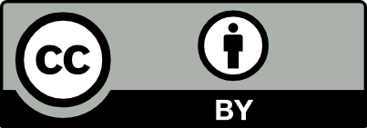
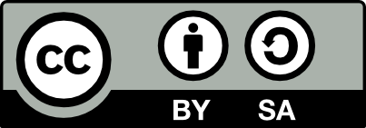
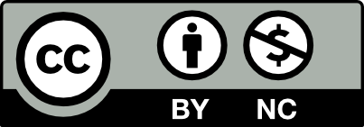
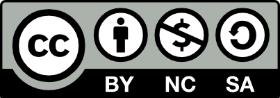
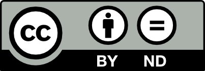
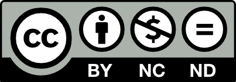
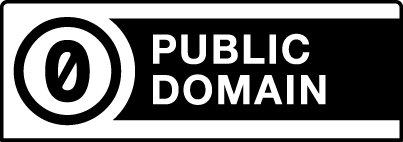

# A Primer for Applying and Interpreting Licenses for Research Data and Code

Authors: Lisa Chinn, Matthew Murray 🦇, amd Isaac Wink 

DCN Mentors: Jennifer Huck, University of Virginia 

## Executive Summary

|   Topic   |   Description   |
| :------------- | :------------- |
| Summary | Evaluating and selecting copyright licenses applied to research datasets and code in a U.S. context.|
| Primary fields or areas of use | Relevant to all fields in which data or code are shared. |
| Key questions for curation review | <li>Does copyright, a data use agreement, or terms of service impact how a researcher may reuse and disseminate previously created datasets or code?</li><li>When choosing a copyright license for their own dataset or code, what copyright, institutional, and funder factors may impact a researcher’s choice of license?</li> |
| Context-specific considerations | Consider data use agreements, institutional policies covering data ownership, and funder requirements for data sharing. |
| Tools for curation review | Tables of commonly-applied copyright licenses to datasets and code. (see below) |
| Date created | November 11, 2024 |
| Created by | <a href="https://orcid.org/0000-0003-2801-2874">Lisa Chinn</a>, <a href="https://orcid.org/0000-0001-5799-8471">Matthew Murray🦇</a>, <a href="https://orcid.org/0009-0009-5750-2283">Isaac Wink</a>   DCN Mentor: Jennifer Huck |

Suggested Citation: Chinn, Lisa; Murray 🦇, Matthew; and Wink, Isaac. (2024). A Primer for Applying and Interpreting Licenses for Research Data and Code. [Data Curation Network GitHub Repository.](https://github.com/DataCurationNetwork/data-primers)

[Overview](#overview)

[Introduction](#introduction)

[Copyright Licensing for Datasets and Code](#copyright-licensing-for-datasets-and-code)

[Common Licenses Applied to Datasets](#common-licenses-applied-to-datasets)

[Code Ownership](#code-ownership)
 
>[Who owns the copyright on computer code?](#who-owns-the-copyright-on-computer-code)  [Common Licenses Applied to Code](#common-licenses-applied-to-code)  [What license should be used for computer code?](#what-license-should-be-used-for-computer-code)  [Code Documentation](#code-documentation)

[Institutional Policies Impacting Data Licensing and Ownership](#institutional-policies-impacting-data-licensing-and-ownership)
 
>[Institutional data governance does not always address research data](#institutional-data-governance-does-not-always-address-research-data)  [Data Ownership](#data-ownership)

[Interpreting and Applying Dataset Licenses](#interpreting-and-applying-dataset-licenses)
 
>[A note on legal advice](#a-note-on-legal-advice)  [Choosing a license for a newly created dataset](#choosing-a-license-for-a-newly-created-dataset)  [Factors impacting data sharing](#factors-impacting-data-sharing)  [Helping researchers choose a license](#helping-researchers-choose-a-license)  [Navigating and Interpreting Licenses Applied to Datasets That Are Being Reused](#navigating-and-interpreting-licenses-applied-to-datasets-that-are-being-reused)  [Navigating and Interpreting Licenses Applied to Code That Is Being Reused](#navigating-and-interpreting-licenses-applied-to-code-that-is-being-reused)  [Challenges to Understanding Licenses](#challenges-to-understanding-licenses)

[Conclusion](#conclusion)

[Bibliography and Further Reading](#bibliography-and-further-reading)

[Additional Resources on Navigating Licenses](#additional-resources-on-navigating-licenses)

# Introduction

This primer gives data curators an overview of the licenses that are
commonly applied to datasets and code, familiarizes them with common
requirements in institutional data policies, and makes recommendations
for working with researchers who need to apply a license to their
research outputs or understand a license applied to data or code they
would like to reuse. While copyright issues are highly case-dependent,
the introduction to the data copyright landscape and the general
principles provided here can help data curators empower researchers to
understand the copyright context of their own data.

Copyright law in the US exists to serve the public interest.
[Copyright is the legal
framework](https://www.copyright.gov/what-is-copyright/) that grants
the creators of original works the right to control how those works are
copied, adapted, and reproduced. [Copyright law also includes
exceptions and
limitations](https://www.arl.org/know-your-copyrights/) allowing the
use and reuse of copyrighted works for classroom
teaching, scholarship, research, preservation, and accessibility,
particularly in the nonprofit scholarly context. While copyright law can
help encourage the creation of new works by allowing creators to
maintain control and potentially profit from their own work, many
scholars and other creators have sought to develop simple frameworks
that make it easier for others to share and reuse their creations, such
as text, datasets, and code.

Considering the copyright of datasets and code introduces a number of
complexities, including ambiguity on whether or not a dataset
constitutes a “creative” work, the ease with which datasets are copied
and combined, and institutional policies impacting research data and
code (such as copyright policies, data ownership policies, and data use
agreements) that may lay claim to the intellectual property produced by
researchers. Understanding copyright is also highly relevant to
researchers working to comply with open data policies from funders and
align their data with [the FAIR
principles](https://www.go-fair.org/fair-principles/) (particularly
Accessible and Reusable).

Note that while the vast majority of countries use roughly similar
copyright frameworks, there are important variations among them,
including some that apply to datasets and code. This primer applies to
the U.S. copyright context.

# Copyright Licensing for Datasets and Code

Generally speaking, an individual who produces a creative work holds
copyright to the work, meaning that others are not allowed to reproduce
or republish the work without the original creator’s permission. When a
creator allows someone else to reproduce or republish their work, they
grant a license to do so.

Copyright licenses are often part of a negotiated contract between
parties (for example, a publishing house may pay an author for a license
to publish their novel). Increasingly, however, producers of scholarly
works attach a license to their outputs that apply to anyone who uses it
in order to encourage reuse. For example, the author of an open
educational resource may attach a license to their work that gives
anyone the right to republish, reuse, or adapt the resource so long as
they cite the original author (commonly expressed as a [CC-BY
license](https://creativecommons.org/licenses/by/4.0/)).

Because the copyright framework depends on the production of creative or
original works, licensing becomes less clear when applied to datasets,
which may or may not be creative or original. In the United States, data
that is factual is generally not copyrightable because no one may
copyright facts or ideas (as established in [Feist Publications,
Inc. V. Rural Tel. Serv.
Co](https://supreme.justia.com/cases/federal/us/499/340/)).[^1]
However, the arrangement of facts (such as a dataset) may be
copyrightable if it represents an original or creative structuring. A
list of all the pizza restaurants in New York City would likely not be a
copyrightable dataset, but it could be if the list also ranked the
restaurants by their quality. The line separating copyrightable and
non-copyrightable datasets is fuzzy and depends on contextual factors.

To clear up any potential confusion, researchers can apply copyright
licenses to their data and code. By including a license, researchers
communicate to all future users the contexts in which they are or are
not allowed to reuse and republish their datasets. Examples of common
licenses applied to datasets and code are given below.

Not providing a license in fact limits the data’s long-term
reusability, because having no license means that the creator claims
full copyright and thus full control over materials. Licensing acts as a
tool of communication for the larger research community: researchers do
not know how a dataset can be used or reused if no license information
is provided. It is the curator’s responsibility to communicate this
distinction to a researcher, and providing a researcher with information
about how licensing benefits their research is an important part of any
data sharing conversation. Conversely, when a researcher wishes to reuse
a dataset that they did not create, it is also important that the
curator help the researcher identify relevant license information so
that they are empowered to comply with it.

# Common Licenses Applied to Datasets

“Data” is a very broad term (you can look at [the list of other DCN
Primers](https://datacurationnetwork.org/outputs/data-curation-primers/)
to see some of the things it includes). Some data can be copyrighted and
some data can’t be copyrighted, but regardless of its copyrightable
status, it’s important to give any published datasets a license. Giving
published datasets a license encourages researchers to reuse the data,
since they will know explicitly what is and is not allowable. Licensing
also promotes citation of the dataset, either through reuse or by
providing the dataset as evidence in research.

Most data may be licensed through two major avenues: 1) Creative Commons
licensing, or 2) a custom license or “Data Use Agreement (DUA)” agreed
upon between the data holder and the data user. Computer code uses a
different set of licenses ([see
below](#common-licenses-applied-to-code)). Creative Commons
licensing allows creators of all types of research outputs (including
datasets) to tell the public how their work can be reused. It gives
someone who wishes to reuse a work permission to reuse in a particular
way.[^2] First, let’s go over [Creative Commons
licenses](https://creativecommons.org/share-your-work/cclicenses/):

|   License Type   |   License Logo   |   What it does   |   Allows for commercial use?   |
| :------------- | :------------- | :------------- | :------------- |
|   CC BY   |   <figure> </figure>   |   Enables reusers to distribute, remix, adapt, and build upon the material in any medium or format, so long as attribution is given to the creator.   |   Yes   |
|   CC BY-SA   |  <figure> </figure>   |   Enables reusers to distribute, remix, adapt, and build upon the material in any medium or format, so long as attribution is given to the creator. If you remix, adapt, or build upon the material, you must license the modified material under identical terms.   |   Yes   |
|   CC BY-NC   |   <figure> </figure>   |   Enables reusers to distribute, remix, adapt, and build upon the material in any medium or format for noncommercial purposes only, and only so long as attribution is given to the creator.   |   No   |
|   CC BY-SA-NC  |   <figure> </figure>   |   Enables reusers to distribute, remix, adapt, and build upon the material in any medium or format for noncommercial purposes only, and only so long as attribution is given to the creator. If you remix, adapt, or build upon the material, you must license the modified material under identical terms.   |   No   |
|   CC BY-ND   |   <figure> </figure>   |   Enables reusers to copy and distribute the material in any medium or format in unadapted form only, and only so long as attribution is given to the creator.    |   Yes   |
|   CC BY-NC-ND   |   <figure> </figure>   |  Enables reusers to copy and distribute the material in any medium or format in unadapted form only, for noncommercial purposes only, and only so long as attribution is given to the creator.  |   No   |
|   CCO (CC Zero)  |   <figure> </figure>   |   CC0 (aka CC Zero) is a public dedication tool (rather than a license), which enables creators to waive their copyright and put their works into the worldwide public domain. CC0 enables reusers to distribute, remix, adapt, and build upon the material in any medium or format, with no conditions. While use of CC0 does not require attribution, scholarly norms expect datasets available under these terms to be fully attributed.   |   Any conditions  |

Note: While other kinds of licenses, such as [Open Data
Commons licenses](https://opendatacommons.org/), may be applied to
datasets, we focus mainly on Creative Commons licenses in this primer
because they are commonly used across a variety of institutional,
generalist, and domain-specific repositories.

Custom data licenses are usually negotiated at the time of data
acquisition and may be used by your library if your library provides
datasets as part of its collections strategy on campus.[^3]
Additionally, individuals, departments, or research centers might be
responsible for licensing data, and contract offices may manage DUAs in
addition to or in lieu of your library. As a curator, it is possible
that you interact with data licensing only at the end of the curation
process, when ingesting data into a repository. Nevertheless, it can be
helpful to know the data licensing terms applied to datasets held by
your library so that you can help researchers understand the terms by
which they can reuse or adapt the datasets.

# Code Ownership

Computer code is an important type of research output and may take many
forms from small scripts to full suites of software. Currently, there is
limited agreement across funder and journal mandates about whether code
created for research projects counts as research data. NASA specifically
requires computer code and software to be shared as part of its [data
sharing
guidelines](https://www.nasa.gov/wp-content/uploads/2021/12/nasa-ocs-public-access-plan-may-2023.pdf).
The NIH has [Best Practices for Sharing Research
Software](https://datascience.nih.gov/tools-and-analytics/best-practices-for-sharing-research-software-faq)
(separate from its [Data Management & Sharing
Policy](https://sharing.nih.gov/data-management-and-sharing-policy/about-data-management-and-sharing-policies/data-management-and-sharing-policy-overview))
and [requires a
statement](https://sharing.nih.gov/data-management-and-sharing-policy/planning-and-budgeting-for-data-management-and-sharing/writing-a-data-management-and-sharing-plan#elements-to-include-in-a-data-management-and-sharing-plan)
listing software needed to access or work with datasets as part of Data
Management and Sharing Plans. However, software is not considered
research output by the NIH and is not required to be shared.
[General NSF
policies](https://new.nsf.gov/policies/pappg/24-1/ch-11-other-post-award-requirements#ch11D4)
encourage (but do not require) researchers to share software they have
created, while specific NSF programs (such as the [Office of Polar
Programs](https://www.nsf.gov/pubs/2022/nsf22106/nsf22106.jsp)) may
have policies that require code and software to be shared. For any
project that involves code, it is important to check the specific grant
policies and requirements.

Institutional policies may cause computer code to be classified
differently from other research data. For example, an institution might
not claim ownership of a dataset but will claim ownership of code or
software written to analyze that data. One reason for this is that
software and code may be copyrightable and patentable in ways other
datasets might not be. Institutions might then claim ownership of the
code as intellectual property in order to exploit it commercially.

Another challenge researchers may face is the difference between “code”
(the lines of programming text written in a specific language, such as
Python) and “software” (an executable file or application) and what
licenses apply to each. Additionally, it may not be possible to apply
one code license to all code developed in a project as different pieces
of code may require different licenses, depending on how they were
developed.

There are also situations in which the [Code of Best Practices in
Fair Use for Software
Preservation](https://www.arl.org/wp-content/uploads/2018/09/2019.2.28-software-preservation-code-revised.pdf)
may be relevant.

## Who owns the copyright on computer code?

Computer code is typically copyrightable. The owner of code created by a
researcher depends on the academic institution’s policies. Some
institutions claim ownership (or a share of ownership) for all code
created by faculty or staff while employed by the institution or only
code created using resources provided by the institution (such as a
laptop or high-powered computing system), while others will not claim
any ownership. This can be complicated when computer code includes
contributions from multiple people on a research project, each of whom
may have different statuses within an institution.

While for many works the owner of the copyright controls how it may be
released, the collaborative nature of code means that the owner of the
copyright may be limited in how they are permitted to release the code
due to licenses that apply to projects as a whole. Consider the
following scenarios:

- Code A is owned by a student because it was written on their own time using their own computer and is submitted to an open-source project.

- Code B is owned by an institution because it was written by a staff member during work hours using an institutionally supplied computer and is submitted to an open-source project.

In both of these scenarios, the copyright holder differs; however,
because the open-source project requires contributions to be submitted
under a specific license, the license for both will be the same. In this
case, once the code has been released, the project license, and not the
copyright holders, indicates how the code can be reused by others.

## Common Licenses Applied to Code

There are many different licenses available for computer code. GitHub
currently lists [over
30](https://docs.github.com/en/repositories/managing-your-repositorys-settings-and-features/customizing-your-repository/licensing-a-repository),
while the Open Source Initiative lists [over
100](https://opensource.org/licenses). Thankfully, there are a
smaller number of licenses that are more commonly used for code
generally and academic code specifically. Helpful resources for
comparing and selecting licenses include GitHub’s “[Choose an open
source license](https://choosealicense.com/)” website, the Open
Source Initiative’s [OSI Approved
Licenses](https://opensource.org/licenses), and the European
Commission’s [Joinup Licensing
Assistant](https://joinup.ec.europa.eu/collection/eupl/solution/joinup-licensing-assistant/jla-find-and-compare-software-licenses).
[TLDRLegal](https://www.tldrlegal.com/) provides software
licenses in plain English.

Below are five of the most commonly used code licenses. Several of these
licenses require that the entirety of the license be included within the
code or software itself and may not be suitable for small pieces of code
(under 300 lines). While some licenses are intercompatible, others are
not. Permissive licenses allow users more freedom in how they reuse code
and all of the following licenses allow for commercial use.

|   License Name   |   Type of License |   Requirements on Reuse of Code or Software  |
| :------------- | :------------- | :------------- |
|   <a href="https://choosealicense.com/licenses/apache-2.0/">Apache License 2.0</a>   | Permissive License |   <li>Full license and copyright information must be included.</li><li>Changes to code must be specified.</li>  |
|   <a href="https://en.wikipedia.org/wiki/BSD_licenses">BSD licenses</a> (assorted variations)   |   Permissive License |   <li>Full license and copyright information must be included.</li>  |
|   <a href="https://choosealicense.com/licenses/cc0-1.0/">CC0: Creative Commons Zero v1.0 Universal</a>   |  Public Domain Waiver |   <li>Does not need to include full license or copyright information.</li>  |
|   <a href="https://choosealicense.com/licenses/gpl-3.0/">GPL: GNU General Public License 3.0</a>  |   Copyleft License |   <li>Full license and copyright information must be included.</li><li>Changes to code must be specified.</li><li>The source code for any software must also be released.</li>  |
|   <a href="https://choosealicense.com/licenses/mit/">MIT License</a> (the most popular license on GitHub)   |   Permissive License |   <li>Full license and copyright information must be included.</li>  |

## What license should be used for computer code?

The biggest concern for choosing a license for computer code will depend
on whether the code is entirely original or based upon or expanding upon
existing code. While some licenses are intercompatible, this is not
always the case. There are also some licenses, such as GPL, that require
any derivative works to be released under the same license (similar to
how a [CC BY-SA](https://creativecommons.org/licenses/by-sa/4.0/)
license works). It’s also possible that an institution will have a
preferred license that they require code to be released under.

|   What is the researcher doing?    |   What sort of license should be used?   |
| :------------- | :------------- |
| Creating entirely new code from scratch | The researcher gets to choose whichever license they want for their work. They should make sure that any collaborators working on the project with them are aware of the selected license.|
| Forking an existing project (copying an existing piece of code to develop it separately from existing projects/developers) | When creating a fork, check to see what license is being used for the existing project. Some licenses will require the use of the same license as the original projects, while others will allow a new license for the code to be used. |
| Creating new code that requires other pieces of code or libraries as dependencies | Some licenses require that any code that uses libraries or other code as dependencies must use the same license, while others allow a new license to be used. [Some licenses](https://www.gnu.org/licenses/gpl-faq.en.html#GPLIncompatibleLibs) may be modified from the default version with additional permissions or exceptions that allow them to be used as dependencies. |
| Contributing to an existing project | Those contributing to an existing project should use whichever license the project already uses, otherwise, their code may not be accepted.|

## Code Documentation

Documentation for code and software may be found embedded within the
code itself (in the form of code comments) or as separate files. When
more robust documentation (for example, a user guide or help
documentation) is provided, it is not included under the code license
and can be released under a separate license. This may be the same
license as the code, a Creative Commons license, or a
documentation-specific license such as the [GNU Free Documentation
License](https://www.gnu.org/licenses/fdl-1.3.en.html). If using a
separate license for documentation, make sure that any code samples
within the documentation are released under the same license as the code
as a whole.

# Institutional Policies Impacting Data Licensing and Ownership

Curators should be aware of any institutional policies on data
licensing. You may find policies organized under larger umbrella
policies. There are a few places where one may find data licensing
policies for a given institution, namely 1) institutional data
governance policies and 2) other internal policies. You may also
confront the reality of university or organizational data that is
internal to that institution. In other words, universities are
collecting and analyzing more and more data on their own students. This
type of institutional data is out of the scope of this Primer, as we are
focused on research data, but is an important distinction to note. We
will take a look at these avenues below.

## Institutional data governance does not always address research data

While institutional data governance policies may govern both research
data and institutional data, most institutions separate institutional
data governance from research data governance. If a curator is working
with institutional data, or data that is derived from administrative
research about the organization, then such guidelines can often be
found on organizational websites. Such data usually includes data about
campus admissions, matriculation of students, and other core
institutional data.

Some universities have institutional research data policies that have
been approved by a Board of Regents/President of the University or the
Chancellor/Provost of Research. Curators may find policies on a separate
web page devoted exclusively to all policies as approved by the
authorized parties. Check with your institution to see if such policies
are housed in the same place. Some policies may be housed under an
“institutional data governance” umbrella, while research data policies
might be categorized and found under the auspices of the Office of
Research (e.g., “Vice Chancellor of Research”, “Vice Provost of
Research”, etc.).

## Data Ownership

Research institutions often speak about “data ownership” to fit data
within the framework of property; however, they may also use the term to
communicate researchers’ responsibility to protect or disseminate data
they produce.

Curators may find policies at their own institutions dictating that the
institution owns data collected, created, and disseminated as a part of
research done at that institution. For instance, [Harvard’s Research
Data Ownership
Policy](https://cpb-us-e1.wpmucdn.com/websites.harvard.edu/dist/6/18/files/2020/07/data_ownership_policy_08.06.19.pdf)
states that “The University asserts ownership over research data for
projects conducted at the University, under the auspices of the
University, or with University resources.” Many institutions share this
reading of data ownership, so it is imperative to read university
policies implicating data ownership carefully to understand the
landscape of data ownership and how it applies to data licensing within
a particular data repository. Institutions may also have different rules
in place for data generated by faculty, staff, and students or for
institutional data and research data.

While some institutions have a policy on data ownership, other
institutions may instead have policies on data stewardship, while
others only have an overarching data custodianship policy. Ownership,
stewardship, and custodianship are part of a broader conversation about
the relationship between data and property rights. All three are
integral to conversations on the what, how, and who of data licensing.
Licensing is fundamentally about sharing data, and each institution will
have variations on how data may be shared beyond its walls.

Research funders typically refer to data ownership to emphasize
researcher responsibilities and highlight that data is frequently
co-created with research participants. The [National Institutes of
Health’s National Center for Advancing Translational
Science](https://toolkit.ncats.nih.gov/glossary/data-ownership/)
defines data ownership broadly and within the context of [data
registries](https://toolkit.ncats.nih.gov/glossary/registry/):
 
> “[Data](https://toolkit.ncats.nih.gov/glossary/data/) ownership 
refers to both the possession of and responsibility for information. 
Data owners have the ability to access, create, modify, package, 
derive benefit from, sell, or remove data, as well as the right to 
assign these access privileges to others. Data in a 
[registry](https://toolkit.ncats.nih.gov/glossary/registry/) 
traditionally has been owned by the registry sponsor. If there is more 
than one sponsor of the registry, ownership of the data should be 
clearly defined and legally documented. However, increasingly 
[patient](https://toolkit.ncats.nih.gov/glossary/patient/) 
registries, especially those sponsored by rare and genetic disease 
patient groups and umbrella organizations, are providing more 
ownership rights to individual participants, including allowing 
participants to decide on a case by case basis who can view or access 
their data.”

Here, the landscape for data ownership is context-specific: up to now,
we have seen registry sponsors, most commonly disciplinary societies,
institutions, or organizations, claim ownership of the data held in
their repositories. However, a shift toward ownership of data
originating from human subjects is currently changing discussions of
ownership and access.

This shift towards patient-owned data is especially influenced by
Indigenous data sovereignty, reflected in the [CARE Principles for
Indigenous Data Governance](https://www.gida-global.org/care). The
CARE Principles,[^4] as they are commonly known, emerged from the Global
Indigenous Data Alliance and in response to the FAIR data principles. As
a complement and critique of FAIR, CARE places the sovereignty of
Indigenous people at the center of data practices and policies.
Decisions about how, when, where, and what data are collected are
connected to the historical and power differentials inherent in
Indigenous communities across the globe. CARE is an acronym standing for
Collective Benefit, Authority to Control, Responsibility,
and Ethics. While CARE provides an ethical grounding for the shift
towards patient-centered data, [TK
Labels](https://localcontexts.org/labels/traditional-knowledge-labels/)
provide licensing labels for accepted use of local, contextual data. As
individual ownership of data may affect institutional policies, it is
imperative to know and understand your institution’s data licensing and
ownership policies.

# Interpreting and Applying Dataset Licenses

Data curators have an important role to play in assisting researchers in
interpreting and applying dataset licenses in two common cases: 1)
suggesting the appropriate license for a researcher’s original dataset,
and 2) understanding licenses that have been applied to a dataset a
researcher would like to reuse. This section will provide
recommendations for both cases.

## A note on legal advice

There is a crucial principle that curators should keep in mind when
discussing copyright: Under no circumstances should a data curator give
legal advice to a researcher. Specifically, this means that the curator
should not tell a researcher that the reuse of a particular dataset is
definitely permissible, nor should they offer guarantees that a
researcher has the required legal permissions to share certain data. The
role of the data curator is to provide relevant information to the
researcher on licenses that best meet their research aims and funder or
institutional requirements for their data and code, but it is ultimately
the responsibility of the researcher to determine the best course of
action based on that information. The curator should avoid giving the
impression that they are making a legal determination of the
researcher’s situation with regards to copyright.

How to Avoid Giving Legal Advice

| When a researcher asks…           | Curators should…   | Curators should not…                  |
|---------------------------------------------------------------------------------------------------------------------------------------|--------------------------------------------------------------------------------------------------------|-------------------------------------------------------------------------|
| If they can republish an existing dataset as part of a new combined dataset.            | Help the researcher locate and understand a license or data use agreement that applies to the dataset. | Tell the researcher they are definitely permitted to reuse the dataset. |
| If they have full copyright over a dataset they have produced.   | Provide information on what other groups might have a copyright claim to a dataset in general.         | Offer a determination that the researcher has exclusive copyright.      |
| If they can include certain information (such as images, text of books, or social media posts) in a published dataset under fair use. | Offer resources on making a fair use determination.      | Perform a fair use analysis for the researcher.  |

## Choosing a license for a newly created dataset

Whenever a researcher shares a dataset, applying a clear and
easy-to-find license is a crucial step in making data reusable because
it unambiguously indicates to others how they are allowed to adapt and
share the dataset. While the ultimate choice of what license to apply
falls to the researcher, the curator can help identify any potential
limitations on what licenses can be applied and support the researcher
in making their data as open as is appropriate.

### Factors impacting data sharing

There may be some limits that impact a researcher’s ability to share
some or all of their data or require them to use a particular license,
and the curator should check for each of them in turn.

First, the curator should ask the researcher questions to help them
determine if their dataset is copyrightable at all. In the U.S. context,
whether or not a work can be copyrighted depends on “[its originality
rather than its creator’s
effort](https://supreme.justia.com/cases/federal/us/499/340/).” This
means that a dataset comprised of an unoriginal organization of facts
cannot be copyrighted. While the line between a “creative” and
“non-creative” dataset is not always clear, a useful point of comparison
comes from the Supreme Court case Feist vs. Rural Telephone Service
Company, which found that telephone books, as compilations of names and
telephone numbers, are not sufficiently creative to be copyrightable. A
data curator cannot definitively determine if a given dataset is
sufficiently creative, but they can provide this context where relevant
to researchers.

The [US Copyright
Office](https://www.copyright.gov/comp3/chap300/ch300-copyrightable-authorship.pdf#page=21)
has stated that copyright only applies to work created by humans. Thus,
works (including data) that lack human authorship ([such as
photographs taken by
animals](https://en.wikipedia.org/wiki/Monkey_selfie_copyright_dispute))
are not copyrightable. Similarly, works produced by machines or
mechanical processes that operate “randomly or automatically without any
creative input or intervention from a human author“ are [not
copyrightable](https://copyright.gov/ai/ai_policy_guidance.pdf). The
Copyright Office currently interprets this human authorship requirement
to mean that content created by large language models (and other
generative artificial intelligence systems) is not copyrightable, but
notes that “a human may select or arrange AI-generated material in a
sufficiently creative way” as to warrant a copyright claim. This remains
a developing area of copyright law and policy.

Another factor relating to a researcher’s authority to copyright is
whether or not the dataset was co-created with others. In research
involving human participants, the researcher may have collected data to
which others would have a copyright claim. For example, if a researcher
interviewed individuals about their favorite childhood memories and
wants to share transcripts of their stories as a dataset, then the
interviewees would feasibly have a claim to copyright. When collecting
data of a qualitative nature to which participants could have such a
claim, researchers are advised to obtain [informed consent
agreements](https://github.com/DataCurationNetwork/data-primers/blob/main/Human%20Participants%20Data%20Essentials%20Data%20Curation%20Primer/human-participants-data-essentials-data-curation-primer.md)
that permit broad data sharing and waive any potential copyright
claim.[^5]

Lastly, institutional data ownership policies (discussed above) or
policies set by funders may impact how a researcher may license their
data. For example, some funders may require that datasets be licensed in
open terms that facilitate reuse, while others, particularly private
entities, may seek to limit sharing our reuse without the funder’s
permission.

Assuming the dataset can in fact be copyrighted, the curator should ask
if the dataset was created in whole or in part by reusing previously
shared content generated by someone other than the researcher. If the
researcher has merely subset publicly available data from another source
without applying any new arrangement to it, then they should reshare the
data under the same license previously applied to the data (or indicate
that the data is in the public domain). Similarly, if the researcher
accessed the content for their dataset by consenting to a data use
agreement or terms of service for a database, then those agreements
should be checked to determine if they put any restrictions on data
sharing.

Finally, the curator should ask if there are any non-copyright reasons
to restrict the resharing of the original dataset. While making data
easily accessible is a laudable goal, it must be balanced against
potential harms, such as exposure of private or otherwise sensitive
information. Other data curation primers such as the [Human
Participants Essentials
primer](https://github.com/DataCurationNetwork/data-primers/blob/main/Human%20Participants%20Data%20Essentials%20Data%20Curation%20Primer/human-participants-data-essentials-data-curation-primer.md)
and the [CARE
primer](https://github.com/DataCurationNetwork/data-primers/blob/main/CARE%20Primer/care-primer.md)
can be useful starting points for considering these non-copyright
factors.

### Helping researchers choose a license

Once the potential constraints above have been navigated, the curator
can help the researcher assess their available licensing options. In
order to ensure that future data reusers can easily understand how reuse
is permitted, curators should encourage researchers to choose one of the
well-known licenses described in the “[Common Licenses for
Data](#common-licenses-applied-to-datasets)” and “[Common
Licenses for Code](#common-licenses-applied-to-code)” sections
above. The curator should also steer the researcher away from choosing a
nonsensical license for their use case, such as applying an MIT license
(designed for software) to a tabular dataset.

While the choice of copyright terms ultimately falls to the researcher
and the control they would like to maintain over the reuse of their own
data, the curator may also wish to explain the benefits of applying a
[CC0 waiver](https://creativecommons.org/public-domain/cc0/) to
the dataset, placing it in the public domain. Researchers without
experience with copyright may instinctively want to exert at least some
sort of copyright control over their data, figuring that it is better to
be safe than sorry. However, bequeathing data to the public domain is
often an appropriate choice for most datasets (in the absence of ethical
constraints) for several reasons:

1.  If the dataset could reasonably be considered a non-creative arrangement of facts, the research may not have a copyright claim anyway.

2.  A CC0 waiver prevents the problem of “[attribution
 stacking](https://blog.datadryad.org/2023/05/30/good-data-practices-removing-barriers-to-data-reuse-with-cc0-licensing/)”
 and removes friction to future reuse by ensuring reusers that the
 researcher will not pursue a copyright infringement claim.

3.  If the researcher is concerned about plagiarism or intellectual
 theft, maintaining a strong copyright claim is not the right tool
 for addressing that problem. An individual who attempts to pass
 off the researcher’s data as their own will have violated dominant
 norms of research integrity, regardless of whether or not the
 dataset was copyrighted. Applying a CC0 waiver to a dataset does
 not extinguish the researcher’s right to not be plagiarized.

Explaining these factors to researchers may make them more comfortable
with the idea of removing all copyright limitations on the reuse of
their data, making it more easily reusable by others in the future.

Relatedly, the license a researcher wishes to apply may impact which
repositories they can use to host their data. Some data repositories may
require the use of a specific license or tool such as the CC0 (public
domain) waiver for deposited datasets. Some generalist repositories
default to Creative Commons licensing, but allow users to select another
license if needed. For instance, [Harvard
Dataverse](https://dataverse.harvard.edu/) defaults to using a CC0
waiver, but a user can work with authorized administrators of their
instance of Harvard Dataverse to apply other licenses, given the data to
be shared in the repository.

### Navigating and Interpreting Licenses Applied to Datasets That Are Being Reused

First, curators should check whether a license has been applied to the
dataset. For common licenses, curators can make use of the license
descriptions provided in this primer in aiding researchers in
interpreting them. In addition to knowledge of licenses, the curator can
also bring expertise in locating licenses, which may be clearly listed
alongside the dataset, stated in a README file, or included in the
dataset’s metadata.

Second, the curator should investigate the provenance of the dataset to
determine if it may have previously been shared under a different
license. README files and other documentation or metadata may be helpful
in determining if the dataset is a reshared or adapted version of a
previous dataset. If this is the case, then the curator should check for
a license applied to the previous dataset. Even if an individual has
shared a dataset under a permissive license, such as CC-BY, if they
adapted a dataset from a previous version, they may not have had the
appropriate authority to apply a more permissive license, [a
documented problem among public artificial intelligence training
datasets](https://spectrum.ieee.org/data-ai).

Finally, the curator should check if the researcher has accessed the
dataset through a service that restricts reuse in its terms of service.
Databases frequently license their content to users with restrictions on
republishing. While these restrictions more commonly apply to articles,
videos, or other creative content, they may apply to datasets as well.

### Navigating and Interpreting Licenses Applied to Code That Is Being Reused

In general, researchers should be free to use any existing code or
software that is legally available to perform analysis on their data.
There are a few, rare exceptions of more limited licenses and it can be
valuable to remind researchers in specific fields (such as
[nuclear](https://spdx.org/licenses/BSD-3-Clause-No-Nuclear-License.html)
or
[military](https://www.cs.ucdavis.edu/~rogaway/ocb/license2.pdf)
research) or those intending to make commercial use of their research to
check what limitations or restrictions licenses may require.

If a researcher intends to expand upon existing code, they should check
to see what the existing licenses say and ensure that they follow any
requirements.

## Challenges to Understanding Licenses

Unfortunately, the copyright landscape for shared datasets is extremely
uneven, so there will be many cases in which researchers need to
determine if they can adapt an existing dataset without clear copyright
information. Licenses will frequently be mis-applied or missing
entirely, leading to circumstances in which an original creator’s intent
is uncertain. (Sometimes, researchers may be able to contact the creator
directly to ask about reuse, but this should not be relied upon.)
Datasets containing purely factual information available on the open web
(and accessible without agreeing to any terms of service) may contain
warnings forbidding reuse that may not be actionable.

Curators can help ameliorate these problems by ensuring that researchers
creating original datasets apply explicit and easily findable licenses
to prevent future confusion. In considering the reuse of existing
datasets, the curator can help explain what various licenses mean to a
researcher so they can make their own determination on what they’re
comfortable reusing. This uncertainty can be frustrating to researchers,
and while curators can respond empathetically, they should work to
provide information that empowers researchers, not give them a false
sense of certainty that particular reuses are permitted.

# Conclusion

Navigating copyright is not an easy task, especially in the gray areas
of datasets and code. While individual cases may be exceedingly complex,
general understandings of copyright principles and commonly applied
licenses can provide much-needed clarity to many circumstances. Given
that copyright can seem arcane or intimidating to many, the information
that a data curator provides to a researcher can be essential in helping
them understand licenses and choose the one that best matches their
intent for their data. Ultimately, the role of the data curator when it
comes to copyright is to inform the researcher. Final decisions
regarding the reuse of data or which licenses to apply to new datasets
and code belong to the researcher, even when the curator may disagree.

# Bibliography and Further Reading
 
About CC Licenses. (n.d.). Creative Commons. Retrieved July 2, 2024, 
from 
[https://creativecommons.org/share-your-work/cclicenses/](https://creativecommons.org/share-your-work/cclicenses/) 

Barsness, S., Cummins, J., Fernandez, M., James, A., Pierce Farrier 
K., Pringle, J., Carroll, SR. Taitingfong, R., & Wieker, A. (2023). 
CARE Data Principles Primer. Data Curation Network. Retrieved July 
2, 2024, from 
<https://github.com/DataCurationNetwork/data-primers/blob/main/CARE%20Primer/care-primer.md>. 

Benson, S. R. (2019). Fear & Fair Use: Addressing the Affective 
Domain. [Association of College and Research Libraries. 
https://hdl.handle.net/2142/105485](https://hdl.handle.net/2142/105485). 

Best Practices for Sharing Research Software \| Data Science at NIH. 
(n.d.). National Institutes of Health. Retrieved November 11, 2024, 
from 
[https://datascience.nih.gov/tools-and-analytics/best-practices-for-sharing-research-software-faq](https://datascience.nih.gov/tools-and-analytics/best-practices-for-sharing-research-software-faq) 

BSD 3-Clause No Nuclear License. (2009). Software Package Data 
Exchange. Retrieved November 11, 2024, from 
[https://spdx.org/licenses/BSD-3-Clause-No-Nuclear-License.html](https://spdx.org/licenses/BSD-3-Clause-No-Nuclear-License.html) 

CARE Principles. (2023, January 23). Global Indigenous Data 
Alliance. 
[https://www.gida-global.org/care](https://www.gida-global.org/care) 

Chapter XI: Other Post Award Requirements and Considerations - 
Proposal & Award Policies & Procedures Guide (PAPPG) (NSF 24-1). (May 
20, 2024). National Science Foundation. Retrieved November 11, 2024, 
from 
[https://new.nsf.gov/policies/pappg/24-1/ch-11-other-post-award-requirements](https://new.nsf.gov/policies/pappg/24-1/ch-11-other-post-award-requirements) 

Code of Best Practices in Fair Use for Software Preservation. 
(2012). Association of Research Libraries. Retrieved November 11, 
2024, from 
[https://www.arl.org/wp-content/uploads/2014/01/code-of-best-practices-fair-use.pdf](https://www.arl.org/wp-content/uploads/2014/01/code-of-best-practices-fair-use.pdf). 

Compendium of U.S. Copyright Office Practices, 313.3(C) Facts. 
(n.d.). U.S. Copyright Office. Retrieved July 2, 2024, from 
[https://www.copyright.gov/comp3/](https://www.copyright.gov/comp3/) 

Data Governance. (n.d.). University of Wisconsin-Madison. Retrieved 
July 2, 2024, from 
[https://data.wisc.edu/data-governance/](https://data.wisc.edu/data-governance/) 

Data ownership. (n.d.). National Center for Advancing Translational 
Sciences. Retrieved July 2, 2024, from 
[https://toolkit.ncats.nih.gov/glossary/data-ownership](https://toolkit.ncats.nih.gov/glossary/data-ownership) 

Darragh, Jen; Hofelich Mohr, Alicia; Hunt, Shanda; Woodbrook, Rachel; 
Fearon, Dave; Moore, Jennifer; and Hadley, Hannah. (2020). Human 
Subjects Data Essentials Data Curation Primer. Data Curation 
Network. Retrieved July 2, 2024, from 
[https://github.com/DataCurationNetwork/data-primers/blob/main/Human%20Participants%20Data%20Essentials%20Data%20Curation%20Primer/human-participants-data-essentials-data-curation-primer.md](https://github.com/DataCurationNetwork/data-primers/blob/main/Human%20Participants%20Data%20Essentials%20Data%20Curation%20Primer/human-participants-data-essentials-data-curation-primer.md). 

Dear Colleague Letter: Office of Polar Programs Data, Code, and 
Sample Management Policy. (2022, July 14). National Science 
Foundation. Retrieved November 11, 2024, from 
[https://www.nsf.gov/pubs/2022/nsf22106/nsf22106.jsp](https://www.nsf.gov/pubs/2022/nsf22106/nsf22106.jsp) 

FAIR Principles. (n.d.). GO FAIR. Retrieved July 2, 2024, from 
[https://www.go-fair.org/fair-principles/](https://www.go-fair.org/fair-principles/) 

Fadler, M., & Legner, C. (2022). Data ownership revisited: Clarifying 
data accountabilities in times of big data and analytics. Journal of 
Business Analytics, 5(1), 123–139. 
[https://doi.org/10.1080/2573234X.2021.1945961](https://doi.org/10.1080/2573234X.2021.1945961) 

Feist Publications, Inc. V. Rural Tel. Serv. Co. : 499 U.S. 340 
(1991): Justia US Supreme Court Center. Retrieved July 2, 2024, from 
[https://supreme.justia.com/cases/federal/us/499/340/](https://supreme.justia.com/cases/federal/us/499/340/) 

Frequently Asked Questions about the GNU Licenses. (n.d.). Free 
Software Foundation. Retrieved November 11, 2024, from 
[https://www.gnu.org/licenses/gpl-faq.en.html#GPLIncompatibleLibs](https://www.gnu.org/licenses/gpl-faq.en.html#GPLIncompatibleLibs) 

Friedlander, A. (2023). NASA’s public access plan. National 
Aeronautics and Space Administration. Retrieved July 2, 2024, from 
[https://www.nasa.gov/wp-content/uploads/2021/12/nasa-ocs-public-access-plan-may-2023.pdf](https://www.nasa.gov/wp-content/uploads/2021/12/nasa-ocs-public-access-plan-may-2023.pdf). 
. 

Gent, E. Public AI Training Datasets Are Rife With Licensing Errors. 
(2023, November 8). IEEE Spectrum. Retrieved July 2, 2024, from 
<https://spectrum.ieee.org/data-ai>. 

GNU Free Documentation License v1.3. (2008). Free Software 
Foundation. Retrieved November 11, 2024, from 
[https://www.gnu.org/licenses/fdl-1.3.en.html](https://www.gnu.org/licenses/fdl-1.3.en.html) 

Good data practices: Removing barriers to data reuse with CC0 
licensing. (2023, May 30) Dryad. Retrieved July 2, 2024, from 
<https://blog.datadryad.org/2023/05/30/good-data-practices-removing-barriers-to-data-reuse-with-cc0-licensing/>. 

Hollich, S. (2024, April 24). MJFF Data Community - Creative Commons 
Training: Copyright and Open Licensing \[Video recording\]. Zenodo. 
[https://doi.org/10.5281/zenodo.11062207](https://doi.org/10.5281/zenodo.11062207) 

Know Your Copyrights. (n.d.). Association of Research Libraries. 
Retrieved November 11, 2024, from 
[https://www.arl.org/know-your-copyrights/](https://www.arl.org/know-your-copyrights/) 

Monkey selfie copyright dispute. (2024). In Wikipedia. 
[https://en.wikipedia.org/w/index.php?title=Monkey_selfie_copyright_dispute&oldid=1254626044](https://en.wikipedia.org/w/index.php?title=Monkey_selfie_copyright_dispute&oldid=1254626044) 

Open Data Commons: Legal tools for open data. (n.d.). Open Data 
Commons. Retrieved November 11, 2024, from 
[https://opendatacommons.org/](https://opendatacommons.org/) 

Research Data Ownership Policy. (2019). Harvard University Office of 
the Vice Provost for Research. 
<https://cpb-us-e1.wpmucdn.com/websites.harvard.edu/dist/6/18/files/2020/07/data_ownership_policy_08.06.19.pdf>. 

Saenen, B. (2024). Developing and Aligning Policies on Research 
Software: Recommendations for Research Funding and Research Performing 
Organisations. 
[https://doi.org/10.5281/zenodo.13740999](https://doi.org/10.5281/zenodo.13740999) 

TLDRLegal—Software Licenses Explained in Plain English. (n.d.). 
Retrieved November 11, 2024, from 
[https://www.tldrlegal.com/](https://www.tldrlegal.com/) 

What is Copyright? (n.d.). U.S. Copyright Office. Retrieved November 
11, 2024, from 
[https://www.copyright.gov/what-is-copyright/](https://www.copyright.gov/what-is-copyright/) 

Writing a Data Management & Sharing Plan \| Data Sharing. (n.d.). 
National Institues of Health. Retrieved November 11, 2024, from 
[https://sharing.nih.gov/data-management-and-sharing-policy/planning-and-budgeting-for-data-management-and-sharing/writing-a-data-management-and-sharing-plan#elements-to-include-in-a-data-management-and-sharing-plan](https://sharing.nih.gov/data-management-and-sharing-policy/planning-and-budgeting-for-data-management-and-sharing/writing-a-data-management-and-sharing-plan#elements-to-include-in-a-data-management-and-sharing-plan)

# Additional Resources on Navigating Licenses
 
Creative Commons Licenses: 

About CC Licenses. (n.d.). Creative Commons. Retrieved July 2, 2024, 
from <https://creativecommons.org/share-your-work/cclicenses/>. 

Open Source Licenses for Software: 

Choose an open source license. (n.d.). Choose a License. Retrieved 
July 2, 2024, from 
[https://choosealicense.com/](https://choosealicense.com/) 

Licenses. (n.d.). Open Source Initiative. Retrieved November 11, 
2024, from 
[https://opensource.org/licenses](https://opensource.org/licenses) 

Joinup Licensing Assistant: 

JLA - Find and compare software licenses. (n.d.). Joinup. Retrieved 
July 2, 2024, from 
[https://joinup.ec.europa.eu/collection/eupl/solution/joinup-licensing-assistant/jla-find-and-compare-software-licenses](https://joinup.ec.europa.eu/collection/eupl/solution/joinup-licensing-assistant/jla-find-and-compare-software-licenses) 

GitHub Repository Licenses: 

Licensing a repository. (n.d.). GitHub. Retrieved July 2, 2024, from 
[https://docs.github.com/en/repositories/managing-your-repositorys-settings-and-features/customizing-your-repository/licensing-a-repository](https://docs.github.com/en/repositories/managing-your-repositorys-settings-and-features/customizing-your-repository/licensing-a-repository)

[^1]: A “fact” is something that is not created, but already exists and
    is discovered and recorded. This applies to scientific, historical,
    biographical, and news data. Examples include things like
    temperatures, dates, demographics, speeds, and weights
    ([Compendium of U.S. Copyright Office Practices, 313.3(C)
    Facts](https://www.copyright.gov/comp3/)).

[^2]: A dataset may also be released under multiple licenses. For
    example, a dataset may be released in a data repository under a
    non-commercial license, but the copyright holders may also license
    the dataset to an individual or organization specifically for
    commercial purposes.

[^3]: Fair use rights can be preserved in database and software
    licenses, but if a library agrees in a license agreement or other
    contract to forego fair use rights when making a dataset available
    to its users, then fair use no longer applies.

[^4]: See related primer for more information:
    [https://github.com/DataCurationNetwork/data-primers/blob/main/CARE%20Primer/care-primer.md](https://github.com/DataCurationNetwork/data-primers/blob/main/CARE%20Primer/care-primer.md)

[^5]: For more information on curating informed consent forms, review
    “[Curation of Data Collected by Informed
    Consent](https://github.com/DataCurationNetwork/data-primers/blob/main/Consent%20Forms%20Data%20Curation%20Primer/consent-forms-data-curation-primer.md)”
    primer.
