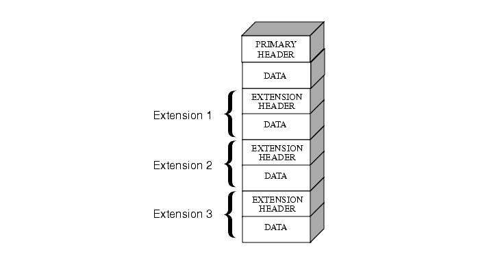

# FITS Primer 

Authors:

Mentor: Rachel Woodbrook

Peer reviewers: Michael Lenard; Henrik Spoon; Jon Wheeler

|   Topic   |   Description   |
| :------------- | :------------- |
| File Extension | .fits, .fit. fts |
| MIME Type | :application/fits and image/fits (<a href="https://www.loc.gov/preservation/digital/formats/fdd/fdd000317.shtml#:~:text=Flexible%20Image%20Transport%20System%20(FITS)%20was%20initially%20developed%20by%20astronomers,International%20Astronomical%20Union%20in%201982.">Library
of Congress, 2023</a>) |
| Structure | “A FITS file consists of one or more Header + Data Units (HDUs), where the first HDU is called the <em>primary HDU</em>, or <em>primary array</em>. The primary array may be empty or contain an N-dimensional array of pixels, such as a 1-D spectrum, a 2-D image, or a 3-D data cube. Data types supported in the primary array in FITS_3 are: unsigned 8-bit bytes, 16, 32, and 64-bit signed integers, and 32 and 64-bit single or double precision floating point reals” (<a href="https://www.loc.gov/preservation/digital/formats/fdd/fdd000317.shtml#:~:text=Flexible%20Image%20Transport%20System%20(FITS)%20was%20initially%20developed%20by%20astronomers,International%20Astronomical%20Union%20in%201982.">Library
of Congress, 2023</a>) |
| Versions | Current Version 4.0 (13 August 2018) <a href="https://fits.gsfc.nasa.gov/fits_standard.html">FITS Standard Document</a> |
| Primary fields or areas of use | Astronomy |
| Source and affiliation | FITS is an open format developed and maintained by the FITS Working Group under the International Astronomical Union (<a href="https://fits.gsfc.nasa.gov/iaufwg/">IAU-FWG</a>) |
| Metadata standards | FITS comes with built-in metadata (<a href="https://fits.gsfc.nasa.gov/fits_conventions.html">NASA, 2021</a>) |
| Key questions for curation review | <li>How was the data generated?</li><li>What objects are represented</li><li>How many HDUs does each file contain?</li><li>What are the data types of the primary HDUs and extensions?</li><li>What HDU keywords have been utilized?</li><li>Who will use this data and how?</li> |
| Tools for curation review | <li> <a href="https://heasarc.gsfc.nasa.gov/docs/software/ftools/fv/">FITS Viewer</a></li> <li><a href="https://heasarc.gsfc.nasa.gov/docs/fcg/standard_dict.html">FITS Standard Keywords</a></li><li> <a href="https://fits.gsfc.nasa.gov/fits_registry.html">Registry of FITS Metadata Conventions</a></li> |
| Date Created | 2024-05-07 |
| Created by | Lubov McKone - Johns Hopkins  Robyn DeRocchis - Burrell College of Osteopathic Medicine  Rebecca Orozco - United States Air Force Academy  Rachel Woodbrook - University of Michigan |
| Date updated and summary of changes made | Version 1: May 24, 2024 |
| :------------- | :------------- |

**Suggested Citation:** McKone, Lubov; DeRocchis, Robyn; Orozco,
Rebecca; Woodbrook, Rachel. 2024. FITS Data Curation Primer. [Data Curation Network GitHub Repository.](https://github.com/DataCurationNetwork/data-primers)

*This work was created as part of the Data Curation Network Training
Cohort held at the University of New Mexico in Albuquerque, NM on
October 23-24, 2023.*

# Table of Contents

[Background](#background)

[Description of format](#description-of-format)

[Examples of discipline- and field-specific uses of FITS](#examples-of-discipline--and-field-specific-uses-of-fits)

[Examples of FITS datasets and citations](#examples-of-fits-datasets-and-citations)

[Key questions to ask yourself](#key-questions-to-ask-yourself)

[Key clarifications to get from researcher](#key-clarifications-to-get-from-researcher)

[Applicable metadata standard, core elements and readme requirements](#applicable-metadata-standard-core-elements-and-readme-requirements)

[Resources for reviewing data](#resources-for-reviewing-data)

[Software for viewing or analyzing data](#software-for-viewing-or-analyzing-data)
 [Software for viewing FITS files](#software-for-viewing-fits-files) [Working with FITS files programmatically](#working-with-fits-files-programmatically) [Viewing FITS images](#viewing-fits-images)

[Preservation actions](#preservation-actions)

[What to look for to make sure this file meets FAIR principles](#what-to-look-for-to-make-sure-this-file-meets-fair-principles)

[Ways in which fields may use this format](#ways-in-which-fields-may-use-this-format)

[Appendix A - filetype CURATED checklist](#appendix-a---filetype-curated-checklist)

# Background

FITS, or **F**lexible **I**mage **T**ransport **S**ystem, is a data
format most widely used in astronomy to transfer scientific data and
their associated metadata. FITS was developed in the late 1970s by
astronomers in the USA and Europe to facilitate international data
transfer between observatories. In astronomy, images of the night sky
are treated as arrays of data to be analyzed. For this reason, FITS was
designed to be a highly flexible format that can be used to store and
transfer any number of n-dimensional arrays. This means that although
its name contains “image,” FITS files often contain only non-image data
such as one-dimensional spectra or tabular information. Most commonly,
FITS files contain a combination of images and 2-dimensional data tables
stored in rows and columns. In fact, FITS files can contain almost
anything. Although the building blocks are simple, FITS files can have
unlimited components, and therefore can become complex quickly.

Note that FITS format images were designed for analysis, storage, and
transport - not for human viewing. A utility application is required to
convert FITS images into human viewable images (See “Viewing FITS
Images” below). ([Flexible Image Transport System (FITS), Version
3.0](https://www.loc.gov/preservation/digital/formats/fdd/fdd000317.shtml))

Now maintained by the International Astronomical Union, FITS is
maintained under the motto “once FITS, always FITS” and is designed to
be completely backwards compatible. Full standard documents for all
versions may be found on NASA's [FITS Standard
Document](https://fits.gsfc.nasa.gov/fits_standard.html) webpage. The
current version is FITS 4.0, released in 2016 and updated in 2018.

# Description of format

- All FITS files consist of one or more **Header/Data Units (HDUs).**

- Each FITS file contains one **Primary HDU** and any number of additional HDUs called **extensions.**

- Each HDU is composed of a **header unit** and a **data unit**.

  - The **header unit** contains metadata about the data represented in the data unit. Header unit fields are called **keywords.** There are over 50 optional keywords that can be specified ([FITS Standard Keywords](https://heasarc.gsfc.nasa.gov/docs/fcg/standard_dict.html)); only the following are required for all HDUs:

    - **XTENSION**: the type of data in the HDU. The main types are ‘IMAGE’, ‘TABLE’ (for ASCII tables), or ‘BINTABLE’ (for binary tables); a full list is available at [Registered Extensions to FITS](https://fits.gsfc.nasa.gov/xtension.html).

    - **SIMPLE**: T or F, indicates whether the file conforms to FITS standards

    - **BITPIX**: the number of bits per data value

    - **NAXIS**: the number of data axes

    - **NAXIS1**: length of axis 1

    - **NASIX2**: length of axis 2

    - **NAXIS\[...\]**: and so on for every data axis

    - The follow keywords are optional but widely used:

      - **HISTORY:** This keyword is commonly used to describe the history of steps and procedures associated with the processing of the associated data.

      - **COMMENT:** Community practice has developed for making extensive use of the repeatable COMMENT keyword to further document the contents of the data file in an ad-hoc way.

      - Additionally, authors may define any number of required project-specific keywords and values that are not encompassed by the FITS standard.

      - NASA maintains a [list of commonly used FITS keywords](https://heasarc.gsfc.nasa.gov/docs/fcg/common_dict.html).

  - The **data unit** contains the data described by the metadata in the header unit.

The table below outlines the type of data that may be contained in a
FITS file HDU:

| **Type of Extension** | **Contains**                                                      | **Header begins with…** |
|-----------------------|-------------------------------------------------------------------|-------------------------|
| Image                 | 0-999 dimensional array of pixels                                 | XTENSION = 'IMAGE'      |
| ASCII Table           | tabular information with all numeric information in ASCII formats | XTENSION = 'TABLE'      |
| Binary Table          | tabular information in binary representation                      | XTENSION = 'BINARY'     |

The diagram below from the [*Hubble Space Telescope Data Handbook for
WFPC2*](https://www.stsci.edu/instruments/wfpc2/Wfpc2_dhb/intro_ch23.html)
provides a visual representation of how a single FITS file can store
data in multiple HDUs:

<figure>  <figcaption>Figure 2.1, Baggett, S., et al. 2002, in HST WFPC2 Data Handbook, v. 4.0, ed. B. Mobasher, Baltimore, STScI</figcaption> </figure>

# Examples of discipline- and field-specific uses of FITS 

Astronomers in the United States and Europe developed FITS as an
interchange of data between observatories and for archiving data. Today
the FITS file format is mainly used in astronomy and astrophysics, but
is gaining use outside of astronomy research communities ([Library of
Congress,
2023](https://www.loc.gov/preservation/digital/formats/fdd/fdd000317.shtml#:~:text=Flexible%20Image%20Transport%20System%20(FITS)%20was%20initially%20developed%20by%20astronomers,International%20Astronomical%20Union%20in%201982.))
in digital archival preservation.

- Astronomy & Astrophysics - spectra, images, data tables, catalogs, radar, machine learning model output, text, etc.

- Archives - images, text, etc.

- Biomedical & Health Care - images, etc.

- Meteorology & Atmospheric Studies - spectra, images, data tables, catalogs, rasters, modeling outputs, text, etc.

- Planetary Science - spectra, images, data tables, catalogs, radar, machine learning model output, text, etc.

# Examples of FITS datasets and citations

The discipline of astronomy has a long history of data sharing and
correspondingly there are many well-established collections of FITS
files. However, FITS collections tend to be decentralized in location
and generally reside at the website of the organization or satellite
which produced the image ([Accessing Digitized Astronomical Images from
Major Satellites or Observatory
Surveys](https://webhome.phy.duke.edu/~kolena/imageaccess.html)). They
also are typically not open for deposit from researchers external to the
original data collection project. In terms of repositories in which to
share FITS files, researchers may be limited to sharing in their
institutional data repositories if FITS files have been derived from
existing data or have not been collected under an existing satellite or
survey.

The table below lists a mix of established FITS collections that are not
open for deposit, and citations for FITS datasets that have been
deposited in institutional repositories.

| **Collection Type**        | **Discipline**             | **Citation**                                                                                                                                                                                                                                                                                                           | **Deposit Options**                                                                                                                 |
|----------------------------|----------------------------|------------------------------------------------------------------------------------------------------------------------------------------------------------------------------------------------------------------------------------------------------------------------------------------------------------------------|-------------------------------------------------------------------------------------------------------------------------------------|
| Government Open Data       | Astronomy and Astrophysics | University Corporation for Atmospheric Research. (2024). *McA Final Map Images and FITS Files*. High Altitude Observatory. <https://www2.hao.ucar.edu/mcintosh-archive/final-map-images-fits-files>                                                                                                                    | No deposit options available                                                                                                        |
| Government Open Data       | Astronomy and Astrophysics | Space Telescope Science Institute. (n.d.). *New Mission Partnership with MAST*. Barabara A. Mikulski Archive for Space Telescopes. <https://archive.stsci.edu/new-mission-partnerships-with-mast>                                                                                                                      | Deposits accepted for STScI MAST partnerships, [Learn more here](https://archive.stsci.edu/new-mission-partnerships-with-mast)      |
| Government Open Data       | Astronomy and Astrophysics | Gaia Collaboration et al. ([2023j](https://gea.esac.esa.int/archive/documentation/GDR3/bib.html#bib982)): Gaia DR3: Summary of the contents and survey properties.                                                                                                                                                     | No deposit options available                                                                                                        |
| Government Open Data       | Astronomy and Astrophysics | Almeida, A., et. al (2023). The Eighteenth Data Release of the Sloan Digital Sky Surveys: Targeting and First Spectra from SDSS-V. *The Astrophysical Journal Supplement Series*, *267*, 44. <https://doi.org/10.3847/1538-4365/acda98>                                                                                | No deposit options available                                                                                                        |
| Institutional Repositories | Astronomy and Astrophysics | ERC-StG project, EMERGE, 2024, "EMERGE Data Release 1 (DR1)", <https://doi.org/10.7910/DVN/RV2I2A>, Harvard Dataverse, V1                                                                                                                                                                                              | Deposits accepted from internal and external researchers, [Learn more here](https://support.dataverse.harvard.edu/)                 |
| Institutional Repositories | Astronomy and Astrophysics | Das, R., Dark Energy Survey (DES). (2019). *Galaxy Shape Catalogs for Dark Energy Survey Science Verification (DES-SV) Data - Additional Regions* \[Data set\], University of Michigan - Deep Blue Data. <https://doi.org/10.7302/Z2F769SJ>                                                  | Deposits restricted to the University of Michigan community, [Learn more here](https://deepblue.lib.umich.edu/data/about?locale=en) |
| Institutional Repositories | Archives                   | Vatican Apostolic Library. (n.d.) *Digital Project.* Vatican Library. <https://www.vaticanlibrary.va/en/in-digitalizzation/the-digital-project.html>; [https://www.vaticanlibrary.va/en/the-collections/space-color-fits.html](https://www.vaticanlibrary.va/en/the-collections/space-color-fits.html?keyF=FITS#found) | No deposit options available                                                                                                        |

# Key questions to ask yourself

- What type of data is in each FITS file? (i.e. image, table, spectra)

- What type of object does each file represent? (i.e. star, galaxy, planet)

- How large is the dataset/how many files does it contain?

- How many extensions does each FITS file have?

- How do those extensions relate to one another?

- Are the files meant to be used all together or can they be used individually?

- Is the data derived from a pre-existing dataset such as Gaia or the Sloan Digital Sky Survey (this can happen when a researcher is running existing FITS image data through a model to produce derived data)? If so, do the files contain any of the original data in addition to the derived data? How can the derived data be linked back to the original dataset (i.e. do they share identifiers)?

- How will users expect to be able to search the files?

- What is the best software for users to view these files?

- Should any of the header unit keywords be pulled out into file-level or dataset-level metadata fields? For example, are there comment or history keywords (fields in the header) that document anything important about the file?

- Is there a metadata standard for the objects that are represented? (i.e. star or galaxy identifiers, WCS coordinates)

- What units of measurement does the author use or indicate in the headers fields, if any?

- If not, does the header for each data unit include sufficient metadata for the data it describes?

# Key clarifications to get from researcher 

- How was the data generated? Are the data observational or derived from an existing dataset?

- Which FITS extensions do the files have? Are they all the same, or does it vary by file?

- How do they recommend others view the data?

- What keywords (metadata fields) are utilized in the header units?

- What custom or specialized keywords does the author use that are not defined by the standard itself or standard keyword dictionaries, if any?

# Applicable metadata standard, core elements and readme requirements 

Find the latest and historical [FITS standard
document](https://fits.gsfc.nasa.gov/fits_standard.html) and standard
[FITS header keyword
dictionaries](https://fits.gsfc.nasa.gov/fits_dictionary.html) on the
NASA.gov website. A ‘T’ value in the SIMPLE keyword indicates that a
FITS file follows the standard.

World coordinate systems, which specify physical coordinates for each
pixel of N-dimensional images, are defined in [four
papers](https://fits.gsfc.nasa.gov/fits_wcs.html) that have been largely
incorporated into the FITS standard. Version 3 of the FITS standard
document included content from Papers I, II, and III, covering world,
celestial, and spectral coordinates respectively. FITS Version 4
incorporated the 4th paper covering time coordinates.

A plain text README file should accompany the dataset and include, at a
minimum:

- Title of the dataset

- Name and contact information for the principal investigator/responsible party

- Abstract for the dataset, including:

  - Original dataset if applicable

  - Date or date range of data collection

  - Version of FITS used

  - Dimensionality and format of FITS Files

  - Recommended software for viewing data files

  - Metadata standard or naming conventions used in files (see [Registry of FITS Metadata Conventions](https://fits.gsfc.nasa.gov/fits_registry.html))

  - Definitions of keywords used in file metadata, particularly if they are not found in the [FITS keyword data dictionaries](https://fits.gsfc.nasa.gov/fits_dictionary.html) or [FITS conventions](https://fits.gsfc.nasa.gov/fits_conventions.html)

- File and data overview

  - For each file or group of similar files, a brief description of the data contained

  - Date file or files created

  - Description of any relationships between files

  - Update dates and description of any updates

# Resources for reviewing data

- [***Flexible Image Transport System 3.0 (FITS) - Library of Congress File Description***](https://www.loc.gov/preservation/digital/formats/fdd/fdd000317.shtml): Library of Congress wiki for the FITS format.

- [***NASA FITS Primer***](https://fits.gsfc.nasa.gov/fits_primer.html): NASA’s primer on FIT format.

- [***NASA FITS Documentation Page***](https://fits.gsfc.nasa.gov/fits_documentation.html): NASA’s page for resources related to FITS, including conference papers related to FITS.

- ***[FITS Keywords](https://heasarc.gsfc.nasa.gov/docs/fcg/standard_dict.html):*** a list of keywords (metadata fields) that may be defined in the FITS header.

- ***[FITS Metadata Conventions](https://fits.gsfc.nasa.gov/fits_registry.html):*** a list of conventions for FITS header structures for different types of data.

# Software for viewing or analyzing data 

## Software for viewing FITS files

- ***[FITS Viewer (FV)](https://heasarc.gsfc.nasa.gov/ftools/fv/):*** a free and easy to use graphical program for viewing and editing any FITS format image or table. The *FV* software is small, completely self-contained and ready to run on Linux, macOS, and Windows PCs. This tool is helpful for curators to get a bird's-eye view of the number, type, and dimensions of HDUs present in a given FITS file. Below is an example of how an image file with one HDU appears in FV. There are options to view the header unit, and to view the data unit as an image or as a table:

<figure>  <figcaption>Sample summary of a FITS file in FITS Viewer.</figcaption> </figure>

If there were additional HDUs in the file, they would appear as
additional rows below the Image HDU.

- [***List of general FITS utility software***](https://fits.gsfc.nasa.gov/fits_utility.html): NASA’s list of software that can be used to view and edit FITS files.

## Working with FITS files programmatically

- [***Python astropy package***](https://docs.astropy.org/en/stable/io/fits/index.html): A python package for viewing and manipulating FITS. Similar to FITS Viewer, the package can show a bird’s-eye view of all HDUs in a FITS file and drill down to single headers and data units as well.

- [***List of FITS I/O Libraries***](https://fits.gsfc.nasa.gov/fits_libraries.html): A list of libraries that read and write FITS files in different programming languages.

## 

## Viewing FITS images

Since FITS files can contain images, there are a number of image viewers
that can be used to view FITS images if you know that the FITS files you
are working with contain only images. NASA keeps a [comprehensive list
of FITS Image Viewers](https://fits.gsfc.nasa.gov/fits_viewer.html)
here.

# Preservation actions

The edict for FITS file format is “*Once FITS always FITS*.” This
principle establishes that “any structure that is a valid FITS structure
shall remain a valid FITS structure at all future times” ([Library of
Congress,
2023](https://www.loc.gov/preservation/digital/formats/fdd/fdd000317.shtml)).

The community practice to understand data quality and provenance is to
utilize the keyword/value form of header records, including a
considerable set of reserved keywords and controlled lists of values,
and the ability to add project-specific keywords and values, through use
of the HISTORY and COMMENT records ([Library of Congress,
2023](https://www.loc.gov/preservation/digital/formats/fdd/fdd000317.shtml)).

For the data stored in the FITS files, follow the conventions and
formatting for the FITS extension type (see table in Description of
Format section). It is important that the data is convertible to
conventional preservation formats that fall in line with institutional
or repository standards for images, tables, and binary tables. It is
also important to consider the intended audience and reuse or revision
of this data. FITS may not be the best format for all intended audiences
or uses.

# What to look for to make sure this file meets FAIR principles

- **Findable.** Ensure that the repository is appropriate for the data set. Verify that metadata are both human and machine-readable. Verify that metadata in both primary and extension HDUs are robust and meet industry standards. DOIs (digital object identifiers), persistent URIs (uniform resource identifiers), or other permanent unique identifiers should be used for the records.

- **Accessible.** Files should be openable using some or all of the open access software noted in the *Software for Viewing or Analyzing Data* section. A specialist repository may be most appropriate, depending on the source or subject of the dataset.

- **Interoperable.** Ensure FITS data standard(s) are followed. Check for ‘T’ in the SIMPLE keyword and the use of standard FITS Header keywords. As FITS is designed to be backward compatible, adhering to the standard of the version of FITS used supports interoperability. Include documentation of how data combines with other FITS files, if applicable.

- **Reusable.** Include adequate documentation and metadata to provide context. For data or models built from other datasets, include permanent unique identifiers for the input datasets. Ensure that documentation notes the FITS version standard followed by the dataset.

# Ways in which fields may use this format 

In addition to being used to store and transmit large amounts of
astronomy data, FITS format is used for analysis and archival storage of
scientific data sets. The Biblioteca Apostolica Vaticana (The Vatican
Apostolic Library) uses FITS files for long-term digital preservation.

# Appendix A - filetype CURATED checklist

## CHECK Step

Check FITS files and read the documentation
- Open the files in a utility application such as FITS Viewer
- Read any supporting documentation such as a README

FITS files open as expected?
- Yes
- No, issues:______________________

Check documentation type (circle) 
readme / Codebook / Data Dictionary / Other: ________________________
- Complete
- Needs work 
- If missing, document for the “Request” step

## UNDERSTAND Step

Understand the FITS files
- Note the primary HDU type and extension types of each file 
- Extract any “hidden documentation” inherent to the FITS files that may facilitate reuse 
- Determine if the documentation of the data is sufficient for a user with similar qualifications to the researcher’s to understand and reuse the data. If not, recommend or create additional documentation (e.g., a readme.txt template)

Primary HDU type:
- Image
- Binary Table
- ASCII Table
- Other:_______________________

HDU Extension type(s), if present:
- Image
- Binary Table
- ASCII Table
- Other:_______________________

- What keywords are defined in the header unit?:_________________________________
- Should any of the header unit keywords be pulled out into the documentation or metadata?
- Is it clear what type of object each FITS file represents?
- Is it clear what software can be used to view the files?
- If the data has been derived from an existing dataset, is it clear how to link each file back to this dataset?

## REQUEST Step

Request missing information or changes
- Generate a list of questions to help the researcher fix any errors or issues and enrich the usability of the data.

- Based on the unanswered questions from the Understand step, request additional documentation or improvements to the data from the researcher

## AUGMENT Step

Augment the dataset
- Ensure metadata conforms to repository and/or appropriate discipline standards; adjust metadata to improve findability and accessibility; and improve documentation to make data more understandable, interoperable and reusable. 

Discoverability
- Sufficient
- No, recommend (circle all that apply) add links to source dataset / add identifiers to file names or descriptions / add link to metadata standard

Understandability
- Sufficient
- No, recommend pulling FITS keywords into metadata: _____________________________

Reusability
- Sufficient
- No, recommend adding instructions to the README: _______________________________

## TRANSFORM Step

Transform file formats
- Based on who will access the data and how, assess whether FITS is the best file format for storage or whether transformation is needed

File format
- FITS is appropriate
- Recommend conversion to (circle one) TIFF / CSV / TXT / Other:_______________________

## EVALUATE Step

Evaluate and rate the overall record for FAIRness

See [“What to look for to make sure this file meets FAIR principles”](#what-to-look-for-to-make-sure-this-file-meets-fair-principles)

## DOCUMENT Step

Document throughout curation activities

- Inventory of files, their primary and extension HDUs, and keywords used in the header
- How you opened the files and how you knew to open them that way
- What augmentations were made to the files to increase discoverability, understandability, and reusability
- Whether any file formats were transformed, and why
- Evaluation of FAIR principles

**Bibliography**

Baggett, S., et al. 2002, in HST WFPC2 Data Handbook, v. 4.0, ed. B. Mobasher, Baltimore, STScI

*Flexible Image Transport System (FITS), Version 3.0*. (2023, November 28). \[Web page\]. <https://www.loc.gov/preservation/digital/formats/fdd/fdd000317.shtml>

Kolena, J. (n.d.). *Accessing Digitized Astronomical Images in Different Wavelength Regions*. Retrieved May 24, 2024, from <https://webhome.phy.duke.edu/~kolena/imageaccess.html>

Library of Congress. (2023, December 07). *Sustainability of Digital Formats: Planning for Library of Congress Collections.* Digital Preservation Home. <https://www.loc.gov/preservation/digital/formats/fdd/fdd000317.shtml>

Pence, W. D., Chiappetti, L., Page, C. G., Shaw, R. A., & Stobie, E. (2010). Definition of the Flexible Image Transport System ( *FITS* ), version 3.0. *Astronomy & Astrophysics*, *524*, A42. <https://doi.org/10.1051/0004-6361/201015362>
