# GeoJSON Primer

# Format Overview

|   Topic   |   Description   |
| :------------- | :------------- |
| FIle Extension | .geojson |
| MIME Type | Application, Vendor Tree - [application/geo+json](https://www.iana.org/assignments/media-types/application/geo+json) |
| Structure | Javascript Object Notation |
| Standard | [RFC 7946](https://web.archive.org/web/20191024124836/https://tools.ietf.org/html/rfc7946) |
| Primary fields or areas of use | Geographical Information Systems (GIS), web mapping applications, mobile applications, web APIs, JavaScript web-mapping libraries, JSON-based document databases |
| Source and affiliation | Internet Engineering Task Force (IETF) |
| Metadata standards | None specific to GeoJSON |
| Key questions for curation review | <ul><li> Are coordinates listed in the following format:[longitude, latitude, elevation]?</li><li> Can the file be opened in a text editor and viewed in QGIS?</li><li> Does the file pass validation?</li><li>Are there associated metadata/README.md files? |
| Tools for curation review | [QGIS](https://www.qgis.org/en/site/); [geojsonlint.com](geojsonlint.com); [geojson.io](http://geojson.io/#map=2/20.0/0.0); [ArcCatalog](https://en.wikipedia.org/wiki/ArcGIS) |
| Date Created | July 2019 |
| Created by | Nadia Dixson (City Archivist for the City of Somerville), Genevieve Milliken (NYU, Digital Library Technology Services), Keshav Mukunda (SFU Library, Data Services), Reina Murray (Johns Hopkins University, Sheridan Libraries), Rachel Starry (University at Buffalo, University Libraries). |
| Date updated and summary of changes made | |

**Suggested Citation:** Dixson, Nadia; Milliken, Genevieve; Mukunda, Keshav; Murray, Reina; Starry, Rachel. (2019). GeoJSON Data Curation Primer. [Data Curation Network GitHub Repository.](https://github.com/DataCurationNetwork/data-primers)

This work was created as part of the “Specialized Data Curation” Workshop #2 held at Johns Hopkins University in Baltimore, MD on April 17-18, 2019. These workshops have been generously funded by the Institute of Museum and Library Services # RE-85-18-0040-18.

# Table of Contents

<!-- TOC depthFrom:1 depthTo:6 withLinks:1 updateOnSave:undetermined orderedList:0 -->

- [Description of Format: What is GeoJSON?](#description-of-format)
  - [Syntax for GeoJSON](#syntax-for-geojson)
  - [Existing GeoJSON Documentation](#existing-geojson-documentation)
  - [Example GeoJSON Datasets](#example-geojson-datasets)

- [Software for Opening and Viewing GeoJSON Files](#software-for-opening-and-viewing-geojson-files)
    - [Validating GeoJSON Datasets](#validating-geojson-datasets)

- [GeoJSON Metadata Standards and README Requirements](#geojson-metadata-standards-and-readme-requirements)
  - [GeoJSON Metadata Standards](#geojson-metadata-standards)
  - [Viewing Metadata in QGIS](#viewing-metadata-in-qgis)
  - [What to Include in a README File](#what-to-include-in-a-readme-file)

- [Preservation Strategy and Recommendations for Transformations](#preservation-strategy-and-recommendations-for-transformations)
  - [Shapefile](#shapefile)
  - [GeoPackage](#geopackage)
  - [Conversion Tools](#conversion-tools)
  - [Additional options for converting GeoJSON](#additional-options-for-converting-geojson)
  - [Checking Transformations](#checking-transformations)
  - [Creating Metadata using ArcCatalog](#creating-metadata-using-arccatalog)
  - [Creating Metadata using mdEditor](#creating-metadata-using-mdeditor)

- [Evaluating GeoJSON Files for FAIRness](#evaluating-geojson-files-for-fairness)
  - [What are the FAIR principles?](#what-are-the-fair-principles)
  - [FAIR GeoJSON: Components Evaluated](#fair-geojson-components-evaluated)
  - [Assessing GeoJSON Data for FAIRness](#assessing-geojson-data-for-fairness)
  - [Findable](#findable)
  - [Accessible](#accessible)
  - [Interoperable](#interoperable)
  - [Reusable](#reusable)

- [Appendix A: Example CURATED Checklist for GeoJSON](#appendix-a-example-curated-checklist-for-geojson)
  - [CURATED Checklist for GeoJSON](#curated-checklist-for-geojson)
    - [C - check files and read documentation](#c---check-files-and-read-documentation)
    - [U - understand (or try to) the data](#u---understand-or-try-to-the-data)
    - [R - request missing information](#r---request-missing-information)
    - [A - augment metadata and T - transform file formats for reuse](#a---augment-metadata-and-t---transform-file-formats-for-reuse)
    - [E - evaluate for fairness](#e---evaluate-for-fairness)
    - [D - document all curation activities](#d---document-all-curation-activities)

- [Appendix B: Researcher Survey Results](#appendix-b-researcher-survey-results)
  - [Survey Questions](#survey-questions)
  - [Survey Results](#survey-results)
  - [Bibliography](#bibliography)

<!-- /TOC -->

# Description of Format

GeoJSON is a geospatial data interchange format for encoding vector geographical data structures, such as point, line, and polygon geometries, as well as their non-spatial attributes. As the name implies, it is based on JavaScript Object Notation (JSON) and continues JSON’s lightweight, plaintext, and machine-readable format, making it a versatile file type especially for web-based mapping and applications. The GeoJSON format defines several types of JSON objects to represent the structure and layout of geographic features, their properties, and their area. GeoJSON supports a single geographic coordinate reference system, the World Geodetic System 1984 (WGS84), in units of decimal degrees typically up to 7 decimal places of precision.

In GeoJSON, there are seven case-sensitive “geometry types” as defined in the OpenGIS Simple Features Implementation Specification for SQL: “Point”, “MultiPoint”, “LineString”, “MultiLineString”, “Polygon”, “MultiPolygon”, and “GeometryCollection”. These simple geometries consist of a “type” and a collection of coordinates listed as ​longitude, latitude, elevation, with elevation being optional. The seven geometry types above, together with the case-sensitive types “Feature” and “FeatureCollection”, constitute the nine “GeoJSON types”. The “Feature” and FeatureCollection” types are geometries together with their descriptive properties.

There are several advantages to GeoJSON that make it a good option for encoding geographical data. GeoJSON is text-based, editable in a text editor, uses common english words, utilizes a very simple data structure, and is easy for both humans and machines to read. Moreover, GeoJSON is a single file, unlike compressed geospatial data formats. As a result of its simplicity and versatility, it is an ideal format both for consuming and producing geospatial data. Some alternatives to GeoJSON that may be encountered include Shapefile, KML/KMZ, GML, and CSV.

Curators may also encounter the EsriJSON file format. This is a proprietary, ESRI standard for encoding spatial data in JSON structured text. It is set as the default conversion option when a spatial dataset is transformed from another vector format to JSON using the software ArcMap and ArcGIS Pro. While the format and syntax are largely similar to GeoJSON, there are some key differences, particularly in the “type” member. An explanation of how to identify an EsriJSON file is provided in the section “Recommendations for File Transformation.” If an EsriJSON file is submitted for curation, consider asking the submitter for the dataset in a different format.

## Syntax for GeoJSON

Every GeoJSON object contains a member named “type”, which must be one of the nine GeoJSON types previously mentioned. Almost all of the geometry objects also contain a member named "coordinates" listed in order as longitude, latitude, and (an optional) elevation. Elevation is expressed as the height in meters above or below the WGS84 reference ellipsoid used to approximate the earth. Here are the seven simple geometry objects that can be specified in GeoJSON:

- **Point:** For type "Point", the coordinates member is a single position. For example, a position with longitude -122.918958, latitude 49.279778, and elevation 340 in WGS84 is specified as:

<figure> 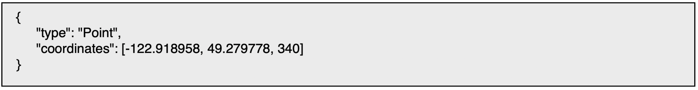 <figcaption></figcaption> </figure>

- **LineString:** For type "LineString", the coordinates member is an array of two or more positions. This geometry consists of connected line segments:

<figure> 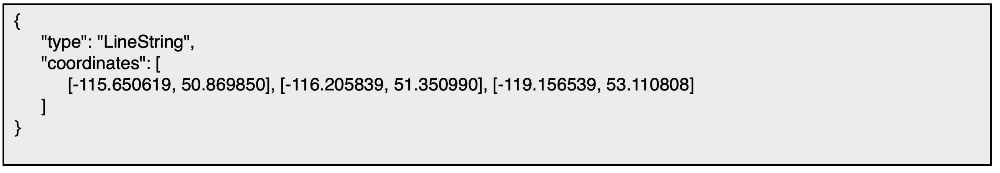 <figcaption></figcaption> </figure>

- **Polygon:** For type "Polygon", the coordinates member must be an array of one or more linear ring coordinate arrays, where each array has at least four points and the first and last points must be the same. These linear rings define boundaries of the Polygon. For Polygons with more than one of these linear rings, the first must be the exterior ring, and any others must be interior rings. The exterior ring is the boundary of the polygon, and the interior rings (if present) are the boundaries of holes within the polygon. Here is an example of a four-sided polygon with one triangular hole inside it:

<figure> 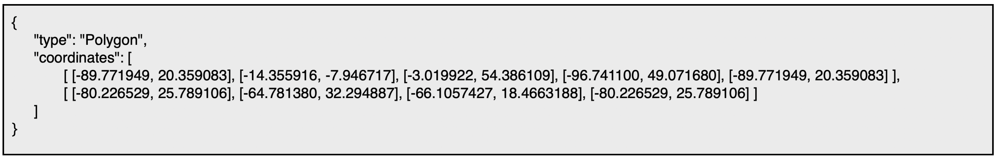 <figcaption></figcaption> </figure>

- **MultiPoint:** For type "MultiPoint", the coordinates member is an array of positions. This geometry specifies a collection of points.

- **MultiLineString:** For type "MultiLineString", the coordinates member is an array of LineString coordinate arrays. This geometry specifies a collection of LineStrings.

- **MultiPolygon:** For type "MultiPolygon", the coordinates member is an array of Polygon coordinate arrays. This geometry specifies a collection of Polygons.

- **GeometryCollection:** A GeoJSON object with type "GeometryCollection" is a heterogeneous collection of point, line, and polygon geometries grouped together. A GeometryCollection has a member with the name "geometries". The value of "geometries" is an array. Each element of this array is a GeoJSON Geometry object with its own coordinates. Here is an example of a GeometryCollection that contains a MultiPoint and a Polygon:

<figure> 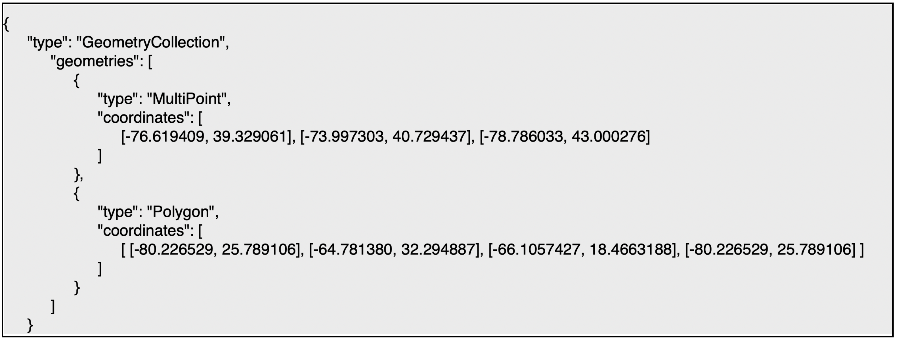 <figcaption></figcaption> </figure>

The last two types specified in GeoJSON describe ​Features​, which are a combination of simple geometry and their descriptive properties.

- **Feature:** An object with type "Feature" has a member with the name "geometry". This “geometry” member must be exactly one of the seven geometry objects defined above, or a null value. A Feature object also contains a member named “properties”, whose value can be any JSON object (for example, “name”, “marker-size”, “marker-color”, etc.)

- **FeatureCollection:** Feature Collection​: An object with type "FeatureCollection" has a member with the name "features". This “features” member is a JSON array of Feature objects, which were just described above.

## Existing GeoJSON Documentation

[RFC 7946](https://web.archive.org/web/20191024124836/https://tools.ietf.org/html/rfc7946) is the official documentation for GeoJSON and is maintained by the Internet Engineering Task Force (IETF). The current documentation, which was put forward by the [GeoJSON Working Group](https://web.archive.org/web/20191203073722/https://datatracker.ietf.org/wg/geojson/about/) in 2016 and replaced the original documentation 2008 (GJ2008), has undergone public review, is the consensus of the IETF community, and was approved for publication by the Internet Engineering Steering Group (IESG). The documentation provides specifications for GeoJSON, including syntax for GeoJSON objects.

## Example GeoJSON Datasets

The GeoJSON format is often a download option in geospatial data repositories, administrative open data portals, and when using certain APIs. While not an exhaustive list, examples of GeoJSON Datasets that are openly available include:

- [Australia Open Data](https://data.gov.au/search?format=GEOJSON&q=)

- [Data.gov catalog](https://catalog.data.gov/dataset?res_format=GeoJSON) (United States)

- [Government of Canada](https://search.open.canada.ca/en/od/?sort=last_modified_tdt%20desc&page=1&search_text=&od-search-portal=Open%20Data&od-search-format=GEOJSON)

- [NYC OpenData](https://opendata.cityofnewyork.us)

- [OpenPhilly](https://opendataphilly.org)

- [Plenar.io](https://plenar.io)

# Software for Opening and Viewing GeoJSON Files

*Key questions to ask:*

- Can the file first be opened and viewed in a text editor before loading in geospatial software?

- Are coordinates listed in the following format: ​[longitude, latitude, elevation]?

- What aspects of the visualization are important? (geometry, color scale, distribution of data, etc.)

- Is the file rendering properly as an individual layer and with a base map?

While there are many web-based and desktop software options for viewing GeoJSON, the free and open-source software [QGIS](https://qgis.org/en/site/) is recommended. QGIS supports MacOS, Windows, and Linux, allows for numerous vector, raster, and database formats, and has a robust user community. Below is a walkthrough for loading and viewing GeoJSON in QGIS 3.8. Supplemental instructions on opening data in QGIS can be found in the [QGIS User Guide](https://web.archive.org/web/20191024130221/https://docs.qgis.org/testing/en/docs/user_manual/managing_data_source/opening_data.html?highlight=geojson). This walkthrough uses the [Habitat Blocks and Wildlife Corridors](https://web.archive.org/web/20191030124350/https://catalog.data.gov/dataset/habitat-blocks-and-wildlife-corridors) in Vermont dataset.

<figure> 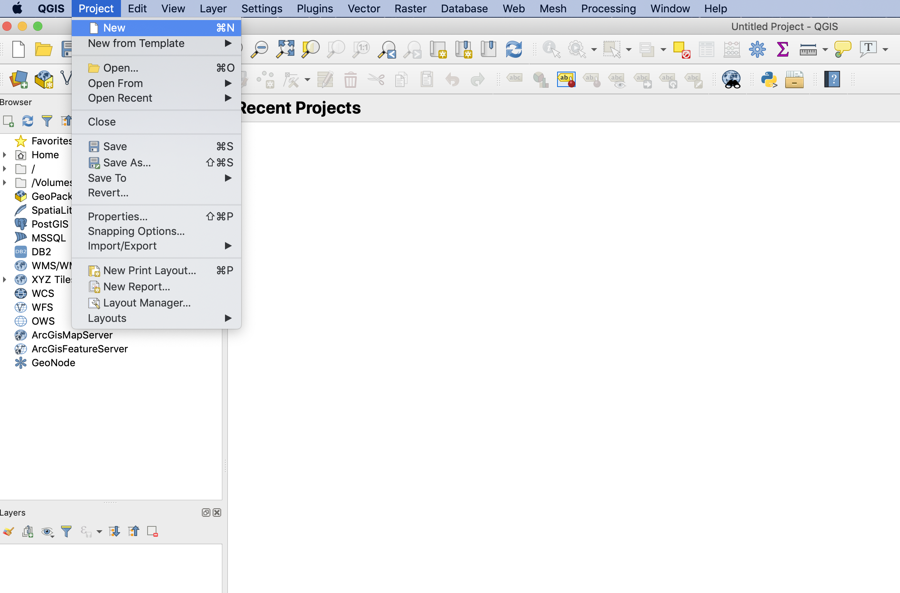 <figcaption>Fig. 1 Begin by going to “Project” in the QGIS toolbar and selecting “New” from the dropdown menu. </figcaption> </figure>

----------------
<figure> 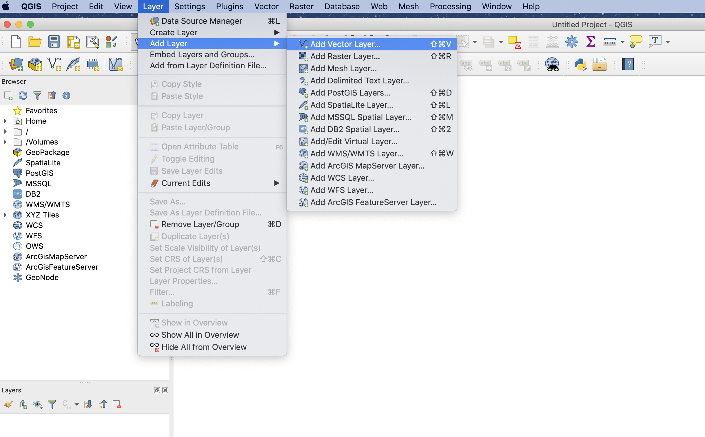 <figcaption>Fig. 2 After creating a new project, add the GeoJSON as a new layer. This can be done by going to “Layer” in the QGIS toolbar and selecting “Add Vector Layer...”</figcaption> </figure>

----------------
<figure> 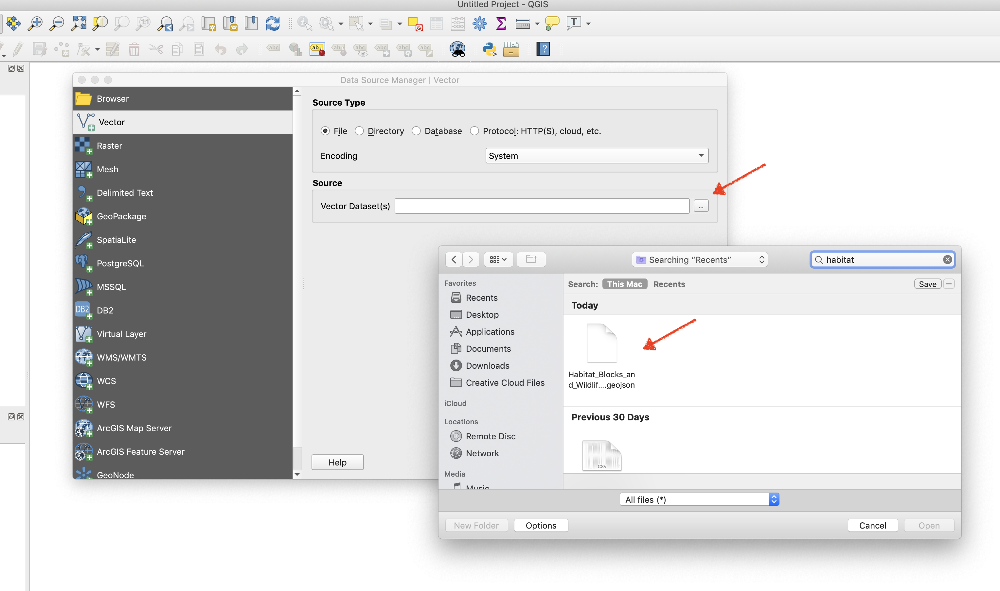 <figcaption>Fig. 3 Select the ellipsis [...] box and then select the GeoJSON you would like to view.</figcaption> </figure>

----------------
<figure> 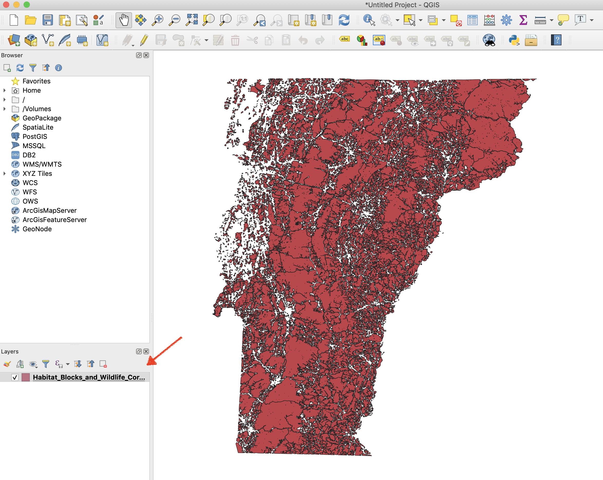 <figcaption>Fig. 4 The GeoJSON has been loaded as a layer and is now shown in the “Layers” sidebar located on the bottom left.</figcaption> </figure>

----------------
<figure> 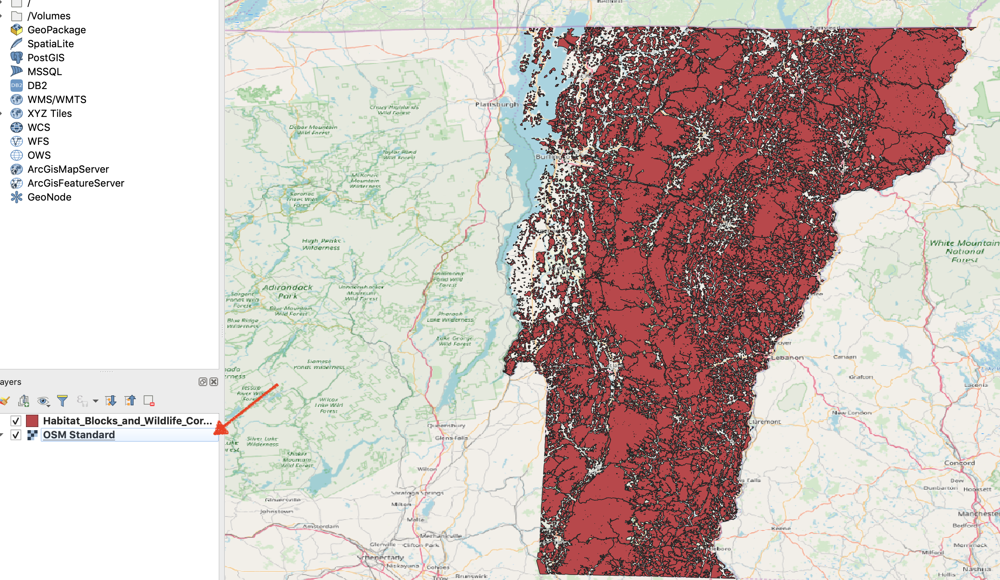 <figcaption>Fig. 5 A basemap can be added so that the layer is given context. To add a basemap in QGIS, go to “Plugins”, then “Manage and Install Plugins.” In the search box enter “QuickMapServices”. After adding this plugin, a global icon with a plus sign will be available on the toolbar. Use this to add one of the several basemaps available from QMS. [Alternatively, you can add the plugin “OpenLayers”. After adding this plugin, an OpenStreetMap basemap will be a nested option under XYZ Tiles located in the “Browser” sidebar to the left.]</figcaption> </figure>

----------------
While QGIS is the preferred software for viewing geospatial data, other software and platforms exist. Some options include, but are not limited to, the following. Please note that some options may be subscription-based:

- [geojson.io](http://geojson.io/#map=2/20.0/0.0) (free, browser-based; useful for validating small .geojson files)

- [ArcGIS Pro](https://www.esri.com/en-us/arcgis/products/arcgis-pro/overview) (proprietary, desktop software; best alternative to QGIS if available)

- [OpenStreetMap](https://www.openstreetmap.org/#map=4/38.01/-95.84) (free, open-source, browser-based)

## Validating GeoJSON Datasets

*Key questions to ask:*

- Is this dataset a valid GeoJSON file?

- Can you map it using an online validation service or desktop GIS software?

- If you come across errors when validating the GeoJSON, are these recoverable errors?

Validating GeoJSON can be conducted on a few web-based validation services. One of the recommended web-based services is [GeoJSONLint](http://geojsonlint.com). Linting is the process of running a program that analyses code for potential syntax errors. To validate using GeoJSOLint, GeoJSON files can be copied and pasted or dropped into the provided text box. Examples of the nine GeoJSON types are also available via the dropdown headers in GeoJSONLint, all which can be used as additional reference examples. Please note that GeoJSONLint closely follows the most recent syntax and returns error codes identifying where problems occur. These errors may be minor and files could operate normally even with these errors. Viewing the file in [QGIS](https://qgis.org/en/site/) and/or [geojson.io](http://geojson.io/#map=2/20.0/0.0) in addition to linting is advisable and recommended.

<figure> 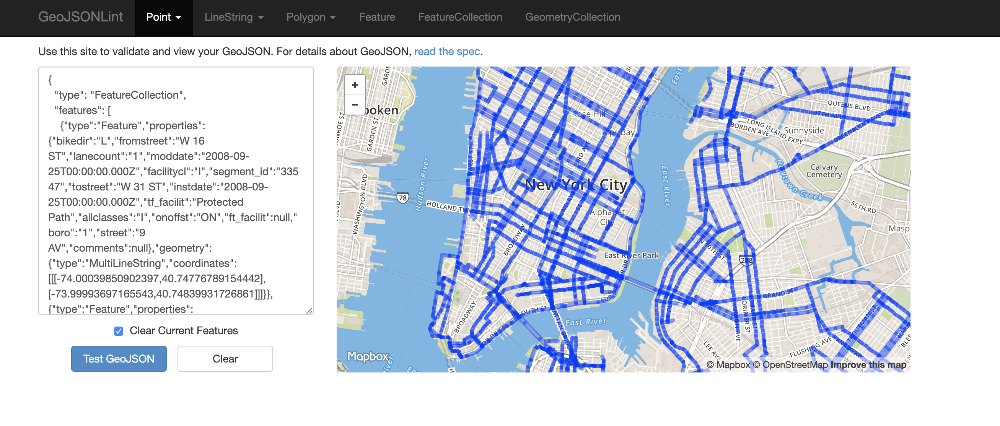 <figcaption>Fig. 6 Web Interface for validating GeoJSON of New York City Bike Lanes with GeoJSONLint</figcaption> </figure>

------------------------------
# GeoJSON Metadata Standards and README Requirements

*Key questions to ask:*

- Is there a separate metadata file? If yes, is it complete? If not, is there metadata stored in the GeoJSON file?

- Is the GeoJSON filename adequately descriptive?

- Are the recommended minimum requirements for README files met?

## GeoJSON Metadata Standards

Currently, there is no metadata standard for GeoJSON.1 As there is no particular standard, it is recommended that the curator select a metadata standard that best fits the repository’s needs and/or policies. Metadata should be stored in a separate XML metadata file, rather than in the GeoJSON file itself. Finally, a README file should be prepared for each GeoJSON file. Descriptions of the most common geospatial metadata standards are available in the [Geodatabase Data Curation Primer](https://github.com/DataCurationNetwork/data-primers/blob/master/Geodatabase%20Data%20Curation%20Primer/Geodata-Primer.md#geospatial-metadata-standards).

If a separate XML metadata file exists, it can be viewed using a text editor. If a separate metadata file does not exist and it is unclear what, if any, metadata is in the GeoJSON file itself, QGIS can be used to view a GeoJSON’s metadata.

1 Gillies, S. (2016, August 17). Re: [Geojson] metadata in GeoJSONgeojson. Retrieved from https://mailarchive.ietf.org/arch/browse/geojson/?q=metadata 

### Viewing Metadata in QGIS

After a GeoJSON layer is added to a project in QGIS, metadata can be viewed using the properties menu.

<figure> 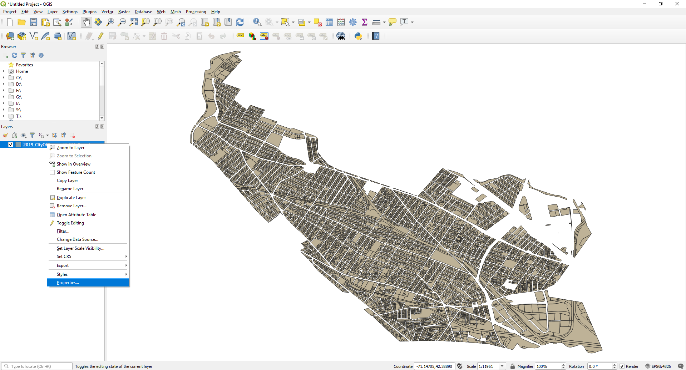 <figcaption>Fig. 7 In QGIS, right-click on the layer and select “Properties”.</figcaption> </figure>

--------------------------
<figure> 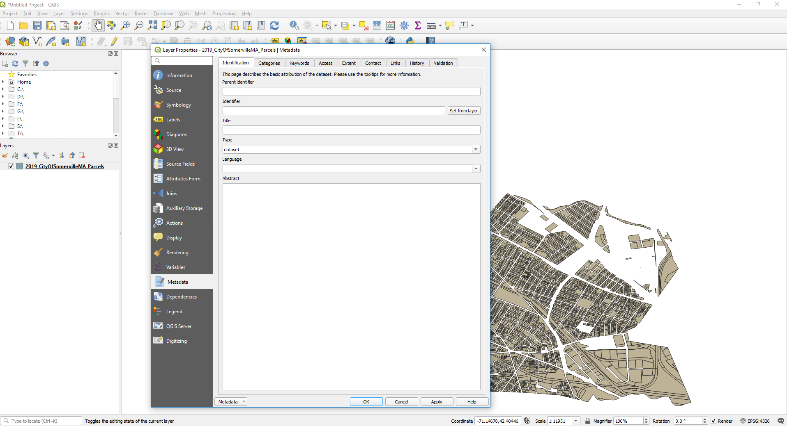 <figcaption>Fig. 8 The properties menu includes a metadata tab, in addition to tabs providing general information, Coordinate Reference System (CRS) and source fields.</figcaption> </figure>

--------------------------
In QGIS, the completeness of the metadata can be assessed by examining the information in the metadata tab. However, it is important to note that QGIS currently does not offer ways to view metadata using geospatial metadata standards such as ISO 191xx. Additionally, edits made to the metadata will not be preserved when converting the file to another format. The section *Preservation Strategy and Recommendations for Transformations* below gives details on metadata creation and augmentation.

### What to Include in a README File

A README file provides information about a data file and ensures that data can be correctly interpreted by others. They are normally written as text files or as markdown. Below is a list of the recommended minimum content need to describe a data file. For more information about README files, please see the Cornell “[Guide to writing "readme" style metadata](http://web.archive.org/web/20191029170357/https://data.research.cornell.edu/content/readme).”

General Information:

- Title of GeoJSON file

- Name/institution/address/email information of author or PI

- Date of data collection (can be a single date, or a range)

- Information about geographic location of data collection

Data and File Overview:

- A short description of what data it contains

- Date that the file was created

- What other datasets or data sources (if any) were combined to create this GeoJSON file? How are they
referenced?

Sharing and Access Information:

- Licenses or restrictions placed on the data

Methodological Information:

- Description of methods used for data processing (describe how the data were generated from the raw or collected data)

- Any software or instrument-specific information needed to understand or interpret the data, including software and hardware version numbers.

- If data pertains to human subjects or endangered species or is otherwise sensitive, have data been sufficiently anonymized?

# Preservation Strategy and Recommendations for Transformations

While GeoJSON is a relatively young file type, it is widely used and has become one of the most common formats for spatial vector data, particularly for web-based projects. It is an approved international standard and is well documented. Finally, because GeoJSON is written in plaintext, it is well suited for preservation.

However, GeoJSON is just one of several commonly used geospatial file types. In a survey released in July 2019 for this primer, 100% of respondents stated that they regularly create or use shapefile data. While GeoJSON is an excellent format for preservation, only 11.1% responded that they always reuse data in GeoJSON format. The majority do not—55.6% responding sometimes, 27.8% responding rarely, and 5.5% responding never. It is therefore recommended to convert GeoJSON files into other file formats to ensure broad data access.

Because some of these other file formats run the risk of becoming obsolete over time or are proprietary, it is recommended to keep both the original GeoJSON file and the conversion files such as shapefile and GeoPackage (descriptions below), and document all of this in an accompanying README file.

### Shapefile

Shapefiles are a proprietary geospatial format created by Esri. While proprietary, it is one of the most widely used file formats for vector spatial data. It is well established and considered a de facto standard in many cases. It can be read by popular GIS desktop software, such as Esri’s ArcGIS Pro and ArcMap, as well as the open source GIS desktop software QGIS. However, its file size is restricted to 2 GB, it is proprietary, and it is a multi-file format that is difficult to read and share without using the proper software and precautions. Shapefiles also have a limited number of columns they can hold. It is recommended that a shapefile version be saved along with the original GeoJSON file.

### GeoPackage

The [GeoPackage](https://web.archive.org/web/20191024131431/http://www.geopackage.org/) is a relatively young file format that is becoming increasingly popular and adopted, particularly among the open source community. Its encoding standard was adopted by the OGC in 2014. It is an open, non-proprietary, platform-independent, and standards-based data format for geographic information systems implemented as a SQLite database container. It is now the default vector spatial file format in QGIS, replacing the shapefile as of QGIS version 3. Because it is platform-independent, it is broadly implemented and can be used in GIS desktop software such as ArcGIS and QGIS, but also with programming languages such as R and Python. It is also lightweight and fast. It is recommended that a GeoPackage version be saved along with the original GeoJSON file.

### Conversion Tools

While there are a number of conversion tools available to transform a GeoJSON file to another format, it is recommended to use QGIS because of its ability to convert to both data formats listed above. A walkthrough for converting GeoJSON to a shapefile in QGIS is provided below. Note: an additional explanation of saving a layer as a shapefile is provided in the [Geodatabase Data Curation Primer](https://github.com/DataCurationNetwork/data-primers/blob/master/Geodatabase%20Data%20Curation%20Primer/Geodata-Primer.md#geospatial-metadata-standards).

----------------------------
<figure>  <figcaption>Fig. 9 Right-click on layer and select “Export” and “Save Features As...”.</figcaption> </figure>

-----------------------------
<figure> 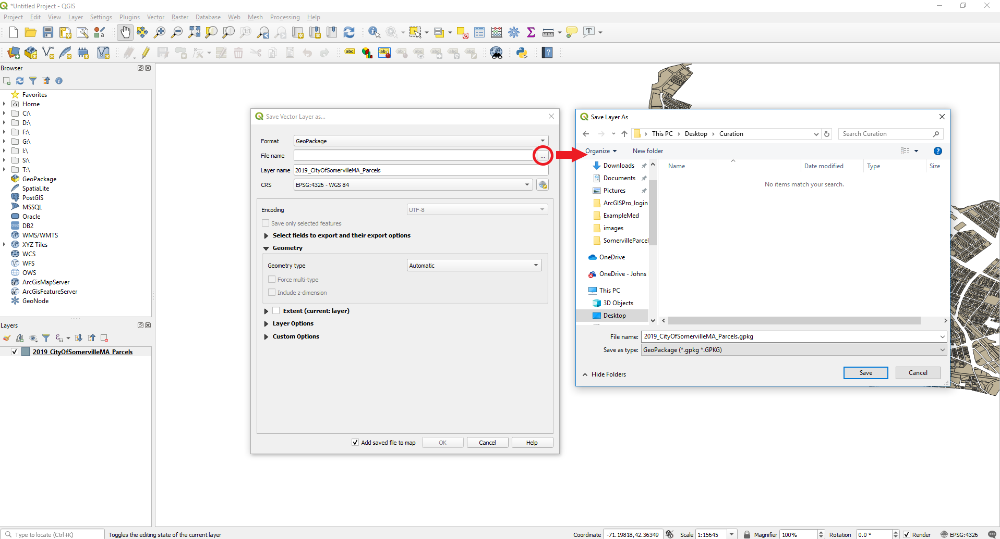 <figcaption>Fig. 10 Change format to “Esri Shapefile” or “GeoPackage”. Click on “...” and navigate to a folder to save the file. Enter a file name in the new window prompt. Click OK.</figcaption> </figure>

------------------------------
<figure> 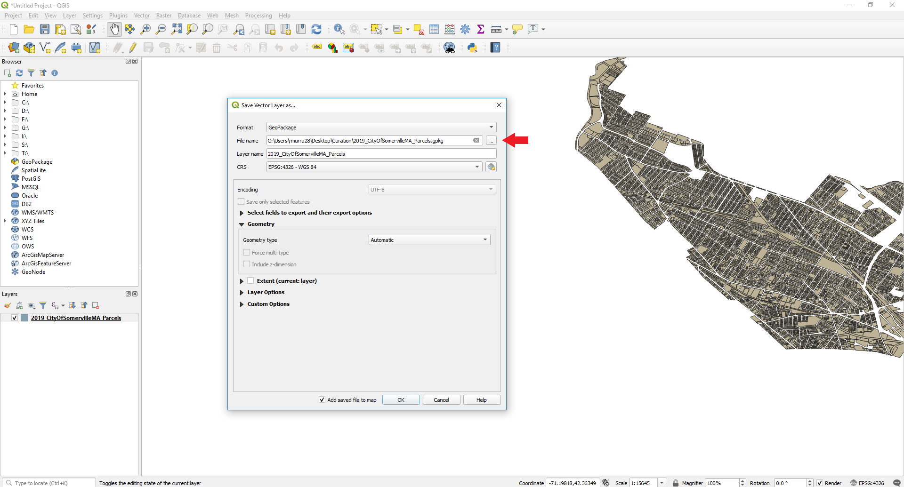 <figcaption>Fig. 11 Notice that the file name includes the full path. The full path is required to avoid generating an error. Leave encoding as UTF-8. Leave CRS as EPSG:4326 - WGS84. Do not resize the data. Click OK to finish conversion. </figcaption> </figure>

------------------------------
While QGIS is recommended for transforming file formats, other software and platform options exist:

- ArcGIS Pro and ArcGIS Desktop: [JSON to Features conversion tool](http://web.archive.org/web/20191029170611/https://pro.arcgis.com/en/pro-app/tool-reference/conversion/json-to-features.htm)
ArcGIS Pro and ArcGIS Desktop (also known as ArcMap) are part of Esri’s suite of geospatial desktop software. Both offer a geoprocessing tool, JSON to Features, which can convert JSON and GeoJSON files to feature layers.

- Note on Esri’s [Features to JSON conversion tool](http://web.archive.org/web/20191029170647/https://pro.arcgis.com/en/pro-app/tool-reference/conversion/features-to-json.htm): Esri also provides a geoprocessing tool, Features to JSON, which converts spatial data to JSON or GeoJSON format. It is important to note that Esri’s proprietary version of a GeoJSON, known as EsriJSON, is created if the “Output to GeoJSON” parameter is not checked.

- While similar to a GeoJSON file, an EsriJSON has its own categories for certain syntax, such as “esriGeometryType” for geometryType and “esriFieldTypeOID” for type. The full list of field types can be found on Esri’s documentation for [ArcGIS REST API services](https://web.archive.org/web/20191029170736/https://developers.arcgis.com/rest/services-reference/layer-feature-service-.htm).

- EsriJSON supports any coordinate reference system and preserves other Esri-proprietary file format structures, like the GlobalID in geodatabases. The file name also ends with ‘.json’, as opposed to ‘.geojson’.

------------------------------
<figure> 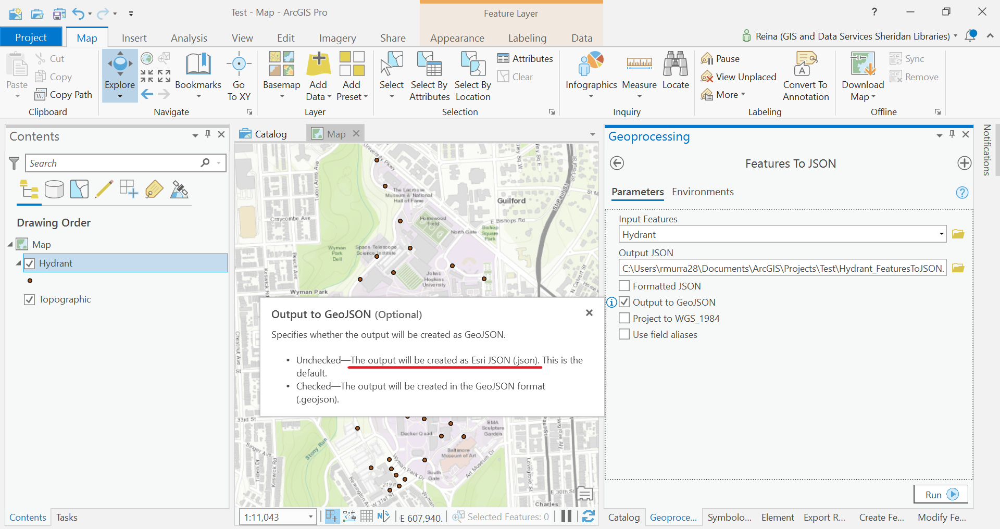Fig. 12 Leaving “Output to GeoJSON” unchecked in ArcGIS Pro will result in the creation of an EsriJSON file. <figcaption></figcaption> </figure>

------------------------------
<figure> 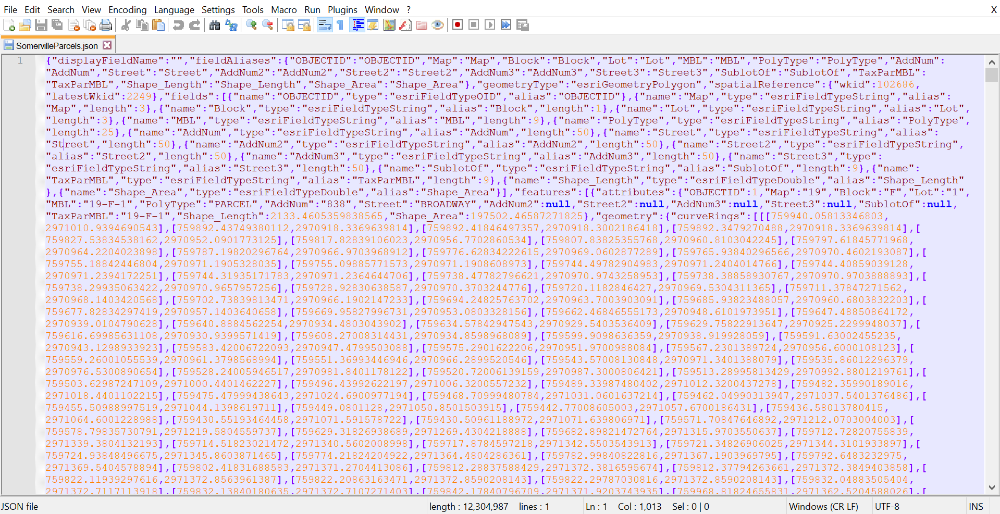 <figcaption>Fig. 13 Example of EsriJSON syntax.</figcaption> </figure>

------------------------------
When validating a file, online validation platforms like GeoJSONlint will throw an error if an EsriJSON file is pasted in. The file should also be examined in QGIS. To see if a file is an EsriJSON file as opposed to a GeoJSON file, check the layer properties in QGIS; the CRS could be something other than EPSG:4326 - WGS84, and the storage type will be “EsriJSON”.

------------------------------
<figure> 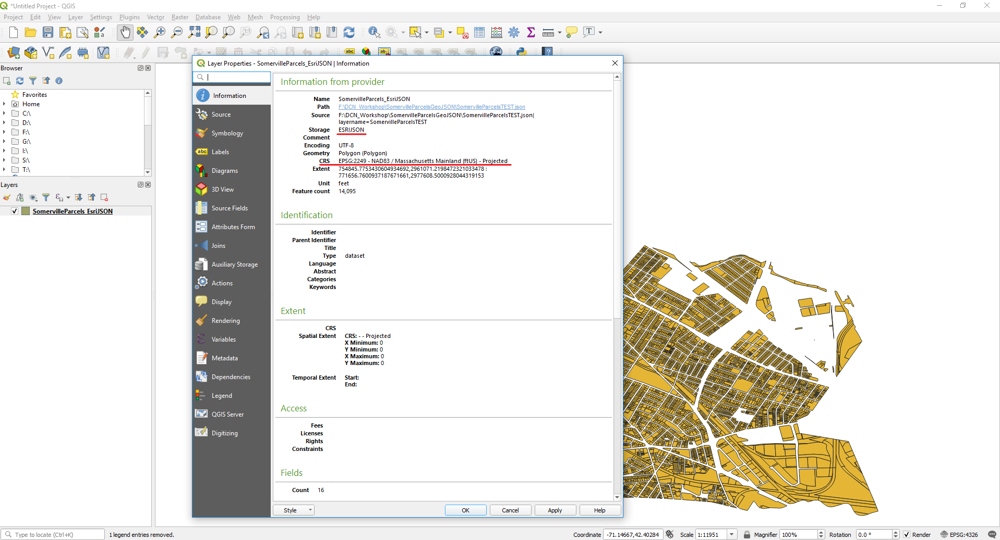 <figcaption>Fig. 14 In Layer Properties, the storage type is set to “ESRIJSON”, and for this particular file, the CRS is EPSG:2249, a CRS not supported by GeoJSON.</figcaption> </figure>

------------------------------
While similar to GeoJSON, EsriJSON is a proprietary format developed and managed by Esri. If an EsriJSON file is submitted for curation, the data owner should be contacted and asked to provide the original dataset in another file format if possible.

------------------------------
### Additional options for converting GeoJSON

- [Mapshaper](https://web.archive.org/web/20191029171147/https://mapshaper.org/) is a free software for editing shapefile, GeoJSON, TopoJSON, CSV and other data formats. It can be used to convert easily from one file format to another, and can be operated from the command line, but also through a web user interface. Instructions on converting a GeoJSON file to shapefile is [documented by StatSilk](https://web.archive.org/web/20191024131646/https://www.statsilk.com/maps/convert-geojson-esri-shapefile-map-format).

- The [ogr2ogr](https://web.archive.org/web/20191024131558/https://gdal.org/programs/ogr2ogr.html) package is part of the Geospatial Data Abstraction Library and provides a way to convert data between common geospatial file formats, including GeoJSON, shapefiles, and GeoPackages. It can be downloaded as part of the [FW Tools Toolkit](https://web.archive.org/web/20190711172245/http://fwtools.maptools.org/), and is usually run from the command line with the following syntax: ogr2ogr -f "file_format" destination_data source_data

## Checking Transformations

After converting a GeoJSON dataset to both shapefile and GeoPackage format, confirm that both transformations were completed successfully using QGIS. These new data formats can be opened following the steps outlined in the earlier section ​Software for Opening and Viewing GeoJSON Files​. Verify that the newly created shapefile and GeoPackage can be opened successfully. Compare the number of features in the original dataset with the new version to ensure that no data was lost in the process of file transformation.

--------------------------------
<figure> 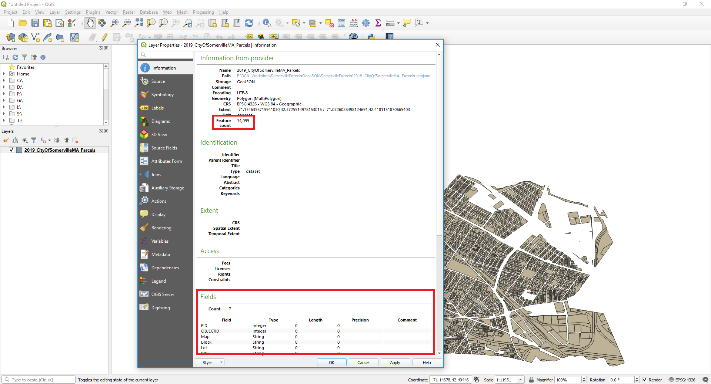 <figcaption>Fig. 15 In layer properties, the Information tab provides details on the feature count and fields. Inspect the feature count and the fields in the original dataset and in the newly converted datasets and confirm that they are the same.</figcaption> </figure>

--------------------------------
## Creating Metadata using ArcCatalog

One option for creating metadata for geospatial files involves using ArcCatalog, which is part of the Esri ArcGIS for Desktop suite. The program, however, does not recognize or allow previewing GeoJSON files. As a result, it is necessary to first convert a GeoJSON file to a shapefile using the steps above. The shapefile is then opened in ArcCatalog, which allows for the creation of a separate metadata XML file that can be stored alongside the original GeoJSON file.

In ArcCatalog, the metadata style can be set by going to “ArcCatalog Options”, and clicking on the “Metadata” tab as demonstrated below. More information on the metadata styles and standards supported in ArcCatalog can be found on [Esri's metadata styles and standards documentation page](http://web.archive.org/web/20191026034158/http://desktop.arcgis.com/en/arcmap/latest/manage-data/metadata/metadata-standards-and-styles.htm).

---------------------------------
<figure> 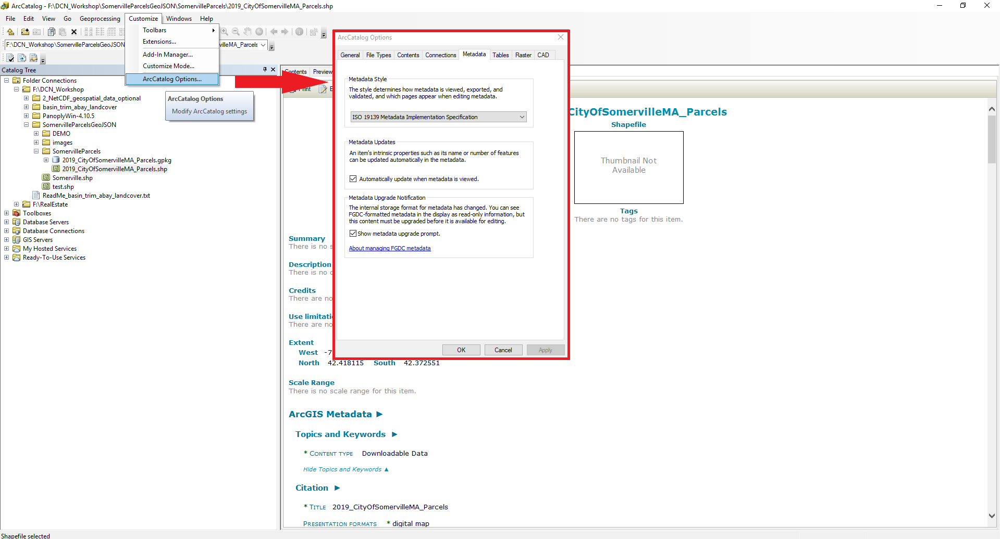 <figcaption>Fig. 16 Metadata styles can be set through the ArcCatalog Options pane.</figcaption> </figure>

---------------------------------
After selecting a metadata style, establish a connection to the folder where the converted shapefile is located. To view the metadata for a specific file, click on the description tab. To edit the metadata, click “Edit”. This will display the metadata for the file, using the metadata style selected. Items that are required will be identified with a red ‘x’ in the left-hand navigator, and across the top for each section.

---------------------------------
<figure> 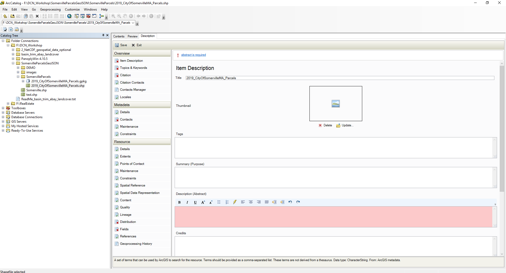 <figcaption>Fig. 17 Metadata for a dataset can be edited through the Description tab. Required items will be marked by the software.</figcaption> </figure>

---------------------------------
After editing/augmenting a file’s metadata, hit “Save”. Then, hit the “Export” button to export the metadata as a separate XML file. Saving the metadata as a separate XML file allows it to be associated with the original GeoJSON as well as the other created spatial formats: the shapefile and the GeoPackage.

---------------------------------
<figure> 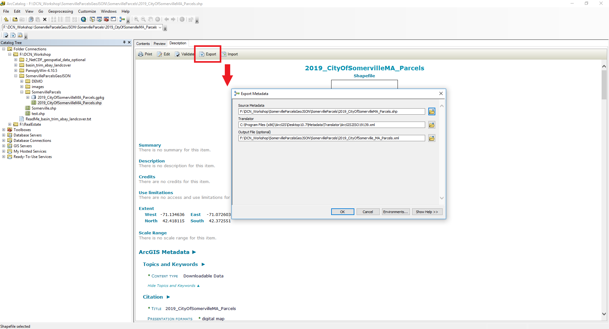 <figcaption>Fig. 18 Use the Export tab to create a separate metadata file in XML format..</figcaption> </figure>

---------------------------------
## Creating Metadata using mdEditor

If an XML metadata file already exists for the GeoJSON file in question, or ArcCatalog is not available to use, [mdEditor](http://web.archive.org/web/20191029171635/https://www.mdeditor.org/) may be a viable option. An open source web application, mdEditor is designed for both the creation and editing of metadata, and accommodates geospatial metadata standards such as ISO 191XX and CSDGM. However, as of October 2019, it is only available in beta.

# Evaluating GeoJSON Files for FAIRness

### What are the FAIR principles?

“In 2016, the ‘[FAIR Guiding Principles for scientific data management and stewardship](https://web.archive.org/web/20191024131752/https://www.nature.com/articles/sdata201618)’ were published in Scientific Data. The authors intended to provide guidelines to improve the findability, accessibility, interoperability, and reuse of digital assets. The principles emphasise machine-actionability (i.e., the capacity of computational systems to find, access, interoperate, and reuse data with no or minimal human intervention) because humans increasingly rely on computational support to deal with data as a result of the increase in volume, complexity, and creation speed of data.” (Source: [Go-Fair.org](https://web.archive.org/web/20191024131826/https://www.go-fair.org/fair-principles/))

### FAIR GeoJSON: Components Evaluated

To meet the standards for (meta)data documentation required by the [FAIR principles](https://web.archive.org/web/20191024131826/https://www.go-fair.org/fair-principles/), multiple entities must be evaluated for FAIRness: (1) the data stored in GeoJSON format, (2) the GeoJSON data’s associated metadata, and (3) the repository infrastructure in which the data is deposited. The following table indicates which entities (data, metadata, and/or infrastructure) must be evaluated to meet the standards for each FAIR principle.

|   Principle   |   Entities Evaluated for FAIRness  |
| :------------- | :------------- |
| [F1: globally unique, persistent identifier](https://web.archive.org/web/20190808070341/https://www.go-fair.org/fair-principles/f1-meta-data-assigned-globally-unique-persistent-identifiers/) | data; metadata |
| [F2: data described with rich metadata](https://web.archive.org/web/20190808070346/https://www.go-fair.org/fair-principles/f2-data-described-rich-metadata/) (see R1) | metadata |
| [F3: metadata explicitly reference data identifier](https://web.archive.org/web/20190808070416/https://www.go-fair.org/fair-principles/f3-metadata-clearly-explicitly-include-identifier-data-describe/) | metadata |
| [F4: data indexed in searchable resource](https://web.archive.org/web/20190808070346/https://www.go-fair.org/fair-principles/f4-metadata-registered-indexed-searchable-resource/) | data; metadata; infrastructure |
| [A1: data/metadata retrievable by identifier](https://web.archive.org/web/20190808070357/https://www.go-fair.org/fair-principles/metadata-retrievable-identifier-standardised-communication-protocol/) | data; metadata; infrastructure |
| [A2: metadata accessible beyond life of data](https://web.archive.org/web/20190808070420/https://www.go-fair.org/fair-principles/a2-metadata-accessible-even-data-no-longer-available/) | infrastructure |
| [I1: data/metadata represented in standard format](https://web.archive.org/web/20190808070418/https://www.go-fair.org/fair-principles/i1-metadata-use-formal-accessible-shared-broadly-applicable-language-knowledge-representation/) | data; metadata |
| [I2: data/metadata use standard vocabularies](https://web.archive.org/web/20190808070353/https://www.go-fair.org/fair-principles/i2-metadata-use-vocabularies-follow-fair-principles/) | data; metadata |
| [I3: data/metadata cross-reference other data/metadata](https://web.archive.org/web/20190808070352/https://www.go-fair.org/fair-principles/i3-metadata-include-qualified-references-metadata/) | data; metadata |
| [R1: metadata richly described](https://web.archive.org/web/20190808070351/https://www.go-fair.org/fair-principles/r1-metadata-richly-described-plurality-accurate-relevant-attributes/) (license, provenance, domain-relevant community standards) | metadata |

### Assessing GeoJSON Data for FAIRness

The following questions can assist researchers in evaluating the FAIRness of their GeoJSON data. The questions are organized according to each FAIR principle, and most questions pertain to both the data itself and its accompanying metadata: both intrinsic metadata such as variable names and controlled vocabularies as well as external metadata that describes the GeoJSON data file.

#### Findable

- **F1.** Does each GeoJSON and accompanying metadata file have a globally unique, persistent identifier?

- **F2.** **(a)** Does each GeoJSON have an accompanying metadata file? **(b)** Does the filename of each accompanying metadata file explicitly reference the globally unique, persistent identifier for the GeoJSON it describes?

- **F3.** Does each metadata file accompanying a GeoJSON include a field explicitly referencing the file’s globally unique, persistent identifier?

- **F4.** **(a)** Are the GeoJSON and accompanying metadata file(s) stored in a repository with full index and search functionality? **(b)** Does the title of the repository item accurately and fully describe the key components of the file’s contents, including at least the name of the dataset, general geographical coverage of the dataset, name of the dataset creator, and date(s) of temporal coverage of the dataset? **(c)** Does the repository metadata include the globally unique, persistent identifiers for GeoJSON and accompanying metadata file(s)?

#### Accessible

- **A1.** Is each GeoJSON and accompanying metadata file(s) able to be retrieved using the file’s globally unique, persistent identifier? If the data files are not public, does the repository in which the data and metadata are stored permit retrieval of the data and metadata via secure authentication protocols such as HTTPS or FTPS?

- **A2.** Does the repository in which the GeoJSON is stored permit the perpetual storage of metadata about the file in the event that the data itself becomes unavailable? (According to a [2017 study by Dunning et al.](http://www.ijdc.net/article/view/567), many repositories do not have clear policy statements on the perpetual availability of metadata.)

#### Interoperable

- **I1.** **(a)** To meet filetype standards, GeoJSON must be organized as JSON data structures representing a *geometry*, *feature*, or *collection of features.* Does each GeoJSON meet the [RFC 7946](https://web.archive.org/web/20191024124836/https://tools.ietf.org/html/rfc7946) standard? **(b)** Does the accompanying metadata file for each GeoJSON include standard metadata fields for geospatial information? (see [ISO 19115:2003](https://web.archive.org/web/20191024132257/https://www.iso.org/standard/26020.html) for the metadata standards for geospatial data)

- **I2.** **(a)** To meet file type standards, GeoJSON should use the following vocabulary for values in at least the starting name/value pair: *Point, MultiPoint, LineString, MultiLineString, Polygon, MultiPolygon, GeometryCollection, Feature, FeatureCollection.* Does each file meet this vocabulary standard? **(b)** Does the accompanying metadata file for each use the standard vocabularies for the chosen metadata schema?

- **I3.** Does each GeoJSON and accompanying metadata file(s) properly cite any related publications or datasets (using those publications’ or datasets’ globally unique and persistent identifiers)?

#### Reusable

- **R1.** The metadata file(s) accompanying each GeoJSON should include, at a minimum, information about the dataset’s provenance, ownership, licensing, and any other contextual information that is necessary for the data to be reused. Do(es) the metadata file(s) meet these minimum metadata standards?

# Appendix A: Example CURATED Checklist for GeoJSON

### CURATED Checklist for GeoJSON

This curation workflow is meant to serve as an example, demonstrating the recommendations made within this primer. It follows the Data Curation Network’s recommended [CURATED](https://web.archive.org/web/20191101143957/https://datacurationnetwork.org/resources/) steps:

- C - check files and read documentation
- U - understand (or try to) the data
- R - request missing information
- A - augment metadata
- T - transform file formats for reuse
- E - evaluate for fairness
- D - document all curation activities

Dataset: SomervilleParcels

Description of dataset: This dataset was provided by the City of Somerville, MA for this data curation primer and represents the City of Somerville, MA’s parcels.

File size: 10.4 MB

### C - check files and read documentation

1. Does the file open as expected?

Yes. The file was opened using notepad++, a text editor.

--------------------------------------

<figure>  <figcaption>Fig. 19 SomervilleParcels GeoJSON file opened in notepad++.</figcaption> </figure>

--------------------------------------

2. Is the dataset valid?

At first glance, the dataset appears to be a valid GeoJSON file – in notepad++, one can see that the dataset has a type of “FeatureCollection”, with coordinates that appear to be in the format [longitude, latitude]. However, to properly validate the dataset, the dataset was opened in both an online validation service ([GeoJSONLint](http://web.archive.org/web/20191029171822/http://geojsonlint.com/)) and QGIS, an open source GIS desktop software program.

To validate using online services, the full text in notepad++ was copied and pasted into the website. Note that with online validation services, the size of the file in question can cause the site to stall and/or become unresponsive. At 10.4 MB, this file took GeoJSONLint approximately 3 minutes to load:

-----------------------------------------
<figure> 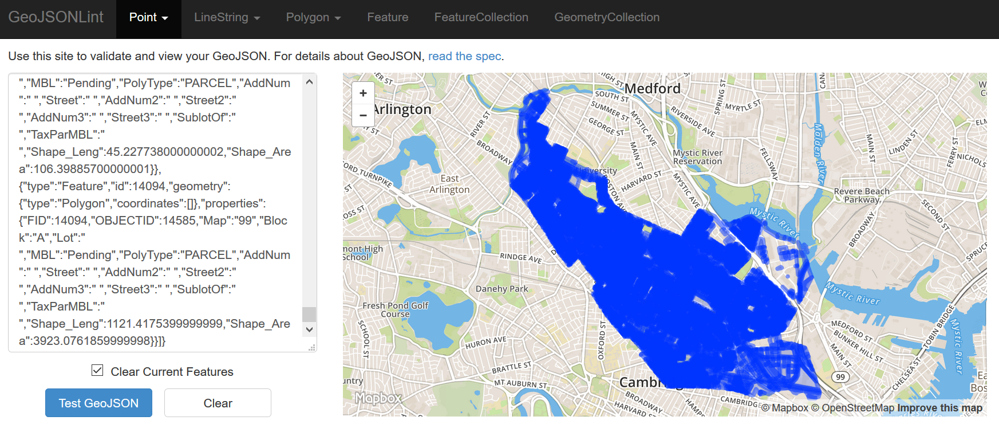 <figcaption>Fig. 20 SomervilleParcels dataset validated using GeoJSONLint.</figcaption> </figure>

------------------------------------------
The dataset was also brought into QGIS, where it could be verified that the dataset appears to be what it is stating to be: a collection of polygons representing parcels.

The dataset’s property details panel was used to discover further information. The first tab, “Information” is read-only and serves as a place to quickly grab summarized information and metadata on the layer in question. Here several key pieces of information were verified for the dataset, such as its title (SomervilleParcels), its storage file format (GeoJSON), its geometry (Polygon -- MultiPolygon), its coordinate reference system, or CRS (EPSG:4326), the extent or bounding box of the dataset, and the feature count (14,095). The storage file format and CRS help us verify that this dataset is a valid GeoJSON file.

--------------------------------------------
<figure> 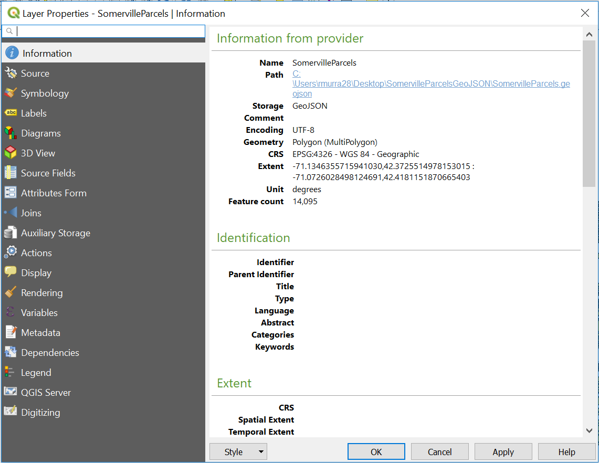 <figcaption>Fig. 21 Layer properties panel for SomervilleParcels dataset.</figcaption> </figure>

--------------------------------------------
3. Is there a separate metadata file?

No. The GeoJSON file did not come with an XML metadata file.

4. Is the metadata quality rich, accurate, and complete?

No. The GeoJSON file was opened in QGIS, and the metadata tab was examined. The metadata is incomplete. Critical information is missing, such as the formal title; parent identifier (collections this dataset is a part of); abstract; access policies and/or use restrictions; contact information; etc.

In particular, for geospatial data, the following are required by both of the two most common geospatial metadata standards (ISO 191xx and FCGC CSDGM):

- Bounding box
- Geographic location (place keywords)
- Spatial representation type (vector, raster, etc)
- Projection/coordinate system

Due to the definition of a GeoJSON file, the spatial representation type is always a vector, and the projection/coordinate system will always be WGS84, or EPGS:4326. The extent of the dataset, provided in the layer’s properties information tab, serves as the bounding box. However, geographic location, or place keywords, is missing for this dataset.

---------------------------------------------
<figure> 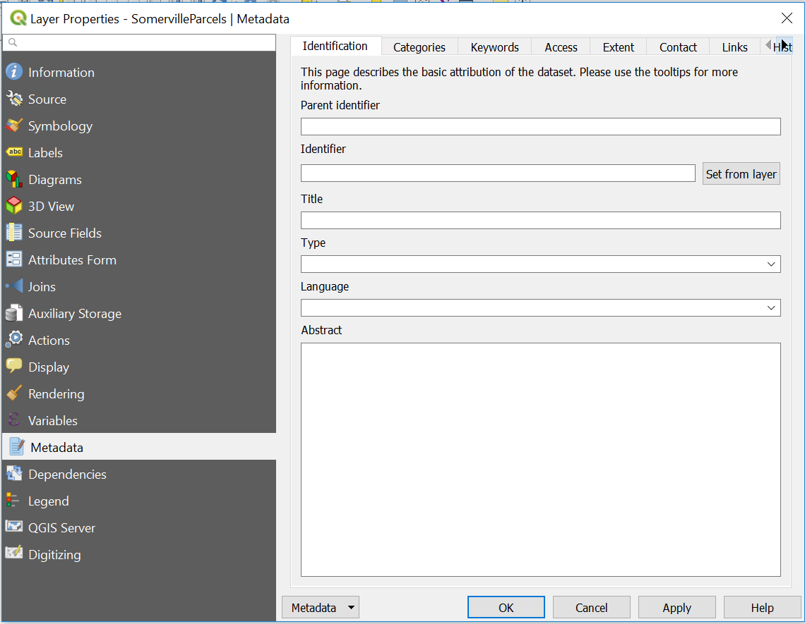 <figcaption>Fig. 22 Blank metadata tab in SomervilleParcels geojson file.</figcaption> </figure>

---------------------------------------------
5. What documentation exists?

There is no associated README.md file, or other document providing additional context. There is also no codebook or description for the attribute table column names.

6. Is additional documentation necessary for interpretation?

Yes. Additional documentation will help to provide context to this dataset.

7. Is the filename adequately descriptive?

No – the filename, “SomervilleParcels”, provides only some key information on this dataset. We know the dataset in question concerns parcel data in Somerville, but from the title, one cannot ascertain which city/town/township/area/local administration the dataset is referring to. The filename was changed to “2019_CityOfSomervilleMA_Parcels.”

8. Were any tools used to create the dataset? Software? Hardware?

It is unclear what tools, software, or hardware were used to create this dataset, as well as what other datasets or data sources were combined, if any, to create this file.

### U - understand (or try to) the data

1. View the data on a map. Does the location of the parcels match the general description of the dataset?

Yes. The dataset is located in Somerville, Massachusetts. A basemap can be added to confirm the general location of the layer in QGIS.

2. Ascertain number of rows and columns. Are the column names understandable?

In QGIS, the Information tab in Layer Properties provides a count of the total number of rows, as well as a list and count of the field names in the dataset. This dataset has 14,095 rows of data and 17 attribute fields:

- FID
- OBJECTID
- Map
- Block
- Lot
- MBL
- PolyType
- AddNum
- Street
- AddNum2
- Street2
- AddNum3
- Street3
- SublotOf
- TaxParMBL
- Shape_Leng
- Shape_Area

The column names do not have aliases. A code book is not included with the dataset, making it difficult to know for sure what the columns describe. The documentation of the data is not sufficient for reuse. For example, what does the column “Map” or “Block” refer to?

3. Inspect the attribute table.

The attribute table can be accessed by right-clicking on the layer and selecting “Open Attribute Table”. Viewing the attribute table, we can assess that the dataset in question does have a populated attribute table; while there are some rows with missing values for some columns (such as Street2, AddNumb3, SublotOf), the dataset overall appears to be complete. There are no empty rows. Each item appears to have a unique ID (FID and OBJECTID). The data in the table is readable, with no strange encodings or text.

----------------------------------
<figure> 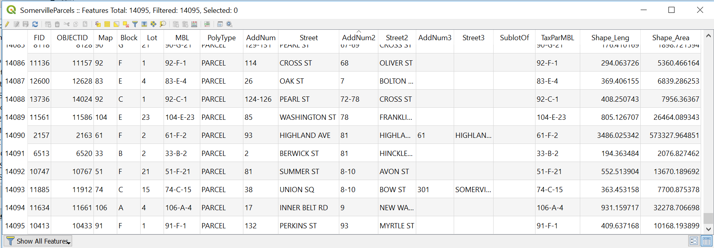 <figcaption>Fig. 23 Attribute table for SomervilleParcels geojson file.</figcaption> </figure>

----------------------------------
### R - request missing information

1. Solidify list of questions and missing information

The first two steps result in a list of questions and missing information, the bulk of which is needed in order to adequately curate this dataset. These should be gathered and used to formulate a list of recommendations/questions to communicate to the data author. This can include clarifying assumptions about the dataset, as well as missing information:

- Who created this dataset?
- What year was it created?
- What year of data does it show?
- What is the primary purpose of this dataset?
- How was this dataset created?
- How often is it updated?
- Are there any restrictions on accessing and sharing this dataset?
- Is this dataset related to other data we should be aware of?
- Is there a codebook or detailed descriptions for the columns in the attribute table?
- Is there a README file available? Other relevant documentation?

2. From the list of questions/recommendations, identify the top 3-5 questions/recommendations to ask the data author:

- Is there any documentation, such as a README file, that provides some information on this dataset (year of creation, who created it, how often it is updated, how it was created, etc)?
- Are there any restrictions on access to this data, and how should it be cited?
- Is there a codebook for the attribute table headers? If not, can you provide a brief description for
the headers?
- Please verify if you should be listed as the contact for this dataset and provide your contact
information.
- Are there other GIS data this dataset is related to?

3. Incorporate recommendations into email to the data author.

The Data Curation Network provides a sample letter for requesting changes from data authors in their
[manual on the CURATED steps](https://web.archive.org/web/20191025195429/https://datacurationnetwork.org/resources/).

### A - augment metadata and T - transform file formats for reuse

Due to the lack of a metadata XML file, and the metadata editing limitations in QGIS, the steps to augment metadata and transform file formats for reuse are done concurrently for this dataset. The following steps are taken:

1. Draft a [README file](#what-to-include-in-a-readme-file).
2. [Convert GeoJSON to shapefile](#shapefile).
3. [Edit metadata in ArcCatalog](#creating-metadata-using-arccatalog):
<BLOCKQUOTE>a. Change the metadata style to ISO 19139 b. Edit metadata sections c. Export metadata as a separate XML file.</BLOCKQUOTE>

4. [Convert GeoJSON to GeoPackage](#geopackage).
5. [Check conversions](#checking-transformations).

Both the newly created shapefile and GeoPackage were opened in QGIS to confirm that 1) the files opened properly, and 2) the files overlapped with the original GeoJSON file. The attribute table was opened and examined to verify that both have the same number of rows and columns as the original dataset.

6. Inspect final file folder.

After metadata creation, file conversions, and verifications are complete, the resulting file folder for the dataset in question should contain the original GeoJSON file (.geojson), a metadata XML file (.xml), a ReadMe file (.md), a GeoPackage file (.gpkg), and a shapefile (.cpg, .dbf, .prj, .qpj, .shp, and .shx):

---------------------------------------
<figure> 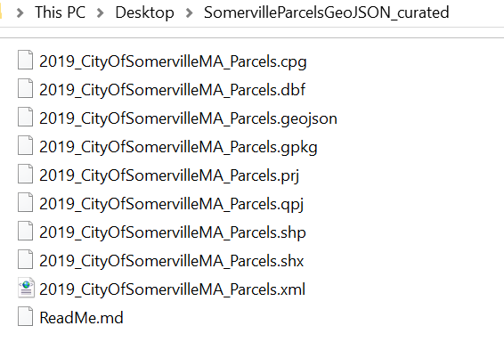 <figcaption>Fig. 24 File folder with renamed geojson file, converted files, metadata and ReadMe file. </figcaption> </figure>

---------------------------------------
### E - evaluate for fairness

1. [Go through the FAIR principles](#what-are-the-fair-principles) and assess both the metadata and the GeoJSON file:

Note: this dataset was provided as an example for this primer. It has not been curated/preserved in a repository. Principles that could not be assessed are marked as “N/A”.

|  Principle  |  Description   |   Data  |  Metadata  |
| :------------- | :------------- | :------------- | :------------- |
| Findable | F1. globally unique, persistent identifier | N/A | N/A |
| Findable | F2. data described with rich metadata | yes | blank |
| Findable | F3. metadata explicitly reference data identifier | blank | N/A |
| Findable | F4. data indexed in searchable resource | N/A | N/A |
| Accessible | A1. data/metadata retrievable by identifier | N/A | N/A |
| Accessible | A2. metadata accessible beyond life of data | blank | yes |
| Interoperable | I1. data/metadata represented in standard format | yes | yes |
| Interoperable | I2. data/metadata uses standard vocabularies | yes | yes |
| Interoperable | I3. data/metadata cross-reference other data/metadata | N/A | N/A |
| Reusable | R1. metadata richly described | blank | yes |

### D - document all curation activities

Documentation should be created throughout the CURATE process. Going through each of the steps above, take notes on the following, making sure to also note who was responsible for each step and when it was done:

1. Original dataset and documentation
<BLOCKQUOTE>a. Software and tools were used to assess and validate data b. Questions/concerns that came up through validation process c. State of metadata and other documentation files</BLOCKQUOTE>

2. Conversions
<BLOCKQUOTE>a. Software and tools used to transform data b. Transformations done to data (shapefile, GeoPackage)</BLOCKQUOTE>

3. Metadata and documentation augmentation/creation
<BLOCKQUOTE>a. Creation of shapefile and exporting of metadata to XML b. Changes made to metadata and documentation</BLOCKQUOTE>

4. Correspondence with data owner on dataset
<BLOCKQUOTE>a. Request for missing information</BLOCKQUOTE>

5. Evaluation for fairness

This example did not include the final step of depositing a dataset into a repository. Additional notes to document when undertaking this step include:

6. Submission records
7. Repository collection metadata
8. Any additional requirements at repository in question

# Appendix B: Researcher Survey Results

In July 2019, the GeoJSON primer authors created and deployed a short online questionnaire, intended to gather information about researchers’ creation, use, and reuse of geospatial vector data in GeoJSON format. The survey - delivered as a Google Poll - was shared with various email lists and GIS working groups and received a total of 18 responses, as of August 8, 2019.

## Survey Questions

1. What discipline or field do you work in? (short answer)
2. What is your general level of familiarity or expertise with geospatial data? (multiple choice (select one) + “other” (short answer))
3. (Optional) What is your position or title? (short answer)
4. How often do you CREATE data in GeoJSON format? (multiple choice (select one) + “other” (short answer))
5. How often do you (RE)USE data that is in GeoJSON format? (multiple choice (select one) + “other” (short answer))
6. What tools or platforms do you use to create, view, or manipulate GeoJSON data? (multiple choice (select many) + “other” (short answer))
7. Aside from GeoJSON, what other vector data formats do you create or use regularly? (multiple choice (select many) + “other” (short answer))
8. What online resources do you consult for creating or using GeoJSON data? (multiple choice (select many) + “other” (short answer))
9. Where do you search for and find reusable GeoJSON data? Please mention specific repositories or platforms if applicable. (long answer)
10. In what ways do you share your geospatial data, including data in GeoJSON format? Please mention specific repositories or platforms if applicable. (long answer)
11. Do you create metadata files to accompany your GeoJSON data files? (multiple choice (select one) + “other” (short answer))
12. If you store or share your geospatial data in a data repository, do you primarily submit it in GeoJSON format? (multiple choice (select one) + “other” (short answer))
13. If you do share your data, what other file formats do you submit to data repositories? (long answer)

## Survey Results

Preliminary results indicate that survey participants primarily represented researchers and librarians. About 83% or respondents said they possess advanced familiarity or expertise with geospatial data (Question 2), with about 17% stating that they have intermediate familiarity.

The following charts summarize responses regarding respondents’ use of GeoJSON data (Questions 4 and 5):

---------------------------------------------------
<figure> 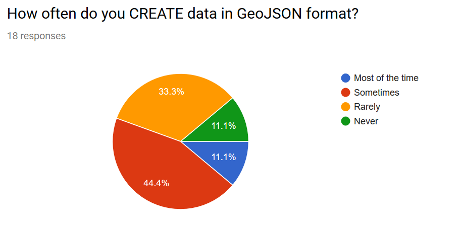 <figcaption></figcaption> </figure>

---------------------------------------------------
<figure> 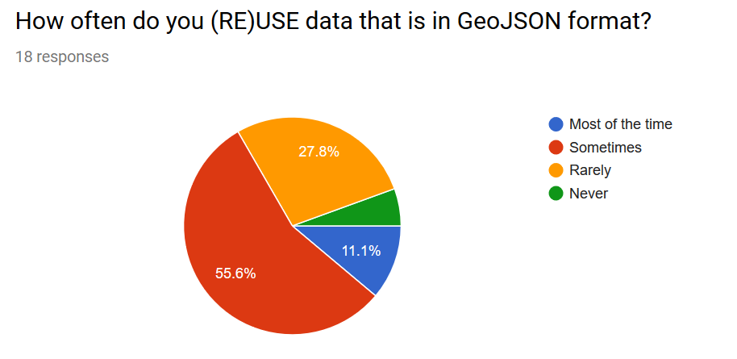 <figcaption></figcaption> </figure>

---------------------------------------------------

In response to the question regarding which tools or platforms respondents use to create or use GeoJSON data (Question 6), 94.4% of respondents stated that they use commercial or open-source GIS software. The second most common response was scripting languages and packages such as R or python (66.7% of respondents), and browser-based tools were used by 55.6% of respondents.

A full 100% of respondents stated that, aside from GeoJSON, they regularly create or use shapefile data (Question 7), and 50% stated that they use XML-based GIS standard data such as GML or KML files.

The most common response to the question regarding what online resources respondents consult regarding GeoJSON data (Question 8) was “I do not typically consult online resources or documentation for GeoJSON,” although 27.8% of respondents said they consult GeoJSON help pages on software guides and 27.8% of respondents said they consult the official GeoJSON documentation ([RFC 7946](https://web.archive.org/web/20191024124836/https://tools.ietf.org/html/rfc7946)).

Among the most useful responses to Question 9 on repositories and platforms where respondents search for GeoJSON data were the following statements:

<BLOCKQUOTE>“I don't search specifically for GeoJSON. I search for the data I need (for example, sidewalks in Oklahoma City), and once I find it, consider the format. Many government agencies rely on the ArcGIS platform, which has far more robust GeoJSON support in recent versions.”</BLOCKQUOTE>

<BLOCKQUOTE>“When searching for vector data, I'm not usually searching for a specific vector format. Most repositories or platforms I frequent for my work (NED, GADM) do not provide GeoJSON. If I need GeoJSON, I'll convert it myself.”</BLOCKQUOTE>

<BLOCKQUOTE>“I frequently see it as an option for exporting from the Socrata platform, which is the infrastructure behind many cities' open data portals.”</BLOCKQUOTE>

Other responses to Question 9 include: OpenIndexMaps, commercial vendors, Data.gov, GitHub, Geonames, Zenodo, Geoservers, city data portals, earthworks.stanford.edu, and data.humdata.org.

Among the most common responses to Question 10 on ways respondents share GeoJSON data were the following: OpenIndexMaps, geodatabase files, Zenodo, GitHub, static HTML pages, institutional repositories, cloud storage, and ArcGIS Online.

The following charts summarize responses regarding respondents’ creation of metadata and sharing of GeoJSON files (Questions 11 and 12).

---------------------------------------------------
<figure> 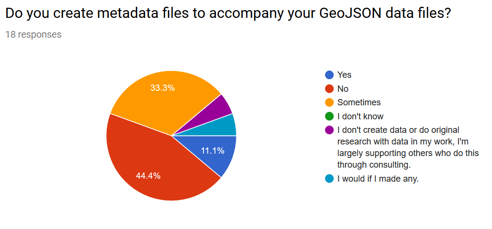 <figcaption></figcaption> </figure>

---------------------------------------------------
<figure> 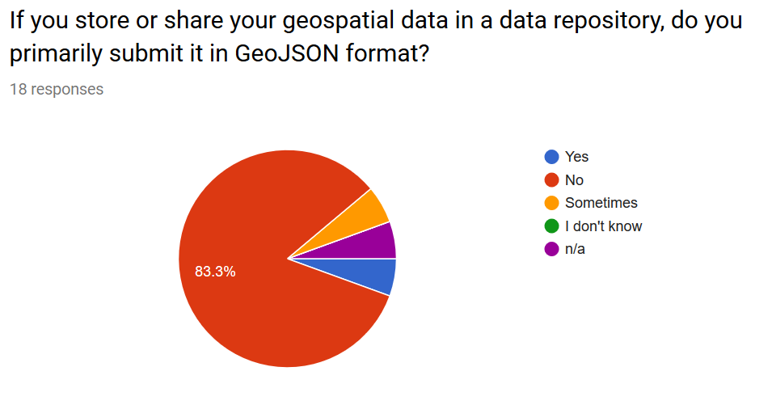 <figcaption></figcaption> </figure>

---------------------------------------------------
The most frequent responses to Question 13 on other file formats respondents commonly use to submit geospatial data to repositories include: shapefiles, geodatabase, CSV, JSON, geotiff, and kmz/klm.

# Bibliography

Arora, S. K. (2018, February 3). A primer on GeoJSON standard and visualization tools. Retrieved June 17, 2019, from Medium website: [https://medium.com/@sumit.arora/what-is-geojson-geojson-basics-visualize-geojson-open-geojson-using-qgis-open-geojson-3432039e336d](https://medium.com/@sumit.arora/what-is-geojson-geojson-basics-visualize-geojson-open-geojson-using-qgis-open-geojson-3432039e336d) 

Esri. (n.d.). ArcGIS Online Reference: GeoJSON (Reference). Retrieved from ArcGIS Online website: [https://doc.arcgis.com/en/arcgis-online/reference/geojson.htm](https://doc.arcgis.com/en/arcgis-online/reference/geojson.htm) 

Gillies, S. (n.d.). geojson: Python bindings and utilities for GeoJSON (Version 2.4.1) (Python, OS Independent). Retrieved from [https://github.com/frewsxcv/python-geojson](https://github.com/frewsxcv/python-geojson)

Gillies, S. (2016, August 17). *Re: (Geojson) metadata in GeoJSONgeojson*. Retrieved from [https://mailarchive.ietf.org/arch/browse/geojson/?q=metadata](https://mailarchive.ietf.org/arch/browse/geojson/?q=metadata)

Gillies, S., Butler, H., Daly, M., Doyle, A., & Schaub, T. (n.d.). The GeoJSON Format. Retrieved April 18, 2019,from [https://tools.ietf.org/html/rfc7946](https://tools.ietf.org/html/rfc7946)

Hanson, B. A., & Seeger, C. J. (2015). Validate GeoJSON: GeoJSONLint. *Extension and Outreach Publications*, 183, 3.

Lampros, M. (n.d.). Processing of GeoJSON data in R. Retrieved April 18, 2019, from [https://cran.r-project.org/web/packages/geojsonR/vignettes/the_geojsonR_package.html](https://tools.ietf.org/html/rfc7946)

Library of Congress. (2014). GeoJSON, Version 1.0 [Web page]. Retrieved April 18, 2019, from [https://www.loc.gov/preservation/digital/formats/fdd/fdd000382.shtml](https://www.loc.gov/preservation/digital/formats/fdd/fdd000382.shtml)

MacWright, T. (2015). More than you ever wanted to know about GeoJSON. Retrieved August 9, 2019, from macwright.org website: [https://macwright.org/2015/03/23/geojson-second-bite.html](https://macwright.org/2015/03/23/geojson-second-bite.html)

MacWright, T. (2019). *GeoJSON utilities that will make your life easier*. Retrieved from [https://github.com/tmcw/awesome-geojson](https://github.com/tmcw/awesome-geojson) (Original work published 2015)

Mapbox. (n.d.). GeoJSON (Text). Retrieved April 18, 2019, from Mapbox website: [https://www.mapbox.com/help/glossary/geojson/](https://www.mapbox.com/help/glossary/geojson/)

MapBox. (n.d.). geojson.io. Retrieved April 18, 2019, from geojson.io website: [https://geojson.io/](https://geojson.io/)

MongoDB. (n.d.). GeoJSON Objects (Text). Retrieved April 18, 2019, from [https://github.com/mongodb/docs/blob/v4.0/source/reference/geojson.txt](https://github.com/mongodb/docs/blob/v4.0/source/reference/geojson.txt) website: [https://docs.mongodb.com/manual/reference/geojson](https://docs.mongodb.com/manual/reference/geojson)

SpatiaLite. (n.d.). SpatiaLite: Supporting GeoJSON. Retrieved April 18, 2019, from [https://www.gaia-gis.it/fossil/libspatialite/wiki?name=Supporting+GeoJSON](https://www.gaia-gis.it/fossil/libspatialite/wiki?name=Supporting+GeoJSON)

Switch from Shapefile. (n.d.). Retrieved from Switch from Shapefile website: [http://switchfromshapefile.org/#alternatives](http://switchfromshapefile.org/#alternatives)

Wikipedia. (2019). GeoJSON. In *Wikipedia*. Retrieved from [https://en.wikipedia.org/w/index.php?title=GeoJSON&oldid=900774444](https://en.wikipedia.org/w/index.php?title=GeoJSON&oldid=900774444)
