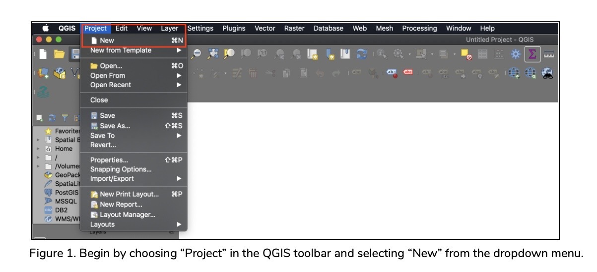
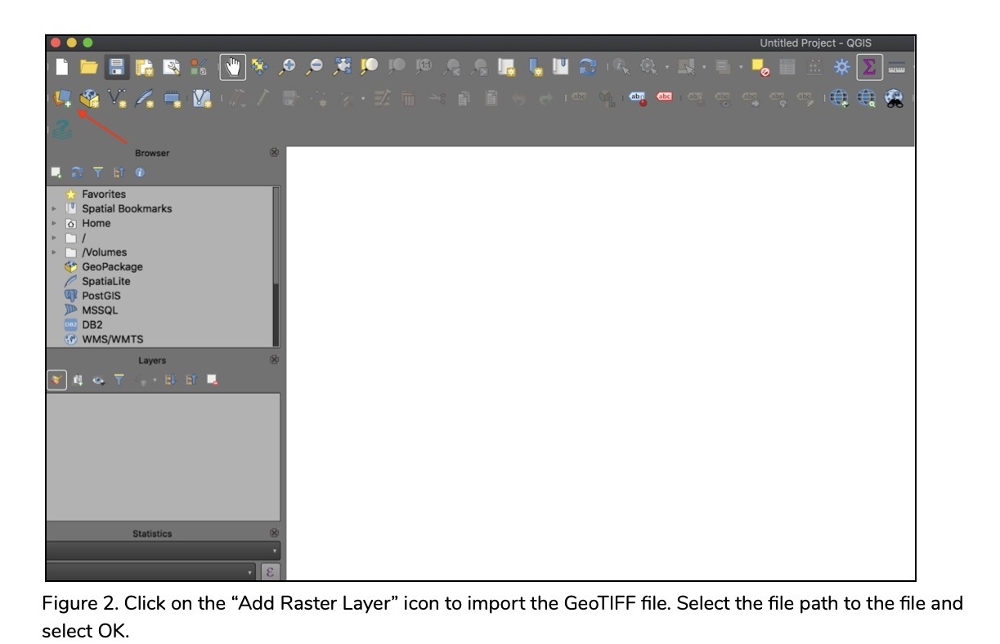
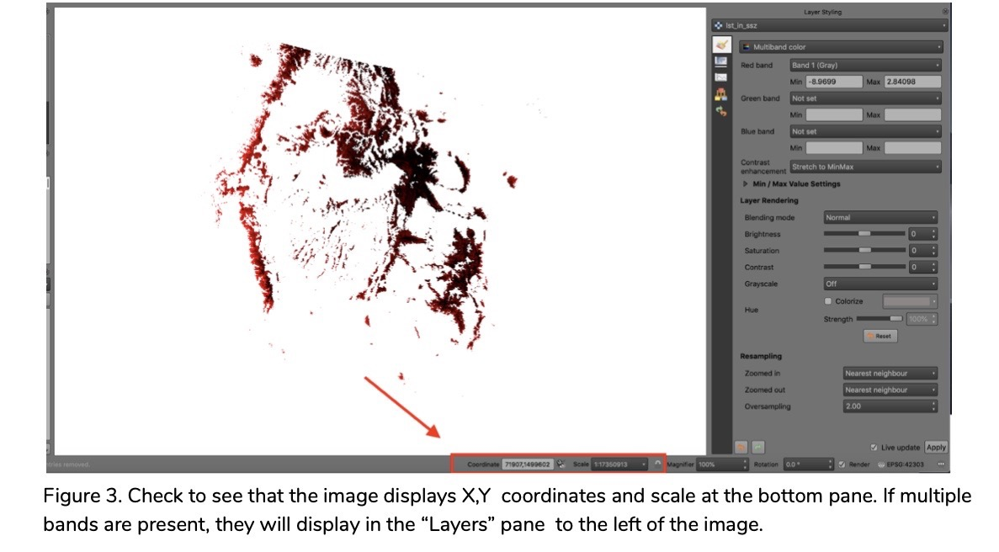
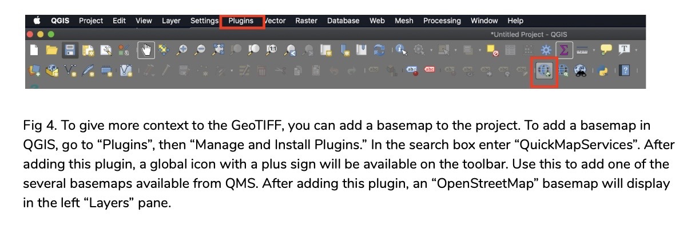
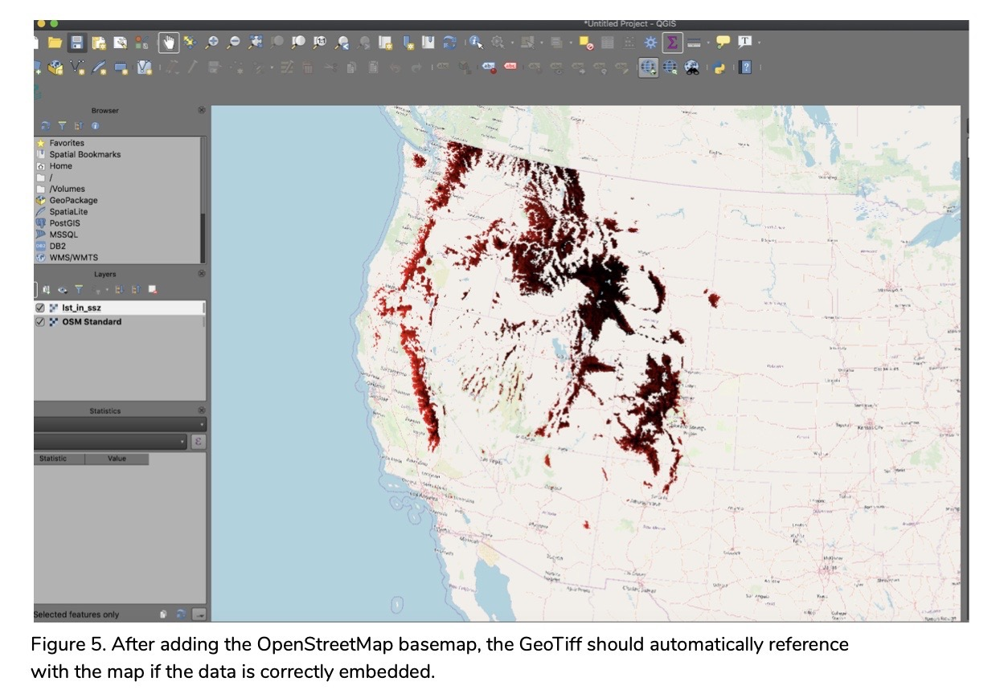
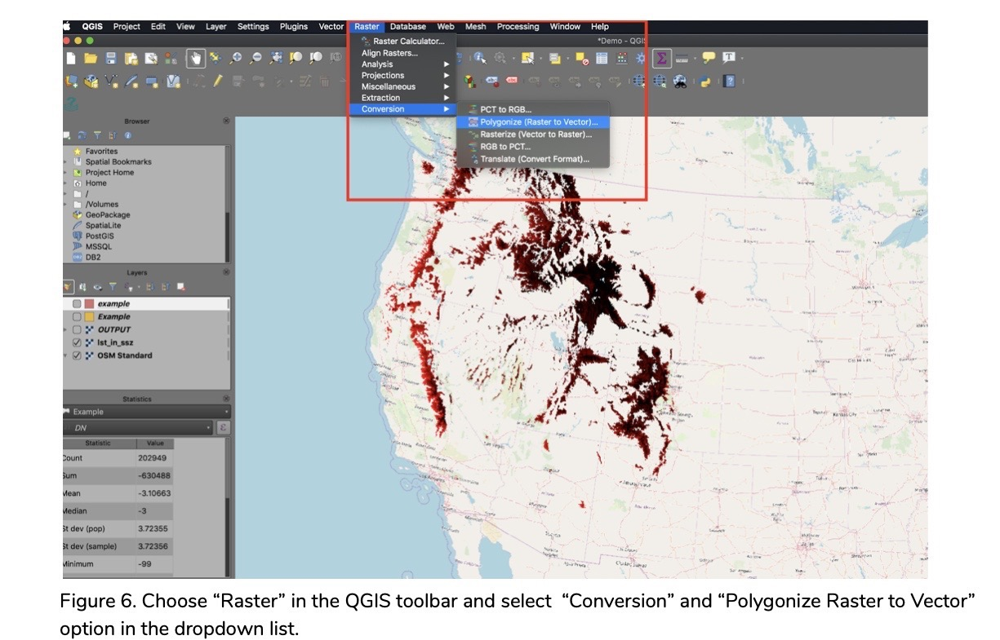
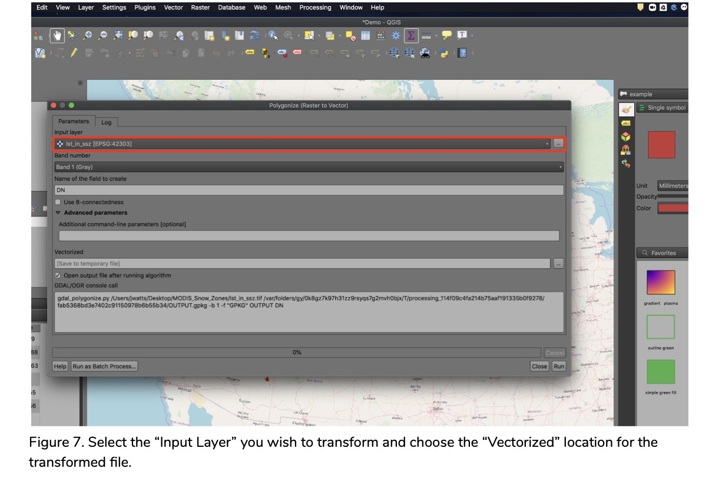
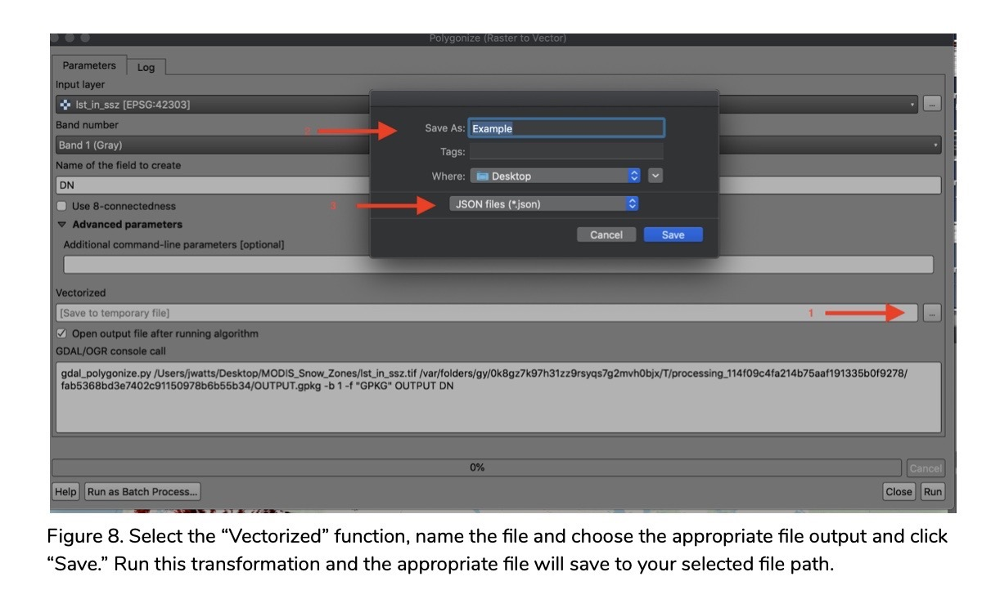

# GeoTIFF Primer

## Overview

|   Topic   |   Description   |
| :------------- | :------------- |
| FIle Extension(s) |.tif, .tiff|
| MIME Type |image/tiff; no built-in browser compatibility|
| Structure |File-format, tiff tags (geokeys)|
| Versions |Revision 1.0, subtype of tiff revision 6.0|
| Primary fields or areas of use |Any field that intersects with geographic information systems (GIS) and remote sensing. Examples include the earth sciences, urban planning, archaeology, etc.|
| Source and affiliation |Open, extension to Aldus-Adobe’s public domain tiff |
| Metadata standards |<ul><li>[ISO 19139](https://www.iso.org/standard/67253.html)</li><li>[FDGC](https://www.fgdc.gov/metadata/csdgm-standard)</li><li>[OGC (Open Geospatial Consortium) GeoTIFF Standard v1.1](https://www.ogc.org/standards)</li><li>[GeoBlacklight 1.0](https://opengeometadata.org/gbl-1.0/)|
| Key questions for curation review |<ul><li>Measurement unit</li><li>Temporal information</li><li>Geospatial information</li><li>File naming convention|
| Tools for curation review |Example in this primer uses QGIS. Other applications include: USGS’s dlgv32, Esri ArcGIS suite, ERDAS, MapInfo, Global Mapper, Python, R|
| Date Created |20 March 2020|
| Created by |<ul><li>Courtney Kearney, Tulane University (ckearney@tulane.edu)</li><li>Nick Ruhs, Florida State University (nruhs@fsu.edu)</li><li>Mara Sedlins, Colorado State University (mara.sedlins@colostate.edu)</li><li>Tracy Tien, Smith College (htien@smith.edu)</li><li>Jessica Trelogan, University of Texas Austin (j.trelogan@austin.utexas.edu)</li><li>John Watts, Texas A&M University (jwatts@tamu.edu)|
| Date updated and summary of changes made | | 

**Suggested Citation:** Kearney, Courtney; Ruhs, Nick; Sedlins, Mara; Tien, Tracy; Trelogan, Jessica; and Watts, John. (2020). GeoTiff Data Curation Primer. [Data Curation Network GitHub Repository.](https://github.com/DataCurationNetwork/data-primers)

This work was created as part of the “Specialized Data Curation” Workshop #3 held at Washington University in St.Louis, MO on November 5-6, 2019. These workshops have been generously funded by the Institute of Museum and Library Services # RE-85-18-0040-18.

# Table of Contents

[Description of format](#description-of-format)

[Ways in which different disciplines fields may use this format](#ways-in-which-different-disciplines-fields-may-use-this-format)

[Examples](#examples)

[Sample data set citations](#sample-data-set-citations)

[Key questions to ask yourself](#key-questions-to-ask-yourself)

[Key clarifications to get from researcher](#key-clarifications-to-get-from-researcher)

[Recommended metadata elements and standards](#recommended-metadata-elements-and-standards)

[Software for opening and  viewing GeoTIFFs](#software-for-opening-and-viewing-geotiffs)

[Preservation actions](#preservation-actions)

[What to look for to make sure this file meets FAIR principles](#what-to-look-for-to-make-sure-this-file-meets-fair-principles)

[Unresolved Issues Further Questions](#unresolved-issues-further-questions)

[Documentation of curation process What to capture from curation process](#documentation-of-curation-process-what-to-capture-from-curation-process)

[Appendix A filetype CURATED checklist](#appendix-a-filetype-curated-checklist)

[Citations](#citations)

# Description of format 

The **GeoTIFF is a TIFF (Tag Image File Format)*** that describes and stores associated geographic information, including geographic coordinate systems and projections (using EPSG codes.) GeoTIFFs are raster image files that are typically acquired from satellites, scanned aerial photography, digitized maps, or derived spatial analysis products such as DEMs (Digital Elevation Model.)  A GeoTIFF supports:

- Bilevel, grayscale, palette-color, full-color
- Flexible compression schemes for optimizing space and time tradeoff between application platforms (uses MetaTag or GeoKey to encode into six tags, making a GeoTIFF platform-independent and better cross-platform exchange)
- Portability and extensibility

# Ways in which different disciplines may use this format

- Time-series analysis of satellite images to perform land cover classification and land use change detection (environmental science)
- High-resolution imagery acquired from a UAV from processed into a digital elevation model, then used to calculate sedimentation to assess coastal erosion (geology)
- Digital Elevation Model derived from LiDAR, modeling heavily-canopied historical ruins (archaeology)
- Travel time to employment surface raster to assess developmental potential based on employment opportunities (economics)

# Example GeoTIFF data sets and repositories

GeoTIFFs may be shared as stand alone files or together with other types of geospatial data, such as shapefiles. Geospatial data may also be authored by one entity but made discoverable by another. For example, here is a GeoTIFF authored by the U.S. Geological Survey and made available in the Stanford Earthworks geospatial repository: [https://earthworks.stanford.edu/catalog/stanford-zz225qj2166](https://earthworks.stanford.edu/catalog/stanford-zz225qj2166)

### Other examples of geospatial repositories include:

[NYU Spatial Data Repository](https://geo.nyu.edu)

[Berkeley Geodata](https://geodata.lib.berkeley.edu)

**Note:** These repositories use GeoBlacklight as their discovery platform and allow faceting based on data type. To see additional examples of GeoTIFFs, you can select Raster as the data type. GeoBlacklight also maintains a common metadata schema for GeoTIFFs (see section 6 of this primer for more information about the GeoBlacklight and other metadata schemas).

**Here is another example of GeoTIFF data.** In this case, the data were produced by a researcher at Colorado State University and shared in CSU’s institutional repository to support an associated publication. This dataset includes both GeoTIFFs and shapefiles and is referred to in section 7 of this primer (“Software for opening and viewing GeoTIFFs”): [http://dx.doi.org/10.25675/10217/171907](http://dx.doi.org/10.25675/10217/171907)

# Sample data set citations 

### Formatting:

**Dataverse:** [Data Citation Standards](https://dataverse.org/best-practices/data-citation)

**APA:** Author. (Year). Title (version no.) [Data set]. Publisher. DOI or URL.

**Chicago:** Author. Title. File format. Last modified date {if available; if not, include date of access}. URL.

**MLA:** Author. Title. Publication {if applicable}. Publisher location: Publisher {if applicable}. Year. File type. Retrieved from URL on date of access.

### Examples:

#### Dataverse:

Zhang, Yonggen; Marcel G. Schaap, 2018, "A High-Resolution Global Map of Soil Hydraulic Properties Produced by a Hierarchical Parameterization of a Physically-Based Water Retention Model", [https://doi.org/10.7910/DVN/UI5LCE](https://doi.org/10.7910/DVN/UI5LCE), Harvard Dataverse, V1

Ellis, Erle, 2019, "Anthromes v1 (GeoTiff)", [https://doi.org/10.7910/DVN/ZWOEZU](https://doi.org/10.7910/DVN/ZWOEZU), Harvard Dataverse, V1

HarvestChoice, International Food Policy Research Institute (IFPRI); University of Minnesota, 2017, "CELL5M: A Multidisciplinary Geospatial Database for Africa South of the Sahara", [https://doi.org/10.7910/DVN/G4TBLF](https://doi.org/10.7910/DVN/G4TBLF), Harvard Dataverse, V5

Castillo, Cesar R, 2019, "Aerial_Imagery_D810_16Apr2018_NIR", [https://doi.org/10.18738/T8/ASAGDQ](https://doi.org/10.18738/T8/ASAGDQ), Texas Data Repository Dataverse, V1

#### APA Style:

Natural Resources Canada. (2017). National Road Network - NRN - GeoBase Series [Data file]. Retrieved from [https://open.canada.ca/data/en/dataset/d799c202-603d-4e5c-b1eb-d058803f80f9](https://open.canada.ca/data/en/dataset/d799c202-603d-4e5c-b1eb-d058803f80f9).

#### Chicago Style: 

Natural Resources Canada. Orthoimages of Canada 2005-2010. GeoTIFF . Accessed December 17, 2017. [http://open.canada.ca/data/en/dataset/d799c202-603d-4e5c-b1eb-d058803f80f9](http://open.canada.ca/data/en/dataset/d799c202-603d-4e5c-b1eb-d058803f80f9).

#### MLA Style:

Natural Resources Canada. Orthoimages of Canada 2005-2010. 2010. GeoTIFF files. Retrieved from [http://open.canada.ca/data/en/dataset/d799c202-603d-4e5c-b1eb-d058803f80f9](http://open.canada.ca/data/en/dataset/d799c202-603d-4e5c-b1eb-d058803f80f9) on 17 Dec. 2017.

# Key questions to ask yourself 

[ORNL Best Practices for Preparing Environmental Datasets to Share and Archive](https://daac.ornl.gov/datamanagement/)

### Curation review 

- These are the overview parameters that will be helpful in understanding and using the data, with each parameter expanded upon below: 
  - Measurement unit 
  - Temporal information
  - Geospatial information
  - File naming convention

- Measurement unit
  - Standardized measurement units (such as SI units) or discipline-specific units

- Temporal information
  - Using ISO standard date and time for the temporal coverage of the data and time increments if application - for example, annual land cover change from 2000-2010
  - For satellite imagery, include the satellite/sensor and image acquisition date  - for example, Sentinel-2A 2020-06-09

- Spatial information
  - What is the coordinate system? Geographic Coordinate System (GCS) or projected coordinate system, and datum
    - Geographic coordinate system indicates the location of the surface of earth - [List of geographic coordinate system](https://desktop.arcgis.com/en/arcmap/latest/map/projections/pdf/geographic_coordinate_systems.pdf)
    - Projected coordinate system is how the data are transformed to display on a 2D plane - [List of projected coordinate systems](https://desktop.arcgis.com/en/arcmap/latest/map/projections/pdf/projected_coordinate_systems.pdf)
  - What is the spatial extent/resolution? For example, contiguous US land cover at 30m pixels 
  - Boundary/bounding box is the minimum and maximum longitude and latitude that encompasses all the features of the dataset - min Longitude (left) , min Latitude (bottom) , max Longitude (right) , max Latitude (top)
- Does the data contain multiple layers/bands? Satellites assign each instrument on board with a wavelength output channel. For example, optical multispectral images typically have 3 bands (Red, Green, and Blue).
  - Does the metadata contain information for each layer/band? For example, Band 1 = Red, Band 2 = Green, and Band 3 = Blue 
  - Are the layers/bands bundled together? Should they be separated to preserve information?
- If the data contain coded fields, include the definition of each code - ex: National Land Cover Database class value 11 = open water
- Are there missing values? - if number, use 9999 or na for string
- What is the file and naming convention?

# Key clarifications to get from researcher

- Data lineage - what was the data source and what transformations were performed? 
- What kinds of software?
- Any models or scripts used?
- Any associated files - tabular or vector?
- Band information - which band is associated with which number, ex: Red - Band 1 etc.
- Are there visualization/symbology requirements?
- Are there any restrictions on redistribution?
- Are there special considerations for viewing and analyzing the data, such as size, software/hardware processing capabilities, and any privacy issues?
- Who to contact if questions about the data?

# Recommended metadata elements and standards

### Minimal recommended elements:

At minimum, the following elements are recommended for GeoTIFFs:

- File format
- Subject (e.g., land cover, elevation, vegetation, etc)
- Coordinate system + units
- Spatial coverage (e.g. Fort Collins, Colorado, United States) - consider referencing standards in [GeoNames](https://www.geonames.org)
- Bounding box/extent of the layer
- Acquisition date
- Provenance (creator, publisher)
- Spatial resolution + units
- Copyright/reuse license

### Recommended Standards:

The most widely used metadata standards for GeoTIFFs are ISO 191** and FGDC CSDGM. 

**ISO 191**** is a series of standards from the International Organization for Standardization (ISO) that are widely accepted as robust geospatial metadata standards. This series includes ISO 19115, the content standard for geographic information metadata; ISO 19110, the content standard for describing the features (entities and attributes); and ISO 19139, the XML schema implementation of geographic information metadata.

**FGDC CSDGM** is the United States Government’s Federal Geographic Data Committee (FGDC) Content Standard for Digital Geospatial Metadata (CSDGM). Developed by the US government, this standard is typically used for federal data sets, although ISO 19100 standards are also accepted for these data sets.

While these two standards vary in their source organization, their content is fairly similar. They both require typical core metadata elements including title, creator, date, subject, description, rights, as well as bounding box, geographic location (place keywords), spatial representation type (vector, raster, etc.), projection/coordinate system.

Typically used in the earth sciences, the Open Geospatial Consortium GeoTIFF Standard v1.1 defines a GeoTIFF as a TIFF that includes basic geospatial fields and uses specific encoding practices. These fields are based on ISO 19115-1 and include file size, projections, bounding boxes, band wavelengths, spatial extent and resolution.

https://earthdata.nasa.gov/esdis/eso/standards-and-references/geotiff 

### Emerging Presentation and Discovery Standards:

#### Geoblacklight

[https://opengeometadata.org/gbl-1.0/](https://opengeometadata.org/gbl-1.0/)

[https://github.com/geoblacklight/geoblacklight/wiki/GeoBlacklight-Metadata](https://github.com/geoblacklight/geoblacklight/wiki/GeoBlacklight-Metadata)

The GeoBlacklight Schema is a user-friendly metadata schema for GIS resource discovery, and focuses solely on discovery use cases. Text search, faceted search and refinement, and spatial search and relevancy are among the primary features that the schema enables.

Developed by Stanford University Librarians [https://journal.code4lib.org/articles/9710](https://journal.code4lib.org/articles/9710),  and based on Dublin Core, this schema includes custom spatial elements that help users easily find geospatial data. Since this schema is meant for discovery, it is not appropriate for complete technical documentation, such as the processing history of a GIS dataset. This schema supports a variety of GIS data types, including GeoTIFF. Unlike ISO 19115/19139 and FGDC, Geoblacklight is concise, discovery focused, and designed with inter-institutional sharing in mind. 

The layered nature of geospatial data is often not captured in metadata. Geoblacklight distinguishes between layers and datasets such that “a layer is a specific unit of data that contains a set of geospatial features, a metadata description, and a feature catalog” and a dataset is a collection of layers. Although the inclusion of metadata for each layer is optimal in the discovery and reuse of the data, it does increase the curation work load for either the data creator or librarian.

Further information about Geoblacklight metadata, including required and recommended fields, is available via the [Geoblacklight Wiki](https://github.com/geoblacklight/geoblacklight/wiki/GeoBlacklight-Metadata).

#### Cloud Optimized GeoTIFF 

[https://github.com/cogeotiff/cog-spec/blob/master/spec.md](https://github.com/cogeotiff/cog-spec/blob/master/spec.md)

Cloud Optimized GeoTIFFs (COGs) are GeoTIFFs that are formatted such that only needed sections of an image can be extracted for analysis. This allows a user to download smaller files prior and effectively stream raster data on the fly. It also allows geospatial data to live on the cloud, reducing storage needs for individual research groups. The main difference between a GeoTIFF and COG is the order of the TIFF components.

### Metadata completeness:

For information regarding metadata completeness and suggested tools and strategies for authoring metadata when none exists, see the [Geodatabase Data Curation Primer](https://github.com/DataCurationNetwork/data-primers/blob/master/Geodatabase%20Data%20Curation%20Primer/Geodata-Primer.md#metadata-completeness).

# Software for opening and viewing GeoTIFFs

There are a number of software packages to support the creation and analysis of GeoTIFFs. The following table provides a selection of software, their common use with GeoTIFF, and notes or considerations for the curator. 

|   Software Package   |   Common Use   | Notes |
| :------------- | :------------- | :------------- |
|Adobe Illustrator - Map Publisher|Analysis, Transformation, Viewing|Proprietary plugin for Adobe Illustrator for reading, writing raster files|
|Envi Geospatial|Analysis, Transformation, Viewing|Proprietary software for reading and writing raster files|
|Esri ArcGIS|Analysis, Transformation, Viewing|Proprietary software; common packages for reading and writing raster files are ArcMap, ArcGIS Pro, and ArcGIS Online, and ArcPy (plugin); Client-based licenses such as ArcMap and some add-on licenses run on Windows operating system only|
|Geospatial Data Abstraction Library (GDAL)|Analysis, Transformation|Open source library of tools used for manipulating raster and vector geospatial images; usually combined with other analysis software such as Python|
|geotiff.js|Analysis, Viewing|Open source and browser enabled with a simple interface and best for smaller files|
|Python - Numpy|Analysis, Transformation|Open source scripting package that works with geospatial libraries to read and write raster files|
|Python - Rasterio|Analysis, Transformation|Open source scripting package that reads and writes raster files and extracts data to other formats such as GeoJSON|
|Quantum GIS (QGIS)|Analysis, Transformation, Viewing|Open source software that supports numerous vector, raster, and database formats and functionalities. Runs on Linux, Unix, Mac OSX, Windows and Android|
|RSpatial|Analysis, Transformation|Open source R package has functions for creating, reading, manipulating, and writing raster data|

### Viewing GeoTIFF in Quantum GIS (QGIS)

QGIS is an open platform that runs on MacOS, Windows, and Linux operating systems. It is optimized for raster formats such as GeoTIFF and can be used to view files and perform basic transformation of files. There are other software solutions  for viewing these files, but this package is a no-cost and simple solution for non-experts who wish to complete the Checking and Understanding CURATE steps.  Below is a guide for loading and viewing GeoTIFFs and raster data in QGIS 3.10.1. Additional information for opening data in QGIS is available on the [QGIS Training Manual for rasters](https://docs.qgis.org/3.4/en/docs/training_manual/rasters/index.html). This guide uses a GeoTIFF from [Snow persistence grids and snow zone shape files for the western United States](https://mountainscholar.org/handle/10217/171907) dataset.

 Software packages are available for different operating systems (Windows, MacOS, Linux, and BSD).

### Key Questions to Ask When Viewing GeoTIFFs in QGIS: 

- Am I able to determine the extent of the map and the projection system?
- What aspects of the file are important? (geometry, color scale, distribution of data, etc.)
- Are there text or vector files that accompany the data embedded in the GeoTIFF in order to provide context and enable interpretation of the image? It is typical to find text files that describe 
- Is the file rendering properly as an individual layer? 
- When the layer is combined with a basemap, does the layer correspond to the correct location?

# Preservation actions

GeoTIFFs are not recommended for sharing research data as the sole output because they 
impede use by encapsulating data as tags or headers in the format. When preserving GeoTIFF files, the curator can request that data or analysis embedded in the image be provided by the researchers as separate files.. These accompanying file types may vary based on the data embedded within the GeoTIFF. A README file describing the associated files, their relation to the GeoTIFF, interdependency on other associated files, and their primary use should be included as a documentation measure. These files ensure that the data processing history and chain of custody for the data embedded in the GeoTIFF are transparent and reproducible.

In some contexts, the GeoTIFF and related files can be combined in a .zip or a .tar archive format to improve data transfer. The curator will, however, need to consider the curation platform when packaging of GeoTiFFs with ancillary documents. For example, platforms such as Geoblacklight will require layer-level description for discoverability. Therefore, large packaged files may not be appropriate for curation on this platform. Additionally, GeoTIFFs can be large files, so curators may need to consider limiting the size of combined files in order to optimize retrieval. 

The table below lists common file types included in GeoTIFF preservation, their general use, and software options for viewing the files.  

|  File Type  |  Use  | Software |
| :------------- | :------------- | :------------- |
|.tif .tiff (tagged image file format)|GeoTIFF export with the embedded georeferenced data.|Any image viewer, ArcGIS ArcReader, ArcGIS for Desktop, ArcGIS Pro, Quantum GIS (QGIS)|
|.xml (extensible markup language)|Stores data in the GeoTIFF that is machine readable and human readable.|Any text editor, Adobe Dreamweaver, R|
|.txt (plain text file)|Standard text document that contains unformatted text and used to provide additional context for GeoTIFF (data processing history, chain of custody, legend, color codes, etc.)|Any text editor|
|.tfw (world file)|Used by multiple GIS applications to articulate the location, scale, and rotation of a map stored as a TIFF image.|Any text editor, Geospatial Data Abstraction Library, ArcGIS ArcReader, ArcGIS for Desktop, ArcGIS Pro, Quantum GIS (QGIS)|
|.gif|Commonly used for small images that contain text and may provide additional context for legends, color codes, or software interfaces.|Any image viewer|
|.geojson (goe-JavaScript Object Notation File)|Created for geospatial data interchanges; supports primitives for defining objects in georeferenced images.|Any text editor, ArcGIS ArcReader, ArcGIS for Desktop, ArcGIS Pro, Geospatial Data Abstraction Library, Quantum GIS (QGIS)|
|.sld (AutoCAD Slide File)|Holds exported metadata embedded in GeoTIFF exported from GIS software.|Any text editor|
|.shp (Shape Format)|Vector storage format storing geometric location Proprietary and multi-file format.|ArcGIS ArcReader, ArcGIS for Desktop, ArcGIS Pro, Geospatial Data Abstraction Library, Quantum GIS (QGIS)|
|.gdb (GeoDatabase)|Proprietary container for geospatial datasets that can also provide relational functionality between the files|ArcGIS Desktop, ArcGIS Pro, Quantum GIS (QGIS)|
|SQLite Database (multiple file extensions)|An open-source relational database management system that can store geographic features along with non-geographic attribute data|[SQLite Database Browser](https://sqlitebrowser.org), [PostGIS](https://postgis.net), [SpatiaLite extension of SQLite](https://docs.qgis.org/2.14/en/docs/training_manual/databases/spatialite.html)|
|.gpkg (GeoPackage)|Open, non-proprietary, platform-independent and standards-based data format for geographic information system implemented as a SQLite database container|DB Browser for SQLite, [NGA web application](https://ngageoint.github.io/geopackage-js/)|

# Transforming GeoTIFF data to other formats

QGIS can be used to transform data from a GeoTIFF to several formats listed above. GeoJSON is a widely-used, machine and human readable data output associated with geospatial data that best accompanies the GeoTIFF file. Learn more about this file type in the [GeoJSON Data Curation Primer](https://github.com/DataCurationNetwork/data-primers/blob/master/GeoJSON%20Data%20Curation%20Primer/GeoJSON-data-curation-primer.md). A walkthrough for converting GeoTIFF to GeoJSON file format is below:

# What to look for to make sure this file meets FAIR principles

FAIR principles were established to provide additional context for data to promote findability, accessibility, and reuse of data and accompanying research products. FAIR principles and standards are used to augment the metadata and documentation for GeoTIFF and promote data reuse through computational systems with minimal human intervention. The following aspects should be evaluated in order to meet standards for each FAIR principle. (Source: [Go-fair.org](https://www.go-fair.org))

#### Findable

F1. Will the GeoTIFF and accompanying metadata have a globally unique and persistent identifier once it is submitted to a repository? 

F2. Does the GeoTIFF have accompanying metadata files and do these files reference the globally unique, persistent identifier of the GeoTIFF? 

F3. Does each metadata file include a field referencing the globally unique, persistent identifier? 

F4. Does the metadata describe accurately and fully the key elements of the file and associated documentation including the names of the files, geographic coverage, name of the creator or custodian of the content,and temporal coverage of the image file? Does the metadata provide citations of related publications that share additional context for the GeoTIFF in the research findings? 

#### Accessible 

A1. Is each GeoTIFF and accompanying documentation or metadata retrievable through a globally unique, persistent identifier? Or, if data are not publicly available, does the repository provide access to the files through low-level protocols and without specialized tools or communication methods? 

#### Interoperable

I1. Does the GeoTIFF meet file standards including relevant, embedded data? Does embedded data and metadata meet standards defined by the International Organization for Standardization (ISO 19111:2007). 

I2. Is standard metadata used to describe the GeoTIFF documented?

I3. Are files available in open formats as much as possible?

#### Reusable

R1. Does the metadata for GeoTIFF include information about ownership, chain of custody, or licensing in order for the data to be reused? 

# Unresolved Issues Further Questions

- You can opt to [Build pyramids](https://docs.qgis.org/3.10/en/docs/user_manual/working_with_raster/raster_properties.html#pyramids-properties) - resamples the resolution for display purposes; builds zoom levels and compression types
  - add information about using image pyramids? Large resolution raster layers can slow navigation in QGIS. By creating lower resolution copies of the data pyramids, performance can be improved. In order to perform this task, you must have write access in the directory where the original data is stored. 
- Some images can be clipped in an image editing software to enable navigation in analysis tools.
- Calculating statistics on raster file - allows the software to render/apply stretch and display the data correctly
  - You can [generate statistics](https://docs.qgis.org/testing/en/docs/user_manual/processing_algs/qgis/rasteranalysis.html#raster-layer-statistics) on your image data to make sure that nothing was changed in the transformations?
- The [International Image Interoperability Framework](https://iiif.io/api/metadata/1.0/) (IIIF) metadata schema aims to improve the online viewing experience of digitized physical objects (e.g. maps). The current schema does not address georeferenced objects such as maps; however, this may be addressed in future iterations.

# Citations

- Parsons, G., Rafferty, J. and S. Zilles, "Tag Image File Format (TIFF) -image/tiff MIME Subtype Registration", RFC 2302, March 1998
- Ritter, N. and M. Ruth GeoTIFF Format Specification GeoTIFF Revision 1.0 [http://geotiff.maptools.org/spec/geotiffhome.html](http://geotiff.maptools.org/spec/geotiffhome.html)
- Recknagel, F., W. Michener. 2006. Ecological Informatics. Springer, Cham. [https://doi.org/10.1007/978-3-319-59928-1](https://doi.org/10.1007/978-3-319-59928-1)

# Additional Resources

- [GeoTIFF GitHub](https://github.com/OSGeo/libgeotiff/)
- [EPSG Codes](http://www.epsg-registry.org)
- [Library of Congress Format Description](https://www.loc.gov/preservation/digital/formats/fdd/fdd000279.shtml)
- [ORNL DAAC Data Management Resources](https://daac.ornl.gov/datamanagement/)

