# GeoDatabase Data Curation Primer

**Participants:**
- Andrew Battista, New York University  ([ab6137@nyu.edu(mailto:ab6137@ny.edu))
- Tom Brittnacher, University of California, Santa Barbara ([ tombritt@ucsb.edu](mailto:tombritt@ucsb.edu))
- Zenobie Garrett, University of Oklahoma ([zenobie.s.garrett@ou.edu](mailto:zenobie.s.garrett@ou.edu))
- Jennifer Moore, Washington University in St. Louis, ([j.moore@wustl.edu](mailto:j.moore@wustl.edu))
- Carrie Pirmann, Bucknell University, ([carrie.pirmann@bucknell.edu] (mailto:carrie.pirmann@bucknell.edu))

**Mentor:**       Jennifer Moore, Washington University in St. Louis ([j.moore@wustl.edu](mailto:j.moore@wustl.edu))

**Suggested Citation:** Battista, Andrew; Brittnacher, Tom; Garrett, Zenobie; Moore, Jennifer; Pirmann, Carrie. (2019). GeoDatabase Data Curation Primer, v. 1.0, Data Curation Network GitHub Repository.

An archived version of this primer is available at:  Battista, Andrew; Brittnacher, Tom; Garrett, Zenobie; Moore, Jennifer; Pirmann, Carrie. (2019). GeoDatabase (.gdb) Data Curation Primer. Data Curation Network. Retrieved from the University of Minnesota Digital Conservancy, http://hdl.handle.net/11299/202823.

This work was created as part of the Data Curation Network “Specialized Data Curation” Workshop #1 co-located with the Digital Library Federation (DLF) Forum 2018 in Las Vegas, Nevada on October 17-18, 2018.  These workshops have been generously funded by the Institute of Museum and Library Services # RE-85-18-0040-18.

See also: Primers authored by the workshop attendees at DLF: http://datacurationnetwork.org.

# Table of Contents
<!-- TOC depthFrom:1 depthTo:6 withLinks:1 orderedList:0 -->

- [Format overview](#format-overview)
- [Description of format](#description-of-format)
	- [File geodatabases](#file-geodatabases)
	- [Personal geodatabase](#personal-geodatabase)
	- [ArcSDE geodatabase](#arcsde-geodatabase)
	- [Exploring geodatabases](#exploring-geodatabases)
- [Examples of geodatabase datasets](#examples-of-geodatabase-datasets)
	- [Public .gdb data collections](#public-gdb-data-collections)
	- [Sample data set used in this document](#sample-data-set-used-in-this-document)
- [Key questions](#key-questions)
- [Instructions for resources to use in the curation review of geodatabase files](#instructions-for-resources-to-use-in-the-curation-review-of-geodatabase-files)
- [Metadata](#metadata)
	- [Geospatial Metadata Standards](#geospatial-metadata-standards)
	- [Viewing and Exporting Metadata](#viewing-and-exporting-metadata)
	- [Metadata Completeness](#metadata-completeness)
	- [Other Metadata Schemas](#other-metadata-schemas)
- [Preservation actions](#preservation-actions)
- [Bibliography](#bibliography)

<!-- /TOC -->

# Format overview

| Topic |  Description     |
| :------------- | :------------- |
| File Extension | .gdb  |
| MIME type     |    |
|  Structure |    |  
| Versions |  |
| Primary fields or areas of use | Any field that makes use of geographic information systems (GIS) in which the primary GIS program used is ESRI&#39;s ArcGIS. Example fields include archaeology, ecology, geology, urban planning, etc. |
| Source and affiliation | Geodatabases are a proprietary file format developed and managed by ESRI.|
| Metadata standards | ISO19115, ISO19110, FGDC CSDGM content standards; .xml format (ISO19139, FGDC, Geoblacklight schema) |
| Tools for curation review | ArcGIS Desktop (ArcMap, ArcCatalog), ArcGIS Pro, QGIS |
| Date created |  February 4, 2019 |
| Created by | Andrew Battista, Tom Brittnacher, Zenobie Garrett, Jennifer Moore, Carrie Pirmann|
| Date updated and summary of changes made | February 4, 2019 |

# Description of format

The geodatabase is a container for geospatial datasets that can also provide relational functionality between the files. Although the term geodatabase can be used more widely, this primer describes the ArcGIS geodatabase designed by Esri.

The ArcGIS geodatabase can take one of these forms:
- File geodatabase
- Personal geodatabase
- ArcSDE geodatabase

## File geodatabases
(with file extension .gdb) store files using a standard folder structure and can hold multiple terabytes worth of datasets, thus making this a more common format than personal geodatabases. (1)  Although this standard folder structure can be examined in Windows Explorer, the viewer cannot identify the individual feature classes or their type using this method. This is the form of geodatabase discussed in this primer.

## Personal geodatabase
Personal geodatabases (with file extension .mdb) store files using the Microsoft Access format and are limited to a size between 250 and 500 MB. (1)  As these are not common, they are beyond the scope of this primer.

## ArcSDE geodatabase
The ArcSDE, or enterprise, geodatabase (with file extension .sde) is designed for multiple users simultaneously and can use one of several database management systems (DBMS). (1)  The enterprise geodatabase is beyond the scope of this primer.

## Exploring geodatabases

The primary datasets within a geodatabase are called feature classes, which include vector datasets, raster datasets, and tables. Like shapefiles, the main types of feature classes have either point, polyline or polygon geometry along with an attribute table. Additionally, annotation (map text linked to a graphic feature), dimensions, multipoints and multipatches (used in 3D geometry) can also be feature classes within geodatabases, but have no equivalency with respect to shapefiles. (2, 3)

Geodatabases are best explored using Esri&#39;s ArcCatalog, which lists each feature class by name and includes an icon indicating the feature class type.

# Examples of geodatabase datasets

## Public .gdb data collections

Many government agencies, both within the US and internationally, have the option to download data in geodatabase formats. Some examples include:

- NYC City Planning:  [NYC GIS Zoning Features](https://www1.nyc.gov/site/planning/data-maps/open-data/dwn-gis-zoning.page)
- USGS: [Digital Data Series 650](https://pubs.er.usgs.gov/publication/ds650)
- National Monuments Service, Ireland: [Historic Environment Viewer](http://webgis.archaeology.ie/historicenvironment/)

## Sample data set used in this document

Chen, S. (2016). _ModelBuilder1.gdb (geodatabase)._ Bucknell University, prepared for FOUN 098 Humanities Visualization.

# Key questions

_Key questions to ask yourself_
  - Are there any files stored in the geodatabase that are not in the typical geodatabase format? (i.e. do not begin with the letter a followed by a series of numbers and letters)
  - How many files are contained within the geodatabase? Are any of them repetitive?
  - Are the filenames descriptive enough to ascertain what they display?
  - Are the relationships between the files clear?
  - Is there enough data provided to understand how the data files within the geodatabase were created and what they are intended to display?

_Key clarifications to get from researcher_
  - Where does the raw data come from, and how does it end up in this form?
  - What kinds of software and hardware were used to produce and/or work with this data? If ArcGIS was used, which version?
  - Are there any models, toolboxes, or scripts stored in the geodatabases?
  - Are there additional files that may be associated with the geodatabase but not stored in it? (i.e. Layers, TINs)
  - What are the permissions for the files within the geodatabase?
  - What aspects of the visualization are important? (geometry, color scale, distribution of data, etc.)
  - What kind of documentation or metadata about your data, datasets, or files has been created? Does it have a particular structure? Where is that information stored? (i.e. within the files, outside the files, in a database, etc.)

# Instructions for resources to use in the curation review of geodatabase files

Viewing files in a geodatabase requires use of specialized software, either ArcGIS or QGIS (detailed information on each follows below). Although geodatabases appear as file folders when copied to a computer, they uniquely code and store the files within them. Using File Explorer is NOT recommended as the file names and extensions are intentionally obscured. If you need to review, rearrange, or delete files in a geodatabase use one of the following options. (see Figure 1a and compare to views of the same geodatabase presented in Figures 2-7). The only exception to this is if the researcher has stored map jpegs or .mxd files within the geodatabase. Although ArcGIS allows these files to be saved within a geodatabase, they are not visible within the geodatabase via the Arc Catalog, ArcMap, or ArcPro windows. It is not recommended that researchers store these files within geodatabases, but it may be useful to scroll to the end of a geodatabase in Windows Explorer to make sure such files do not exist. (See Figure 1b)

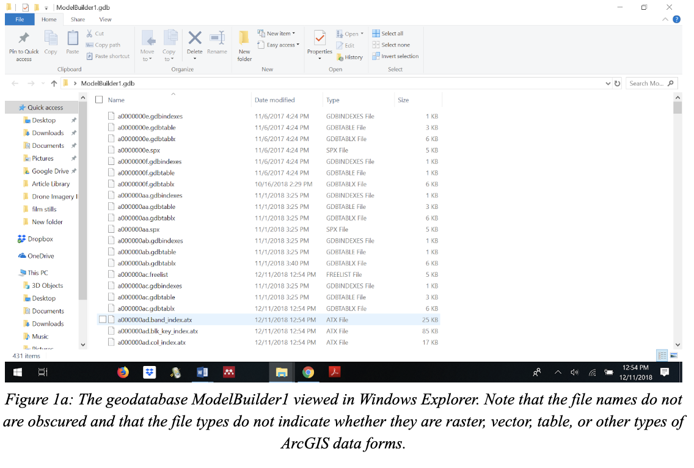

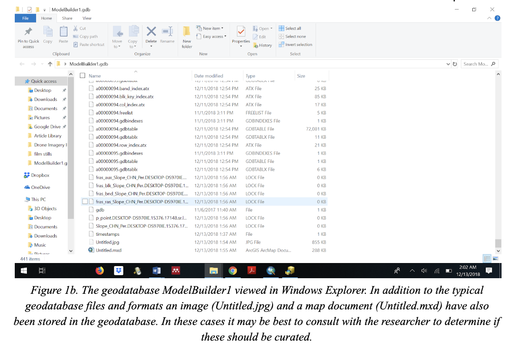

Additionally, although geodatabases are becoming more common among researchers as a way to manage their research data, geodatabases are restricted in the files they will store. Common data files created by researchers that cannot be stored in geodatabases include Layer files and TINS. It is important to ask the depositor if there are additional files outside of the geodatabase that are related to the project and important for curation.

ArcGIS Desktop (includes ArcMap, ArcCatalog, and as of 12/2018 the ability to install ArcGIS Pro)

The ESRI geodatabase is designed to work with all of ESRI’s ArcGIS products. ESRI’s original product suite with the capability to support geodatabases was called ArcGIS Desktop. This package included the programs ArcMap and ArcCatalog, both of which can be used to examine geodatabase structures and items. In 2015, ESRI launched a new product suite called ArcGIS Pro which combines ArcMap, ArcScene, and ArcCatalog into a single window interface. As of 2018, all of these products are still available for researchers to download and use from the ESRI website, however, please note that this will likely change in the future. ESRI has stated that it will focus on developing new versions for ArcGIS Pro only, and that ArcDesktop will be minimally maintained for the future. The following gives information for each product where it differs, but Pro is provided first since it will likely replace Desktop in the future.

These products will only work with Windows OS, so you must either be using a Windows computer or have a Windows partition if on a Mac. If you are trying to decide whether ArcPro or ArcDesktop should be used to view files consider the following: ArcPro will require a 64-bit processor while ArcDesktop requires 32-bit. Additionally, ArcGIS Desktop was designed to only use 4GB of RAM, so if you would like to check individual files within the geodatabase that are extremely large, ArcGIS Pro is better suited to this task. Finally, changes to how the ArcGIS Pro and ArcGIS Desktop are written requires any customization scripts to be uniquely written for each suite of software. If scripts are stored as toolkits within the geodatabase, it will be necessary to know which software was used to generate the toolkit.

_Website of this tool?_
- ArcGIS Pro:	 					https://pro.arcgis.com/en/pro-app/
- ArcGIS Desktop(includes ArcMap and ArcCatalog):	http://desktop.arcgis.com/en/arcmap/

_What does this tool do?_  
ArcGIS Pro can be used to view the individual 2D and 3D files in the database via the mapping window, as well as the number, names, sizes, and structures of all files through the integrated ArcCatalog toolbar. ArcMap can visualize maps in 2D and has an integrated ArcCatalog toolbar to view the individual files that make up the geodatabase. ArcCatalog can also be run separately from ArcMap, and in addition to providing the best overview of the geodatabase structure, will provide metadata on each file as well as previews of geodatabase maps.

_Who supports this tool?_
The Environmental Systems Research Institute (ESRI)

How can I get access to this tool?  
ESRI is a for profit company, and requires the purchase of licenses to run their software (https://www.esri.com/en-us/store). ESRI also offers a 21-day free trial of the softwares (https://www.esri.com/en-us/arcgis/trial). Finally, as part of their marketing strategy, ESRI is committed to providing universities with licenses to train students and faculty on the software. Licenses may therefore be available through your academic institution for personal computers or may be installed on computer workstations within the library.

_How do I use this tool?_

**ArcCatalog**
ArcCatalog is the most useful tool for reviewing the contents of a geodatabase. The program allows you to not only preview the files in the geodatabase as well as the representation of the data, but also provides metadata. To do so, launch ArcCatalog on your computer and then use the catalog tree to navigate to the geodatabase under review. Highlighting the geodatabase in the catalog tree will provide a list of all the contained files in the window to the right (See Figure 2).

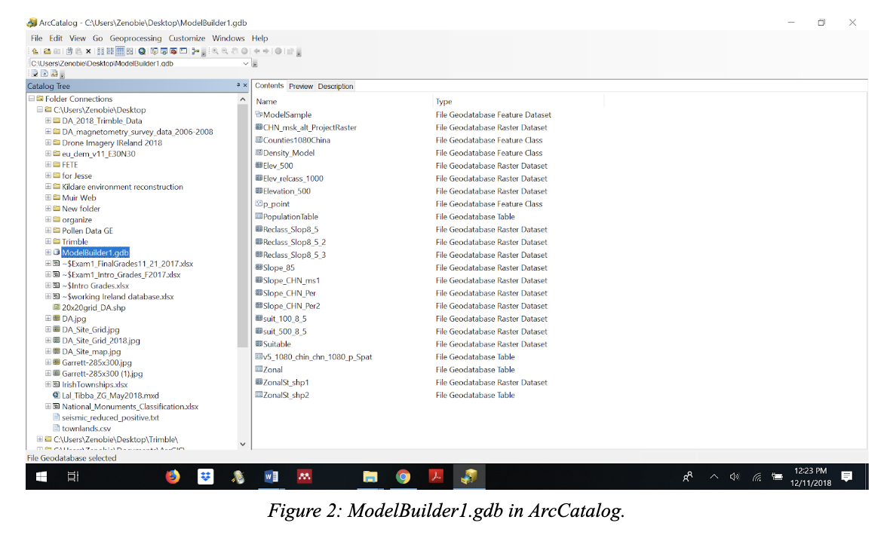

To examine the files within the geodatabase individually, click on the plus sign next to the relevant geodatabase in the catalog tree. This will expand the geodatabase and allow you to scroll through the individual files within it. When you highlight a raster, vector, or table in the catalog tree, an image of the data will appear in the preview pane on the right. You can use the preview pane to view the display of raster and vector files, or to explore the data in table files. Note that although the pane is called preview, you will be able to view the entire dataset contained within a file (raster, vector, or table). (See Figures 3a, 3b, 3c, 3d below for examples)

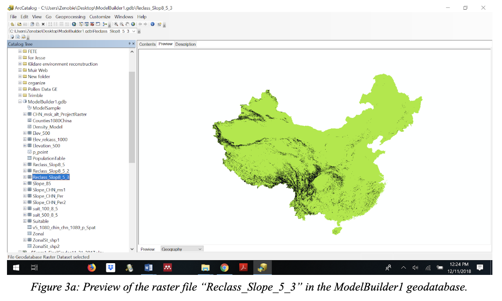

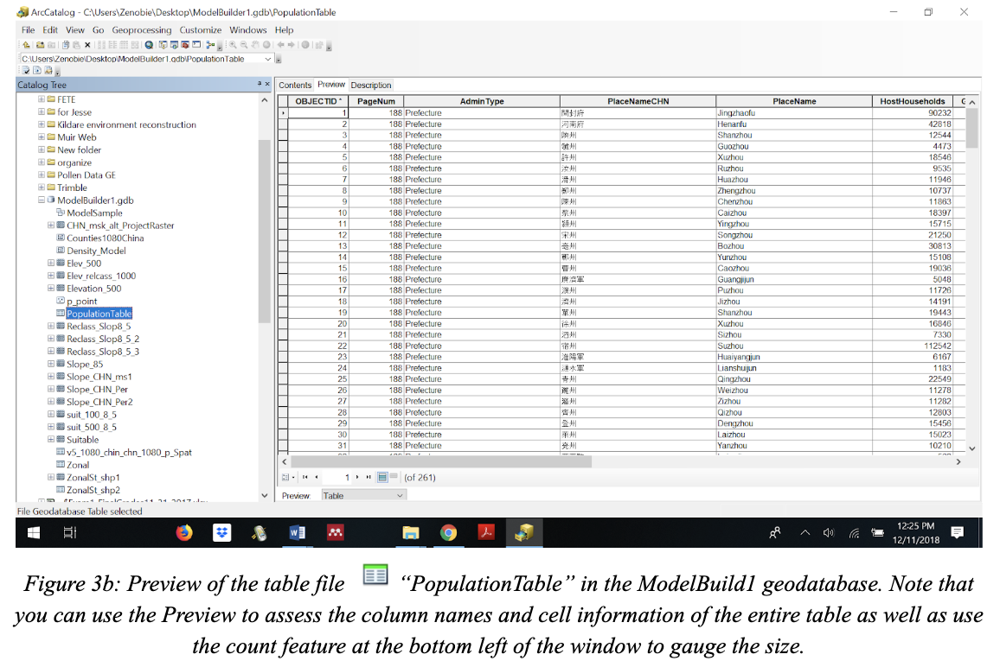

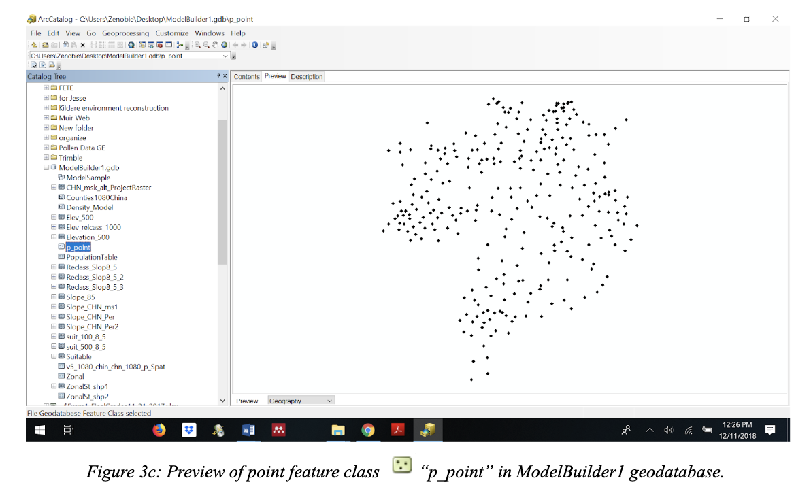

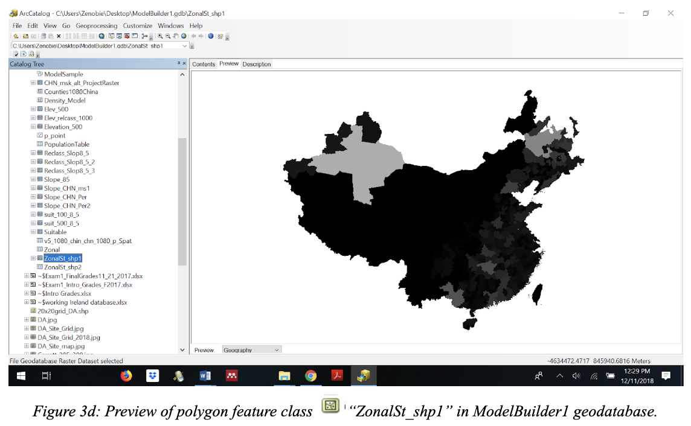

In addition to previewing the data, ArcCatalog allows you to easily see the metadata associated with each file and add more if needed (see Figure 4). To review the metadata for an individual file, click on the description tab on the right window. This will bring up the metadata screen and allows you the option to print, edit, or import additional data. ArcGIS provides six different metadata styles. These are: FGDC CSDGM Metadata, INSPIRE Metadata Directive, ISO 19139 Metadata Implementation Specification, ISO 19139 Metadata Implementation Specification GML3.2, Item Description, and North American Profile of ISO19115 2003. The default in ArcGIS is File Description which provides a simple overview of the data. However, other styles may contain more information on the file. If you would like to change the metadata style go to Customize>ArcCatalog Options and then choose the Metadata tab in the pop up window. To learn more about the different metadata styles see the ArcGIS help page http://desktop.arcgis.com/en/arcmap/10.3/manage-data/metadata/metadata-standards-and-styles.htm or see the Metadata section below.

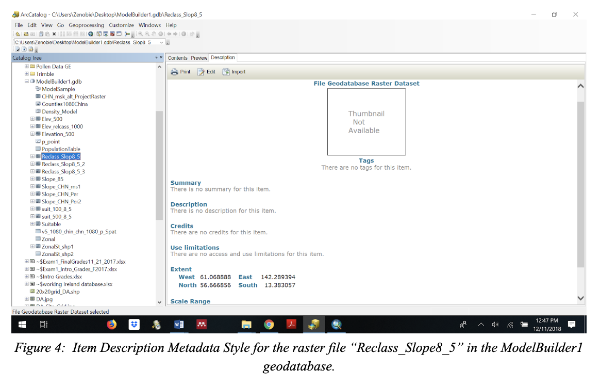

NOTE: While ArcCatalog is the preferred method for assessing a geodatabase there are some files that can be stored within a geodatabase that cannot be previewed in ArcCatalog. These include models, scripts, and toolboxes. To assess these items, you will need to use ArcMap or ArcPro (see below). It is recommended that you begin with ArcCatalog to get an overall view, and then use ArcMap to examine specific files in detail.

**ArcMap and ArcPro**
ArcMap and ArcPro can also be used to view the individual files within a geodatabase. This option requires you to open the individual files which requires additional time and processing power. Additionally, the ArcMap and ArcPro windows do not provide easy access to the metadata of each file. For these reasons, it is recommended that if possible ArcMap and ArcPro only be used to explore individual files more thoroughly after an overall assessment has been made in ArcCatalog. However, in some cases, such as models, scripts, and toolboxes, you will only be able to open and run them in ArcMap or ArcPro.

There are two ways to add data to an ArcMap or ArcPro window.
1.      Use the Add Data button located at the top. Alternatively, you can right click on Layers in the Table of Contents on the left-hand side of the screen and choose Add Data. The Add Data window will appear. Navigate to the geodatabase and then choose the files that you would like to add. Note that you can use shift and the arrow keys to highlight and add multiple files at once. This may not be advisable if the files are very large as they will take time to render in the program. Additionally, although you may highlight everything within the geodatabase toolboxes, scripts, and models will not be automatically added and you will receive no message that they have not. (see Figure 5 for an example of the Add Data window)

2.      You can open a window within ArcMap or ArcPro that provides access to ArcCatalog. This is a limited version of ArcCatalog and will not provide the preview or metadata functions. Within the ArcCatalog window navigate to the geodatabase and click on the plus button to expand it. You can then drag and drop files into the main window or in the Table of Contents window to add them. You can use the shift and arrow keys to highlight multiple files and add them as a batch, however the same rendering issues apply. (see Figure 6 for the ArcCatalog access)

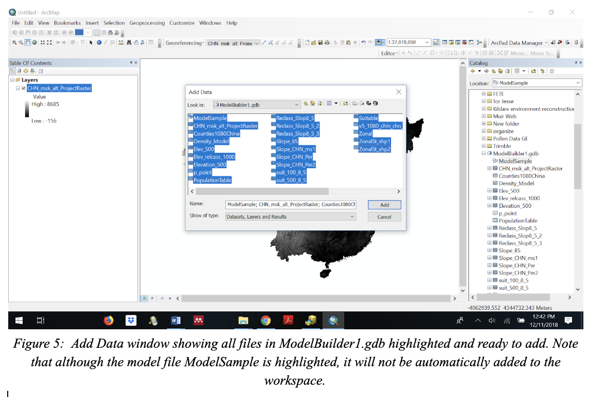
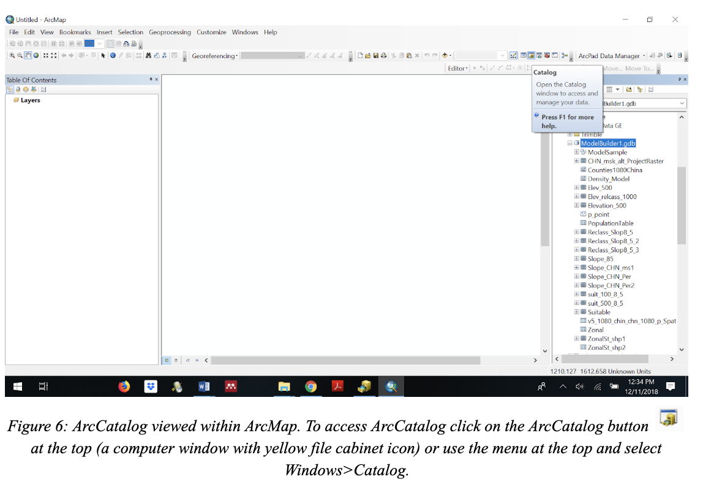

Proficient ArcGIS users will often use models, scripts, and toolboxes to customize their workflows and to automate processing and analyses. To explore these special data types you will need to open these and run them individually. If these files are included it may be best to ask the depositor how they function and the expected results to make sure you can accurately assess if they work. Figures 7a, 7b below provide an example of opening a model from within a geodatabase. **IMPORTANT:** Do NOT run models, toolboxes, or scripts until you check what the name(s) of the output file(s) are. These tools are used to automate tasks and often involve manipulating multiple data files and creating outputs. It is possible that running these tools will overwrite a file or files already in the geodatabase. You may consider changing the location of the output files or creating a copy of the geodatabase and using the copy to test the model while retaining the original for archiving.

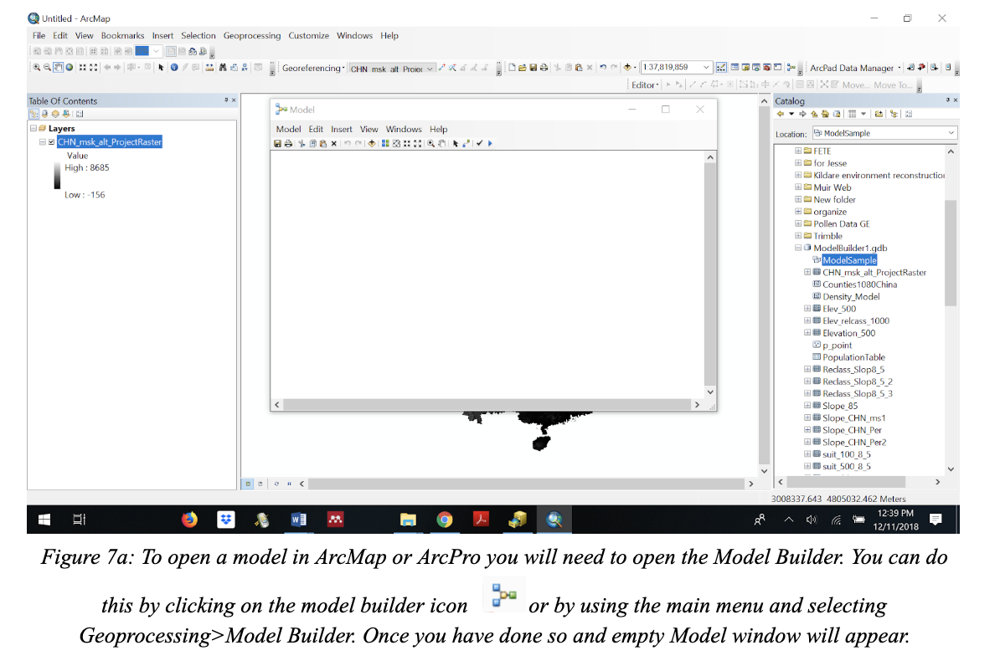
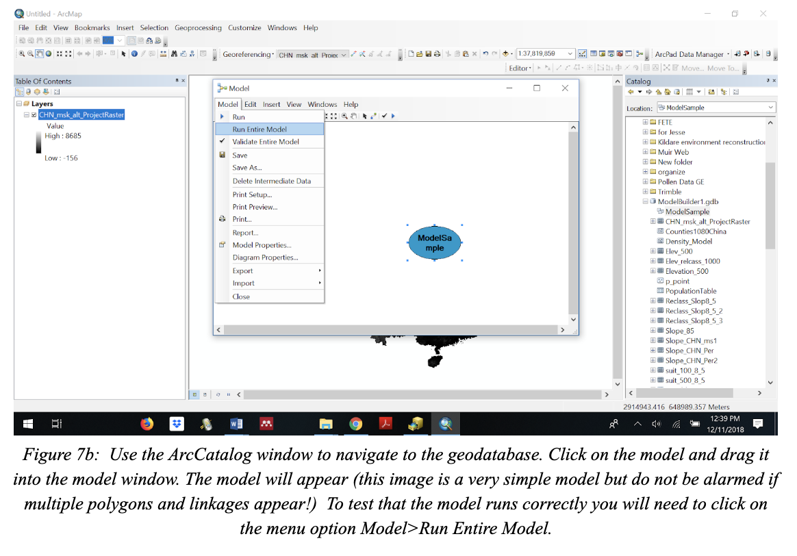

**QGIS**

_Website of this tool?_
https://www.qgis.org/en/site/ 	

_What does this tool do?_  
QGIS is free and open-source desktop GIS application. It is operating system agnostic so can be run in Windows, Mac, or Linux. QGIS allows for the viewing, editing, and analysis of vector and raster geospatial data.

QGIS supports shapefiles, coverages, personal geodatabases, dxf, MapInfo, PostGIS, Web services, etc

_Who supports this tool?_
QGIS Development Team

_How can I get access to this tool?_
QGIS is available as a free download from https://www.qgis.org/en/site/. It’s important to view the readme file in the installation package because installation in the wrong order will inhibit full functionality. Instructions vary by platform.

_How do I use this tool?_

To view open a Geodatabase in QGIS:

To open a geodatabase in QGIS, be sure to choose

1. "Add vector layer",

2. ”Source Type = Directory"  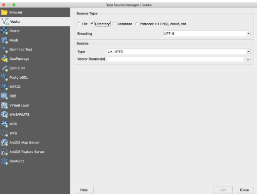
3. Navigate to and source should be either "OpenFileGDB" or "ESRI FileGDB".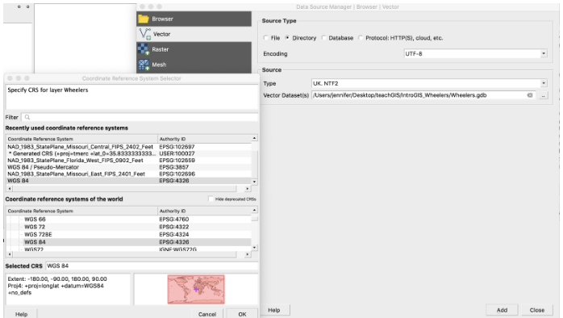
4. Click add
5. Select the coordinate system
6. Choose the layers to open
7. Select coordinate system.
Note: each layer in the geodatabase can either be added one by one, or you can select multiple to add at one time.

**Reviewing attribute information in a feature layer**
Vector data is made up of features (the shapes you see on the map) and attributes (the information associated with those features). In QGIS you can view this attribute information by:
1. Using the identify tool to click  on a feature and review its attributes
2. Right click on the feature layer in the contents pane and open attribute table.

**Reviewing metadata**
Many of the tools needed to understand the underlying information about a layer is accessible through the properties menu, including metadata, Coordinate Reference System (CRS) and source fields. You can access the properties by right clicking on a layer and selecting properties.

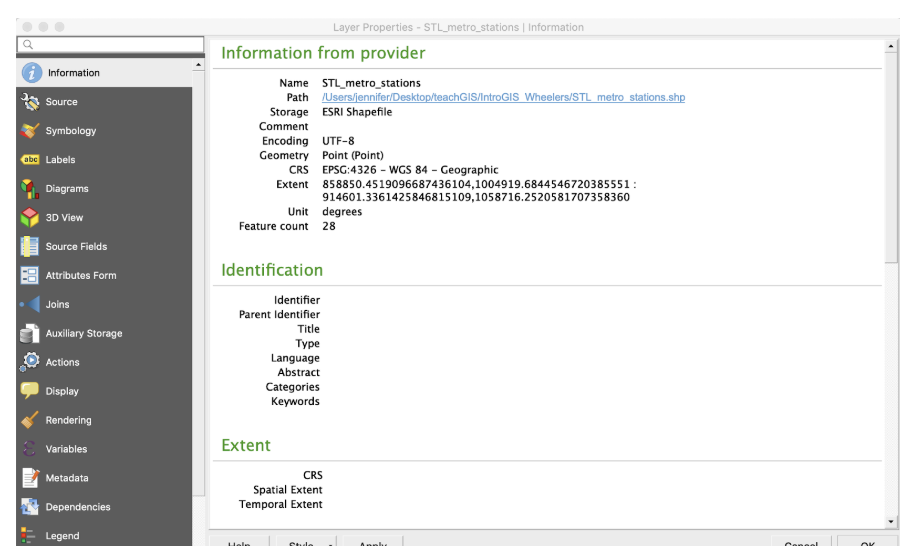

# Metadata

## Geospatial Metadata Standards

The two most common standards for geospatial metadata (which encompass geodatabases) are typically referred to as ‘ISO 191xx’ and ‘FGDC CSDGM’. The first is the creation of the International Organization for Standardization (or ISO, meaning ‘equal’ in Greek, rather than being an acronym), and is increasingly becoming the predominant worldwide standard for geospatial metadata. The ISO 191xx series of standards includes ISO 19115, the content standard for geographic information metadata; ISO 19110, the content standard for describing the features (entities and attributes); and ISO 19139, the XML schema implementation of geographic information metadata.

The second is the Content Standard for Digital Geospatial Metadata (CSDGM) developed by the United States Government’s Federal Geographic Data Committee (FGDC). United States federal government datasets typically use this standard, though the FGDC does endorse the use of ISO 191xx standards. This standard is being used less and less outside of the federal government as the ISO standards become more prevalent.

While the ISO 191xx and FGDC CSDGM standards differ in organization and element requirements, the two content standards are fairly similar. In addition to core metadata elements typically required or recommended by repositories (e.g. title, creator, date, subject, description, rights, etc.), both standards require the following elements for geospatial materials:

- bounding box
- geographic location (place keywords)
- spatial representation type (vector, raster, etc.)
- projection/coordinate system

Most researchers are either unaware of these standards or have limited knowledge of them. It is therefore rare to find research data with complete metadata following these standards.

## Viewing and Exporting Metadata

The metadata section above describes how to access and edit metadata in ArcCatalog. To view metadata using the ISO 191xx style, go to Customize>ArcCatalog Options and choose the Metadata tab in the pop up window, then select ISO 19139 Metadata Implementation Specification. (The North American Profile of ISO 19115:2003 is still in development and is not widely used, nor is the ISO 19139 Metadata Implementation Specification GML3.2.)  Alternately, you can select FGDC CSDGM Metadata to view metadata in that standard.

Geodatabases store metadata in the Esri format in an internal file. Adjusting the view will show the metadata according to a particular standard, but the metadata file itself is not changed to that standard’s schema. In order to create ISO 191xx or FGDC CSDGM compliant metadata files, the metadata must be exported by clicking on the Export button. This creates a separate XML file that is stored external to the geodatabase. Note that exporting metadata using Esri’s ISO 19139 translator only includes elements within the ISO 19115 content standard, omitting field (entity and attribute) information that falls under ISO 19110.  

## Metadata Completeness

One way to determine the completeness of metadata is to view the metadata in ArcCatalog by selecting the feature class in the Table of Contents and click on the Edit button in the Description tab. The ArcCatalog interface provides a breakdown of metadata elements into sections. A red ‘X’ will appear in the icon’s lower right corner for a section which contains missing required elements according to the metadata format selected. Click on the icon to go to that section. At the top, a list of missing elements will appear (see Figure 8).  

While it is technically possible to create a metadata file for the geodatabase as a whole, the software and some metadata elements do not lend themselves well to describing the entire geodatabase. Whereas geodatabase metadata provides a collective overview of the entire dataset, feature class metadata can more specifically describe the relevant subject, geographic location, projection, data type (e.g. vector), methodology, etc. of an individual feature class. Therefore, metadata is most likely found only at the feature class level.

Several elements are populated automatically by the software, including bounding box, spatial representation type and projection/coordinate system. However, this only applies to individual feature classes within geodatabases. As geodatabases are containers for files, they do not inherently have bounding boxes and projections that can be ascertained by the software, and may have more than one spatial representation type. ArcCatalog does allow for manual entry of these elements if one wants to record that information. Geographic location (place keywords) must be entered manually in all cases; thus it is recommended that if this is missing, it is added to the metadata file. This lack of automatic propagation often results in inconsistent or incomplete metadata.

The ArcCatalog metadata editor demonstrates the complexity and extensiveness of geospatial metadata standards. It is unrealistic to expect researchers to record information for all of the metadata elements. However, even if required ISO191xx or FGDC metadata elements aren’t mandatory for upload into a repository, the end user benefits from having at least the requirements mentioned above.

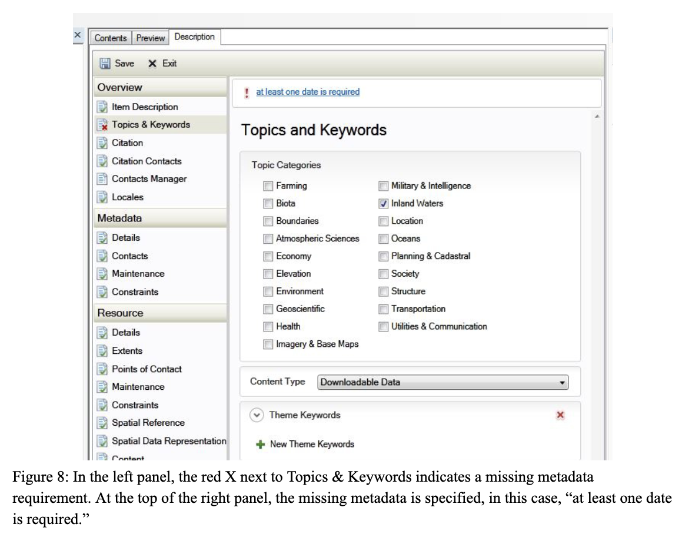

## Other Metadata Schemas

GeoBlacklight and OpenGeoPortal, two emerging, open-source web applications that provide solutions for contextual geospatial data discovery, detailed layer previewing, and data downloads across multiple formats, have developed a simpler approach to authoring and maintaining geospatial metadata. In particular, the GeoBlacklight 1.0 Metadata Schema acknowledges that full-scale geospatial metadata like the ISO 191xx series and FGDC do not crosswalk well with underlying platforms and search indices required for discovery catalogs, particularly Apache Solr. Furthermore, the communities behind GeoBlacklight and OpenGeoPortal have acknowledged that the proliferating array of geospatial data formats and standards makes it difficult to collect, curate, and present data as durable digital library assets.

The GeoBlacklight 1.0 Metadata Schema accommodates the presentation of full-scale metadata but is itself a lightweight schema that is expressed as .JSON documents. There are several strategies for transforming XML metadata into GeoBlacklight, most notably GeoCombine. GeoBlacklight does not necessarily require full standard metadata to exist so that it can be converted; rather curators are also encouraged to create GeoBlacklight metadata from scratch, when possible, to facilitate discovery with the GeoBlacklight interface.

In the instance of geodatabases, curators may wish to create an individual record for a geodatabase, or they may transform each layer within a geodatabase into discrete shapefile layers. The advantage of doing this is to enable live web previews of the data via Geoserver, which is currently not possible to do with a geodatabase. See this sample record: https://github.com/geoblacklight/geoblacklight/blob/master/spec/fixtures/solr_documents/baruch_ancestor1.json.

# Preservation actions
| What are the issues surrounding a researcher’s choice to use a geodatabase for archival purposes?*|     |
| :------------- | :------------- |
| Geodatabase Benefits      | (1) Has a number of features to optimize rendering that uses less processing power (2) Has a number of features to minimize storage needs allowing researchers to store more files for less bytes (important for storage and economic reasons) (2.1) Lossless compression that can be undone (3) Keeps files together for easier migration|
| Geodatabase Challenges     | (1) .gdb is a proprietary ESRI format  (1.1) May not be supported in future (1.2) Cannot be read by a wide variety of programs (2) Not all repositories support .gdb archiving (3) Not all files associated with a project can be stored in a .gdb format|

*Sources: https://www.esri.com/news/arcuser/0309/files/9reasons.pdf*

**Preservation strategy for the geodatabase & recommendations for transformations**
Geodatabases are a proprietary format created by ESRI. While QGIS can open them, most other GIS analysis tools cannot. It should be noted that while ESRI is the industry leader in GIS software and in heavy use, other ESRI formats have already become obsolete. It is therefore recommended, where possible, to export files within a geodatabase to formats documented as suitable for long-term preservation.  In these cases, it is recommended that both the geodatabase and the conversion files are kept and documented in an accompanying README file.  Below are transformation recommendations and guidelines for the major types of files within a geodatabase.

  **Shapefiles** 
  Shapefiles are the most persistent geospatial vector format thus far and so transforming a feature layer from a geodatabase to a shapefile may be a good idea. However, though they are ubiquitous and many softwares can open them, they are still technically proprietary. Note: shapefiles are not able to hold as many columns as a geodatabase feature layer. Another option to explore is exporting the feature layer to a CSV, which is very doable for point data, but note that for polygons and lines information could be lost. A good idea is to keep the geodatabase and do the shapefile and csv conversions.

  **Feature classes to shapefiles**  
  Please note: shapefiles are made of several files that depend on each other so must be packaged together

  **In ArcMap**  
  1. Right click on layer in Catalog pane
  2. Export
  3. Shapefile (single or multiple)

  **In QGIS**  
  1. Open layer in QGIS
  2. Right click on the layer
  3. Export
  4. Save feature as ESRI Shapefile

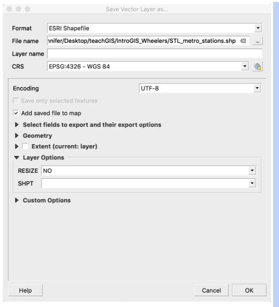

  **Feature classes to tables**  
  It is possible to extract the feature information to table including lat/long, but often times the latitude and longitude are not displayed in the table and require an extra step. This is a great solution for point feature classes, but more problematic for polygons and lines, because the integrity of the geometry can’t be maintained. Often times the latitude and longitude
  are not displayed in the table.

  **In ArcMap**  
  1. Bring feature class into project workspace
  2. Right click on feature class in table of content
  3. Open Attribute table
  4. Add field
  5. Type = double
  6. Name = longitude
  7. Right click on new field
  8. Calculate geometry
  9. X coordinate
  10. Use dataset’s coordinate system
  11. Add another field for latitude (Y)

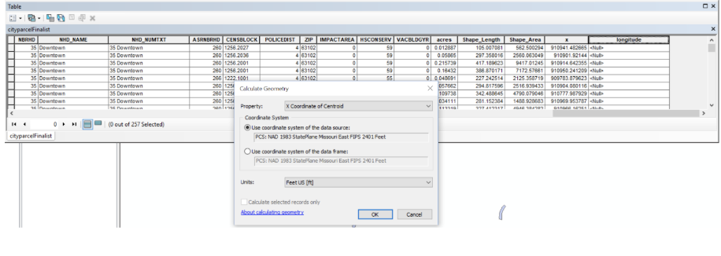

  12. Search for “Table to Excel”
  13. Open tool
  14. Choose feature class with added fields as input
  15. Navigate to preservation folder for output
  16. Export
  17. Open in Excel and save as CSV

**In QGIS** 
  1. Open layer in QGIS
  2. Right click on the layer
  3. Export
  4. Save feature as Comma Separated Values (CSV)
  5. Geometry (as XY, may vary)
  6. OK

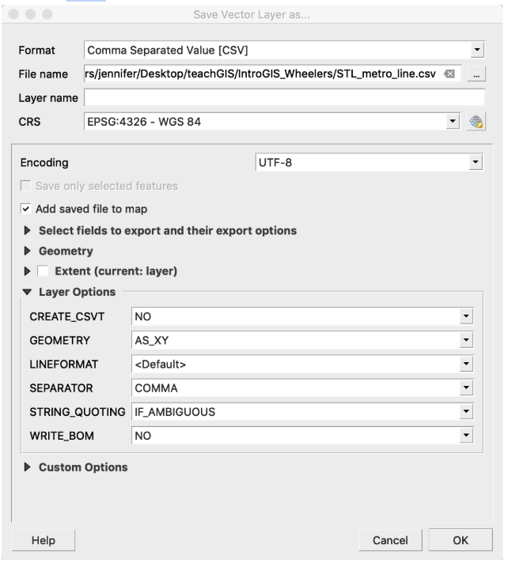

  **Tables to tables** 
  Tables can also be directly exported from a geodatabase.

  **In Arcmap**
  1. Search for “Table to Excel”
  2. Open tool
  3. Choose feature class with added fields as input
  4. Navigate to preservation folder for output
  5. Export
  6. Open in Excel and save as CSV

**In QGIS**
  1. Open layer in QGIS
  2. Right click on the layer
  3. Export
  4. Save feature as Comma Separated Values (CSV)
  5. OK

**Raster files** 
Raster files should be exported to TIFF formats.  When exporting the raster all the original data set settings should be used (do not, for example, use the current dataframe to define raster export parameters.) It is recommended that if rasters are stored as a Mosaic Dataset or in a Raster Catalog (older formats) that these rasters be individually exported and stored.  Raster Catalogs are an obsolete format and have since been replaced by Mosaic Datasets.  As such, they are not ideal for long-term storage.  Mosaic Datasets, while increasing performance and visualization, are not ideal for storage since they create an additional set of files/folders that significantly increase the amount of storage space required.  Additionally, the creation of new files/folders adds additional curation data that can be lost in the long term.

**Tables**  
Tables (that do not contain geometry information) should be exported to .csv formats (see Tables to Tables above).  Any joins or relates connected to these tables will be maintained during export of feature classes to shapefiles.  However, if possible it is useful to document the join/relate relationships in an accompanying README file and to check the data transformation within the shapefiles.  

**Models/Python Scripts** 
Models within ArcGIS can be saved as ArcToolboxes which converts the model into a Python script. In ArcMap and ArcCatalog, it is possible to right-click on a Model and export it to either a graphic or a python script.  For purposes of data curation, it is recommended that the original model is kept, along with exports of the model to both a python script and an image capture to understand how the model was built and the relationship created amongst the various geospatial layers and processes.  The exported script should be checked to make sure sub-processes within the model are captured.

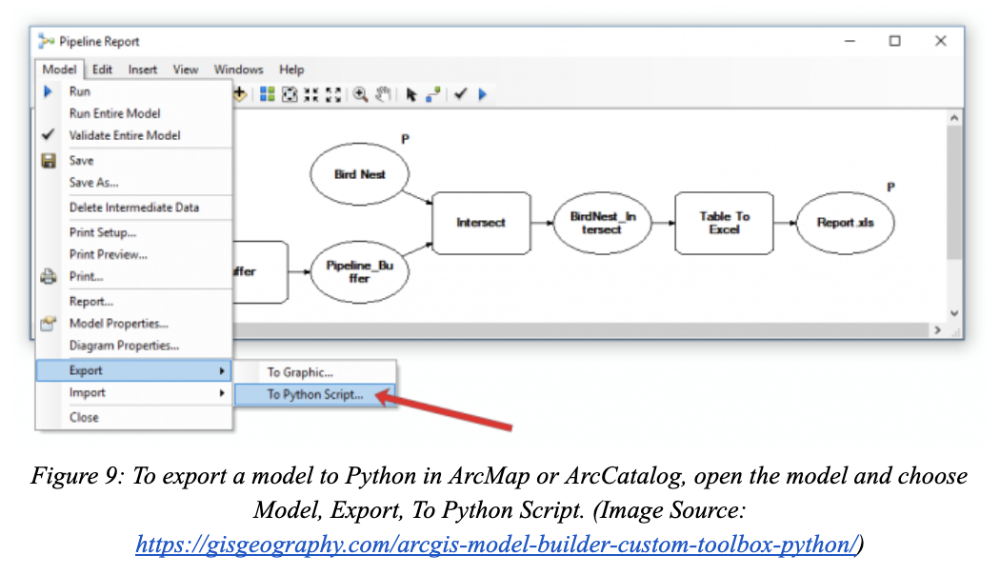

In ArcGIS Pro, the ability to export a model to python script has been removed.  This was due to the inability of the function to accurately capture model information.  ESRI recommends the following work arounds.  (4)

- Start by building and saving a model, then create a new Python script file (which is just a text file with .py extension), then using a text editor or Python IDE add lines to the new script to import arcpy, import the toolbox containing your model, and finally run the model. Now when you run the Python script (double click the .py file from Windows explorer, or execute it from Task Scheduler) it is actually running your model. (4)  

    - import arcpy  
    - arcpy.ImportToolbox(r"c:\pathtotbx\Toolbox.tbx", "mytools") 
    - arcpy.MyModel_mytools(r"c:\modelinputs\Data.gdb\InputFeatures") 

- In ArcGIS Pro you can copy the Python syntax for any geoprocessing tool you have run. Go to Project>Geoprocessing History, right-click any tool, and select Copy Python Command to copy the exact Python syntax needed to run the geoprocessing tool with the same parameter settings previously used. (4)

**Preservation strategy if geodatabase archiving is not supported** 

*What to look for to make sure this file meets FAIR principles*
Adequate documentation of the geodatabase should be provide. This will  include:
- Embedded XML data
- All feature layers provenance information (original source, derivatives, etc.)
- Fields and variables described to the fullest extent possible
- If there are relationships between layers, there should be a diagram of the model provided
- Map images of each spatial layer

*Unresolved Issues/Further Questions [for example: tracking provenance of data creation, level of detail in dataset]*
Documentation of curation process: What do capture from curation process
- Software used to evaluate
- Questions raised in check process
- Communications with researcher
- Embedded metadata
- Transformations

# Bibliography
Cited in Text
1. ESRI. 2018. “A comparison of geodatabase types.” Accessed November 7, 2018.
http://desktop.arcgis.com/en/arcmap/10.3/manage-data/geodatabases/a-comparison-of-geodatabase-types.htm

2. ESRI. 2018. “Feature class basics.” Accessed November 7, 2018.
http://desktop.arcgis.com/en/arcmap/10.3/manage-data/geodatabases/feature-class-basics.htm

3. ESRI. 2018. “A quick tour of the geodatabase.” Accessed November 7, 2018.
http://desktop.arcgis.com/en/arcmap/10.3/manage-data/geodatabases/a-quick-tour-of-the-geodatabase.htm

4. GeoNet. 2019.  “What happened to Export Script button in ArcGIS Pro?” Accessed February 2, 2019.  https://community.esri.com/thread/163291

**Additional Useful Sources**  
ESRI. 2018.”What is a geodatabase?” Accessed November 7, 2018.
http://desktop.arcgis.com/en/arcmap/10.3/manage-data/geodatabases/what-is-a-geodatabase.htm

Federal Geographic Data Committee. 2018. “Content Standard for Digital Geospatial Metadata.” Accessed February 3, 2019. https://www.fgdc.gov/metadata/csdgm/

Federal Geographic Data Committee. 2018. “ISO Geospatial Metadata Standards.” Accessed February 3, 2019. https://www.fgdc.gov/metadata/iso-standards
