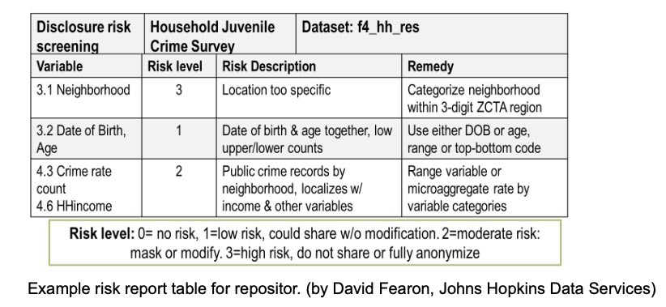

# Human Participants Data Essentials

## Overview

|   Topic   |   Description  |
| :------------- | :------------- |
|Primary fields or areas of use|Any research on information or physical samples taken from human beings that is either subject to IRB or other regulatory approval, used consent forms, or where the data presents ethical quandaries due to human subjects content.

Example fields: <ul><li>**Health Sciences:** Clinical, Public Health, Neuroscience, Biomedical Engineering <li>**Behavioral and Social Sciences:** Psychology, Sociology, Demography, Economics, Anthropology, Education, Social Work, etc. |
|Key questions for curation review|<ul><li>Is there indication the research was governed by a review board (e.g., institutional, community, tribal) or other regulatory protocol? <li>Is there a copy of the consent form included with the data? <li>Is the data de-identified in consideration of both direct and indirect identifiers? <li>Are other peripheral means of re-identification removed?|
|Metadata-specific considerations |The level of detail in the metadata (or any lack of clarity that impedes understanding what metadata are present) may increase disclosure risk. Some datasets may also include hidden or embedded metadata (e.g., geolocation on images) that constitute a disclosure risk. See Brief Introduction to Identifiers and Communicating about De-identification with a Depositor, below.|
|Context-specific considerations|<ul><li>Consent Form Review <li>Screening for De-identification <li>Suggesting Changes with Depositor|
|Tools for curation review|<ul><li>[ARX Data Anonymization Tool](https://arx.deidentifier.org): Full-featured freeware for statistical risk assessment and anonymization. Requires knowledge of techniques.<li>[The sdcMicro package in R](https://cran.r-project.org/web/packages/sdcMicro/) includes disclosure control and cell suppression techniques for tabular data.<li>[PARAT Core](https://privacy-analytics.com/health-data-privacy/health-data-software/eclipse-risk/) (Privacy Analytics Eclipse): Commercial service for risk analysis and anonymization oriented to structured medical records.Typically for an institutional subscription.<li>[Spirion.com](https://www.spirion.com): For fee. Covers only direct identifiers at enterprise network level. Not recommended.<li>[NLM-Scrubber](https://scrubber.nlm.nih.gov): Highlights direct identifiers and typical medical identifiers for redaction. ASCII text input.|
|Date Created|March 2, 2020|
|Created by|<ul><li>Jenn Darragh, Duke University<li>Alicia Hofelich Mohr, University of Minnesota<li>Shanda Hunt, University of Minnesota<li>Rachel Woodbrook, University of Michigan<li>Dave Fearon, Johns Hopkins University<li>Jennifer Moore, Washington University in St.Louis<li>Hannah Hadley, Pennsylvania State University|
|Version|2.0|

**Suggested Citation:** Darragh, Jen; Hofelich Mohr, Alicia; Hunt, Shanda; Woodbrook, Rachel; Fearon, Dave; Moore, Jennifer; and Hadley, Hannah. (2020). Human Subjects Data Essentials Data Curation Primer. [Data Curation Network GitHub Repository.](https://github.com/DataCurationNetwork/data-primers)

_This work was created by the Data Curation Network’s curator subgroup (Human Subjects Interest) with the assistance of the Data Curation Network’s education coordinator._

# Table of Contents

[Summary](#summary)

[Introduction to Human Subjects](#introduction-to-human-subjects)

[Key Questions to Ask Yourself](#key-questions-to-ask-yourself)

[Brief Introduction to Consent Review and Communicating about Informed Consent with a Depositor](#brief-introduction-to-consent-review-and-communicating-about-informed-consent-with-a-depositor)

[Brief Introduction to Identifiers and Communicating about De-identification with a Depositor](#brief-introduction-to-identifiers-and-communicating-about-de-identification-with-a-depositor)

[Steps for Screening De-identified Data for Remaining Risk](#steps-for-screening-de-identified-data-for-remaining-risk)

[Next Steps](#next-steps)

[Other Considerations](#other-considerations)

[Glossary of terms](#glossary-of-terms)

[Bibliography and Further Reading](#bibliography-and-further-reading)

[Appendix A Links to sources on de-identification](#appendix-a-links-to-sources-on-de-identification)

[Appendix B Links to sources on consent documentation](#appendix-b-links-to-sources-on-consent-documentation)

[Appendix C Human Participant CURATED checklist](#appendix-c-human-subjects-curated-checklist)

# Summary

**This primer is intended to assist curators with identifying sensitive content that may be present in human subject data. It is not a complete guide to de-identification. However, it covers basic considerations for avoiding inappropriate identity disclosure and provides explanations for restricting content that can be discussed with data depositors.** Particular emphasis is given to understanding documents that should accompany this data, such as consent forms. This primer may also help curators identify data that are more appropriate for a restricted-access repository and/or cannot be accepted into an open access repository for public distribution. Additionally, it may be useful for restricted access repositories that require partial de-identification, often to [HIPAA "limited dataset" or "Safe Harbor" level."](https://www.hhs.gov/hipaa/for-professionals/privacy/special-topics/de-identification/index.html) The laws and regulations mentioned in this primer are primarily situated within the U.S. context. The ethical considerations discussed may be broader and apply across jurisdictions, although some will be context or culture-specific.

Additionally, this primer from here forward will refer to humans participating in research as "human participants". "Human subject" research is the phrase used by many legal entities, such as the Department of Health and Human Services and Institutional Review Boards, to refer to non-anonymous and non-aggregated data with individual humans as their topic. The term , "human subject" insinuates that research participants are acted upon / manipulated rather than acknowledging that research participants are autonomous members of the research team. The discourse on this matter is active, and you can read more about it on the Amp&rsand blog (Hurley, 2019).

# Introduction to Human Participants Data

This primer, when referring to human participant data, regards information gathered from or about living people, or information about living people that is not considered knowable, or is non-public, or private. This definition is intentionally broader than the regulatory definitions of "human subject" from the Food and Drug Administration (FDA) and Department of Health and Human Services (DHHS) that are commonly used by the IRB. This is to ensure that data considered not human participant research by the IRB or gathered for administrative purposes are also evaluated before being shared in a repository.

_Examples of human participant data:_

- Survey data
- Interview data
- Images or audio of humans
- Data collected about humans from Internet sites
- Biological, behavioral, or health measures that could distinguish certain participants.

Evaluating human participant data introduces unique considerations and responsibilities regarding privacy and disclosure. Data disclosure risk can be defined as the amount of potential there is for a participant’s identity to be discovered and shared without their explicit permission. The amount of risk is lowest when the data do not contain any direct identifiers and the information collected could be considered benign - as in, it poses no reputational or financial risk, nor potential for prosecution.

Removing direct identifiers is only part of how inappropriate disclosure can be avoided. There are times when data are collected from a small or particular sample (not randomized), geographically limited or geographically specific (intended for geospatial analysis), contain several detailed demographics (age, race, sex, household size, military status, etc.), or collect information on illicit behaviors or taboo opinions. Even when data are stripped of direct identifiers, there might be enough details present (also known as quasi-identifiers or indirect identifiers) to link a participant’s identity with their data. In these cases, the data are not distributed openly for re-use, but are often housed in repositories that can provide mitigated access for qualified researchers who apply to use it.

Although the central considerations for ethics in research conducted with human participants, the Belmont principles (respect for persons, beneficence, and justice) are primarily discussed in reference to individuals, it is also important to acknowledge that there are potentials for community-level as well as individual harm, and community-level identifiers have the potential to be problematic even when individuals may not be identifiable (Ross, 2018). Community-level harms can be physical, psychological, social, economic, legal, or relational (FNIGC, 2014).

_Example of community-level harm:_

Sometimes governments or private companies share or sell individually de-identified health data such as pharmaceutical claims (FNIGC, 2014) or metadata about mental health services (Osberg, 2020) to third parties who may use this information for their own research, marketing, or advertisement. This creates ethical problems when communities may receive different information or be targeted in specific ways based on group membership or other indicators.

[The CARE Principles for Indigenous Data Governance](https://www.gida-global.org/care#:~:text=The%20CARE%20Principles%20for%20Indigenous%20Data%20Governance%20are%20people%20and,Indigenous%20innovation%20and%20self%2Ddetermination.) were developed to mitigate the potential for community harms (Research Data Alliance International Indigenous Data Sovereignty Interest Group, 2019): “Existing principles within the open data movement (e.g. FAIR: findable, accessible, interoperable, reusable) primarily focus on characteristics of data that will facilitate increased data sharing among entities while ignoring power differentials and historical contexts. The emphasis on greater data sharing alone creates a tension for Indigenous Peoples who are also asserting greater control over the application and use of Indigenous data and Indigenous Knowledge for collective benefit.”

# Key Questions to Ask Yourself

At each step in the curation process, it is important to be cognizant of ethical as well as regulatory considerations. While regulatory guidelines (such as from the IRB or HIPAA) provide some guidance to ensure data are shared without violating participant privacy, these regulations do not cover all cases you may encounter as a curator. For example, research determined NOT to be human participant, exempt IRB studies, secondary data analyses (originally human participant), web scraping, or administrative data could all contain disclosure risks. Reviewing human participant data submissions to a repository is contextual and will depend on the research, institution (including repository terms of service), discipline, norms, and participant expectations. With that in mind, some key questions for curators to ask include:

#### Is there indication the research was governed by a review board (e.g., institutional, community, tribal) or other regulatory protocol?
- Is there documentation of the requirements of this agreement included with the deposit? This could include community-level agreements on data collection, management, and/or sharing.

#### What was the consent process?
- Was a consent form, participant information sheet, or other participant agreement used during data collection?
  - Seek this information in the documentation provided by the researcher with the dataset.
  - If the form itself is not included, we encourage requesting it (as with other standard documentation), or even requiring its submission.
  - Are there any other indications of how participant information will be used in other documentation of the dataset? (Focus group transcript, questionnaire, etc.?). Do they contradict consent documentation?
- Institutional or repository policies may differ, from simply storing the consent form as documentation to assessing its content. We suggest a minimum standard of checking that there is no language explicitly stating the data will not be shared. If vetting the consent form, see the section on “Brief Introduction to Consent Review,” below. Be sure to work with the depositor and involve their IRB and compliance offices whenever in doubt about permissions for releasing data.

#### Is any directly identifiable information present in the data?
- The [HIPAA privacy rule](https://privacyruleandresearch.nih.gov/pr_08.asp) is a good standard to follow when looking for direct identifiers, even if the data are not necessarily subject to the HIPAA privacy rule. However, be aware that these regulations were created in the 1990s, when information moved very differently than it does today, and there is evidence that even medical data de-identified to current HIPAA standards may expose patients to re-identification risks (Yoo, 2018).
- For qualitative data, any video or voice recordings are considered inherently identifiable.

#### Are there any indirect (quasi) identifiers present in the data?
- See “Brief Introduction to Identifiers” section below for more details and examples.
- ICPSR has a page on [Confidentiality](https://www.icpsr.umich.edu/web/pages/datamanagement/confidentiality/) that also defines indirect (quasi) identifiers.

#### Is enough context (documentation, metadata, etc.) included to allow full understanding of the data’s limitations or uncertainty, and determine responsible re-use?
- Is there a data use guideline or agreement?
- Is there enough information to determine that included variables do not include direct or indirect (quasi) identifiers?
- Is there any potential embedded metadata that could create additional disclosure risk for participants? (For example, geolocation information for images, tracked changes, hidden columns in Excel spreadsheets, or externally or internally linked files. See primers such as those on [NVivo](https://github.com/DataCurationNetwork/data-primers/blob/master/NVivo%20Data%20Curation%20Primer/NVivo-data-curation-primer.md) and [Atlas.ti](https://github.com/DataCurationNetwork/data-primers/blob/master/Atlas.ti%20Data%20Curation%20Primer/AtlasTI-data-curation-primer.md) for some software-specific suggestions).
- Are any limitations on appropriate uses of the data specified?

# Brief Introduction to Consent Review and Communicating about Informed Consent with a Depositor

In order to determine whether participants consented to data sharing, it is important to look at the informed consent, consent information sheet (for exempt studies), or participant agreement (for non-IRB reviewed studies) where one exists. Several repositories require these documents to be submitted along with the data at deposit.

Example of required consent for deposit to repository: The National Institute of Diabetes and Digestive and Kidney Diseases (NIDDK) Central Repository states that “All requests for samples and data are carefully reviewed against the consent forms by the Repository and NIDDK staff members to ensure adherence.” (NIDDK, n.d.)

Other repositories ask for these documents upon submission of data that appear to be collected from humans. There are repositories that do not review or collect the consent form, but we do not recommend this practice.

### Reviewing the consent form - there are three common scenarios regarding the mention of data in consent forms:

#### Consent form does not mention data at all.

- Example language: “Records of the study will be kept private. In any sort of report we might publish, we will not include any information that will make it possible to identify you. Research records will be stored securely and only researchers will have access to the records.”

#### Data is mentioned, but language is potentially problematic.

- Example language: "Data will only be shared in aggregate," "Data will be shared with other researchers," "Only anonymized data will be shared," “Data will be destroyed.”

#### Consent language explicitly states that the data will be shared. This is the ideal, and the most uncommon scenario.

- Example language: “A de-identified dataset will be prepared for public sharing in a data repository. The de-identified data can be discovered and used by other researchers and any member of the public for any reason. The purpose of sharing the data publicly is to promote the transparency of research and reduce the costs associated with future research. For more information, please see the [Data Sharing Information Sheet](https://docs.google.com/document/d/19GuL5TJCDx3DiU59kWmiTh_E64O1pSZ40uCQvyBW0Ns/edit).”

### Potential solutions to issues in the consent form:

- Bring your concerns back to the researcher who submitted the data.
- Repositories may consider a formal policy regarding the review of the consent form.
- Data deposit agreements may include a statement that appropriate consent for data sharing has been obtained from all participants.
- Depositors may be required to upload the consent form template as part of the data submission process, either for public dissemination or internal curation reference.
- Repositories may offer consent consulting services to ensure depositors use appropriate language in consent forms.
- IRBs are the authority on consent forms and should be consulted whenever in doubt about permissions to share data.

For greater detail and more resources on reviewing the consent form as part of the curation process, please see the primer on Curation of Data Collected via Informed Consent (Please check back, this primer is coming soon!).

# Brief Introduction to Identifiers and Communicating about De-identification with a Depositor

De-identification is performed by the depositor or their proxy, but the data curator should be aware of considerations for this process that may need to be discussed with depositors. Human participant data that has not been de-identified may not be shared openly or even under restricted access conditions in many cases. This section will therefore introduce a high-level description of content that can be shown to the depositor as evidence of the need for de-identifying actions. This is an introduction to a complex subject, and de-identification methods depend entirely on the data content and context.

### Types of identifiers

#### Direct

Direct identifiers include names, addresses (digital and physical), and ID numbers that link directly to identifying information (medical record numbers, drivers license numbers, etc.) Direct identifiers are never needed for analysis, and should be removed or substituted with codes.

#### Indirect or Quasi-identifiers

These tend to be more nuanced and may be difficult for you, as a curator, to recognize easily without expert knowledge of the data. They may be details such as dates or demographics the depositors consider necessary for data reuse, but still requiring sufficient anonymization for public release. Some things to look out for include very detailed or granular demographic details (exact age, specific geography such as zip code, detailed race and ethnicity) or other unique details. Full text responses included verbatim can also be problematic. When these types of information are present, knowing what the participants consented to sharing is important.

### Examples of potential identifiers

- One study found that 87% of the U.S. population were identifiable based only on their 5-digit ZIP code, gender, and date of birth as reported in the 1990 Census (Sweeney, 2000).
- A dataset that contains age, marital status, and level of education might identify a person living in a close-knit immigrant population.
- A dataset that contains job title, city of employment, and birthplace could potentially identify a person who was not born in the United States who now works in a rural area in Minnesota.

### Removing or recoding identifiers

- If there is a particular variable in the dataset that could lead to re-identification of participants and is not essential information, the entire variable could be removed.
- The dataset might contain individual answers to open-ended questions. Some of these answers might identify a participant based on the other information they provided in the dataset. Researchers might “code” these answers into generic categories so that the data is less personalized, or for qualitative data, redact and replace specific facts with more general descriptors (e.g., “[job title]” instead of “nurse”).
- Some indirect (quasi) identifiers can be coded, re-coded, aggregated, or dropped. You will likely need clarification from the depositor on what level of detail is necessary for analysis.
- More details on screening for identifiers below.

### Metadata considerations

- There are occasions when information will be retracted out of the dataset, but information is left in the codebook or data dictionary that gives away certain details - such as low frequency of occurrence (aka unique).
- Some types of data may contain hidden metadata--that is, metadata not easily discernible to a human viewer--that could create potential disclosure risk, e.g. dates in radiography image files.

### Example Communications with Depositors

- Data contains direct identifiers: “I wanted to alert you to the fact that your data currently contains directly identifiable information about your participants - I noted exact dates for birth, treatment date, hospitalization date, and discharge date. This information needs to be de-identified if it is important for analysis or should be dropped if it is not needed. If you need assistance with de-identification you may want to consult with a statistician or honest broker.”*
- Data contains indirect identifiers: “I wanted to alert you to the fact that your data currently contains text responses in several ‘Other’ optional response fields. Typically this information is recorded verbatim, and is therefore unique to each participant. I would suggest either dropping this information if not needed for analysis, or coding it in a standardized fashion to mask the more unique nature of a verbatim response.”*

*These are sample issues and responses. As a curator you know your own comfort level with the materials and what you decide to suggest. If you aren’t sure about the level of disclosure risk, it is OK to say so, and refer to other resources, both internal and external for assistance. Follow your repository policies and only offer what you are permitted and are able to offer.

# Steps for Screening De-identified Data for Remaining Risk

The following is an initial set of procedures for reviewing data deposits for remaining direct and indirect (quasi) identifiers that could be considered Personally Identifiable Information (PII) or Personal Health Information (PHI)  that might remain in the dataset and pose a risk level that is beyond the threshold for public access. We welcome our data curation community to build these initial steps into guidelines that can be thoroughly and efficiently applied. A particular need is an efficient and accurate method to calculate risk thresholds of indirect (quasi) identifiers that meet privacy industry standards of professional data repositories for public access data. The steps discussed here are currently “manual” visual screening. The software listed in this primer is not currently sophisticated to a point where such screening can be automated to any degree, nor used without sufficient knowledge and experience of privacy risk assessment and anonymization techniques.

### Privacy risk screening steps:

#### 1. Ask for the consent form.

As addressed in the prior section.

#### 2. Ask for the codebook, data dictionary, or other documentation of variables and data elements.

The codebook, especially one with sufficient description and parameters of variables and collected data elements, is particularly useful for an initial review of potential identifiers. The codebook should show which are direct identifiers that should have been removed or masked with pseudonyms or codes. The codebook should also indicate which variables are indirect (quasi) identifiers. Note which elements could be linked to external information that could be publicly known. Also consider how combinations of indirect (quasi) identifiers could make one or more records more uniquely identifiable than others. These indirect (quasi) identifiers, individually or in combination, will have lower counts of records under some parameters, such as extreme age, specific locations, demographic or other features that are unusual for some participants for that sampled population. Such participants are at more risk for reidentification from publicly knowable information, be it from hackers or inadvertently from family members or Facebook posts.

Consider creating a version of the codebook for reviewing the data and potentially sending back to the depositor with comments (see Step 5). Mark which variables to check in the dataset that are potential direct or indirect identifiers and include a brief description of the risk to potentially report back to the depositor. Ideally, the depositor can also provide documentation on which variables were transformed or de-identified.

#### 3. Review data for remaining direct identifiers.

All depositors should have removed direct identifiers or masked them with codes or pseudonyms. If any apparent direct identifiers remain in the data, send the files back to the depositor for remediation. (Direct identifiers should also be removed for any restricted access repository.)

It is essential to securely delete (i.e. remove all backups) the deposited data that contains direct identifiers because these may well contain privacy violations. Two areas to check specifically as potential quasi-direct identifiers with re-identification risk are dates and geography more specific than US States, including datasets “skewed” toward populations from a particular area, such as students of a particular faculty member’s department.

#### 4. Locate all indirect (quasi) identifiers that could possibly link to external datasets.

This step is often the most challenging. It may be difficult to determine the degree of risk a given indirect (quasi) identifier may have of being linked to knowable external information. Also, calculating risk of combined indirect (quasi) identifiers is time consuming, often not easily accomplished with software, and requires some expertise in privacy risk assessment to properly evaluate.

Ideally, indirect (quasi) identifier risk should be measured against a risk threshold. The K-Anonymity level, developed by Latanya Sweeney (2000), is an example of a more basic risk threshold measure. A K-Anonymity level of 3, for example, means that there should be no fewer than 3 records (i.e., participants in the dataset) that match either a single indirect (quasi) identifier, or set of matching indirect (quasi) identifiers that have potential risk. The privacy industry and professional data repositories, however, typically set risk thresholds at levels of K=11 to 20.  It may be challenging for researchers to meet these levels, especially for smaller datasets. It is equally challenging for data curators to calculate risk thresholds in datasets.

Often the most practical and responsible approach is to point out which indirect (quasi) identifiers or combinations of such seem potentially risky and ask the researcher to review that risk. The depositor, with your help when possible, should be willing to apply remediation steps, and/or explain any transformation steps already applied to those indirect (quasi) identifiers or sets of records with potential risk. When remediation is not feasible, such as when requiring advanced statistical anonymization techniques, suggest that the researcher consider restricted access repositories.

#### 5. Report back to the depositor any variables or data elements that appear to pose a risk.

Ideally the report should specify briefly which variables appear to have potential risk. If you have knowledge and experience of common de-identification techniques, consider offering suggestions for depositors to transform their data to below the risk threshold. Simpler techniques include changing specific values to ranges or more broad categories, truncating extreme values of certain records, or applying date shifting. Again, datasets requiring more advanced anonymization may require restricted access, unless the depositor expresses sufficient expertise and willingness to apply the techniques on a new version.

Consider formatting the report as a simple table based on the codebook or data dictionary that lists the variables, describes the risk and suggests a remedy when appropriate. A simple risk scale might be added to illustrate the degree of risk, as in the following example:

Depositors will then need to decide about what remediation they can make, and then resubmit a new version of the data, ideally with documentation of the changes they applied. Curators should then give the new version another round of screening.

In responding to depositors, make clear that, as librarians and data curators, we can only give opinions about remaining risks, and we have not been authorized by IRB or other compliance offices to officially declare a dataset free of privacy risk. Often, however, IRB and compliance officers have no training in privacy risk screening or anonymization techniques. In such cases, consider reminding the depositor that researchers, and ultimately the project principal investigator, take final responsibility for violations of privacy from remaining risk in data released publically. This should ideally be stated in a deposit agreement signed by the depositor and/or principal investigator.

# Next steps

Recommendations/further conversation: Depending on what is discovered during the curation process, subsequent conversation with the researcher(s) could go a number of directions:

**1. Request for further information or documentation:** The researcher may need to clarify how important particular variables are for analysis or what their own capabilities are (in terms of time and skill) for removing or changing identifiers. Additional documentation around the meaning of specific variables or consent information may also be required.

**2. Alternative repositories:** In some cases it may be clear that potentially identifying variables are essential for analysis, and/or would be difficult or time-consuming to remove or revise. In these cases data will not be appropriate for deposit in a public repository but depending on the subject area and format, there may be domain or format-specific repositories that provide appropriate levels of restriction and/or approval to distribute the data in its current state.

*Example:* [ICPSR](https://www.icpsr.umich.edu/web/pages/) for social science data, [QDR](https://qdr.syr.edu) for qualitative data, or [Databrary](https://databrary.org/about.html) for video data.

**3. De-identification or variable removal:**  If identifying variables can be isolated and it is clear how to edit or remove them (manually or programmatically), this may be sufficient to prepare the dataset for distribution.

*Example:* A dataset contains exact birth and death dates, but no other direct or indirect identifiers are detected. Before publication in a publicly accessible repository, values are converted to year-only, in accordance with HIPAA guidelines.

**4. Refer back to IRB or other approving body:** If research was approved by an institutional IRB or other organization and there are questions about whether the proposed data sharing could violate this approval (especially if legal or other regulatory considerations seem likely to apply), you may want to refer the depositor back to this organization for a determination. Keep in mind that IRBs and other offices or departments may have different approaches to determining risk and enforcement, and differing levels of expertise around making determinations on data sharing (Mozersky, 2020). If at a college or university, you may wish to contact your General Counsel to better understand the institution’s view of where ultimate responsibility lies for this decision.

*Example:* The consent form of an IRB-submitted study specifies that data will only be shared with the research team, but the researcher would like to distribute de-identified data publicly. You refer the depositor back to the IRB. The IRB instructs the depositor...

- to re-consent participants if they wish to share data more widely. The researcher determines that the effort required would be prohibitive, and decides not to distribute their data.
- that they may share their data. The depositor would like you to publish their data based on this approval.
- that the study was exempted, so the IRB declines to provide guidance. The depositor returns to you for advice.

**5. Deposit rejection:** You should know and be able to articulate under what conditions your repository will not accept a deposit due to human participant considerations. This information should also be clearly available to potential depositors before they submit data for curation. Even in situations where a deposit has to be turned away or accepted in less-than-ideal condition, conversations started as part of the curation process can lead to improvements in future practices. Consider what information you are providing about policies or guidelines for datasets accepted, and in what venues.

# Educational opportunities

Educational opportunities may present themselves via direct communication with researchers before or during a data submission, or as part of campus presentations. You may want to be prepared to answer questions and concerns related to data sharing resistance. Some literature shows that researchers believe participants won’t allow their data to be shared if given the opportunity, but the opposite may be true. One research study found that less than 1% of survey respondents said they think data should be destroyed, and over 90% said data should be made available for verification or reuse. “I think it should be stored and shared. Why would you create a study without intending to share the data?” (Bottesini, Rhemtulla, and Vazire, 2018). There's also a study on clinical trial data that says similar things - very few respondents were concerned about the risks of data sharing, and only 8% thought the risks outweighed the benefits (Mello, Lieou, and Goodman, 2018). And at times, populations will declare a desire and need for openly shared data about themselves. Indeed, the National Center for Transgender Equality calls for increased research and data with trans people because “we lack official information about unemployment rates, income and poverty, drug and alcohol abuse, suicide, and all other data that are regularly measured in the general population” (n.d.).

Some general guidelines for depositors to consider in planning for future data collection (see Meyer, 2018) include refraining from explicit statements about destroying or not sharing data, or promising that analysis of collected data will be limited to certain topics (unless there are strong reasons for this, and they have a concrete plan for how to enact it). On the other hand, requesting consent to retain and share data, incorporating data retention and sharing clauses into IRB templates or applications, and working with a data repository before data collection can all help ensure that data are able to be appropriately shared at the close of research.

*Example:* A deposit includes hospital admission and discharge dates. Although these could be used to generate a less specific length-of-stay variable, time restrictions on the depositor’s end lead to complete removal of the variables to enable deposit. However, based on curation conversations the depositor’s next submission is pre-processed to allow appropriate inclusion of this information.

# Glossary of terms

**Data anonymization:** The process of encrypting or removing personally identifiable information within a data source. Personally identifiable information may include direct or indirect (quasi) identifiers. Pseudonymization is a similar process to make data less identifiable, but this data may still be tracked back to an individual. In contrast, anonymized data is not personally identifiable. Because of the difficulty in making human participant data completely anonymous, the term "de-identification" is often used for this process, especially in the United States.

**Data disclosure risk:** An assessment to evaluate the amount of potential for a participant’s identity to be discovered and shared without his/her explicit permission. A curator may be able to assess risk simply by checking for direct and indirect (quasi) identifiers, but a deeper assessment of disclosure risk may require more advanced methods that need to be performed by a statistician, honest broker, or other expert (see Statistical Disclosure Control).

**De-identification:** A standard by which potentially sensitive information is evaluated and personally identifying content is removed before data may be shared. Personally identifying content may include direct or indirect (quasi) identifiers. Example methods include expert determination and safe harbor. This process is not performed by the data curator, but exposed identifiers may be brought up to the data depositor in communications about publishing and reuse. The data depositor or their proxy would need to perform de-identification of the data.

**Direct identifiers:** Information that when used alone may identify specific individuals, such as a name, telephone number or address.

**Expert determination:** A HIPAA de-identification standard that relies on statistical and scientific methodologies. This method may be more suitable than Safe Harbor to address indirect (quasi) identifiers.

**HIPAA:** (Health Insurance Portability and Accountability Act of 1996) United States law that provides privacy standards to protect identifying health information. HIPAA establishes conditions for sharing and reuse of health information by researchers. See: [Research/HHS.gov](Research/HHS.gov).

**Honest broker:** An honest broker is a third party group or individual working with the researcher who manages the de-identification of data to ensure only non-identifying data goes to the research team and any other appropriate outlets.

**Indirect identifiers:** Information that can be combined with other information to identify specific individuals. For example, a birth date combined with a geographic location may reduce possibilities significantly to allow identification of a study participant. Identification of study participants must be avoided through de-identification of data. See also: Quasi-identifiers.

**Quasi-identifiers:** An alternate term for indirect identifiers that has the same meaning. Usage of this term includes professionals engaged in curation for human subjects data. However, many help sources use the common term indirect identifiers.

**Statistical Disclosure Control (aka SDC):** Advanced statistical techniques used in quantitative research to ensure that no person or organization is identifiable from the results of an analysis of survey or administrative data, or in the release of microdata (individual or household level data rather than aggregate statistics).

**PHI (Personal Health Information; also Protected Health Information):** Information about an individual’s health and the provision or payment of their healthcare. The HIPAA privacy rule provides United States federal protections for PHI.

**Safe Harbor:** A HIPAA de-identification standard consisting of a list of 18 criteria that may increase the risk of identification of individuals. This method is popular and simplistic, but minimally addresses indirect (quasi) identifiers.

# Bibliography and Further Reading

Ball, C. (2011). Beyond Data about Data: The Litigator’s Guide to Metadata. Retrieved from [http://www.craigball.com/metadataguide2011.pdf](http://www.craigball.com/metadataguide2011.pdf)

Bottesini, J. G., Rhemtulla, M., and Vazire, S. (2018). Participants' Opinions of Research Practices. [registered project.] Open Science Framework. Retrieved from https://osf.io/bgpyc/

First Nations Information Governance Centre (FNIGC). (May 2014). Ownership, Control, Access and Possession (OCAP™): The Path to First Nations Information Governance. Ottawa: The First Nations Information Governance Centre.

Hurley, E. A. (2019). From the Director: Why We Need to Keep the Term “Research Subject” in Our Research Ethics Vocabulary. [blog post.] Amp&rsand. Retrieved from https://blog.primr.org/research-subject-vs-research-participant/

Mello, M. M., Lieou, V., and Goodman, S. N. (2018). Clinical Trial Participants’ Views of the Risks and Benefits of Data Sharing. New England Journal of Medicine, 378(23), 2202-2211. doi:10.1056/NEJMsa1713258

Meyer, M. N. (2018). Practical Tips for Ethical Data Sharing. Advances in Methods and Practices in Psychological Science, 1(1), 131–144. [https://doi.org/10.1177/2515245917747656](https://doi.org/10.1177/2515245917747656)

Mozersky, J., Walsh, H., Parsons, M., McIntosh, T., Baldwin, K., & DuBois, J. M. (2020). Are we ready to share qualitative research data? Knowledge and preparedness among qualitative researchers, IRB Members, and data repository curators. IASSIST quarterly, 43(4), 952. [https://doi.org/10.29173/iq952](https://doi.org/10.29173/iq952)

National Center for Transgender Equality. (n.d.). Issues: Research and Data Needs. Retrieved from https://transequality.org/issues/research-data-needs

National Commission for the Protection of Human Subjects of Biomedical and Behavioral Research, Department of Health, Education and Welfare. (1978). The Belmont Report: Ethical principles and guidelines for the protection of human subjects of research. Washington, DC: U. S. Government Printing Office.

NIDDK Central Repository. (n.d.). Frequently Asked Questions. Sub-section Applying for Access. Retrieved from [https://repository.niddk.nih.gov/faq/#applying-access](https://repository.niddk.nih.gov/faq/#applying-access).

Osberg, M. & Mehrotra, D. (2020). The Spooky, Loosely Regulated World of Online Therapy. Jezebel. [https://jezebel.com/the-spooky-loosely-regulated-world-of-online-therapy-1841791137](https://jezebel.com/the-spooky-loosely-regulated-world-of-online-therapy-1841791137)

Research Data Alliance International Indigenous Data Sovereignty Interest Group. (September 2019). “CARE Principles for Indigenous Data Governance.” The Global Indigenous Data Alliance. Retrieved from [https://www.gida-global.org/care](https://www.gida-global.org/care).

Ross, M. W., Iguchi, M. Y., & Panicker, S. (2018). Ethical aspects of data sharing and research participant protections. American Psychologist, 73(2), 138–145. [https://doi.org/10.1037/amp0000240](https://doi.org/10.1037/amp0000240)

Sweeney, L. (2000). Simple Demographics Often Identify People Uniquely. Carnegie Mellon University, Data Privacy Working Paper 3. Pittsburgh. [https://dataprivacylab.org/projects/identifiability/](https://dataprivacylab.org/projects/identifiability/)

Yoo, J. S., Thaler, A., Sweeney, L., & and Zang, J. (2018). Risks to Patient Privacy: A Re-identification of Patients in Maine and Vermont Statewide Hospital Data. Technology Science. [https://techscience.org/a/2018100901](https://techscience.org/a/2018100901)

# Appendix A Links to sources on de-identification

El Emam, Khaled; Arbuckle, Luk. (2013). Anonymizing health data case studies and methods to get you started. Sebastopol, California : O’Reilly Media.

El Emam, Khaled. (2013). Guide to the de-identification of personal health information. Boca Raton, Fla. : CRC Press.

HITRUST De-identification Methodology Training [https://hitrustalliance.net/hitrust-academy/](https://hitrustalliance.net/hitrust-academy/)

Rights (OCR), O. for C. (2012, September 7). Methods for De-identification of PHI. Retrieved September 11, 2019, from HHS.gov website: [https://www.hhs.gov/hipaa/for-professionals/privacy/special-topics/de-identification/index.html](https://www.hhs.gov/hipaa/for-professionals/privacy/special-topics/de-identification/index.html)

Fearon, Dave. (2023). “Guides: Protecting Identifiers in Human Subjects Data.” Accessed October 20, 2023. [https://guides.library.jhu.edu/protecting_identifiers](https://guides.library.jhu.edu/protecting_identifiers).

# Appendix B Links to sources on consent documentation

#### ICPSR

- [Recommended Informed Consent](https://www.icpsr.umich.edu/web/pages/datamanagement/confidentiality/conf-language.html)
- [https://www.icpsr.umich.edu/web/pages/datamanagement/confidentiality/conf-language.html](https://www.icpsr.umich.edu/web/pages/datamanagement/confidentiality/conf-language.html)

#### Qualitative Data Repository (QDR)

- [Sample Informed Consent Language](https://qdr.syr.edu/guidance/templates)

#### University of Michigan

- [IRB-HSBS Biospecimen Consent Template](https://research-compliance.umich.edu/new-irb-hsbs-biospecimen-consent-template) with data sharing language
- [IRB-HSBS General Informed Consent Template](https://research-compliance.umich.edu/new-irb-hsbs-general-informed-consent-template) with data sharing language

# Appendix C Human Participant CURATED checklist

Adapted from the [CURATED steps and checklists](https://datacurationnetwork.org/outputs/workflows/) by Data Curation Network.

## Check files and read documentation

- Check all files submitted and assess the type of data presented.
- Assess whether the combination of files submitted have enough information to be useful to others.
- Assess whether the combination of files submitted reveal participant identities.

## Understand the data

- Understand the type of data submitted and the likelihood of whether it was obtained using informed consent, a consent information sheet, participant agreement, or nothing.
- Understand the variables reported in the data and whether they are risks for identity disclosure.

## Request missing information or changes

- Request the consent form or other agreement if it was not submitted with the data, but you believe the data may have been obtained with one.
- Request any information needed for the data to be reproducible, usually a data dictionary and/or a readme file.
- If necessary, request that the research team further de-identify the data set.
- If necessary, request that the research team consult with an ethics board or their institutional review board.

## Augment metadata for findability

- Augment the internal record with a copy of the consent form or agreement and potentially note in the readme file that the consent indicated public sharing of the data.
- Include in the metadata a log of conversations with the researcher on consent and de-identification.

## Transform file formats for reuse

- Transform the consent form or agreement to a text or pdf file for preservation.
- Ensure the data set is in a non-proprietary format (i.e., transform from Excel to csv).

## Evaluate for FAIRness

- Evaluate the record to ensure the data is findable, accessible, interoperable, and reusable - in terms of human subjects data, this means that the consent process is documented either internally as part of the repository’s metadata record or publicly as part of the readme file, the data is properly de-identified and still usable, and the file formats support long-term preservation.
