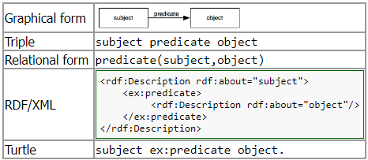
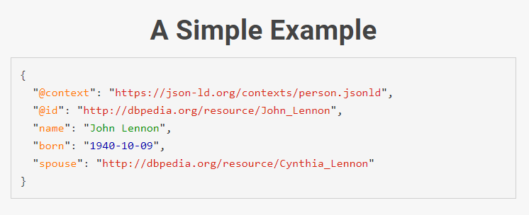
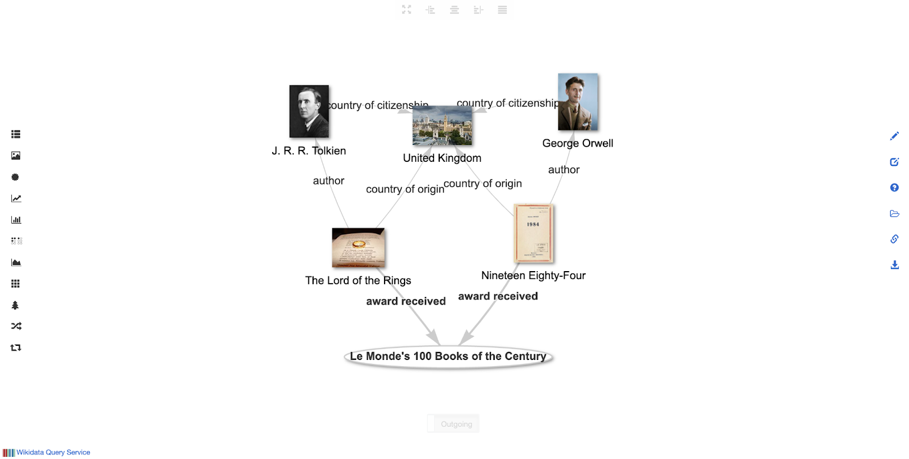

# Linked Data Primer 

Authors: Alexandra Provo, Halle Burns, Michele Lamorte, and Chenyue Jiao

Mentor: Leslie Delserone 

Peer reviewers: Jennifer Moore, Brandie Pullen, and Michael Lenard

Suggested citation: Provo, A., Burns, H., Lamorte, M., and Jiao, C. (2024) Linked Data Primer. [Data Curation Network GitHub Repository.](https://github.com/DataCurationNetwork/data-primers)

# Summary

|   Topic   |   Description   |
| :------------- | :------------- |
| File Extension | .rdf, .ttl, .trig, .nt, .nq, .jsonld |
| MIME Type | application/rdf+xml, text/turtle, application/trig, application/n-triples, application/n-quads, application/ld+json |
| Structure | graph data |
| Primary fields or areas of use | Academic and corporate information professionals, biomedical sciences, cultural heritage, digital humanities |
| Metadata standards | VoID, RO-Crate |
| Key questions for curation review | .See appendix for a comprehensive  list.    <li>Where are the data stored (local triplestore, shared platform like Wikidata or LINCs, etc)?</li><li>Are transformation, enhancement, and enrichment scripts or protocols available and documented?</li><li>Are URI patterns documented?</li> <li>Is there a license applied to the data?</li> <li>What are the cost and storage considerations for different transformation options (data dumps, web archiving, etc)?</li>|
| Tools for curation review | See appendix for a comprehensive list  <li>Any text editor, such as Notepad++ or Visual Studio Code</li><li>Taxonomy/Ontology management systems, such as Protege</li><li>Knowledge graphs or graph databases, such as Neo4j, Blazegraph, or Wikibase</li> |
| Date Created | 2024-09-17 |
| Created by | Alexandra Provo (ap180@nyu.edu), Halle Burns (halle.burns@princeton.edu), Michele Lamorte (michlamorte@gmail.com), and Chenyue Jiao (cjiao4@illinois.edu)  Mentor: Leslie Delserone |
| Date updated and summary of changes made | See readme |

# Table of Contents

[Introduction](#introduction)

[Overview of Linked Data](#overview-of-linked-data)
> [Definition of Linked Data](#definition-of-linked-data) [Description of format](#description-of-format) [Linked Data in practice](#linked-data-in-practice)
>> [Web examples](#web-examples) [Linked Data in Research Contexts](#linked-data-in-research-contexts)

[Key curatorial questions and strategies based on the FAIR principles](#key-curatorial-questions-and-strategies-based-on-the-fair-principles)
> [Findable](#findable) [Interoperable](#interoperable) [Accessible](#accessible) [Reusable](#reusable)

[CURATE(D) Steps for Linked Data](#curated-steps-for-linked-data)
> [C - CHECK](#c---check) [U - UNDERSTAND](#u---understand) [A - AUGMENT](#a---augment) [T - TRANSFORM](#t---transform)

[Further Reading](#further-reading)

[Appendix: Semantic Software](#appendix-semantic-software)
> [Text Editors](#text-editors) [Taxonomy/Ontology Management Systems](#taxonomyontology-management-systems) [Knowledge Graphs/Graph Databases](#knowledge-graphsgraph-databases) [RDF Parsing, Conversion, and Visualization tools/packages](#rdf-parsing-conversion-and-visualization-toolspackages) [RDF entity schema editors](#rdf-entity-schema-editors) [Web archiving tools](#web-archiving-tools)

[Appendix: Linked Data Project Examples](#appendix-linked-data-project-examples)
> [Wikibase projects](#wikibase-projects) [Wikidata sub-projects](#wikidata-sub-projects) [Other projects](#other-projects) [Large-scale knowledge bases](#large-scale-knowledge-bases) [Metadata schemas and ontologies implemented as Linked Data](#metadata-schemas-and-ontologies-implemented-as-linked-data) [Controlled vocabularies available as Linked Data](#controlled-vocabularies-available-as-linked-data)

[Appendix: Linked Data Standards and Specifications](#appendix-linked-data-standards-and-specifications)
> [Specifications and Schemas](#specifications-and-schemas) [Syntaxes](#syntaxes)

[Glossary](#glossary)

[References](#references)

# Introduction

This Linked Data Primer will support academics and information
professionals knowledgeable with or who have experience working on
ontologies, knowledge graphs, semantic data, and related data analysis.
The main audience of this primer are data professionals receiving
submissions such as Linked Data, semantic data, or RDF or XML files.
Beginning with definitions for Linked Data and its related concepts,
such as URIs, formatting, linked data in practice, and strategy, and
ending with example software and systems, standards, and archiving
tools, this primer will attempt to cover the salient information about
linked data submissions that readers of this primer may receive. For
example, data stewards can use the CURATE(D) checklist appendix to begin
analyzing and processing incoming data submissions that may fall under
the Linked Data umbrella. Data Curators and Data Librarians receiving
linked data project submissions may find this primer useful as it
includes recommended actions for curation and preservation of Linked
Data submissions. This primer includes examples of Linked Data projects
that can be referenced for training and educational purposes. This
primer does not go into technical detail about setting up and
implementing or integrating Linked Data that has been developed or
submitted. The development of Linked Data, ontologies, and knowledge
graphs may be covered in additional primers. The references and further
reading sections in this primer can help those looking for additional
information on the specifics of Linked Data in practice.

# Overview of Linked Data

## Definition of Linked Data

“Linked Data” is a term used to describe a concept and data standards or
best practices that allow structured data to be more easily shared and
used/reused across the web. Linked Data allows advanced discovery though
links that bridge divides between subjects, activities, places, or
people.

There is a basic set of principles that define Linked Data, coined by
Tim Berners-Lee (2009), that those working with Linked Data typically
follow:

1.  Use Uniform Resource Identifiers (URIs) as names for things.

2.  Use HTTP URIs so that people can look up those names.

    1.  HTTP URIs make it possible to retrieve information about a concept when the URI is entered into a web browser if the HTTP source is publicly available. There are data used in Linked Data that may not be publicly available, may be proprietary, or may be out-of-date, that will not lead to more information.

3.  When someone looks up a URI, provide useful information, using standards (RDF, SPARQL).

    1.  Information should be structured using RDF (Resource Description Framework)[^1] and accessible via SPARQL[^2] queries, making data easy to interpret and query.

4.  Include links to other URIs so that the user can discover more things.

Linked Data may or may not be open.There is a growing Linked Open Data
movement working to incorporate linked data standards for open and
publicly available data.

## Description of format

The building block of Linked Data is the
“[triple](https://en.wikipedia.org/wiki/Semantic_triple)”
generated with three URIs. A triple, also known as a semantic triple, is
a sequence of three entities (the URIs) that document a statement.They
consist of a Subject, a Predicate, and an Object, and are used to
demonstrate various relationships. For example, a basic triple statement
is:

| Subject            | Predicate                | Object        |
|--------------------------|--------------------------------|---------------------|
| Electronic Arts Intermix | was founded by               | Howard Wise         |
| Electronic Arts Intermix | has an official website at … | http://www.eai.org/ |

Table from
[https://artistarchives.hosting.nyu.edu/JJKB/introduction-to-lod/index.html](https://artistarchives.hosting.nyu.edu/JJKB/introduction-to-lod/index.html).

The Object can also be a text string, integer, or date type. Some
systems (e.g., Wikidata) allow for the use of qualifiers that modify
(i.e. reify) a triple statement. Named graphs also add a layer to the
three-part triple statement by extending the triple into a “quad”,
adding an additional URI that functions to group sets of RDF triples
together.

A common way to structure Linked Data is to use RDF. Many ontology,
knowledge graph, and taxonomy management applications help generate your
structured data as you are developing your semantic data. Linked Data
can be expressed (in other words, serialized) in various syntaxes, such
as RDF/XML[^3], Turtle,[^4] N-triples,[^5] and JSON-LD (Javascript
Object Notation in Linked Data).[^6] If named graphs are used, syntaxes
include TriG[^7] (based on Turtle) and N-quads.[^8]

<figure>  <figcaption>Diagram from Chapter 7. RDF : Resource Description Framework, in XML: Looking at the Forest Instead of the Trees by Guy Lapalme (Lapalme, 2022)</figcaption> </figure>

## Linked Data in practice

### Web examples

An example of Linked Data is seen in structured data embedded on
webpages using RDF syntaxes such as JSON-LD, RDFa (Resource Description
Framework in Attributes)[^9], or Microdata[^10], which are used by
search engine knowledge graphs and displayed as Knowledge Cards in
search results. Some institutional and data repository software embeds
this form of Linked Data into public webpages.

<figure>  <figcaption>Linked data example. Source: https://json-ld.org/</figcaption> </figure>

Another example of Linked Data is
[Wikidata](https://www.wikidata.org/wiki/Wikidata:Introduction),
which collects structured data to provide support for Wikipedia,
Wikimedia Commons, and other wikis. This support is semantic in nature,
as it collects the data from all these data sources and allows users to
search through them to find shared data, connections/relationships
between data, and gain insight on the connected data. For example, on
Wikidata you can follow connections between [Lord of the
Rings](https://dbpedia.org/page/The_Lord_of_the_Rings) and
[Nineteen Eighty-Four](https://dbpedia.org/page/Nineteen_Eighty-Four) both by
clicking through linked data from Lord of The Rings to 1984 in the user
interface or by querying the data using the SPARQL query language. The
example graph below shows connections/relationships between the two
works.

<figure>  <figcaption>Wikidata SPARQL endpoint graph visualization showing connections between Lord of the Rings and 1984, created using [Knowledge Grapher](https://knowledgegrapher.toolforge.org/). Link to query and visualization: [https://w.wiki/93F9](https://w.wiki/93F9)</figcaption> </figure>

### Linked Data in Research Contexts

Linked Data standards can be used for various purposes: to outline the
structure someone should follow to create their data and/or to encode
the data itself.[^11] In other words, Linked Data standards and best
practices can be used to encode controlled vocabularies, taxonomies, and
ontologies (classes and relationships between them) and/or knowledge
bases (which combine ontologies and instance data that describe specific
entities or items). Researchers may be interested in depositing Linked
Data of either or both of these types. Depending on the type of Linked
Data being deposited, it may be suitable for an Institutional Repository
or a dedicated ontology portal such as BioPortal.[^12]

Linked Data is found in a variety of domains: business (typically as
enterprise taxonomies), biomedical (usually as taxonomies used in
software), digital humanities and cultural heritage (as knowledge bases
and databases), and information science (as a syntax for encoding
metadata, either as a canonical record or for purposes of
distribution/aggregation). Research areas include the Semantic Web and
AI expert systems/knowledge representation.[^13] Some of these uses may
be relevant to Linked Data deposits to repositories.

Some examples of potential researcher Linked Data deposits include:

- An ontology developed for a specific project or context, in various syntaxes such as Web Ontology Language (OWL)[^14], CSV, and/or RDF/XML

  - e.g. Gender, Sex, and Sexual Orientation Ontology (GSSO)[^15]

- CSV exports from a shared linked database such as Wikidata and associated visualizations

  - e.g. Joan Jonas Knowledge Base[^16] or the International (Digital) Dura-Europos Archive (IDEA) project[^17]

- Exports or database snapshots of contained Linked Datasets implemented in Wikibase or another triplestore software

  - e.g. Black Bibliography project[^18] or Linked Infrastructure for Networked Cultural Scholarship (LINCS)[^19]

For further examples, see the Appendix.

# Key curatorial questions and strategies based on the FAIR principles

Given the complex nature of Linked Data as well as the various threats
associated with its preservation,[^20] it is important to connect Linked
Data with the FAIR principles (Wilkinson et al., 2016). The three-point
FAIR-ification framework (GO FAIR, n.d.) begins with metadata policy and
componentization to turn data into actionable metadata components. This
process of preparing metadata to ensure data Findability can be where a
Linked Data framework can start being developed. One area where FAIR and
Linked Data principles differ is FAIR’s greater emphasis on licensing,
context, and provenance information, such as metadata (Hasnain &
Rebholz-Schuhmann, 2018, p. 476).

Following are questions and considerations to give direction to your
application of the CURATE(D) steps to Linked Data, based on the FAIR
principles:

## Findable

What metadata exists or would be appropriate for this dataset?

Example metadata schemas and strategies:

- VoID ontology[^21] (Zhao et al., 2011) is a metadata schema for Linked Data and can be used for descriptive, administrative, and technical metadata. The VoID documentation suggests several ways of including VoID descriptions with Linked Datasets, including as a standalone file in Turtle syntax (Alexander et al., 2011).

- RO-Crate[^22] (Soiland-Reyes et al., 2022) is specifically for research data. It uses schema.org and JSON-LD to package research objects with metadata expressed as Linked Data. Note that RO-Crate can be used on any kind of dataset, not just Linked Data.

- Named graphs can be used to track provenance, data versioning, and access control as the graph itself is identified by a URI which can then be used as the subject of additional RDF triple statements providing this information (Dodds & Davis, 2022).

## Interoperable

What format of the data is most important to future users and is
feasible to curate?

Data formats and functionality options:

- Underlying source data, which may be stored in a non-Linked Data format such as a relational database, SQL, XML, or tabular format[^23]

- RDF expression of the data, which may be stored as a static file or in a dynamic triplestore

- Snapshot of the data from a particular time, exported as CSV or RDF dump

- Functionality and performance of the web experience, implying the need for Web Archiving techniques

## Accessible

Is it important that the SPARQL endpoint be maintained?

What will happen to URI links when the project becomes inactive?

Access strategies:

- Maintaining linkages and information about previous domain names is important both for provenance and authenticity. If projects have their own domain name, they can be transferred or rescued via OWL (Web Ontology Language) statements.[^24]

## Reusable

What documentation would be helpful for researchers seeking to reuse
the data?

Recommended documentation or information to include in a README:

- Type of project (proof-of-concept, experimental, etc)

- Data licensing

- Schemas and ontologies used

- Listings of specific properties and classes that are used

- Data model diagrams

- Entity schema languages which define expected properties and values for entities (sometimes called “shapes”)

  - e.g. ShEX,[^25] SHACL[^26], and Wikidata’s Entity Schemas[^27]

- Emulation environments needed for when hardware/software is no-longer available

- Orchestration services (e.g., activity streams (Snell & Prodromou, 2017))

# CURATE(D) Steps for Linked Data

Here we list considerations and key questions specific to Linked Data
for the Check, Understand, Augment, and Transform steps of the CURATE(D)
Checklist. The Request, Evaluate, and Document steps apply more on a
case-by-case basis, and are therefore harder to generalize for the
CURATE(D) Checklist.

## C - CHECK

Depending on where the data are stored and how, you can use software
listed in [Appendix: Semantic
Software](#appendix-semantic-software) to access and assess data
files. At this stage, it’s a good idea to check for external project
dependencies (such as data being stored in a shared platform like
Wikidata, or visualizations being based on data from a live SPARQL
endpoint).

### Key questions

- Where are the data stored (local triplestore, shared platform like Wikidata or LINCs, etc)?

  1.  What triplestore or database software is being used?

- What conceptual models, ontologies, vocabularies/thesauruses, or taxonomies are being used in the dataset?

- If the data is available as an export or file, what format is the file?

  1.  Which RDF syntax is being used (RDF/XML, Turtle, N-triples, JSON-LD)?

- Is the data static or will it be changed/updated? Live Linked Data sources are different from static sources in that they have the potential to be updated and altered at any given point.

  1.  Are there visualizations dependent on live Linked Data sources, for example using SPARQL queries?

  2.  If live, is there documentation indicating information such as the SPARQL query used as well as the date and time the query was run?

## U - UNDERSTAND

As you do a deeper dive into the data, you can ask more questions about
data sources, intended uses, and dependencies. At this stage, it is
important to understand what version of the data will be
curated/deposited, if the project will continue to add more data or make
updates, and if key infrastructure such as web hosting will continue or
be taken offline (resulting in URIs no longer resolving). These
questions will help you communicate with depositors during the Request
step.

### Key questions

- Were the data compiled from an outside source or database, such as a library catalog or Wikidata?

  1.  Were the data transformed from a source dataset or database to Linked Data formats for sharing?

- What form of the data is more important to preserve or provide access to (underlying source data, RDF representation, services like SPARQL, time-specific snapshots)?

- Is reproducibility important (in which case access to transformation scripts/scenarios/protocols may be important)?

- What version of the data is to be deposited? If the project continues, will there be updated deposits?

- Will infrastructure services be taken offline, resulting in URIs no longer resolving?

- Are transformation, enhancement, and enrichment scripts or protocols available and documented?

- Are URI patterns documented?

- Is there a license applied to the data?

- Are the data intended to be available openly? If yes, use Tim Berners-Lee’s 5-Star Linked Data guidelines (quoted from Linked Data for the Perplexed Librarian):

  1.  One Star: Data is available on the web in no fixed format, but has an open license.

  2.  Two Stars: Same as One Star, but the data is machine-readable and structured, such as a spreadsheet instead of a JPEG image of a data table.

  3.  Three Stars: All of the above, plus the data is made available in a nonproprietary format, such as a tab-separated or comma-separated file instead of an Excel spreadsheet.

  4.  Four Stars: All of the above, plus the data is made available with semantic standards, like RDF, fulfilling Berners-Lee’s first three rules of Linked Data.

  5.  Five Stars: All of the above, plus the data is connected to other open datasets.

Some of the questions in the “Sunsetting” section of the Ethics in
Linked Data Checklist (“Ethics in Linked Data Checklist,” 2023) may be
helpful:

- Will any coined URIs continue to resolve?

- For projects using Wikidata, who will check the new data added for accuracy? Who will check vandalism? Privacy?

- If our project has a web-facing component, are final versions of our webpages preserved in the Internet Archive or another easily-accessible location?

- If we (or our institution) can no longer steward the data, have we found someone to take over? Does this contact person (or group) have up-to-date contact information?

- Do we have an archival plan in place for the project’s data and/or findings? Is the plan clearly outlined and can it be easily implemented?

- Does our project have an ongoing and updated plan for the end of funding or wrapping up the project? Where will the data and/or the findings “live on”?

- Is there a plan in place for future users of the data?

### Ethical considerations

- If the data were compiled by outside sources, check to ensure they are from trusted sources.

- Is the data copyrighted, used under a fair use argument, or under a Creative Commons license? If there are questions about sourcing, notes and amendments should be added.

- Does the data contain personally identifiable information that should be hidden?

- Does the data involve living human subjects? What measurements or provisions are in place to protect those individuals?

- See [Ethics in Linked Data Checklist](https://zenodo.org/records/10258209), especially sub-sections Oppression & Harm, Identity Management & Privacy, Data Sovereignty & Intellectual Property

## A - AUGMENT

In the augment step, ensure that documentation exists for data models,
ontologies, and vocabularies. Depending on the file formats chosen for
curation, you may also want to create a metadata description using VoID,
or create metadata in your repository system.

### Key questions

- Are conceptual models, ontologies, vocabularies/thesauruses, or taxonomies being used in the dataset referenced and documented in the README?

- Should a VoID or RO-Crate description of the dataset be created or will a repository metadata record suffice?

- What visualizations of data models or other diagrams would be useful?

## T - TRANSFORM

At the transform step, you may need to facilitate export from a
triplestore or help provide parameters for project developers to create
data dumps. If visualizations depend on live data and SPARQL queries,
you may need to create a static image. If URIs will no longer resolve,
you may need to insert owl:sameAs or similar equivalency statements to
new URIs. If snapshots using web archiving technology is preferred,
consider the costs associated with crawling/capturing numerous web pages
(even a small Linked Data project can involve many pages!). You can use
software listed in Appendix: Semantic Software to transform data files.

### Key questions

- What are the cost and storage considerations for different transformation options (data dumps, web archiving, etc)?

### Ethical considerations

- When transforming, exporting, extracting, or creating data dumps, ensure that the integrity of the data is not lost. Depending on the source and endpoint, there may be differences that show up that need to be adjusted. An example of issues with transformation is special characters or names that may need review after an export.

- Are there naming conventions for the data that need to be considered when transforming the data in any way.

# Further Reading

In addition to the references cited in this primer, we recommend the
following resources for additional learning and information.

Allemang, D., Hendler, J. A., Gandon, F., & Association for Computing Machinery. (2020). Semantic Web for the Working Ontologist: Effective Modeling for Linked Data, RDFS, and OWL. [https://doi.org/10.1145/3382097](https://doi.org/10.1145/3382097)

Avanço, K. (2021, July 30). FAIR Principles and Linked Open Data \[Billet\]. The Road to FAIR. [https://roadtofair.hypotheses.org/288](https://roadtofair.hypotheses.org/288)

Blaney, J. (2017). Introduction to the Principles of Linked Open Data. Programming Historian. [https://programminghistorian.org/en/lessons/intro-to-linked-data](https://programminghistorian.org/en/lessons/intro-to-linked-data)

Dodds, L., & Davis, I. (2022). Linked Data Patterns: A pattern catalogue for modelling, publishing, and consuming Linked Data. [https://patterns.dataincubator.org/book/named-graphs.html](https://patterns.dataincubator.org/book/named-graphs.html)

Doerr, M. (2009). Ontologies for Cultural Heritage. In S. Staab & R. Studer (Eds.), Handbook on Ontologies (pp. 463–486). Springer. [https://doi.org/10.1007/978-3-540-92673-3_21](https://doi.org/10.1007/978-3-540-92673-3_21)

Folsom, S., & Warner, S. (2023, July 10). Facilitating Entity Management with Activity Streams. 2023 LD4 Conference on Linked Data: Exploring Linked Data in GLAM: from Inspiration to Implementation. [https://2023ld4conferenceonlinkedda.sched.com/event/1OPUO/facilitating-entity-management-with-activity-streams](https://2023ld4conferenceonlinkedda.sched.com/event/1OPUO/facilitating-entity-management-with-activity-streams)

Gayo, J. E. L. (2023, November 30). Data Modelling Days: Let’s write a schema together. Wikidata Data Modelling Days 2023. [https://docs.google.com/presentation/d/1xbqaJHZEotZuq1GGKYlTJYoAzRKBOoLGKtdSX-R8cQQ](https://docs.google.com/presentation/d/1xbqaJHZEotZuq1GGKYlTJYoAzRKBOoLGKtdSX-R8cQQ)

Grimm, S., Abecker, A., Völker, J., & Studer, R. (2011). Ontologies and the Semantic Web. In J. Domingue, D. Fensel, & J. A. Hendler (Eds.), Handbook of Semantic Web Technologies (pp. 507–579). Springer. [https://doi.org/10.1007/978-3-540-92913-0_13](https://doi.org/10.1007/978-3-540-92913-0_13)

Noy, N. F., & McGuinness, D. L. (2001). Ontology Development 101: A Guide to Creating Your First Ontology. Knowledge Systems Laboratory, Stanford University. [https://protege.stanford.edu/publications/ontology_development/ontology101-noy-mcguinness.html](https://protege.stanford.edu/publications/ontology_development/ontology101-noy-mcguinness.html)

Sporny, Manu. (2012, June 18). What is JSON-LD? [https://www.youtube.com/watch?v=vioCbTo3C-4](https://www.youtube.com/watch?v=vioCbTo3C-4)

Tim Berners-Lee: The next Web of open, linked data. (2009, March 13). [https://www.youtube.com/watch?v=OM6XIICm_qo](https://www.youtube.com/watch?v=OM6XIICm_qo)

van Hooland, S., & Verborgh, R. (2017). Linked Data for Librarians. [https://course.freeyourmetadata.org/](https://course.freeyourmetadata.org/)

Watson, B. M., Provo, A. A., & Burlingame, K. (Eds.). (2023). Ethics in linked data. Library Juice Press.

# Appendix: Semantic Software

Following are selected text editors, platforms, editors, and tools for
working with Linked Data. Some, especially taxonomy and ontology
management systems, may require a paid subscription.

## Text Editors

- Notepad++: [https://notepad-plus-plus.org/](https://notepad-plus-plus.org/)

- SublimeText: [https://www.sublimetext.com/](https://www.sublimetext.com/)

- Visual Studio Code: [https://code.visualstudio.com/](https://code.visualstudio.com/)

## Taxonomy/Ontology Management Systems

- Graphifi: [https://www.graphifi.com/](https://www.graphifi.com/)

- PoolParty: [https://www.poolparty.biz/](https://www.poolparty.biz/)

- Data Harmony: [https://www.accessinn.com/data-harmony/](https://www.accessinn.com/data-harmony/)

- Synaptica: [https://www.synaptica.com/](https://www.synaptica.com/)

- Mondeca: [https://mondeca.com/home/](https://mondeca.com/home/)

- Semaphore: [https://allegrograph.com/semaphore/](https://allegrograph.com/semaphore/)

- Protege: [https://protege.stanford.edu/](https://protege.stanford.edu/)

## Knowledge Graphs/Graph Databases

- Neo4j: [https://neo4j.com/](https://neo4j.com/)

- OntoText GraphDB: [https://www.ontotext.com/products/graphdb/?ref=menu](https://www.ontotext.com/products/graphdb/?ref=menu)

- TigerGraph: [https://www.tigergraph.com/](https://www.tigergraph.com/)

- AllegroGraph: [https://allegrograph.com/](https://allegrograph.com/)

- Blazegraph: [https://blazegraph.com/](https://blazegraph.com/)

- Stardog: [https://www.stardog.com/](https://www.stardog.com/)

- Wikibase: [https://www.mediawiki.org/wiki/Wikibase](https://www.mediawiki.org/wiki/Wikibase)

## RDF Parsing, Conversion, and Visualization tools/packages

- RDF Grapher: [https://www.ldf.fi/service/rdf-grapher](https://www.ldf.fi/service/rdf-grapher)

- EasyRDF: [https://www.easyrdf.org/converter](https://www.easyrdf.org/converter)

- RDFLib (Python library): [https://rdflib.readthedocs.io/en/stable/](https://rdflib.readthedocs.io/en/stable/)

- Wikibase Export: [https://github.com/ProfessionalWiki/WikibaseExport](https://github.com/ProfessionalWiki/WikibaseExport)

- RDF Shape: [https://rdfshape.weso.es/](https://rdfshape.weso.es/)

## RDF entity schema editors

- YASHE: [https://www.weso.es/YASHE/](https://www.weso.es/YASHE/)

- ShEx validators:

  - shex.js: [https://github.com/shexjs/shex.js](https://github.com/shexjs/shex.js)

  - PyShEx: [​​https://github.com/hsolbrig/PyShEx](https://github.com/hsolbrig/PyShEx)

- Zazuko SHACL playground: [https://shacl-playground.zazuko.com/](https://shacl-playground.zazuko.com/)

## Web archiving tools

- Memento Tracer: [http://tracer.mementoweb.org/](http://tracer.mementoweb.org/)

- Archive-It: [https://archive-it.org/](https://archive-it.org/)

# Appendix: Linked Data Project Examples

Here we list a selection of examples related to knowledge- and database
projects, schemas, and controlled vocabularies. The authors welcome
suggestions for additional examples.

## Wikibase projects

These projects use the Wikibase software in local implementations

- Wikibase.world listing of Wikibase projects: ​​[https://wikibase.world/wiki/Project:Home](https://wikibase.world/wiki/Project:Home)

- Semantic Lab at Pratt Institute: [https://semlab.io/projects/](https://semlab.io/projects/)

- Enslaved: Peoples of the Historic Slave Trade: [https://enslaved.org/](https://enslaved.org/)

- Black Bibliography Project: [https://blackbibliog.org/](https://blackbibliog.org/)

## Wikidata sub-projects

These projects use Wikidata’s shared platform to create and store data

- Joan Jonas Knowledge Base

  - Uses Wikidata to [power embedded visualizations](https://artistarchives.hosting.nyu.edu/JJKB/data-visualizations/index.html) on the website, does not have a local triplestore

  - Homepage: [https://artistarchives.hosting.nyu.edu/JJKB/](https://artistarchives.hosting.nyu.edu/JJKB/)

- International (Digital) Dura-Europos Archive (IDEA) project

  - Uses Wikidata, does not have a local triplestore

  - Homepage: [https://duraeuroposarchive.org/](https://duraeuroposarchive.org/)

## Other projects

These projects use various infrastructure and triplestores besides
Wikibase

- Drawings of the Florentine Painters: [https://florentinedrawings.itatti.harvard.edu/resource/Start](https://florentinedrawings.itatti.harvard.edu/resource/Start)

- Mapping Manuscript Migrations: [https://mappingmanuscriptmigrations.org/en/](https://mappingmanuscriptmigrations.org/en/)

- Linked Infrastructure for Networked Cultural Scholarship (LINCS) [https://lincsproject.ca/](https://lincsproject.ca/)

- Georgia O’Keeffe museum collections online: [https://collections.okeeffemuseum.org/](https://collections.okeeffemuseum.org/)

- Projects using RO-Crate specification: [https://www.researchobject.org/ro-crate/in-use/](https://www.researchobject.org/ro-crate/in-use/)

## Large-scale knowledge bases

- Wikidata: [https://www.wikidata.org/wiki/Wikidata:Main_Page](https://www.wikidata.org/wiki/Wikidata:Main_Page)

- The DBpedia project, a prominent example of Linked Data in practice: [https://www.dbpedia.org/](https://www.dbpedia.org/)

## Metadata schemas and ontologies implemented as Linked Data

- Vocabulary of Interlinked Datasets (VoID)

  - Specification: [http://vocab.deri.ie/void](http://vocab.deri.ie/void)

- Ro-Crate:

  - Homepage: [https://www.researchobject.org/ro-crate/](https://www.researchobject.org/ro-crate/)

- Schema.org:

  - Homepage: [https://schema.org/](https://schema.org/)

- Simple Knowledge Organization System (SKOS)

  - Homepage: [https://www.w3.org/2001/sw/wiki/SKOS](https://www.w3.org/2001/sw/wiki/SKOS)

- CIDOC-CRM:

  - Homepage: [https://cidoc-crm.org/](https://cidoc-crm.org/)

## Controlled vocabularies available as Linked Data

- Getty Vocabularies as LOD: [https://www.getty.edu/research/tools/vocabularies/lod/index.html](https://www.getty.edu/research/tools/vocabularies/lod/index.html)

- Library of Congress Authorities: [https://id.loc.gov/](https://id.loc.gov/)

- BioPortal: [https://bioportal.bioontology.org/](https://bioportal.bioontology.org/)

- Gender, Sex, and Sexuality Ontology (GSSO): [https://gsso.research.cchmc.org/#!/about](https://gsso.research.cchmc.org/#!/about)

# Appendix: Linked Data Standards and Specifications

Here we list selected Linked Data standards and specifications

## Specifications and Schemas

- Resource Description Framework (RDF):

  - Homepage: [https://www.w3.org/RDF/](https://www.w3.org/RDF/)

- RDF Schema (RDFS):

  - Specification: [http://www.w3.org/TR/rdf11-schema/](http://www.w3.org/TR/rdf11-schema/)

- Web Ontology Language (OWL)

  - Homepage: [https://www.w3.org/2001/sw/wiki/OWL](https://www.w3.org/2001/sw/wiki/OWL)

- Shape Expressions Language (ShEx)

  - Specification: [https://shex.io/shex-semantics/](https://shex.io/shex-semantics/)

  - Primer: https://shex.io/shex-primer/

- Shapes Constraint Language (SHACL)

  - Specification: [https://www.w3.org/TR/shacl/](https://www.w3.org/TR/shacl/)

## Syntaxes

- RDF/XML:

  - Syntax specification: [https://www.w3.org/TR/rdf-syntax-grammar/](https://www.w3.org/TR/rdf-syntax-grammar/)

- JSON-LD:

  - Homepage: [https://json-ld.org/](https://json-ld.org/)

  - Syntax specification: [https://www.w3.org/TR/json-ld/](https://www.w3.org/TR/json-ld/)

- Terse RDF Triple Language (Turtle) and TriG

  - Turtle specification: [https://www.w3.org/TR/turtle/](https://www.w3.org/TR/turtle/)

  - TriG specification: [https://www.w3.org/TR/trig/](https://www.w3.org/TR/trig/)

- N-Triples and N-Quads

  - N-Triples specification: [https://www.w3.org/TR/2014/REC-n-triples-20140225/](https://www.w3.org/TR/2014/REC-n-triples-20140225/)

  - N-Quads specification: [https://www.w3.org/TR/2014/REC-n-quads-20140225/](https://www.w3.org/TR/2014/REC-n-quads-20140225/)

# Glossary

|   Term   |   Definition    |
| :------------- | :------------- |
| Activity streams | Model for representing potential and completed activities using JSON. |
| Concept | Concepts are the classes within an ontology that describe a domain or discourse. They can also be referred to as entities, terms, or labels. (“What Is an Ontology and Why We Need It.” Accessed February 9, 2021. <a href="https://protege.stanford.edu/publications/ontology_development/ontology101-noy-mcguinness.html">https://protege.stanford.edu/publications/ontology_development/ontology101-noy-mcguinness.html</a>. |
| <a href="https://aws.amazon.com/what-is/data-lake/">Data lake</a> | A data lake is a centralized repository that allows you to store all your structured and unstructured data at any scale. |
| Data product | Also referred to as data as a product (DaaP), this is an approach in data management where datasets are treated as individual products that are designed and built for end users. |
| <a href="https://aws.amazon.com/what-is/data-warehouse/">Data warehouse</a> | A data warehouse is a central repository of information that can be analyzed to make more informed decisions. |
| Date type | A type of data related to calendar dates. |
| Entity schema languages | Constraint and/or Shape language used to validate or describe RDF graphs.|
| <a href="https://www.w3.org/Protocols/">HTTP</a>  | Hypertext Transfer Protocol |
| Integer | A type of data. Integers are whole numbers. |
| JSON-LD | A way of formatting linked data, using JSON. |
| Knowledge base | “An ontology together with a set of individual instances of classes constitutes a knowledge base.” (“What Is an Ontology and Why We Need It.” Accessed February 9, 2021. https://protege.stanford.edu/publications/ontology_development/ontology101-noy-mcguinness.html.) |
| Knowledge card | Knowledge cards are summarized views of your Google search engine query. |
| <a href="https://ai.stanford.edu/blog/introduction-to-knowledge-graphs/">Knowledge Graph</a> | A knowledge graph is a directed labeled graph in which we have associated domain specific meanings with nodes and edges. |
| Linked Open Data | Open data structured using Linked Data principles to make open data accessible, linked, and related on the web. |
| N-triples and N-quads | Data syntax/encoding for linked data. N-triples consist of subject, object, and predicate. N-quads contain N-triples plus an additional URI that indicates a named graph. |
| Object | In the RDF data model, the object is one of two resources (the other being the subject) and is identified by its URI. It is one of the three things that make a triple. https://www.iro.umontreal.ca/~lapalme/ForestInsteadOfTheTrees/HTML/ch07s01.html |
| Ontology | Ontologies are built on relationships between concepts and consist of classes, attributes, and relations. The developers of the Protege ontology management software define an ontology as follows: “[A]n ontology is a formal explicit description of concepts in a domain of discourse (classes (sometimes called concepts)), properties of each concept describing various features and attributes of the concept (slots (sometimes called roles or properties)), and restrictions on slots (facets (sometimes called role restrictions)). An ontology together with a set of individual instances of classes constitutes a knowledge base. In reality, there is a fine line where the ontology ends and the knowledge base begins.” (“What Is an Ontology and Why We Need It.” Accessed February 9, 2021. https://protege.stanford.edu/publications/ontology_development/ontology101-noy-mcguinness.html.) |
| OWL | Web Ontology Language, a high-level ontology used for asserting relationships between properties and classes. |
| Predicate | In the RDF data model, the predicate is the relationship between the two resources, also known as the subject and object. It is identified by its URI. It is one of the three things that make a triple. https://www.iro.umontreal.ca/~lapalme/ForestInsteadOfTheTrees/HTML/ch07s01.html |
| Quad | An RDF triple that also includes reference to a graph. (See n-triples and n-quads) |
| <a href="https://www.w3.org/RDF/">RDF</a> | Resource Description Framework. A model showing the relationships between data on the web. |
| RDF/XML | Syntax used to express an RDF graph in an XML document, sometimes referred to as simply RDF. |
| Semantic web | “The Semantic Web is a vision for the web where data is machine-readable, represented by facts, concepts, places, and people in a way that a computer can process. Instead of searching through billions and billions of text-based documents, imagine being able to query the web as if it was one huge database. Linked data is the means by which to achieve the vision of the Semantic Web.” “23 Linked Data Things \| Minitex." >Accessed August 13, 2022. https://minitex.umn.edu/services/digital-initiatives-metadata/23-linked-data-things. |
| <a href="https://www.w3.org/TR/rdf-sparql-query/">SPARQL</a> | SPARQL Protocol and RDF Query Language. The query language used for documents and databases that are mapped to RDF. |
| Subject | In the RDF data model, the subject is one of two resources (the other being the object) and is identified by its URI. It is one of the three things that make a triple. https://www.iro.umontreal.ca/~lapalme/ForestInsteadOfTheTrees/HTML/ch07s01.html |
| Taxonomy | Taxonomies are hierarchical structures consisting of related concepts, typically subject-based, meant to convey a family of concepts. |
| Text string | Also referred to just as a string, text strings are a series of characters. While frequently composed of letters and words, text strings may also include numbers, special characters, punctuation, and more. |
| Triple | Made up of subject, object, and predicate entities, an RDF Triple, Semantic Triple, or just Triple is the essential data structure behind linked data. Triples are composed of URIs and demonstrate a relationship between the three entities. |
| Turtle and TriG | Syntax and file format for RDF data. Turtle is also known as Terse RDF Triple Language. TriG is an extension of Turtle. |
| <a href="https://www.w3.org/Addressing/URL/uri-spec.html">URI</a> | Uniform Resource Identifier. A series of characters, such as a web address or a phone number, that uniquely identify an object. |
| Versioning | The process of maintaining multiple copies (or versions) of an item, where each new “version” expands or improves upon the previous |
| <a href="https://www.w3.org/TR/void/">VoID ontology</a> | VoID (Vocabulary of Interlinked Datasets). This is a vocabulary specifically created to describe metadata about RDF datasets. |

# References

Alexander, K., Cyganiak, R., Hausenblas, M., & Zhao, J. (2011). Describing Linked Datasets with the VoID Vocabulary (NOTE-void-20110303). W3C. http://www.w3.org/TR/2011/NOTE-void-20110303/

Berners-Lee, T. (2009, June 18). Linked Data. Design Issues. https://www.w3.org/DesignIssues/LinkedData.html

Berners-Lee, T., Hendler, J., & Lassila, O. (2001). A new form of Web content. Scientific American, 12.

Carlson, S., Lampert, C., Melvin, D., & Washington, A. (2020). Linked data for the perplexed librarian. ALA Editions.

Dodds, L., & Davis, I. (2022). Named Graph. In Linked Data Patterns: A pattern catalogue for modelling, publishing, and consuming Linked Data. https://patterns.dataincubator.org/book/named-graphs.html

Ethics in Linked Data Checklist. (2023). In Ethics in Linked Data. Library Juice Press. https://zenodo.org/records/10258209

Giaretta, D. (2014). Prelida: D3.2 Consolidated State of the Art. https://web.archive.org/web/20150924152419/https://prelida.eu/sites/default/files/D3.2.pdf

GO FAIR. (n.d.). How to GO FAIR. GO FAIR. Retrieved February 1, 2024, from https://www.go-fair.org/how-to-go-fair/

Halpin, H. (2013). The Semantic Web. In Social Semantics: The Search for Meaning on the Web (pp. 51–83). Springer US. https://doi.org/10.1007/978-1-4614-1885-6_3

Hasnain, A., & Rebholz-Schuhmann, D. (2018). Assessing FAIR Data Principles Against the 5-Star Open Data Principles. In A. Gangemi, A. L. Gentile, A. G. Nuzzolese, S. Rudolph, M. Maleshkova, H. Paulheim, J. Z. Pan, & M. Alam (Eds.), The Semantic Web: ESWC 2018 Satellite Events (pp. 469–477). Springer International Publishing. https://doi.org/10.1007/978-3-319-98192-5_60

Holmes, M., & Takeda, J. (2023). From Tamagotchis to Pet Rocks: On Learning to Love Simplicity through the Endings Principles. Digital Humanities Quarterly, 17(1). http://www.digitalhumanities.org/dhq/vol/17/1/000668/000668.html

Knublauch, H., & Kontokostas, D. (2017). Shapes Constraint Language (SHACL) (REC-shacl-20170720/). W3C. https://www.w3.org/TR/2017/REC-shacl-20170720/

Lapalme, G. (2022). Triples in RDF/XML. In XML: Looking at the Forest Instead of the Trees. https://www.iro.umontreal.ca/~lapalme/ForestInsteadOfTheTrees/HTML/ch07s01.html

Prud’hommeaux, E., Boneva, I., Gayo, J. E. L., & Kellogg, G. (2019). Shape Expressions Language 2.1. W3C. https://shex.io/shex-semantics/index.html

Salo, D., & Tillman, R. K. (2023). The Ethics of Sustaining Linked Data Infrastructure. In Ethics in Linked Data. Library Juice Press. https://scholarsphere.psu.edu/resources/430f30bf-e029-483d-b1c8-d7e9bb430a8e

Snell, J. M., & Prodromou, E. (2017). Activity Streams 2.0 (REC-activitystreams-core-20170523). W3C. https://www.w3.org/TR/2017/REC-activitystreams-core-20170523/

Soiland-Reyes, S., Sefton, P., Crosas, M., Castro, L. J., Coppens, F., Fernández, J. M., Garijo, D., Grüning, B., La Rosa, M., Leo, S., Ó Carragáin, E., Portier, M., Trisovic, A., RO-Crate Community, Groth, P., & Goble, C. (2022). Packaging research artefacts with RO-Crate. Data Science, 5(2), 97–138. https://doi.org/10.3233/DS-210053

Wikidata:Schemas. (2023, June 14). Wikidata. https://www.wikidata.org/w/index.php?title=Wikidata:Schemas&oldid=1914665676

Wilkinson, M. D., Dumontier, M., Aalbersberg, Ij. J., Appleton, G., Axton, M., Baak, A., Blomberg, N., Boiten, J.-W., da Silva Santos, L. B., Bourne, P. E., Bouwman, J., Brookes, A. J., Clark, T., Crosas, M., Dillo, I., Dumon, O., Edmunds, S., Evelo, C. T., Finkers, R., … Mons, B. (2016). The FAIR Guiding Principles for scientific data management and stewardship. Scientific Data, 3(1), Article 1. https://doi.org/10.1038/sdata.2016.18

Zhao, J., Alexander, K., Hausenblas, M., & Cyganiak, R. (2011). Vocabulary of Interlinked Datasets (VoID) \[RDF ontology\]. http://vocab.deri.ie/void

[^1]: [https://www.w3.org/RDF/](https://www.w3.org/RDF/)

[^2]: [https://www.w3.org/TR/rdf-sparql-query/](https://www.w3.org/TR/rdf-sparql-query/)

[^3]: [https://www.w3.org/TR/rdf-syntax-grammar/](https://www.w3.org/TR/rdf-syntax-grammar/)

[^4]: [https://www.w3.org/TR/turtle/](https://www.w3.org/TR/turtle/)

[^5]: [https://www.w3.org/TR/2014/REC-n-triples-20140225/](https://www.w3.org/TR/2014/REC-n-triples-20140225/)

[^6]: [https://www.w3.org/TR/json-ld/](https://www.w3.org/TR/json-ld/)

[^7]: [https://www.w3.org/TR/trig/](https://www.w3.org/TR/trig/)

[^8]: [https://www.w3.org/TR/2014/REC-n-quads-20140225/](https://www.w3.org/TR/2014/REC-n-quads-20140225/)

[^9]: [https://www.w3.org/TR/rdfa-primer/](https://www.w3.org/TR/rdfa-primer/)

[^10]: [https://html.spec.whatwg.org/multipage/microdata.html](https://html.spec.whatwg.org/multipage/microdata.html)

[^11]: Salo and Tillman (2023, p. 1) refer to the former as
    infrastructure vocabularies or ontologies and the latter as
    knowledge bases.

[^12]: [https://bioportal.bioontology.org/](https://bioportal.bioontology.org/)

[^13]: The Semantic Web is a vision in which the data implicit in
    hyperlinked web pages is made explicit and connected (Berners-Lee et
    al., 2001). The Semantic Web has origins both in Internet
    technologies and in Artificial Intelligence knowledge representation
    and expert systems (Halpin, 2013).

[^14]: [https://www.w3.org/2001/sw/wiki/OWL](https://www.w3.org/2001/sw/wiki/OWL)

[^15]: [https://gsso.research.cchmc.org/#!/about](https://gsso.research.cchmc.org/#!/about)

[^16]: [https://artistarchives.hosting.nyu.edu/JJKB/](https://artistarchives.hosting.nyu.edu/JJKB/)

[^17]: [https://duraeuroposarchive.org/](https://duraeuroposarchive.org/)

[^18]: [https://blackbibliog.org/](https://blackbibliog.org/)

[^19]: [https://lincsproject.ca/](https://lincsproject.ca/)

[^20]: Salo and Tillman (2023) outline risks such as: link rot (when
    permalinks break), loss of meaning (when vocabularies go offline),
    and misinformation (when knowledge bases are not kept up to date).
    For more issues and threats specific to Linked Data, see Giaretta,
    2014, pp. 7–8

[^21]: VOID ontology:
    [http://vocab.deri.ie/void](http://vocab.deri.ie/void)

[^22]: RO-Crate:
    [https://www.researchobject.org/ro-crate/](https://www.researchobject.org/ro-crate/)

[^23]: Giaretta (2014)

[^24]: See Giaretta, 2014, p. 13 and Salo & Tillman, 2023, p. 33.

[^25]: Specification
    ([https://shex.io/shex-semantics/](https://shex.io/shex-semantics/))
    and primer
    ([https://shex.io/shex-primer/](https://shex.io/shex-primer/))

[^26]: [https://www.w3.org/TR/shacl/](https://www.w3.org/TR/shacl/)

[^27]: [https://www.wikidata.org/w/index.php?title=Wikidata:Schemas&oldid=1914665676](https://www.wikidata.org/w/index.php?title=Wikidata:Schemas&oldid=1914665676)
