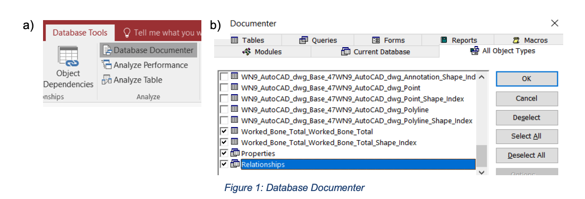
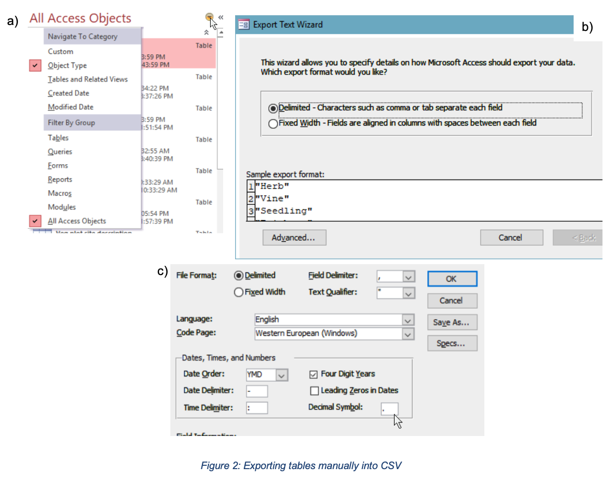
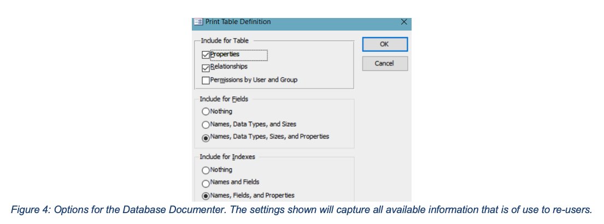
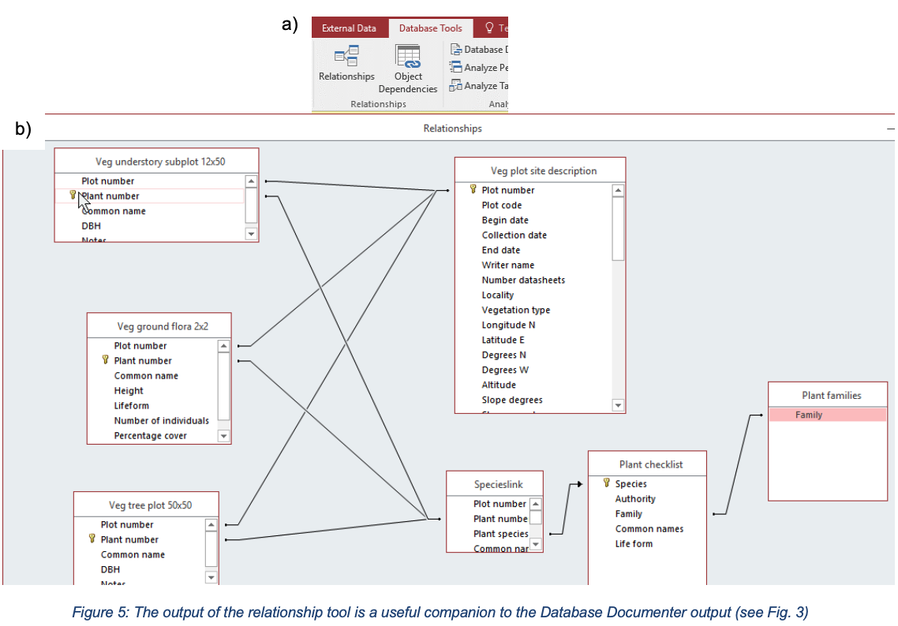
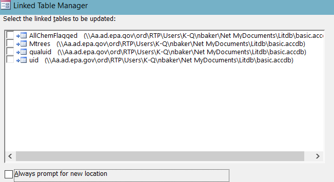

<!DOCTYPE html>
<html>
<body>

</body>
</html>

<html>
<body style="margin-top:0px;">

<h3 style="font-family:Arial; font-size:20; margin:0px;"> Overview </h3> This primer describes curation of MS Access files.

<table>
  <col width="300">
  <col width="400">
  <tr style="background-color:lightgrey">
    <th>Topic</th>
    <th>Description</th>
  </tr>

  <tr>
    <td> File Extension </td>
    <td> mdb, accdb </td>
  </tr>

  <tr>
    <td> MIME type </td>
    <td> Non/<a href="/[application/octet-stream]
    (https://www.iana.org/assignments/media-types/application/octet-stream)"> application/octet-stream</a></td>
  </tr>

  <td> Structure </td>
  <td> Proprietary relational database </td>
 </tr>

 <tr>
 <td> Versions </td>
 <td> Access 1.0 - 2003, 2007 - 2016 </td>
</tr>

<tr>
<td> Primary fields or areas of use </td>
<td> Storing relational data. Used in many disciplines. Surveys, data entry, geospatial, storing metadata for certain disciplines, etc. </td>
</tr>

<tr>
<td> Source and affiliation </td>
<td> Microsoft </td>
</tr>

<tr>
<td> Metadata standards </td>
<td> No widely adopted standards. Built-in documentation may be used </td>
</tr>

<tr>
<td> Key questions for curation review </td>
<td> <ul><li> Intended use: use as a db or just be able to view the data?</li><li>Does the data exist in other formats?</li><li>Are there "linked" tables?</li><li>Is there documentation about each table and relationship?</li></ul> </td>
</tr>

<tr>
<td> Tools for curation review </td>
<td> <ul><li>A Windows PC with Access (Access does not run on Mac). Recent versions of Access (e.g., 2016) should be able to open down to Access 2000</li></ul> </td>
</tr>

<tr>
<td> Date created </td>
<td> 2019-01-18 </td>
</tr>

<tr>
<td> Created by </td>
<td> Fernando Rios (University of Arizona Libraries, Office of Digital Innovation & Stewardship), Dave Fearon (Johns Hopkins University Libraries Data Services) </td>
</tr>

<tr>
<td> Date updated and summary of changes made </td>
<td> 2019-02-01 - 1.0: initial version 2019-04-18 - 2.0: DCN peer review </td>
</tr>
</table>

Note: This primer assumes a conceptual familiarity with relational databases (and associated terminology) and a basic level of experience with Microsoft Access. For introductory material on relational database concepts and MS Access see
<ul><li> <a href="https://open.umn.edu/opentextbooks/textbooks/relational-databases-and-microsoft-access">Relational Databases and Microsoft Access by Ron McFayden </a></li> <li> <a href="https://www.khanacademy.org/computing/computer-programming/sql">Intro to SQL: Querying and managing data from Khan Academy </a></li> <li> <a href="https://librarycarpentry.org/lc-sql/">SQL for Librarians from Library Carpentry </a></li></ul>

_________

 Suggested Citation: Author. Date Released. Title.  
This work was created as part of the Data Curation Network Training Cohort #1.  

<h3 style="font-family:Arial; font-size:20; margin:0"> Description of Format </h3>

A Microsoft Access (MS Access) database could be in one of two main formats: MDB and ACCDB. There are variations on these<a href="#fn1" class="footnote-ref" id="fnref1">1</a> but they will not be discussed further. The MDB format is the native format for MS Access 1.0 through MS Access 2003. Note that although the MDB file extension was used for all those versions, the internal format changed significantly.  Starting with Access 2007, the ACCDB format was used by default.

The following descriptions of the MDB and ACCDB formats are largely summarized from the Library of Congress format description entries<a href="#fn2" class="footnote-ref" id="fnref2">2</a> along with additional information on the differences between the formats. Refer to those for more detailed information of the format along with a large list of additional resources.

<table>
<col width="130">
  <col width="300">
  <col width="300">
  <tr style="background-color:lightgrey">
    <th>  </th>
    <th>MDB</th>
    <th>ACCDB</th>
  </tr>
  <tr>
    <td> Overview </td>
    <td><ul><li>No public specification</li><li>Better compatibility with more versions of Access</li><li>User-level security</li><li>Database replication supported</li><li>Based on the JET database engine</li><li>Many well-developed 3rd-party tools</li></ul></td>
    <td><ul><li>No public specification</li><li>Better integrations with Outlook and web services</li><li>Can attach binary data to tables</li><li>improved encryption</li><li>Based on the ACE database engine</li><li>Fewer 3rd-party tool support</li></ul></td>
    </tr>

  <tr>
    <td> Version</td>
    <td> The default format up until Access 2003<ul><li>Access 1.0, Support was dropped in Microsoft Access 2010.</li><li>Access 2.0. Support was dropped in Microsoft Access 2010.</li><li>Access 95, aka Access 7.0. Support was dropped in Microsoft Access 2013. </li><li>Access 97. Support was dropped in Microsoft Access 2013.</li><li>Access 2000. Maximum size increased from 1GB to 2GB.</li><li>Access 2002-2003. New features, including PivotTable views, support for XML, and an updated version of SQL would result in files not compatible with Access 2000.</li></ul> </td>
    <td> The default format starting from Access 2007 <ul><li>There are subtypes of the format but they have not been described</li><li>Microsoft documentation indicates that using newer versions of Access (e.g., Access 2016) will result in databases that cannot be opened in earlier versions of Access. </li></ul> </td>

  </tr>
  <tr>
    <td> Metadata</td> <td colspan="2"> <ul><li>No widely adopted standard, Access has its own way of storing the documentation of fields, tables, etc.</li><li>The SAIRD tool has some preservation metadata. See the Preservation section below</li></ul></td>
  </tr>

</table>

<section class="footnotes">
  

  <ol>
  <li id="fn1"> <a href="https://en.wikipedia.org/wiki/Microsoft_Access#File_extensions">https://en.wikipedia.org/wiki/Microsoft_Access#File_extensions</a>   <li id="fn2">
 MDB: <a href="https://www.loc.gov/preservation/digital/formats/fdd/fdd000462.shtml">https://www.loc.gov/preservation/digital/formats/fdd/fdd000462.shtml</a> 
ACCDB: <a href="https://www.loc.gov/preservation/digital/formats/fdd/fdd000463.shtml">https://www.loc.gov/preservation/digital/formats/fdd/fdd000463.shtml</a> <a href="#fnref2" class="footnote-back">&#8617;&#xFE0E;</a>
   </li>
 </ol>
 </section>

<h3 style="font-family:Arial; font-size:20; margin:0px"> Examples </h3> <h5 style="margin:0.5px"> Common use cases</h5>
<ul><li> Tabular data associated with spatial information - geodatabases <li> Capturing survey results <li>Storing metadata about other datasets <li>Data entry forms - Makes use of the way Access can be used to easily create forms for more efficient data entry.	<li> Basic statistical analysis functionality and other data analysis uses such as content coding.</li></ul>

<h5 style="margin:0.5px">Dataset Examples</h5>
These are drawn from a variety of disciplines and contain entries which are and are not associated with publications. Like many other kinds of datasets, there is a large variability in the amount of documentation included. The examples from TDAR are perhaps the best documented as they follow a structured approach.
<ul><li> <a href="https://figshare.com/articles/MS_Access_database_Seed_data_from_rattlesnake_GI_tracts/6034904">https://figshare.com/articles/MS_Access_database_Seed_data_from_rattlesnake_GI_tracts/6034904</a> </li> <li> <a href="https://figshare.com/articles/EPA_Literature_Database_Cleft_Palate_Chemical_Data/6062773">https://figshare.com/articles/EPA_Literature_Database_Cleft_Palate_Chemical_Data/6062773</a> </li> <ul> <li> Content linked to <a href="newftp.epa.gov/COMPTOX/Virtual_Tissues_Data/EPALitDB/LitDB_projectsANDpublications/cleftpalate/cp_chems.accdb">ftp://newftp.epa.gov/comptox/virtual_tissues_data/epa/litdb/litdb_projectsandpublications/cleftpalate/cp_chems.accdb</a> </li> </ul>
<li><a href="https://figshare.com/articles/Matura_NP_ESA_vegetation_survey/5630335">https://figshare.com/articles/Matura_NP_ESA_vegetation_survey/5630335</a> </li>

<li><a href="https://figshare.com/articles/Picoplankton_cytometry_accdb/3180280">https://figshare.com/articles/Picoplankton_cytometry_accdb/3180280</a> </li>

<li><a href="https://figshare.com/articles/Murray_Cod_Larval_Database_Murrumbidgee_2011-2013/5715097">https://figshare.com/articles/Murray_Cod_Larval_Database_Murrumbidgee_2011-2013/5715097</a> </li>

<li><a href="https://figshare.com/articles/Effects_of_Recreation_on_Animals_Revealed_as_Widespread_through_a_Global_Systematic_Review/4297430">https://figshare.com/articles/Effects_of_Recreation_on_Animals_Revealed_as_Widespread_through_a_Global_Systematic_Review/4297430</a> </li>

<li><a href="https://core.tdar.org/geospatial/394771/bell-site-geodatabase-mdb-file">https://core.tdar.org/geospatial/394771/bell-site-geodatabase-mdb-file </a> </li>

<li><a href="https://core.tdar.org/dataset/396397/gfs2011_nabone-database">https://core.tdar.org/dataset/396397/gfs2011_nabone-database  </a> </li> (locked)

<li><a href="https://core.tdar.org/dataset/394059/akurvik-access-database">https://core.tdar.org/dataset/394059/akurvik-access-database </a> </li>

<li> Lasda Bergman, Elaine, 2014, "Replication data for: Citations", <a href="https://dataverse.harvard.edu/dataset.xhtml?persistentId=doi:10.7910/DVN/27655"> https://doi.org/10.7910/DVN/27655</a>, Harvard Dataverse, V1 </li>

<li>Correlates of War, 2007, "National Material Capabilities (v3.02)", <a href="https://dataverse.harvard.edu/dataset.xhtml?persistentId=hdl:1902.1/10170">https://hdl.handle.net/1902.1/10170</a>, Harvard Dataverse, V1, UNF:3:B4DsVV/TykpPeJQNXdtwAA== [fileUNF]</li> </ul>

<h3 style="font-family:Arial; font-size:20; margin:0px"> Viewing </h3>

Recent version of Access (e.g., Access 2016) can still open and save databases down to Access 2000 however functionality may be changed when migrating from an older to newer or newer to older format. There is no version for Macintosh OS.

For opening very old Access versions, the Library of Congress provides resources:
- As of early 2017, Microsoft still provides [instructions online for importing an Access 2.0 database into versions of Access from 2000 through 2007](https://support.office.com/en-us/article/import-access-2-0-and-access-95-databases-into-current-versions-2e9d8851-101d-4407-a881-65d06bb12aa7?ui=en-US&rs=en-US&ad=US).
- As of early 2017, Microsoft still provides [instructions online for importing an Access 95 database into Access 2007](https://support.office.com/en-us/article/import-access-2-0-and-access-95-databases-into-current-versions-2e9d8851-101d-4407-a881-65d06bb12aa7?redirectSourcePath=%252fen-us%252farticle%252fImport-an-Access-95-database-into-an-Access-2007-file-65ae9f69-3c0e-4fea-8952-dcb4e90119b1&ui=en-US&rs=en-US&ad=US).

A basic requirement of opening these very old formats is a copy of Access 2007. If it is anticipated that there could be the need to open and curate these old databases, it is recommended to procure and maintain a virtual machine with a working copy of Access 2007 to allow migrations between older and newer versions of Access.

<h3 style="font-family:Arial; font-size:20; margin:0px"> Key questions to ask yourself </h3>

- Is documentation about the columns included? I.e., a codebook. The codebook is especially critical to understand the relationships between the tables
-	Are the primary/foreign key relationships described? Exporting individual tables to a spreadsheet format does not keep these relationships so it's critical to document them (at least include an exported version of the Relationships diagram alongside the exported tables.)
- How easily could this database be exported into flat CSVs? The answer will depend on the above points
	- If exporting is easy i.e., if there are no relationships between tables and there is no embedded code or forms that are integral to the purpose of sharing the dataset. Suggest simply exporting it rather than archiving the database itself, since the database adds no particular functionality.
-	Is the data contained in the database sourced from somewhere else?
	- It could be that the database was used as a way to organize other data.
	- If the data is available elsewhere, it might be that it's in a more FAIR format there and it would be worth pointing that out in the metadata
-	What version of Access was used?
	- Most of the time, this won't be stated so you'll just have to try to open it and see if it works
-	Is your version of MS Access secure?
	- Make sure options to disable macros and other code from executing automatically is disabled since you don't know if the dataset could be malicious. The default of newer versions of Access is to disable such functionality

<h3 style="font-family:Arial; font-size:20; margin:0px"> Key clarifications to get from researcher </h3> <h5 style="margin:0.5px"> Very useful clarifications</h5>

-	For data entry databases with forms, a description of the data entry workflow would help with understanding the underlying database structure
	- What is the main entry form? Where does the entry workflow start? Etc.
-	Documentation of the meaning of the relationships in the database, not just which relationships exist (the latter can simply be obtained via the Relationship Diagram which is auto-generated by Access)
-	Is the data available natively in a non-Access format elsewhere?

<h5 style="margin:0.5px"> Nice-to-have clarifications</h5>

-	Documentation description of database table fields, ideally within the database design metadata.
-	Documentation of macros and modules, ideally as comments within the code.
-	What version of Access was used?
-	Which tables and/or queries do specific results from the paper come from (in cases where the database is specifically associated with a publication)

<h3 style="font-family:Arial; font-size:20; margin:0px"> Applicable metadata standard, core elements and readme requirements </h3>

<b style="font-size: 11;margin:0.5px"> Accessing metadata schema:</b> Most database platforms have standard means of exporting database schema: descriptions of the database structure and design, including the tables, fields, relationships, and, sometimes the calculations or procedures used by the database. In Access, the Database Documenter (on the Database Tools tab, Fig. 1) is the direct means of generating reports on the database schema.

The Documenter report includes a lengthy property report of each field, including description. Exporting as .txt format is recommended for utility. The decision to generate schema reports for curation may depend on plans for preservation rather than documentation that is of direct use to researchers interested in the data itself, since much of the content consists of properties of fields, tables, and relationships relevant to the database design schema. For example, table fields could include descriptions as a useful addition to documentation and usage. These are easily viewed within Access Table Design View. See the Preservation section for details on generating the Database Documenter report.

Metadata may be accessed in other ways. Access uses Database Object Listing (MSysObjects) as its underlying standard for its schema. This schema is not used by other platforms, in particular, SQL, which means they are not as interoperable.

-	MS Access does NOT use information_schema standards common to a range of SQL databases, which is one of the standards for reporting information about tables, views, columns, and procedures or calculations in a database. (c.f. https://en.wikipedia.org/wiki/Information_schema.
-	Access also uses its own SQL standard, Access SQL, which may be incompatible with other SQL standards such as Transaction-SQL. http://rogersaccessblog.blogspot.com/2013/05/what-are-differences-between-access-sql.html

<h3 style="font-family:Arial; font-size:20; margin:0px"> Preservation </h3>

In this section, we present the following recommendations for basic preservation of MS Access databases. These consist of 1) exporting tables and other objects into interoperable formats, and 2), Making extensive use of the Database Documenter and Relationship Tool to export contributor- and machine-generated metadata. Finally, additional preservation avenues developed by 3rd parties for more advanced preservation are presented.

<h5 style="margin:0.5px"> Exporting Access Tables and Objects</h5>

Following the ICPSR recommendations, at minimum, the database tables should be exported into flat CSV files and included alongside the original database itself. To do this, first make a copy of the database and then
1. In Access (2016 used as an example), make sure to group by Object Type and display All Access Objects in the side bar (Fig. 2a).
2.	Right click on a table and select Export -> Text File.
3.	Enter a name and location for the file. Make sure to change the extension to 'csv' instead of 'txt'. Do NOT check the box to 'Export data with formatting and layout'. Click Ok.
4.	In the Export Text Wizard window show in Fig 2b, make sure Delimited is selected.
5.	Click the Advanced button in Fig 2b to change date export format and other settings as shown in Fig. 2c. Save the export settings to apply the date export to other tables more quickly.
6.	Repeat 2-5 for every table in the database. Also see Linked Tables below for how to deal with linked tables. Note: there is no built-in way to export more than one table at a time.

In addition to tables, other types of objects can also be exported, and they should be when feasible/useful.
<ul><li>Forms: Can be exported directly to PDF by right-clicking and selecting Export -> PDF or XPS. Bound forms that are directly linked to a table will be exported in their entirety, including the records themselves.</li>
<li>Macros cannot be exported unless they are first converted to Visual Basic (use the Convert Macros to Visual Basic button in the macro Design tab in Access)</li>
<li>Modules can be directly exported as text files.</li>
<li>Queries: Don't use the export menu as this will export the query results instead of the query itself. To export the query, open it in Access in Design View and from the View menu, select SQL View. The text can then be copied into an empty text file with extension '.sql'.</li>

<h5 style="margin:0.5px"> Database Documenter</h5>
In addition, it is strongly recommended that the output of the Database Documenter be included alongside the exported tables/objects and any other documentation. The Database Documenter report includes detailed information on each table (data types, any user-entered metadata, etc.) and other Access objects. It also includes detailed information on the relationships in the database. In the report, each relationship is identified individually using the two table names and the two fields involved, as well as the type of the relationships and any attributes (e.g., whether the relationship is enforced when entering data or whether the deletion of a record cascades to associated tables) as shown in Fig. 3. This information is critical so as to enable understanding the relationships between the exported tables as, upon export, the relationship information is lost.

 To generate the Database Documenter Report:
 <ol><li>Click on Database Tools in the ribbon and open the Database Documenter</li>
 <li>	Click the All Object Types tab and select all</li>
 <li>In the Options, set the settings as shown in Fig. 4 so that all available comments are included.</li>
 <li>	When complete, the report will appear in a Print Preview window. Export the report to PDF by clicking the appropriate button on the ribbon. Note: There are other export options but the PDF export is best for preservation since it is a self-contained document.</li>
</ol>

Finally, in addition to the Relationships Report generated by the Database Documenter, the diagram from the Relationships editor should be included as a standalone attachment in the form of an image. This is because the relationships report generated by the Database Documenter does not include an overview of all the relationships in the database. To obtain the diagram click on the Relationships button in the Database Tools tab (Fig. 5a) and you will see a window that details the relationships within the database (Fig 5b). You can take a screenshot or export the report to PDF. Typically, the database contributor, rather than the curator, would arrange the relationship diagram in a way that makes sense, especially if intending the shared database to be repurposed.

 

**Linked Tables**
Linked tables are tables that exist in another Access database. If the table is not included with the database being curated, they cannot be opened. These tables can be converted to local tables by right clicking the table and selecting the appropriate menu entry (assuming the linked table was part of the deposit as a separate file or otherwise made available). You can also use the Linked Table Manager (Fig. 6) to see and update all linked tables. Additionally, there is a consideration if a query in Access references external databases (e.g., SQL servers)

**ICPSR Recommendations**
ICPSR preservation recommendations: "To preserve relational databases, users should export the database tables as flat rectangular files and preserve the table relationships using, for instance, SQL schema statements. When databases are used as survey instruments or other data input/out mechanisms, the look and feel of the user interface can be preserved by creating a static PDF image of the interface. Promising software is currently under development to normalize relational databases into non-proprietary formats such XML." (https://www.icpsr.umich.edu/icpsrweb/content/deposit/guide/chapter4.html)

**Database Preservation Toolkit (DBPTK) and SIARD standard**
The Database Preservation Toolkit facilitates digital preservation of databases by converting a range of platforms to preservation-ready formats, in particular, SIARD 2.0.  This format currently supports MS Access 2000 to 2016 (both MDB and ACCDB) formats. It is based on four internationally recognized standards: XML, SQL:2008, UNICODE and ZIP64format. The SAIRD format and toolset have been adopted in Switzerland and other countries. Further information and the executable application can be found at http://www.database-preservation.com/. Note: The DBPTK is command-based and would take time to install and implement. The decision to convert to SIARD would be based on your archive's long-term preservation policy rather than shorter-term reuse for research, for which depositing the original Access format may be sufficient.

<h3 style="font-family:Arial; font-size:20; margin:0px"> What to look for to make sure this file meets FAIR principles </h3>

<ul><li>Make sure to verify (either by testing each table individually or asking the researcher) that the database does not contain tables that are linked to other databases. In recent version of Access it is indicated by the small arrow beside the table icon (Fig. 7).

 Trying to open these linked tables will result in an error. See the Curation section for more information

<li> Eporting tables to CSV will ensure at least the data is accessible in a non-proprietary format</li></ul>

<h3 style="font-family:Arial; font-size:20; margin:0px"> Unresolved Issues/Further Questions </h3>

-	Can LibreOffice (open-source alternative to Microsoft Office) open Access databases directly or can the Access database be exported to a format that can be opened by LibreOffice Base?
	- No, but tables can be linked between Base and Access. [See here for details](https://ask.libreoffice.org/en/question/60559/base-and-ms-access-2007-2013/).
-	Preserving databases that reside on servers. How to download (do they act as independent files?) (Sharepoint?) Similarly, Access may be the front-end to tables on server-based SQL, which may be challenging to export and keep associated as a single package for archiving.
-	Adding comments to macros and modules (e.g., within the coding).
-	Investigating 3rd party tools for accessing Access databases for obtaining version numbers, counts of tables, existence of linked tables without having to manually open each table and query in Access.  There are some tools for \*nix like [mdbtools](http://mdbtools.sourceforge.net) that claim to be able to interact with Access databases.
-	Converting Access to MySQL as an alternative open format. Guidelines can be found [at this link](http://www.bullzip.com/products/a2m/info.php). Bullzip offers an [Access to MySQL converter utility](http://www.bullzip.com/products/a2m/info.php).

<h3 style="font-family:Arial; font-size:20; margin:0px"> Documentation of curation process: What do capture from curation process </h3>

-	Exporting tables to CSV: did curator do it or were they provided by the researcher?
-	Documenting the presence of linked tables or queries that reference external servers
-	Version of MS Access needed to open file
-	Any changes to the internal metadata. E.g., if the curator added descriptions to fields or modules using MS Access built-in functionality.  This would affect what is produced by the Database Documenter.
-	Document relationship among any files or parts exported from the database, e.g., individual tables and the keyfields that relate them, spatial data, reports. Document whether the curator or the researcher generated them.
-	Stating whether the curator generated the Database Documenter report vs being generated by the researcher. This implies differences in the quality of the documentation - especially if the curator-generated report was not vetted by the researcher. (A researcher-generated report does not necessarily imply quality either.)

<h3 style="font-family:Arial; font-size:20; margin:0px"> Bibliography </h3>

<ul><li> Data Carpentry SQL discussion</li>
<li>Library of Congress has some good descriptions  </li>
<ul><li><a href="https://www.loc.gov/preservation/digital/formats/fdd/fdd000462.shtml">MDB</a>, <a href="https://www.loc.gov/preservation/digital/formats/fdd/fdd000463.shtml">ACCDB</a></li></ul>
<li>	Database preservation: more advanced techniques that are platform-independent</li>
<ul><li><a href="https://www.database-preservation.com">Database Toolkit</a></li></ul>
<ul><li><a href="https://www.bar.admin.ch/bar/en/home/archiving/tools/siard-suite.html">SIARD</a> (Software Independent Archiving of Relational Databases)</li></ul>
<li><a href="https://visualization.database-preservation.com"><Database Visualization Toolkit></a>Relational Database Viewer for databases based on SIARD 2 </li>
<li>	MS Access Documentation and Backup </li>
<ul><li><a href="https://support.office.com/en-us/article/create-an-access-app-package-5c409c03-ded9-4a41-82c3-fdd490a91b42">Create an Access app package</a> for saving as a Snapshot for preservation </li></ul>
<ul><li>Database Documenter: <a href="https://support.office.com/en-us/article/document-and-print-your-database-design-8bb56649-dd17-4d2e-b8dc-17dddd1ac91a">accessing and printing the database design</a> </li></ul></ul>

<h3 style="font-family:Arial; font-size:20; margin:0px"> Appendix A - MS Access CURATED checklist </h3>

<h5 style="margin:0px"> Checklist of CURATED Steps Performed by the DCN</h5>

 <small><b>Check</b> files and read documentation (risk mitigation, file inventory, appraisal/selection </small>

 <small><b>Understand</b> the data (or try to), if not… (run files/environment, QA/QC issues, readmes) </small>

 <small><b>Request</b> missing information or changes (tracking provenance of any changes and why) </small>

 <small><b>Augment</b> metadata for findability (DOIs, metadata standards, discoverability) </small>

 <small><b>Transform</b> file formats for reuse (data preservation, conversion tools, data viz) </small>

 <small><b>Evaluate</b> for FAIRness (licences, responsibility standards, metrics for tracking use) </small>

 <small><b>Document</b> your curation activities </small>

<h4 style="font-family:Arial; font-size:20; margin-top: 25px; margin-left: 0px;margin:0px;"> CHECK Step</h4>

<table>

| CURATE Action |  Curator Checklist    |
| :----------------- | :------------- |
| Check data files and read documentation <ul> <li>Review the content of the data files (e.g., open and run the files or code).</li><li>verify all metadata provided by the author and review the available documentation.</li></ul> | <ul style="padding-left:5px; display:block; margin-top:0px;"> &#9744; Files open as expected </li> <ul> &#9744; Issues ________ </ul> <li style="list-style-type: none;">&#9744; Code (modules, macros, queries) runs as expected</li> <ul>&#9744;	Produces minor errors </ul> <ul> &#9744;	Does not run and/or produces many errors </ul>  <ul> &#9744;	Did not try to run code  </ul> &#9744; Metadata quality is rich, accurate, and complete   <ul> &#9744;	Metadata has issues _________ </ul>&#9744; Documentation Type (circle) Readme / Codebook / Data Dictionary / Other: ________________________   <ul> &#9744;	Missing/None </ul> 	<ul> &#9744; Needs work</ul>&#9744; Human subjects data present <ul> &#9744;	Request consent form / participation agreement</ul>|

</table>

<h4 style="font-family:Arial; font-size:20; margin:0px"> UNDERSTAND Step</h4>

| CURATE Action |  Curator Checklist     |
| :------------- | :------------- |
| Understand the data (or try to)<ul><li>	Check for quality assurance and usability issues such as missing data, ambiguous headings, code execution failures, and data presentation concerns.</li> <li> 	Try to detect and extract any "hidden documentation" inherent to the data files that may facilitate reuse. </li> <li>Determine if the documentation of the data is sufficient for a user with similar qualifications to the author's to understand and reuse the data. If not, recommend or create additional documentation (e.g., a readme.txt template).| Varies based on file formats and subject domain. For example….    MS Access  <ul style="padding-left:5px; display:block;"> &#9744;	Is there documentation on tables, relationships, queries, etc?   <ul> &#9744;	Exists in separate file </ul> <ul> &#9744;	Included in Access comment fields for tables</ul> <ul> &#9744;	Other ________ </ul>  &#9744;	Can the data be exported to CSVs easily? <ul> &#9744;	Yes, no information is lost</ul> <ul> &#9744;	No, database contains many queries and relationships </ul><ul> &#9744;	No, Database also has forms/code/macros</ul> <ul> &#9744;	Other __________ </ul>  &#9744;	Is the database self-contained? <ul> &#9744;	Yes </ul> <ul>&#9744;	No, there are linked tables </ul><ul> &#9744;	No, queries access external data sources.</ul>  &#9744;	Is there or can you obtain documentation or information on how the database was used?   &#9744;	Which tables or queries are the relevant ones used in a publication?</ul>|

<h4 style="font-family:Arial; font-size:20; margin:0px"> REQUEST Step</h4>

| CURATE Action |  Curator Checklist     |
| :------------- | :------------- |
| Request missing information or changes <ul><li>	Generate a list of questions for the data author to fix any errors or issues. |<ul style="padding-left:5px; display:block;"> Narrative describing the concerns, issues, and needed improvements to the data submission.</li></ul>|

<h4 style="font-family:Arial; font-size:20; margin:0px"> AUGMENT Step</h4>

| CURATE Action |  Curator Checklist     |
| :------------- | :------------- |
| Augment the submission <ul><li>	Enhance metadata to best facilitate discoverability.<li>	Create and apply metadata for the data record, including descriptive keywords.<li>	When appropriate, structure and present metadata in domain-specific schemas to facilitate interoperability with other systems.</li></ul>|<ul style="padding-left:5px; display:block;"> &#9744;	Discoverability sufficient <ul> &#9744;	Recommend (circle one) full-text index / file rename / file reorder / file descriptions / zip files into one archive Other  ______________ </ul> &#9744;	Keywords Sufficient <ul> &#9744;	Suggestions _______________ </ul>  &#9744; Linkages Sufficient <ul> &#9744;	Link to report/paper</ul> <ul> &#9744;	Link to related data sets </ul> <ul> &#9744;	Link to source data</ul> <ul> &#9744;	Link to other ____________</ul>|

<h4 style="font-family:Arial; font-size:20; margin:0px"> TRANSFORM Step</h4>

| CURATE Action |  Curator Checklist     |
| :------------- | :------------- |
| Transform file formats <ul><li>	Identify specialized file formats and their restrictions (e.g., Is the software freely available? Link to it or archive it alongside the data).</li> <li>	Transform files into open, non-proprietary file formats that broaden the potential audience for reuse and ensure that preservation actions might be taken by the repository in later steps. Retain original files if data transfer is not perfect.</li></ul>|<ul style="padding-left:5px; display:block;"> &#9744;	Preferred file formats in use <ul> &#9744;	Recommend conversion from _________ 	to     _________ </ul> <ul> &#9744;	Retain original formats</ul>  &#9744;	Software needed is readily available <ul> &#9744;	Unclear version of software</ul> <ul> &#9744;	Unclear software used  </ul>   &#9744;	Visualization of data easily accessible <ul> &#9744;	Recommend graphical representation ____________ </ul><ul> &#9744;	Recommend web-accessible surrogate ________________</ul></ul>|

<h4 style="font-family:Arial; font-size:20; margin:0px"> EVALUATE Step</h4>

| CURATE Action |  Curator Checklist     |
| :------------- | :------------- |
| Evaluate and rate the overall data record for FAIRness.*   <ul><li>	Score the dataset and recommend ways to increase the FAIRness of the data and become "DCN approved." </li></ul>| <ul style="padding-left:5px;display:block;"> Findable - <ul> &#9744; Metadata exceeds author/ title/ date, </ul> <ul> &#9744; Unique PID (DOI, Handle, PURL, etc.). </ul> <ul> &#9744;	Discoverable via web search engines.</ul>  Accessible - <ul> &#9744;Retrievable via a standard protocol (e.g., HTTP). </ul>	<ul> &#9744;Free, open (e.g., download link).</ul> Interoperable - <ul> &#9744;	Metadata formatted in a standard schema (e.g., Dublin Core).</ul><ul> &#9744; 	Metadata provided in machine-readable format (OAI feed).</ul> Reusable - <ul> &#9744;	Data include sufficient metadata about the data characteristics to reuse </ul> <ul> &#9744;	Contact info displayed if the direct assistance of the author needed. </ul>	<ul> &#9744;Clear indicators of who created, owns, and stewards the data. </ul> <ul> &#9744;	Data are released with clear data usage terms (e.g., a CC License).</ul>|

*Rubric evaluating the FAIR principles are based on the scoring matrix by Dunning, de Smaele, & Böhmer (2017).

<h4 style="font-family:Arial; font-size:20; margin:0px"> Document</h4>

| CURATE Action |  Curator Checklist     |
| :------------- | :------------- |
| Document throughout curation activities. <ul><li>	Record all necessary information capturing who did what to the dataset and when</li></ul>|<ul style="padding-left:20px; display:block;"> &#9744;	Accessioning & deposit records (Names, dates, contact information, submission agreements, etc)  &#9744;	Repository collection metadata   &#9744;	Provenance logs   &#9744;	Service workflow   &#9744;	Preservation packaging   &#9744;	Any additional  requirements at your institution</ul>|

</body>
</html>
