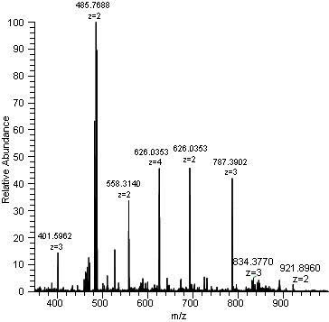
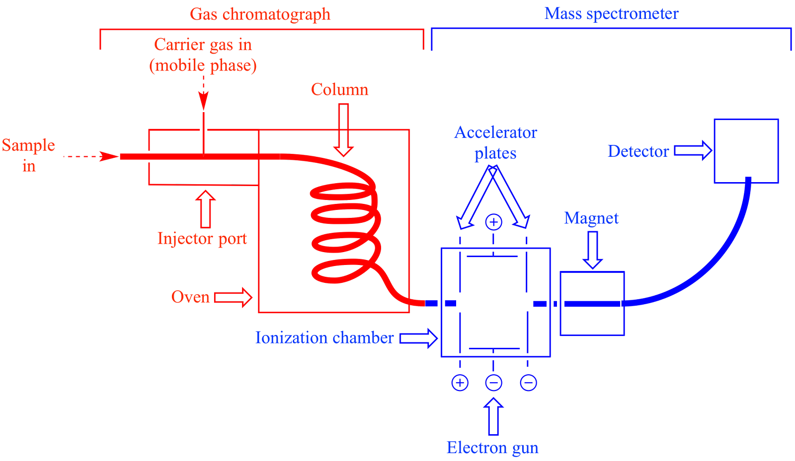
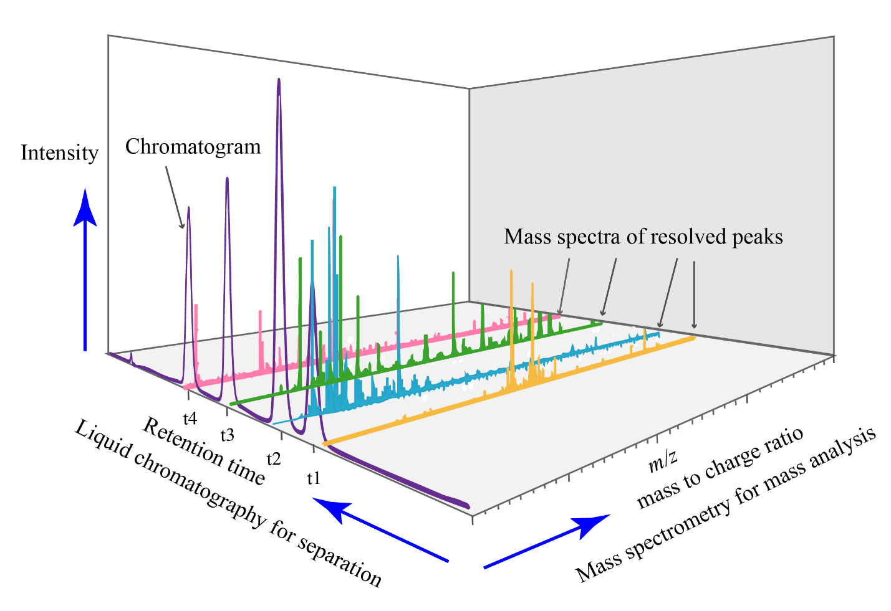
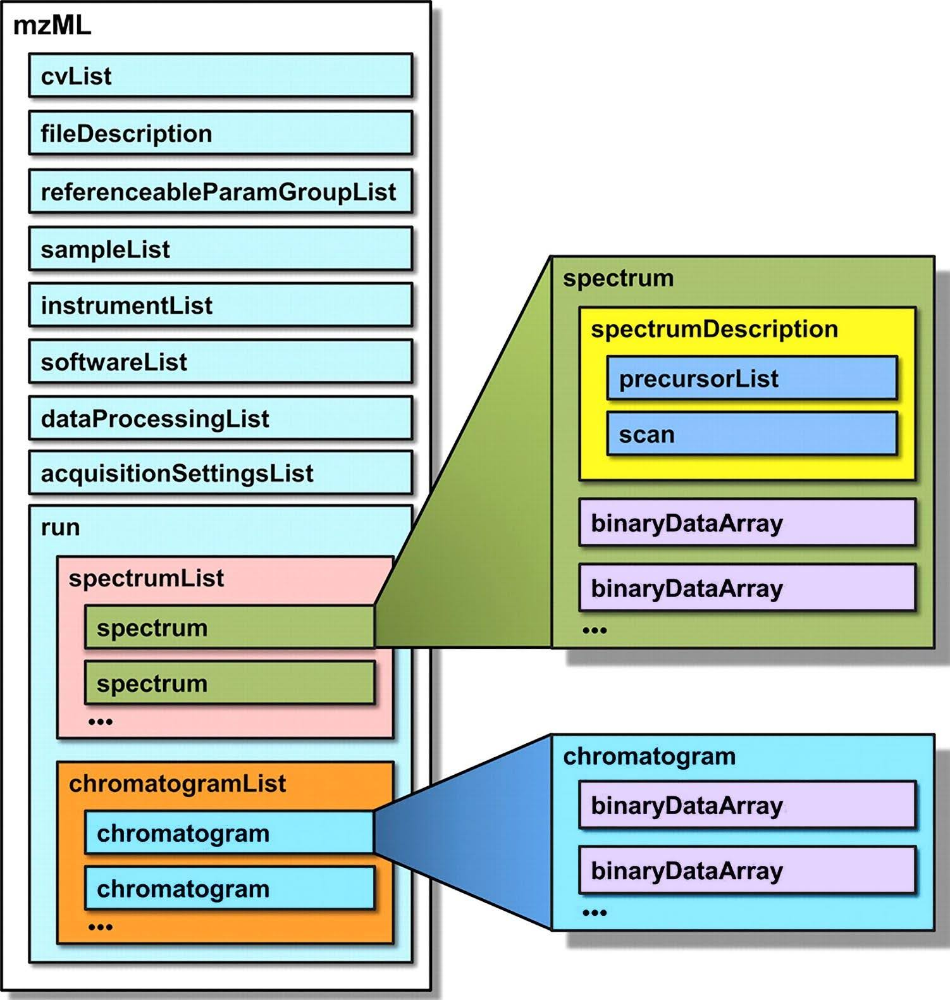

# Mass Spectrometry Primer

Authors: Brian Westra, University of Iowa; Ye Li, Massachusetts Institute of Technology; Nick Ruhs, Florida State University; Leah Rae McEwen, Cornell University

DCN Mentors: Lisa Johnston and Wendy Kozlowski

Affiliate Contributors (external peer reviewers): Meghan Lafferty

# Overview

|  Topic  |  Description  |
| :------------- | :------------- |
| File Extensions – Proprietary formats | <li>.BAF</li><li>.D (folder)</li><li>.DAT</li><li>.FID</li><li>.ita</li><li>.itm</li><li>.lcd</li><li>.MS</li><li>.PKL</li><li>.QGD</li><li>.qgd</li><li>.RAW*</li><li>.raw*</li><li>.SMS</li><li>.spec</li><li>.t2d</li><li>.tdc</li><li>.TDF</li><li>.WIFF</li><li>.XMS</li><li>.YEP</li>  *” .raw/.RAW” files by different vendors are not compatible with each other |
| Open Formats (some of the most commonly used) | <li>mzML</li><li>mzXML</li><li>netCDF / ANDI-MS</li><li>.mzMLb</li><li>JCAMP-DX</li><li>.csv</li> |
| Structure| Data structure may vary significantly, depending on the instrument, vendor’s software, or conversion utility. Structure and location of metadata may also vary from source to source.The essential elements of a mass spectrum are the mass-to-charge ratio (m/z) of the ions present in a sample plotted against their intensities measured and calculated by the instrument. |
| Primary fields or areas of use | Mass spectrometry is used by multiple disciplines to identify and quantify chemical substances, from biochemistry and molecular biology, to chemistry, engineering, and environmental sciences. |
| Source and affiliation | Mass spectrometry instruments are manufactured by many vendors, generating data files in their own proprietary formats. See Table 1. |
| Metadata standards | Multiple metadata guidelines have been promulgated by interested groups and organizations. Some important instrument-generated metadata is embedded in the original, proprietary files.    The appropriate metadata will generally be determined by the field of research, type of analysis, and choice of repository. Other factors to consider are data integration; facilitating analysis across large numbers of spectra; and creation of libraries for identification of analytes. |
| Key questions for curation review| <li>Which type of research/study generated the data?</li><li>Is there a relevant data repository?</li><li>Can the data be converted to an open format?</li><li>What kinds of metadata are recommended or required by the repository?</li>|
| Tools for curation review | ProteoWizard: MSConvert  ThermoRawFileParser  MZMine2, MZMine3|
| Date Created | December 2023 |
| Created by | Brian Westra, University of Iowa  Ye Li, Massachusetts Institute of Technology  Nick Ruhs, Florida State University  Leah Rae McEwen, Cornell University   DCN Mentors: Lisa Johnston and Wendy Kozlowski |
| Date updated and summary of changes made | Dec 2023-Initial upload |

**Suggested Citation:** Westra, B., Li, Y., Ruhs, N., and McEwen, L. (2023). Mass Spectrometry Primer. [Data Curation Network GitHub Repository.](https://github.com/DataCurationNetwork/data-primers)

## Table of Contents

[Description of Data Type and Formats](#description-of-data-type-and-formats)

> [Overview](#overview-1)

[Research Domains](#research-domains)

> [Proteomics](#proteomics)
>> [Data Repositories](#data-repositories) 
>> [Recommended Open Data Formats](#recommended-open-data-formats)

> [Metabolomics](#metabolomics)
>> [Data Repositories](#data-repositories-1) 
>>  [Recommended open formats](#recommended-open-formats)

> [Other MS Data Sources](#other-ms-data-sources)

>> [Target and non-target screening](#target-and-non-target-screening) 
>> [Other Biological and Environmental Research](#other-biological-and-environmental-research) 
>> [Data Repositories](#data-repositories-2) 
>> [Recommended open formats](#recommended-open-formats-1)

[File Conversion Tools](#file-conversion-tools)

> [MS Convert](#ms-convert) 
> [ThermoRawFileParser](#thermorawfileparser) 
> [MZMine2 and MZMine3](#mzmine2-and-mzmine3) 
> [Others](#others)

[Curation Steps](#curation-steps)

> [Metadata standards and core elements](#metadata-standards-and-core-elements)
>> [Metadata Files and Templates](#metadata-files-and-templates)

[Key questions to ask yourself](#key-questions-to-ask-yourself)

[Key clarifications to get from the researcher](#key-clarifications-to-get-from-the-researcher)

[Curation actions log: documenting the process](#curation-actions-log-documenting-the-process)

[Appendix A: Common Chemical Identifiers](#appendix-a-common-chemical-identifiers)

[Appendix B: Chemical Structure Files](#appendix-b-chemical-structure-files)

[References](#references)

# Description of Data Type and Formats

## Overview

Mass Spectrometry (abbreviated here as MS, not to be confused with mass
spectroscopy) is an analytical technology to identify chemical
substances through measuring the mass-to-charge ratio (m/z) for
molecules (or their fragments/components) in a sample. The resulting
spectrum shows the calculated intensity of peaks from various
mass-to-charge ratios (Figure 1). This information may be used to
identify unknown substances, quantify known substances, and identify
chemical and structural properties of chemicals. Typically, the
resulting spectra are compared to a library of known substances through
a computational process to identify which compounds are present.

The mass spectrometer uses an ionizer to ionize the substances into
fragments carrying different charges. The ion fragments then enter the
mass analyzer where they will be accelerated to various speeds depending
on their mass-to-charge ratio (m/z). The ion fragments are detected when
they leave the mass analyzer, and the intensity of the signal is
recorded accordingly.

<figure>  </figure>

Figure 1. Example of a mass spectrum.[^1]

In many cases, the sample is run through another instrument first to
separate chemical compounds from each other (see the schematic diagram
in Figure 2). These tools and methods, such as liquid chromatography
(LC) and, in the case below, gas chromatography (GC), pass the sample
through a column (or tube) that selectively slows down the passage of
molecules, based on their size and other factors. The result is that
different substances exit the LC or GC column at different times
(retention times) and then go directly into the mass spectrometer.

<figure> </figure>

Figure 2. Schematic representation of a GC-MS instrument.[^2]

In the case of GC-MS and LC-MS, the two systems are interconnected, and
frequently the chromatographic data (chromatographs) are reported along
with the MS data. In cases where an analysis is targeting a known
substance or substances, the retention times of those chemicals may be
used to select which resulting MS data is analyzed, and which is
ignored. There are also other mass spectrometry methods. In each case,
the type of sample, instrument(s), settings, and other factors will
together determine how the MS data is analyzed and interpreted to
identify or provide an idea of the chemical substance(s) in the sample.

The three-dimensional diagram of LC-MS data (Figure 3) may be helpful
for understanding the relationships between the chromatograph and the
mass spec data. The retention times are plotted on one axis, and the
mass spectrometry for mass analysis on the other axis. The retention
times for each peak are recorded as they come off the chromatography
column. The material is then sent into the mass spectrometry instrument
where the mass to charge ratio is measured. Together the two can be used
to identify each substance, and the amount of it in a sample.

While this primer is focused on mass spectrometry data, in some cases
the chromatographs are of greater importance, since they are used to
determine the amounts of specific substances present in a sample. For
instance, in an analysis of an environmental sample which may contain
PCBs (polychlorinated biphenyls) and other substances, sample
preparation and analytical methods are standardized so that only the
masses for the PCBs will be measured while others are ignored. The
resulting chromatograph is the focus because it provides the information
needed to quantify PCB concentrations.

<figure> </figure>

Figure 3. Liquid chromatography MS Spectrum 3D analysis.[^3] Image
by Daniel Norena-Caro, CC0 1.0

Raw data files generated by MS instruments are usually in proprietary
formats and dependent on software from those instrument manufacturers
(i.e., Agilent, Bruker, Shimadzu, Thermo). In addition, the number of
files, location and organization of data and metadata, and relationships
between files generated from each analysis can vary considerably from
one vendor to another. . These proprietary data files typically cannot
be read without the instrument software, although some programs are
available that can convert them to open formats. A list of proprietary
formats can be found in the Wikipedia entry of Mass Spectrometry data
format, which are presented in Table 1[^4].

Table 1. Proprietary mass spectrometry file formats.[^5]

|  Topic  |  Description  |  Description  |
| :------------- | :------------- | :------------- |
| Agilent | .AEV, .ASR | ASCII Report format (for Analytical Studio Reviewer) |
| Bruker | .BAF | instrument data format  |
| Agilent Bruker | .D (folder) | Agilent MassHunter, Agilent ChemStation, or Bruker BAF/YEP/TDF data format  |
| Chromtech Finnigan*** VG  | .DAT | Finnigan ITDS file format; MAT95 instrument data format MassLab data format  |
| Bruker | .FID | instrument data format |
| ION-TOF | .ita | analysis data |
| ION-TOF | .itm | raw measurement data |
| Shimadzu | .lcd | QQQ/QTOF instrument data format |
| Finnigan*** | .MS | ITS40 instrument data format |
| Waters | .PKL | MassLynx peak list format |
| Shimadzu  | .qgd | instrument data format |
| Shimadzu  | .QGD | GCMSSolution format |
| Physical Electronics/ULVAC-PHI | .raw* | raw measurement data |
| Thermo  PerkinElmer  | .RAW* | Thermo Xcalibur   PerkinElmer TurboMass |
| Micromass**/Waters | .RAW* (folder) | Waters MassLynx |
| Bruker/Varian | .SMS | instrument data format |
| Shimadzu  | .spc | library data format |
| ABI/Sciex | .t2d | 4700 and 4800 file format |
| Physical Electronics/ULVAC-PH | .tdc | spectrum data |
| Bruker | .TDF | timsTOF instrument data format |
| ABI/Sciex | .WIFF | instrument data format |
| Bruker/Varian  | .XMS | instrument data format|
| Agilent/Bruker  | .YEP | instrument data format |
| ACD/Labs  | *.spectrus | Imports LC/MS and GC/MS data from most major instrument vendors listed here |

\* Note that the RAW formats of each vendor are not interchangeable;
software from one cannot handle the RAW files from another.  
\*\* Micromass was acquired by Waters in 1997  
\*\*\* Finnigan is a division of Thermo

The conversion of proprietary raw MS data files to open formats may
impact metadata information that is embedded in the original files. For
example, instrument configurations and other settings may get lost
during file conversion. Some commercial MS software may allow the data
files to be exported into a text file in comma separated value (CSV)
format, but the resulting files might not contain all the information
from the original data. A third-party file conversion tool, such as
MSConvert, may be able to extract relevant metadata.

The major components of MS data are the mass-to-charge ratio (m/z) for
each ion, its peak intensity, and the annotation of the ion identity,
labeled as an [empirical
formula](https://en.wikipedia.org/wiki/Chemical_formula#Empirical_formula).
The relevant metadata, in separate files or embedded in the data files
themselves, may describe the chemical compound(s) and identifiers,
instrument settings and parameters, and other experimental conditions.

In addition to the characterization of pure single-chemical substances,
other applications of MS include research into proteins and peptides
(proteomics); the processes and products of chemical or biological
breakdown of substances (metabolomics, lipidomics, and transformation
products); and analysis of environmental samples (e.g., high resolution
non-target MS).

The substance(s) or chemical processes that are being analyzed, and the
analytical methods and instrumentation will strongly influence the
selection of a repository, and curatorial choices. In coordination with
data depositors, curators should consider the following when determining
the most appropriate resources and curation steps for publishing MS
data:

1.  The research domain or type of investigation and substances being researched (e.g., proteomics, metabolomics, environmental sampling).

2.  Availability of a repository specific to that data and analytical method.

3.  Ability of the repository system, and the data and metadata, to enable discovery and facilitate computational analysis across datasets.

4.  Researcher and curator capacities to prepare and provide the necessary files and information for a given repository.

Mass spectrometry data is highly variable, and this primer attempts to
address the most common sources of MS data. Keep in mind that standards
and repository infrastructure will evolve alongside new computational
approaches, instruments, and methodologies that may generate new file
formats and data processing techniques.

# Research Domains

In curating MS data, the first factor to consider is the type of
investigation that generated the data. Some of the more common research
domains are described in the following sections.

## Proteomics

Proteomics studies the set of proteins thought to be expressed by an
organism (the proteome) within the context of that organism, an organ,
or a biological context.[^6] MS methods are frequently used in
proteomics research, and a number of repositories have been created to
meet data sharing needs. The ProteomeXchange Consortium[^7] has played a
leading role in addressing data sharing, and groups such as the
Proteomics Standards Initiative[^8] have helped implement open data
formats.

### Data Repositories

Table 2. Repositories for Proteome Data.[^9]

| Name                                                                                                                         | Description                                                                                 |
|------------------------------------------------------------------------------------------------------------------------------|---------------------------------------------------------------------------------------------|
| [IntAct ](https://www.ebi.ac.uk/intact/home)                                                                          | Information about protein interactions                                                      |
| [iProx](https://www.iprox.cn/)                                                                                        | Integrated proteome resources center, China                                                 |
| [jPOSTrepo (Japan ProteOme STandard Repository)](https://repository.jpostdb.org/)                                     | Public data repository for shotgun proteomics, Japan                                        |
| [MassIVE (Mass Spectrometry Interactive Virtual Environment)](https://massive.ucsd.edu/ProteoSAFe/static/massive.jsp) | Proteins, peptides, peptide variants                                                        |
| [Panorama Public](https://panoramaweb.org/home/project-begin.view?)                                                   | Targeted mass spectrometry assays from Skyline                                              |
| [PeptideAtlas](http://www.peptideatlas.org/overview.php)                                                              | Annotations of eukaryotic genomes through validation of expressed proteins                  |
| [PASSEL (PeptideAtlas SRM Experiment Library)](http://www.peptideatlas.org/passel/)                                   | SRM (Selected Reaction Monitoring) experimental results from analysis of biological samples |
| [PRIDE (Proteomics Identification Database)](https://www.ebi.ac.uk/pride/)                                            | Experimental evidence of published protein and peptide identifications                      |
| [Reactome ](https://reactome.org/)                                                                                    | Protein functions in human biological pathways                                              |
| [UniProtKB (UniProt Knowledgebase)](https://www.uniprot.org/)                                                         | Protein sequences and functional information                                                |

### Recommended Open Data Formats

Repositories for proteomic data will determine the file format(s) that
they will accept for raw data deposits. One of the more common formats
is mzML, which was created in 2009 as an alternative to mzXML and mzData
and became a widely adopted standard for MS data in 2011.[^10]

Other formats have been proposed or advanced in order to reduce file
storage demands, and facilitate computational research on a “big data”
scale across large sets of spectral data. For instance, mzMLb was
created in 2021 and utilizes an HDF5 file format.[^11]

## Metabolomics

“Metabolomics is the large-scale study of small molecules, commonly
known as metabolites, within cells, biofluids, tissues or organisms.
Collectively, these small molecules and their interactions within a
biological system are known as the metabolome.”[^12] Lipidomics (the
study of lipid metabolism in biological systems) and exposomics
(exposure assessment methods)[^13] share enough similarities with these
methods that the resulting data could be curated similarly.

These analytical approaches might also be employed in toxicology and
environmental research to identify and quantify known (or unknown)
substances created by the chemical or biological transformation of
hazardous chemicals.

### Data Repositories

Table 3. Data Repositories for Metabolomic MS Data.

|  Name  |  Description  |
| :------------- | :------------- |
|  <a href="https://www.metabolomicsworkbench.org/">Metabolomics Workbench</a>, and the National Metabolomics Data Repository (NMDR)  |  Repository for metabolomics data and  metadata. NMDR provides metabolomics data for small and large studies on cells, tissues and organisms via the Metabolomics Workbench  |
|  <a href="https://mona.fiehnlab.ucdavis.edu/">MassBank of North America</a>  <a href="https://massbank.eu/MassBank/">MassBank.eu</a> <a href="http://www.massbank.jp/">MassBank Japan</a>  |  Single substance mass spectral libraries for the identification of small chemical molecules of metabolomics, exposomics and environmental relevance  |
|  <a href="https://massive.ucsd.edu/ProteoSAFe/static/massive.jsp">MassIVE (Mass Spectrometry Interactive Virtual Environment)</a>  |  Mainly proteomics data but also accepts metabolomics data. |
|  <a href="https://www.ebi.ac.uk/metabolights/">MetaboLights</a> |  Repository for metabolomics studies, their raw experimental data and associated metadata  |
|  <a href="https://www.ebi.ac.uk/chebi/">ChEBI</a>  |  Chemical Entities of Biological Interest, containing manually annotated small molecular entities (molecules not encoded by the genome)  |

### Recommended open formats

The open file formats mxML, mzXML, and CDF are noted as common formats
for raw MS data files and accepted by the Metabolomics Workbench.[^14]

## Other MS Data Sources

### Target and non-target screening

Non-target screening can be used to identify substances (e.g.,
contaminants, products of metabolism) from complex chemical mixtures of
unknown materials. This type of analysis is “associated with studies
where the \[High Resolution Mass Spectrometry\] (HRMS) is used for the
identification of known unknowns, unknown unknowns, sample
fingerprinting, and source tracking, with little to no prior knowledge
regarding the chemical composition of the samples.”[^15] For instance,
this method may be applied to environmental monitoring.[^16]

### Other Biological and Environmental Research

Certain other methods are employed when looking for the presence (or
absence) of a known substance or group of substances. As above, samples
may be from environmental or biological sources. Since the analysis is
restricted to a group of known compounds, the sample preparation
methods, instrument configurations, and computational workflow are
different than non-target and high resolution methods. They are also
frequently standardized and well-documented (e.g., the EPA method for
analysis for PCBs by GC-MS[^17]) to support replicability.

### Data Repositories

Some of the domain repositories might also accept MS data from these
categories, for example,
[MassBank.eu](https://massbank.eu/MassBank/) and [MassBank
Japan](http://www.massbank.jp/) accept single-substance mass spectra of small
molecules with exposomics and environmental relevance. But at this time,
there is not a repository specifically designed for these types of data,
and it is difficult to find similar data. This may be due to the lack of
a dedicated repository, or other factors. This results in limited access
to raw data, and inability to compare instrument methods and
results.[^18]

In cases where a domain repository does not exist, an institutional
repository or general subject repository might be an appropriate option
for preserving and sharing these data. However, these generalist
repositories usually do not have a metadata schema able to support the
kinds of details specific to MS data that are often used to locate,
review and filter search results.

### Recommended open formats

There doesn’t appear to be a consensus on an open file format for MS
data from these types of studies. This may be due in part to relatively
new non-target methods and data analysis processes. On the other hand,
environmental monitoring has employed MS for quite some time. There are
several compelling reasons for using mzML:

- file conversion utilities are available to generate this type of data from proprietary file formats

- mzML files typically retain metadata from the data files (see Figure 4), and

- there is broad support for this format as far as tools and uptake across the research community.

As with metabolomics and proteomics, some repositories and research
projects may prefer to use and support other data formats.[^19]

<figure> </figure>

Figure 4. A schematic representation of mzML, showing key elements of
the format. Each rectangle represents an XML element.[^20] See article
for a full description.

# File Conversion Tools

Research communities have developed several tools to convert proprietary
formats into open formats.

### MS Convert

The MS Convert app is part of the ProteoWizard package
([http://proteowizard.sourceforge.net/download.html](http://proteowizard.sourceforge.net/download.html))
and is frequently mentioned in the literature for converting proprietary
formats into mzML and other formats. There are several settings for the
file conversion that should be reviewed before starting. A useful guide
for MSConvert is at
[https://ccms-ucsd.github.io/GNPSDocumentation/fileconversion/](https://ccms-ucsd.github.io/GNPSDocumentation/fileconversion/)

### ThermoRawFileParser

This app is freely available
(<https://github.com/compomics/ThermoRawFileParser> ) and converts
Thermo RAW files to the mzML format.[^21] The resulting files may
contain a range of metadata: file properties, instrument properties,
sample data, scan settings, and mass spec information.

### MZMine2 and MZMine3

This program is primarily for LC-MS data and is available at
<http://mzmine.github.io/>. It can convert several different proprietary
file formats into open formats.[^22]

### Others

Some repositories may host or provide online conversion tools for data
depositors, and instrument vendor software may be able to export raw
data into open formats. For instance, GNPS provides their own online
conversion tool, plus a list of instrument maker-provided tools, and
instructions for converting files to mzXML and mzML with other tools
too: <https://ccms-ucsd.github.io/GNPSDocumentation/fileconversion/>

# Curation Steps

Curating MS data is typically an iterative process informed by
conversations with the data depositor/researcher. Listed below are the
likely steps to be taken:

1.  Identify the repository(ies) that are most appropriate for the data and metadata:

1.  Identify the research topic or target, e.g., proteomics, metabolomics, environmental sampling, chemical synthesis and characterization.

2.  Evaluate the alignment between the research data topic, type of data, data analysis and metadata, and potential repository(ies). Is there a repository that is well-suited to the research topic and the methods, including computational approaches, that may have been used to analyze the data, and will make the data available to the broader community?

    1.  Factors such as the computational methods used for the data analysis may influence the choices

    2.  For instance, a study that characterizes products of bioremediation might be better suited to MassIVE than Metabolomic Workbench, by virtue of the nature of the characterization, the computational process that was used and the metadata that are available.

2.  Data review and deposit

    1.  Identify the open file format(s) that are in scope for the repository(ies) per the repository’s data deposit instructions.

    2.  If the raw MS data files are in a proprietary format, inquire if the researcher (or instrument center manager) can export the data from the instrument vendor system to a preferred or acceptable open format. If not, see File Conversion Tools above for MSConvert and other tools to convert the data to an open format.

3.  Metadata review and deposit

    1.  Review the repository’s guidelines and templates for metadata and documentation if the data depositor wants assistance. Robust structured metadata can improve data discoverability. It also assists users in determining which properties and data files can be read and indexed by the repository or other computational processes.

    2.  If the repository does not specify details specific to MS data (e.g., an institutional or generalist repository) see the following section for additional metadata that might be included.

## Metadata standards and core elements

In cases where a domain repository does not exist, an institutional or
generalist repository may be appropriate. These types of repositories
typically have a limited capacity for structured domain-specific
metadata, but some of this information can also be represented through
text files (study summaries/ abstracts, methods, readme files) and
tabular files (metadata templates, data dictionaries, structure-data
files, identifiers tables).

Curators and researchers will need to assess which properties and levels
of detail are necessary to enable discovery, as well as the types of
computational approaches that may subsequently be applied to their data.

Various options are presented in Tables 4 and 5 (below), recognizing
that not all approaches may apply to all types of chemicals studied, and
some types of documentation may include or overlap with others.

Table 4 provides an overview of the different options for recording
typical properties for MS data.

Table 4. Optional metadata properties and respective files /
templates.

<table>
<colgroup>
<col style="width: 39%" />
<col style="width: 10%" />
<col style="width: 1%" />
<col style="width: 10%" />
<col style="width: 1%" />
<col style="width: 11%" />
<col style="width: 2%" />
<col style="width: 9%" />
<col style="width: 2%" />
<col style="width: 11%" />
</colgroup>
<thead>
<tr class="header">
<th rowspan="2">Properties</th>
<th colspan="9">Metadata templates and other files</th>
</tr>
<tr class="odd">
<th colspan="2">Readme, other text files</th>
<th colspan="2">ReDU template spread- 
sheet</th>
<th colspan="2">Substance identifiers .csv file</th>
<th colspan="2">Data dictionary</th>
<th>Other files</th>
</tr>
<tr class="header">
<th>A. Bibliographic information</th>
<th> </th>
<th colspan="2"> </th>
<th colspan="2"> </th>
<th colspan="2"> </th>
<th colspan="2"> </th>
</tr>
<tr class="odd">
<th>Dataset title, authors/creators, date of publication, publisher, and
resource type. Most repositories will collect this information since
these are mandatory DataCite metadata</th>
<th colspan="9"></th>
</tr>
<tr class="header">
<th>B. Sample and study information</th>
<th> </th>
<th colspan="2"> </th>
<th colspan="2"> </th>
<th colspan="2"> </th>
<th colspan="2"> </th>
</tr>
<tr class="odd">
<th>Abstract or well-written study summary (a paragraph describing the
goal and design of the experiment for the benefit of the general
research community)</th>
<th>✔</th>
<th colspan="2"></th>
<th colspan="2"></th>
<th colspan="2"></th>
<th colspan="2"></th>
</tr>
<tr class="header">
<th>Methods (also often provided separately in more detail via
properties below)</th>
<th>✔</th>
<th colspan="2"></th>
<th colspan="2"></th>
<th colspan="2"></th>
<th colspan="2"> </th>
</tr>
<tr class="odd">
<th>List of files with descriptions and relationships between files</th>
<th>✔</th>
<th colspan="2"></th>
<th colspan="2"></th>
<th colspan="2">✔</th>
<th colspan="2"> </th>
</tr>
<tr class="header">
<th>Funder(s) e.g., ROR ID, and grant number (use funder’s preferred
grant number format if specified, such as <a
href="https://grants.nih.gov/policy/federal-funding.htm">NIH</a>)</th>
<th>✔</th>
<th colspan="2"></th>
<th colspan="2"></th>
<th colspan="2"></th>
<th colspan="2"></th>
</tr>
<tr class="odd">
<th>Sample names and experimental variables, including controls,
treatments, file names</th>
<th>✔</th>
<th colspan="2">✔</th>
<th colspan="2"></th>
<th colspan="2">✔</th>
<th colspan="2"></th>
</tr>
<tr class="header">
<th>Sample type(s); source/subject (e.g., organism/tissue/source)</th>
<th>✔</th>
<th colspan="2">✔</th>
<th colspan="2"></th>
<th colspan="2"></th>
<th colspan="2"></th>
</tr>
<tr class="odd">
<th>Date(s) of sampling, data collection</th>
<th>✔</th>
<th colspan="2">✔</th>
<th colspan="2"></th>
<th colspan="2"></th>
<th colspan="2"></th>
</tr>
<tr class="header">
<th>Funder and grant ID</th>
<th>✔</th>
<th colspan="2">✔</th>
<th colspan="2"></th>
<th colspan="2"></th>
<th colspan="2"></th>
</tr>
<tr class="odd">
<th>C. Instrument, analytical details</th>
<th> </th>
<th colspan="2"> </th>
<th colspan="2"> </th>
<th colspan="2"> </th>
<th colspan="2"> </th>
</tr>
<tr class="header">
<th>Sample extraction and preparation methods / protocols</th>
<th>✔</th>
<th colspan="2">✔</th>
<th colspan="2"></th>
<th colspan="2"></th>
<th colspan="2"></th>
</tr>
<tr class="odd">
<th>Internal standards (with measurements)</th>
<th>✔</th>
<th colspan="2">✔</th>
<th colspan="2"></th>
<th colspan="2"></th>
<th colspan="2"></th>
</tr>
<tr class="header">
<th>Mass spec Instrument, settings, methods</th>
<th>✔</th>
<th colspan="2">✔</th>
<th colspan="2"></th>
<th colspan="2"></th>
<th colspan="2"></th>
</tr>
<tr class="odd">
<th>Chromatography instrument, settings, used to isolate or purify
compound</th>
<th>✔</th>
<th colspan="2">✔</th>
<th colspan="2"></th>
<th colspan="2"></th>
<th colspan="2"></th>
</tr>
<tr class="header">
<th>Resolution, accuracy, precision of the data</th>
<th>✔</th>
<th colspan="2"></th>
<th colspan="2"></th>
<th colspan="2">✔</th>
<th colspan="2"></th>
</tr>
<tr class="odd">
<th>D. Data processing</th>
<th> </th>
<th colspan="2"> </th>
<th colspan="2"> </th>
<th colspan="2"> </th>
<th colspan="2"> </th>
</tr>
<tr class="header">
<th>Computational tools and methods (e.g., vendor software, Python, R;
version, libraries)</th>
<th>✔</th>
<th colspan="2"></th>
<th colspan="2"></th>
<th colspan="2"></th>
<th colspan="2">Code deposit</th>
</tr>
<tr class="odd">
<th>IUPAC (International Union of Pure and Applied Chemistry) name</th>
<th>✔</th>
<th colspan="2"></th>
<th colspan="2">✔</th>
<th colspan="2"></th>
<th colspan="2"></th>
</tr>
<tr class="header">
<th>Total exact mass</th>
<th></th>
<th colspan="2"></th>
<th colspan="2">✔</th>
<th colspan="2"></th>
<th colspan="2"></th>
</tr>
<tr class="odd">
<th>Molecular formula</th>
<th></th>
<th colspan="2"></th>
<th colspan="2">✔</th>
<th colspan="2"></th>
<th colspan="2"></th>
</tr>
<tr class="header">
<th>Molecular structure diagram. Typically included for novel substances
or disambiguation</th>
<th></th>
<th colspan="2"></th>
<th colspan="2"></th>
<th colspan="2"></th>
<th colspan="2">e.g. .mol files</th>
</tr>
<tr class="odd">
<th>F. Substance Identifiers</th>
<th></th>
<th colspan="2"></th>
<th colspan="2"></th>
<th colspan="2"></th>
<th colspan="2"></th>
</tr>
<tr class="header">
<th>Computed Descriptors: Two or more of these if possible: InChI,
InChIKey, SMILES</th>
<th></th>
<th colspan="2"></th>
<th colspan="2">✔</th>
<th colspan="2"></th>
<th colspan="2"></th>
</tr>
<tr class="odd">
<th>IUPAC Name</th>
<th></th>
<th colspan="2"></th>
<th colspan="2">✔</th>
<th colspan="2"></th>
<th colspan="2"></th>
</tr>
<tr class="header">
<th>Database Identifiers: One or more of the following: PubChem CID,
DSSTox Substance ID, ChemSpider ID, others</th>
<th></th>
<th colspan="2"></th>
<th colspan="2">✔</th>
<th colspan="2"></th>
<th colspan="2"></th>
</tr>
<tr class="odd">
<th>Chemical Abstracts Registry Number (CAS RN)</th>
<th></th>
<th colspan="2"></th>
<th colspan="2">✔</th>
<th colspan="2"></th>
<th colspan="2"></th>
</tr>
</thead>
<tbody>
</tbody>
</table>

### Metadata Files and Templates

There are several options for compiling the metadata, including readme
files, as well as templates and basic tables.

#### Readme

Readme files for MS data can be derived from a template, such as the one
provided by Cornell University Libraries at
<http://data.research.cornell.edu/content/readme>. Additional
information can be included in the readme under sections using the
Properties headings that are noted in Table 4.

#### ReDU Sample Information Template

This spreadsheet template (either tab delimited or a Google Sheet
format:
[https://docs.google.com/spreadsheets/d/1v71bnUd8fiXX51zuZIUAvYETWmpwFQj-M3mu4CNsHBU/edit#gid=381997835](https://docs.google.com/spreadsheets/d/1v71bnUd8fiXX51zuZIUAvYETWmpwFQj-M3mu4CNsHBU/edit#gid=381997835)
) is used by the Global Natural Products Social Molecular Networking
(GNPS) to collect information about tandem mass spectrometry data files
deposited in the MassIVE repository.[^23] This template could easily be
repurposed for information about other MS data by adding/removing
columns, and instructions are provided in the [GNPS
documentation](https://ccms-ucsd.github.io/GNPSDocumentation/metadata/).
For a minimal approach, it could be used to collect study-level
information rather than file-level metadata.

One of the advantages of this template is that it incorporates drop-down
selection boxes for terminology and descriptions that have been compiled
in a linked table/sheet, managed by GNPS. Some terminology will be
specific to MS/MS and GNPS, but this enables greater standardization of
some information, such as NCBI Taxonomy, Mass Spectrometer,
Chromatography and Phase, etc. Curators could either collaborate with
GNPS to add new terms as needed or pull a copy of the spreadsheet for
their own local use (but would lose any updates by GNPS).

Table 5. Simplified ReDU Sample Information Template: Information and
column descriptions.

\- For GNPS purposes each row in the table is about a file in the
dataset.

\- This table is for illustrative purposes; not all columns from the
source are included in this example.

| Column Name                                                    | Data Type               | Brief Description                                                                                                                                                                                                            | Example                                     |
|--------------------------------------------------------------------|-----------------------------|----------------------------------------------------------------------------------------------------------------------------------------------------------------------------------------------------------------------------------|-------------------------------------------------|
| SampleType                                                     | character string            | enter an option from the controlled vocabulary. If additional options are required contact the admins                                                                                                                            | human                                           |
| Sample Type Substance                                          | character string            | enter an option from the controlled vocabulary.                                                                                                                                                                                  | biofluid                                        |
| NCBI Taxonomy                                                  | character string            | enter an option from the controlled vocabulary - If additional options are required contact the admins.                                                                                                                          | 9606\|Homo sapiens                              |
| Year Of Analysis                                               | integer                     | enter the year in which the data were collected, must be a value between 2000-2030 (if other years are needed please contact admins)                                                                                             | 2017                                            |
| Sample Collection Method                                       | character string            | enter an option from the controlled vocabulary, please contact the admins for additional options.                                                                                                                                | blood draw, venous                              |
| Sample Extraction Method                                       | character string            | enter an option from the controlled vocabulary, please contact the admins for additional options.                                                                                                                                | methanol-water (4:1)                            |
| Internal Standards Used                                        | character string            | enter an option from the controlled vocabulary, please contact the admins for additional options.                                                                                                                                | none                                            |
| Mass Spectrometer                                              | character string            | enter an option from the controlled vocabulary, please contact the admins for additional options. Uses the Mass Spectrometry ontology, [https://www.ebi.ac.uk/ols/ontologies/ms](https://www.ebi.ac.uk/ols/ontologies/ms) | impact HD\|MS:1002667                           |
| Ionization Source And Polarity                                 | character string            | enter an option from the controlled vocabulary, please contact the admins for additional options.                                                                                                                                | electrospray ionization (positive)              |
| Chromatography And Phase                                       | character string            | enter an option from the controlled vocabulary, please contact the admins for additional options.                                                                                                                                | reverse phase (C18)                             |
| Human subject information: age, disease, location, population… | Integers, character strings | See the ReDU guidance                                                                                                                                                                                                            | See the ReDU example on the GNPS guidance site. |

#### Chemical mass, formula, structure.

1.  Total exact mass can be derived from the structure file, or for known substances could be taken from chemical substance databases (e.g. PubChem).

2.  Molecular formula can be derived from the structure file, or, for known substances, could be taken from chemical substance databases (e.g. PubChem).

3.  A molecular structure diagram is typically included for a novel substance, or to distinguish the substance of interest if there are multiple substances that could have the same formula. See Appendix B for structure file information.

Files generated from chemical drawing programs contain specific
information about the chemical structures that can be parsed by many
software programs; MOLfile is the most common format (more examples in
Appendix B).

#### Substance Identifiers/Descriptors

Computed identifiers and database identifiers should be provided for all
identified substances. A table with these identifiers and other
information could provide this information with a minimal level of
effort. See Appendix B for more information about individual identifiers
/ descriptors.

Computed or Structural identifiers / descriptors

These are generated or computed by software from a structure file for
the compound. These descriptors include the IUPAC name, InChI/InChIKey,
and canonical/isomeric SMILES, and providing at least two of these is
preferable, to facilitate integration with other systems.

Researchers or curators can generate these identifiers from structure
files using common chemistry drawing programs (see Appendix A) or open
tools such as the NIH [Chemical Identifier
Resolver](https://cactus.nci.nih.gov/chemical/structure).

Alternatively, if compounds are known and present in prominent public
databases or repositories, these identifiers can be included to help
other researchers easily link to more information.

- IUPAC names if specific compounds or chemical classes are known.

  - Consult with the researcher to also include common names and synonyms used in their research field (e.g., PCB-12) for easier referral for practicing researchers, especially to indicate groups or classes of related chemicals. PubChem or Common Chemistry may also be a good source for synonyms in common use.

- InChI and InChIKey

- Isomeric or canonical SMILES

  - Groups of related chemicals can be represented by including individual identifiers for each specific chemical

  - InChI and SMILES have complementary functions in many databases so both can be included when available

Database Identifiers

If compounds are known and present in prominent public databases or
repositories, these database identifiers can be included to help other
researchers easily link to more information:

- Common open database identifiers include: PubChem Compound ID, DSSTox ID, ChemSpider ID, MassBank ID, and others.

- CAS Registry Number is proprietary and many that appear in public sources are not verified, so confirm these with the depositor.

- Database identifiers can be helpful especially for substances that are commonly used but not easily represented by any of the above options (e.g., mixtures, natural products).

Table of Identifiers and Descriptors

These descriptors, identifiers, and other compound information could be
compiled into a .csv table. See Table 5 for an example. The first
row/column headings indicate the data content of each column; each
subsequent row corresponds to those identifiers or properties, one row
per substance.

Finally, depositors may also supply names (synonyms) for the substances,
which may include trade names and common names from the domain. A
comment field could be included in the table for additional
details.[^24]

Table 5. Example of a chemical structure data template file for
interoperable chemical information.[^25]

| Name     | SMILES                                  | InChIKey                | PubChem CID | IUPAC Name                                                      | Synonym  | CAS RN   | Exact Mass | Molecular formula |
|--------------|---------------------------------------------|-----------------------------|-----------------|---------------------------------------------------------------------|--------------|--------------|----------------|-----------------------|
| 6PPD         | CC(C)CC(C)NC1=CC=C(C=C1)NC2=CC=CC=C2        | ZZMVLMVFYMGSMY-UHFFFAOYSA-N | 13101           | 4-*N*-(4-methylpentan-2-yl)-1-*N*-phenylbenzene-1,4-diamine         | Santoflex 13 | 793-24-8     | 268.1939488    | C18H24N2              |
| 6PPD-quinone | CC(C)CC(C)NC1=CC(=O)C(NC2=CC=CC=C2)=CC1(=O) | UBMGKRIXKUIXFQ-UHFFFAOYSA-N | 154926030       | 2-anilino-5-(4-methylpentan-2-ylamino)cyclohexa-2,5-diene-1,4-dione |              | 2754428-18-5 | 298.1681279    | C18H22N2O2            |

# Key questions to ask yourself

1.  Can I identify a relevant domain repository for this data?

2.  If there is a domain repository, does the depositor need assistance with the deposit?

3.  If an institutional or generalist repository is an appropriate option, can I open the file or collection of files (sometimes called a project)? Is there a specific software that is required to open the file and extract the data? Are the files available in an open/interoperable format? See “File formats” in the relevant Domain section, and “File Conversion Tools”.

4.  Do the files need to be migrated to a more open/interoperable format (e.g., from .raw to mzML)?

    1.  Are there any special considerations for the file migration (e.g., software requirements, responsible parties)?

5.  Did the authors include appropriate documentation and metadata? See “Metadata Standards”.

    1.  Is there detailed information on the structure, contents, and layout of the data files, either in a README file or other data documentation?

    2.  Experimental and instrument conditions used to obtain the data should be listed as part of a README or other data documentation.

    3.  Information on the instruments themselves (manufacturer, model, installed software, etc.) is also helpful.

6.  If specific chemical substances are identified in the study, does the metadata include specific chemical identifier information? See “Substance Descriptors/Identifiers” for more information.

7.  Do the repository, dataset and metadata meet stakeholder and community expectations for findability, access, interoperability, and reuse?

    1.  Does the repository meet [Desirable Characteristics for Data Repositories](https://sharing.nih.gov/data-management-and-sharing-policy/sharing-scientific-data/selecting-a-data-repository#desirable-characteristics-for-all-data-repositories)?

    2.  Are data files in standard and/or commonly available open formats as much as possible, and described relative to specific file types, software requirements and/or conversion information?

    3.  Are all associated data files unambiguously named in the metadata and described relative to their scientific nature?

    4.  Does the metadata description include standard scientific identifiers and terminology (e.g., IUPAC InChIs, IUPAC nomenclature, IUPAC terminology, etc.)

    5.  Does the metadata include/use machine-readable standards such as ORCIDs (authors/contributors), ISO international date standard, etc?

    6.  Are related articles referenced and linked in the metadata?

    7.  Is the citation format for the dataset provided, including license attribution?

# Key clarifications to get from the researcher

1.  What type of study (domain) generated the data?

2.  Have you identified a repository that you would prefer to use? If so, do any of the domain repositories appear to be a good match for your study and the data processing/analysis methods you used?

3.  What software (and version) did you use to export your data, and is it in an open format? If not, would you be able to export to an open format from the instrument software, or will you need software to make the conversion?

4.  Are there specific considerations for viewing and analyzing the data, such as software, processing capabilities, intellectual property issues, or privacy issues?

5.  Does your metadata include information on the experimental or instrumental conditions used to collect the data?

6.  Who do we contact if we have questions about the data?

# Curation actions log: documenting the process

1.  Type of file format(s) and data file organization.

2.  Changes made between versions or file formats, particularly if converting between a proprietary or instrument specific format and an open format.

3.  Software that was used to open the data files or for any file conversions.

4.  Chemical identifier information used and/or requested from researchers, if applicable.

5.  Changes requested from researchers so that metadata files meet applicable metadata standards.

# Appendix A: Common Chemical Identifiers

For discrete chemical compounds, including one or more of the common
identifiers can facilitate re-use and later analysis as these
identifiers can be matched across multiple datasets. Most common types
of identifiers are either machine-readable specifications based on
chemical structures (computed identifiers), or associated with the
record numbers from specific databases (database identifiers), such as
PubChem.

The machine-readable identifiers are strings that contain specific
information about the chemical structures and can be directly parsed by
many chemistry software programs for further analysis. Researchers or
curators can generate these identifiers from structure files using
common chemistry drawing programs (see Appendix B) or open tools such as
the NIH [Chemical Identifier
Resolver](https://cactus.nci.nih.gov/chemical/structure).

Once generated, identifier strings can be copied directly into metadata
templates. Database identifiers should be looked up in the source
database to verify specific chemicals so it can be helpful to include a
link to the database record if there is an open one available.

Table 1. Common Chemical Identifiers

<table style="width:100%;">
<colgroup>
<col style="width: 16%" />
<col style="width: 15%" />
<col style="width: 14%" />
<col style="width: 15%" />
<col style="width: 24%" />
<col style="width: 14%" />
</colgroup>
<thead>
<tr class="header">
<th>Identifier Name</th>
<th>Source</th>
<th>Type</th>
<th>Applies to</th>
<th>Example (caffeine)</th>
<th>Notes</th>
</tr>
<tr class="odd">
<th>
InChI and InChIKey

[International Chemical Identifier]
</th>
<th>IUPAC; 
InChI Trust</th>
<th>Open specification, structure based</th>
<th>Discrete chemicals, small organic molecules</th>
<th>
InChI=1S/C8H10N4O2/c1-10-4-9-6-5(10)7(13)12(3)8(14)11(6)2/h4H,1-3H3

InChIKey: <mark>RYYVLZVUVIJVGH-UHFFFAOYSA-N</mark>
</th>
<th>Include both InChI and InChIKey</th>
</tr>
<tr class="header">
<th>
SMILES

[Simplified Molecular-Input Line-Entry System]
</th>
<th>Daylight Systems Inc.; OpenSMILES</th>
<th>Open specification, structure based</th>
<th>Discrete chemicals, small organic molecules</th>
<th>CN1C=NC2=C1C(=O)N(C(=O)N2C)C</th>
<th>Can vary by generating software</th>
</tr>
<tr class="odd">
<th>PubChem Compound ID</th>
<th>PubChem, National Library of Medicine</th>
<th>Open database record identifier</th>
<th>Discrete chemicals</th>
<th>2519 <a
href="https://pubchem.ncbi.nlm.nih.gov/compound/Caffeine">https://pubchem.ncbi.nlm.nih.gov/compound/Caffeine</a></th>
<th></th>
</tr>
<tr class="header">
<th>
CAS RN

[Chemical Abstracts Service Registry Number]
</th>
<th>CAS, American Chemical Society</th>
<th>Proprietary database record identifier</th>
<th>Registered substances, including mixtures, polymers and other
complex substances</th>
<th>58-08-2 <a
href="https://commonchemistry.cas.org/detail?cas_rn=58-08-2">https://commonchemistry.cas.org/detail?cas_rn=58-08-2</a></th>
<th>CAS Common Chemistry is an open source for some CAS RNs</th>
</tr>
</thead>
<tbody>
</tbody>
</table>

# Appendix B: Chemical Structure Files

Researchers might generate structural diagrams as part of their research
and publication. While image versions of these diagrams are often used
in manuscripts, it can be helpful for re-use to also deposit the
original drawing files as these contain specific information about the
chemical structures that can be parsed by many software programs.

Most structure formats are text-based files using a general connection
table motif. However, specific annotation conventions in these files are
often proprietary or otherwise used in many different ways and may not
be correctly interpreted by different software programs. MOLfile can be
generated and read by most programs as a more generic version of the
format.

Table 2. Common Chemical Structure File Formats

<table>
<colgroup>
<col style="width: 16%" />
<col style="width: 14%" />
<col style="width: 20%" />
<col style="width: 22%" />
<col style="width: 26%" />
</colgroup>
<thead>
<tr class="header">
<th>Format</th>
<th>Extension</th>
<th>Source</th>
<th>Type</th>
<th>Notes</th>
</tr>
<tr class="odd">
<th>ChemDraw</th>
<th>.cdx 
.cdxml</th>
<th><a
href="https://www.cambridgesoft.com/services/documentation/sdk/chemdraw/cdx/General.htm">ChemDraw</a>
(PerkinElmer)</th>
<th>Proprietary connection table</th>
<th>Very common chemical drawing program</th>
</tr>
<tr class="header">
<th>Marvin</th>
<th>.mrv</th>
<th><a
href="https://docs.chemaxon.com/display/docs/marvin-documents-mrv.md">MarvinSketch</a>
(ChemAxon)</th>
<th>Proprietary connection table</th>
<th></th>
</tr>
<tr class="odd">
<th>MOLfile</th>
<th>.mol</th>
<th>Biovia/MDL</th>
<th>Proprietary connection table, open documentation</th>
<th><em>defacto</em> standard use by most drawing software</th>
</tr>
<tr class="header">
<th>SDFile</th>
<th>.sdf</th>
<th>Biovia</th>
<th>Proprietary connection table, open documentation</th>
<th>Preferred version for many cheminformatics programs</th>
</tr>
</thead>
<tbody>
</tbody>
</table>

These programs may also be able to generate computed identifiers such as
SMILES, IUPAC Name, InChI and InChIKey from the structure/drawing file.

# References

[^1]: [What is Mass Spectrometry? \[Internet\]. Broad Institute. 2010
    \[cited 2022 Jun 27\]. Available from:](about:blank)
    <https://www.broadinstitute.org/technology-areas/what-mass-spectrometry>

[^2]: Hardinger S. Illustrated Glossary of Organic Chemistry - Gas
    chromatography-mass spectrometry (GC-MS) \[Internet\]. Illustrated
    Glossary of Organic Chemistry. \[cited 2022 Jun 27\]. Available
    from:
    [http://www.chem.ucla.edu/~harding/IGOC/G/gc_ms.html](http://www.chem.ucla.edu/~harding/IGOC/G/gc_ms.html)

[^3]: [File:Liquid chromatography MS spectrum 3D analysis.png. In:
    Wikipedia \[Internet\]. 2017 \[cited 2023 Jan 23\]. Available
    from:](about:blank)
    <https://en.wikipedia.org/w/index.php?title=File:Liquid_chromatography_MS_spectrum_3D_analysis.png&oldid=770313763>

[^4]: [Mass spectrometry data format. In: Wikipedia \[Internet\]. 2022
    \[cited 2022 Jul 11\]. Available from:
    https://en.wikipedia.org/w/index.php?title=Mass_spectrometry_data_format](about:blank)

[^5]: [Mass spectrometry data format. In: Wikipedia \[Internet\]. 2022
    \[cited 2022 Jul 11\]. Available from:
    https://en.wikipedia.org/w/index.php?title=Mass_spectrometry_data_format](about:blank)

[^6]: EMBL-EBI. What is proteomics? \| Proteomics \[Internet\]. \[cited
    2022 Jun 27\]. Available from:
    [https://www.ebi.ac.uk/training/online/courses/proteomics-an-introduction/what-is-proteomics/](https://www.ebi.ac.uk/training/online/courses/proteomics-an-introduction/what-is-proteomics/)

[^7]: The ProteomeXchange consortium \[Internet\]. ProteomeXchange
    Consortium. 2023 \[cited 2023 Jan 23\]. Available from:
    [http://www.proteomexchange.org/](http://www.proteomexchange.org/)

[^8]: [HUPO - Proteomics Standards Initiative (PSI) \[Internet\].
    \[cited 2023 Jan 23\]. Available from:
    https://hupo.org/Proteomics-Standards-Initiative-(PSI)](about:blank)

[^9]: Perez‐Riverol Y, Alpi E, Wang R, Hermjakob H, Vizcaíno JA. Making
    proteomics data accessible and reusable: Current state of proteomics
    databases and repositories. PROTEOMICS \[Internet\]. 2015 Mar
    \[cited 2022 Jul 14\];15(5–6):930–50. Available from:
    [https://onlinelibrary.wiley.com/doi/10.1002/pmic.201400302](https://onlinelibrary.wiley.com/doi/10.1002/pmic.201400302)
    : [Fondrie WE, Bittremieux W, Noble WS. ppx: Programmatic Access to
    Proteomics Data Repositories. J Proteome Res \[Internet\]. 2021 Sep
    3 \[cited 2022 Aug 15\];20(9):4621–4. Available from:](about:blank)
    [https://doi.org/10.1021/acs.jproteome.1c00454](https://doi.org/10.1021/acs.jproteome.1c00454)

[^10]: Martens L, Chambers M, Sturm M, Kessner D, Levander F, Shofstahl
    J, et al. mzML - A community standard for mass spectrometry data.
    Mol Cell Proteomics. 2011;10(1):1–7.

[^11]: [Bhamber RS, Jankevics A, Deutsch EW, Jones AR, Dowsey AW. MzMLb:
    A Future-Proof Raw Mass Spectrometry Data Format Based on
    Standards-Compliant mzML and Optimized for Speed and Storage
    Requirements. J Proteome Res. 2021;20(1):172–83.](about:blank)

[^12]: EMBL-EBI. What is metabolomics? \| Metabolomics \[Internet\].
    \[cited 2022 Jun 27\]. Available from:
    [https://www.ebi.ac.uk/training/online/courses/metabolomics-introduction/what-is/](https://www.ebi.ac.uk/training/online/courses/metabolomics-introduction/what-is/)

[^13]: Exposome and Exposomics \| NIOSH \| CDC \[Internet\]. 2022
    \[cited 2022 Oct 10\]. Available from:
    [https://www.cdc.gov/niosh/topics/exposome/default.html](https://www.cdc.gov/niosh/topics/exposome/default.html)

[^14]: Metabolomics Workbench: Upload and Manage Experimental Data and
    Metadata. \[Internet\]. \[cited 2022 Aug 16\]. Available from:
    [https://www.metabolomicsworkbench.org/data/DRCCDataDeposit.php](https://www.metabolomicsworkbench.org/data/DRCCDataDeposit.php)

[^15]: Schulze B, Jeon Y, Kaserzon S, Heffernan AL, Dewapriya P, O’Brien
    J, et al. An assessment of quality assurance/quality control efforts
    in high resolution mass spectrometry non-target workflows for
    analysis of environmental samples. TrAC Trends Anal Chem
    \[Internet\]. 2020 Dec 1 \[cited 2022 Aug 22\];133:116063. Available
    from:
    [https://www.sciencedirect.com/science/article/pii/S0165993620302922](https://www.sciencedirect.com/science/article/pii/S0165993620302922)

[^16]: Hollender J, van Bavel B, Dulio V, Farmen E, Furtmann K,
    Koschorreck J, et al. High resolution mass spectrometry-based
    non-target screening can support regulatory environmental monitoring
    and chemicals management. Environ Sci Eur \[Internet\]. 2019;31(1).
    Available from:
    [https://doi.org/10.1186/s12302-019-0225-x](https://doi.org/10.1186/s12302-019-0225-x)

[^17]: US EPA O. SW-846 Test Method 8082A: Polychlorinated Biphenyls
    (PCBs) by Gas Chromatography \[Internet\]. 2015 \[cited 2022 Aug
    18\]. Available from:
    [https://www.epa.gov/hw-sw846/sw-846-test-method-8082a-polychlorinated-biphenyls-pcbs-gas-chromatography](https://www.epa.gov/hw-sw846/sw-846-test-method-8082a-polychlorinated-biphenyls-pcbs-gas-chromatography)

[^18]: Hawkes JA, D’Andrilli J, Agar JN, Barrow MP, Berg SM, Catalán N,
    et al. An international laboratory comparison of dissolved organic
    matter composition by high resolution mass spectrometry: Are we
    getting the same answer? Limnol Oceanogr Methods \[Internet\]. 2020
    \[cited 2022 Aug 22\];18(6):235–58. Available from:
    [https://onlinelibrary.wiley.com/doi/abs/10.1002/lom3.10364](https://onlinelibrary.wiley.com/doi/abs/10.1002/lom3.10364)
    ; Schulze B, Jeon Y, Kaserzon S, Heffernan AL, Dewapriya P, O’Brien
    J, et al. An assessment of quality assurance/quality control efforts
    in high resolution mass spectrometry non-target workflows for
    analysis of environmental samples. TrAC Trends Anal Chem
    \[Internet\]. 2020 Dec 1 \[cited 2022 Aug 22\];133:116063. Available
    from:
    [https://www.sciencedirect.com/science/article/pii/S0165993620302922](https://www.sciencedirect.com/science/article/pii/S0165993620302922)

[^19]: [What is Mass Spectrometry? \[Internet\]. Broad Institute. 2010
    \[cited 2022 Jun 27\]. Available from:](about:blank)
    <https://www.broadinstitute.org/technology-areas/what-mass-spectrometry>;

[^20]: Martens L, Chambers M, Sturm M, Kessner D, Levander F, Shofstahl
    J, et al. mzML - A community standard for mass spectrometry data.
    Mol Cell Proteomics. 2011;10(1):1–7.

[^21]: Hulstaert N, Shofstahl J, Sachsenberg T, Walzer M, Barsnes H,
    Martens L, et al. ThermoRawFileParser: Modular, Scalable, and
    Cross-Platform RAW File Conversion. J Proteome Res \[Internet\].
    2020 Jan 3 \[cited 2022 Jul 12\];19(1):537–42. Available from:
    [https://doi.org/10.1021/acs.jproteome.9b00328](https://doi.org/10.1021/acs.jproteome.9b00328)

[^22]: Pluskal T, Castillo S, Villar-Briones A, Orešič M. MZmine 2:
    Modular framework for processing, visualizing, and analyzing mass
    spectrometry-based molecular profile data. BMC Bioinformatics
    \[Internet\]. 2010 Dec \[cited 2022 Jul 7\];11(1):1–11. Available
    from:
    [http://bmcbioinformatics.biomedcentral.com/articles/10.1186/1471-2105-11-395](http://bmcbioinformatics.biomedcentral.com/articles/10.1186/1471-2105-11-395)

[^23]: Schymanski EL, Bolton EE. FAIR chemical structures in the Journal
    of Cheminformatics. J Cheminformatics \[Internet\]. 2021 Dec \[cited
    2022 Jul 14\];13(1):1–3. Available from:
    [https://jcheminf.biomedcentral.com/articles/10.1186/s13321-021-00520-4](https://jcheminf.biomedcentral.com/articles/10.1186/s13321-021-00520-4)

[^24]: Schymanski EL, Bolton EE. FAIR chemical structures in the Journal
    of Cheminformatics. J Cheminformatics \[Internet\]. 2021 Dec \[cited
    2022 Jul 14\];13(1):1–3. Available from:
    [https://jcheminf.biomedcentral.com/articles/10.1186/s13321-021-00520-4](https://jcheminf.biomedcentral.com/articles/10.1186/s13321-021-00520-4)

[^25]: Schymanski EL, Bolton EE. FAIR chemical structures in the Journal
    of Cheminformatics. J Cheminformatics \[Internet\]. 2021 Dec \[cited
    2022 Jul 14\];13(1):1–3. Available from:
    [https://jcheminf.biomedcentral.com/articles/10.1186/s13321-021-00520-4](https://jcheminf.biomedcentral.com/articles/10.1186/s13321-021-00520-4)
