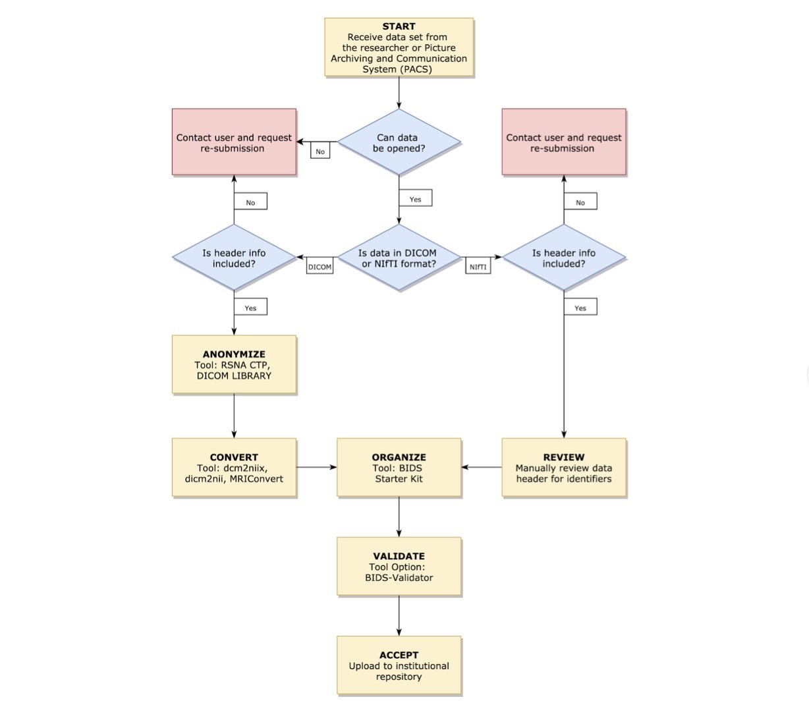
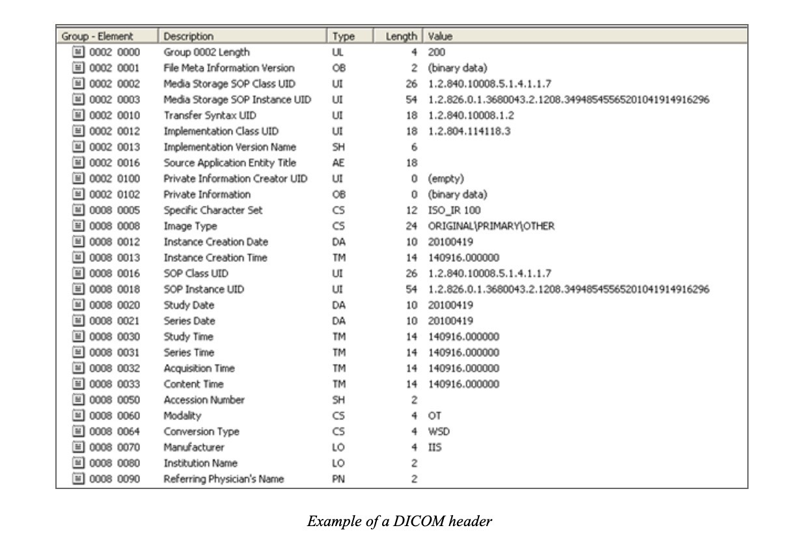
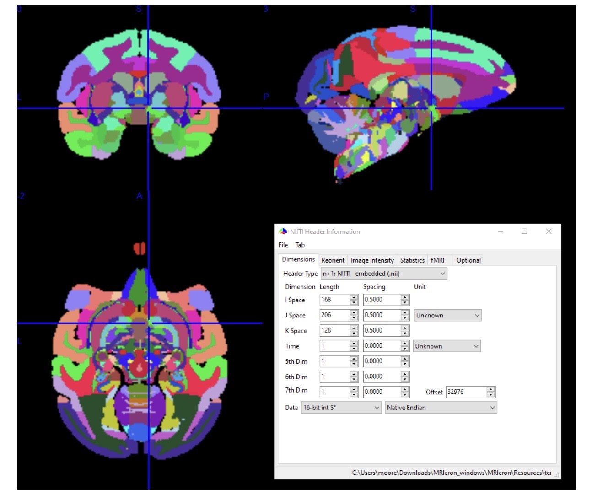
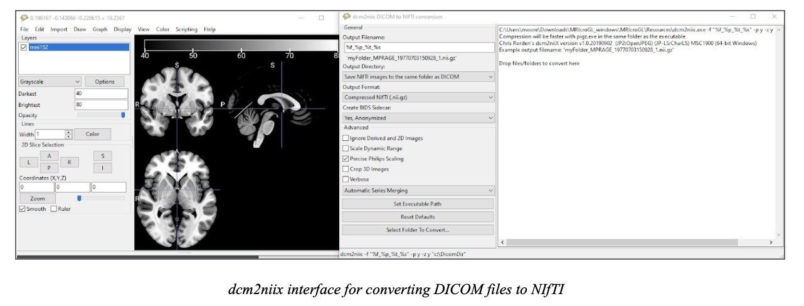

# Neuroimaging DICOM and NIfTI Primer

## Overview

|   Topic   |   Description   |
| :------------- | :------------- |
| FIle Extension | DICOM: .dcm; NIfTI: .nii (uncompressed), nii.gz (compressed)|
| MIME Type | application/dicom; image/nii |
| Structure | <ul><li>DICOM: A header with demographic information about the patient and metadata about the image(s), followed by image datasets.</li><li>NIfTI: Contains image dataset with an optional JSON file that contains metadata (if converted using dcm2niix).|
| Versions | NIFTI-1, NIFTI-2 (not bitwise compatible)|
| Primary fields or areas of use | Diagnostic medical imaging, medical informatics |
| Source and affiliation | <ul><li>NIfTI: The National Institute of Mental Health and the National Institute of Neurological Disorders and Stroke are joint sponsors of the initiative to define and maintain this format.</li><li>DICOM: The copyright for the DICOM Standard is held by the [National Electrical Manufacturers Association](https://www.nema.org/pages/default.aspx) (NEMA) on behalf of the DICOM Standards Committee, administered by the [Medical Imaging Technology Association](https://www.medicalimaging.org) (MITA)|
| Metadata standards |<ul><li>DICOM: Header consists of standardized series of tags</li><li>NIfTI: Header consists of standardized series of tags, but few relate to file administration (eg., owner/creator)</li><li>For general neuroimaging data: Brain Imaging Data Structure (BIDS)|
| Key questions for curation review |<ul><li>Has patient data been removed from the header of a DICOM file? </li><li>For high resolution structural images, have  facial features been removed from the images?</li><li>Has “burned-in” text been removed if PHI?</li><li>Are data in raw format? If not, has the researcher provided documentation of processing procedures?|
| Tools for curation review |<ul><li>Free software that can read DICOM header: Dicom Works, ImageJ</li><li>Free software that can open NIFTI headers and/or images: Mango, ImageJ, AFNI, MRIcron, MRIcroGL|
| Date Created | June 2020 |
| Created by |
**Authors:**   <ul><li>Michael Moore, University of Washington</li><li>Brandon Patterson, University of Utah</li><li>Sara Samuel, University of Michigan</li><li>Helenmary Sheridan, University of Pittsburgh</li><li>Chris Sorensen, Washington University in St. Louis 
  **DCN Mentor:** Joel Herndon, Duke University|
| Date updated and summary of changes made ||

**Suggested Citation:** Moore, Michael; Patterson, Brandon; Samuel, Sara; Sheridan, Helenmary; Sorensen, Chris. (2020). Neuroimaging DICOM and NIfTI Data Curation Primer. [Data Curation Network GitHub Repository.](https://github.com/DataCurationNetwork/data-primers)

This work was created as part of the “Specialized Data Curation” Workshop #3 held at Washington University in St.Louis, MO on November 5-6, 2019. These workshops have been generously funded by the Institute of Museum and Library Services # RE-85-18-0040-18.

# Table of Contents

[Introduction](#introduction)

[Curatorial pipeline](#curatorial-pipeline)

[Description of format](#description-of-format)

[Example datasets](#example-datasets)

[Software for viewing data](#software-for-viewing-data)

[Key curatorial considerations](#key-curatorial-considerations)

[Preservation actions](#preservation-actions)

[What to look for to make sure file meets Fair Principles](#what-to-look-for-to-make-sure-file-meets-fair-principles)

[Ways in which fields may use this format](#ways-in-which-fields-may-use-this-format)

[Documentation of Curation Process](#documentation-of-curation-process)

[References](#references)

# Introduction

Images of brains are essential for neuroscience research, but the complexity of the images and their associated data are a challenge to efficiently share and archive. The datasets are often large, consisting of many images, and researchers are interested in differing aspects of the data and images, from an entire set of images that create a “virtual brain” to just the metadata of particular types of scans. Curating these complex sources of data can be challenging, but this guide can help with curating a specific type of neuroimaging data: fMRI scans that are saved in either NIfTI or DICOM format. This guide includes a description of the formats, example datasets which you can view online, recommendations for software for viewing the data, key curatorial considerations, preservation actions, FAIR principles suggestions, ways to use the format and documentation of the curation process.

# Curatorial Pipeline

# Description of Format

Neuroimaging datasets used by researchers predominantly fall into two main file formats:

1. DICOM (Digital Imaging and Communications in Medicine), a ubiquitous and non-proprietary medical imagery format that facilitates communication and exchange across modalities and equipment manufacturers.

2. NIfTI (Neuroimaging Informatics Technology Initiative), a neuroimagery-specific format designed to support analysis beyond clinical workflow, developed from (and largely compatible with) an older format called ANALYZE.

Both formats offer their own respective pros and cons, and selecting between the two is largely dependent on the needs and niche of the end user. DICOM is complex, comprehensive, and highly specific to support needs across the entire spectrum of medical imaging and clinical workflows, while NIfTI is comparatively simple, minimalistic, and easy to support and better suited for research purposes (Li, 2016). Frequently, researchers will convert DICOM data output by a scanning instrument into NIfTI for analysis and dissemination.

## DICOM

**Extension: .dcm**

**Pros:**

- Ubiquitous international standard for medical imaging used across equipment manufacturers and modalities
- Highly detailed and descriptive header

**Cons:**

- Large file size hinders sharing
- Poorly suited to many popular image processing and analysis tools
- Contains information specific to a particular scan, which can include personally identifying health information

DICOM is the international standard (ISO 12052 “Health informatics — Digital imaging and communication in medicine (DICOM) including workflow and data management.”) for communication, access, and exchange of medical imaging, providing interoperability for care providers and researchers using medical imaging devices (scanners, servers, workstations, etc.) from different manufacturers. A pillar of modern radiological imaging, DICOM is inherently designed to support the spectrum of medical imaging needs by incorporating standards and protocols for many imaging modalities, including computed tomography (CT), magnetic resonance imaging (MRI), ultrasound, x-ray angiography, mammograms, and radiation therapy. Most imaging equipment exports directly to a DICOM file with a .dcm extension, though occasionally manufacturers opt for a proprietary version of the DICOM format with an alternate extension.

The standard was envisioned in the 1980s by the American College of Radiology (ACR) and the National Electrical Manufacturers Association (NEMA) to meet the combined needs of both care providers and equipment vendors. As digital technology blossomed through the 1980s and into the 1990s and early 2000s, DICOM has played a foundational role in establishing a widespread and non-proprietary data exchange protocol. Currently on version 3.0, the standard is revised annually by workgroups and committees to satisfy new and evolving needs of virtually any medical branch using medical imagery.

A foundational DICOM component is that the medical image should never be separated from key information about its creation. To accomplish that, DICOM data objects group image pixel data together with a header consisting of key public patient (name, age, sex, etc.), study (physician, study date, modality, etc.), and imaging (name of device, manufacturer, scanner settings, etc.) parameters into a consolidated dataset. This effectively embeds the most complete description of the procedure used into the image, similar to how a JPEG can be embedded with descriptive tags. This approach allows the image to effectively serve as its own description, and descriptive attributes can vary between imaging modalities. These public parameters are interoperable across manufacturer devices, though DICOM files may contain some proprietary private attributes as well.

Image pixel data can be compressed using various standards, including JPEG, lossless JPEG, JPEG-2000 and run-length encoding. However, due to the comprehensive and complex scope inherent in the format, DICOM file and dataset sizes can be a significant burden to data curators and a challenge to store in shared repositories. Each DICOM file is encoded as a single 2D slice rather than a comprehensive 3D image, meaning a single scan can result in dozens or hundreds of separate DICOM files to manage. Therefore, many neurological researchers prefer to convert DICOM files to the unified and comparatively simple NIfTI format to better support analysis and visualization.

## NIfTI

**Extension: .nii [uncompressed], nii.gz [compressed])**

**Pros:**

- Simpler and easier to manage than DICOM files
- Better suited to sharing and analysis

**Cons:**

- Strips away some metadata included in DICOM files
- Requires extra conversion step (May be completed by researcher or curator)

NIfTI is a neuroimaging-specific file format developed by the National Institutes of Health (NIH) in the early 2000s to improve on the previously-used ANALYZE format. NIfTI built on its predecessor by offering increased information storage for details like image orientation to avoid ambiguous interpretation and additional data type support. The format has had widespread adoption in the neuroimaging research community, benefiting the entire community by allowing researchers to adopt image processing, analysis, and visualization techniques and tools developed by colleagues in other teams and institutions (Li, 2016). The format is comprised of a header and uncompressed image data, either as separate files (.hdr and .img file formats, respectively) or combined into a unified .nii (uncompressed) or .nii.gz (compressed) file. In contrast to DICOM, which stores images in two-dimensional “slices,” NIfTI stores image data as a 3D image.

The 348-bit NIfTI header covers the technical parameters of the accompanying image, such as data scaling, slicing details, and axis information, as well as fields for brief description and naming. A detailed list of the included header elements can be found on the [Neuroimaging Informatics Technology Initiative’s Data Format Working Group page](https://nifti.nimh.nih.gov). NIfTI exists in two “flavors”: NIfTI-1 was updated in 2011 into a slightly extended version called NIfTI-2, and the two are not bitwise compatible. Both are used, but NIfTI-1 is much more common.

Image and NIfTI header information of the [INIA19 Primate Brain Atlas](https://www.nitrc.org/projects/inia19/), viewed using MRIcron.

# Example Datasets

## DICOM

**MRI:** [https://www.dicomlibrary.com/?manage=02ef8f31ea86a45cfce6eb297c274598](https://www.dicomlibrary.com/?manage=02ef8f31ea86a45cfce6eb297c274598)

**CT:** [https://www.dicomlibrary.com/?manage=1b9baeb16d2aeba13bed71045df1bc65](https://www.dicomlibrary.com/?manage=1b9baeb16d2aeba13bed71045df1bc65)

## NIfTI

### INIA19 Primate Brain Atlas

**Link:** [https://www.nitrc.org/projects/inia19/](https://www.nitrc.org/projects/inia19/)

**Citation:** Rohlfing, T., Kroenke, C. D., Sullivan, E. V., Dubach, M. F., Bowden, D. M., Grant, K., & Pfefferbaum, A. (2012). The INIA19 template and NeuroMaps atlas for primate brain image parcellation and spatial normalization. Frontiers in neuroinformatics, 6, 27.

# Software for viewing data

The software packages described in this section include some of the most frequently-used programs that may be mentioned in a curatorial interview with a researcher, as well as some relatively simple programs that a curator may use to open and examine a DICOM or NIfTI file. This list is far from exhaustive, as researchers frequently adapt and share new tools suited to their own interests. In addition, many popular tools such as Dicom Works are no longer officially supported by their developers, but continue to be used in research settings.

## ImageJ

ImageJ is open source software written in Java and it runs on Windows, Mac OS X, and Linux systems. Imagej includes a number of DICOM plugins including Import DICOM Sequences, DICOM Rewriter (Anonymizer), and Query DICOM Header. ImageJ can open NIfTI files using the optional [NIfTI I/O plugin](https://imagej.nih.gov/ij/plugins/nifti.html).

**Link:** [https://imagej.nih.gov/ij/](https://imagej.nih.gov/ij/)

## Dicom Works, OsiriX, IrfanView

DICOM-viewing software can be divided into two main categories: proprietary viewers that are supplied with the medical imaging system; and third-party DICOM-viewing software for individual PCs. Dicom Works (no longer supported as of 2011), OsiriX, and IrfanView are popular all-format, non-proprietary image-viewers available for free (or low-cost) download.

**Links:** 
- [https://www.dicomworks.com](https://www.dicomworks.com)
- [https://www.osirix-viewer.com](https://www.osirix-viewer.com)
- [https://www.irfanview.com](https://www.irfanview.com)

## Adobe Photoshop

Adobe has developed a plug-in for Photoshop that makes it possible to view DICOM images and header information and export images to different file formats.

**Citation:** Mustra, M., Delac, K., & Grgic, M. (2008). Overview of the DICOM Standard. 50th International Symposium ELMAR-2008. [https://www.vcl.fer.hr/papers_pdf/Overview%20of%20the%20DICOM%20Standard.pdf](https://www.vcl.fer.hr/papers_pdf/Overview%20of%20the%20DICOM%20Standard.pdf) 

## AFNI

AFNI (Analysis of Functional NeuroImages) is a free suite of C, Python, and R scripts developed by the National Institute of Mental Health (NIMH) to display and analyze (f)MRI data, primarily from NIfTI. AFNI can be used to read NIfTI header information, but requires using the command line. The command needed to check headers is nifti_tool -disp_hdr. Additional guidance available at [https://afni.nimh.nih.gov/pub/dist/doc/htmldoc/programs/nifti1_tool_sphx.html#ahelp-nifti1-tool.](https://afni.nimh.nih.gov/pub/dist/doc/htmldoc/programs/nifti1_tool_sphx.html#ahelp-nifti1-tool.)

**Link:** [https://afni.nimh.nih.gov/](https://afni.nimh.nih.gov/)

## Mango, Papaya, iMango

Mango is a set of three programs developed by the University of Texas Health Science Center’s Research Imaging Institute to view and analyze medical research images. Mango runs on Mac OS X, Linux, and Windows; Papaya is entirely browser-based; and iMango is for Apple’s iPad. All three support both DICOM and NIfTI (both versions).

**Link:** [https://mangoviewer.com/download.html](https://mangoviewer.com/download.html)

## MRIcron

MRIcron is a NIfTI image viewer that can be used across different platforms. It includes dcm2nii software to convert DICOM images to NIfTI format. 

**Link:** [https://www.nitrc.org/projects/mricron](https://www.nitrc.org/projects/mricron)

## MRIcroGL

MicroGL allows users to view images, convert DICOM images to NIfTI format, and draw regions of interest. It runs on Windows, Mac OS X, and Linux systems.

**Link:** [https://www.nitrc.org/projects/mricrogl](https://www.nitrc.org/projects/mricrogl)

# Key curatorial considerations

## Protected Health Information (PHI)

Curation of medical data adds an additional challenge not faced in other domains: datasets may include highly sensitive and identifying patient health information, a large portion of which is protected by strict federal laws like the Health Insurance Portability and Accountability Act (HIPAA). PHI includes a [list of 18 identifier classifications](https://privacyruleandresearch.nih.gov/pr_08.asp), such as names, geographic locations, dates, contact information, medical records and health plans, biometric identifiers, and full-face photographs. Depending on the type or purpose of a scan and how it was taken, some of these identifiers are always included in initial scans, others sometimes, and still others rarely.

Datasets submitted for curation should already be anonymized by the researchers or clinicians, but the responsibility may fall on the curators to ensure that the process has been done correctly before hosting the files. PHI may be found both in the image header (such as a patient’s name) and the image itself (such as details of a patient’s face). The DCN Primer on [Human Participants Data Essentials](https://github.com/DataCurationNetwork/data-primers/blob/main/Human%20Participants%20Data%20Essentials%20Data%20Curation%20Primer/human-participants-data-essentials-data-curation-primer.md) explains ethical quandaries due to human participant content and provides steps for screening de-identified data for remaining risk.

A large amount of personal information collected by the scanning device is inherently included in DICOM header files, which are generally prepared and exported directly from a scanning instrument. Due to DICOM’s broad scope, it would be unrealistic for generalist data curators to be expected to be able to read, analyze, and manually de-identify the data themselves. In some cases, DICOM images have textual information "burned in,” such as the date of a scan-PHI embedded in the pixel data. The ability to blackout "burned in" information is critical to maintaining patient confidentiality.

To the benefit of data curators, multiple tools are freely available to perform the task of anonymizing DICOM files. 
Aryanto et al. (2015) examined free DICOM de-identification tools by testing their performance on a list of 50 header elements, with mixed and inconsistent results. The authors cautioned these toolkits "be used with extreme care" since "they have a high risk of disclosing personal health information, especially when using the default configuration." Two toolkits emerged on top in the study: 

1. [Radiological Society of North America Clinical Trial Processor](http://mircwiki.rsna.org/index.php?title=CTP-The_RSNA_Clinical_Trial_Processor) (RSNA CTP): The CTP is a Java-based stand-alone program that offers a highly configurable and extensible environment for processing clinical trial and other medical imaging data. The program includes multiple modules and components, including a robust DICOM anonymizer. According to Aryanto et al., it scored a 98% de-identification success rate on its default settings, and a perfect 100% with custom settings.

2. [DICOM Library](https://www.dicomlibrary.com): DICOM Library is a free web-based sharing and anonymization service for medical imagery. Users can upload DICOM files to be automatically anonymized, then viewed, shared using the Library's online viewer, and downloaded. The DICOM Library scored a perfect 100% on the 50 listed headers in Aryanto's study.

Since NIfTI is a stripped-down and simplified version of DICOM, many PHI concerns are erased during the conversion process by the popular converter tools available. However, curators should know that NIfTI images may still require “defacing,” or “skull stripping” for removal or obscuration of a subject’s facial features.

## Format conversion

As a general rule, DICOM files can be converted to NIfTI format, but there is little benefit in going from NIfTI to DICOM. Once in NIfTI format, the file no longer has the granular and detailed information to take advantage of DICOM’s broad and complex header structures. However, the process is possible if the user wants to enter the file into a PACS (Picture Archiving and Communication System, usually used in clinical settings) that requires DICOM format.

Those rare occasions aside, a data curator may be expected to convert DICOM files into NIfTI, for which they can use the popular [dcm2niix tool](https://www.nitrc.org/plugins/mwiki/index.php/dcm2nii:MainPage). The successor to dcm2nii, the newer dcm2niix, is an open source program written in C to provide easy conversion from DICOM to NIfTI.

DICOM files can either be loaded into the program either through a drag-and-drop interface or by selecting an entire folder. Users can specify whether they want to anonymize the data during conversion and choose between uncompressed (.nii) and compressed (nii.gz) formats with an accompanying JSON file of header information as a sidecar.

Similar conversion packages are freely available online. Curators with access to MATLAB can use [dicm2nii](https://www.mathworks.com/matlabcentral/fileexchange/42997-xiangruili-dicm2nii) tools to convert, and [MRIConvert](https://lcni.uoregon.edu/downloads/mriconvert/mriconvert-and-mcverter) can be used for the same purpose.

## Metadata

Brain Imaging Data Structures (BIDS) is a standard for organizing neuroimaging data and specifying metadata. Using this format can help others to more quickly understand and use a shared dataset. The standard recommends sharing the neuroimaging data in the NIfTI file format (compressed preferred), with accompanying data and metadata in JSON files and tab delimited values (.tsv) files. Full specifications for the metadata file and recommended file organization can be viewed on the [Brain Imaging Data Structures documentation website](https://bids-specification.readthedocs.io/en/stable/02-common-principles.html).

The community-created [BIDS Starter Kit](https://github.com/bids-standard/bids-starter-kit), hosted on GitHub, provides a comprehensive collection of tutorials, templates, wikis, and other resources to help researchers and curators create BIDS datasets. In complementing the official documentation, the Starter Kit is designed to reduce the barrier to access for newcomers to BIDS, allowing for increased format adoption and open sharing of neurological datasets. It includes a forum and chat session to support questions related to BIDS and promotes involvement by encouraging submissions and contributions from the community.

The [BIDS Validator](https://bids-standard.github.io/bids-validator/) is a browser-based tool that automatically checks datasets to ensure they adhere to BIDS specifications. Node.js and Python versions are also available on the [BIDS Validator GitHub page](https://github.com/bids-standard/bids-validator). After identifying the curator identifies the directory to validate, the BIDS Validator examines the file structure, subdirectories, and image and JSON file names. The files themselves are not uploaded. The BIDS Validator returns a list of potential warnings and errors identified in the datasets that do not conform to BIDS standards.

While the BIDS Validator is useful in identifying potential issues, the red flags it raises should not necessarily be taken as gospel. The tool can sometimes produce nonsensical error reports that match the content of the dataset (Patterson, 2018). Curators are encouraged to check any errors reported by the BIDS Validator against the BIDS documentation, while also feeling comfortable to ignore errors deemed to be false positives.

## Key questions to ask yourself

- Is the header information included in the DICOM file?
- Has patient information been removed from the header of a DICOM file? 
- For high resolution structural images, have facial features been removed from images? If not, ask researcher to run defacing or skull stripping software.
- Has “burned-in” text been removed if identifiable?
- Are data in raw format? If not, has the researcher provided documentation of processing procedures?
- Is the dataset organized in a way to best facilitate being turned into a zip file (for downloading)?

## Key clarifications to get from researcher 

- Are data in raw format? If not, has the researcher provided documentation of processing procedures?

# Preservation Actions

DICOM and NIfTI files are formal, accessible, shared and broadly used standards. They are international standards that are well documented. 

## Most Reproducible and Reusable

1. Guidelines for data and documentation to be deposited during curation process (as shared with [Confocal Microscopy Image Primer](https://github.com/DataCurationNetwork/data-primers/blob/master/Confocal%20Microscopy%20Images%20Data%20Curation%20Primer/confocal-microscopy-images-data-curation-primer.md))
 
 - Processed data (includes transformed [converted to TIFF files]; analyzed files; annotated files). Note: researchers should preserve raw (proprietary) and other data as resources/storage allows, consistent with best practices for back-up. If funder or publisher requires all data to be accessible, link repository submission to the location of raw data. 
 
  1. Readme file that includes:
  
   - Detailed sample description
   - Detailed protocol to create processed data (link to publication)*
   
  2. Descriptive and technical metadata

## Good Enough Practice e.g. to fulfill a publisher’s mandate for a publication

1. Preserve only transformed data (or what was submitted to publication)

2. Readme file that includes:

 - Sample description
 - Protocol to create processed data (link to publication)*
 - Descriptive and technical metadata
 
3. *(Optional step) - Request more information, documentation, and suggest working to achieve Most Reproducible and Reusable

## Minimum Practice

1. Preserve what is received - raw (proprietary), transformed, processed/analyzed, annotated. Note: if receiving a compressed file type, there is no action that can recover lost bytes.

2. Readme file that includes:

 - Minimal sample description
 - Minimal protocol to create received dataset (link to publication)*
 - Descriptive and technical metadata
 
3. (Optional step)** - Request more information, documentation, and suggest working to achieve most Reproducible and reusable

* If the publication includes protocol that is detailed enough to completely reproduce raw data and is openly accessible. Providing the detailed process in the readme file is ideal, but including a link to a publication is good too. Best practice is to include both.

** The goal is always to curate and preserve the most reproducible and reusable data, while keeping in mind that the depositor may be under time constraint.

## Recommended Repositories

In the event that an institutional repository is unavailable or not a desired location for the data, the following two repositories may be useful resources:

## DICOM Library

This is a free online DICOM repository and sharing service for educational and scientific use. The site offers sample downloadable DICOM file packages from different modalities.

Link: [https://www.dicomlibrary.com](https://www.dicomlibrary.com)

## NITRC-IR

NITRC Image Repository is a resource for sharing neuroimaging data in DlCOM and NIFTI formats.

Link: [https://www.nitrc.org/xnat/index.php](https://www.nitrc.org/xnat/index.php)

# What to look for to make sure file meets Fair Principles

The following questions can assist researchers in evaluating the FAIRness of their neuroimaging data. The questions are organized according to each FAIR principle with help from the [dcmqi (DICOM for Quantitative Imaging)-guide FAQ section](https://qiicr.gitbook.io/dcmqi-guide/faq), formalized by [FORCE11](https://www.force11.org/group/fairgroup/fairprinciples):

## To be Findable:

|   FAIR Guiding principle   |   Neuroimaging Data   |
| :------------- | :------------- |
|F1. (meta)data are assigned a globally unique and persistent identifier|Does each object have a unique identifier?|
|F2. data are described with rich metadata (defined by R1 below)|Is the metadata stored in standardized attributes describing versatile aspects of the data (the subject being imaged, processing details, references to related objects, etc.)?|
|F3. metadata clearly and explicitly include the identifier of the data it describes|Is metadata stored in the same object as the processing result?|
|F4. (meta)data are registered or indexed in a searchable resource|Are objects and accompanying metadata file(s) stored in a repository with full index and search functionality? Is general-purpose search and indexing of DICOM data supported by every Picture Archival and Communications System (PACS) using DICOM Query and Retrieve protocol, or using REST-based [DICOMWeb](https://www.dicomstandard.org/using/dicomweb) protocol?|

## To be Accessible:

|   FAIR Guiding principle   |   Neuroimaging Data   |
| :------------- | :------------- |
|A1. (meta)data are retrievable, by their identifier using a standardized communication protocol|Is each object and accompanying medata able to be retrieved using a unique identifier? If the data files are not public, does the repository in which the data and metadata are stored permit retrieval of the data and metadata via a secure authentication protocols such as HTTPS or FTPS?|
|A1.1. the protocol is open, free, and universally implementable|Yes|
|A1.2. the protocol allows for an authentication and authorization procedure, where necessary|If using DICOMWeb, can it be integrated with existing authentication protocols defined by other standards?|
|A2. metadata is accessible, even when the data is no longer available|Does the repository where the neuroimaging data is stored permit the perpetual storage of the metadata about the file in the event that the data itself becomes unavailable? This may not be applicable, since metadata is stored alongside the data in the same object.|

## To be Interoperable:

|   FAIR Guiding principle   |   Neuroimaging Data   |
| :------------- | :------------- |
|I1. (meta)data use a formal, accessible, shared, and broadly applicable language for knowledge representation|Does the DICOM or NIfTI data meet international standards?|
|I2. (meta)data use vocabularies that follow FAIR principles|To meet file type standards, neuroimaging data can reuse vocabularies defined elsewhere, relying often on the terminology defined by [SNOMED-CT](https://searchhealthit.techtarget.com/definition/SNOMED-CT), [UCUM](http://unitsofmeasure.org/trac), [NCIt](https://ncit.nci.nih.gov/ncitbrowser/), [FMA](https://bioportal.bioontology.org/ontologies/FMA), and allows for integration with other vocabularies, including those defined by the user.|
|I3. (meta)data includes qualified references to other (meta)data|Do the derived objects include pointers to the datasets used in the derivation, including the purpose of reference and properly cite any related publications or datasets?|

## To be Reusable:

|   FAIR Guiding principle   |   Neuroimaging Data   |
| :------------- | :------------- |
|R1. (meta)data are richly described with a plurality of accurate and relevant attributes|Are data attributes included for a specific object defined by the standard, as a result of the community discussion and consensus process? Is the process of amending the standard formalized and open?|
|R2. (meta)data are released with a clear and accessible data usage license|This is not applicable; data usage license is selected by the data provider; the DICOM standard itself is available free of charge, and its implementation is not restricted by any licenses.|
|R1.2. (meta)data are associated with detailed provenance|The composite context is preserved across imaging and derived datasets describing patient and acquisition details.  Provenance-related attributes are included, depending on the specific object type.|
|R1.3. (meta)data meet domain-relevant community standards|DICOM is the main standard in the relevant medical imaging domain.|

# Ways in which fields may use this format

Researchers may aggregate datasets in order to overcome intersubject variability, or create population and subpopulation norms. Also, these files may be used to conduct reliability studies when new image processing software is developed or when training new study team members.

# Documentation of Curation Process

1. De-identification procedures requested from researcher

2. File conversion procedures from DICOM to NIfTI if applicable

3. Restructuring of file format to match BIDS organizing standard

# References

- Aryanto, K. Y. E., M. Oudkerk, and P. M. A. van Ooijen. "Free DICOM de-identification tools in clinical research: functioning and safety of patient privacy." European radiology 25, no. 12 (2015): 3685-3695. [https://doi.org/10.1007/s00330-015-3794-0](https://doi.org/10.1007/s00330-015-3794-0)
- Bennett, William, Kirk Smith, Quasar Jarosz, Tracy Nolan, and Walter Bosch. "Reengineering workflow for curation of DICOM datasets." Journal of digital imaging 31, no. 6 (2018): 783-791. [https://doi.org/10.1007/s10278-018-0097-4](https://doi.org/10.1007/s10278-018-0097-4)
- Gorgolewski, Krzysztof J., Tibor Auer, Vince D. Calhoun, R. Cameron Craddock, Samir Das, Eugene P. Duff, Guillaume Flandin et al. "The brain imaging data structure, a format for organizing and describing outputs of neuroimaging experiments." Scientific data 3, no. 1 (2016): 1-9. [https://doi.org/10.1038/sdata.2016.44](https://doi.org/10.1038/sdata.2016.44)
- Li, Xiangrui, Paul S. Morgan, John Ashburner, Jolinda Smith, and Christopher Rorden. "The first step for neuroimaging data analysis: DICOM to NIfTI conversion." Journal of neuroscience methods 264 (2016): 47-56. [https://doi.org/10.1016/j.jneumeth.2016.03.001](https://doi.org/10.1016/j.jneumeth.2016.03.001)
- Moore, Stephen M., David R. Maffitt, Kirk E. Smith, Justin S. Kirby, Kenneth W. Clark, John B. Freymann, Bruce A. Vendt, Lawrence R. Tarbox, and Fred W. Prior. "De-identification of medical images with retention of scientific research value." Radiographics 35, no. 3 (2015): 727-735. [https://doi.org/10.1148/rg.2015140244](https://doi.org/10.1148/rg.2015140244)
- Patterson, Diane. BIDS-Validator. University of Arizona Neuroimaging Core Documentation. (2018). [https://neuroimaging-core-docs.readthedocs.io/en/latest/pages/bids-validator.html](https://neuroimaging-core-docs.readthedocs.io/en/latest/pages/bids-validator.html)
- Poldrack, Russell A., and Krzysztof J. Gorgolewski. "Making big data open: data sharing in neuroimaging." Nature neuroscience 17, no. 11 (2014): 1510. [https://doi.org/10.1038/nn.3818](https://doi.org/10.1038/nn.3818)
- Smith, Kenneth, Sushil Jajodia, Vipin Swarup, Jeffrey Hoyt, Gail Hamilton, Donald Faatz, and Todd Cornett. "Enabling the sharing of neuroimaging data through well-defined intermediate levels of visibility." NeuroImage 22, no. 4 (2004): 1646-1656. [https://doi.org/10.1016/j.neuroimage.2004.03.048](https://doi.org/10.1016/j.neuroimage.2004.03.048)

