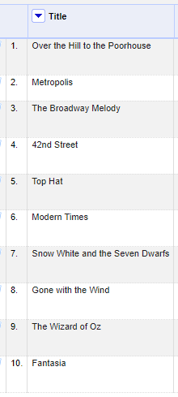
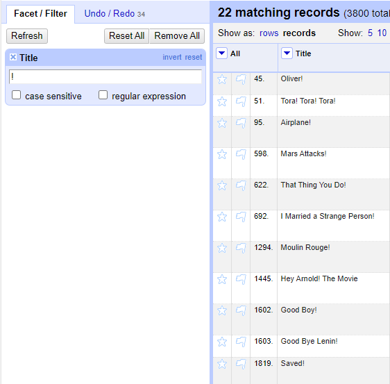
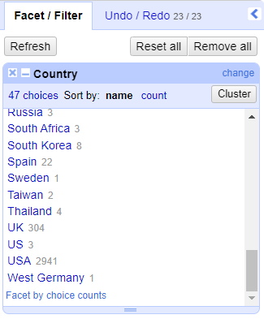
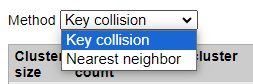
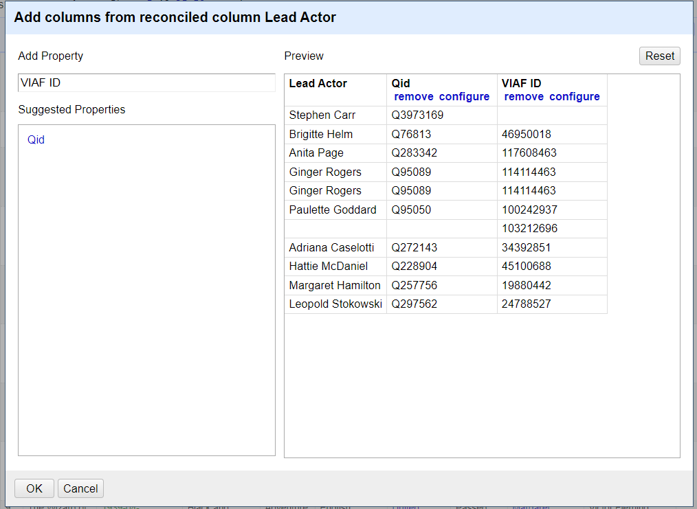

# OpenRefine Primer

Authors: Heather Charlotte Owen, Aditi Thite, Peyton Tvrdy

DCN Mentor: Sophia Lafferty-Hess, Duke University 

Affiliate Contributors (peer reviewers): Alexandra Provo, Kent Gerber, Sherry Lake, and Matthew Murray

Suggested Citation: Owen, Heather Charlotte; Thite, Aditi; and Tvrdy, Peyton. (2024). OpenRefine Primer. Data Curation Network [GitHub Repository](https://github.com/DataCurationNetwork/data-primers).  

|   Topic   |   Description   |
| :------------- | :------------- |
| Data Type | Tabular Data |
| File Format Export | OpenRefine exports project archives in .tar.gz |
| Import File Types | <li>Comma-separated values (CSV) or Tab-separated values (TSV)</li><li>Column separated files (custom separator other than comma or tab)</li><li>Text files (TXT)</li><li>Fixed-width columns (TXT)</li><li>JSON</li><li>XML</li><li>OpenDocument spreadsheet (ODS)</li><li>Excel spreadsheet (XLS or XLSX)</li><li>PC-Axis (PX)</li><li>MARC</li><li>RDF data (JSON-LD, N3, N-Triples, Turtle, RDF/XML)</li><li>Wikitext</li> |
| Export File Types | <li>Comma-separated values (CSV) or Tab-separated values (TSV)</li><li>JSON (Templating exporter, which generates JSON by default)</li><li>Google Sheets</li><li>OpenDocument spreadsheet (ODS)</li><li>Excel Spreadsheet (XLS or XLSX)</li><li>HTML-formatted table</li><li>Custom tabular exporter (TXT)</li><li>SQL statement exporter</li><li>Upload to Wikidata/Wikidata Schema</li> |
| Version | 3.8.2 (2024-07-08) |
| Primary fields or areas of use | Data cleaning, data manipulation, data curation, data preservation |
| Source and affiliation | https://openrefine.org/ |
| Key questions for curation review | <li>Can the file’s type be brought into OpenRefine?</li><li>Do the files need to be brought into OpenRefine for cleaning or can you use Microsoft Excel?</li><li>Is the file ready to be brought into OpenRefine?</li><li>Which curation activities need to be performed?</li>    See [Section 4: Key Questions to Ask Yourself](#section-4-key-questions-to-ask-yourself) and [Volume 2: OpenRefine Functions](#volume-2-openrefine-functions) for more information |
| Created by | Heather Charlotte Owen, Aditi Thite, Peyton Tvrdy  Mentor: Sophia Lafferty-Hess |
| Date updated and summary of changes made | 2024-07-31: Initial upload to GitHub|

OpenRefine Team Members:

Heather Charlotte Owen, University of Rochester,
[howen@library.rochester.edu](mailto:howen@library.rochester.edu), ([https://orcid.org/0009-0001-1771-366X](https://orcid.org/0009-0001-1771-366X))

Aditi Thite, AVSInfoPro, LLC.,
[aditi@avsinfopro.com](mailto:aditi@avsinfopro.com), ([https://orcid.org/0009-0007-6193-5407](https://orcid.org/0009-0007-6193-5407))

Peyton Tvrdy, National Transportation Library,
[peyton.tvrdy.ctr@dot.gov](mailto:peyton.tvrdy.ctr@dot.gov), ([https://orcid.org/0000-0002-9720-4725](https://orcid.org/0000-0002-9720-4725))

Mentor:

Sophia Lafferty-Hess, Duke University

## TABLE OF CONTENTS

[Volume 1: Introduction and Setup](#volume-1-introduction-and-setup)

> [Section 1: Purpose of OpenRefine and Primer](#section-1-purpose-of-openrefine-and-primer)   [Section 2: Description of Software](#section-2-description-of-software)   [Section 3: Getting Started with OpenRefine](#section-3-getting-started-with-openrefine)

>> [Prerequisites](#prerequisites)   [Installation](#installation)   [First-Time Run](#first-time-run)   [Navigation and Settings](#navigation-and-settings)   [Interface](#interface)

> [Section 4: Key Questions to Ask Yourself](#section-4-key-questions-to-ask-yourself)

>> [Should you use OpenRefine?](#should-you-use-openrefine)   [What mistakes do you notice in the dataset?](#what-mistakes-do-you-notice-in-the-dataset)   [Which mistakes should I fix?](#which-mistakes-should-i-fix)

[Volume 2: OpenRefine Functions](#volume-2-openrefine-functions)

> [Section 5: Transformations](#section-5-transformations)
>> [Remove Whitespace](#remove-whitespace)   [Bulk Transformations](#bulk-transformations)   [Changing Format](#changing-format)   [Changing Case](#changing-case)

> [Section 6: Filtering Data](#section-6-filtering-data)
>> [Filtering Title Column](#filtering-title-column)

> [Section 7: Editing Single Cells](#section-7-editing-single-cells)
>> [Editing Individual Cell](#editing-individual-cell)

> [Section 8: Sorting Data](#section-8-sorting-data)
>> [Sort by Title Alphabetically](#sort-by-title-alphabetically)

> [Section 9: Faceting Data](#section-9-faceting-data)
>> [Text Faceting to Explore Your Dataset](#text-faceting-to-explore-your-dataset)   [Text Faceting to Spot and Fix Errors](#text-faceting-to-spot-and-fix-errors)   [Numeric Facet](#numeric-facet)   [Timeline Facet](#timeline-facet)

> [Section 10: Clustering Data](#section-10-clustering-data)
>> [Using Clustering to Combine Similar Terms](#using-clustering-to-combine-similar-terms)

> [Section 11: Splitting and Joining Cells](#section-11-splitting-and-joining-cells)

>> [Splitting Cells](#splitting-cells)    [Joining Cells](#joining-cells)   [Splitting Columns](#splitting-columns)   [Joining Columns](#joining-columns)

> [Section 12: OpenRefine Expressions](#section-12-openrefine-expressions)
>> [Regular Expressions](#regular-expressions)
>>> [Find Titles that Contain One or More Digits](#find-titles-that-contain-one-or-more-digits)    [Find Titles that Start with Individual Letters/Articles not Words](#find-titles-that-start-with-individual-lettersarticles-not-words)    [Find and Replace with Regular Expressions](#find-and-replace-with-regular-expressions)

>> [General Refine Expression Language (GREL)](#general-refine-expression-language-grel)
>>> [Using GREL to Replace Values with 'replace()'](#using-grel-to-replace-values-with-replace)   [Using GREL to Convert Dates to Strings using ‘toString()’](#using-grel-to-convert-dates-to-strings-using-tostring)

> [Section 13: Reconciling Data](#section-13-reconciling-data)
>> [Using Reconciling for the column "Lead Actor" and Add Additional Identifiers](#using-reconciling-for-the-column-lead-actor-and-add-additional-identifiers)

> [Section 14: Using AI with OpenRefine](#section-14-using-ai-with-openrefine)

[Volume 3: Preservation](#volume-3-preservation)

> [Section 15: Documentation and Transformation Actions](#section-15-documentation-and-transformation-actions)
>> [Undo/Redo](#undoredo)   [File Format Transformations](#file-format-transformations)   [Exporting](#exporting)  
>> [Exporting Data from your OpenRefine Project](#exporting-data-from-your-openrefine-project)  
>> [Using Your History to Create a Log](#using-your-history-to-create-a-log)  

> [Section 16: Conclusion](#section-16-conclusion)
>> [Data Curation](#data-curation)   [Data Preservation](#data-preservation)

[Volume 4: Appendix](#volume-4-appendix)

>[Section 17: CURATED Checklist](#section-17-curated-checklist)

>> [CHECK Step](#check-step)

>>> [Check files and read documentation](#check-files-and-read-documentation)
>>>> [Steps before importing the dataset in OpenRefine](#steps-before-importing-the-dataset-in-openrefine)   [Steps after importing the dataset in
> OpenRefine](#steps-after-importing-the-dataset-in-openrefine)

>> [UNDERSTAND Step](#understand-step)
>>> [Understand the data](#understand-the-data)

>> [REQUEST Step](#request-step)
>>> [Request missing information or changes](#request-missing-information-or-changes)

>> [AUGMENT Step](#augment-step)
>>> [Augment the dataset](#augment-the-dataset)

>> [TRANSFORM Step](#transform-step)
>>> [Transform file formats](#transform-file-formats)

>> [EVALUATE Step](#evaluate-step)
>>> [Evaluate and rate the dataset](#evaluate-and-rate-the-dataset)

>> [DOCUMENT Step](#document-step)
>>> [Document curation activities](#document-curation-activities)

> [Section 18: Resources](#section-18-resources)   [Section 19: Datasets Used](#section-19-datasets-used)   [Section 20: References](#section-20-references)   

# Volume 1: Introduction and Setup

## Section 1: Purpose of OpenRefine and Primer

The purpose of this primer is to describe and demonstrate useful
features and aspects of the OpenRefine software and help data curators
understand how they can use OpenRefine as a part of the data curation
process. This document is meant to serve as a starting point for data
curators, researchers, and anyone who works with research data to
understand how this software can be used in the context of data
management and curation. The three primary ways OpenRefine can help with
data curation are:

- Explore a dataset and identify errors and inconsistencies

- Transform and augment a dataset to correct errors

- Document and create a clear history of all actions completed on a dataset during the curation process

- Export data from OpenRefine in a variety of formats

OpenRefine[^1] is an open-source application that cleans and
modifies data for a variety of use cases. OpenRefine:

- Is used for extensive/complex cleaning

- Is free and open-source browser-based tool

- Is secure on a local/networked device

- Requires no coding, but Regular Expressions (Regex and GREL) can be used for advanced transformations

- Has an interface and is easy to learn

- Is up-to-date with detailed documentation and instructions available

- Is discipline agnostic

- Supports various file formats such as .XLSX, .CSV, .JSON, .XML, .RDF, etc.

While OpenRefine is an excellent, free software that allows users to
easily clean and manipulate their data, it is not an all-in-one tool for
data. Because its primary purpose is data cleaning, OpenRefine does
not have the capability to:

- Visualize data

- Analyze data

- Collect data

- Add additional data

To explore other primers and software that may be useful to data
curators, refer to [Section 18: Resources](#section-18-resources).

## Section 2: Description of Software

Released in 2010, OpenRefine was previously known as Freebase Gridworks
and Google Refine. It has helped researchers, data professionals,
students, and others clean and transform their large datasets with ease.

OpenRefine imports existing datasets. OpenRefine does not modify or
alter your original data source. It copies all the information from your
input, creates its own project file, and stores it in your workspace
directory. The data and all of your edits are automatically saved inside
the project file. OpenRefine offers a lot of features to learn about,
view and edit your dataset using facets, filters, and sorting. These
features help view and filter data to identify specific inconsistencies
in the dataset, enables bulk and single cell editing, and sorts the
order of rows and columns. The facets in OpenRefine are one of the
strongest features. Facets like "Text facet", Numeric facet, and Timeline
facet enable editing null and misspelled values, helps find a particular
range of numeric values, and helps identify erroneous dates and date
formats respectively. There are few more faceting features in OpenRefine
that allow you to look for various patterns of data in a dataset.
OpenRefine allows transforming the dataset through common and custom
transformations, clustering, splitting and joining cells and columns,
reconciling, and writing expressions (Regex and GREL) to enhance data
cleanup and manipulation of datasets.[^1][^2]

While many operations are done in the program, OpenRefine has the
capability to connect to web resources by connecting cells to entries in
Wikidata and other online data on the web via APIs. For experienced
users, it also supports the use of advanced operations, including
Java-based Regular Expressions (GREL, Jython, and
Clojure).[^1][^2]

Once your dataset is ready, it needs to be extracted and exported out of
OpenRefine into another system. OpenRefine outputs a number of file
formats. It can upload your data directly into Google Sheets, and can
create or update statements on Wikidata. You can also export your full
project data so that it can be opened by someone else using OpenRefine
on another computer. When you’re finished modifying the data, you can
export it back out into the file format of your choice. You can also
receive and open other people’s projects, or send them yours, by
exporting a project archive and importing it. You can also export
reconciled data to Wikidata, or export your Wikidata schema for future
use with other OpenRefine projects.[^1][^2]

Accessibility: Limited Text-To-Speech

Supported Operating Systems: Windows, MacOS, Linux

Supported Output Formats: Custom tabular exporter, XLSX, CSV, Google
Sheets, HTML Tables, JSON, ODS, SQL statement exporter, TSV, TXT, Upload
to Wikidata/Wikidata Schema

## Section 3: Getting Started with OpenRefine

### Prerequisites

Java: For the current 3.8.2 (2024-07-08), OpenRefine requires Java 11 to
Java 17. You can consult [Section 20: References](#section-20-references) for additional information on Java
requirements.[^2]

Operating Systems: Linux, MacOS, or Windows OS

Compatible Browsers: Chromium, Google Chrome, Microsoft Edge, Opera,
Safari

(Note: An internet connection is not required for most operations in
OpenRefine, but is required for data import and connection for data on
the web.)

### Installation

For best results, install the latest, stable release of
OpenRefine.[^3] Beta versions may have additional and
experimental features, but unstable code could pose risks to the
dataset.

Windows: Download the .zip file and extract it in the desired directory
location. Run the .exe or the .bat file to run the program.

MacOS: Download the .dmg file and drag the OpenRefine icon to the
Applications Folder.

Linux: Download the .tar.gz file, open the terminal, and change
directories to the file location. Extract the file, then change
directories to the extracted folder. Lastly, run OpenRefine by running
the ./refine command.

For more details on installing extensions, increasing memory, or
changing where files are stored, consult the installation section of the
manual.[^2]

### First-Time Run

OpenRefine will open in your computer’s default browser. OpenRefine does
not support Internet Explorer, and Firefox has some minor rendering and
performance issues. OpenRefine supports the use of multiple tabs to have
more than one project open at once. To close OpenRefine, close out of
all web browsers. For Windows and Linux, changes to default settings can
be made using the command line/terminal. For MacOS, setting changes are
made within the files. For more information on editing these default
settings, you can consult the “Starting with Modifications” section of
the manual.[^4] In some cases, installation might require
administrative rights. You can consult with your employer’s IT
Department if you have problems with installation.

### Navigation and Settings

<figure>  <fig caption>Figure 1: View of OpenRefine home screen.</figcaption> </figure>   

On the left-hand side menu, you can find your “home screen” area where
you can create, import, open projects and adjust your language settings.
To create a new project, you can upload data from your computer, a URL,
Clipboard, Database and Google Data. Once you upload your data and click
“Next,” you will be brought to the “Create project” screen.

<figure>  <fig caption>Figure 2: View of OpenRefine home screen during file import process.</figcaption> </figure>   

In the “Create project” screen you can see a preview of what the data
will look like. If your data has multiple worksheets, you can select
which ones you want to import. You also have numerous options which you
can select or unselect, according to your preferences. To see an updated
preview after you made your selections, click “Update preview.”

Once you are happy with your selections, you can create your project by
clicking the “Create project” button in the top right corner. If
desired, you have the option to change the name of your project, and to
add tags to increase the findability of your project.

### Interface

OpenRefine gives you a bird's eye view of your data.
It lets you view and edit your data in various ways, and usually in
bulk. You can see trends, do analysis, and perform mass edits in ways
that are not possible with spreadsheet programs. OpenRefine is not a
spreadsheet or a database, although it has aspects of each. For
data manipulation, OpenRefine offers embedded in-built functions in the
form of user-friendly drop-down menus which enable ease of
use.[^11]

<figure>  <fig caption>Figure 3: View of OpenRefine interface.</figcaption> </figure>   

Once a project is open, there are several sections that you can use and
explore. This includes:

- The Grid

- Facet/Filter window

- Undo/Redo window

Within the grid window, you have the option to show the data in row or
record format, and you can select the number of rows you want to appear
in your window.

For more information on navigating and using OpenRefine for the first
time, you can consult the “Running” section of the User
Manual[^4] or for a visual tutorial, you can then view the video
“Get Started with OpenRefine: Explore, Clean, and Transform your Data!”
by the University of Idaho Library.[^5]

## Section 4: Key Questions to Ask Yourself

    

### Should you use OpenRefine?

- Can the file be brought into OpenRefine? OpenRefine works with the following file formats, and it works best with tabular data:

  - Comma-separated values (CSV) or tab-separated values (TSV)

  - Column separated files (custom separator other than comma or tab)

  - Text files

  - Fixed-width columns

  - JSON

  - XML

  - OpenDocument spreadsheet (ODS)

  - Excel spreadsheet (XLS or XLSX)

  - PC-Axis (PX)

  - MARC

  - RDF data (JSON-LD, N3, N-Triples, Turtle, RDF/XML)

  - Wikitext

- Do the files need to be brought into OpenRefine for cleaning? At first glance, do there appear to be numerous errors? Is the file size large? OpenRefine is useful for all datasets, but is particularly helpful when your datasets are large or you have numerous errors. If you have a small dataset, it may not be worth it to open it in OpenRefine.

- If the file is a delimited text or spreadsheet program file, is the data rectangular and ready to be brought into OpenRefine? A rectangular dataset has the header column as the first row and has one table per sheet or file.

### What mistakes do you notice in the dataset?

Explore the dataset using facets. Information and examples on facets can
be found in [Section 9: Faceting Data](#section-9-faceting-data).

1.  See if there are null values. You can do this by using Text facets and seeing if there are any blank values. To look closer at them, you can click on “(blank)” to only be looking at the row with a null value. You can also use a special facet, such as "Facet by blank (null or empty string)." Is there an explanation for why there are null values in the documentation?

2.  Examine spelling. Are there inconsistencies in how things are spelled? Should data values be combined?

3.  Do any of the rows seem strange or out of place? Does anything not make sense?

4.  Do you think the researcher is not following a standard that you believe they should be following to allow for interoperability? (e.g. ISO 3166 for country codes or ISO 8601 for dates).

5.  Do any of the columns not make sense or would not be convenient for analysis? Should columns be split or joined together?

6.  If needed, you can sort the data by different columns in alphabetical, numerical, or chronological order in order to examine the dataset deeper. Do you see any strange outliers or anything that doesn’t make sense?

### Which mistakes should I fix?

The mistakes fixed by the data curator are dependent on your
institution’s policies. Some curators will fix errors for researchers,
while other curators may make a list of possible mistakes and
collaborate with the researcher to fix them. In either case, you want to
document everything you noted while you explored the dataset and reach
out to the researcher for clarification if necessary and if it follows
your institution’s guidelines.

OpenRefine’s unique functionality allows a third curation workflow.
Since "fixing" errors in OpenRefine doesn't change the original file,
curators can still make all the changes in OpenRefine. Those changes are
then captured (OpenRefine makes the list) in a "saved" project, which
the curator can share with the researcher.

Also, some of the errors you noticed may be explained in the
documentation you received alongside the dataset (such as a README, data
dictionary, or a codebook), so you want to check there first before you
make any changes or contact the researcher. Some inconsistencies may
also be due to de-identification.

Some common issues you may want to ask the researcher about:

- Why are \_\_\_\_\_\_ values null?

- List any inconsistencies you noticed and ask if they should be modified.

- Ask if you can adjust data values in a column so it follows a standard.

- Ask if you can combine or split columns.

# Volume 2: OpenRefine Functions

## Section 5: Transformations

  

OpenRefine has useful built-in cleaning/transformation tools, called “Transform…” and “Common transforms” that are located under “Edit Cells” in the drop-down menu of each column.[^1][^11]

Transforms - With the “Transforms'' function, data can be efficiently
edited to make it consistent and error free with an array of GREL
expressions. It can be used for standardizing data formats in a column
without changing the values (e.g. removing punctuation or
standardizing a date format). Extracting a particular type of data
from a longer text string (e.g. finding ISBNs in a bibliographic
citation) can also be achieved with this function. See [Section 12: OpenRefine Expressions](#section-12-openrefine-expressions) for
GREL Expressions examples.

Common transforms - The “Common transforms” functions enable trimming
of leading and trailing whitespaces, collapsing consecutive white
spaces, enabling conversions to titlecase, lowercase, and uppercase
transforms. It also enables transformations to numbers, dates and
texts in bulk throughout the columns and rows of the dataset.

#### Remove Whitespace

<figure>  <fig caption>Figure 4: View of OpenRefine interface showing common transformations.</figcaption> </figure>   

In this example, to remove all leading and trailing whitespaces from
the “Title” column, select the “Title” column. From the drop-down menu
select “Edit cells” - “Common transforms” - “Trim leading and trailing
whitespaces”. With this function, you will be able to clean up any
whitespaces before and after the titles.

#### Bulk Transformations

<figure>  <fig caption>Figure 5: View of OpenRefine interface showing options for editing all columns.</figcaption> </figure>   

“Common transforms” actions can also be applied in bulk to the entire
dataset from the “All” column in OpenRefine. The “All” column always
appears as the first column in the header. To apply these functions in
bulk, select the “All” column. From the drop-down, select “Edit all
columns” followed by “Trim leading and trailing whitespace…”. Upon
selection, all leading and trailing whitespaces will be removed from
the entire dataset all at once. You can also change the case and
format of the data in bulk. Some transformations make sense to do in
bulk (such as whitespace), but some transformations should be done
column by column (such as data format).

#### Changing Format

<figure>  <fig caption>Figure 6a: View of OpenRefine interface showing green text (date format).</figcaption> </figure>   <figure>  <fig caption>Figure 6b: View of OpenRefine interface showing black text (text format).</figcaption> </figure>   

You have the option to change the format type to number, date, text,
null, and empty string. It is important to make sure each column has
the correct format. Data in the text format will be black, and data in
the number and date format will be green.

#### Changing Case

Other common transformations include changing to titlecase, uppercase,
or lowercase. To change to uppercase, you can click on the arrow next
to the column, and then select “Edit cells,” “Common transforms,” and
“To uppercase.”

  <figure>  <fig caption>Figure 7: View of OpenRefine interface showing rewritten titles.</figcaption> </figure>   

The titles are then rewritten so they are uppercase.

## Section 6: Filtering Data 

 

In addition to using facets to filter data in OpenRefine, you can also
apply a “Text filter” to filter data. You can look for the piece of
text in the records with the “find” feature. “Text filter” is located
in the drop down menu of each column. Select “Text filter” from the
column you want to apply the filter to. When working with filtered
data, only the rows that meet the filter criteria are affected by any
transformations or editing. Rows not included in the filter will
remain unchanged.

#### Filtering Title Column

In the following example, we are using the “Title” column to gain
insight.

 <figure>  <fig caption>Figure 8: View of OpenRefine interface showing "Title" column of dataset.</figcaption> </figure> 

First, identify the column that you would like to filter. In this
example we will be filtering the “Title” column.

<figure>  <fig caption>Figure 9: View of OpenRefine interface showing "Text filter" underlined.</figcaption> </figure>   

To create a text filter, navigate to the column’s drop down. Then
select “Text filter”.

<figure>  <fig caption>Figure 10: View of OpenRefine interface showing "Text filter" through the "Title" column.</figcaption> </figure>   

Once “Text filter” is selected, you have the option to search that
column for your desired value.

<figure>  <fig caption>Figure 11: View of OpenRefine interface showing "Text filter" through the "Title" column, searching for titles with an "!."</figcaption> </figure>   

In this example, we would like to search for all titles that have an
exclamation point. When searching the titles for this character,
OpenRefine returned 22 matching results.

This result can be used in many ways. For example, perhaps your
visualization software does not understand exclamation points. By text
filtering for exclamation points and then removing them, you will have
successfully cleaned the data for this software without searching for
each exclamation point individually.

## Section 7: Editing Single Cells

   
 

#### Editing Individual Cell

Single cell editing can be useful if you spot a blank cell or a
misspelling. You can edit a single cell by simply hovering over a cell
with your mouse. This is a good approach if you want to edit each cell
one-by-one.[^1]

<figure>  <fig caption>Figure 12: View of OpenRefine interface showing "edit" highlighted under "Country."</figcaption> </figure>   

Edit will appear as an option when you hover over the cell.

<figure>  <fig caption>Figure 13: View of OpenRefine interface showing the "edit" dialogue box.</figcaption> </figure>   

When you click "edit", you can type in the correct value and click
“Apply”. In this example, you want to correct the value "US" to "USA."
If you wish to apply it to all cells that are blank or have the same
misspelling you can select “Apply to all identical cells.” Bulk editing
is one of the unique features of OpenRefine.

## Section 8: Sorting Data

 

Data can be sorted in OpenRefine by clicking on the drop-down menu of
the column you want to sort on, by choosing “Sort”.[^1] Unlike
Excel, “Sort” in OpenRefine is temporary - that is, if you remove the
"Sort," the data will go back to its original ‘unordered’ state. Also
unlike Excel, all rows are kept together while sorting. With Excel you
can sort a column independently of the other columns, while OpenRefine
keeps all values in a row together. The “Sort” drop-down menu lets you
amend the existing sort. You can also remove existing sort, and/or make
sort permanent. To make a sort permanent, you will need to choose
“Reorder rows permanently” from a different “Sort” drop-down menu that
appears above the header. You can sort on multiple columns at the same
time by adding another sorted column. To understand the sort function,
view the following example.

#### Sort by Title Alphabetically

<figure>  <fig caption>Figure 14: View of OpenRefine interface showing a sample dataset sorting by release date.</figcaption> </figure>   

In its current form, the IMDb movie data spreadsheet is currently
sorted by release date from oldest to newest. In this example, you
would like to change this sort from the chronological order by release
date to alphabetical by title.

<figure>  <fig caption>Figure 15: View of OpenRefine interface showing the "Sort" option under the column "Title."</figcaption> </figure>   

To sort the column "Title," select the column drop down menu and select
“Sort.”

<figure>  <fig caption>Figure 16: View of OpenRefine interface showing the "Sort" dialogue box.</figcaption> </figure>   

Once you select "Sort", the sorting menu appears. In this menu you can
select various options on how you would like to sort. In this example,
you would like to change the sort from chronological to alphabetical.
Select "a-z sort" and select "OK."

<figure>  <fig caption>Figure 17: View of OpenRefine interface showing a sample dataset sorting by title.</figcaption> </figure>   

Now the table is sorted alphabetically by title. When OpenRefine sorts
alphabetically, they sort by symbols, then numbers, then by letters.

<figure>  <fig caption>Figure 18: View of OpenRefine interface showing the "Remove Sort" option under the column "Title."</figcaption> </figure>   

If the sort you created is no longer needed, you can remove the sort
by navigating back to the column menu, then sort, then select “Remove
sort”.

## Section 9: Faceting Data 

  

Facet is the most used feature of OpenRefine, as it enables
consistency of data. A “Facet” groups all values that appear in a
column, and then allows you to filter and edit these values across
many records at the same time. One of the most commonly used facets is
the “Text facet”. This groups all the text values in a column and
lists each value with the number of records it appears in. The created
facet for the column can be sorted alphabetically, and can also be
sorted by count.You can filter the data displayed by clicking on one
of these headings. You can include multiple values from the facet in a
filter at one time by using the “Include” option which appears when
you hover your mouse over a value in the facet. You can also “invert”
the filter to show all records which do not match your selected
values. There are several types of facets in this function:

- Text facet

- Numeric facet

- Timeline facet (for columns that are in the “date” format)

- Scatterplot facet

- Customized facets, such as “Text length facet”, “Facet by null”, “Facet by blank (null or empty string)”

#### Text Faceting to Explore Your Dataset

In OpenRefine, you can create a "Text facet" to find the text values in a
column and their frequency. In the following example, you will create a
"Text facet" for the “Genre” column. With this information, you can
establish what genres are the most and least popular in this dataset.

<figure>  <fig caption>Figure 19: View of OpenRefine interface showing the "Text facet" option.</figcaption> </figure>   

To create a "Text facet", navigate to the column menu, select facet, then
“Text facet.”

<figure>  <fig caption>Figure 20: View of OpenRefine interface showing the "Facet/Filter" option under the column "Genre."</figcaption> </figure>   

Once “Text facet” is selected, a navigation menu appears on the side
which lists all the values that can be found in the column, including
the number of blank cells. In this example, you will view all the movies
that have the genre of “Thriller.”

<figure>  <fig caption>Figure 21: View of OpenRefine interface showing a sample dataset filtered by "Genre."</figcaption> </figure>   

Upon selecting “Thriller,” OpenRefine returns us the 3 films that are
classified as that genre. Text facets can be used to find and view rows
of data that have a matching text field and can also be used to analyze
the frequency of recurring values.

#### Text Faceting to Spot and Fix Errors

Text facets can also be used as a way to easily spot mistakes and to
correct these mistakes in bulk.

<figure>  <fig caption>Figure 22: View of OpenRefine interface showing the "Text facet" options.</figcaption> </figure>   

First, you can create a "Text facet" for the "Country" column by clicking on
the arrow next to the column, and then selecting “Facet” and “Text
facet.”

<figure>  <fig caption>Figure 23: View of OpenRefine interface showing a sample "Facet/Filter" menu.</figcaption> </figure>   

On the left side the "Facet/Filter" menu will appear. You can scroll
through the menu to see if you notice any obvious mistakes. Here you can
see the United States is spelled as "USA" 2941 times, and as "US" 3 times.

<figure>  <fig caption>Figure 24: View of OpenRefine interface showing a sample dataset filtered by "Country."</figcaption> </figure>   

<figure>  <fig caption>Figure 25: View of OpenRefine interface showing how to edit multiple cells.</figcaption> </figure>   

If you select “US” in the facet, then the three rows with “US” in them
will appear. You then have the option to edit each cell. You can edit
each cell one-by-one by selecting "Apply," or you can select “Apply to all
identical cells” to have them edit in bulk.

<figure>  <fig caption>Figure 26: View of OpenRefine interface showing a sample "Facet/Filter" menu and how to edit from that screen.</figcaption> </figure>   

You can also choose to edit within the facet menu. If you hover over the
value, the “edit” option will appear. If you select that, then you can
type in the new value.

<figure>  <fig caption>Figure 27: View of OpenRefine interface showing a sample dataset with updated "Country" information.</figcaption> </figure>   

Now that “US” is spelled as “USA”, it combines with the other “USA”
values, to equal 2944 “USA” values altogether.

This method of editing within the facet is also useful when it comes to
dealing with null values. Since facets allow you to easily see mistakes,
it is recommended that you use facets to check each column.

#### 

#### Numeric Facet

A "Numeric facet" is applicable to the column that contains numeric
values.

<figure>  <fig caption>Figure 28: View of OpenRefine interface showing the "Text facet" options.</figcaption> </figure>   

A "Numeric facet" can be found under the drop-down menu of each column
under the “Facet” tab.

<figure>  <fig caption>Figure 29: View of OpenRefine interface showing a "Numeric filter" option.</figcaption> </figure>   

On selecting “Numeric facet” from the drop-down menu, it will create a
facet displaying the range of number of characters in the form of an
histogram for that column, as shown above. In this example, the IMDb
movie rating ranges from 1.6 - 9.32.

<figure>  <fig caption>Figure 30: View of OpenRefine interface showing how to narrow results using a "Numeric filter" option.</figcaption> </figure>   

To find information about a particular range of values, you simply need
to move the sliding scale to the desired values. We will find out which
movies have an IMDb rating below 6. So we move the sliding scale up to
the value 6.

<figure>  <fig caption>Figure 31: View of OpenRefine interface showing a sample dataset.</figcaption> </figure>   

On sliding the scale up to 6, it returned a set of records which only
had a movie rating below 6.

#### 

#### Timeline Facet

"Timeline facets" can be useful for noticing erroneous dates or exploring
the dataset. It can only be used if the data is in the date format.

<figure>  <fig caption>Figure 32: View of OpenRefine interface showing "Common transform" options.</figcaption> </figure>   

You can change the data format to date format by clicking the arrow next
to the column, and then selecting “Edit cells,” “Common transforms,” and
“To date.” If the column has the date format, it will have green text.

<figure>  <fig caption>Figure 33: View of OpenRefine interface showing the "Timeline Facet" menu option.</figcaption> </figure>   

Once the column is in the date format, you can add a "Timeline facet" by
clicking the arrow next to the column, and then selecting “Facet,” and
“Timeline facet.”

<figure>  <fig caption>Figure 34: View of OpenRefine interface showing the "Timeline facet" dialogue window.</figcaption> </figure>   

On the far left of the screen under the “Facet/Filter” tab the
"Timeline facet" will appear. On the bottom you can see the earliest date
and the oldest date. For this dataset, the earliest date is 1420-09-15
and the latest date is 2015-12-29. The date format in OpenRefine is
‘YYYY-MM-DD.’

This timeline makes it easy to see if there are any erroneous dates.
Since you know this dataset should only have data from 1900 - 2015, it
is easy to see 1420 is a mistake. You can easily use the "Timeline facet"
to fix this mistake.

<figure>  <fig caption>Figure 35: View of OpenRefine interface showing a sample dataset filtered by a timeline.</figcaption> </figure>   

You can reduce the data being shown by dragging the timeline to the
right or to the left. If you drag the timeline from the right to the
left, you reduce the time being shown till it only shows dates in the
1400s. You can check the bottom of the timeline to see it is only
showing dates from 1420 to 1475. Then, the only date which will be
displayed on the right are dates in that range.

<figure>  <fig caption>Figure 36: View of OpenRefine interface showing how to edit a single cell.</figcaption> </figure>   

To fix this date you should hover over the wrong cell. The “edit” option
will appear. After selecting the edit option, you can type in the
correct date, and then select "Apply." Make sure to write the date in the
ISO-8601 format.

<figure>  <fig caption>Figure 37: View of OpenRefine interface showing the "Timeline facet" dialogue window.</figcaption> </figure>   

To reset the Timeline, you can select “Reset all” above the timeline.
The new range of the data is now 1920-09-15 to 2015-12-29.

<figure>  <fig caption>Figure 38: View of OpenRefine interface showing how to remove a facet.</figcaption> </figure>   

You can also use the "Timeline facet" to explore the dataset. Here, you
are exploring the data from 1990-09-14 to 2000-12-28, which turns out to
be 878 rows of 3725.

To remove the facet, select the “x” next to the name of the facet.

## Section 10: Clustering Data 

The cluster function groups together similar, but inconsistent values
in a given column and lets you merge these inconsistent values into a
single value you choose. This is very effective where you have data
with minor variations in data values, e.g. names of people,
organizations, places classification terms. The clusters are created
automatically according to an algorithm. OpenRefine supports a number
of different clustering algorithms - some experimentation may be
required to see which clustering algorithm works best with any
particular set of data, and you may find that using different
algorithms highlights different clusters. You can replace varying
forms of the same data with a single consistent value.

#### Using Clustering to Combine Similar Terms

<figure>  <fig caption>Figure 39: View of OpenRefine interface showing facet options.</figcaption> </figure>   

To cluster, you first want to create a "Text facet." You can create a
"Text facet" by clicking on the arrow next to the column, and then
selecting “Facet” and “Text facet.”

<figure>  <fig caption>Figure 40: View of OpenRefine interface showing the "Cluster" option.</figcaption> </figure>   

After creating the "Text facet", you want to select “Cluster.” This is
located in the right corner of the "Facet/Filter" menu.

<figure>  <fig caption>Figure 41: View of OpenRefine interface showing the "Cluster" dialogue box.</figcaption> </figure>   

Once you select “Cluster,” the cluster menu will open. Here you can
select the "Method" and "Keying function." OpenRefine clusters by
combining values that seem similar but are not exactly the same. This
can make it easy for you to edit values so they match.

<figure>  <fig caption>Figure 42a: View of OpenRefine interface showing the "Cluster" option on a sample dataset.</figcaption> </figure>   
<figure>  <fig caption>Figure 42b: View of OpenRefine interface showing how to apply the "Cluster" option to a sample dataset.</figcaption> </figure>   

The first cluster has different variations of the word “DINNER.” If
you scroll to the right, you can see that you have the option to merge
the values together, and you can decide on the new cell value.
OpenRefine automatically assigns the most popular value to the new
cell value. In this circumstance, it recommended “DINNER” because that
value was used in 1827 rows and is the most popular.

Since you do want to merge the cells together, you will check the box
under “Merge?” and you will leave “DINNER” as the new cell value.

<figure>  <fig caption>Figure 43: View of OpenRefine interface showing the cluster options in a dialogue box.</figcaption> </figure>   

After you have scrolled through all of the clusters and decided if you
want to merge it or not, you then will want to select “Merge selected & re-cluster.” OpenRefine will then select new clusters for you. You
can continue this cycle as long as it is beneficial to you.

<figure>  <fig caption>Figure 44a: View of OpenRefine interface showing cluster method options.</figcaption> </figure>   
<figure>  <fig caption>Figure 44b: View of OpenRefine interface showing cluster keying function.</figcaption> </figure>   
<figure>  <fig caption>Figure 44c: View of OpenRefine interface showing cluster choices.</figcaption> </figure>   

If you are not happy with the clusters being suggested to you, then
you can try a new method, a different keying function, or you can
alter the range for “Choices in cluster,” “Rows in cluster,”
“Average length of choices,” and “Length variance of choices.”

Clustering is a tool not available in most other softwares, and is
useful when your dataset is particularly messy.

## Section 11: Splitting and Joining Cells 

  

OpenRefine enables splitting data from cells into multiple rows
according to data manipulation and organizational needs. This is a
neat feature of OpenRefine.[^9]

#### Splitting Cells

<figure>  <fig caption>Figure 45: View of OpenRefine interface showing the options for editing cells.</figcaption> </figure>   

To split cells, you wish to click the arrow next to the column, then
select “Edit cells,” and “Split multi-valued cells…”

<figure>  <fig caption>Figure 46: View of OpenRefine interface showing the "Split multi-valued cells" dialogue box.</figcaption> </figure>   

Within the menu you need to add the separator you wish to use to split
the cells. Common examples are a space, a comma, a dash, or a pipe
character. In this case, you can split the names by adding a space
into the "Separator" box. Then you can select “OK.”

<figure>  <fig caption>Figure 47: View of OpenRefine interface showing a sample dataset with additional rows added.</figcaption> </figure>   

The end result is there will be a new row for each name. However, this
may not work the way you want it to. What if someone has multiple
names, or a middle initial? This will affect how many rows are
created.

For curation purposes, splitting a cell so different parts of a single
person’s name are in different rows doesn’t make logical sense.
However, if there were numerous names in a cell separated by a dash,
separating it so each person has their own row makes sense.

<figure>  <fig caption>Figure 48: View of OpenRefine interface showing the options for editing cells.</figcaption> </figure>   

#### Joining Cells

You also have the option to join multi-valued cells together. You can
perform this action by clicking on the arrow next to a column, and
then selecting “Edit cells” and “Join multi-valued cells…”

<figure>  <fig caption>Figure 49: View of OpenRefine interface showing the "Join cells" dialogue box.</figcaption> </figure>   

OpenRefine then prompts you to enter the separator you wish to use
between the values. Since we want to combine the first and last name
together, we will use a space as the separator.

<figure>  <fig caption>Figure 50: View of OpenRefine interface showing a sample dataset with additional rows removed.</figcaption> </figure>   

As you can see, the cells have been joined together so there is only
one row per entry.

#### Splitting Columns

OpenRefine enables splitting data from columns into multiple columns
according to data manipulation and organizational needs. This is a
neat feature of OpenRefine.

<figure>  <fig caption>Figure 51: View of OpenRefine interface showing the "Edit column" options.</figcaption> </figure>   

You can split columns by clicking the arrow next to the column, and then
selecting “Edit column” and “Split into several columns.”

<figure>  <fig caption>Figure 52: View of OpenRefine interface showing the "Split column" dialogue box.</figcaption> </figure>   

Just like with splitting the cell, you are asked to add a separator.
Since we wish to separate the first and last name, we will use a space
as the separator. Common separators include a space, a comma, a dash,
and a pipe character.

On the right side you are given the choice on whether you want the
original column to be removed or not. Leaving it checked will remove the
original column and only have the separated columns. Having it unchecked
means the original column will remain. Once you have made your decision,
select "OK."

<figure>  <fig caption>Figure 53: View of OpenRefine interface showing a sample dataset that has been split into multiple columns.</figcaption> </figure>   

Splitting the column using a space separator created 4 columns. This is
because at least one "Lead Actor" entry had four spaces in their name.
Using actions in OpenRefine can lead to unexpected results.

#### Joining Columns

<figure>  <fig caption>Figure 54: View of OpenRefine interface showing the "Edit column" options.</figcaption> </figure>   

You can also join columns together. To do so, you want to click on the
arrow next to one of the columns you want to join. Then you can select
“Edit column” and “Join columns…”

<figure>  <fig caption>Figure 55: View of OpenRefine interface showing the "Join columns" dialogue box.</figcaption> </figure>   

OpenRefine will then ask you to select the other columns you wish to
join.

<figure>  <fig caption>Figure 56: View of OpenRefine interface showing the "Join column" options in a dialogue box.</figcaption> </figure>   

Check all of the columns you wish to be joined together. You can drag
the columns if you wish to change the order they will join in. In this
case, the columns will be joined together as LeadActor1 LeadActor2
LeadActor3 LeadActor4.

Once you have decided on the order of your columns, you can select your
options on the right. You add a space into the separator box so the
names will be separated by a space. You then choose for the result to be
put into a new column named “Lead Actor.” You also choose to delete the
joined columns, so only the new column will remain.

<figure>  <fig caption>Figure 57: View of OpenRefine interface showing a sample dataset with rejoined columns.</figcaption> </figure>   

The "Lead Actor" column now looks identical to before you split it.

<figure>  <fig caption>Figure 58: View of OpenRefine interface showing the "Edit column" options.</figcaption> </figure>   

Other column editing options include the ability to add columns, rename
columns, remove columns, and move the location of columns. You can learn
more about column editing, a type of transformation, on the OpenRefine
website.[^9]

## Section 12: OpenRefine Expressions

  

### Regular Expressions 

Regular expressions make OpenRefine a powerful editing tool. Regular
expressions (regex) locate text patterns, similar to "Find" in a
Find/Replace operation, but with more finesse. "Find" function will
select instances of the literal text that you type into a "Find" field.
Whereas Regular expressions can select words ending or beginning with a
certain letter, numbers with a certain number of digits, or commas that
follow digits and not characters. This is possible because regular
expressions can select text patterns, rather than just text. OpenRefine
supports regular expressions, from the "Text filter" or a "Replace…"
operation (under Edit cells).[^1][^10][^11]

#### Find Titles that Contain One or More Digits 

<figure>  <fig caption>Figure 59: View of OpenRefine interface showing tool options under a column</figcaption> </figure>   

Select “Text filter” under “Title”.

<figure>  <fig caption>Figure 60: View of OpenRefine interface showing the "Facet/Filter" dialogue box.</figcaption> </figure>   

In the “Facet/Filter” tab, the filter box for the
column “Title” will appear. Click the box to select “regular
expression.”

<figure>  <fig caption>Figure 61: View of OpenRefine interface showing a sample regular expression in the "Facet/Filter" dialogue box.</figcaption> </figure>   

To find titles starting with a digit, we input the
above regex:

\d stands for any digit

 \[0-9\] stands for any digit between 0 and 9

<figure>  <fig caption>Figure 62: View of OpenRefine interface showing a filtered view of a sample dataset.</figcaption> </figure>   

On running this regex, all records that have one or
more digits in their title will be seen.

#### Find Titles that Start with Individual Letters/Articles not Words

<figure>  <fig caption>Figure 63: View of OpenRefine interface showing a sample regular expression the "Facet/Filter" dialogue box.</figcaption> </figure>   

Using the “Text filter” from the “Title” column,
run the above regex:

^ sign indicates to begin searching at the start of
the title

\[A-Z\] indicates to look for capital letters
between A and Z

\s indicates to look for a space after the
letter

<figure>  <fig caption>Figure 64: View of OpenRefine interface showing a sample filtered dataset.</figcaption> </figure>   

Upon running the above regex, you will find movie
titles that either started with a letter ‘A’ or ‘I’, or with any other
letter.

#### Find and Replace with Regular Expressions

With just a couple of steps, you will be able to
comb through all the records to find the desired records using a
regular expression. Regex can also be used to find and replace any
part of a number, text and also punctuation.

#### 

<figure>  <fig caption>Figure 65: View of OpenRefine interface showing the options for editing cells.</figcaption> </figure>   

Select the drop-down menu of column “Title” and
then select “Replace…” from the “Edit cells” menu.

<figure>  <fig caption>Figure 66: View of OpenRefine interface showing the "Replace with" dialogue box.</figcaption> </figure>   

On selecting “Replace…” from the ‘Edit cells menu, a
“Replace” window will appear. In this window, you can input a regex in
the "Find" box to look for a particular text, number or a punctuation.
Do check the "regular expression" option in the box below the “Find”
box. Subsequently, in the “Replace with” box enter a part of text,
number or punctuation that you want to replace. Click “OK”. On clicking
“OK” you should be able to see the replaced part in your records.

### General Refine Expression Language (GREL)

 

The General Refine Expression Language (GREL)[^1][^10][^11] is a
programming language similar to Javascript that works inside OpenRefine.
GREL is a powerful transformation tool that uses functions to act upon
data in a variety of ways. Regular expressions can be used inside of
GREL expressions to control the selection and/or output of your data as
well.

#### Using GREL to Replace Values with 'replace()'

Example 1: GREL Expression using the 'replace()' GREL function to
transform/replace values from the desired column.

<figure>  <fig caption>Figure 67: View of OpenRefine showing a sample dataset.</figcaption> </figure>   

The “Color/B&W” column in its original format.

<figure>  <fig caption>Figure 68: View of OpenRefine interface showing the "Edit cells" options.</figcaption> </figure>   

From the drop-down menu, select “Edit cells”, and then select
“Transform…”

<figure>  <fig caption>Figure 69: View of OpenRefine interface showing the "Custom text transform" dialogue box.</figcaption> </figure>   

A "Custom text transform" window pops up after you make a selection. We
intend to replace ‘Black and White’ with ‘Black & White’ with the
‘replace()’ GREL function.

<figure>  <fig caption>Figure 70: View of OpenRefine interface showing the "Facet/Filter" dialogue box.</figcaption> </figure>   

We input: ‘value.replace(“and”, “&' ')’. A preview of the desired
change is seen in the right hand column. This indicates that the GREL
expression is executed correctly.

<figure>  <fig caption>Figure 71: View of OpenRefine interface showing a sample dataset that has been transformed.</figcaption> </figure>   

On clicking “OK” the function is implemented by OpenRefine and you will
be able to replace ‘Black and White’ with ‘Black & White’ using a GREL
‘replace()’ function.

#### Using GREL to Convert Dates to Strings using ‘toString()’

Example 2: GREL Expression ‘toString()’ function to convert the date
value from the desired column.

<figure>  <fig caption>Figure 72: View of OpenRefine interface showing a sample dataset.</figcaption> </figure>   

The “Release Date” column in its original format.

<figure>  <fig caption>Figure 73: View of OpenRefine interface showing the "Custom text transform" dialogue box.</figcaption> </figure>   

To convert the column values to dates we use the ‘toString()’ GREL
function in the “Transform…” function from the “Edit cells” of the
“Release Date” column. In the expression window enter the GREL
function: ‘value.toString("MM-dd-yyy")’.

<figure>  <fig caption>Figure 74: View of OpenRefine interface showing a sample dataset that has been transformed.</figcaption> </figure>   

On clicking “OK” the date value will be converted to the desired format
of "MM-DD-YYYY" in the "Release Date" column. This date format is written
as “MM-dd-yyy” in the formula.

## Section 13: Reconciling Data 

  

OpenRefine allows you to reconcile your dataset with an external
source.[^8][^14] In order to do so, that external dataset must
offer a web service that conforms to the Reconciliation Service API
standards and you must be connected to the internet. To reconcile you
want to choose a column, and use that column’s dropdown menu to select
“Reconcile”, then “Start Reconciling.” Wikidata is offered as the
default service, but you can add another service by clicking “Add
Standard Service.”

You can use reconciling to adjust the data so it follows a standard and
matches your dataset to an external source. Reconciling is available at
the bottom of the column menu.

<figure>  <fig caption>Figure 75: View of OpenRefine interface showing the reconcile options.</figcaption> </figure>   

According to the OpenRefine website, the curator may want to reconcile
in order to:

- fix spelling or variations in proper names

- clean up manually-entered subject headings against authorities such as the Library of Congress Subject Headings (LCSH)

- link your data to an existing dataset

- or see whether entities in your project appear in some specific list

The OpenRefine website and the GitHub resource has detailed instructions
on how to reconcile.[^8][^14] An example of reconciliation and its
benefits are also included below.

#### Using Reconciling for the column "Lead Actor" and Add Additional Identifiers

<figure>  <fig caption>Figure 76: View of OpenRefine interface showing a sample dataset.</figcaption> </figure>   

In this example, the “Lead Actor” column will be reconciled.

<figure>  <fig caption>Figure 77: View of OpenRefine interface showing additional reconcile options.</figcaption> </figure>   

To reconcile this column, navigate to the "Edit column" and select
“Reconcile” then “Start reconciling…” at the bottom of the menu.

<figure>  <fig caption>Figure 78: View of OpenRefine interface showing the "Reconcile" dialogue box.</figcaption> </figure>   

After selecting “Start reconciling,” a menu pops up that allows you to
pick a reconciliation service. In this example we will add the Wikidata
service. The Wikidata service is
[https://Wikidata.reconci.link/en/api](https://Wikidata.reconci.link/en/api).
Add this link to the "Add Standard Service" to use Wikidata.

<figure>  <fig caption>Figure 79: View of OpenRefine interface showing reconcile options for a sample dataset.</figcaption> </figure>   

After selecting Wikidata as your service, you can then match this column
to a variety of Wikidata elements. In this example, we will match this
column to Q5, “Human.” You have the option to include other relevant
details from other columns if they are relevant.

<figure>  <fig caption>Figure 80: View of OpenRefine interface showing the reconcile loading bar.</figcaption> </figure>   

Once reconciliation begins, you will see a progress bar at the top of
OpenRefine. This process can take a long time, so be patient with the
software.

<figure>  <fig caption>Figure 81: View of OpenRefine interface showing a sample dataset that has been reconciled.</figcaption> </figure>   

Once reconciliation is complete, each value in the “Lead Actor” column
must be matched to the correct value.

<figure>  <fig caption>Figure 82: View of OpenRefine interface showing "Edit column" options.</figcaption> </figure>   

Once all of the values are reconciled to their correct match, you can
then add more columns based on these values. In this example, "Qid" and
"VIAF ID" will be added based on the matched values in the “Lead Actor”
column.

<figure>  <fig caption>Figure 83: View of OpenRefine interface showing a dialogue box for adding columns based on reconciled values.</figcaption> </figure>   

After selecting, “Add column based on reconciled values,” a menu appears
where you can add more values. OpenRefine recommends adding Wikidata’s
"Qid," but other values can be added as well. By searching the “Add
property” field, other information can be added, such as "VIAF ID."

<figure>  <fig caption>Figure 84: View of OpenRefine interface showing a sample dataset that has been reconciled and has additional columns added.</figcaption> </figure>   

Once you select “OK,” these desired extra columns are added to your
OpenRefine project. Note in this example, Stephen Carr does not have a
"VIAF ID." This is just one example of how reconciliation can enhance and
improve your dataset.

## Section 14: Using AI with OpenRefine
   

Although OpenRefine does not natively support AI functionalities, recent
advancements in AI can still be harnessed through external tools and
scripts to enhance data cleaning, transformation, and enrichment within
OpenRefine. This integration offers powerful new ways to manipulate and
refine data sets.

Some examples of how AI can be used are:

- Writing Regular Expressions and GREL Commands: AI-powered tools can generate regular expressions or GREL commands. Users can employ platforms like OpenAI’s GPT-4 or Microsoft’s Copilot to generate these commands and import them into OpenRefine.[^15]

- Adding and Transforming Columns: Leverage APIs from AI services like the OpenAI API to create or modify columns based on data-driven insights.[^16]

- Data Standardization: Use AI for contextual standardization of entities or dates, possibly through custom Python or JavaScript extensions that interface with AI APIs.[^17]

- Predictive Data Entry: Incorporate TensorFlow or other machine learning models to predict missing data points, such as zip codes, which can be scripted to run alongside OpenRefine operations.[^7]

- Contextual Reconciliation: Enhance the reconciliation process by integrating AI tools that assess the context of data, improving the accuracy of data matching. (Knowing whether the location Vienna is in reference to the city of Vienna in the United States or in Austria)

These examples are just the beginning of how AI can assist in cleaning
your data. While using python to integrate AI into OpenRefine is
complicated, using AI to create regular expressions and basic commands
is a feature anyone can use. Regular expressions in particular can be
tricky, especially for non-programmers, but AI can help bridge this
knowledge gap.

| Movie Title and Release Date   |
|------------------------------------|
| Amazing Spider-Man!                |
| Romeo + Juliet                     |
| Who the \#\$&% Is Jackson Pollock? |

For this example, you have a table of movie data that contains a column
of movie names that have symbols. You would like to clean this data by
removing the symbols from the titles as my visualization software
doesn’t take values with symbols. Because writing a regular expression
for this could be tricky, you can ask AI for help.

<figure>  <fig caption>Figure 85: View of AI ChatBot request.</figcaption> </figure>   

In this example, you can use Microsoft’s Copilot to answer the regular
expression question.

<figure>  <fig caption>Figure 86: View of AI ChatBot response.</figcaption> </figure>   

Copilot in return to your query generated this result. It provided a
regular expression, explained the steps you would need to take in
OpenRefine, and gave you options to adjust if the result is not what you
needed. AI can be a great assisting tool if you are new to OpenRefine,
new to writing regular expressions and code, or if you get stuck at any
point when cleaning the data. While OpenRefine is a user-friendly
program and has endless documentation on its functions, it can help to
have an AI assistant work with you in specific scenarios and help you
fix any errors you may be facing. Using AI such as Copilot may have a
learning curve in creating good prompts and finding applications for its
use, but once you learn its benefits and its limitations, applying it to
various aspects of your work becomes easy. The implementation of AI with
OpenRefine is very new, and the applications will grow as more users
experiment. Consider ways that you can currently use AI and OpenRefine
together, and monitor the OpenRefine Forums for any new developments.

## 

# Volume 3: Preservation

## Section 15: Documentation and Transformation Actions

   

### Undo/Redo

OpenRefine offers well-formed preservation actions in the form of
"Undo/Redo" functions.[^1][^6][^11] The entire project history can be
traced back/undone/redone and preserved up to the first action performed
on the dataset and even up to the stage when the project is first
created. The change history of each project is saved with the project's
data, so quitting OpenRefine does not erase the steps you've taken.
Project history gets saved when the project archive is exported, and is
also restored when that archive is imported to a new installation of
OpenRefine. OpenRefine does not modify the original source file.
Everything you do in OpenRefine is a copy of the original and supports
preservation and curation principles. When you restart OpenRefine, you
can view and undo changes that you made before you quit OpenRefine.
OpenRefine autosaves your actions every five minutes by default. All
preservation actions can be executed from the Undo/Redo button on the
top pane of the OpenRefine interface.

<figure>  <fig caption>Figure 87: View of OpenRefine interface showing the history of changes to a dataset.</figcaption> </figure>   

### File Format Transformations

 

OpenRefine enables file format transformations seamlessly. During data
import, it is good practice for the curator to check, identify and
verify if:

- Original data came in any specialized/proprietary file formats, that need to be converted to a non-proprietary format

- Dataset is accompanied with any software

- Original file formats of all files are retained

- There is any data loss or formatting error due to conversion. This can be checked with the help of Facet/Filter functions and Regular Expressions in OpenRefine

- Color formatting loss would lead to any potential data loss or any data inconsistencies. Color formatting is often lost during data conversion in OpenRefine

- Data needs to be converted to a non-proprietary format before export

- There is general data loss, formatting errors, unwanted characters from cell values

### Exporting

 

The full OpenRefine project data can be exported to someone else using
OpenRefine or can be exported to yourself on another computer.[^1][^11] You can save your exported OpenRefine project archive locally.
Also your project archive can be saved to your Google drive. If you
export your entire project, the project will include all of the project
data along with its project history (steps performed on the data in
"Undo/Redo" pane). The project will be exported with all its JSON
information. Also, the entire project data can be exported out of
OpenRefine and into a system or application of one’s choice.

On the other hand, if you export the project data
only, to a CSV or any other format, you will be exporting a snapshot of
the data at that instance. Your project in OpenRefine will still exist
in the application, and you can continue to work on it after you've
exported the data. But your exported data will be the ‘data only’ - it
will be stripped of the JSON information. If you load it into
OpenRefine, it will be a brand new project.

OpenRefine exports data in a number of file formats, CSV, TSV, XLSX,
HTML etc. It can upload your data directly into Google Sheets, and can
create or update statements on Wikidata. You can also export reconciled
data to Wikidata, or export your Wikidata schema for future use with
other OpenRefine projects. The "Export" button is located at the far
right of the OpenRefine interface.

There are other types of exporting data from OpenRefine based on how one
wants to use their exported data. Some of these types are: Custom
tabular exporter, SQL exporter, and Templating exporter. Detailed
information on these exporters can be found in the OpenRefine manual.

### Exporting Data from your OpenRefine Project

<figure>  <fig caption>Figure 88: View of OpenRefine interface showing export options.</figcaption> </figure>   

Click the "Export" dropdown button in the top right corner and select the
desired format in which you wish to export your data.

Your project data will be saved in the format you chose. The exported
data will show all the actions that you have performed on the columns
and rows of the original data.

### Using Your History to Create a Log

To help with creating documentation for your curation process, you can
extract your project history in OpenRefine and add it to your
documentation.[^1][^11] To extract your history, click the
"Undo/Redo" tab and click extract. Then you will be able to choose which
operations you want to extract. It is good practice to extract all
operations for documentation purposes.

<figure>  <fig caption>Figure 89: View of OpenRefine interface showing a dialogue box to "Extract operation history."</figcaption> </figure>   

Further, you can manually add the reasons why you took those steps for
your documentation. It is always a good idea to note why you made the
choices you made. This documentation is useful internally for keeping
track of curation workflows. Researchers may also choose to add this
documentation to their methodology or README.

## Section 16: Conclusion

Overall, OpenRefine is a useful, easy-to-use, open-source tool that can
help with data curation and data preservation.

### Data Curation

- Facet/Filter: Can easily fix null/missing values, incorrect spellings, unwanted characters, and other inconsistencies.

- Sort: Can sort values by data types, text, numbers, dates, and Boolean.

- Transform function: Enables cell editing to tackle whitespaces, case, and data-type transforms, replacing, renaming cell values, splitting, joining, and clustering multi-valued cells.

- Split/Combine: Can easily split or combine columns.

- Reconcile: Can reconcile your data with another dataset in order to fix spellings or variations in proper names, follow a standard, or link your data to another dataset.

- Regular Expressions and GREL functions: Can be used to perform advanced curation techniques.

### Data Preservation

- Undo/Redo: The entire project history can be traced back/undone/redone and preserved.

- Export: Can export a wide array of file formats. Any data loss or format inconsistencies can be fixed with the help of OpenRefine functions and expressions before exporting.

- Project History: You can extract your history, which lists every single action you performed on the dataset. Reports/outputs are generated in JSON in OpenRefine and they can be reused and integrated seamlessly into other projects.

OpenRefine with its helpful functionality and its ability to perform
data curation and preservation actions certainly helps make a dataset
"FAIR."

# Volume 4: Appendix

# Section 17: CURATE(D) Checklist

The following checklist is adapted from the CURATE(D) checklist devised
by the Data Curation Network[^13] to evaluate the data
files/datasets in OpenRefine. It includes questions to ask and steps to
take to ensure if datasets to be organized, cleaned, and manipulated in
OpenRefine meet expectations of the CURATE(D) checklist and fulfills
data curation best practices.

### CHECK Step 

#### Check files and read documentation 

##### Steps before importing the dataset in OpenRefine 

1.  Review and ensure if dataset is in scope for the repository

2.  Inventory the datasets:
	- Extract zip files if any
	- Check if the file size is large
	- Identify and ensure that dataset file formats are compliant with OpenRefine
	- Review file organization, hierarchy, and naming convention(s)

3. Ensure if the metadata and/or accompanying information provided by
researcher is accurate and complete to institutional requirements

4. Check if researcher(s) has provided any documentation in the form of
README/Codebook/Data Dictionary. Ensure all documentation is accurate
and complete

5. Check accessibility of all files. Ensure files/image descriptions
are in plain text

6. Ensure/review if participant agreement and data use agreement is
included with the dataset

	- If individuals and communities are represented</li>
	- If there is representativeness of diverse human populations</li>
	- If the protection or endangerment status of species is specified</li>
	- If geographic locations (e.g., contested boundaries, historical and current political situations) are specified</li>
	- If animal research ethics and approvals are acquired</li>
	- Review and ensure if it is possible that the dataset may impact a specific group?</li>
	- Does this dataset follow compliance & institutional policy?</li>

##### Steps after importing the dataset in OpenRefine

7. Check if the datasets and any supporting information open as
expected in OpenRefine without any errors

8. Ensure that datasets do not have security features preventing files
to open/upload in OpenRefine

9. Examine the dataset for any obvious errors/missing information in
headers, rows, and columns

10. Check if any human subjects data is present. If so,

	- Request consent form/participant agreement if not present in the “Request” step
	- If data is not de-identified, document it for the "Request" step.

### UNDERSTAND Step

 

#### Understand the data 

Examine/study datasets and documentation before importing in OpenRefine

1. Before importing the dataset in OpenRefine

	- Thoroughly check organization of data - Are rows and columns well-structured?
	- Are headers clearly defined?
	- Does data presented in the headers match the metadata of accompanying information?
	- OpenRefine does not preserve any formatting (cell/text color) from the original data file, so make sure to modify such changes in the dataset before importing in OpenRefine
	- Is there documentation on tables, relationships, queries etc.?
	- Is the data presented/available in open-source formats
	- Can the data be exported to CSV, TXT and to other non-proprietary formats?
	- Is there any missing data? (Missing column headers, missing data in rows and columns)
	- Is there inconsistency in how things are spelled, etc.
	- Could a user understand and reuse this dataset and reproduce the results?

2. Before performing curation actions (cleaning, organizing) on human
datasets in OpenRefine

	- Check for any data sources, researchers’ background, their connections to the communities/participants they are serving, to facilitate conversation with researcher(s) in the “Request” step
	- Check if there are authoritative groups who should be contacted in the “Request” step

3. Use OpenRefine functions to understand the dataset.
	- Use custom sorts and text facets to gain new insights on the data and to find inconsistencies in the data.

### REQUEST Step

 

#### Request missing information or changes 

Generate a list of questions to help researcher(s) fix issues before
performing data manipulation in OpenRefine

1. Enrich usability of the data

	- Identify/highlight errors/issues that are most critical to improve the quality of datasets in OpenRefine
	- Consider how best to frame and communicate requests
	- Convey a sense of urgency to researcher(s) to avoid delays in responses which may eventually delay the curation process and subsequently the research project
	- Collaborate with researcher(s) to make necessary changes. Set up meetings
	- With researcher permission, perform cell edits/bulk editing, GREL and clustering functions to fix errors
	- Communicate any changes that you, as a curator, will make on their behalf if changes need to be made. Confirm and clarify with the researcher(s), if you will be allowed and will be responsible for making any changes/clean/manipulate data files in OpenRefine.
	- If the curator is given permission to perform changes as permitted by the institutional policy, all documentation regarding approvals/permissions from the researcher(s), will need to be included in the CHECK step.

2. Ask researcher(s) if participants will be notified about their data being shared

3. If there’s discomfort about sharing data in its current state and/or it does not meet your institution's requirements, reserve the right not to publish.

4. Ask researcher(s) if there are limitations to how data could/should be used to include in the documentation.

### AUGMENT Step

 

#### Augment the dataset 

To augment the OpenRefine project/dataset, after receiving information
from the “Request” step, you need to review if the project metadata
conforms to repository and/or discipline standards to improve
findability and accessibility with the following considerations:

1. Metadata

	- Enhance metadata of the dataset for findability by ensuring that the dataset has a persistent identifier
	- Update/review fields in the dataset based on the information received from the Request step. For example, check fields/columns date, title, row count, subject terms, description etc. in the OpenRefine dataset. These fields constitute the metadata of the project
	- Make updates to documentation/data dictionary/README/Codebook as appropriate, to make data more understandable, interoperable and reusable

2. Accessibility

	- Ensure if project renaming or changes to file naming conventions were made during the “Request” step
	- Check for dataset reorder and/or dataset description updates
	- Check if any changes were made to the file format of project dataset itself

3. Discoverability

	- HTML/data from web pages can be fetched in OpenRefine with the “Add column by fetching URLs” function. Source data, related publications, grants etc. can be linked to OpenRefine project/dataset with this feature.	- 
		- Check to see if data from the chosen column contains paths to valid HTML pages/files online</li>

2.  OpenRefine enables Reconciliation, that is matching the dataset with that of an external source. OpenRefine matches cell values to the reconciliation information as best it can. Human judgment is required to review and approve results. It is important to clean and cluster the dataset before reconciliation. Reconciliation is performed to:

	- fix spelling or variations in proper names
	- clean up subject headings with authorities such as the LCSH
	- link data to an existing dataset
	- add to an editable platform such as Wikidata
	- check if entities in the project appear in some specific authority list

### TRANSFORM Step

 

#### Transform file formats

Certain data transformations may have already been performed on the data
in the CHECK step prior to importing the data into OpenRefine.

Check the file formats for interoperability and reusability before
exporting dataset out of OpenRefine

1. Identify specialized file formats. Check whether the file format
 is in use or if it is a proprietary format. Recommend file format
 conversion to a non-proprietary format.  

2. Retain the original dataset/project file in the format in which it
 was received by the curation team before the ingest and appraise
steps.  

3. Ensure that changes made to the original file are documented.
   
4. Reorganize files appropriately after conversion to keep a clean layout  

5. Standardize file names  

6. Evaluate if the data and or formatting loss will affect the dataset
and its values  

7. Check for any repository restrictions on file formats that may hamper data reuse  

8. Check for potential data/formatting loss due to format
transformations for data export  

9. If there is potential data loss during export, communicate changes to the researcher(s)  

10. Always suggest other open-source file format options for data export  

11. Document the file format conversion workflow in the Curator Log

### EVALUATE Step

 

#### Evaluate and rate the dataset 

Evaluate/test the full extracted/exported project data in OpenRefine

1. Test that project data successfully gets extracted/exported in the
 desired format  

2. Test that the OpenRefine project successfully download to another
computer/network  

3. Check if changes in TRANSFORM step didn’t adversely affect the
 project export  

4. Final review of extracted and exported data with researcher(s) before publication  

5. Score the dataset and recommend ways to make the data FAIR[^12]
	-  Findable:
		- Metadata exceeds researcher/ title/ date
		- There is a persistent identifier for the project dataset (Project ID)
		- Dataset is discoverable via web search engines

	- Accessible:
		- Project data are open access
		- Project data is exported in desired formats
		- URL and reconciled project data are accessible without errors

	- Interoperable:
		- Metadata/fields in OpenRefine are formatted in a standard schema
		- Metadata is provided in machine-readable format
		- Project data includes sufficient metadata/supporting documentation

	- Reusable:
		- There are clear indicators of who created, owns, and stewards the data
		- Project data is well understood and reused by users in desired formats
		- Data are released with clear data usage terms (e.g., a CC License)

6. Review for a final time to find any ethical concerns

	- Remind the submitter/researcher of their responsibility, if they choose to ignore requests for de-identification or similar concerns

	- Verify the language used in the dataset to ensure it is not racist/harmful

### DOCUMENT Step

#### Document curation activities 

Service workflow documentation - Record actions relevant to tracking and
administration of the dataset deposit in OpenRefine; information on
which curator performed what actions and when

Curator Log - Record all significant actions applied to the dataset in
the Curator Log. This is for archival record keeping for the curation
team. It is distinct from the documentation that researcher(s) created
to accompany their own dataset(s). Ensure the following information is
captured in the Curator Log:

1.  Changes made to the original dataset that was received by curators

2.  Accessioning & deposit records (Names, dates, contact information, submission agreements from the researcher’s institution)

3.  All file format transformations performed on the dataset before ingest and during export

4.  Data cleaning steps performed using OpenRefine functions

5.  All reconciling actions performed

6.  Acceptance of metadata, README file, and accompanying documents

7.  Correspondence with researcher(s) for missing, inconsistent data

8.  Provenance logs to record changes in Augment and Transform steps

9.  Record workflows/actions taken during the CURATE process:

	- Record all curation activities from data input in OpenRefine up to data export.
	- OpenRefine project history documents all actions performed on the dataset.
	- Save the OpenRefine project history, with comments as to why changes were made to the dataset.

10. Preservation actions taken. Record if:

	- Entire OpenRefine project was exported with all its history out of OpenRefine to another system or application
	- Extracted JSON project files were made available for reuse
	- Dataset was exported out of OpenRefine into another file format

11. Additional requirements/policy and permissions at the curator’s institution.

12. Consent/waiver/IRB approval for data sharing from the researcher’s institution

## Section 18: Resources 

1.  Carpentries tutorials:

	- OpenRefine for Social Science data: <https://datacarpentry.org/openrefine-socialsci/index.html>
	- OpenRefine for Ecology: <https://datacarpentry.org/OpenRefine-ecology-lesson/index.html>
	- OpenRefine (Library Carpentry): <https://librarycarpentry.org/lc-open-refine/index.html>

2.  DLF Metadata Assessment Group's Metadata Assessment Workshop (2018): <https://github.com/DLFMetadataAssessment/2018MetadataAnalysisWorkshop/blob/master/slides/or_1.md>

    1.  Tutorial focused on metadata assessment but also a good introduction to OpenRefine

3.  University of Toronto Libraries OpenRefine tutorials: [https://mdl.library.utoronto.ca/tools/openrefine](https://mdl.library.utoronto.ca/tools/openrefine)

4.  OpenRefine GREL recipes: [https://github.com/OpenRefine/OpenRefine/wiki/Recipes](https://github.com/OpenRefine/OpenRefine/wiki/Recipes)

5.  Links to Other Data Curation Network Primers: [Data Curation Network Primers (umn.edu)](https://conservancy.umn.edu/handle/11299/202810)

6.  OpenRefine Forums: [https://forum.openrefine.org/](https://forum.openrefine.org/)

## Section 19: Datasets Used 

In the creation of this primer we used two datasets to showcase
OpenRefine’s functions. In some cases, we added mistakes to these
datasets in order to depict OpenRefine’s functionality. The datasets we
used are:

1.  IMDb Data Files Main Page: [https://developer.imdb.com/non-commercial-datasets/](https://developer.imdb.com/non-commercial-datasets/)

2.  IMDb Dataset: [https://datasets.imdbws.com/](https://datasets.imdbws.com/)

3.  *What’s on the menu?* Dataset, created by the New York Public Library: [https://menus.nypl.org/data](https://menus.nypl.org/data)

## Section 20: References

[^1]: OpenRefine User Manual: [https://openrefine.org/docs](https://openrefine.org/docs)

[^2]:  OpenRefine User Manual Installation: [https://openrefine.org/docs/manual/installing](https://openrefine.org/docs/manual/installing)

[^3]:  OpenRefine Releases: [https://github.com/OpenRefine/OpenRefine/releases](https://github.com/OpenRefine/OpenRefine/releases)

[^4]:  OpenRefine User Manual Running: [https://openrefine.org/docs/manual/running](https://openrefine.org/docs/manual/running)

[^5]:  University of Idaho “Get Started with OpenRefine: Explore, Clean, and Transform your Data!” [https://www.youtube.com/watch?v=yTJ6x6zEQmI](https://www.youtube.com/watch?v=yTJ6x6zEQmI)

[^6]:  Introduction to OpenRefine by Owen Stephens [http://www.meanboyfriend.com/overdue_ideas/wp-content/uploads/2014/11/Introduction-to-OpenRefine-handout-CC-BY.pdf]http://www.meanboyfriend.com/overdue_ideas/wp-content/uploads/2014/11/Introduction-to-OpenRefine-handout-CC-BY.pdf)

[^7]:  TensorFlow Making predictions: [https://www.tensorflow.org/decision_forests/tutorials/predict_colab](https://www.tensorflow.org/decision_forests/tutorials/predict_colab)

[^8]:  OpenRefine Reconciling: [https://openrefine.org/docs/manual/reconciling](https://openrefine.org/docs/manual/reconciling)

[^9]:  OpenRefine Column editing: [https://openrefine.org/docs/manual/columnediting](https://openrefine.org/docs/manual/columnediting)

[^10]: OpenRefine Expressions: [https://openrefine.org/docs/manual/expressions](https://openrefine.org/docs/manual/expressions)

[^11]: Library Juice Academy: Using OpenRefine for Library Metadata [https://libraryjuiceacademy.com/shop/course/130-using-openrefine-library-metadata/](https://libraryjuiceacademy.com/shop/course/130-using-openrefine-library-metadata/)

[^12]: FAIR Guiding Principles: [https://www.go-fair.org/fair-principles/](https://www.go-fair.org/fair-principles/)

[^13]: Data Curation Network CURATE(D) Steps [https://datacurationnetwork.org/outputs/workflows/](https://datacurationnetwork.org/outputs/workflows/)

[^14]: OpenRefine Reconciliation Services: [Reconciliation service test bench (reconciliation-api.github.io)](https://reconciliation-api.github.io/testbench/#/)

[^15]: OpenRefine Forum on Using AI to Create GREL/RegEx: [https://forum.openrefine.org/t/playing-a-bit-with-chatgpt-to-make-my-life-easier-i-think-it-can-help-users-generate-regex-grel/369](https://forum.openrefine.org/t/playing-a-bit-with-chatgpt-to-make-my-life-easier-i-think-it-can-help-users-generate-regex-grel/369)

[^16]: OpenRefine Forum on Using the OpenAI API to apply natural language queries to cells/data: [https://forum.openrefine.org/t/using-the-openai-api-to-apply-natural-language-queries-to-cells-data/308](https://forum.openrefine.org/t/using-the-openai-api-to-apply-natural-language-queries-to-cells-data/308)

[^17]: Using ChatGPT to clean data: an experiment: [https://robertorocha.info/using-chatgpt-to-clean-data-an-experiment/](https://robertorocha.info/using-chatgpt-to-clean-data-an-experiment/)

