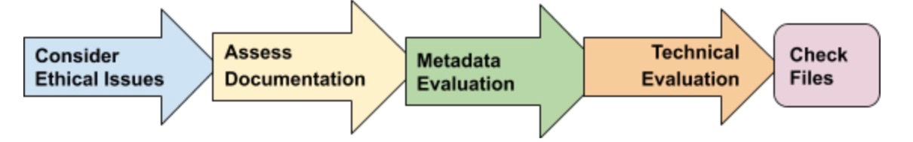

# Oral History Interviews Data Curation Primer

|   Topic   |   Description   |
| :------------- | :------------- |
| File Extension| Varies |
| MIME Type | Varies |
| Structure | Textual transcript accompanied by primary source audio and/or video files |
| Primary fields or areas of use | Multidisciplinary |
| Source and affiliation | Oral History Association (OHA) [https://www.oralhistory.org/about/do-oral-history/](https://www.oralhistory.org/about/do-oral-history/) |
| Metadata standards | TEI [https://tei-c.org/](https://tei-c.org/); PBCore; METS|
| Key questions for curation review | <ul><li>Consider ethical obligations</li><li>Determine if the documentation is sufficient.</li><li>Check for quality assurance and usability issues.</li><li>Indicate what software is required to access and interpret oral history files.</li><li>Inventory recordings, transcriptions, and any annotation or administrative information. </li><li>Perform file preservation actions if needed.|
| Tools for curation review | Varies |
| Date Created/Updated | 2020 |
| Created by| <ul><li>JA Pryse - japryse@ou.edu</li><li>Matthew Harp - matthew.harp@asu.edu</li><li>Sara Mannheimer - sara.mannheimer@montana.edu</li><li>Wanda Marsolek - mars0215@umn.edu</li><li>Wind Cowles - windcowles@princeton.edu</li>   DCN Mentor: Lisa Johnston, University of Minnesota|

**Suggested Citation:** Pryse, J.A.; Harp, Matthew; Mannheimer, Sara; Marsolek, Wanda; and Cowles, Wind. (2020). Oral History Interviews Data Curation Primer. [Data Curation Network GitHub Repository.](https://github.com/DataCurationNetwork/data-primers)

_This work was created as part of the “Specialized Data Curation” Workshop #3 held at Washington University in St. Louis in St. Louis, MO on November 5-6, 2019. These workshops have been generously funded by the Institute of Museum and Library Services # RE-85-18-0040-18._

# Table of Contents

[Description of format](#description-of-format)

[Examples What does a typical oral history dataset look like](#examples-what-does-a-typical-oral-history-dataset-look-like)

[Workflow](#workflow)

>> Ethical issues

>> Documentation

>> Applicable metadata standards, core elements, and readme requirements

>> Technical issues

>> Check Files

[What to look for to make sure this file meets FAIR principles](#what-to-look-for-to-make-sure-this-file-meets-fair-principles)

[Documentation of curation process What do you capture from curation process](#documentation-of-curation-process-what-do-you-capture-from-curation-process)

[Bibliography](#bibliography)

[Appendix 1  Best Practices Pre-production Production Post-production](#appendix-1-best-practices-pre-production-production-post-production)

[Appendix 2 filetype CURATED checklist](#appendix-2-filetype-curated-checklist)

[Appendix 3 Additional Resources](#appendix-3-additional-resources)

>> General References

>> Interacting and Using Oral Histories

>> Unresolved issues/further questions beyond the scope of primer

# Description of format

Oral history interviews are created and used as primary sources for research but are also seen as cultural objects in their own right. “Oral history” is an inclusive term that refers to both the process of conducting spoken interviews with participants (referred to as narrators) and the output products of that process.  Crossing disciplines oral histories may be a part of a historic record; belong to a cultural heritage society, used to confirm authenticity, use cases and testimonials, submitted as legal evidence, included in genealogy research and personal interest.

Oral histories can come in the form of digitized analog audio or videotape recordings. They may be recorded on mobile phone devices, portable audio recorders, video camera recordings, or any other type of device that records and/or transmits audiovisual information. They are a largely qualitative data source that is hard to nail down to one file or document type, yet they are integral to the human experience and can be sources of rich information for text mining, topic modeling, and historical analysis.

The primary output for research purposes is typically considered to be a written transcript of the audio and/or video recording of the interview. Thus, the minimum information needed for a complete oral history dataset is a transcript and a documentation/readme file. Audio and/or video files may also be included; while they have typically been considered as secondary products, this perception is evolving and oral history datasets are increasingly including audio and/or video files. Additional key information for an oral history dataset includes interview documentation and rights statements. Further, it is important to know that the transcript is likely to not be a verbatim copy of the audio; this is within accepted protocols for this type of data. Audio and video may be in compressed or uncompressed formats; technical issues of working with transcriptions, audio, and video files are addressed below (See Appendix 1). 

Like other data formats, oral history datasets can contain information from a wide range of topics. Like other kinds of data that draw information from human sources, there are important ethical issues to be aware of for curation, in addition to technical issues. Oral histories may cover sensitive personal or cultural information, but even if they do not, community ethics guidelines require that the process, from interview to data preservation and use, be guided by respect for both the narrators and their communities. Ethical issues of working with oral history is addressed in more detail below; for further, additional information on ethics in oral history projects, see [OHA Statement on Ethics](https://www.oralhistory.org/oha-statement-on-ethics/). 

Historically, the importance of transcription stemmed from the practice of destroying recordings and leaving only the transcript. Current practices evolved and now some researchers seek the audio or video recording as the first “primary” document, which means curators of oral history research have more variance in data types to process that requires greater context for them to be reused.

# Examples What does a typical oral history dataset look like

A model for better data analysis and curation with respect to oral histories involves a number of structured detailed fields that facilitate reliable research retrievability. The following fields are structured to address current data as well as format migration data to aid in discoverability. 

# Workflow

1. Consider Ethical obligations. Verify if these files can be shared. Are there ethical or legal restrictions limiting curation, sharing, and preservation? Do we have all the appropriate documentation? 

2. Documentation: Determine if the documentation of the data is sufficient for a user with similar qualifications to the author to understand and reuse the data. If not, recommend or create additional documentation (e.g., a readme.txt template)

3. Metadata: Determine what metadata schema (if any is used) and ensure all files and documentation are at a minimum using a constant standard that will aid discovery and indicate who can access and reuse files. 

4. Technical evaluation: Inventory if you will be curating recordings, transcriptions, and any annotation or administrative information. Check for quality assurance and usability issues such as missing transcriptions, administrative documents, timestamps, translations, and determine if there are proprietary or open formats. Indicate what software is required to access and interpret oral history files.

5. Inventory and assess files. Perform preservation actions such as fixity checks and prepare for long term storage and access as appropriately determined by the above steps.

See also: Appendix 2 - filetype CURATED checklist

# Ethical issues

Oral histories are not defined as human subjects research by the [Federal Common Rule](https://www.hhs.gov/ohrp/regulations-and-policy/regulations/common-rule/index.html), but some institutions do require Institutional Review Board (IRB) review and approval. Beyond regulatory concerns, there are also a number of ethical issues to be considered given the potential for personal and personally-identifying information to be made publicly available as part of the data in an oral history project. The key questions to ask as you look at the documentation and files are:

1. Does my institution require IRB approval for oral history projects, and if so, does this project have approval?

2. If there is an approved IRB protocol with this project, what does the protocol allow with respect to making the data available to others?

3. What usage agreement is appropriate, given the conditions of the IRB protocol (if present) and/or informed consent? 

4. What kinds of data has the project been given permission to share (e.g., transcript only, audio-only files, audio-video files)?

5. Have the narrators provided informed consent that is congruent with the information that the researcher wishes to make public? 

6. Is there evidence that the project has provided participants with the opportunity to review and approve their interviews for public release?

7. Have the participants given approval for the release of the archival version of their interview? (post-review consent) 

# Documentation

If there is insufficient documentation included to answer these questions, you should check with the researcher to confirm the answers and work to include this documentation. Consent may be given verbal (oral consent); Oral consents should include (at minimum): (Source: Cornell IRB template)

  - Interviewer acknowledgment with affiliation/organization
  - Statement that recording is for research
  - What interviewee is being asked to do and time commitments
  - Compensation info if appropriate
  - Voluntary nature of the study (explained)
  - Risk and benefits
  - Acknowledgment that oral history is being recorded/transcribed and notes
  - Researcher contact and IRB information is shared
  - Participant allowed to ask questions
  - Statement of interviewer asking participant that they agree to be recorded
  
# Applicable metadata standards, core elements, and readme requirements:

See also: Appendix 1 - Best Practices: Pre-production, Production, Post-production
Oral history data are broader than a specific file type or set of technical standards, and the types of metadata that you will want to be checking for are somewhat broad and related in several cases to ethical and technical considerations given above:

### Administrative metadata:

- Permission statements should be included as part of the metadata file and/or included as separate documents. This information may need to be co-located in secure storage outside of the publication data repository in order to ensure privacy and restriction mandates.

- Additional administrative metadata may include:
  - Manifests to support collection movement
  - Chain of Command 
  - Transfer Logs
  
### Technical metadata:

- The particular metadata will depend on file formats. For example, video files may be described using the [IPTC Video Metadata](https://www.iptc.org/std/videometadatahub/recommendation/IPTC-VideoMetadataHub-props-Rec_1.3.html) schema which includes fields for properties on what can be seen and heard in the video, technical characteristics, administrative (permissions), and structural components.
- Additional technical metadata may include:
  - Ingest parametrics - the technical features or characteristics of a digital file, often useful in performing quality review or repository-ingestion processes on batches of files
  - Time Code (legacy, digitization) identification and [Sidecar](https://en.wikipedia.org/wiki/Sidecar_file) file merge. (Also useful for descriptive metadata purposes)
- Include migration dates of files and corresponding software/hardware.

# Publication in progress. Thanks for your patience!
