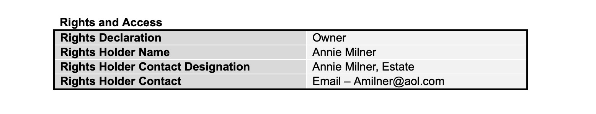

# Oral History Interviews Data Curation Primer

|   Topic   |   Description   |
| :------------- | :------------- |
| File Extension| Varies |
| MIME Type | Varies |
| Structure | Textual transcript accompanied by primary source audio and/or video files |
| Primary fields or areas of use | Multidisciplinary |
| Source and affiliation | Oral History Association (OHA) [https://www.oralhistory.org/about/do-oral-history/](https://www.oralhistory.org/about/do-oral-history/) |
| Metadata standards | TEI [https://tei-c.org/](https://tei-c.org/); PBCore; METS|
| Key questions for curation review | <ul><li>Consider ethical obligations</li><li>Determine if the documentation is sufficient.</li><li>Check for quality assurance and usability issues.</li><li>Indicate what software is required to access and interpret oral history files.</li><li>Inventory recordings, transcriptions, and any annotation or administrative information. </li><li>Perform file preservation actions if needed.|
| Tools for curation review | Varies |
| Date Created/Updated | 2020 |
| Created by| <ul><li>JA Pryse - japryse@ou.edu</li><li>Matthew Harp - matthew.harp@asu.edu</li><li>Sara Mannheimer - sara.mannheimer@montana.edu</li><li>Wanda Marsolek - mars0215@umn.edu</li><li>Wind Cowles - windcowles@princeton.edu</li>   DCN Mentor: Lisa Johnston, University of Minnesota|

**Suggested Citation:** Pryse, J.A.; Harp, Matthew; Mannheimer, Sara; Marsolek, Wanda; and Cowles, Wind. (2020). Oral History Interviews Data Curation Primer. [Data Curation Network GitHub Repository.](https://github.com/DataCurationNetwork/data-primers)

_This work was created as part of the “Specialized Data Curation” Workshop #3 held at Washington University in St. Louis in St. Louis, MO on November 5-6, 2019. These workshops have been generously funded by the Institute of Museum and Library Services # RE-85-18-0040-18._

# Table of Contents

[Description of format](#description-of-format)

[Examples What does a typical oral history dataset look like](#examples-what-does-a-typical-oral-history-dataset-look-like)

[Workflow](#workflow)

>> [Ethical issues](#ethical-issues)

>> [Documentation](#documentation)

>> [Applicable metadata standards core elements and readme requirements](#applicable-metadata-standards-core-elements-and-readme-requirements)

>> [Technical issues](#technical-issues)

>> [Check Files](#check-files)

[What to look for to make sure this file meets FAIR principles](#what-to-look-for-to-make-sure-this-file-meets-fair-principles)

[Documentation of curation process What do you capture from curation process](#documentation-of-curation-process-what-do-you-capture-from-curation-process)

[Bibliography](#bibliography)

[Appendix 1  Best Practices Pre-production Production Post-production](#appendix-1-best-practices-pre-production-production-post-production)

[Appendix 2 filetype CURATED checklist](#appendix-2-filetype-curated-checklist)

[Appendix 3 Additional Resources](#appendix-3-additional-resources)

>> [General References](#general-references)

>> [Interacting and Using Oral Histories](#interacting-and-using-oral-histories)

>> [Unresolved issues further questions beyond the scope of primer](#unresolved-issues-further-questions-beyond-the-scope-of-primer)

# Description of format

Oral history interviews are created and used as primary sources for research but are also seen as cultural objects in their own right. “Oral history” is an inclusive term that refers to both the process of conducting spoken interviews with participants (referred to as narrators) and the output products of that process.  Crossing disciplines oral histories may be a part of a historic record; belong to a cultural heritage society, used to confirm authenticity, use cases and testimonials, submitted as legal evidence, included in genealogy research and personal interest.

Oral histories can come in the form of digitized analog audio or videotape recordings. They may be recorded on mobile phone devices, portable audio recorders, video camera recordings, or any other type of device that records and/or transmits audiovisual information. They are a largely qualitative data source that is hard to nail down to one file or document type, yet they are integral to the human experience and can be sources of rich information for text mining, topic modeling, and historical analysis.

The primary output for research purposes is typically considered to be a written transcript of the audio and/or video recording of the interview. Thus, the minimum information needed for a complete oral history dataset is a transcript and a documentation/readme file. Audio and/or video files may also be included; while they have typically been considered as secondary products, this perception is evolving and oral history datasets are increasingly including audio and/or video files. Additional key information for an oral history dataset includes interview documentation and rights statements. Further, it is important to know that the transcript is likely to not be a verbatim copy of the audio; this is within accepted protocols for this type of data. Audio and video may be in compressed or uncompressed formats; technical issues of working with transcriptions, audio, and video files are addressed below (See Appendix 1). 

Like other data formats, oral history datasets can contain information from a wide range of topics. Like other kinds of data that draw information from human sources, there are important ethical issues to be aware of for curation, in addition to technical issues. Oral histories may cover sensitive personal or cultural information, but even if they do not, community ethics guidelines require that the process, from interview to data preservation and use, be guided by respect for both the narrators and their communities. Ethical issues of working with oral history is addressed in more detail below; for further, additional information on ethics in oral history projects, see [OHA Statement on Ethics](https://www.oralhistory.org/oha-statement-on-ethics/). 

Historically, the importance of transcription stemmed from the practice of destroying recordings and leaving only the transcript. Current practices evolved and now some researchers seek the audio or video recording as the first “primary” document, which means curators of oral history research have more variance in data types to process that requires greater context for them to be reused.

# Examples What does a typical oral history dataset look like

A model for better data analysis and curation with respect to oral histories involves a number of structured detailed fields that facilitate reliable research retrievability. The following fields are structured to address current data as well as format migration data to aid in discoverability. 

# Workflow

1. Consider Ethical obligations. Verify if these files can be shared. Are there ethical or legal restrictions limiting curation, sharing, and preservation? Do we have all the appropriate documentation? 

2. Documentation: Determine if the documentation of the data is sufficient for a user with similar qualifications to the author to understand and reuse the data. If not, recommend or create additional documentation (e.g., a readme.txt template)

3. Metadata: Determine what metadata schema (if any is used) and ensure all files and documentation are at a minimum using a constant standard that will aid discovery and indicate who can access and reuse files. 

4. Technical evaluation: Inventory if you will be curating recordings, transcriptions, and any annotation or administrative information. Check for quality assurance and usability issues such as missing transcriptions, administrative documents, timestamps, translations, and determine if there are proprietary or open formats. Indicate what software is required to access and interpret oral history files.

5. Inventory and assess files. Perform preservation actions such as fixity checks and prepare for long term storage and access as appropriately determined by the above steps.

See also: Appendix 2 - filetype CURATED checklist

## Ethical issues

Oral histories are not defined as human subjects research by the [Federal Common Rule](https://www.hhs.gov/ohrp/regulations-and-policy/regulations/common-rule/index.html), but some institutions do require Institutional Review Board (IRB) review and approval. Beyond regulatory concerns, there are also a number of ethical issues to be considered given the potential for personal and personally-identifying information to be made publicly available as part of the data in an oral history project. The key questions to ask as you look at the documentation and files are:

1. Does my institution require IRB approval for oral history projects, and if so, does this project have approval?

2. If there is an approved IRB protocol with this project, what does the protocol allow with respect to making the data available to others?

3. What usage agreement is appropriate, given the conditions of the IRB protocol (if present) and/or informed consent? 

4. What kinds of data has the project been given permission to share (e.g., transcript only, audio-only files, audio-video files)?

5. Have the narrators provided informed consent that is congruent with the information that the researcher wishes to make public? 

6. Is there evidence that the project has provided participants with the opportunity to review and approve their interviews for public release?

7. Have the participants given approval for the release of the archival version of their interview? (post-review consent) 

## Documentation

If there is insufficient documentation included to answer these questions, you should check with the researcher to confirm the answers and work to include this documentation. Consent may be given verbal (oral consent); Oral consents should include (at minimum): (Source: Cornell IRB template)

  - Interviewer acknowledgment with affiliation/organization
  - Statement that recording is for research
  - What interviewee is being asked to do and time commitments
  - Compensation info if appropriate
  - Voluntary nature of the study (explained)
  - Risk and benefits
  - Acknowledgment that oral history is being recorded/transcribed and notes
  - Researcher contact and IRB information is shared
  - Participant allowed to ask questions
  - Statement of interviewer asking participant that they agree to be recorded
  
## Applicable metadata standards core elements and readme requirements

See also: Appendix 1 - Best Practices: Pre-production, Production, Post-production

Oral history data are broader than a specific file type or set of technical standards, and the types of metadata that you will want to be checking for are somewhat broad and related in several cases to ethical and technical considerations given above. The Oral History Association provides [a set of metadata tools](https:/oha.archipelago.nyc) and resources, including a full list of metadata elements and an online tool to create a customized element set. Key metadata elements for curation are included here below:

### Administrative metadata:

- Permission statements should be included as part of the metadata file and/or included as separate documents. This information may need to be co-located in secure storage outside of the publication data repository in order to ensure privacy and restriction mandates.

- Additional administrative metadata may include:
  - Manifests to support collection movement
  - Chain of Command 
  - Transfer Logs
  
### Technical metadata:

- The particular metadata will depend on file formats. For example, video files may be described using the [IPTC Video Metadata](https://iptc.org/standards/video-metadata-hub/) schema which includes fields for properties on what can be seen and heard in the video, technical characteristics, administrative (permissions), and structural components.
- Additional technical metadata may include:
  - Ingest parametrics - the technical features or characteristics of a digital file, often useful in performing quality review or repository-ingestion processes on batches of files
  - Time Code (legacy, digitization) identification and [Sidecar](https://en.wikipedia.org/wiki/Sidecar_file) file merge. (Also useful for descriptive metadata purposes)
- Include migration dates of files and corresponding software/hardware.

### Descriptive metadata

- These metadata cover the information describing the interview itself, the persons present, as well as keywords and other content information
- Annotations may be included as a separate but integral element of descriptive metadata. Annotations provide context and aid discovery of conceptual elements that may be represented in a transcript but not directly stated. For example, a subject may refer to difficulties faced during a specific experience or throughout their lifetime that include topics such as “civil rights'' or “gentrification” without actually using those specific terms. Time-stamped annotations hold significant value particularly for long-form recordings or histories as they aid discovery.

### Preservation metadata

- Information about the physical condition of the recording, and any copies that have been made of it. You may need to record this metadata when you make multiple backup copies.
- Record file migrations and reformatting, such as transformation from obsolete formats. Note the use of obsolete hardware and software, to determine accessibility issues. 

### Rights and access metadata

- Information about ownership and copyright, especially the nature of the consent given by the interviewee.

## Technical issues

While oral histories typically include the audio or audio-visual recordings, transcripts are often the data that are the most useful for the purposes of reuse, such as text mining, and can be encoded most easily in open file types that are robust over time. Some projects will choose to only archive the transcripts and have agreements with their interviewees to delete any audio/video artifacts (see Ethical issues above). Some key questions to ask as you look over the files and documentation are:

#### Is there a transcript included in an open file type?

- TEI is an open standard for human/machine-readable transcriptions of speech [https://tei-c.org/](https://tei-c.org/) and is an ideal format for these data, but plain text or PDF/A may be used instead. 

#### If audio or video data are included:

- To view files: The [VLC media player](https://www.videolan.org/vlc/index.html) by the VideoLan project and non-profit organization can be downloaded and installed on Windows, Linux, Mac OS, iOS, and other platforms. VLC is a free and open-source cross-platform multimedia player and framework that plays most multimedia files and can also play DVDs, Audio CDs, VCDs, and various streaming protocols. 

- **What sizes and formats are used?**
  - Ideally, this data should be in an open format (e.g. WAV, FLAC, AIFF, MP3, MOV, MPEG, AVI, MP4). However, due to the diverse nature of recording devices, storage practices, and local infrastructure, they may be in a compressed format (e.g. TAR, GZIP, ZIP), in which case there is important technical information that should be included in the documentation (see below). 

- **Has there been a transfer from one medium to another?**
  - If so, ideally there should be a transfer notes document that details the procedures taken.

- **Is the quality of audio and/or video acceptable?**
  - (See Appendix 1 for oral history production best practices.)

#### What is the context of this specific oral history dataset?

- In particular, it is important to know if this dataset is part of an existing collection if there are further interviews planned, and in either of these cases, who the current dataset is expected to fit into a larger collection.

## Check Files

Once you have confirmed the above it is now time to inventory the files and make sure you have original, unaltered versions of your oral history collection.

- Inventory and assess files by reviewing documentation and looking at file folders from original storage. Can you open and access the files? Do they match inventory lists and other documentation? Ask yourself if the file names match, do you have any conflicts such as similar file names or are they using special characters or non-descriptive file names which could inhibit retrieval or software interaction.
- Perform preservation actions such as fixity checks. You may have specific workflows and archival processes to follow based on institutional policy or guidance. However, at a minimum you can run a basic checksum request and log the resulting hashes for files you are managing against their original sources. The checksum log can be kept as a form of metadata and used for periodic checks to ensure durability and long term fixity. 
- Prepare for long term storage and access as appropriately determined by steps 3.1 to 3.4. Audio/video files, transcriptions, supplementary materials, and metadata should be backed up onto a sustainably managed, trusted storage option, such as institution-supported storage or a cloud-based service. If managing your own back-up solution, you would ideally create two back-up copies stored in separate physical locations.

To learn more about software for interacting with Oral Histories and considerations for preparing them for future re-use and aggregation/discovery see: Appendix 3 - Additional Resources Interacting and Using Oral Histories 

# What to look for to make sure this file meets FAIR principles

Producing consistent findable, accessible, interactive, and reusable oral histories is largely reliant on robust metadata and transcriptions. Users rely on oral history transcription to analyze, organize, and mine information. Machine learning becomes difficult without a transcription produced either mechanically (via algorithm) or by a human. Therefore a curator should request access to both the audio/visual files with the textual representation of the recordings, along with any supporting materials such as evidence of permissions, rights, and reuse statements (See Appendix 2).

# Documentation of curation process: What do you capture from curation process

#### “Curator’s log”

- Original data/files
- Changes made to data/files
- Original metadata
- Changes/additions to metadata
- Accompanying finding aids links
- Correspondence with researcher/submitter

#### Rights statement/ licensing

# Bibliography

Data Curation · Oral History Methods. (n.d.). Retrieved March 2, 2020, from [http://projects.leadr.msu.edu/oralhistorymethods/curation](https://web.archive.org/web/20220517080320/http://projects.leadr.msu.edu/oralhistorymethods/curation)

Oral History: Defined. (n.d.). Oral History Association. Retrieved March 2, 2020, from [https://www.oralhistory.org/about/do-oral-history/ ](https://www.oralhistory.org/about/do-oral-history/)

Frisch, M. (2016). Oral History in the Digital Age: Beyond the Raw and the Cooked. Australian Historical Studies, 47(1), 92–107. [https://doi.org/10.1080/1031461X.2015.1122073](https://doi.org/10.1080/1031461X.2015.1122073)

Oliver, K., & Oliver, K. (n.d.). Michael Frisch: “Oral History in the Digital Age.” Humanities Truck. Retrieved February 21, 2020, from [http://humanitiestruck.com/michael-frisch/](http://humanitiestruck.com/michael-frisch/)

# Appendix 1: Best Practices: Pre-production, Production, Post-production

### Suggested Best Practices

When preparing an oral history for future research and curation it is important to follow the suggested guidelines which will assist data curators, researchers, and patrons, access the information in an efficient, thorough manner. The three components of oral history packaging are preproduction, production, and post production. Oral historians should give extensive attention to each component at the start of any oral history project. Appendix 1 presents guidelines for how to conduct and package an oral history regardless of analog or digital format for future curation projects as well as long-term preservation management. 

### Preproduction

In the early stages of creating an oral history it is important to plan the project to properly sustain the materials for long-term accessibility and retrievability. The steps listed will help guide the preproduction elements. 

**Intention of interview** 

What is the purpose of the oral history? Who is your audience? What research has been conducted to prepare for oral history? Are there additional skills or individuals that might assist with preparing for the oral history?

**Design** 

What are the time limits (extent) of the oral history? What is the location of the oral history recording? Are proper labels developed for storage devices? How many copies of the recording are needed at the time of creation (will a storage device leave with the interviewee?) How is the noise level at the location? Has there been a test recording at the time of day the interview will be created?

**Repository** 
Does the repository hold enough space for the entirety of the oral history project including: preservation master, access master, access copy? Does the repository along with project goals and standards?

- Data storage and backup storage consideration
- Data protection internal repository external storage (encryption, permissions, embargo acknowledgement applies)

**Survey** 

Are there existing materials on the subject in the collection and have they been linked to the new recording? Is there more or less information that needs to be gathered?

**Rights** 

Has a rights statement been read to the interviewee? What are the limits of the rights (literary, royalties, embargo limit)? The rights statement and permission form will include:

- Check in at interview and again when making publically available
- Rights Declaration
- Rights Holder Name
- Rights Holder Contact Designation
- Rights Holder Contact (address, phone, email)

**Script**

Coded/transcribed – Preproduction requires a prepared script which will allow for a concise framework for continuity, effect, and subject matter relativity. The script also allows for a robust transcription reference guide. 

**Metadata basics**

What metadata should be collected? What standards will be applied? What are the most immediate fields for your project and for long-term accessibility? Are future formats considered?

**Suggested metadata schemas:**

[TEI (Text Encoding Initiative)]() 

Guideline for encoding machine-readable (in the fields of humanities and social sciences). Used to describe the structural hierarchies, divisions, and characteristics of a given file (audio/video). 

[PBCore](http://pbcore.org/elements)

Public Broadcasting Metadata Dictionary (PBCore) is made up of elements, which can be organized into three main groups: Root Elements, Asset Elements, Instantiation Elements. Elements are a way to structure information based on what type of information it is. PBCore is designed for born digital formats, particularly for technical metadata.

[METS](https://www.iasa-web.org/tc04/structural-metadata-mets)

Metadata Encoding and Transmission Standard identified the structural metadata found in audio/video file formats. METS is a “wrapper” with a number of elements which provide a hierarchical structure for oral history files.

[OHA Metadata for Oral History: An Interactive Toolkit](https://oha.archipelago.nyc)

The Oral History Association (OHA) Metadata Task Force provides metadata tools and resources, including a metadata elements list, an interactive element-set building tool, and practitioner profiles in which oral historians describe the factors that guide their metadata decisions. 

**Notes**

Notes taken preproduction, during production, and postproduction, need a formal structure with proper metadata applied, headers considered, and possible tags which will assist future curation and research retrievability. Transcription notes need to be assigned proper structure. 

### Production

When Preproduction components have been formally structured the next phase, Production, will include components to ensure the files and formats, edits, and file types/size/extent, are interoperable and packaged effectively for future accessibility. These components include:

**Recording methods/equipment/transition**

Video or audio or both (permission for use of all). Assemblage of devices, methods, and software, are essential to the oral history file accessibility. Referring to the Design step in Preproduction, the setting of the recording has been tested for quality and production. Assembling the proper equipment will entail: lighting, recording devices, notes (electronic or analog), formal sequencing, and editing software usability. 

Does the recording need to be broadcast quality?

- It is best practice to record at the highest available quality that is standard, unedited, and uncompressed.

**Suggested hardware:**

- **Marantz PMD-661** – Digital recorder with high capacity and sensitive built in microphone. Studio grade with security methods included (password and encryption). External microphones and external storage can be attached. 
- **Zoom H4N PRO Digital Multitrack Recorder** - Professional grade preamps installed. Sensitive microphone and availability to attached external hardware.
- **Tascam DR-100 Interview Kit** – Includes high quality recording device with ultra-sensitive microphones built in. Also includes, external microphone, headphones, AC adapter, and microphone stands. 
- **SanDisk Memory Cards** (Preservation card and access card for backup or for ease of transfer to personal devices)
- **Panasonic 4K Ultra HD Video Camera Camcorder HC-VX981K** – Ultra HD capability. High quality microphone included. Digital stabilization included. Zoom lens and lighting filters included. 
- **Canon Vixia HF R300 and HF R700** – High quality video with built in microphones. Long recording times. Zoom lens and external lenses that can be attached.

**Metadata/physical/structural**

Defining metadata schemas and markup language decided in the Preproduction phase serves as a guideline for formal application in the Production phase. Specific metadata schemas (at minimum) will include:

- **Descriptive:** the information describing the interview itself, the persons present, as well as keywords and other content information
- **Administrative:** any information about an institution that holds the interviews. This is significant if you are collecting oral history in partnership with a university or other institution. 
- **Preservation:** information about the physical condition of the recording, and any copies that have been made of it. You may need to record this metadata when you make multiple backup copies. This also includes Provenance Metadata (original file format specifications). Signal Metadata- Raw VBI Interface – This includes noting the gaps or error gaps in the sequence of lines of an analog video signal.
- **Technical:** information about the “physical and technical properties of the digital object.” This means the file type and size of your recording, or information about which devices you used to record it.
- **Rights and access:** information about ownership and copyright, especially the nature of the consent given by the interviewee.

### Examples of Metadata Use

Milne, A. (1992, February 2). Interview by J.A. Pryse and Rachel Jinks [Tape recording]. Oklahoma History Publication Society Oral History Program, Oklahoma History Publication Society. Special Collections, Mulhall, OK.

### Postproduction  

After the Production phase has been completed and preservation file formats have been properly stored, Postproduction tasks create the opportunity to create accessible data for public or private use. The Postproduction phase includes transcription processes and data collection for discoverability within the repository catalog and online digital database.

**Transcription Metadata**

This means data about the transcription. This includes the service, hardware and software applied, but also, detailed information within the transcription that should be noted for discoverability. 

**Closed Captions**

Captioning oral histories has become standard in order to reach the public who are deaf, hard of hearing, or speak English as a second language.

### Notable Oral History Programs

**University of North Texas Oral History Program**

- Sara Wilson and Todd Moye, OH Curators and Archivists
- The UNT OHP office handles the interviewing/transcribing/hard copy publishing stage of our oral history collection. [https://oralhistory.unt.edu](https://oralhistory.unt.edu)
- The UNT OHP collaborate with Special Collections and largely with Digital Library Services for their archives, digitization, preservation and metadata services of the collection. [https://digital.library.unt.edu/about/digital-library/policies/](https://digital.library.unt.edu/about/digital-library/policies/)
- [UNT ORAL HISTORY PROGRAM GUIDELINES](https://www.dropbox.com/sh/m1j4tryhipvhpqd/AACw4n4w5_twi2n-G6tHAtsea?dl=0)

**Oklahoma State University Oral History Program**

- Patrick Daglaris and Sarah Milligan, OH Archivists
- [OSU OH Program follows the Best Practices Guide](https://www.oralhistory.org/archives-principles-and-best-practices-complete-manual/). The OHA also has an active Metadata Task Force that has been working on analyzing current practices in the field and developing a metadata rubric for oral history, among other things.
- [O-STATE Stories](https://dc.library.okstate.edu/digital/collection/ostate/search/cosuppress/), a project of the Oklahoma Oral History Research Program, chronicles the rich history, heritage and traditions of Oklahoma State University.  People, places and events unfold through personal and compelling narratives of alumni, students, faculty and friends.  Memories captured forever on audio and video recordings powerfully portray the significant contributions of OSU and its alumni to society and speak of the individual and shared experiences of current and former students.

# Resources and References

Blood, G. (2018). Refining Conversion Contract Specifications: Determining Suitable Digital Video Formats for Medium-term Storage. Fort Washington, PA: George Blood LP. Retrieved from https://www.georgeblood.com/

Boyd, D. (2012). Informed Accessioning: Questions to Ask After the Interview. Retrieved from Oral History in the Digital: http://ohda.matrix.msu.edu/2015/03/informed-accessioning-questions-to-ask-after-the-interview/

Carton, B., & Vis, L. (2008). Doing Oral History. (P. Denis, & R. Ntsimane, Eds.) Oral History in a Wounded Country: Interactive Interviewing in South Africa.

Dunaway, D. K., & Baum, W. K. (1996). Oral History: An Interdisciplinary Anthology (Vol. 2). AltaMira Press.

Frisch, M., & Lambert, D. (2012). Mapping Approaches To Oral History Content Management in The Digital Age. Retrieved from Oral History in the Digital Age: http://ohda.matrix.msu.edu/2012/07/mapping/

Froh, G. (2007). Making Sense of Metadata: A Practical Overview for Oral Historians. Retrieved from https://www.slideshare.net/GeoffFroh/oha-2008-making-sense-of-metadata-a-practical-overview-for-oral-historians-presentation

High, S., & Sworn, D. (2009). After the Interview: The Interpretive Challenges of Oral History Video Indexing. Digital Studies/le Champ Numérique, 1(2). doi:http://doi.org/10.16995/dscn.110

International Association of Sound and Audiovisual Archives. (n.d.). Guidelines on the Production and Preservation of Digital Audio Objects (web edition). Retrieved from 3.8 Structural Metadata – METS: https://www.iasa-web.org/tc04/structural-metadata-mets

Jones, S. (2018). A brief guide to using the software ELAN. LEARN Nagoya.

Library of Congress AV Prototype Coordinator. (2003). AV Prototype Project. Retrieved from Explanation: DigiProv (Digital Provenance) Extension Schema: http://www.loc.gov/rr/mopic/avprot/DD_PMD.html

Library of Congress. (n.d.). METS Example Documents. Retrieved from Standards: http://www.loc.gov/standards/mets/mets-examples.html

Maze, E. A. (2012). Metadata: Best Practices for oral History Access and Preservation - Oral History in the Digital Age. Retrieved from http://ohda.matrix.msu.edu/2012/06/metadata/

Oral History Association and the Minnesota Historical Society. (n.d.). Best Practices. Retrieved from Oral History Assciation: https://www.oralhistory.org/best-practices/#_edn1

Shah, I. (2019). Oral History and Heritage Conservation. Bengaluru, India: INTACH Bengaluru.

Tandon, A., Slomska, A., Opoku-Boateng, J., & Abbazia, D. (Eds.). (n.d.). Unlocking the Sound and Image Heritage - Selected readings from the International 2015 SOIMA Conference. doi:10.18146/soima2015

Technical Committee - International Association of Sound and AudioVisual Archives. (2018, March). Guidelines for the Preservation of Video Recordings. IASA-TC 06(1).

The National Recording Preservation Board. (2010). The State of Recorded Sound Preservation in the United States: A National Legacy at Risk in the Digital Age. Washington, D.C.: Council on Library and Information Resources and The Library of Congress.

Uchefuna, C., & Carline, K. (2019). Data Curation · Oral History Methods. Michigan State University, Lab for the Education and Advancement in Digital Research (LEADR). Retrieved December 20, 2019, from http://projects.leadr.msu.edu/oralhistorymethods/curation

Vos, J. (2012). New Roots: An Oral History Metadata Case Study at the University of North Carolina at Chapel Hill. Retrieved from Oral History in the Digital Age: http://ohda.matrix.msu.edu/2015/10/new-roots-an-oral-history-metadata-case-study-at-the-university-of-north-carolina-at-chapel-hill/

# Appendix 2: filetype CURATED checklist

The following CURATED checklist model is based on the Digital Curation Network’s standardized set of C-U-R-A-T-E-D steps https://datacurationnetwork.org/resources/resources-2/.

**Check files and read documentation**

- Files open as expected
- Review metadata and available documentation

**Understand the data**

**Request missing information or changes**

**Augment metadata for findability**

- Enhance metadata for findability.
  - metadata standards will vary depending on whether the oral history is in the form of an audio file, a video file, or just a text transcript. for video and audio pbcore is ideal. for text only, dublincore. other metadata standards to layer on top might include premis (for preservation metadata), and DACS.
  - Link to related collection information, finding aid, context of data

**Transform file formats for reuse**

- Preferred file formats (non-proprietary)
- Retain original formats
- If special/proprietary software is needed, list name and version
- ADA compliance considerations

**Evaluate for FAIRness** 

- taking into account FAIR principles as described in section “What to look for to make sure this file meets FAIR principles”.

**Document**

- Remember to record actions taken during the curation process.
- Curator’s log
- Communications with data submitter
- Changes made to files and or metadata

# Appendix 3: Additional Resources

### General References

[Oral History processing manual](https://drive.google.com/file/d/0Bzm6OcJO9sNxUngtcXBxYWp0bFlpTFR3ck5wdEJTV0VKdlg4/view)

[Archiving Oral History: manual for best practices](https://www.oralhistory.org/archives-principles-and-best-practices-complete-manual/)

[Oral History in the digital age - best practices](http://wiki.ohda.matrix.msu.edu/index.php/Best_Practices)

[Oral History methods - data curation](http://projects.leadr.msu.edu/oralhistorymethods/curation)

[Oral History Association](https://www.oralhistory.org)

### Interacting and Using Oral Histories

If the researcher is looking for something other than a data repository deposit, there are some options:

[Oral History Metadata Synchronizer](http://nunncenter.org/ohms-info/) - Kentucky is an example of a platform that is both a “back-end, **web-based application** where interviews are imported, and metadata is created” as well as a viewer or **user interface** to experience and interact with the data. The system requests content from a digital repository and loads the content into the viewer and aligns the transcription based on time-stamped metadata. The metadata serves multiple purposes including discovery, identification, and time alignment. 

Another platform that is both a traditional digital repository and an exhibit viewer for oral histories is [Omeka](https://omeka.org). For example [Curatescape](https://curatescape.org) a web and mobile app framework built on top of Omeka, presents oral histories in context with community stories. Curatescape/Omeka is designed for “small to mid-sized cultural organizations, preservation groups, or educational institutions an opportunity to reclaim their interpretive voice and reconnect to their communities and audiences.” ([source](https://curatescape.org/about/))

For researchers interested in the acoustic linguistic properties of the data, Praat is a commonly used application for acoustic visualization and analysis. ([http://www.fon.hum.uva.nl/praat/](http://www.fon.hum.uva.nl/praat/))

These platforms provide an enhanced and structured environment that organizes information longitudinally through time both in their relationships with each other and through the ability to navigate within the files or content themselves beyond static web pages and standalone repositories that essentially provide basic viewers or file downloads. Well structured metadata, including transcriptions, support the discovery, access, and preservation of oral histories.

### Unresolved issues further questions beyond the scope of primer

- The granularity of metadata at collection, item and file levels
- Data Storage: Data protection, Confidential or restricted data, Collaboration (mutually accessible location), Volume of data
- Origin stories
- Ephemeral nature of oral histories: Paradigms shifts and institutional missions may necessitate re-evaluations of ownership. If and when this happens, documentation about decisions must be cumulative and transparent.
- Transfer of collections: transitions are vulnerable moments, and steps should be taken so that all accompanying documentation and information “travels” with oral histories in order to preserve provenance and context.
- Processing handwritten notes
- Detailed information on intellectual property
- Metadata aggregation: organizing metadata into a form that allows cross-searching and interoperability

