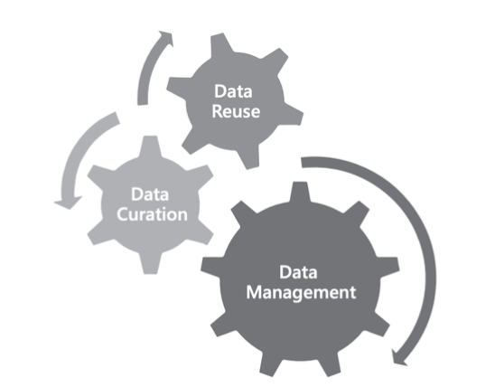

# Primer for Researchers on How to Manage Data

Authors: Maria Arteaga Cuevas[^1], Shawna Taylor, Mikala Narlock

DCN Mentors: Scout Calvert, University of Nebraska-Lincoln; Wind Cowles, Princeton University; Jen Darragh, Duke University

Affiliate Contributors (external peer reviewers): Alicia Hofelich Mohr, University of Minnesota; Jonathan Petters, Virginia Tech

Suggested Citation: Arteaga Cuevas, Maria; Taylor, Shawna; and Narlock, Mikala. (2023).
Introduction to Research Data Management for Researchers. Data Curation Network [GitHub Repository](https://github.com/DataCurationNetwork/data-primers).

[^1]: This project was partially funded by Federal funds from the National Library of Medicine (NLM), National Institutes of Health (NIH), under cooperative agreement number UG4LM01234 with the University of Massachusetts Chan Medical School, Lamar Soutter Library. The content is solely the responsibility of the authors and does not necessarily represent the official views of the National Institutes of Health. 

----------------------------

# Table of Contents
[Scope](#scope)

[Overview](#overview)

[Project Planning / Before Research Project Initiation](#project-planning--before-research-project-initiation)
> [Data Management and Curation Principles](#data-management-and-curation-principles)
>> [Findable, Accessible, Interoperable, and Reusable (FAIR) Guiding Principles](#findable-accessible-interoperable-and-reusable-fair-guiding-principles)  
>> [CARE Principles for Indigenous Data Governance](#care-principles-for-indigenous-data-governance)  
>> [Data Curation](#data-curation)  

> [Data Management and Sharing Plans](#Data-Management-and-sharing-plans)  
> [Elements of Data Management and Sharing Plans](#elements-of-data-management-and-sharing-plans)  
> [Other Planning Considerations](#other-planning-considerations)  

[During the Research Project (Project Execution or Implementation)](#during-the-research-project-project-execution-or-implementation)
> [Data Management](#data-management) 
> [Documentation](#documentation) 
> [Data Sharing](#data-sharing) 

[Research Project End / Project Closeout](#research-project-end--project-closeout)

[Bibliography](#bibliography)

----------------------------
## Scope
The objective of this primer is to provide a high-level overview for researchers on research data management and sharing practices during the **planning, implementation** and **closing** phases of typical research projects. Although it is widely considered best practice to plan for data management and sharing early in the project, the authors recognize that researchers will consider how research data will be shared and managed anytime during the project lifecycle (Jones et al, 2020). This primer aims to provide a grounding in the key aspects of data management, particularly data curation, as well as tangible suggestions for researchers and research teams during all of the stages of the research data lifecycle. Each project phase has a series of considerations, however, it is worth noting that there is duplication and repetition in each of the phases, as these considerations are relevant in multiple project phases.

This primer does not delve into the nuances of data management and sharing practices and does not provide specific guidance for different formats or disciplines. Instead, this is an introduction to data management and sharing practices and provides general guidelines. Additional resources and references are listed at the end of this primer and are meant to be illustrative rather than exhaustive.

## Overview
Increasingly, funding agencies and publishers require research data resulting from or supporting scholarship to be made as openly accessible as possible. As a result, many scholarly communities are taking this opportunity to embrace data sharing to further the goals of open science, scholarship, and reproducibility. Regardless of the motivation, sharing research data can feel like an onerous task. Taking active steps to document, curate, and manage data throughout the project, rather than just before sharing, can ease the overall burden of data management sharing. Even if the research data cannot be openly shared due to legal restrictions or ethical concerns, active management is still valuable to ensure these data remain usable by the research team or others if eventually shared in a restricted access manner. Often, as datasets are created or analyzed, multiple project personnel will be in contact with the data; having a shared understanding of versioning, naming, and storage will facilitate the data management and sharing processes.

This primer does not provide specific guidance on file naming conventions, storage or arrangement practices, or analysis practices. Instead, what follows are general guidelines that are geared towards preparing content for sharing and storage through a process called curation, described in more detail below.

Additional, customized support for specific data types can be addressed by data librarians and stewards at local institutions.

## Project Planning / Before Research Project Initiation
Robust data management starts early in the project lifecycle during the planning phase. During this stage, it is essential to review general data considerations and guiding principles, including the [FAIR](https://www.go-fair.org/fair-principles/) and [CARE](https://www.gida-global.org/care) principles (described below), and best practices. Prior to launching a research project, make a plan for managing and sharing data to help guide project work.

### Data Management and Curation Principles
Below are some foundational data management considerations and guiding principles. While these are applicable and useful throughout the research lifecycle, we have placed them here as foundational for any research project.
#### Findable, Accessible, Interoperable, and Reusable (FAIR) Guiding Principles
Data, its metadata, and the infrastructure supporting the data should follow the FAIR guiding principles for scientific data management and stewardship. These principles ensure data are Findable, Accessible, Interoperable, and Reusable (FAIR). Briefly, these principles are:
* Findability - data are discoverable in an established repository, have a persistent identifier(PID), and are well documented;
* Accessibility - data are able to be accessed by a persistent identifiers (PIDs), with appropriate access restrictions when required
* Interoperability - data are able to be integrated with other data, applications or workflows for analysis, storage, and processing;
* Reusability - data are well documented, include descriptions of the project, researchers, etc., and make data use agreements (DUAs) and licenses clear to the next user; data reusers must be able to open, operate, and understand the contents of the original dataset (GO FAIR, 2016).

These principles are increasingly being used by funders, journals, and others as a benchmark for data sharing. Moreover, alignment with these principles helps to build towards a vision of reproducible and open science. Although activities to ensure the FAIR principles are often implemented at the end of the study when data are shared, steps done throughout the study can increase the FAIRness of the data. For example, aligning participant consent or data agreements with accessibility plans for data release, choosing open or easily exportable software and file formats for collection, and capturing documentation as data are collected and analyzed can help make data more FAIR.
#### CARE Principles for Indigenous Data Governance
The CARE Principles for Indigenous Data Governance ensure datasets and publications, as well as data collection processes, respect the autonomy and sovereignty of Indigenous communities. The CARE principles focus on the people and purpose behind data, especially human subjects data. While these principles are written specifically with Indigenous data and sovereignty in mind, they are a useful framework to evaluate how to share and manage all data, as these principles require researchers to consider the impacts and unintended effects of their data collection and management practices on society at large. These principles are:
* Collective Benefit - Data collected about communities should be shared to benefit those communities’ promotion of local self-determined development processes.
* Authority to Control - Indigenous communities should control data in ways that they choose and have the right to data which empower their self-determination and self-governance; the authority to control principle can be extended to peoples of all marginalized communities.
* Responsibility - Indigenous data use requires community relationships built on respect, reciprocity, trust, mutual understanding and invokes a responsibility to enhance data literacy within communities.
* Ethics - Data sharing, collecting, and generation must minimize harm and maximize benefits towards justice, according to ethical frameworks or practices of individual communities; metadata must be robust to ensure ethical reuse considerations

As stated by Carroll et al:
<ol>The CARE Principles speak to how scientific data are used in ways that are purposeful and oriented towards enhancing the wellbeing of people. The CARE Principles are likely to find expression across the data lifecycle from collection to curation, from access to application, with implications and responsibilities for a broad range of entities from funders to data users…It is important to note that in many cases scientific datasets also contain Indigenous Knowledge. Users and producers of such data, both in the past and currently, often do not realize the need to acknowledge Indigenous provenance or make space for cultural metadata when creating this data (2021).</ol>

The FAIR and CARE principles should be considered complementary, as FAIR focuses on the
characteristics of data, metadata, and infrastructure that will facilitate “increased data sharing”,
whereas CARE focuses on “both” people and the purpose(s) behind data (GIDA, 2019).
* Early in the research design process, consider the full impacts of the data. If the data
focuses on a specific community, determine if the community members are a full partner
in the data collection or sharing process
* If data are not about human participants, determine if there are other potential concerns
with collecting or sharing this data ([e.g., University of Sydney](https://www.sciencedaily.com/releases/2018/07/180723142834.htm))

#### Data Curation
Data curation “enables data discovery and retrieval, maintains data quality, adds value, and provides for data re-use over time through activities including authentication, archiving, metadata creation, digital preservation, and transformation” (Data Curation Network, “[Mission and Vision](https://datacurationnetwork.org/about/our-mission/)”). This work includes activities such as reviewing files and their organization for clarity and completeness, improving project documentation to facilitate reuse, converting files for long-term access, and providing a robust description to improve the findability of the dataset. Data curation is a process of reviewing, and possibly transforming or augmenting a dataset to help ensure the data and affiliated publications are Findable, Accessible, Interoperable, and Reusable (FAIR).

While curation frequently happens at the end of a project, typically when data are uploaded to a preservation or sharing repository, researchers can leverage curation principles and practices to assist in managing data throughout the entire project lifecycle. Consideration of how to curate research data early on in a project can improve metadata completeness, descriptive documentation, and optimize how and where data are shared. Good data management and curation practices should be leveraged even if the data has restrictions and cannot be made openly available.

### Data Management and Sharing Plans
Federal regulations and policies, as well as institutional policies, are increasingly asking researchers to prepare Data Management Plans (DMPs) or Data Management and Sharing Plans (DMS Plans), collectively hereafter referred to as DMPs. These plans outline the data that will be generated over the course of a project, how the data will be managed during the project, and how data will be preserved and shared after the project is complete. When creating a DMP, it is important to refer back to, and be guided by, the FAIR and CARE principles to understand ‘the why’ of many data management and sharing practices. For example, transforming research data from a proprietary common file format into a common open standard format will increase the likelihood of data accessibility and reuse; this data transformation is guided by FAIR principles. On the other hand, the CARE principles require thoughtful assessment of data collection processes, analysis and data provenance to determine if there are any negative impacts on specific communities or society as a whole.

Although there is no checklist to follow for FAIR or CARE compliance, each of the data management activities reflected in the DMP should be in alignment with each set of principles. DMPs should also be considered living documents that will facilitate the archiving and sharing of research data at project conclusion. Even if a DMP is not required by a funder, federal agency, or other external party, it is a useful exercise to prepare for data management across the research lifecycle. While DMPs can and should be updated throughout the research project, planning early in the research lifecycle will streamline collection, analysis, and management of all digital assets.

Early in the project planning phase, create a DMP that covers data management throughout the entire [research project lifecycle](https://researchdata.princeton.edu/research-lifecycle-guide/research-lifecycle-guide). Any shared data should be done in a manner that aligns with the FAIR and CARE Principles. The following bullet points are considerations and general guidelines for creating, managing, and updating DMPs.

* **Consider using a template or tool to help structure the DMP.** For example:
  * The [DMPTool](https://dmptool.org/) is an online resource for creating DMPs with institution and public (free) versions available
  * Funders, such as National Science Foundation (NSF) or the National Institutes of Health (NIH), often have DMPs templates specific to their grant types
  * Many research data centers or libraries at local institutions can offer guidance on how to get started on developing a DMP
* **Determine where, how, and what data will be shared. Document these decisions in the DMP.**
  * There are many repositories that could be leveraged to store and share data, depending on data management needs or requirements. Domain-specific repositories, institutional repositories, generalist repositories, or even code repositories, like GitHub, may all be appropriate. There are other options, such as self-hosting data or establishing stand-alone infrastructure, but these options can be expensive to launch and maintain, and can jeopardize project data in the long-term. Contributing to an established repository is preferred. Suggested considerations when selecting a repository, as well as potential tools to facilitate this, are provided below in the [Data Management, Sharing, and Curation Resources](#data-management-sharing-and-curation-resources) section.

* **Evaluate and document in the DMP the internal control environment** (e.g. policy, procedures, training, monitoring, organizational structure) and infrastructure (technology leveraged) to determine the baseline level of control related to research data across the lifecycle, and, if possible, secure the necessary controls and infrastructure for optimal research data management (COGR, 2022).
  * Document these considerations and include which departments or units are responsible for, or control, aspects of data management and sharing.
* **Plan to review the DMP at regular intervals throughout the project and update the DMP as needed throughout the project.** Research projects and affiliated data will likely evolve as the project develops. Make changes to reflect the actual practice of the project’s data management during the project, as this will prevent loss of the context and processes pertinent to the data.
  * Ensure all project PIs and personnel have access to the DMP and understand the review schedule. Depending on federal or institutional requirements, plans can be living documents or updated in versions; if using versions, ensure versioning processes are documented.

### Elements of Data Management and Sharing Plans
Required elements or components of DMPs will differ depending on funder or institutional requirements. However, regardless of requirements, there are recommended minimum elements to include in plans. Documenting and describing these research data management activities ensures consistency in data collection, can streamline analysis, sharing, and preservation of research data at project end, and can promote transparency in the overall research process. DMPs can and should be living documents to help guide data collection; as plans change, DMPs should be updated periodically to ensure project personnel are all on the same page. The following table lists the recommended minimum elements to include in a data management plan.
* **Describe the data** and include relevant context, how it will be collected, project personnel leads, and the role of the data in the research project
  * Include **confidentiality or privacy** restrictions and considerations
  * Describe **ethical considerations**, including informed consent process (if working with human participants or data that will affect humans or sensitive populations)
* Describe how the **data will be shared and accessed** and include:
  * access specifications, including if data will be open, restricted, or partially restricted (granted only to specific user groups) during collection and after publication
  * embargo periods
  * technical processes for dissemination
  * costs for curating, storing, and sharing research data during and after data collection
  * a timeframe for data sharing and publishing, which can include sharing research
  * data throughout the project (ICPSR, “Elements of a Data Management Plan”)
* Determine what **active data file formats** will be used throughout the project
* Consider what **storage methods are appropriate for active data** based on file formats, access requirements, sensitivity of the data, etc.
  * Include a description of how the data will be **backed up**
* Consider **where data will be stored** after the end of the project
  * Determine if file formats will need **migration** to different formats for long-term access
  * Consider if there are **ethical or legal restrictions** that might limit data sharing
  * Ensure the selected sharing repository will provide appropriate **preservation support**
* Describe **security protocols** for the data and consider confidentiality, protect information, and access restrictions.
  * Plan **security measures that match the sensitivity of the data**. This can include keeping physical documentation of encryption keys, codebooks, etc.
* **Evaluate the internal control environment** (e.g. policy, procedures, training, monitoring, organizational structure) and infrastructure (technology leveraged) related to research data lifecycle
* Consider if there are specific **metadata standards and/or documentation** best suited for the research project or data (often disciplinary based)
* Document how **version control** of the data files will be managed

### Other Planning Considerations
Many aspects of the research project will impact and influence how data are managed, curated, stored, and shared. Below are additional aspects to consider during the project planning phase.
* Determine if institutional policies or review boards (e.g., Institutional Review Boards [IRBs], Institutional Animal Care and Use Committee [IACUC], Institutional Biosafety Committee [IBC]) require specific management of consent forms, data de-identification, restricted platforms, etc. IRB requirements may impact how the project’s research data will be managed and/or curated
* If reusing an existing dataset, determine if the data are subject to Data Use Agreements (DUAs) and, if applicable, include DUA restrictions in the DMP
* Determine which license type(s) are best for project outputs, including research data
  * If there are no ethical limitations on sharing, consider a license that allows broad reuse, such as the [Creative Commons](https://creativecommons.org/licenses/) Attribution-NonCommercial license
* Create an overall project README file and update it throughout the lifecycle
  * It should contain the necessary information to open the data files and understand the content, including file naming conventions and version control information
  * Ensure project personnel have appropriate access to the README files
* Review the DMP and ensure the data and the infrastructure, including the selected
sharing repository, supporting the data align with FAIR and CARE principles
  * Determine how digital object identifiers (DOIs), or other persistent identifiers (PIDs), will be assigned to the dataset and project outputs
    * Confirm the selected sharing repository will be able to use the DOI or PID to connect the dataset to an affiliated publication
  * In consultation with repository personnel, determine if the data will be shared in one record or several, and determine how multiple outputs will be linked if needed
* Plan to broadly develop three types of data documentation: documentation about the data itself (e.g., variables, data dictionary, codebook), the dataset or study as a whole (e.g., the README file), and how the data may be reused (e.g., file manifest, license)

## During the Research Project (Project Execution or Implementation)
This period of the research project is likely the bulk of the work, from data collection, cleaning, and analysis, through sharing and publication. This phase builds on the previous planning phase, and relies heavily on the DMP created previously. Whether the data generated are newly collected or reused from a previous study, the following sections will help to ensure that data are in robust shape when the project ends.

### Data Management
Data management includes considering how data will be shared, stored, and reused, and using data sharing goals to guide decisions when developing a research project, collecting data, and managing data. It also involves evaluating, developing, and adopting tools and workflows that will streamline the capture of appropriate metadata and ease the burden of publication or required sharing. This approach is especially beneficial for large-scale projects and highly-collaborative research that crosses disciplines or institutions (e.g., Kouper et al 2021; Akmon et al 2018; Soska et al 2021).

Data curation, described [above](#data-curation), is a critical part of research data management and “cannot happen without implementing good data management practice early on and throughout the research lifecycle” (Johnston, 2017, xii). Curation is integral to ensuring data can be accessed and reused in the future; data management would be a somewhat fruitless endeavor without curation, and without the end goal of data reuse.

*Figure 1: A conceptual model of the research data lifecycle with intersections between data management (researcher actions), data curation (repository, curator, or researcher actions), and data reuse (Johnston, 2017, xii).*

The considerations below are pertinent to data management during the research process, and specifically highlights curation activities.
* Create new versions of the original data files when processing or altering data
  * Consider which version(s) of the data might be the most widely used for reuse; not all versions of data necessarily need to be preserved and/or shared
* Periodically reassess what data should be shared and at what level of openness
  * Consider creating a public metadata record for restricted or private data to indicate the existence of the data in the research data landscape
  * Ensure the selected repository or sharing mechanism can accommodate any access requirements (e.g., limited download)
* Ensure data are stored securely and periodically reevaluate who on the research team has access, and at what level, during the process
  * When sharing sensitive data beyond the research team, ensure they are deidentified and shared with appropriate access restrictions
  * If working with human participants data or other sensitive data, see the DCN [Human Participant Essentials Data Primer](https://github.com/DataCurationNetwork/data-primers/blob/master/Human%20Participants%20Data%20Essentials%20Data%20Curation%20Primer/human-participants-data-essentials-data-curation-primer.md) for additional curation tips
* When creating data, keep in mind the Data Curation Network’s [CURATE(D): Checklist for Data Curation](http://z.umn.edu/curate) to better understand what a data curator, which may include project personnel, might look for when preparing files for sharing at the end of a project. Starting with well curated data in mind can make later data preparation much easier!
  * Review the CURATE(D) [Transform(T)](https://docs.google.com/document/d/1RWt2obXOOeJRRFmVo9VAkl4h41cL33Zm5YYny3hbPZ8/edit#heading=h.rpmfjne7roc2) Step, which includes content review to identify and transform files into open, standard formats alongside (or instead) of proprietary formats. Considerations from this step include:
    * Can freely available software be used for collection or analysis?
    * Are there open source or reusable formats that could be used?
    * Do the original files pre-transformation or documentation about the transformation(s) need to be retained for reproducibility?
      * In particular, think about content or information that could be lost in the transformation. Consider if the ease of reuse will be affected
    * Review any visualizations for accessibility and consider:
      * Is the color contrast appropriate?
      * Is there sufficient alt-text / embedded metadata?
    * Reorganize and rename files as needed
  * Review the CURATE(D) [Augment(A)](https://docs.google.com/document/d/1RWt2obXOOeJRRFmVo9VAkl4h41cL33Zm5YYny3hbPZ8/edit#heading=h.8saifcr8jjpr) Step, which includes metadata enhancement to best facilitate findability. Considerations from this step include:
    * Determine how the dataset can be thoroughly described with a description, keywords, and other relevant metadata to improve discoverability
    * Determine how digital object identifiers (DOIs), or other persistent identifiers (PIDs), will be assigned to the dataset and project outputs
      * Package the data and supporting files in a way that makes the most logical sense for the organization of the data; if the dataset is large or has many components, how the data is grouped can determine how many DOIs are assigned. Organizational authority ultimately belongs to the researcher(s) (EDI, n.d.; SEANOE, n.d.)
        * If assigning multiple DOIs or other PID, consider how multiple DOIs will impact citation, findability, and reuse
        * If assigning multiple DOIs or other PID, consider how they will be linked
      * Consider how the assigned dataset DOI or other PID can connect to the an affiliated publication
* Connect with repository personnel to better ensure that data to be shared is prepared for data submission into a repository or other platforms
* Ensure data-related documentation, including README files and codebooks, are descriptive enough to reproduce or reuse the data
  * The DMP may or may not be helpful for data reuse; ideally, the DMP would include context and information helpful for data reuse; see the ‘[Elements of Data Management and Sharing Plans](#elements-of-data-management-and-sharing-plans)’ section above

### Documentation
Documentation is essential for understanding and reusing a dataset. Capturing documentation while the research project is ongoing is beneficial, as important details may be forgotten or lost by the time the project ends. When original authors of data, and subsequent data reusers, provide context around the data in the form of documentation, the longevity of the data are increased and its provenance can be more easily understood (the latter is important for CARE considerations). There are three types of documentation that should be created during a research project: documentation about the data (e.g., variables, data dictionary, codebook), the dataset or study as a whole (e.g., a README file), and how the data may be reused (e.g., file manifest, license).

* Create data level documentation, including metadata, when data collection begins
  * Use discipline specific documentation such as a data dictionaries or codebooks
  * Include details about systems and tools used to perform data analysis (methodology) in the dataset’s README file
  * Ensure all data authors and contributors are listed in data documentation
* Develop, and follow, quality assurance and quality control procedures (data validation checks, version control, roles and responsibilities, etc.)
  * Document these procedures in one location and revise them as needed. Store procedures in a centralized location for the project, including a shared service, in a cloud-based collaborative workspace, or anywhere else that project personnel can easily access
* Document data cleaning, transformations, and processing that occur during the project
  * For data reuse considerations, record when data are removed (e.g., incomplete survey response or redacted identifying information), refined (e.g., normalized for units or spelling variations), converted from one format to another.
  * This may be in the form of descriptive text or scripts/syntax files.
* Develop documentation on data processing data for standardization
  * Include context for how the data was processed, and why, to facilitate reuse (e.g., define variables, values, rows/columns).
* Record which software(s) has been used in data collection, cleaning, and analysis have in the documentation.
* Ensure data-related documentation, such as README files and codebooks, are descriptive enough to reproduce and/or reuse the data. Consider including the DMP, as it should provide context around the data, which may be helpful for future reusers.
* Have the README file refer to all other documentation created for the project.

### Data Sharing
Sharing research data is important for researchers for a myriad of reasons: it increases data management and thereby increases data quality, it promotes transparency, it encourages collaboration by allowing for increased data reuse, and it can increase sample sizes in scientific studies. For funders, shared data can stimulate interest and mobilize topics of research within specific disciplines (Popkin, 2019; USGS, n.d.). Data sharing may happen at different points in the project lifecycle, but sharing typically occurs at milestone points during the project (such as with publication), or at project end. The following considerations may be beneficial to highlight why some data should be shared while the project is in process, versus at project end.
* Publication:
  * Publication may occur before a project ends, especially for larger projects with multiple phases. Data will often need to be shared to comply with publisher mandates.
* Collaboration:
  * Ensure everyone who is handling the data has reviewed and understands the DMP.
  * Share data, code, or other project outputs earlier in the project to promote collaboration and to advance project work more efficiently; these ‘born open’ project components (e.g., [GitHub](https://github.com/) or [OSF](https://osf.io/)) can be efficient tools to gain traction during a project.
  * For projects with large datasets or for projects that last several years, data might be shared with researchers at other institutions; consider if the data need extensive [curation](#data-curation) before sharing outside the home institution.
* Budgetary considerations:
  * Data sharing is not necessarily free. Evaluate the repository options early to budget appropriately for sharing and curation costs.
  * Determine what activities need to happen for data sharing, especially curation activities; if these tasks are extensive, consider folding these activities into the Implementation phase of the project (for a comprehensive list of activities, see ARL’s 2022 [Public Access Data Management and Sharing Activities](https://doi.org/10.29242/report.rads2022) report). Funds, personnel, and staff time may be covered during the project, but these resources may not be available at or after project end.
* Documentation:
  * Update the DMP developed in the Planning phase in accordance with project changes (see ‘[Data Management and Sharing Plans](#data-management-and-sharing-plans)’ above), especially if data have been transformed or augmented.
  * Build documentation review into the project workflow; setting a standard time for the research team to review and update documentation can help promote good documentation.
* Review and update all project documentation, including README files, discipline specific documentation such as data dictionaries and codebooks, and any other documentation describing how the research data was processed, cleaned, standardized, etc.
  * Execute the appropriate methods and approaches for managing and sharing data, which were likely identified in the DMP during the Planning phase. These implementation activities could include selecting an appropriate repository, as it is considered the best approach for data sharing
  * Determine if the data requires restricted access and ensure the selected repository has mechanisms in place to support this restriction
  * Connect with the repository personnel about the best way to transfer data to their infrastructure
  * Review repository policies, including costs for deposit and storage, requirements for file types or sizes.
  * Consider and follow relevant Data Use Agreements (DUAs)
  * Select or apply licenses to data (or DUAs)
  * Ensure institutional policies on data retention and sharing are followed
  * Ensure funder policies or award conditions on data management and sharing are followed, which might dictate where data can be shared.
  * Determine data publishing fees, if applicable
  * Determine which PID(s) will be used and how the PID(s) will link data, publications, or other research outputs

## Research Project End / Project Closeout
  Good data management includes a closeout phase following project end. Many of these activities build on previous work during the project. The activities listed below are considered a quick checklist of what is typically required to ensure the data, and their documentation, are in an optimal state for future reuse.
* **Data Integrity**
  * If not already completed during the project Execution/Implementation phase,
  complete actions outlined early in the research project to ensure data integrity for future reuse (see ‘[Data Sharing](#data-sharing)’ above)
*  **Documentation**
    * When concluding the project, review the DMP developed during the planning
  phase and updated throughout the project and make any final, necessary changes to document what actually occurred during the project; the DMP may be a helpful tool to provide context for data reuse
    * If there is no DMP for the project, ensure all data documentation are robust and descriptive
      * Refer to the ‘[Elements of Data Management and Sharing Plans](#Elements-of-Data-Management-and-Sharing-Plans)’ above to determine if there are pertinent missing elements that should be included in the documentation
    * Review the ‘[Documentation](#documentation)’ section above and ensure all documentation is robust and can be understood by researchers outside of the project team
    * Specifically, README files should include:
      * Details about systems and tools used to perform data analysis (methodology)
      * A description of all software and software versions used in collection, cleaning, and analysis
* **Quality Control**
    * Ensure, and document, that quality control procedures (data validation checks, version control, etc.) were performed
  * Data Deletion - If there are any data can be deleted, ensure that deletion takes place:
    * When reviewing and deleting files, identify files that should not be shared but cannot yet be deleted. Consider if some of those files could be shared now or in the future
    * For data or files that cannot be shared but cannot be deleted until a certain time to comply with legal or funder requirements, ensure this is clearly documented
    * Consider a temporary folder, such as a “To Delete” folder for things that could be deleted at a later time; if the folder is not accessed after a year or more, it may be safe to delete
    * Reviewing and deleting files, including datasets, regularly, or indicating when they can be deleted, can help not only the researcher or project team, but also the institution; with no direction as to when research files can be deleted, there is a risk that files will be kept permanently, contributing to long-term storage costs to the institution and risk to the researcher and institution.

## Data Management, Sharing, and Curation Resources
  Below is a non-exhaustive list of tools and resources considered helpful for data curation. This list includes data management planning resources that, when utilized early in the research lifecycle, contribute to FAIR research data and metadata.

Topic  | Resource
------------- | -------------
DMP Resources  |<li>ICPSR - [Framework for Creating a Data Management Plan](https://www.icpsr.umich.edu/web/pages/datamanagement/dmp/framework.html)</li><li>NSF - [Data Management Plan Requirements](https://www.nsf.gov/bfa/dias/policy/dmp.jsp)</li><li>MANTRA - [Data Management Planning](https://mantra.ed.ac.uk/datamanagementplanning/) (training module)</li><li>[DMPTool](https://dmptool.org/)</li>
Data Curation Network [Standard file formats](https://datacurationnetwork.github.io/CURATED/modules/module-t/)|For specific data types see:<li> [Table 1 Common Transformations](https://datacurationnetwork.github.io/CURATED/modules/module-t/)</li><li>[Data Curation Primers](https://datacurationnetwork.org/outputs/data-curation-primers/)</li> Common formats:<ul><li>JPG, PDF, TXT, HTML</li><li> CSV, TSV</li><li>Date format ISO 8601: YYYY-MM-DD</ul>
Documentation Tools |<li>[Colectica](https://colectica.com/software/colecticaforexcel/)</li><li>[Cornell README template](https://cornell.app.box.com/v/ReadmeTemplate)</li><li>README files should be written in plain-text (.txt) or markdown (.md) for accessibility; [Markdown Guide](https://www.markdownguide.org/basic-syntax/)</li><li>[Jupyter](https://jupyter.org/)</li>
Data Tips for Tidy Data |<li>[Best Practices for Data Documentation](https://guides.library.duke.edu/c.php?g=633433&p=4429297)</li><li>Library Carpentry - [Data Tips](https://librarycarpentry.org/lc-spreadsheets/01-format-data.html)</li><li>Guidance - [Data Organization in Spreadsheets](https://www.tandfonline.com/doi/pdf/10.1080/00031305.2017.1375989)</li> General Tidy Data Advice<li>Be careful with putting multiple data tables in one spreadsheet</li><li>Do not leave data points blank if they are zeros</li><li>Do not include multiple data points in one cell</li><li>Use “_” instead of spaces when naming</li>
Data Cleaning Tools  |<li>[OpenRefine](https://openrefine.org/)</li><li>[Tabula](https://tabula.technology/)</li>
Licensing  |<li>[About Creative Commons](https://creativecommons.org/about/cclicenses/)</li><li>[License Chooser](https://chooser-beta.creativecommons.org/) (beta)</li><li>Chose an [Open Source License](https://choosealicense.com/)</li><li>[Open Data Commons](https://opendatacommons.org/licenses/by/1-0/)</li>
Where to Share Data Considerations  |<li>Institutional Repositories (IRs) or data repositories</li><li>Domain specific repositories</li><li>Generalist repositories (listed below)</li> When selecting a repository, consider:<li>Can the repository provide appropriate access?</li><li>Does the repository provide curation support?</li><li>Does the repository charge for services?</li><li>Will the repository preserve the data?</li> Tools to find a repository:<li>https://www.re3data.org/</li><li>https://repositoryfinder.datacite.org/</li>
Common Generalist Repositories | <li>[Dryad](https://datadryad.org/)</li><li>[Figshare](https://figshare.com/)</li><li>[Harvard Dataverse](https://dataverse.harvard.edu/)</li><li>[Open Science Framework](https://osf.io/)</li><li>[Zenodo](https://zenodo.org/)</li>

## Bibliography
Akmon, D., Hedstrom, M., Myers, J. D., Ovchinnikova, A., & Kouper, I. (2017). Building tools to support active curation: Lessons learned from SEAD. *International Journal of Digital Curation*, 12(2). https://doi.org/10.2218/ijdc.v12i2.552

Carroll, S.R., Herczog, E., Hudson, M., Russel, K., Stall, S. Operationalizing the CARE and FAIR Principles for Indigenous data futures. *Science Data 8*, 108 (2021). https://doi.org/10.1038/s41597-021-00892-0

Carroll, S. R., Garba, I., Figueroa-Rodríguez, O. L., Holbrook, J., Lovett, R., Materechera, S., Parsons, M., Raseroka, K., Rodriguez-Lonebear, D., Rowe, R., Sara, R., Walker, J. D., Anderson, J., & Hudson, M. (2020). The CARE Principles for Indigenous Data Governance. *Data Science Journal*, 19(1), 43. https://doi.org/10.5334/dsj-2020-043

Council of Governmental Relations (COGR). (2022, November 8). COGR *Readiness Guide Chapter 3 Part II - Implementation Roles and Responsibilities.* https://www.cogr.edu/cogr-readiness-guide-chapter-3-implementation-roles-and-responsibilities

Cowles, W., Chandler, M., Keshavarzian, N., & Joshi, R. (n.d.). *Managing data as it’s being collected.* Princeton Research Data Service. Retrieved August 9, 2022, from https://researchdata.princeton.edu/research-lifecycle-guide/managing-data-its-being-collected

Cowles, W., Chandler, M., Keshavarzian, N., & Joshi, R. (n.d.). *Research Lifecycle Guide.* Princeton Research Data Service. Retrieved August 9, 2022, from https://researchdata.princeton.edu/research-lifecycle-guide/research-lifecycle-guide

Darragh, J. (2022). *LibGuides: Research Data Management: Documentation and Metadata.* https://guides.library.duke.edu/c.php?g=633433&p=4429297

Darragh, J. (2022). *LibGuides: Research Data Management: Storage and Backup.* https://guides.library.duke.edu/c.php?g=633433&p=4429284

Data Curation Network (2022). *CURATE(D) Steps and Checklist for Data Curation, version 2.* http://z.umn.edu/curate

Environmental Data Initiative (EDI). (n.d.). *The Data Package.* https://edirepository.org/resources/the-data-package

GO FAIR. (2016) *FAIR Principles.* https://www.go-fair.org/fair-principles/

Inter-university Consortium for Political and Social Research (ICPSR). (n.d.). *Elements of a Data Management Plan.* https://www.icpsr.umich.edu/web/pages/datamanagement/dmp/elements.html

Huston, P., Edge, V., & Bernier, E. (2019). Reaping the benefits of Open Data in public health. *Canada Communicable Disease Report,* 45(10), 252–256. https://doi.org/10.14745/ccdr.v45i10a01

Johnston, L. (2017). *Curating Research Data Volume Two: A Handbook of Current Practice.* Chicago, IL, Association of College and Research Libraries. https://hdl.handle.net/11299/185335

Johnston, L. R., Carlson, J., Hudson-Vitale, C., Imker, H., Kozlowski, W., Olendorf, R., & Stewart, C. (2016). *Definitions of Data Curation Activities used by the Data Curation Network.* https://datacurationnetwork.org/data-curation-activities/

Jones, S., Robert P., Hooft, R., Miksa, T., Samors, R., Ungvari, J., Davis, R.I., & Lee, T. (2020). *Data management planning: how requirements and solutions are beginning to converge. Data Intelligence,* 2(1-2), 208–219. https://doi.org/10.1162/dint_a_00043

Kouper, I., Tucker, K., Tharp, K., Booven, M. E. van, & Clark, A. (2021). Active Curation of Large Longitudinal Surveys: A Case Study. Journal of EScience Librarianship, 10(3). https://doi.org/10.7191/jeslib.2021.1210

Michener, W. K. (2015). Ten Simple Rules for Creating a Good Data Management Plan. *PLoS Computational Biology,* 11(10). https://doi.org/10.1371/journal.pcbi.1004525

Popkin, G. (2019). Data sharing and how it can benefit your scientific career. *Nature,* 569(7756), 445+. https://doi.org/10.1038/d41586-019-01506-x

Sea scientific open data publication (SEANOE). (n.d.). *What granularity to choose for dataset DOIs ?* https://www.seanoe.org/html/dataset-doi-granularity.htm

Soska, K. C. & Xu, M. & Gonzalez, S. L. & Herzberg, O. & Tamis-LeMonda, C. S. & Gilmore, R. O. & Adolph, K. E., (2021) “(Hyper)active Data Curation: A Video Case Study from Behavioral Science”, *Journal of eScience Librarianship 10(3* : 9. https://doi.org/10.7191/jeslib.2021.1208

Taylor, S., Carlson, J., Herndon, J., Hofelich Mohr, A., Kozlowski, W., Moore, J., Petters, J., & Vitale, C.H. (2022). *Public Access Data Management and Sharing Activities for Academic Administration and Researchers.* Washington, DC, Association of Research Libraries. https://doi.org/10.29242/report.rads2022

The Global Indigenous Data Alliance (GIDA). *CARE Principles for Indigenous Data Governance.* (2019, October 17). https://www.gida-global.org/care https://static1.squarespace.com/static/5d3799de845604000199cd24/t/5da9f4479ecab221ce848fb2/1571419335217/CARE+Principles_One+Pagers+FINAL_Oct_17_2019.pdf

United States Geological Survey (USGS). (n.d.). *Data Management: Why Share Your Data.* https://www.usgs.gov/data-management/why-share-your-data
