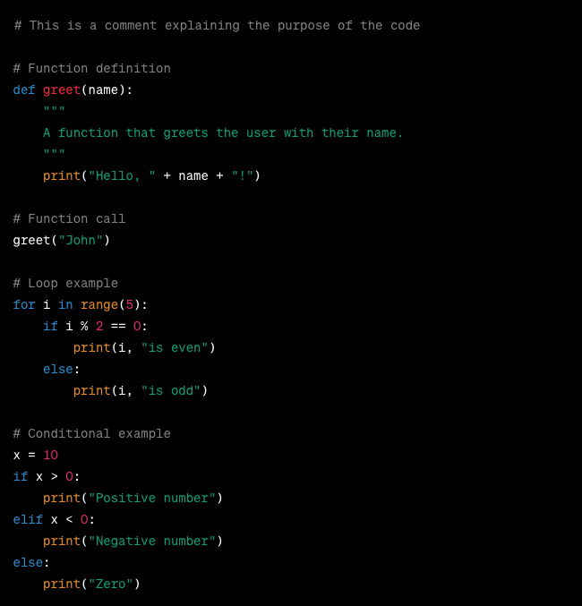

# Python Data Curation Primer

Authors: Megan Sheffield, Jonathan Hernandez, Justin de la Cruz and Kaypounyers Maye

DCN Mentor: Erich Purpur, University of Virginia 

Affiliate Contributors (external peer reviewers): Peter Cerda, Talya Cooper, and Greg Janée

# Overview

|   Topic   |   Description   |
| :------------- | :------------- |
| File Extension | .py (maybe .pyc, .pyd, .pyx, and can additionally be run in a <a href="https://github.com/DataCurationNetwork/data-primers/blob/master/Jupyter%20Notebook%20Data%20Curation%20Primer/Jupyter%20Notebooks%20Data%20Curation%20Primer.md">Jupyter Notebooks environment</a> with a .ipynb file |
| MIME Type | text/x-python |
| Versions | 3.11.4 is the latest version as of writing.    Python 3.x was created in 2008. Python 3 is the current version of Python and is most commonly used today. New projects should be written using python 3.     Python 2.x was created in 2000. Python 2 legacy code still might be encountered.    (See full list of previous versions on Python’s official site <a href="https://www.python.org/doc/versions/">here</a>) |
| Primary fields or areas of use | Python is a general purpose language and can be used in nearly any field for analysis of any data. |
| Source and affiliation | <a href="https://www.python.org/">Python.org</a> |
| Metadata standards | Varies, recommend readme |
| Key questions for curation review | <li>What is the purpose of this file? Are any data associated with this file? Where are the referenced data?</li><li> Is there sufficient configuration information about the file to enable reuse? (Version, libraries, etc)</li> |
| Tools for curation review | Any text editor or Integrated development environment (IDE) including (but not limited to): PyCharm, VSCode, Spyder, Eric, PyDev, Jupyter Lab/Notebook, etc. |
| Date Created | October 2023 |
| Created By | Megan Sheffield, Emory University; Jonathan Hernandez, University of Puerto Rico; Justin de la Cruz, NYU Langone Health; Kaypounyers Maye, Tulane University    Mentor:  Erich Purpur, University of Virginia |

**Suggested Citation:** Sheffield, Megan; Hernandez,Jonathan; de la Cruz, Justin; Maye, Kaypounyers. (2023). Python Data Curation Primer. [Data Curation Network GitHub Repository.](https://github.com/DataCurationNetwork/data-primers)

# Table of Contents

[Description of format](#description-of-format)

[Key questions to ask yourself](#key-questions-to-ask-yourself-about-data-accessibility-andor-reusability)

[Key clarifications to get from researcher](#key-clarifications-to-get-from-researcher-regarding-accessibility-andor-reusability)

[Applicable metadata standard, core elements and readme requirements](#applicable-metadata-standards-core-elements-and-readme-requirements)

[Resources for reviewing data](#resources-for-reviewing-data)

[Sample data set citations](#sample-dataset-citations)

[Software for viewing or analyzing data](#software_for_viewing_or_analyzing_data)

[Dependencies](#dependencies)

[Virtual Environments](#virtual-environments)

[Preservation Actions](#preservation-actions)

[What to look for to make sure this file meets FAIR principles](#what_to_look_for_to_make_sure_this_file_meets_FAIR_principles)

[Ways in which fields may use this format](#ways_in_which_fields_may_use_this_format)

# Description of Format

From [python.org’s executive summary page](https://www.python.org/doc/essays/blurb/): Python is an interpreted, object-oriented, high-level programming language with dynamic semantics. Its high-level built-in data structures, combined with dynamic typing and dynamic binding, make it very attractive for Rapid Application Development, as well as for use as a scripting or glue language to connect existing components together. Python's simple, easy-to-learn syntax emphasizes readability and therefore reduces the cost of program maintenance. Python supports modules and packages, which encourages program modularity and code reuse. The Python interpreter and the extensive standard library are available in source or binary form without charge for all major platforms, and can be freely distributed.

A .py file contains Python code in code blocks with text annotations that typically explain the code. The .py file itself can be opened in any text editor or integrated development environment (IDE). Python programs can include only one file or in the case of a more sophisticated application, many, many files within one program.

You may also encounter similar file extensions like:

\-.pyc : Compiled bytecode of a Python source file for faster execution.
\-.pyd : Windows-specific Python extension module, often containing C/C++ code.
\-.pyx : Source file for Cython, used to create Python extension modules for performance optimization.

The .py format is not to be confused with a Jupyter Notebook file, which has the .ipynb file extension. Jupyter Notebook files contain code, rich text elements, and visualizations allowing for interactive data analysis and documentation in a web-based environment. Jupyter Notebooks are often used for collaborative coding tasks while .py files are more traditional for writing standalone Python scripts.

Here is a very simple example of a few Python code snippets:

<figure>  <figcaption>Image created by authors for demonstration of Python code.</figcaption> </figure>

# Software for viewing or analyzing data

Python script files (.py) are plain text files that can be edited in any text editor. To execute the scripts, they must be run in Python via a command line interface or IDE. Other files also relate to Python and contain scripts. For example, .ipynb is a Python notebook file that can contain Python scripts and can be edited and run in certain software.

- Text editors like Microfsoft’s [Notepad](https://apps.microsoft.com/store/detail/windows-notepad/9MSMLRH6LZF3) and Apple’s [TextEdit](https://support.apple.com/guide/textedit/welcome/mac) allow you to edit Python script files in plain text.

- Advanced text editors will highlight the Python code, making it more human readable. [Sublime Text](https://www.sublimetext.com/), [Brackets](https://brackets.io/), and [Notepad++](https://notepad-plus-plus.org/) are good examples of text editors with syntax highlighting.

- IDEs allow users to not only edit Python script files but also run them from the same program. [Spyder](https://www.spyder-ide.org/), [Visual Studio Code](https://code.visualstudio.com/), and [PyCharm](https://www.jetbrains.com/pycharm/) are examples of IDEs that can run Python scripts.

- Another popular choice for working in Python is a notebook environment, like [Jupyter Notebook](https://jupyter.org/) or [Google Colaboratory](https://colab.research.google.com/). These options run Python in a web browser.

# Key questions to ask yourself about data accessibility and/or reusability

- Are all the [libraries or packages](https://learnpython.com/blog/python-modules-packages-libraries-frameworks/#:~:text=A%20library%20is%20an%20umbrella,and%20other%20packages%20(subpackages).) referenced in the Python script currently available? Are all the imported packages actually used in the code? Which version of the listed packages were used?

- Are all data referenced in the script currently available and accessible? Typically, references to the data follow the function calls such as ‘open’ or ‘read’ in base Python, or if using a library like pandas to read the data then ‘read_csv’, ‘read_excel’, etc.

- If there are multiple scripts and/or other files in a project, is there a main script which runs them? Is it clear which script this is?

- Is the version of Python listed in the files?

- Are the data used in the script available alongside the script, or stored separately? Is there documentation available for the data used? Are there any papers/publications which reference this code and/or data? Do the data and publications have a digital object identifier (DOI)?

- Has the creator used [absolute, rather than relative](https://www.redhat.com/sysadmin/linux-path-absolute-relative#:~:text=An%20absolute%20path%20makes%20no,up%20at%20the%20target%20location.), paths to any data they are using? Absolute paths are unique to their computing environment and might hinder others from reusing their script and data.

- Does the dataset follow Python [accessibility considerations](https://wiki.gnome.org/Accessibility/PythonPoweredAccessibility)?

- Is there a README?

- Have they used best practices for writing code, such as following [PEP8 standards](https://peps.python.org/pep-0008/)?

# Key clarifications to get from researcher regarding accessibility and/or reusability

- Are there clear instructions on how to run the code? This should be included in a README file.

- Determine if all the used packages and versions are openly available. Check if the packages are hosted on platforms such as the Python Package Index (PyPI), Anaconda, or GitHub. It is preferable to use packages from well-established platforms like PyPI or Anaconda.

- Verify if the researcher has included in-line comment descriptions for blocks of code. In-line comments should provide clear and concise explanations of the code's functionality, inputs, and expected outputs. Request the researcher to add comments, even if they are brief. This improves accessibility and readability for both beginner and expert users.

- Verify if the researcher has included text descriptions of any data visualizations. These descriptions should provide an explanation of the visualized data, including the variables being plotted, the type of plot used, and any relevant insights or observations. If such descriptions are missing, ask the researcher to add them (inline in the code) to improve accessibility.

- Has the code been reviewed to make sure extraneous sections, variables, libraries, and packages have been removed?

  - Have they run their code through a linter program such as [PyLint](https://www.pylint.org/), [Sonar](https://www.sonarsource.com/knowledge/languages/python/), or [Ruff](https://astral.sh/ruff)?

  - Have they used best practices for writing code such as following [PEP8 standards](https://peps.python.org/pep-0008/)?

- Are there any papers/publications which reference this code and/or data? Is a DOI available?

# Applicable metadata standards, core elements and README requirements

There are multiple levels of metadata standards possible for projects involving Python files. To simplify this document, we have identified 3 tiers, but individual curators should adjust these requirements to fit their specific needs and circumstances. Another good resource to reference is [SMRF’s guide to software metadata](https://www.softwarepreservationnetwork.org/smrf-guide/).

## Tier 1: Minimum requirements 

These requirements are the bare minimum necessary to make .py files viewable and citable in a repository, but may not necessarily provide all the information needed to run the code.

Files:

- .py file(s)

  - Comments within code to annotate each section are strongly encouraged

- README (as a plain text file), which should include:

  - Title of the .py file(s)

  - Author information including name, contact information, and institution for all PIs/Co-PIs

  - Purpose of the code

  - If there are multiple files in a project, the main file should clearly be indicated

  - Implementation details

    - Version of Python used

    - Alternative environments used (ex: Anaconda, JupyterNotebooks)

    - List of packages/libraries used and their versions

  - How to execute

  - Expected output

  - Dependencies

  - Accessibility information

  - Request that this file include citation(s) to third-party algorithms and analyses

  - Alternate identifiers and supplemental links associated with the analysis, including link/DOI for associated articles or other files used in the original analysis

  - License information (may be included as a standalone file)

- License (as a plain text file)

  - May also be included within the README

Metadata

- Title of the file

- Author information including name, contact information, and institution for all PIs/Co-PIs

- Implementation details

  - Version of Python used

  - Alternative environments used (ex: Anaconda, JupyterNotebooks)

  - Version of packages/libraries used

## Tier 2: Runnable submission requirements

In addition to the baseline requirements listed above for Tier 1, the following additional information would make .py files executable by other users:

Files:

- Comprehensive annotations within the .py file

- User documentation, including instructions for configuration

- Sample input/output files

- Files should include relative pathnames, not absolute pathnames, when referencing other files or datasets

## Tier 3: Comprehensive metadata

In addition to all requirements listed for Tier 1 and Tier 2, this information would enable others to reuse and build from the .py file:

Files:

- Developer documentation

  - Include test code, sample data set, and description of expected results

- Within README:

  - Narrative description of the code and what it does, including comment annotations from .py file

Metadata

- Documentation about the computing ecosystem - see links below

  - [https://codemeta.github.io/](https://codemeta.github.io/)

    - [https://github.com/proycon/codemetapy](https://github.com/proycon/codemetapy)

    - [https://github.com/proycon/codemeta-harvester](https://github.com/proycon/codemeta-harvester)

- [https://docs.python.org/3.6/distutils/](https://docs.python.org/3.6/distutils/)

- [requirements.txt](https://learnpython.com/blog/python-requirements-file/) file to formally identify dependencies

# Dependencies

From
[ActiveState](https://www.activestate.com/resources/quick-reads/python-dependencies-everything-you-need-to-know/):
When managing Python environments, one of the key concerns is dependency management. In the context of Python, "dependencies" refer to external libraries or packages that a Python project relies on to function properly. These dependencies are additional pieces of code that your Python code depends on to perform certain tasks or provide specific functionality. Dependencies can include third-party libraries, modules, or packages that are not part of the Python standard library. Managing and documenting dependencies is an essential part of Python development. It ensures that your project remains consistent across different environments and allows other developers to easily set up and work with your code. It also makes it easier to update or patch dependencies to address security vulnerabilities or take advantage of new features and improvements.

In order to manage dependencies, there are several tools available:

- [pip](https://pip.pypa.io/en/stable/) - pip is the package installer for Python. pip is a command-line tool that allows you to easily install, upgrade, and manage Python packages and libraries from the Python Package Index (PyPI) and other package sources. PyPI is a repository of Python packages that contain reusable code, modules, and libraries that can be used to enhance your Python projects.

- [Conda](https://docs.conda.io/en/latest/) - Conda is a more comprehensive package manager and environment manager that can handle both Python and non-Python packages, making it particularly popular in scientific and data science fields. Conda allows you to switch between and manage multiple general purpose environments across which multiple other things can vary in version number, like Python packages, C-libraries, or compilers, or test-suites, or database engines and so on.

# Virtual Environments

Python virtual environments are isolated environments where you can develop and run Python projects independently of the system-wide Python installation and other projects. They are a crucial tool for managing project-specific dependencies and ensuring that different projects do not interfere with each other. Virtual environments let you have a stable, reproducible, and portable environment. You are in control of which package versions are installed and when they are upgraded. Typically, a [requirements.txt](https://www.freecodecamp.org/news/python-requirementstxt-explained/#:~:text=comes%20into%20play.-,requirements.,environment%20and%20makes%20collaboration%20easier.) file is used to isolate the dependencies from an environment and can be used to re-create that in a virtual environment.

**Disclaimer** - depending on the extent of the project files you are working with, you may or may not need to use a virtual environment to run the Python scripts. You can certainly run Python code without using a virtual environment, and there are cases where it's perfectly fine to do so, especially for simple, one-off scripts or when you're working in an environment where you have complete control over the installed packages and there's no risk of conflicts. However, there are several compelling reasons to use virtual environments for more complex or collaborative Python development.

- Isolation of dependencies: Virtual environments provide a clean and isolated environment for your project. This means the Python packages you install within a virtual environment won’t interfere with the system-wide Python installation or packages used by other projects. It prevents conflicts between different project that may require different versions of the same library.

- Version Control: Virtual environments allow you to specify and control the exact versions of packages your project depends on. This is important for ensuring that your code works consistently across different environments and over time.

- Portability: Virtual environments can be easily moved from one machine to another or recreated on different systems using requirement files. This makes it simpler to replicate your development environment on a new computer or server.

- 

In summary, while it's possible to run Python code without virtual environments, using them is considered a best practice for any non-trivial Python project. They help you manage dependencies, isolate projects, and ensure consistency and reproducibility in your development environment. Virtual environments are especially valuable when working on multiple projects, collaborating with others, or working on long-term projects where dependency management becomes critical.

**How to use a virtual environment?**

- [Corey Schafer](https://www.youtube.com/@coreyms) is a youtuber with really great tutorials on Python virtual environments. Here are a couple of his videos on this subject.

  - [VENV for Windows](https://www.youtube.com/watch?v=APOPm01BVrk)

  - [VENV for Mac/Linux](https://www.youtube.com/watch?v=Kg1Yvry_Ydk)

# Preservation actions

- Python code files are plain text files, making them easy to preserve. They can be opened with any text editor, including Notepad, Sublime Text, or Visual Studio Code. Ensure that the file is saved with the ".py" extension.

- Regarding character encoding, UTF-8 is the recommended encoding for Python code files. UTF-8 supports a wide range of characters, including special and foreign language characters. If the code does not contain any special characters, ASCII encoding is sufficient.

- If the code includes external dependencies managed via package managers like pip or Conda, it is crucial to include a list of required packages with their specific versions. This information should be in a requirements.txt file. This helps ensure reproducibility by allowing others to install the required packages to run the code.

- Similar to R, Python code files have a stable format. However, code functionality depends on code compatibility and the versions of the used packages.

- Provide sufficient descriptive information in a README file and other documentation methods (in-line comments, markdown, etc.)

- Ensure that code has been deposited into a repository that provides DOIs or some other persistent identifier.

# What to look for to make sure this file meets FAIR principles

In order to evaluate a .py script file under the FAIR principles, it must be published in a manner that meets the following:

- To be Findable:

  - F1. metadata are assigned a globally unique and persistent identifier (e.g., DOI)

  - F2. py file(s) is described with rich metadata

  - F3. metadata clearly and explicitly include the identifier of the data it describes

  - F4. metadata are registered or indexed in a searchable resource

- To be Accessible:

  - A1. metadata are retrievable by their identifier using a standardized communications protocol

  - A2. metadata are accessible, even when the .py file is no longer available

- To be Interoperable:

  - I1. metadata use a formal, accessible, shared, and broadly applicable language

  - I2. metadata use vocabularies that follow FAIR principles

  - I3. metadata include qualified references to other metadata

- To be Reusable:

  - R1. metadata are richly described with a plurality of accurate and relevant attributes including usage license, provenance, and domain-relevant community standards

# Ways in which fields may use this format

Python is a versatile programming language that can be used in various fields for a wide range of applications. It has become one of the most popular coding languages because of its flexibility and the powerful libraries that the Python community has built. It is frequently used in data science and analytics, artificial intelligence and machine learning, web development, scientific computing, automation and scripting, internet of things (IoT), game development, finance, quantitative analysis, natural language processing (NLP), cybersecurity, bioinformatics, and geospatial analysis. Although these fields may use Python in very different ways, Python files are all very similar in nature.

Read more about potential applications from [python.org](https://www.python.org/about/apps/).

# Resources for Reviewing Data

Processes related to reviewing, and visualizing, and analyzing data using Python can be carried out using its many libraries. Here are some of the most common Python libraries for these purposes:

1.  Pandas: is a powerful data manipulation and analysis library. It provides data structures like data frames and series, making it easy to work with structured data.(https://pandas.pydata.org/)

2.  Matplotlib: is a widely used plotting library for creating static, animated, and interactive visualizations in Python.(https://matplotlib.org/)

3.  Seaborn: is built on top of Matplotlib and provides a high-level interface for drawing attractive and informative statistical graphics. (https://seaborn.pydata.org/)

4.  NumPy: is a fundamental package for numerical computing with Python, providing support for arrays, matrices, and mathematical functions. (https://numpy.org/)

5.  Jupyter Notebook: is an open-source web application that allows you to create and share documents that contain live code, equations, visualizations, and narrative text. (https://jupyter.org/)

6.  Spyder: is an open-source, powerful, and interactive Python development environment for data science, scientific, and numerical computing tasks. (https://www.spyder-ide.org/)

7.  Scikit-learn: is a popular machine learning library that provides simple and efficient tools for data mining and data analysis. (https://scikit-learn.org/stable/)

8.  Statsmodels: is a library for estimating and testing statistical models. (https://www.statsmodels.org/stable/index.html)

9.  Plotly: is a modern and interactive plotting library that allows creating interactive plots and visualizations. (https://plotly.com/python/)

10. SciPy: is a library for scientific and technical computing. It provides functions for numerical integration, optimization, interpolation, linear algebra, and more. (https://www.scipy.org/)

11. Pandas Profiling: is a library that generates a comprehensive report on the dataset, providing insights into data distribution, missing values, and more. (https://github.com/pandas-profiling/pandas-profiling)

12. Altair: is a declarative statistical visualization library for Python based on Vega and Vega-Lite. (https://altair-viz.github.io/)

13. Dask: is a parallel computing library that enables efficient processing of large datasets in parallel. (https://dask.org/)

Researchers may find some libraries more suitable than others depending on the project’s specific needs.The aforementioned libraries are examples of available tools that can help to review, and visualize, and analyze the data effectively in Python.

# Sample Dataset Citations

In the event you need to cite datasets used to analyze with Python in a publication:

[From Purdue OWL](https://owl.purdue.edu/)

**In text:**

"Python code for data analysis was implemented using a custom script (Smith.py)."

“The algorithm for sentiment analysis was implemented using a Python script (Johnson.py) developed by Johnson (2023)”

"The simulation model was implemented using a custom Python script (Smith.py) written by Smith (2023)."

**Bibliography/Reference Section: **

Smith, J. (2022). Data analysis script (Version 1.0) \[Source code\]. Available at: [https://github.com/username/repository/blob/master/script.py](https://github.com/username/repository/blob/master/script.py)

Johnson, A. (2023). Sentiment analysis script (Version 2.1) \[Source code\]. Available at: /path/to/file/Johnson.py

Smith, J. (2023). "Simulation model script (Version 1.2) \[Source code\]." Available: /path/to/file/Smith.py

## Documentation & Tutorials

- [Python.org](https://www.python.org/) is the official home of the Python language, offering different versions for download, [official Python documentation](https://www.python.org/doc/), and [tutorials](https://wiki.python.org/moin/BeginnersGuide/Programmers) for beginners.

- [Software Carpentry](https://swcarpentry.github.io/python-novice-inflammation/index.html) is a great resource for Python tutorials since they introduce concepts by working through examples with datasets.

- [W3Schools](https://www.w3schools.com/python/) provides a great reference for different Python topics by allowing users to run sample code alongside explanations of concepts.

- Kaggle is a repository for [datasets](https://www.kaggle.com/datasets) that also provides free [Python tutorials](https://www.kaggle.com/learn).

## Books

- [Automate the Boring Stuff](https://automatetheboringstuff.com/) with Python by Al Sweigart

- [Python Data Science Handbook](https://jakevdp.github.io/PythonDataScienceHandbook/) by Jake VanderPlas

- [Learn Python the Hard Way](https://learnpythonthehardway.org/python3/) by Zed A. Shaw
