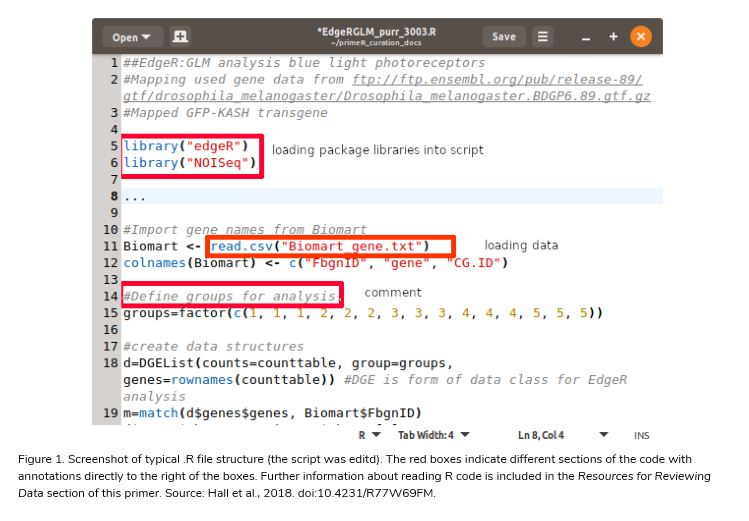

# R Primer

Scope: text files with a “.R” or ".Rmd" extension that contain code for executing programs in the R language 

|   Topic   |   Description   |
| :------------- | :------------- |
| File Extensions | .R (R script) |
| MIME Type | text/plain |
| Structure | unstructured |
| Version | 2.0 |
| Primary fields or areas of use | Data analytics, statistics, bioinformatics, text mining, data science, digital humanities |
| Source and affiliation | [The R Foundation](https://www.r-project.org/foundation/) |
| Metadata | Not Applicable |
| Key questions for curation review | What is the purpose of the file? Are any data associated with the file? Are the referenced data present at the indicated location? |
| Tools for curation review | Any text editor, RStudio |
| Date Created | 201-11-21 |
| Created by | <p> Creators: Lynda Kellam, Cornell University <br> Katherine Koziar, University of California, Riverside <br> Stanislav Pejša, Purdue University </p> <br> Mentor: Joel Herndon, Ph.D. |
| <a id = "version-2.0-updates"> Date updated and summary of changes made </a> | Please see [README](https://github.com/DataCurationNetwork/data-primers/blob/master/R%20Data%20Curation%20Primer/README.md) for complete listing of changes made <p> <br> Notable changes: <ul><li> Accessibilty content added by Emily Oxford, University of Michigan |

------------------------
**Suggested Citation:** Kellam, Lynda; Koziar, Katherine; Pejša, Stanislav. 2019. R Data Curation Primer. [Data Curation Network GitHub Repository.](https://github.com/DataCurationNetwork/data-primers)

This work was created as part of the “Specialized Data Curation” Workshop #2 held at Johns Hopkins University in Baltimore, MD on April 17-18, 2019. These workshops have been generously funded by the Institute of Museum and Library Services # RE-85-18-0040-18.

-----------------------
## Table of Contents

[Description of format](#description-of-format)  

[Ways in which fields may use this format](#ways-in-which-fields-may-use-this-format)

[Examples of R code](#examples)

[Sample dataset citations](#sample-dataset-citations)

[Software for viewing or analyzing data](#software-for-viewing-or-analyzing-data)

[Resources for reviewing data](#resources-for-reviewing-data)

[Key questions to ask yourself](#key-questions-to-ask-yourself)

[Key clarifications to get from researcher](#key-clarifications-to-get-from-the-researcher)

[Applicable metadata standards, core elements, and readme requirements](#applicable-metadata-standards-core-elements-and-readme-requirements)

[Accessibility considerations](#accessibility-considerations)

[Preservation actions](#preservation-actions)

[What to look for to make sure this file meets FAIR principles](#what-to-look-for-to-make-sure-this-file-meets-fair-principles) 

[Documentation of curation process](#documentation-of-curation-process)

[Appendix A: filetype CURATED checklist](#appendix-a-filetype-curated-checklist)

[Appendix B: Long description of Figure 1](#appendix-b-long-description-of-figure-1)

## Description of Format

A file with the extension R (.R) typically contains a script written in R, which is a programming language and environment for statistical computing and graphics. An R script file is a plain text file that stores the R code. R script contains only instructions for analysing, manipulating, and visualizing data, and ideally comments explaining the code. The data are usually stored elsewhere and have to be loaded first, as well as optional R packages that are often needed so that the script runs successfully.

A file with an R markdown extension (.Rmd) contains R code in "code blocks" with text annotations in "text blocks" that typically explain the code or use the code to display visualizations and other supplemental components to support the text. While the file itself can be opened in a text editor, dynamically created output, such as executing scripts, tables, and plots, works only in RStudio.

<a id = "r-file-screenshot"></a>

**Figure 1.** A screenshot of a typical .R file structure (the script was edited). See Appendix B for a [screen reader-friendly description](#appendix-b-long-description-of-figure-1). The red boxes indicate different sections of the code with annotations directly to the right of the boxes. Further information about reading R code is included in the [Resources for Reviewing Data](#resources-for-reviewing-data) section of this primer. Data source: Hall et al. 2018, https://doi.org/10.4231/R77W69FM

## Ways in which fields may use this format

R is used in a variety of ways. It is popular in statistics, bioinformatics, and data science. It is gaining traction in the digital humanities. R  can be used for data analytics, calculations, and data visualization, as R is capable of producing high-quality graphs and plots. 

## Examples

[WUSTL University Libraries](https://libguides.wustl.edu/c.php?g=385216&p=3093966) created a good sample R code file that includes common R syntax including assignment statements, arithmetic functions, basic vectors and structures, and how to access data. Information about reading R code is included in the [Resources for reviewing data](#resources-for-reviewing-data) section of this primer.

## Sample dataset citations

Hall, H., Ma, J., Shekhar, S., Leon-Salas, W. D., Weake, V. M. (2018). Blue light induces a neuroprotective gene expression program in Drosophila photoreceptors - Supporting data for Hall and Ma et al. (2018). Purdue University Research Repository. doi:10.4231/R77W69FM (https://purr.purdue.edu/publications/3003/1)

Seliger, C. S. (2018). Text Mining and Plotting Tools for KSA / DS / HEI Research Study. Purdue University Research Repository. doi:10.4231/R7MK6B49 (https://purr.purdue.edu/publications/3041/1)  

## Software for viewing or analyzing data

R is a plain text file that can be opened in any text editor, but in order to work it needs to be run in the R environment. A simple text editor is sufficient for the file review, but editor with syntax highlighting, such as [Atom](https://atom.io/), [Sublime Text](https://www.sublimetext.com/), or [Notepad++](https://notepad-plus-plus.org/) will make the review much easier. 
- [R](https://www.r-project.org/): The R software environment is free to download and use.
- [RStudio](https://rstudio.com/products/rstudio/download/): RStudio is an open source IDE (or integrated development environment) for R. It is free for non-commercial use. For many users, RStudio is a more intuitive interface to view and analyze .R script files; however, it does have its own [accessibility issues](https://support.rstudio.com/hc/en-us/articles/360045612413-RStudio-Screen-Reader-Support#rstudio-desktop). RStudio requires R to be installed separately. They maintain a mirror as part of the Comprehensive R Archive Network (CRAN) for [precompiled binary distributions](https://cran.rstudio.com/) of the base system for download.

.Rmd files can be displayed and manipulated in RStudio; in a plain text editor, the content of R Markdown code and text blocks will be displayed, but none of the visualizations generated by the code (if any) will appear. Many R Markdown files created in RStudio can be saved in HTML format as well and displayed in a web browser.

## Resources for reviewing data

### R Tutorials
- Software Carpentry lessons are generally more accessible for new learners. An overview of the RStudio interface is included in [this tutorial](http://swcarpentry.github.io/r-novice-gapminder/).

- Tutorials as part of the R Network:
    - [The R Manuals](https://cran.r-project.org/manuals.html#R-exts)
    - [An Introduction to R](https://cran.r-project.org/doc/manuals/r-release/R-intro.html)

- Tutorials created by RStudio:
    - [RStudio Primers](https://www.rstudio.com/online-learning/)

- Online books:
    - [R Programming for Data Science](https://bookdown.org/rdpeng/rprogdatascience/). Peng, R. D. (2019).
    - [R for Data Science: Import, Tidy, Transform, Visualize, and Model Data](http://r4ds.had.co.nz/). Wickham, H., & Grolemund, G. (2017).​

## Key questions to ask yourself

- Are all the packages available? Are all the listed packages used? Which version of the listed packages were used? 

- Are all data referenced in script available? Typically, references to data follow function calls such as ‘*read*’ or ‘*load*’.

- Often data files are stored separately from the script file. Can the data be accessed? Are they provided with the script or is a URL available?  

- Does the dataset follow R [accessibility considerations](#accessibility-considerations)?

- Are any links to other files absolute or relative (i.e., are links to other files/directories replicated as absolute throughout the script)? 

## Key clarifications to get from the researcher

- Are all the used packages openly available? And if so where? (It can be a researcher’s website, but ideally another more general sharing platform, such as CRAN or GitHub.) If the files are not in CRAN, GitHub, or other publicly available site, please include the source code for the packages. 

- Did the researcher include in-line comment descriptions of blocks of code? If not, ask them to add them, even if the comments are brief. This will improve accessibility and readability for beginner and expert users alike.

- Did the researcher include text descriptions of any data visualizations to improve accessibility? If not, ask them to add them (see [Accessibility Considerations](#accessibility-considerations) below).

## Applicable metadata standards, core elements, and readme requirements

### READMEs

There are currently (July 2019) two schools of thought regarding READMEs with scripts. The first is that there should be a README with all scripts that explicitly lists items about the script; we will call this “Best Practices”, since README files are best and standard practices in computer coding and scripting. The second school of thought is that much of this information is already in the script itself; we will call this “Good Enough Practices”. Please note, in order for Good Enough Practices to work, the script file must be properly commented so a user understands what the code is expected to do. A single README file is sufficient for a group of scripts that are grouped together as a single dataset. 

### README requirements

README should provide information on  

- The purpose of the script(s).

- The version of R used when the script was developed. 

- How to execute the script(s) in the .R or .Rmd file.

- The expected output.

- List of dependencies (things the script(s) need(s) to successfully run) such as
    - Other datasets or additional scripts that are called in the .R file  
    - Packages

- Accessibility information - which part(s) of the code may introduce accessibility challenges (such as data visualizations), attempts to remediate those challenges, and who to contact for accessibility support if the dataset proves inaccessible to an interested user.

#### Optional

- Citation: if there is no separate citation file, READMEs will sometimes include an example citation. 

- License: if there is no separate license file, READMEs will sometimes include license information.

#### Notes on Packages

Since some R Packages are actively developed, it is a Best Practice to keep track of the version used. 

- **Best Practices**: A README will list the packages used by the script. This list should include the version of the package and links to the package repository. 
    - (e.g. ggplot v.3.2.0, https://cran.r-project.org/web/packages/ggplot2/index.html <br> dplyr v.0.8.3, https://cran.r-project.org/web/packages/dplyr/index.html)  

- **Good Enough Practices** packages are usually listed at the beginning of a script in a block of text. Typically the name of a package is in parentheses following the term *library*. 

```r
library(tidyverse)
library(janitor)
library(lubridate)
library(ApacheLogProcessor)
library(urltools)
library(rgeolocate)
```

### Metadata Standards

Metadata standards are not usual for most script submissions. Most programming languages do not have metadata standards in the way traditionally understood by librarians and data curators; however, the closest equivalents are coding conventions and standards within the language, and metadata standards for libraries or packages used to extend the language. The former are covered in the Styles for R section below. The latter may be found in any R package hosted on the official [Comprehensive R Archive Network](https://cran.r-project.org/web/packages/) page​. These standards are not expected in a Good Enough Practices script submission, but if one were looking for R metadata standards, packages are a good place to start. 

### Styles for R

Style in terms of a programming language is the way the language is written in a script. There are certain items that are enforced by the code to allow the script to run; however, beyond that scripts may be written as the programmer wishes. It is not expected that a curator should enforce Style in R, but if a researcher wants to make their code more readable, they should follow good style practices. Below are two style guides used in the R community. 

- [Google's R Style Guide](https://google.github.io/styleguide/Rguide.xml)
- [The tidyverse style guide](https://style.tidyverse.org/) by Hadley Wickham

## Accessibility considerations

The accessibility of the R file format varies depending on its contents. Most proficient R users will be able to read, run, and broadly understand an R dataset if the relationships between all files are explicitly documented and in-line comments clearly explain the purpose behind each block of code. However, the software often used to create and run R files is inaccessible to many; beyond this, any data visualization generated in an R file will require further work to facilitate access.

### RStudio

- **Ensure that no part of the code or accompanying documentation requires interaction with RStudio.** In spite of recent updates, RStudio is generally [not compatible with screen readers](https://support.rstudio.com/hc/en-us/articles/360045612413-RStudio-Screen-Reader-Support), and those who use them understandably prefer the native R IDE console or the command line interface.<sup><a href = "#accessibility-footnote-1">1</a></sup>

### Data Visualizations

Does the file generate any visualizations? If so, make sure there are multiple ways to access and interpret them.

- **Include the data that created the visualization in the dataset.**<sup><a href = "#accessibility-footnote-2">2</a></sup> CSV is the preferred file format for accessibility. Be mindful that access to underlying data does not mean that all users will be able to understand the visualization at the same level, since visualizations illuminate patterns and nuances in a way that tabular data alone cannot.<sup><a href = "#accessibility-footnote-3">3</a></sup> However, having the data available makes it easier for proficient R users to explore it with tools and methods that work for them, such as [sonification](https://cran.r-project.org/web/packages/sonify/sonify.pdf).

- **Ask the dataset’s creator(s) to write a detailed description of the visualization.**
    - If the visualization is generated in an .R file, include the description in an in-line comment, making sure to briefly state the comment’s purpose in the comment itself. In an .Rmd file, the description can be included in an in-line comment (or markdown block for an R Markdown file.).
    - As the expert on their own work, the creator will have the understanding and expertise to write a sufficiently detailed description of a visualization more so than any curator.<sup><a href = "#accessibility-footnote-4">4</a></sup> The [Diagram Center’s Image Description Guidelines](http://diagramcenter.org/table-of-contents-2.html) are a useful starting point for anyone unsure of how to best describe a graph or diagram in writing.
    - Describe, but do not interpret the visualization for users. They should be able to draw their own conclusions about any patterns the visualization does or does not show.<sup><a href = "#accessibility-footnote-5">5</a></sup>

- **Ensure that any data visualizations follow accessible color contrast guidelines.** There are a variety of [automated contrast checkers](https://www.webaxe.org/color-contrast-tools/) you can use to see if the colors need to be altered.

### Areas for Further Exploration

In 2018, Godfrey, Murrell, and Sorge presented [a workflow in R for creating a more accessible version of data visualizations](https://doi.org/10.1007/978-3-319-94277-3_92). Unfortunately, [BrailleR](https://www.rdocumentation.org/packages/BrailleR/versions/0.30.2) - an R library necessary for this workflow - is now [deprecated](https://cran.r-project.org/web/packages/BrailleR/index.html) and will be difficult to implement until it is updated. However, the workflow they present is likely to be replicable:
1. Create an SVG file from a data visualization.
2. Edit/add underlying XML of SVG file to add or alter accessibility metadata.
3. Use a JavaScript package to render the visualization in a browser; enable keystroke navigation to explore the different layers of the data.

An [online demo](https://zorkow.github.io/BrailleR/www/) of the final product is still available.

Finally, data curators and depositors alike may benefit from the following readings:
- [Accessible R Markdown Documents](https://r-resources.massey.ac.nz/rmarkdown/) (A. Jonathan R. Godfrey, 2018)
- [Advice From Blind Teachers on How to Teach Statistics to Blind Students](http://jse.amstat.org/v23n3/godfrey.pdf) (A.J.R. Godfrey and M.T. Loots, 2015). Although this work is focused less on research and more on instruction, there are several transferable takeaways.
- [RMarkdown Reference Guide](https://rstudio.com/wp-content/uploads/2015/03/rmarkdown-reference.pdf) (RStudio, 2014) 
- [RStudio Accessibility Features](https://support.rstudio.com/hc/en-us/articles/360044226673-RStudio-Accessibility-Features) (Gary Ritchie, 2020)
- [Statistical Software (R, SAS, SPSS, and Minitab) for Blind Students and Practitioners](http://dx.doi.org/10.18637/jss.v058.s01) (A.J.R. Godfrey and M.T. Loots, 2014)

<sup><a id = "accessibility-footnote-1">1</a></sup> Godfrey, A.J.R., Murrell, P., Sorge, V., 2018. An Accessible Interaction Model for Data Visualisation in Statistics, in: Miesenberger, K., Kouroupetroglou, G. (Eds.), Computers Helping People with Special Needs, Lecture Notes in Computer Science. Springer International Publishing, Cham, pp. 593, https://doi.org/10.1007/978-3-319-94277-3_92

<sup><a id = "accessibility-footnote-2">2</a></sup> Walker, W., Keenan, T., 2015. Going Beyond Availability: Truly Accessible Research Data. Journal of Librarianship and Scholarly Communication 3, pp. 5. https://doi.org/10.7710/2162-3309.1223

<sup><a id = "accessibility-footnote-3">3</a></sup> Godfrey, A.J.R., Murrell, P., Sorge, V., 2018. An Accessible Interaction Model for Data Visualisation in Statistics. See <a href = "#accessibility-footnote-1">note 1</a>. Pp. 592, https://doi.org/10.1007/978-3-319-94277-3_92

<sup><a id = "accessibility-footnote-4">4</a></sup> Godfrey, A.J.R., Loots, M.T., 2015. Advice From Blind Teachers on How to Teach Statistics to Blind Students. Journal of Statistics Education 23, 4, pp. 10. https://doi.org/10.1080/10691898.2015.11889746

<sup><a id = "accessibility-footnote-5">5</a></sup> Conversation with [U-M Accessibility Team](https://accessibility.umich.edu/about-us) (Darrell Williams)

## Preservation actions

R files are plain text files, therefore the preservation stakes are not very high. Curators should be able to open .R files with any text editor, including Notepad, Notepad++, gedit, etc. One possible concern may be with character encoding. For that, UTF-8 encoding is the best option, but if no special or foreign language characters (such as Greek letters) or mathematical formulas are present, simple ASCII is adequate. All other character encodings should probably be converted to Unicode.

The .Rmd format is approximately as stable as a plain text file; much like with a plain R file, the functionality of the file will depend on the compatibility/versioning of the code and any packages used.

## What to look for to make sure this file meets FAIR principles

In order to evaluate an .R script file under the FAIR principles<sup><a href = "#fair-footnote-1">1</a></sup>, it must be published in a manner that meets the following:

- To be Findable: 
    - F1. metadata are assigned a globally unique and persistent identifier (e.g., DOI)
    - F2. .R file is described with rich metadata 
    - F3. metadata clearly and explicitly include the identifier of the data it describes 
    - F4. metadata are registered or indexed in a searchable resource 

- To be Accessible<sup><a href = "#fair-footnote-2">2</a></sup>: 
    - A1. metadata are retrievable by their identifier using a standardized communications protocol
    - A2. metadata are accessible, even when the .R file is no longer available

- To be Interoperable: 
    - I1. metadata use a formal, accessible, shared, and broadly applicable language 
    - I2. metadata use vocabularies that follow FAIR principles 
    - I3. metadata include qualified references to other metadata

- To be Reusable:
    - R1. metadata are richly described with a plurality of accurate and relevant attributes including usage license, provenance, and domain-relevant community standards 

<a id="fair-footnote-1"><sup>1</sup></a> Wilkinson, M., Dumontier, M., Aalbersberg, I. et al. The FAIR Guiding Principles for scientific data management and stewardship. Sci Data 3, 160018 (2016) doi:10.1038/sdata.2016.18 </p>

<a id="fair-footnote-2"><sup>2</sup></a> The FAIR accessibility principle does not currently (August 2020) include a specific requirement for accessibility for people with disabilities. We urge curators to consider it a FAIR requirement nonetheless, in the spirit of the accessibility principle itself: "Once the user finds the required data, she/he[/they] need[s] to know how can they be accessed." 

## Documentation of curation process

R scripts can interact with a variety of formats, such as CSV, TSV, TXT, Apache server log files, but also proprietary ones such as XLSX, XLS, or stata. Often the more specialised or proprietary formats require corresponding R package (RStata, readxl, etc.). R can also store data in its native format called *. RDATA or in its earlier version *.RDA. These files store not only the data, but also the working environment which includes the function and value objects created during an open session in R. These files cannot be opened in the text editor.  

In addition, researchers who use the RStudio IDE can submit with their data a file with extensions such as .Rproj or .Rmd. The .Rproj data contains metadata that are project oriented, it stores environment and variable pertinent to a given project.

## Appendix A: filetype CURATED checklist

### CHECK Step

| **CURATE Action** | **Curator Checklist** |
| :------------- | :------------- |
| <p> **Check** data files and read documentation <br> <ul><li> Review the content of the data files (e.g., open and run the files or code). </li><li> Verify all metadata provided by the author and review the available documentation. </li> </ul> </p> | <p><ul><li> Files open as expected <ul><li> Issues __________  </li></ul></li><li> Code runs as expected <ul><li> Produces minor errors </li><li> Does not run and/or produces many errors </li><li> Did not try to run code </li></ul></li><li> Metadata quality is rich, accurate, and complete <ul><li> Metadata has issues _________ </li><li> Metadata in comments </li></ul></li><li> Documentation Type (circle) <br> Readme / Codebook / Data Dictionary / Other:________________________ <ul><li>Missing/None </li><li> Needs work </li></ul></li></p> |

### UNDERSTAND Step

| **CURATE Action** | **Curator Checklist** |
| :------------- | :------------- |
| <p> **Understand** the data (or try to) <br> <ul><li> Check for quality assurance and usability issues. </li><li> Try to detect and extract any “hidden documentation” inherent to the data files that may facilitate reuse. </li><li> Determine if the documentation of the data is sufficient for a user with similar qualifications to the author’s to understand and reuse the data. If not, recommend or create additional documentation (e.g., a readme.txt template). </li><li> Verify that all files are as accessible as possible for all users, including users with disabilities. </li> </ul> </p> | <p><ul><li> The code's formatting aids readability <ul><li> Spacing between code section </li><li> Code within conditionals and loops (​if​ and for ​statements) is indented </li><li> Code looks like one block of text </li></ul></li><li> Clear variable names <ul><li> Variable names self-defined </li><li> Comments describe variable names </li><li> Documentation describes variable names </li><li> Missing/None </li><li> Needs work </li></ul></li><li> Clear sections of code <ul><li> Sections self-define code actions </li><li>Comments describe code actions </li><li> Documentation describes code actions </li><li> Missing/None </li><li> Needs work </li></ul></li><li> Review Documentation (in previous step, CHECK) for completeness and clarity  </li><li> All [accessibility considerations](#accessibility-considerations) met to the extent possible </li></ul></p> |

### REQUEST Step

| **CURATE Action** | **Curator Checklist** |
| :------------- | :------------- |
| <p> **Request** missing information or changes <br> <ul><li> Generate a list of questions for the data author to fix any errors or issues, including accessibility. </li></p> | <p> Narrative describing the concerns, issues, and needed improvements to the data submission.<ul><li> Inquiry sent to researcher </li><li>Response received </li><li> Additional follow up communication needed </li></p> |

### AUGMENT Step

| **CURATE Action** | **Curator Checklist** |
| :------------- | :------------- |
| <p> **Augment** the submission <br> <ul><li> Enhance metadata to best facilitate discoverability. </li><li> Create and apply metadata for the data record, including descriptive keywords. </li><li> When appropriate, structure and present metadata in domain-specific schemas to facilitate interoperability with other systems. </li></p> | <p><ul><li> Discoverability sufficient <ul><li> Recommend (circle one) full-text index / file rename / file reorder / file descriptions / zip files into one archive Other ______________   </li></ul></li><li> Keywords Sufficient <ul><li> Suggestions _______________ </li></ul></li><li> Linkages Sufficient <ul><li> Link to report/paper </li><li> Link to related datasets </li><li> Link to source data </li><li> Link to other ____________ </li></ul></li></p> |

### TRANSFORM Step

| **CURATE Action** | **Curator Checklist** |
| :------------- | :------------- |
| <p> **Transform** file formats <br> <ul><li> Identify specialized file formats and their restrictions (e.g., Is the software freely available? Link to it or archive it alongside the data). </li><li> Transform files into open, non-proprietary file formats<a href = "#CURATED-checklist-footnote-2"><sup>2</sup></a> that broaden the potential audience for reuse and ensure that preservation actions might be taken by the repository in later steps. Retain original files if data transfer is not perfect. </li></p> | <p><ul><li> Preferred file formats in use <ul><li> Recommend conversion from _________ to _________ </li><li> Retain original formats </li></ul></li><li> Software needed is readily available <ul><li> Unclear version of software </li><li> Unclear software used </li></ul></li><li> Visualization of data easily accessible <ul><li> Recommend graphical representation ____________  </li><li> Recommend web-accessible surrogate ________________ </li></ul></li></p> |

<a id = "CURATED-checklist-footnote-2"><sup>2</sup></a> See [Cornell’s List of Preservation Format Recommendations](http://guides.library.cornell.edu/ecommons/formats).

### EVALUATE Step

| **CURATE Action** | **Curator Checklist** |
| :------------- | :------------- |
| <p> **Evaluate** and rate the overall data record for FAIRness. <br> <ul><li> Score the dataset and recommend ways to increase the FAIRness of the data and become “DCN approved." | <p> Findable- <ul><li> Metadata exceeds author/ title/ date. </li><li> Unique PID (DOI, Handle, PURL, etc.). </li><li> Discoverable via web search engines </li></ul> <br> Accessible- <ul><li> Retrievable via a standard protocol (e.g., HTTP). </li><li> Free, open (e.g., download link). </li></ul><br> Interoperable- <ul><li> Metadata formatted in a standard schema (e.g., Dublin Core). </li><li> Metadata provided in machine-readable format (OAI feed). </li></ul><br> Reusable- <ul><li> Data include sufficient metadata about the data characteristics to reuse </li><li> Contact info displayed if the direct assistance of the author needed. </li><li> Clear indicators of who created, owns, and stewards the data. </li><li> Data are released with clear data usage terms (e.g., a CC License). </li></ul></p> |

### Document

| **CURATE Action** | **Curator Checklist** |
| :------------- | :------------- |
| <p> **Document** throughout curation activities. <br><ul><li>Record all necessary information capturing who did what to the dataset and when </li></p> | <p><ul><li> Accessioning & deposit records (Names, dates, contact information, submission agreements, etc) </li><li> Repository collection metadata </li><li> Provenance logs </li><li> Service workflow </li><li> Preservation packaging </li><li> Any additional requirements at your institution </li></ul></p> |

## Appendix B: Long description of [Figure 1](#r-file-screenshot)

Figure 1 contains the following code:

```r
###EdgeR: GLM analysis blue light photoreceptors
#Mapping used gene data from ftp://ftp.ensembl.org/pub/release-89/gtf/drosophila_melanogaster/Drosophila_melanogaster.BDGP6.89.gtf.gz

library("edgeR")
library("NOISeq")

...

#Import gene names from Biomart
Biomart <- read.csv("Biomart_gene.txt")
colnames(Biomart) <- c("FbgnID", "gene", "CG.ID")

#Define groups for analysis
groups = factor(c(1, 1, 1, 2, 2, 2, 3, 3, 3, 4, 4, 4, 5, 5, 5))

#create data structures
d=DGEList(counts=counttable, group=groups,
genes=rownames(counttable)) #DGE is form of data class for EdgeR

m=match(d$genes$genes, Biomart$FbgnID)

```

These segments of the code above are labelled as follows:
- "loading package libraries into script":
```r
library("edgeR")
library("NOISeq")
```
- "loading data":
```r
Biomart <- read.csv("Biomart_gene.txt")
```
- "comment":
```r
#Define groups for analysis
```
