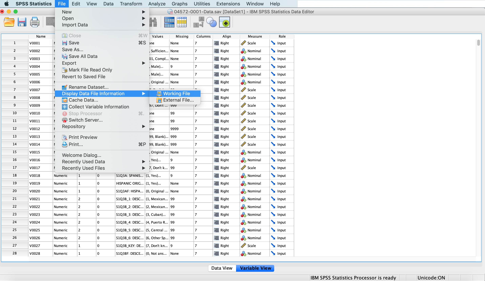

# SPSS Data Curation Primer

**Participants:**
- Sai Deng, University of Central Florida ([saideng@ucf.edu](mailto:saideng@ucf.edu))
- Joshua Dull, Yale University ([joshua.dull@yale.edu](mailto:joshuadull@yale.edu))
- Jeanine Finn, Claremont Colleges ([jeanine.finn@claremont.edu](mailto:jeanine.finn@claremont.edu))
- Shahira Khair, University of Victoria ([skhair@uvic.ca](mailto:skhair@uvic.ca))

**Mentor:**    Sophia Lafferty-Hess, Duke University ([sophia.lafferty.hess@duke.edu](mailto:sophia.lafferty.hess@duke.edu))

**Suggested Citation:** Deng, Sai; Dull, Joshua; Finn, Jeanine; Khair, Shahira (2019). SPSS Data Curation Primer. [Data Curation Network GitHub Repository.](https://github.com/DataCurationNetwork/data-primers)

An archived version of this primer is available at: Deng, Sai; Dull, Joshua; Finn, Jeanine; Khair, Shahira (2019). SPSS Data Curation Primer. Data Curation Network. Retrieved from: the University of Minnesota Digital Conservancy, http://hdl.handle.net/11299/202812

This work was created as part of the Data Curation Network "Specialized Data Curation Workshop" #1 co-located with the Digital Library Federation (DLF) Forum 2018 in Las Vegas, Nevada on October 17-18, 2018. These workshops have been generously funded by the Institute of Museum and Library Services # RE-85-18-0040-18.

See also: Primers authored by the workshop attendees at DLF: http://datacurationnetwork.org.

# Table of Contents

<!-- TOC depthFrom:1 depthTo:6 withLinks:1 updateOnSave:undetermined orderedList:0 -->

- [Format Overview](#Format-Overview)
- [Description of Format](#Description-of-Format)
- [Format Use](#Format-Use)
- [Example Data](#Example-Data)
- [Start the Conversation, Broad Questions and Clarifications on Research Data](#Start-the-Conversation,-Broad-Questions-and-Clarifications-on-Research-Data)
- [Key Questions](#Key-Questions)
- [Additional Clarifications](#Key-Clarifications)
- [Applicable Metadata Standards, Recommended Elements and Readme File](#Applicable-Metadata-Standards,-Recommended-Elements-and-Readme-File)
- [Tutorials](#Tutorials)
- [Software](#Software)
- [Preservation Actions](#Preservation-Actions)
- [Documentation of Curation Process](#Documentation-of-Curation-Process)
- [Appendix A Using CURATE with SPSS Data](#Appendix-A-Using-CURATE-with-SPSS-Data)
- [Appendix B Other SPSS File Formats](#Appendix-B-Other-SPSS-File-Formats)
- [Appendix C Project Level or Study Level Metadata](#Appendix-C-Project-Level-or-Study-Level-Metadata)
- [Appendix D DDI Metadata](#Appendix-D-DDI-Metadata)
- [Appendix E Dictionary Schema](#Appendix-E-Dictionary-Schema)
- [Bibliography](#Bibliography)

<!-- /TOC -->

# Format Overview

|   Topic   |   Description   |
| :------------- | :------------- |
| File Extensions | .sav .por .sas .spv/.spo |
| MIME Type | application/x-spss-sav application/x-spss-por |
| Structure | .sav: Proprietary binary format, with metadata; sections include header, dictionary, and observations. .por: Portable file format that saves data and metadata as ASCII text. .sps: Plain-text file format that records SPSS syntax, to recreate analyses. spv/.spo: Proprietary data formats containing outputs (e.g. tables, charts, visualizations) generated by analytic functions run in SPSS (.spv = v.16 and later; .spo = v.15 and earlier). |
| Versions | 27.0 Most recent version as of 07/13/2020. See release notes: [https://www.ibm.com/support/pages/node/3003615](https://www.ibm.com/support/pages/node/3003615) |
| Primary fields or areas of use | Social sciences, psychology, education, health sciences, and survey data |
| Source and affiliation | [SPSS Statistics](https://www.ibm.com/products/spss-statistics) is a software package initially created by SPSS Inc. It was acquired by IBM in 2009 and currently it is named IBM SPSS Statistics. |
| Metadata | The SPSS Dictionary (also called &quot;codebook&quot;) is part of the SPSS data file (.sav, .por) and it holds all metadata, specifically, .sav: Can contain names and labels for variables, an unformatted textual description, and an extension record with attributes. por: Can contain names and labels for variables and an unformatted textual description. |
| Key questions for curation review | <ul><li> What version of SPSS were these files created with? Which is the latest version at the time of curation? Which versions are currently supported by the software producers and common operating systems?</li><li> Are the variables well-described (with labels, etc.) within SPSS variables table? Is there an external codebook or data dictionary? </li><li> Is there an additional README file or other documentation containing the project context, methodology, protocols and other data documentation? </li><li> Is the data &quot;native&quot; to SPSS, or was it exported to SPSS from another statistical package? </li><li> Which files (e.g., data, syntax, output) are essential to effectively sharing this data? Which are optional? </li><li> Would a researcher in this field or others have all they need to interpret this data? </li><li> What are the file formats of the data received? Check for a data file and codebook (.sav), and syntax file (.sps). </li><li> Is use of a file-naming convention evident? Are the file names understandable? Are relationships between files explained?       
| Tools for curation review | <ul><li> [SPSS](https://www.ibm.com/ca-en/marketplace/spss-statistics) </li><li> [Smartreader for SPSS Statistics](https://developer.ibm.com/predictiveanalytics/docs/spss-statistics/programmability/extensions-tools-and-utilities-for-spss-statistics/) </li><li> [PSPP](https://www.gnu.org/software/pspp/) </li><li> [ViewSav](http://www.asselberghs.dds.nl/stuff.htm) </li><li> [R](https://cran.r-project.org/web/packages/rio/vignettes/rio.html) (Haven and rio packages) </li><li> [SAS](https://www.sas.com/) (SAS v.9.1.3 and later) </li><li> [STATA](https://ideas.repec.org/c/boc/bocode/s456957.html) (USESPSS)|
| Date Created | 12/21/2018 |
| Created by | Sai Deng, University of Central Florida - [email protected] Dull, Yale University - [email protected] Finn, Claremont Colleges - [email protected] Khair, University of Victoria - [email protected] |
| Date updated and summary of changes made | 04/08/2019 - updated to include comments from peer review process |

# Description of Format

While this primer primarily discusses .sav and .por files, there are other possible file formats which are typically associated with the software SPSS. See [Appendix B Other SPSS File Formats](#Appendix-B-Other-SPSS-File-Formats)

**SPSS Statistics** (.sav): Data files saved in IBM SPSS Statistics format

  a. Proprietary, binary format that contains both the data (observations) and the description of the data (metadata).

  b. File is divided into sections: a header (file level metadata), a dictionary (variable names and labels), and the data itself (observations).

  c. Data files saved in .sav format cannot be read by earlier versions of SPSS prior to version 7.5. Data files saved in Unicode encoding cannot be read by releases of the software prior to version 16.0 .sav files may be created with other encodings such as ASCII and UTF-8.

**Portable** (.por): Portable format that can be read by other versions of IBM SPSS Statistics and versions on other operating systems.

  a. In most cases, saving data in portable format is no longer necessary, since .sav data files should be platform/operating system independent.

  b. Saving a file in portable format takes considerably longer than saving the file in .sav format.

  c. .por files can be opened by the free/open source version of SPSS, called [PSPP](https://en.wikipedia.org/wiki/PSPP).

# Format Use

  - Various types of quantitative analyses use SPSS software.

  - SPSS also permits export to a number of other proprietary formats -- SPSS could be used as a "translational" format.

  - Multiple datasets might be used in support of meta-analyses and longitudinal studies in social science research.
  
# Example Data

**Examples below link to study in the ICPSR which offers SPSS as a download option.**
  
  - United States. Bureau of Justice Statistics. Survey of Inmates in State and Federal Correctional Facilities, [United States], 2004. Inter-university Consortium for Political and Social Research [distributor], 2019-12-12. [https://doi.org/10.3886/ICPSR04572.v6] (https://doi.org/10.3886/ICPSR04572.v6)
  - Cohen, Deborah (Deborah Ann). Evaluation of the Balance Calories Initiative, 2016 Baseline, Alabama and Mississippi. Ann Arbor, MI: Inter-university Consortium for Political and Social Research [distributor], 2018-12-17. [https://doi.org/10.3886/ICPSR37110.v1](https://doi.org/10.3886/ICPSR37110.v1)

# Start the Conversation, Broad Questions and Clarifications on Research Data

Before going into technical details specific to the SPSS data format, having a short conversation with researchers about their area of research, and data practices is helpful.

The main assumptions about SPSS are that it is used by researchers for quantitative analysis and for producing graphical representations of their data. After talking to researchers, our group now has a better understanding of how some researchers analyze, save and share their data with SPSS.

**Is SPSS used by many researchers doing quantitative analysis? How is SPSS compared to similar statistical programs?**

The researchers interviewed indicated that SPSS is commonly used by new or early career researchers, who are often introduced to the software in their graduate programs. Many research institutions have access to the software, so it is commonly used for instruction of students. Fields of research in which SPSS is commonly used include the social sciences, psychology, and education.

The researchers interviewed primarily used more advanced software for statistical analysis, including STATA, SAS, and R, but SPSS is a good option for those who do not have programming skills. Researchers noted the proprietary (and expensive) nature of SPSS software as part of their motivations for increasingly working with open source platforms like R alongside SPSS. Many times research projects involve work with outside collaborators who may not have institutional access to SPSS, so the ability to work across software platforms is key.

**What kind of data do researchers generate on import into SPSS?**

The researchers interviewed used a range of structured data inputs with SPSS including tabular data and relational databases, with information from a variety of sources: web data, survey responses, model simulations, etc.

One researcher described his research using a diary study for a project in cognitive psychology. The participant diaries were coded by hand, and the codes were input as tabular data into SPSS. The researcher then used regression analysis and structural equation modeling tools within SPSS to look for patterns across diaries.

**How do researchers document their data in SPSS?**

SPSS automatically generates three main outputs: the data file (*.sav), the codebook, and the syntax file. The codebook describes variables and values 
contained in the data file, while the syntax describes the analysis process. The codebook and syntax file are important metadata to capture along with the data, but may not be sufficient to capture the context, methodology and provenance of the dataset being created.

Researchers generally described making use of SPSS functions to document their data, rather than creating separate README files. This includes creating thorough and descriptive variable and value labels, and saving complete syntax files (sometimes with additional comments).

**What kind of data outputs are researchers able or willing to share from SPSS?**

The researchers interviewed primarily export their data file created in SPSS into a non-proprietary format (e.g., csv), if they intend to share it or analyze it with another piece of software. Researchers also reported sharing the syntax file to describe table structures and methods of analysis. Codebooks were also considered essential for sharing data. If needed, the curator can generate documentation from the datasets the researchers provided such as variable lists and data dictionaries.

# Key Questions

These are &quot;reflection&quot; questions for the curator or curation team to review while looking over the dataset. The answers (or lack of answers) will help to determine what kind of clarifications might be needed from the researchers.

  1. What are the file formats of the data received? Check for a data file and codebook (.sav), and syntax file (.sps).

  2. What version of SPSS were the data files created with, compared with the current version at the time of curation?

  3. Is use of a file-naming convention evident? Are the file names understandable? Are relationships between files explained?

  4. Are the variables well-described (with labels, etc.) within SPSS variables table? Is there an external codebook or data dictionary?

  5. Is there an additional README file or other documentation containing the necessary project context, methodology, and other information?

  6. What does the data contained represent? Is additional documentation necessary for interpretation? (e.g., if the data represents survey results, is it a complete copy of the survey or interview instrument available as a separate file?)

  7. Which files (e.g., data, syntax, output) are essential to effectively sharing this data? Which are optional?

  8. Would a researcher in this field or others have all documentation they need to interpret this data?

# Additional Considerations

If answers to the following are not addressed in any associated metadata or documentation, follow up with the researcher for further clarification.

Data Analysis and Curation

  1. What are the dates of data collection?

  2. Is there information about the provenance of the data (e.g. when changes were made and by whom)?
  
  3. Are there missing or null values in the data? How is missing data handled/defined?

  4. Does the dataset contain any imputed data?

  5. Are the data weighted in any way?
  
  6. Are the data from multiple sources? Are they cited? What are the sharing permissions?
  
  7. Were other software tools used for data gathering/cleaning/transforming (e.g. OpenRefine, R, etc.)? Are they listed in the documentation?

  8. Were any [SPSS extensions] (https://www.ibm.com/support/knowledgecenter/SSLVMB_24.0.0/spss/base/extensions_intro.html) used in this analysis? Are they listed in the documentation?

Sensitive Data

  1. If data pertains to human subjects, have data been sufficiently anonymized?

  2. If anonymized data are being shared, what steps have been taken to prevent re-identification of participants? (e.g., are geographic aggregations used in order to help prevent re-identification of human subjects data, etc.)? Is there any data contained that could allow for re-identification?

  3. Have funder and institutional human subjects protocols been followed and is the deposit of anonymized data permitted?
  
  Note: For additional information on sensitive data, please refer to the Human Subjects primer.
   
Other Considerations

  1. What are the best practices (or common practices) for this type of dataset among disciplinary or institutional repositories the researcher is aware of?

# Applicable Metadata Standards, Recommended Elements and Readme file

It is recommended to document datasets throughout in the research lifecycle, and use software programs and tools to assist in data documentation. A dataset or project created with SPSS Statistics software needs to include two levels of documentation: project level (or study level) metadata, and data level metadata.

**Project-Level or Study-Level Metadata**

  a. The project-level or study-level metadata information is separate supporting documentation. It can be saved as a README text file and/or included as record metadata in digital repositories for data archiving.

  b. The study-level metadata includes the research context and design, data collection methods, structure of data files, secondary data sources, data validation procedures and modifications made to data, and information on data confidentiality, access and use conditions (if applicable). Key documentation can serve as sources for this information, for example, project reports, lab books, questionnaires or interview guides used in surveys or interviews, as well as publications.

  c. It is recommended to assign or capture descriptive, technical, administrative, structural and preservation metadata for the dataset in digital repositories. It is also important to provide a unique identifier for the dataset (e.g., DOI, ARK, PURL, Handle, URI) and make sure that the data meets citation requirements (if applicable).

  d. This metadata may be created or collected by referring to different metadata standards or schemas. Based on the examination of some datasets and a review of several metadata standards, such as Dublin Core (DC) and Data Documentation Initiative (DDI), the group would like to recommend a list of elements to be considered for documenting SPSS research data (See Appendix C).

  e. To document more detailed information on the dataset, DDI as a metadata specification for the social and behavioral sciences can be followed. It is an XML metadata standard for documenting numeric data, and has advantages such as recording variable-level information. Detailed information is available at: http://www.ddialliance.org (See Appendix D).

**Data Level Metadata**

The IBM SPSS Statistics software can create embedded documentation for the dataset. Data files in the software contain embedded metadata that describes and defines the data in the file. This data level metadata can be exported.

The most important metadata for SPSS data includes:

1. Variable name: the name assigned to the variable that acts as an identifier. (Required)

2. Variable label: descriptive information of the meaning of the variable.

3. Variable type: information on how the value is stored internally (e.g., numeric, string). (Required)

4. Value label: descriptive information on how the variable is coded (e.g., 0 for male, 1 for female).

5. Missing value: information on values to be ignored in calculations.

Other metadata information includes:

1. Width: the maximum number of characters that a value can have. (Required)

2. Decimals: information on how to display numeric values. (Required)

3. Columns: Column width for a variable. (Required)

4. Align: Alignment of data values. (Required)

5. Measure: how the variable is measured (e.g., nominal, ordinal, scale).

6. Role: the variable's supposed relation to other variables.

A **codebook**, or a **data dictionary** can be created from an SPSS data file.

a. The data dictionary contains metadata that describes various properties of the data file.

b. Researchers are expected to provide data dictionaries for their dataset. If this information is not provided, the curator can export one from the dataset project file. The data dictionary can be saved as a .pdf or a text file. The following steps can be followed to export a data dictionary.

In the data file, click File> Display Data File Information > Working File, for metadata attributes of the variables to be displayed and printed to the Output Viewer window (See Figures 1 and 2). Using "Display Dictionary" command in the syntax window can produce the same result.

**Figure 1**: In the data file, click File> Display Data File Information > Working file, to display and print its variable information to the Output Viewer window.

**Figure 2**: Variable information is printed to the Output Viewer window.

c. The variable information can be saved as Viewer Files (.spv), SPSS Web Report (.htm) or Cognos Active Report (.mht), by clicking File> Save as in the Output Viewer window. However, it is recommended to export it as a .pdf or text file for archiving purposes.

To export the variable information as a .pdf file, in the output Viewer window, click File > Export, and the "Export Output" window will open. In this opened new window, under "Objects to export," select "All visible" under the "Document" section, click the "Type" drop-down menu, and choose "Portable Document Format (.pdf)", then in the "File name" section, click "Browse" to go to the dictionary you'd like to save the file to and create a filename (such as datadictionary_projectname.pdf), click "OK" (See Figure 3).

Note: Steps b. and c. can be done in PSPP software as well (export options include .pdf, .html, .odt, .txt, .ps, and .csv).

**Figure 3**: Variable information is saved as a data dictionary in PDF format.

d. Detailed customizable codebook can be generated via Analyze > Reports > Codebook.

e. The data dictionary can be displayed as a .pdf file, or listed under "variable" section if the digital repository provides such capability.

f. The data dictionary can also be represented as XML using IBM created dictionary schema (http://xml.spss.com/spss/data/dictionary-1.0.xsd). The dictionary schema is an XML representation of the data dictionary (See Appendix E).

# Tutorials

1.   [UCLA Institute for Digital Research and Education - SPSS Learning Modules](https://stats.idre.ucla.edu/spss/modules/)

  - Online guide covers fundamentals of using SPSS, inputting raw data into SPSS, and data management with SPSS.

2.  [Kent State University Libraries SPSS Tutorials](https://libguides.library.kent.edu/SPSS)

  - Four online tutorials provide an introduction to the SPSS environment, guidance on data manipulation and cleaning in SPSS, and instruction on data analysis and interpretation. Offers sample data files for users to follow along their own.

3. [SPSS Beginners Tutorials](https://www.spss-tutorials.com/basics/#introduction-to-spss)

  - Online guide covers beginners basics, how to prepare data, and create a data dictionary. Includes guides on conducting a range of statistical tests (e.g. T-TEst, Chi-square, Correlation, ANOVA, Linear and Multiple Regression).

4. [ICPSR - A Student's Guide to Interpreting SPSS Output for Basic Analysis](https://www.icpsr.umich.edu/files/instructors/InterpretingSPSSOutput2016.pdf)

  - Slide deck of annotated SPSS outputs for guidance on a range of interpretation of statistical tests.

#  Software

1. [SPSS](https://www.ibm.com/ca-en/marketplace/spss-statistics)

  - A commercial software package used for statistical analysis and data management. Outputs proprietary file formats: .sav (data files) and .sps (syntax files); as well as non-proprietary text-based formats that can be read by other statistical software.

2. [Smartreader for SPSS Statistics](https://developer.ibm.com/predictiveanalytics/docs/spss-statistics/programmability/extensions-tools-and-utilities-for-spss-statistics/)

  - A free application developed by IBM, which allows users to view and modify SPSS output files. It does not require a license.

3. [PSPP](https://www.gnu.org/software/pspp/)

  - A non-commercial software package for statistical analysis and data management. It is designed as a free alternative to the proprietary SPSS software, with much the same capabilities. Outputs non-proprietary file formats.

4. [ViewSav](http://www.asselberghs.dds.nl/stuff.htm)

  - An open-source program for SPSS data files, written by Karl Asselberghs (University of Amsterdam). Allows users to read .sav files, explore variables, display frequencies and summary statistics, and view codebooks.

5. [CRC32SAV](http://www.asselberghs.dds.nl/stuff.htm)

  - A small, open-source program for SPSS data files, written by Karl Asselberghs (University of Amsterdam). Computes checksums for separate parts of a SPSS data file: file header, dictionary and data. This allows users to check how well the data and data dictionaries of separate files match.

6. [R](https://cran.r-project.org/web/packages/rio/vignettes/rio.html)

  - A free software environment for statistical analysis, graphics, and database manipulation, based on R programming language. Can read SPSS data saved in non-proprietary text-based formats (e.g., .csv). The [Haven](https://cran.r-project.org/web/packages/haven/readme/README.html) and [rio](https://cran.r-project.org/web/packages/rio/readme/README.html) packages can be installed in R, in order to enable R to read and write .sav files. SPSS and R can also be used together via integrations between the two package (see: (https://developer.ibm.com/predictiveanalytics/docs/white-papers/spss-statistics-and-r-together))

7. [SAS](https://www.sas.com/en_us/home.html)

  - A commercial software platform used for advanced statistical analysis. SAS provides a graphical point-and-click user interface and more a command-line interface for more advanced use using the SAS language. SAS version 9.1.3 and later can import .sav files.

8. [STATA (USESPSS)](https://ideas.repec.org/c/boc/bocode/s456957.html)

  - A SPSS-compatible program written by Sergiy Radyakin (Development Economics Research Group, World Bank), for users of STATA, another commonly used proprietary statistical software package. Allows STATA users to load .sav files from Windows and UNIX/Mac platforms, and preserves variable and value labels.

# Preservation Actions

**1. Recommendations for preservation**

  - There are advantages to keeping data files generated in SPSS in its original .sav file format; it maintains metadata, like variable and value labels, within the dataset and can be important for replicating analysis. However, it is also recommended by many preservation archives and organizations (i.e. ICPSR, CESSDA and the Library of Congress) that curators convert .sav files to plain-text file formats (e.g., .por, .csv) for better long-term preservation. If possible, repositories should store the original .sav file for immediate usability as well as the plain-text copy. Ideally a syntax file to read the text data into SPSS should also be included as part of the data package. 
  
**2. Options for reading & converting SAV files:**

  - Modules exist for R to import SPSS .sav files; see: [rio Import, Export and Convert Data Files and Read SPSS (SAV & POR)files](https://cran.r-project.org/web/packages/rio/vignettes/rio.html)

  - Starting with SAS 9.1.3 SP3 (2005), SAS had the ability to import SPSS_sav files.

  - USESPSS is a user-written Stata module, running only on Windows and without support, to import SPSS (.sav) datasets.

  - Stat/Transfer, a popular commercial utility for converting datasets from one format to another, can read and write SPSS_sav files.

**3. Data Archives Preferred File Formats**

| Archive                                                                     | SPSS .sav | SPSS .por | Plain text (.dat, .csv, .tsv) | .sps input |
|-----------------------------------------------------------------------------|-----------|-----------|-------------------------------|------------|
| [ICSPR](https://www.icpsr.umich.edu/web/pages/DSDR/deposit.html)           |     X     |     X     |               X               |      X     |
| [UK Data Archive](https://www.ukdataservice.ac.uk/manage-data/format/recommended-formats) |    (X)    |     X     |               X               |      X     |
| [GESIS](https://www.gesis.org/en/services/archiving-and-registering/data-archiving/preparing-data-for-submission/)          |     X     |     X     |             ((X))             |      X     |
| [DANS](https://dans.knaw.nl/en/about/services/easy/information-about-depositing-data/before-depositing/file-formats?set_language=en)            |           |           |               X               |      X     |
| [CESSDA*](https://www.cessda.eu/Training/Training-Resources/Library/Data-Management-Expert-Guide/3.-Process/File-formats-and-data-conversion)        |           |           |               X               |      X     |
| [Dataverse**](http://guides.dataverse.org/en/latest/user/tabulardataingest/supportedformats.html)    |     X     |     X     |               X               |      X     |

(X) - Acceptable but not preferred for long-term preservation.
((X)) - Will accept plain text without .sps input but not preferred.
\* Referred by DANS as an example.
\** Current software version may not yet be supported.
      

# Documentation of Curation Process
Details of any kind of "data cleaning" performed by curators (e.g., JSON file exported from OpenRefine).
Notes on changes made between versions or file formats (e.g., converting .sav file to .por file), including which software was used for the conversion.

    
# Appendix A Using CURATE with SPSS Data

CHECK Step

UNDERSTAND Step

REQUEST Step

AUGMENT Step

TRANSFORM Step

EVALUATE Step

# Appendix B Other SPSS File Formats

**SPSS Statistics Compressed** (.zsav): Opens data files that are saved in IBM SPSS Statistics compressed format.

  - .zsav files have the same features as .sav files, but they take up less disk space.

  - .zsav files may take more or less time to open and save, depending on the file size and system configuration. Extra time is needed to de-compress and compress .zsav files. However, because .zsav files are smaller on disk, they reduce the time needed to read and write from the disk. As the file size gets larger, this time savings surpasses the extra time needed to de-compress and compress the files.

  - Only IBM SPSS Statistics version 21 or higher can open .zsav files.

**SPSS/PC+** (.sys): Opens SPSS/PC+ data files.

  - This option is available only on Windows operating systems. If the data file contains more than 500 variables, only the first 500 will be saved. For variables with more than one defined user-missing value, additional user-missing values will be recoded into the first defined user-missing value.

**Syntax Files** (.sps):

  - SPSS syntax is a programming language that is unique to SPSS. It allows you to write commands that run SPSS procedures, rather than using the graphical user interface.

  - Syntax allows users to perform tasks that would be too tedious or difficult to do using the drop-down menus. This is the case when you are re-running the same analysis many times, or doing complex transformations on data. Syntax also provides a record of how you transformed and analyzed your data, and allows you to instantly reproduce those steps at any time.

**Journal Files** (.jnl):

  - By default, SPSS conveniently records the syntax for all the commands run in SPSS (whether you used drop-down menus or syntax) in a Journal File (extension ".jnl"). This is convenient if you wish to review what commands you ran or if you want to edit or save the syntax commands for future use.

  - To find out where SPSS is storing this Journal File, click Edit > Options. Click File Locations and you will see the pathname for the Journal File in the Session Journal area. You can also change the location where this file is stored.

# Appendix C Project Level or Study Level Metadata

A list of elements is recommended to document project level or study level metadata in the README file and/or the metadata record in the digital repository (if available and needed). This list is compiled based on research data characteristics and several metadata standards including DC and DDI.

**Title:** Title of the data collection. Mapped to the dc:title.

**Principal Investigator(s):** The person or organization responsible for the physical processes of the document. Mapped to dc:publisher.

**Funding Agency:** The source(s) of funds for production of the work. Mapped to dc:description or dc:description.sponsorship (if available).

**Grant Number:** The grant or contract number of the project. Mapped to dc:description or dc:description.sponsorship (if available).

**Identifier:** Unique string or number (producer's or archive's number), such as doi, handle number. Mapped to dc:identifier.

**Rights:** Copyright statement for the data collection. Mapped to dc:rights.

**Citation:** The citation information for the dataset. Mapped to dc:identifier.citation.

**Subjects:** The topic or broad category classification of the dataset. Mapped to dc:subject.

**Description:** Summary describing the purpose, nature, and scope of the data collection, special characteristics of its contents including major variables, subject areas covered, and what questions the PIs attempted to answer when they conducted the study. Mapped to dc:description.abstract.

**Geographic Coverage:** Geographic coverage of the dataset including the geographic scope of the data, and geographic coding provided in the variables. Mapped ot dc:coverage.

**Time Period:** The time period covered by the dataset. Mapped to dc:coverage.

**Date of the Collection:** Date when the data were collected. Mapped to dc.date.created.

**Data Collection Notes:** Methodology used in data collection. Mapped to dc:description.

**Data Type(s):** Types of data such as survey data, experimental data, psychological test, textual data, coded textual etc. Mapped to dc:type.

**Methodology:** Study purpose, study design, sample, time method, universe, unit(s) of observation, data source, data type(s), mode of data collection, description of variables, response rates, presence of common scales. Mapped to dc.description.

**Data Source:** The source of data collection. Mapped to dc:source.

**Other Study Description Materials:** Other materials that are related to the study description, including appendices, sampling information, weighing details, methodological and technical details, publications based upon the study content, related studies or collections of studies. Mapped to dc:relation.

**Language:** Language of the study as well as the dataset. Mapped to dc:language.

**Format:** Type of data file (e.g., .sav, .sps, .spv, .por, .txt, .pdf, .doc, .xls, .xml, .jpg). Mapped to dc:format.

**Original Release Date:** The original release date of the dataset. Mapped to dc:date or dc:date.issued.

**Data Update Information:** Information on data updates, transformations, versioning, summarization, descriptions of migration and replication, and information about other events that have affected the files. Some of these administrative metadata are generated by the system. Can also include a description field for this information.

**Data Preservation Information:** More information on properties of data, the technical environment and fixity information. Can also include a description field for this information.

**Data Files Description:** Other technical information such as compression or encoding algorithms, encryption and decryption keys, software, hardware on which the data were, operating systems, application software, as well as file relationships. Can also include a description field for this information.

# Appendix D DDI Metadata

There are two DDI standards: [DDI Lifecycle](http://www.ddialliance.org/Specification/DDI-Lifecycle/3.2/XMLSchema/FieldLevelDocumentation/) & [DDI Codebook](http://www.ddialliance.org/Specification/DDI-Codebook/2.5/XMLSchema/field_level_documentation.html). Both are compatible as XML-Schema and include Dublin Core elements. Most DC elements can map directly to DDI (See DC-DDI Mapping Table at https://www.ddialliance.org/resources/ddi-profiles/dc). For information on creating DDI metadata from SPSS see http://www.eddi-conferences.eu/ocs/index.php/eddi/eddi14/paper/viewFile/144/120.

  - **DDI-Lifecycle** (DDI-L) is meant to record metadata across the entire research project including metadata on the project/study-level, publication, analysis, data files, and variables. DDI-L is also referred to as DDI 3 (current version 3.2).

  - **DDI-Codebook** (DDI-C) is a simplified version od DDI-L which works best for simple survey data. DDI-C is also referred to as DDI 2 (current version 2.5).

# Appendix E Dictionary Schema

An XML representation for the data dictionary can be exported from the software using its programming capability (if needed). The dictionary schema (https://www.ibm.com/support/knowledgecenter/SSLVMB_23.0.0/spss/programmability_option/dictionary_schema_intro.html) is installed with the software (IBM Knowledge Center) and is shown in Figure 4.

**Figure 4**: Documentation of dictionary schema provided by IBM.

# Bibliography

Digital Curation Centre. Because good research needs good data. (n.d.). Retrieved January 16, 2019, from http:www.dcc.ac.uk/

Digital Preservation Coalition. (n.d.). Quantitative File Formats for Preservation - Digital Preservation Coalition. Retrieved January 2, 2019, from https://www.dpconline.org/blog/quanititative-file-formats-for-preservation

Document your data. (n.d.). Retrieved January 16, 2019, from https://www.ukdataservice.ac.uk/manage-data/document

File formats - English. (n.d.). Retrieved January 2, 2019, from https://dans.knaw.nl/en/deposit/information-about-depositing-data/before-depositing/file-formats/file-formats

GESIS - Leibniz Institute for the Social Sciences. (n.d.). Retrieved January 2, 2019, from https://www.gesis.org/en/services/archiving-and-registering/data-archiving/preparing-data-for-submission/

Guide to Social Science Data Preparation and Archiving, Phase 6: Depositing Data. (n.d). retrieved January 2, 2019, from https://www.icpsr.umich.edu/icpsrweb/content/deposit/guide/chapter6.html

Harvey, D.R. (2010). Digital Curation: a how-to-do-it manual. New York: Neal-Schuman Publishers.

IBM Compatibility of SPSS files (.sav, .sps, .spv, .spo) between different versions - United States. (2016, September 7). [CT741]. Retrieved January 16, 2019, from https://www-01.ibm.com/support/docview.wss?uid=swg21480797

IBM Knowledge Center - Data file types. (2014, October 24). Retrieved January 2, 2019, from https://www.ibm.com/support/knowledgecenter/en/SSLVMB_25.0.0/statistics_mainhelp_ddita/spss/base/data_file_types,html

IBM Knowledge Center - Dictionary Schema Overview. (2014, October 24). Retrieved from https://www.ibm.com/support/knowledgecenter/en/SSLVMB_23.0.0/spss/programmability_option/dictionary_schema_intro.html#dictionary_schema_intro

IBM Knowledge Center - IBM SPSS Statistics V25.0 documentation. (2014, October 24). Retrieved January 16, 2019, from https://www.ibm.com/support/knowledgecenter/en/SSLVMB_25.0.0/statistics_kc_ddita/spss/product_landing.html

IBM Knowledge Center - Saving data: Data file types. (2014, October 24). Retrieved January 16, 2019, from https://www.ibm.com/support/knowledgecenter/en/SSLVMB_22.0.0/com.ibm.spss.statistics.help/spss/base/savedatatypes.htm

Institute for Quantitative Social Science. (2019, February 19). User Guide. Retrieved April 1, 2019, from  http://guides.dataverse.org/en/4.11/user/index.html

Integrating Colectica with IBM SPSS Data Collection. (n.d.). Retrieved from http://www.eddi-conferences.eu/ocs/index.php/eddi/eddi14/paper/viewFile/144/120

Recommended formats. (n.d.). Retrieved January 2, 2019, from
https://www.ukdataservice.ac.uk/manage-data/format/recommended-formats

SPSS Dictionary. (n.d.). Retrieved January 16, 2019, from https://www.spss-tutorials.com/spss-dictionary/

SPSS Portable File, ASCII encoding. (2017, May 22). [web page]. Retrieved January 2, 2019, from https://www.loc.gov/preservation/digital/formats/fdd/fdd000468.shtml

SPSS System Data File Format Family (.sav). (2017, June 4). [web page]. Retrieved January 2, 2019, from  https://www.loc.gov/preservation/digital/formats/fdd/fdd000469.shtml

Yeager, K. (n.d.). Libguides: SPSS Tutorials: Using SPSS Syntax. Retrieved January 16, 2019, from https://libguides.library.kent.edu/SPSS/Syntax

