# STL Primer

|   Topic   |   Description   |
| :------------- | :------------- |
| File Extension | 
 .stl (ASCII)  .stl (Binary) |
| Expansion1 | 
 Stereolithography file   Stereolithography Language file (common misnomer)   Standard Triangle Language file (common misnomer)   Standard Triangulation Language file (common misnomer)   Standard Tessellation Language file (common misnomer) |
| MIME Type2 | 
 model/stl   model/x.stl-ascii   model/x.stl-binary |
| Structure3,4,5 | “The structure of STL Binary, though well defined, makes it impossible to create an identification signature under the current PRONOM signature model. The format consists of an 80 byte ASCII header with no formalized structure, followed by a four byte integer value representing the number of facets within the file, followed by 48 bytes of floating point values representing the 'normal' and 'vertex' coordinates within 3 dimensional space for each triangle, followed by a two byte, typically (but not exclusively) unused 'attribute byte count’.” |
| Versions | Not Applicable |
| Primary fields or areas of use | This is not a discipline-specific file format, and It can be used by any field/industry/discipline that involves 3D surface modeling. It is a common file format in CNC Manufacturing, Architecture, Design, Art History, Biology, Chemistry, Engineering, Medicine, Archaeology, etc. |
| Source and affiliation6 | Originally patented by 3D Systems, Inc. in 1986. Currently a 3D printing de facto industry standard. |
| Metadata and cataloging standards | Generally field/industry/discipline specific. Examples include: [DICOM](http://dicom.nema.org/medical/dicom/current/output/chtml/part17/chapter_IIII.html) (medical), [CARARE](https://pro.carare.eu/doku.php?id=support:metadata-schema) (archaeology), [AudubonCore](https://terms.tdwg.org/wiki/Audubon_Core) (biology/ecology), [Community Standards for 3D Data Preservation - CS3DP](https://osf.io/ewt2h/wiki/home/) (forthcoming), etc. |
| Common Misattributions | Standard Template Library (STL) - a software library for the C++ programming language. |
| Recommended tools for curation review | 
 Viewing, analyzing, or editing: MeshLab, Blender   Viewing only: GLC Viewer , Microsoft 3D Viewer   See: Software Recommendations|

-----------------------------------

1 Grimm, T. User's Guide to Rapid Prototyping. Dearborn, Mich.: Society of Manufacturing Engineers, 2004, 55.

2 Wikipedia contributors. (2019, July 20). STL (file format). In Wikipedia, The Free Encyclopedia. Retrieved August 9, 2019, from https://en.wikipedia.org/w/index.php?title=STL_(file_format)&oldid=907075298. 

3 National Archives (2016, January 9). Details for: STL (Standard Tessellation Language) Binary. In PRONOM . Retrieved August 9, 2019, from (http://www.nationalarchives.gov.uk/PRONOM/Format/proFormatSearch.aspx?status=detailReport&id=1669. 

4 National Archives (2012, March 16). Details for: STL (Standard Tessellation Language) ASCII. In PRONOM. Retrieved August 9, 2019, from http://www.nationalarchives.gov.uk/PRONOM/Format/proFormatSearch.aspx?status=detailReport&id=156. 

5 Burns, M. (1993). The stl format: standard data format for fabbers. In Automated fabrication: improving productivity in manufacturing (Section 6.5). Englewood Cliffs, N.J.: Prentice Hall. Retrieved August 9, 2019, from http://www.fabbers.com/tech/STL_Format. 

6 Hull, C. W. (1984). U.S. Patent No. 4,575,330. Washington, DC: U.S. Patent and Trademark Office. Retrieved August 9, 2019, from http://patft.uspto.gov/netacgi/nph-Parser?Sect1=PTO1&Sect2=HITOFF&d=PALL&p=1&u=%2Fnetahtml%2FPTO%2Fsrchnum.ht m&r=1&f=G&l=50&s1=4,575,330.PN.&OS=PN/4,575,330&RS=PN/4,575,330. 

---------------------------------------
**Suggested Citation:** Blackwood, Elizabeth; Joubert, Doug; Sobczak, James. 2019. STL Data Curation Primer. [Data Curation Network GitHub Repository.](https://github.com/DataCurationNetwork/data-primers)

This work was created as part of the “Specialized Data Curation” Workshop #2 held at Johns Hopkins University in Baltimore, MD on April 17-18, 2019. These workshops have been generously funded by the Institute of Museum and Library Services # RE-85-18-0040-18.

-----------------------------------------

## Table of Contents

[Description of format](#description-of-format)

[Examples of discipline and field specific uses of format](#examples-of-discipline-and-field-specific-uses-of-format)

[Examples of STL datasets](#examples-of-stl-datasets)

[Software recommendations](#software-recommendations)

[Key curatorial questions](#key-curatorial-questions)

[Deposit recommendations](#deposit-recommendations)

[Preservation actions](#preservation-actions)

[FAIR principles](#fair-principles)

[Unresolved issues and Further questions](#unresolved-issues-and-further-questions)

[Documentation](#documentation)

[Additional references and Recommended reading](#additional-references-and-recommended-reading)

[Appendix STL filetype CURATED checklist](#Appendix-stl-filetype-curated-checklist)

## Description of format

An STL file stores information about 3D models. It is commonly used for printing 3D objects. The STL format approximates 3D surfaces of a solid model with oriented triangles (facets) of different size and shape (aspect ratio) in order to achieve a representation suitable for viewing or reproduction using digital fabrication7. This format describes only the surface geometry of a three-dimensional object without any representation of color, texture, or other common model attributes8. These files are usually generated as an end product of a 3D modeling or spatial capture process.

7 Rypl, D., & Bittnar, Z. (2006). Generation of computational surface meshes of STL models. Journal of Computational and Applied Mathematics, 192(1), 148-151. Retrieved August 9, 2019, from https://doi.org/10.1016/j.cam.2005.04.054 

8 Chakravorty, D. (2019, February 14). STL file format (3d printing) - simply explained. R etrieved August 9, 2019, from https://all3dp.com/what-is-stl-file-format-extension-3d-printing/ 

## Examples of discipline and field specific uses of format

STL files are used in a variety of fields that utilize 3D surface modeling, printing, and design. No list could be exhaustive, though below is a list of some example fields with possible use cases:

- Architecture & Design: modeling/printing building designs
- Art History: modeling/printing art objects for print, study, or exhibition
- Chemistry: modeling/printing molecular models
- Manufacturing: prototyping
- Medical: modeling/printing medical data, objects, organs, etc.

## Examples of STL datasets

#### Public collections

There are several websites and online exchanges where communities of people can share STL files. Note that the quality of the digital files, completeness of the metadata, and qualifications/expertise of the uploader can vary widely. Some examples include:

- Thingiverse: [Athena bust from the Altes Museum in Berlin](https://www.thingiverse.com/thing:935535)
- NIH 3D Print Exchange: [Anti-Morphine Antibody 9B1 Complexed with Morphine](https://3dprint.nih.gov/discover/3DPX-011268)

#### Institutional repositories

- Lam, C. T., Krieger, M. S., Gallagher, J. E., Asma, B., Schmitt, J. W., Ramanujam, N. (2015). Data from: Design of a novel low cost point of care tampon (POCkeT) colposcope for use in resource limited settings. Duke Digital Repository. http://hdl.handle.net/10161/10056
- Merck, D., Collins, S., Merck, L., et al. (2016) Ibis mummy CT imaging: [STL files]. Ibis Mummy CT Imaging, Brown University Open Data Collection, *Browniverse: 3D Models and Printing Digital Library*. Brown Digital Repository. Brown University Library. https://doi.org/10.7301/Z0PZ56R5 {**STL example used in this primer**}
- Reed, M. P., Boyle, K. (2018). Belt fit Manikin Representing a Two-Year-Old Child [Data set]. University of Michigan Deep Blue Data Repository.​ ​https://doi.org/10.7302/Z2BP011N

#### Scholarly publications using STL files

- Chao, E. Y., Caravella, J. A., Watson, M. A., Campobasso, N., Ghisletti, S., Billin, A. N., . . . Collins, J. L. (2008). Structure-guided design of N-phenyl tertiary amines as transrepression-selective liver X receptor modulators with anti-inflammatory activity. *J Med Chem,* 51(18), 5758-5765. https://doi.org/10.1021/jm800612u

- Conner, B. P., Manogharan, G. P., Martof, A. N., Rodomsky, L. M., Rodomsky, C. M., Jordan, D. C., & Limperos, J. W. (2014). Making sense of 3-D printing: Creating a map of additive manufacturing products and services. *Additive Manufacturing,* 1, 64-76. https://doi.org/10.1016/j.addma.2014.08.005

## Software recommendations

#### Viewers

- [GLC Player](http://www.glc-player.net): (recommended option) A free tool for viewing, navigating, and managing 3D models. (Works on Mac, Linux, and Windows operating systems. GNU General Public License. )

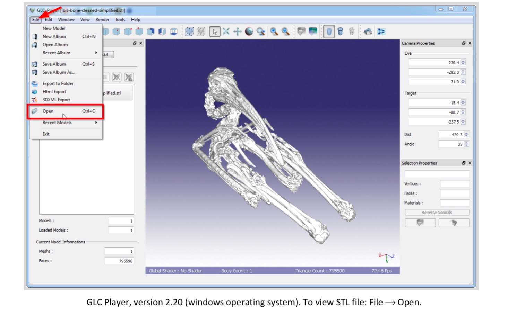

- [Microsoft 3D Viewer](https://www.microsoft.com/en-us/p/3d-viewer/9nblggh42ths?activetab=pivot:overviewtab): (alternate option) Windows 10 app that lets you view 3D models and animations in real-time. 3D Viewer lets you view 3D models with lighting controls, inspect model data, and visualize different shading modes. (Works only on Windows operating systems. Proprietary license.)

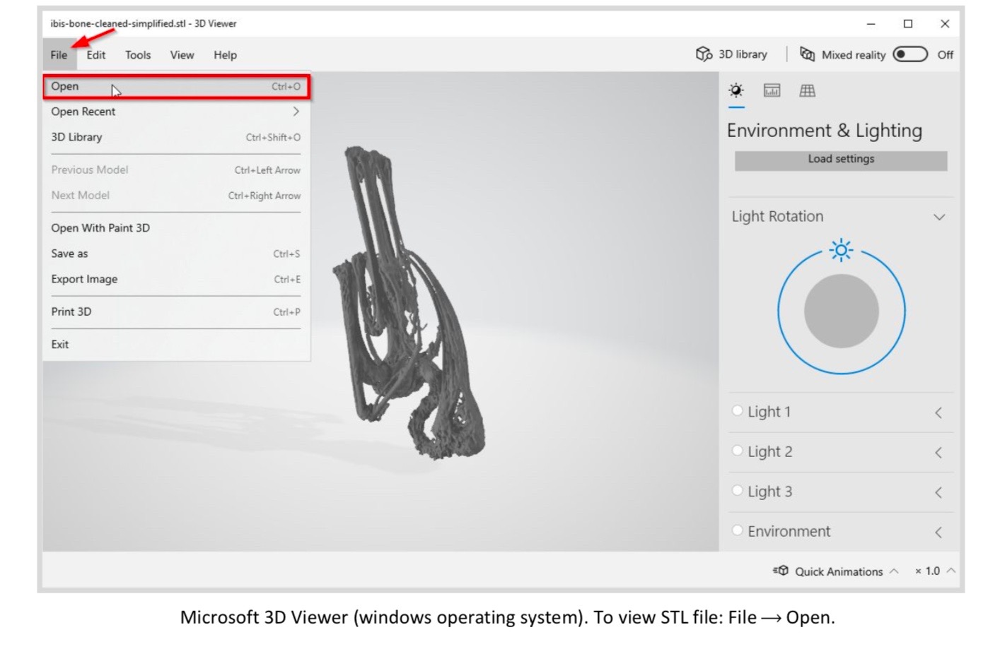

#### View, Edit, and Analyze

- [MeshLab](http://www.meshlab.net): (recommended option) A free, open-source tool for opening, viewing, transforming, and repairing STL files. While it lacks the functionality to create files, it is user-friendly and has a relatively simple interface. Decent documentation is also available for performing simple tasks. (Works on Mac, Linux, and Windows operating systems. GNU General Public License.)

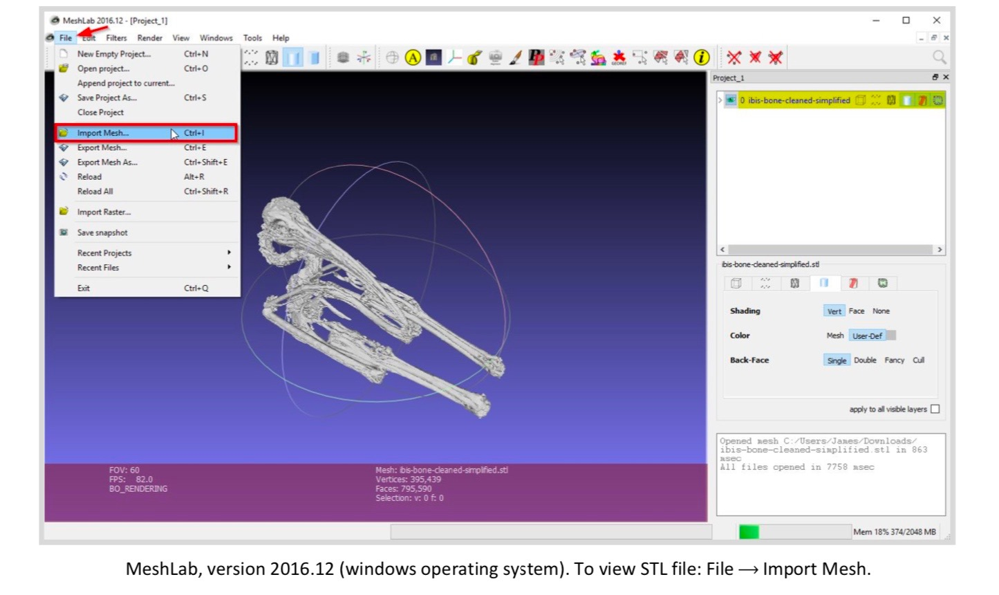

- [Blender](https://www.blender.org): (alternate option) A free, open-source tool for professional-level model creation, viewing, and repairing. While very powerful, this tool has a high learning curve and requires significant processing abilities to render files and perform actions. It is probably best used for complex files. There are many online tutorials for understanding and using the software’s robust tools. ​(Works on Mac, Linux, and Windows operating systems. GNU General Public License.)

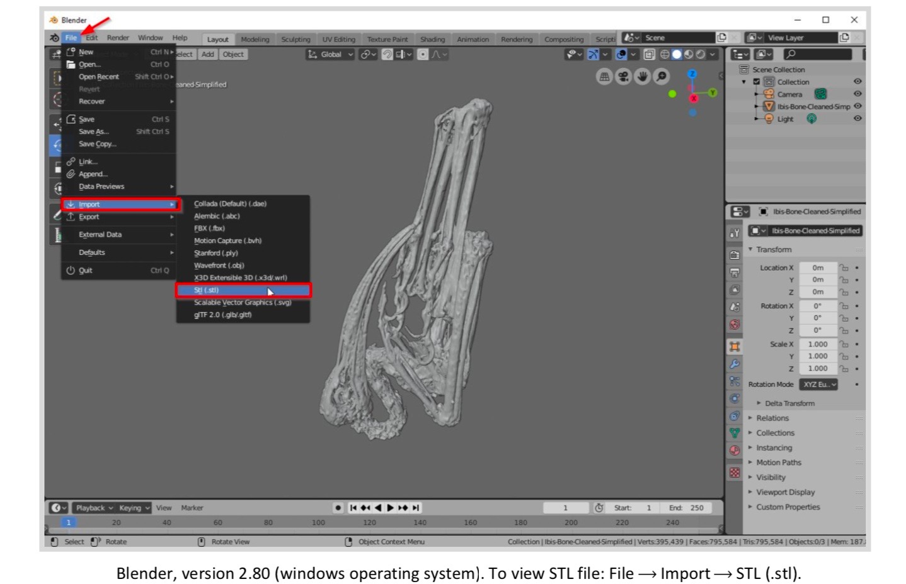

## Key curatorial questions

#### To ask yourself

- Given the content of the submission, which repositories are most appropriate/suitable?
  - General repository, domain repository, institutional repository, commercial repository (e.g. Thingiverse or Sketchfab), etc.

#### To ask the researcher

- Is this STL file an original design (e.g., a rocket nose cone), a representational model (e.g., a protein structure), or a real-world documentation (e.g., scan of an antique vase)?
- Can the subject contained within the STL file be described purely in terms of surface-level, geometric data?
  - Does the subject contain additional information related to internal geometry, thickness, color, textual annotations, lighting, animation, camera views, etc which STL files cannot capture?
- Is this object intended to be reproduced using digital 3D fabrication processes?
  - Is the 3D model complete and contains only manifold geometry (i.e. no gaps, overlapping faces, disconnected edges/vertices, internal faces, etc.)? 
- Was this object originally intended for use in a virtual reality (VR) or augmented reality (AR) environment?
  - What software platform and/or hardware was used in this original viewings/display configuration?
  
## Deposit recommendations

The following outline lists recommendations for repositories accepting STL submissions. Minimally required files and metadata will support the ability to view and open, but a more comprehensive understanding and use of the STL file may require additional supporting files, documentation, and/or detailed metadata.

- Minimally required files:
  - .stl file (original file)
  - .stl file (converted to ASCII encoding)
  - README file (.txt or .md)
    - Describing the subject matter of the STL file, the files capture/design process, scale of subject matter, units of model (e.g. inches, millimeters), list of any transformation/edits taken by the depositor on behalf of the original author/creator, software used to create the original file
  - LICENSE file (.txt or .md)
    - Describing the limitations placed on the STL file in terms of reproduction, reuse, and remixing
    
- Additional files:
  - Screenshots (.tif format) of the digital model representation generated by the STL file
  - Images (.tif format) of any physical 3D models, prints, or fabrications generated from the STL file
  - Additional documentation related to the STL file’s generation, design, or capture processes
  - List of other products or publications (e.g., URLs, DOI, and/or citations) in which the. STL was used

## Preservation actions

- Save a copy of the original STL
- Convert the STL file to ASCII encoding if necessary
  - To check encoding of original STL file, open it using any common text editor (Notepad, TextEdit, etc.)

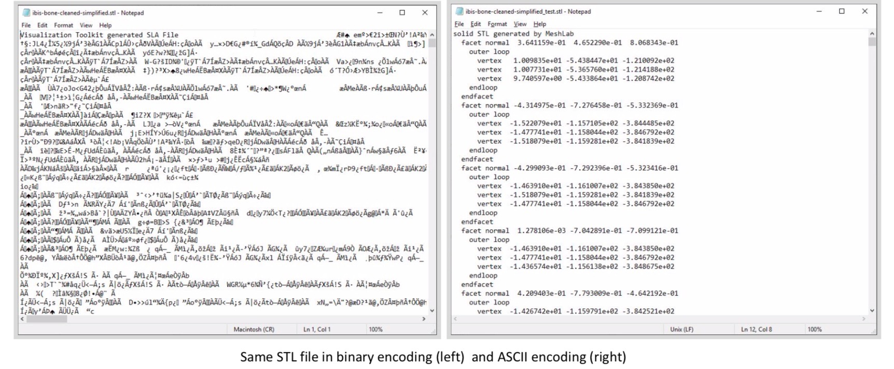

  - Binary to ASCII conversion using MeshLab

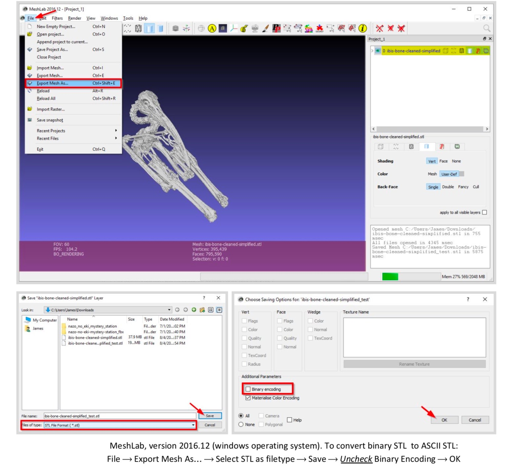

## FAIR principles

#### FAIR principles9

- To be **F**indable:
  - F1. metadata are assigned a globally unique and persistent identifier (e.g., DOI)
  - F2. STL is described with rich metadata
  - F3. metadata clearly and explicitly include the identifier of the data it describes
  - F4. metadata are registered or indexed in a searchable resource
  
- To be **A**ccessible:
  - A1. metadata are retrievable by their identifier using a standardized communications protocol
  - A2. metadata are accessible, even when the STL is no longer available

- To be **I**nteroperable:
  - I1. metadata use a formal, accessible, shared, and broadly applicable language
  - I2. metadata use vocabularies that follow FAIR principles
  - I3. metadata include qualified references to other metadata
  
- To be **R**eusable:
  - R1. metadata are richly described with a plurality of accurate and relevant attributes including usage license, provenance, and domain-relevant community standards
  

9 Wilkinson, M. D., et al. (2016). The FAIR Guiding Principles for scientific data management and stewardship. ​Scientific Data,​ 3(1), 160018. Retrieved August 9, 2019, from https://doi.org/10.1038/sdata.2016.18. 

## Unresolved issues and Further questions 

- How to track future reuse/remixes of STL file?
- Repository platforms may not accommodate non-textual information (e.g. preview image viewers, 3D model viewers, etc.)

## Documentation

Documentation of the curation process should capture:

- Software used for viewing, analyzing, or editing the STL file
- Communications, discussions, or questions raised during the curation process between the uploader and researcher/creator
- Metadata added by researcher and/or creator
- Transformations of the STL file taken by the uploader or researcher/creator

## Additional references and Recommended reading

Chakravorty, Dibya. “STL File Format (3D Printing) – Simply Explained.” *All3DP,* 14 Feb. 2019. Retrieved August 9, 2019, from https://all3dp.com/what-is-stl-file-format-extension-3d-printing/.

Fino-Radin, Ben. “Preserving 3D Data and 3D Prints: Cooper Hewitt, Smithsonian Design Museum.” Cooper Hewitt Smithsonian Design Museum, 14 May 2019. Retrieved August 9, 2019, from https://www.cooperhewitt.org/2019/05/14/preserving-3d-data-and-3d-prints/.

Henri, Janine. “Describing 3D Models: Thesauri, Controlled Vocabularies, and Metadata Standards.” UCLA Library, 24 April 2019.Retrieved August 9, 2019, from https://guides.library.ucla.edu/3D.

## Appendix STL filetype CURATED checklist

Modified from the Data Curation Network's [Checklist of CURATED Steps](https://docs.google.com/document/d/1RWt2obXOOeJRRFmVo9VAkl4h41cL33Zm5YYny3hbPZ8/edit)

#### CHECK Step

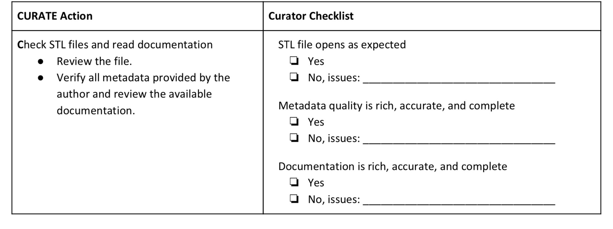

#### UNDERSTAND Step

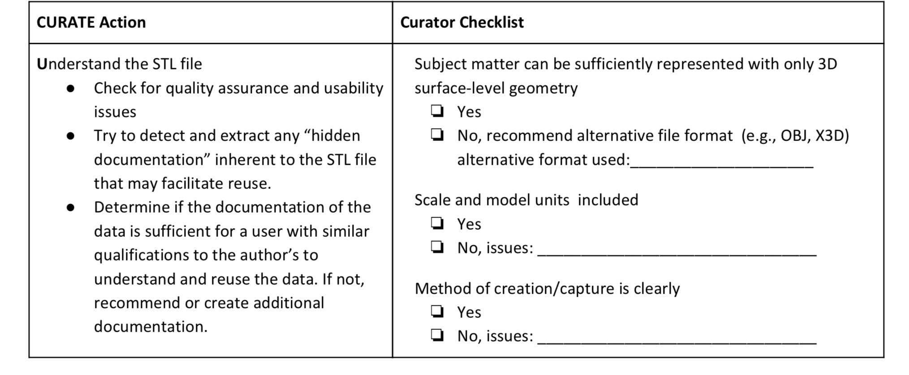

#### REQUEST Step

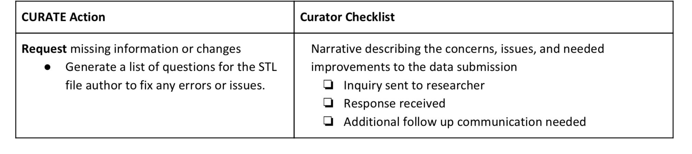

#### AUGMENT Step

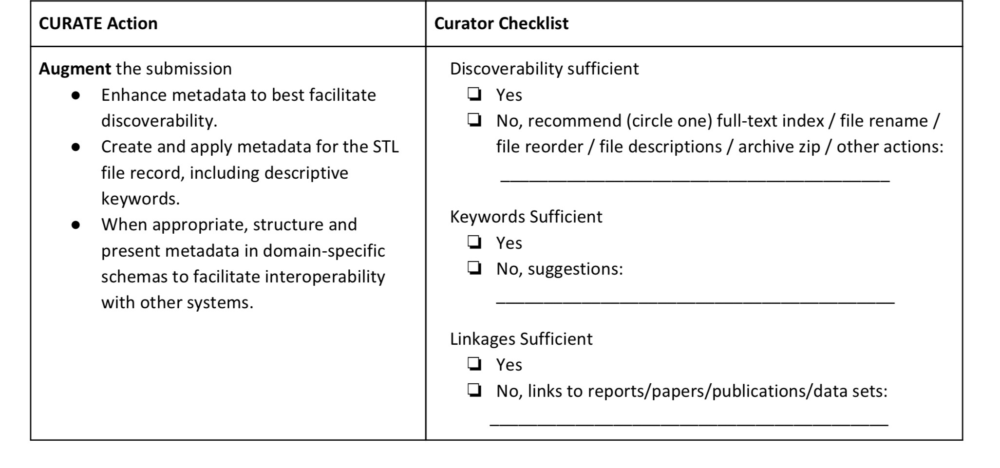

#### TRANSFORM Step

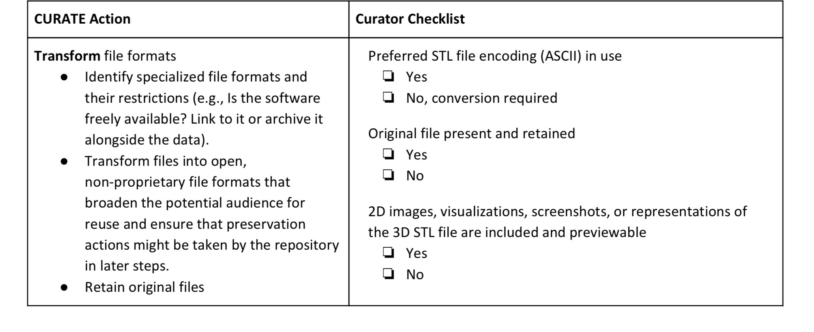

#### EVALUATE Step

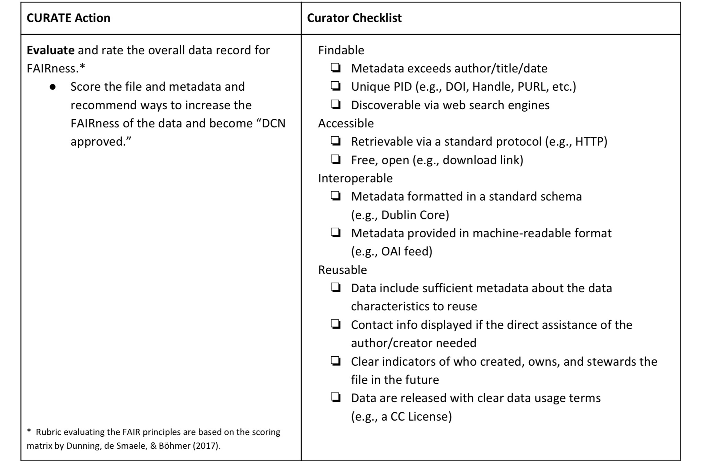

#### DOCUMENT Step

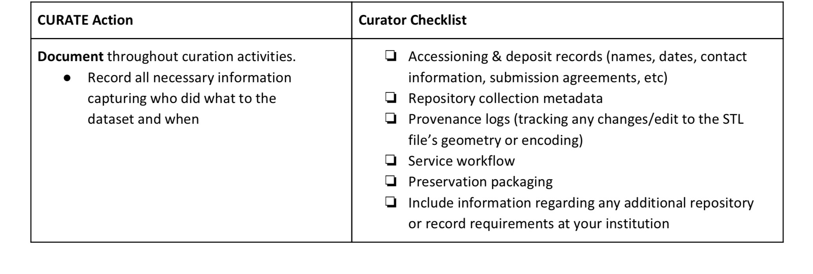

