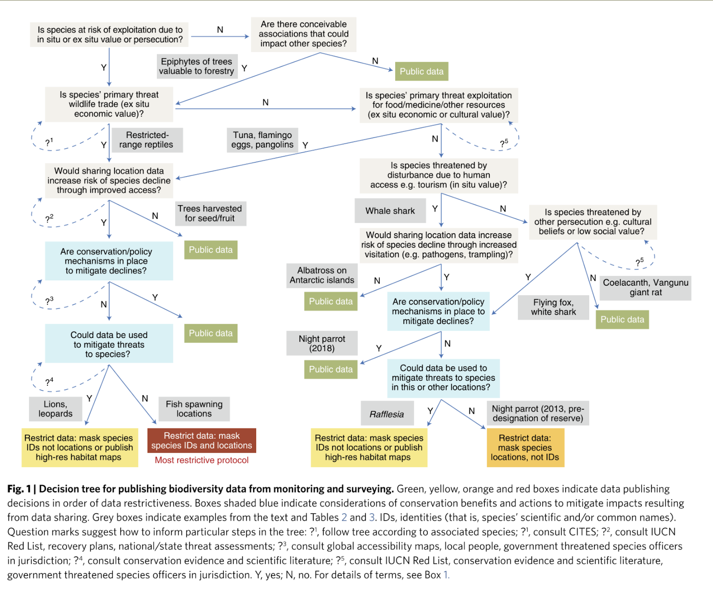
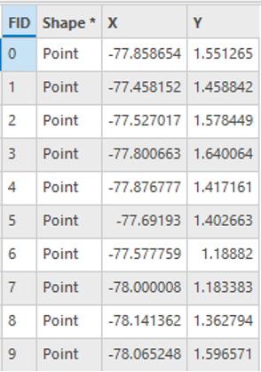
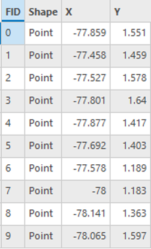
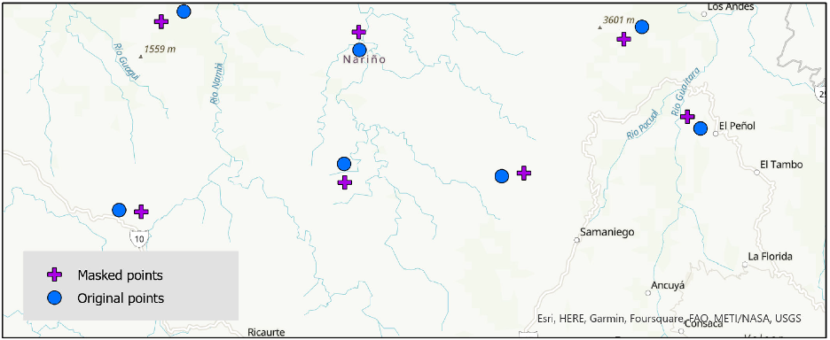

# Sensitive Biodiversity Data Essentials Primer

Authors: Jen Jordan, Carlos Ramirez-Reyes, Shawna Taylor, Joanna Thielen, and Briana Wham

DCN Mentors: Shawna Taylor

Affiliate Contributors (external peer reviewers): Megan O'Donnell and Sophia Lafferty-Hess

## Executive Summary

|   Topic   |   Description   |
| :------------- | :------------- |
| Primary fields or areas of use | Any research on the biodiversity of a species (occurrence and functional trait) considered sensitive.    Example fields: Biology, botany, zoology, ecology, paleontology, conservation, entomology.|
| Key questions for curation review | <li>Would any stakeholders consider the data sensitive?</li><li>If sensitive, are the data shareable with/without modification?</li><li>Does the biodiversity data impact Indigenous Peoples directly or indirectly?</li><li>Were necessary permits/permissions obtained to conduct research and share data?</li> |
| Metadata-specific considerations | <li>Masking or generalizing the geographic location</li><li>Use of existing data standards (e.g., Darwin Core metadata)</li> |
| Date Created | September 13, 2023 |
| Created By | Jen Jordan, Carlos Ramirez-Reyes, Shawna Taylor, Joanna Thielen, and Briana Wham |

**Suggested Citation:** Jordan, J., Ramirez-Reyes, C., Taylor, S., Thielen, J., and Wham, B. (2023) Sensitive Biodiversity Data Essentials Primer. [Data Curation Network GitHub Repository.](https://github.com/DataCurationNetwork/data-primers)

This work was created as part of the “Specialized Data Curation” Workshop held at the University of Minnesota on October 26-27, 2022.

## Table of Contents

[Summary](#summary)

[Introduction to Sensitive Biodiversity Data](#introduction-to-sensitive-biodiversity-data)

> [The CARE Principles for Indigenous Data Governance](#the-care-principles-for-indigenous-data-governance)   [Protected or Conservation Status Classifications and Terminology](#protected-or-conservation-status-classifications-and-terminology)

[Governmental Protections and Policies](#governmental-protections-and-policies)

[Data Sharing and Use Agreements & Permits to Conduct Research](#data-sharing-or-use-agreements-permits-to-conduct-research)

[Sensitive Data Sharing Benefits & Challenges](#sensitive-data-sharing-benefits-challenges)

> [Data Sharing Benefits](#data-sharing-benefits)   [Data Sharing Challenges](#data-sharing-challenges)   [Determining Sensitivity](#determining-sensitivity)

[Overview of Modifying and Withholding Sensitive Data](#overview-of-generalizing-and-withholding-sensitive-data)

> [Geographic Masking](#geographic-masking)

[Metadata and Documentation](#metadata-and-documentation)

[Key Questions for Curators (and Depositors)](#key-questions-for-curators-and-depositors)

[Selected Resources](#selected-resources)

[Bibliography and Further Reading](#bibliography-and-further-reading)

## Summary

This primer is intended to offer guidance to curators for assessing the sensitivity of biodiversity data associated with research on animals, insects, plants, fungi, microorganisms, etc. Sensitive data can be defined as any information which “would result in an ‘adverse effect’ on the taxon or attribute in question or to a living individual” if made publicly available (Chapman, 2020). This primer covers how to identify sensitive data, considerations for sharing these data, and points for discussion with data depositors. The objective is to support researchers in balancing the sharing of biodiversity data as a public good and protecting it from misuse.

## Introduction to Sensitive Biodiversity Data

Data sharing is a valuable tool for the research community to make progress on critical worldwide issues such as climate change[^1] and mass extinctions. There are many reasons why studies containing sensitive data cannot be reproduced; examples include loss of access to the study location or population, time-dependence (e.g., season), and cost. However, there are situations where sharing biodiversity data may have more negative impacts than positive. For example, publicly sharing the exact geolocation data of a threatened species could allow for its misuse. It is crucial to balance sharing this data as a public good versus protecting the data from misuse.[^2]

Unfortunately, there have been cases where sensitive biodiversity data
has been misused:

- Poachers used publicly available information and data to illegally dig up over 2,000 succulents (including protected and threatened species) from a nature reserve in South Africa (Welz, 2017).

- A thief broke into the Tring Museum (part of the British Natural History Museum) and stole hundreds of rare bird skin specimens, including birds of paradise from Indonesia (Lidz, 2018).

- Tagging data from white sharks in Western Australia was used to monitor their location and ultimately ‘catch-to-kill’ them if they came too close to bathing beaches (Meeuwig, 2015).

Biodiversity data can incorporate biogeography data, the temporal and spatial occurrence of species, as well as functional ecology data, and measurements of traits important for understanding ecological patterns and processes (König et al., 2019). The sharing and reuse of biodiversity data need consideration for both the adoption of existing data standards and protocols, as well as the sensitivity of the species’ data being collected.

Examples of sensitive biodiversity data types could include:

- Raw products:

  - Geographic/spatial coordinates of locations

  - Lists or quantities of species found in specific localities

  - Biological information of species, such as age, sex or breeding status

- Derived products:

  - Maps showing species presence predictions

  - Population estimates for species

  - Pictures and videos, which could be used to visually determine locations or determine precise location from metadata

  - Names of people or organizations acting as collaborators to collect the data

The academic community has yet to reach consensus on best practices for sharing sensitive biodiversity data (Welz, 2017); as such, this primer provides general guidelines for curators of these data to consider. Each discipline or subdiscipline may have its own unique or nuanced considerations related to sensitive biodiversity data sharing. Curators may also need to adapt these guidelines to fit the needs at their institution.

It is also important to note that this is a dynamic field; new conservation efforts start, existing conservation efforts change, species threat levels change, etc. Curators should keep this in mind when curating sensitive biodiversity data. For the purpose of data curation, it is better to have a more expansive viewpoint on what constitutes ‘sensitive’ than a less expansive one, as different communities or locations may have differing views on the sensitivity of the biodiversity data. For example, California white sage (*Salvia apiana*), a perennial desert shrub with medicinal and ceremonial uses for numerous Indigenous populations, has been negatively impacted by intensive illegal harvesting for commercial reasons. As such, California white sage may be worthy of protection for its cultural value and to support sustainability efforts.[^3] Sensitive biodiversity data, namely data related to animals, insects, plants, microorganisms, and fungi, is the crux of this primer; however, the considerations presented here can apply to previously collected specimens, such as those housed in museums, herbaria or other cultural heritage institutions.[^4] The Related Topics & Resources table at the end of the primer provides further resources for fossil, herbarium, and taxidermy data. Research on laboratory animals and invasive species is outside the scope of this primer.[^5]

However, Institutional Animal Care and Use Committees (IACUC) regulations may apply for field work that could create sensitive biodiversity data on vertebrates. Curators should ask depositors about whether their research required IACUC approval and if so, review for a copy of this approval for the research project (and include this information in the data set’s metadata), before the data set is made available. Additionally, curators should ask depositors what local, state, or federal permits they received prior to conducting this research. These permits should be noted in the data set’s metadata.

This primer provides *guidance* for curators on curating sensitive biodiversity data sets. In turn, curators can provide *guidance* to depositors. But, ultimately, the legal and ethical responsibility falls on the depositors. They are responsible for determining whether the data set is sensitive and then which measures are appropriate to safeguard the data set from misuse, if shared publicly. This must be made clear to depositors. Ideally, this should be stated in the deposit agreement signed by the depositor.

### The CARE Principles for Indigenous Data Governance

The 2020 publication of the CARE Principles for Indigenous Data Governance (Carroll, S. et al.) made clear Indigenous Peoples’ relationships with data are necessarily intertwined with Indigenous self-determination and reclamation of Indigenous identity and knowledge. Collective Benefit (C), Authority to Control (A), Responsibility (R), and Ethics (E) orient data as a collective benefit not distinct from people-oriented principles[^6] or values-oriented principles. The CARE principles “define rights, interests, and concepts to be employed in facilitating Indigenous control in data governance and reuse” (Carroll, S.R. et al., 2020, pg. 5).

In the Western tradition, researchers or their employing organizations have typically “owned” the data of their studies; however, this view is shifting due to open science and data sharing (Carroll, S.R. et al., 2020, pg. 3). Under the CARE principles, data are viewed as collectively owned. Data collected or studies conducted on Indigenous lands, or on species on Indigenous stewardship likely should be shared with local communities. Curators can determine if the researcher has indicated data sharing with Indigenous Peoples and if the licensing of the dataset reflects this collective ownership accordingly.

Similarly, recognizing what constitutes Indigenous Peoples’ data may be helpful for curators. The 2020 article by Carroll et al., provides a broad, encompassing definition of Indigenous Peoples’ data. However, for the purpose of the this primer, the definition has been scoped to understanding Indigenous Peoples’ data as that which was from or about Indigenous territories, and which comprises “information and knowledge about the environment, lands, skies, resources, and non-humans with which \[Indigenous Peoples’\] have relations” (Carroll, S.R. et al., 2020, pg. 3). This information, of course, could include sensitive biodiversity data. Curators may also want to recognize “the *right* of Indigenous Peoples and nations to govern the collection, ownership, and application of their own data”, which is referred to as Indigenous Data Sovereignty (David-Chavez, D.M., 2023, Slide 12). Assertion of these rights, and respect of these rights, further promotes Indigenous self-governance and self-determination.

Finally, curators and researchers may want to be aware of Indigenous Knowledge, also referred to as Traditional Knowledge or Traditional Ecological Knowledge, as a component to a research study, which should then be recognized in the data’s documentation. Indigenous Knowledge is the “responsible stewardship of cultural and natural resources through relationships between humans and their landscapes…\[in which\] familial intimacy with nature enables the ability to detect often subtle, micro-changes and to base decisions on deep understanding of patterns and processes of change in the natural world of which people are a part” (Aluaq Daniel, et al., 2022). Fields such as environmental science, ecology, conservation, biology or climate studies may especially rely on Indigenous Knowledge and, if utilized, should be given credit accordingly. For guidance on how to specifically curate data considering the CARE principles and Indigenous data, see the DCN’s ["CARE Data Principles, Indigenous data, Data related to Indigenous Peoples and Interest"](https://github.com/DataCurationNetwork/data-primers/blob/master/CARE%20Primer/care-primer.md) for additional detail and more nuanced information on using the CARE Principles.

### Protected or Conservation Status Classifications and Terminology 

Terms—and their legal implications—used to describe and classify sensitive biodiversity data can vary based on country, region, and between organizations. Similarly, species classification can vary. Terms frequently exist on a spectrum; for instance, the United States Endangered Species Act (1973) draws a distinction between *threatened* and *endangered* species*,* with endangered representing the highest level of risk, and thus granting a species extra protections by the federal government.

The International Union for Conservation of Nature (IUCN) offers more categories for at-risk status than the Endangered Species Act. It defines nine categories in its IUCN Red List, which tracks conservation status of species across the globe; these include four that are relevant to sensitive biodiversity data:

- Critically endangered

- Endangered

- Vulnerable

- Near threatened

So, while a species that is most at-risk in the United States would be designated ‘endangered,’ the same species could be labeled ‘critically endangered’ by the IUCN Red List.

While it is, in most cases, the responsibility of data depositors to understand the relevant classification status of species represented in the dataset, it is recommended that curators familiarize themselves with regionally relevant terms, and determine whether disciplinary, institutional, or repository policies provide guidance based on classification.

## Governmental Protections and Policies

In addition to the classification of species by the IUCN or in the United States under the Endangered Species Act, data curators should be aware that federal, regional, state, or local public policy, including legislation, may apply to species, or protected areas of those species. Researchers whose studies are conducted in protected areas or on threatened species should make note of this in their data documentation.

An exhaustive resource of all international policies, at varying legislative levels, on species protection has not yet surfaced. In the United States, the U.S. Fish and Wildlife Service has compiled a list of federal laws in their [Laws, Agreements, and Treaties database](https://www.fws.gov/library/categories/laws). State laws, such as the [California Endangered Species Act](https://wildlife.ca.gov/Conservation/CESA), may require additional protections beyond what is implemented federally. Considering policies and legislation pertinent to the species may help the curator understand limitations including what data use agreements or research permits are required to conduct the research on the species of the study.

[Protected Planet](https://www.protectedplanet.net) is a robust resource to identify protected areas, including other effective area-based conservation measures (OECMs). This resource “exists due to the extensive efforts of governments and other stakeholders to map, monitor and report data on protected areas and OECMs…users can explore the World Database on Protected Areas (WDPA), World Database on OECMs, Global Database on Protected Area Management Effectiveness (GD-PAME)” (“About”, n.d.). Curators may want to refer to this database to determine if specific policies are associated with these protected areas, typically found in the ‘Sources’ section of each profile.

## Data Sharing or Use Agreements & Permits to Conduct Research

When working with sensitive biological data, including location of species occurrences, it is important to consider that organizations providing datasets (e.g., NGOs, government agencies, museums, private companies, indigenous communities) might have provided the data under a data sharing or use agreement. These agreements restrict the way that the signing parties can use the data and often restrict distribution of the datasets. Frequent clauses may specify that:

- biological data is only for research, education, or conservation

- data (including coordinates, maps, directions, etc.) are not shared in any form to third parties without prior consent from the data providing organization

- research findings must be shared with the organization providing data before communication via publications or presentations

- measures were taken to prevent inadvertent, accidental, unauthorized, or mistaken disclosure or use of datasets

- request appropriate permits for access to sites and obtain collector permits as necessary

Other common legal documents that may limit or prohibit data sharing
include:

- Land use agreements

- Research permits

- Special use permits

Depositors should provide documentation for any permits obtained or agreements signed as part of the research. These should be reviewed carefully, and if none were provided, it may be prudent to confirm with the depositor that none exist.

## Sensitive Data Sharing Benefits & Challenges

Some of the unique benefits and risks of sharing sensitive biodiversity data are listed below (summarizing key parts of the 2018 article by Tulloch, et al.).

### Data Sharing Benefits

- Reduce data deficiency for species and inform status assessments such as IUCN Red List, where one-sixth of species are listed as data-deficient, meaning there isn’t enough data on the species for researchers to study its needs for conservation (Publish not perish: Conservationists have a new tool for weighing up the risks and benefits of open data, 2018)

- Help with ongoing and future conservation efforts

- Reduce duplication of research

- Promotes reuse of existing data

- Engage the public in nature and conservation efforts

### Data Sharing Challenges 

- Misuse or exploitation of the data

- Data sharing or use agreements that may prohibit public sharing

- Violating privacy and trust of groups/organizations who granted access to their land or knowledge

### Determining Sensitivity

Chapman (2020) shares a set of four criteria for determining
sensitivity, which are:

1.  Risk of harm

2.  Impact of harm

3.  Sensitivity of data

4.  Decision on release and category of sensitivity

The decision tree below (Figure 1) from Tulloch et al. 2018 gives a visual representation of the questions the curator and researcher should be asking about sensitive biodiversity data. While it’s not meant to be prescriptive, it can be used to start a conversation about what to share and what not to share. Researchers need to weigh the benefits and risks of publicly sharing sensitive data. Curators can provide guidance but ultimately it is the depositor’s responsibility.

<figure>  <figcaption>Figure 1: Decision tree for publishing biodiversity data from monitoring and survey; Source: [Tulloch et al. 2018](https://doi.org/10.1038/s41559-018-0608-1)</figcaption> </figure>

### Georeferencing

Data curators might find that some researchers have datasets which resulted from georeferencing processes, a GIS-based technique which assigns geographic coordinates to non-spatial data or images to accurately place them on a map (Hastings and Hill, 2009). As described by Chapman & Wieczorek (2022), georeferencing is one of the key methods for making biological specimen and observational data available to the world. Its inclusion in these datasets are crucial if data are to be used to understand threats to biodiversity, inform policies to mitigate these threats, and enable researchers to reuse, and build, on previously collected data (Borgelt, 2022). On the other hand, inclusion of these biological specimen and observational data in publicly released datasets may be harmful if the data are misused.[^7] The Global Biodiversity Information Facility (GBIF) published [*Georeferencing Best Practices*](https://docs.gbif.org/georeferencing-best-practices/1.0/en/), by Chapman & Wieczorek (2022), a comprehensive set of guidelines and best practices for georeferencing specifically targeted at biological occurrence data. Data curators and researchers should refer to this comprehensive georeferencing resource for general and specific georeferencing guidance. Highlights from this guide pertinent to georeferencing data curation, including sharing, have been extracted and summarized below.

Persistent identifiers (PIDs) (section 1.9)
- Use common PIDs, including globally unique identifiers (GUIDs) and digital object identifiers (DOIs) for identifying individual objects and other classes of data (e.g., collections, observations, images, and locations)
- Consider if using a PID is helpful for location, specimen data, or other data not commonly associated with PID assignment[^8]

Metadata standards (section 5.1)
- Consider using <a href="https://journals.plos.org/plosone/article?id=10.1371/journal.pone.0029715">Darwin Core</a>[^9] or <a href="https://www.tdwg.org/standards/abcd/">Access to Biological Collection Data (ABCD)</a>
- See <a href="https://github.com/tdwg/dwc/blob/master/vocabulary/term_versions.csv">term
mappings</a>, if necessary, between Darwin Core and ABCD for location data mapping

Generalize georeferences for sensitive biodiversity data (section 5.2)
- Reduce the number of decimal places (for example when using decimal degrees) at which the data are published
- Document all methods of generalization
- Generalize georeference data by using a ‘decimal geographic grid’[^10] and record:
  - Precision of the data provided (e.g. 0.1 degree; 0.001 degree, etc.)
  - Precision of the data stored or held (e.g. 0.0001 degree, 0.1 minute, 1 second, etc.
- Consider the authors’ guidelines:
  - “Data should never be generalized at the time of collection, when georeferencing or when storing in the database”
  - Do not randomize data before publishing it

Consider if the data have a description of how they were masked or if they are generalized due to an estimation of true values (section 1.6

*Summarized key points pulled out from* Georeferencing Best Practices*, (Chapman and Wieczorek 2022).*

## Overview of Generalizing and Withholding Sensitive Data

The sensitive nature of biodiversity data is often tied to specimen location(s). Researchers must determine if sharing certain aspects of biodiversity data, particularly the location data, are considered sensitive and, if shared publicly, could lead to misuse. If researchers have sensitive biodiversity data, they must consider the risks and benefits of publishing the data (see Figure 1 above for the risk decision tree on publishing sensitive biodiversity data). In general, there are three options for managing the public sharing of sensitive biodiversity data (Tulloch et al. 2018 and Chapman 2020):

1.  Generalize textual data: Publish the exact spatial (geographic) data but change the species identifiers to a higher taxonomic resolution (such as genus or family), or don’t release species identifiers at all. It is important to note however that if the taxonomic resolution is generalized and the taxonomic status of the species changes or is reclassified, the data may be misidentified and the ability to update the record will be lost. Further, the generalization of taxonomic level may limit insights into species level ecological requirements. Therefore, generalization of taxonomic resolution should be carefully considered with regards to reuse potential.Other textual data (such as human landowner personally identifiable information (PII), locality information, date of collection, habitat and landholder information) could also be withheld. Chapman (2020) notes that any data that is generalized should be noted in the data set, rather than leaving these fields blank, and generalizations should be documented.

2.  Generalize spatial data AKA geographic masking: Publish the exact textual data but mask the geographic coordinates, don’t report the geographic coordinates or report the location qualitatively or using spatial aggregation (such as province, country, census enumeration district, or region name).[^11] See Figures 2 and 3 below for a hypothetical example of generalizing spatial data.

3.  Deposit into a controlled access repository: These types of repositories only allow access to specific data sets or the whole repository by permission. Users who want to access data sets must apply and be approved before they can access the data set(s). Several controlled access repositories are listed in this primer (in the Selected Resources section below), but the authors recognize that finding an appropriate controlled access or restricted repository may be challenging. Controlled access repositories are often disciplinary repositories, which are not as common, and many institutional repositories do not yet provide restricted or tiered access levels.

4.  Withholding data: Do not publicly share the textual or spatial data. Chapman (2020) notes that any data that is withheld should be noted in the data set, rather than leaving these fields blank.

### Geographic Masking

Geographic masking, sometimes also called buffering, geomasking, jittering, or dithering, is the “process of altering the coordinates of point location data to limit the risk of re-identification upon release of the data. In effect, the purpose of geographic masking is to make it much more difficult to accurately reverse geocode the released data” (Zandbergen 2014). When working with sensitive biodiversity data, there is a balance in determining the amount of masking appropriate as more masking will increase privacy, but may result in information loss ([https://maskmy.xyz/#maskingguide](https://maskmy.xyz/#maskingguide)).

Masking geographic location is important because masking “preserves the integrity of the overall geographic distribution but gives confidentiality” (Guidance for Species Data). This is especially important for plants and fungi because they can’t move location, unlike animals.

Many approaches exist for conducting geographic masking. Some of these include: (1) Random direction and fixed radius, (2) Random perturbation within a circle, (3) Gaussian displacement, (4) Donut masking, and (5) Bimodal Gaussian displacement. See [Zandbergen 2014](https://www.hindawi.com/journals/amed/2014/567049/), Figure 5 for graphical representations of these techniques and section 7 for definitions for each technique. One example of software for geographic masking is [Maskmy.xyz](https://maskmy.xyz/#), which is a web browser tool for performing donut masking on a shapefile.

In Figure 2 (below), nine geographic coordinates depicting the location of a hypothetical sensitive species in Colombia were masked using Maskmy.xyz. We show the original coordinates on the left, and the masked coordinates on the right. Notice how the precision of the coordinates (the number of values after the decimal point) have decreased after masking.

<figure>  <figcaption></figcaption> </figure>

<figure>  <figcaption></figcaption> </figure>

*Figure 2: A hypothetical example of original vs masked spatial coordinates in Maskmy.xyz, showing tables of the latitude and longitude values. Top = original spatial coordinates; Bottom = masked spatial coordinates. Note: The precision as well as the direction of the points changed in the masked spatial coordinates.*

The map below (Figure 3), created in Maskmy.xyz, shows both the original spatial coordinates and the masked spatial coordinates. Notice how the
new masked coordinates are randomly placed in the vicinity of the original coordinates, obscuring the precise location.

<figure>  <figcaption></figcaption> </figure>

*Figure 3: A map depicting the spatial representation of coordinates in Figure 2 (original & masked spatial coordinates from Maskmy.xyz). Blue circles = original spatial coordinates; purple crosses = masked spatial coordinates. Note: The precision as well as the direction of the points changed in the masked spatial coordinates.*

## Metadata and Documentation

Darwin Core (DwC)[^12] is the preferred metadata standard for biodiversity data, created to “facilitate the sharing of information about biological diversity by providing identifiers, labels, and definitions” (Darwin Core Task Group, 2009). Given the specialized nature of DwC, an institutional repository might not support its use in dataset metadata records; however, it is recommended its use be captured in the documentation file (such as in a ReadMe.txt file or .csv file).

If data have been generalized, masked, or otherwise withheld, it is important to document changes using DwC properties such as:

- [coordinatePrecision](http://rs.tdwg.org/dwc/terms/coordinatePrecision)

- [dataGeneralizations](http://rs.tdwg.org/dwc/terms/dataGeneralizations)

- [informationWithheld](http://rs.tdwg.org/dwc/terms/informationWithheld)

Australia’s [national framework](https://doi.org/10.54102/ala.94894) for sharing restricted access species data (RASD) contains useful guidance on how to create metadata statements for different types of data restrictions. As its title indicates, the framework was developed to facilitate the standardization of RASD collecting and sharing throughout Australia; however, the guidance contained within is easy to adapt for data sharers outside of Australia.

## Key Questions for Curators (and Depositors) 

- Would any stakeholders consider the data sensitive? If so, what additional metadata should be included to document such a determination?

  - Is the species flagged by the [IUCN Red List](https://www.iucnredlist.org) as “near threatened”, "vulnerable", "endangered", or "critically endangered"?

  - Is the taxon subject to harmful human activity (e.g., poaching)?
 - If yes - Document with supporting rationale
 - If no - Document that there is not significant risk of a harmful human activity and as such the taxon is not sensitive.

  - Were the specimens studied on a wildlife/nature preserve or in the wild?
 - If yes - Data will be considered more sensitive if it was collected in the wild because these specimens often have less protections than others in nature preserves

- Are there relevant local/state/regional/country regulations that apply to this research and the subsequent data?

- Is there a data sharing or use agreement?

  - Can a copy of the agreement be included in the data set?

  - Do these agreements say that original data needs to be destroyed after the project?

  - Do original data AND results need to be approved by data providers before depositing in a data repository?

- Were other permits required to conduct the study (e.g., land use permits, special use permits)?

- Is the data masked or generalized in any other way?

  - If yes, is this noted in the documentation. Note that if masking was used, it is best not to disclose the masking distance selected as that can enable re-identification of the geographic locations.

- If the biodiversity data was collected on Indigenous lands, in partnership with Indigenous communities, or that makes use of Indigenous Knowledge, review the [CARE Principles for Indigenous Data Governance](https://www.gida-global.org/care) and consider:

  - Although curators are not responsible for determining the suitability of data collected on Indigenous lands or having explicit knowledge of what data makes use of Indigenous Knowledge, curators may need to ask, "Who can help the researcher make these determinations?"

  - Is there documentation on how researchers engaged with Indigenous communities and how data are to be managed based on this engagement or on other agreements?

  - Are there any indications that the biodiversity data are linked to cultural or religious values of Indigenous Peoples, or does the researcher or curator have knowledge as to who could make these determinations?

- Does your university, library, data services department or data repository have a policy related to rejecting data sets for legal or ethical reasons?

  - For example, what happens if the depositor can’t provide a copy of the data sharing agreement?

  - How much authority do you as a curator have on determining whether to publish or reject a data deposit? (This is a much higher level, philosophical question applicable to all curated data sets in your repository - that ideally would be answered prior to curating any sensitive biodiversity data sets.)

## Selected Resources

|   Topic   |   Resource  |
| :------------- | :------------- |
| Determining sensitivity | <li><a href="https://doi.org/10.1038/s41559-018-0608-1">A decision tree for assessing the risks and benefits of publishing biodiversity data</a> \| <em>Nature Ecology & Evolution</em> - see Table 3 and Supplementary Table 2, which includes three case studies explaining how and why various sensitive biodiversity data were (or were not) made publicly available</li><li><a href="https://doi.org/10.15468/doc-5jp4-5g10">Current Best Practices for Generalizing Sensitive Species Occurrence Data</a> \| GBIF</li> |
| Protected and Conservation status | <li><a href="https://www.iucnredlist.org/">IUCN Red List</a></li><li><a href="https://www.protectedplanet.net">Protected Planet</a></li><li><a href="https://explorer.natureserve.org">NatureServe Explorer</a> (North American species)</li>|
| Regulatory Permit | <li> <a href="https://www.fws.gov/service/permits">U.S. Fish & Wildlife Service permits database</a></li> |
| Georeferencing | <li> <a href="http://georeferencing.org/tools.html">Georeferencing Mapping Resource Hub</a></li> <li> <a href="https://docs.gbif.org/georeferencing-best-practices/1.0/en/">Georeferencing Best Practices</a> \| GBIF </li> |
| Geographic masking | <li> <a href="https://maskmy.xyz/#maskingguide">MaskMy.XYZ</a> - This tool uses “donut masking,” which may not be suitable for all data masking needs </li> <li> <a href="https://maskmy.xyz/maskingBibliography.html">Geomasking reading list</a> provided by MaskMy.XYZ </li> <li> <a href="https://doi.org/10.1080/13658816.2015.1085540">A multiscale masking method for point geographic data</a> <em>International Journal of Geographical Information Science</em> </li> |
| Examples of publicly available sensitive biodiversity datasets | <li> <a href="https://cnhp.colostate.edu/maps/cnhp-spatial-layers/">CNHP Spatial Layers | Colorado Natural Heritage Program</a> </li> <li> <a href="https://datadryad.org/stash/dataset/doi:10.25338%2FB88G96">Data for: Long-term surveys support declines in early-season forest plants used by bumble bees | Dryad</a> </li> <li> <a href="https://doi.org/10.7302/qta3-xs67">Neotropical Snake Photos | Deep Blue Data</a> </li> <li> <a href="https://doi.org/10.7302/bksb-t580">A kinematic analysis of Micrurus coral snakes reveals unexpected variation in stereotyped anti-predator displays within a mimicry system [dataset] | Deep Blue Data</a> </li> <li> <a href="http://www.doi.org/10.24431/rw1k588">Detections of seals, polar bears, and polar bear tracks obtained during aerial surveys over the Chukchi Sea during April and May of 2016</a> </li> |
| Metadata | <li> <a href="https://dwc.tdwg.org/terms/">Darwin Core Quick Reference Guide</a> </li> <li> <a href="https://github.com/DataCurationNetwork/data-primers/blob/master/Simple%20Darwin%20Core%20Primer/dwc.md/master/Simple%20Darwin%20Core%20Primer">Darwin Core primer (from DCN)</a> </li> <li> <a href="https://doi.org/10.54102/ala.94894">National Framework for the Sharing of Restricted Access Species Data in Australia</a> - see supplements 4 and 6 for metadata templates for describing sensitive datasets </li> |
| Other Resources | <li> <a href="https://search.dataone.org/data">DataONE</a> - A discoverability tool to find data across multiple member repositories, which supports enhanced search and discovery of Earth and environmental data </li> |
| Examples of controlled access repositories | <li> <a href="https://wildlife.ca.gov/Data/CNDDB">California Natural Diversity Database</a> </li> <li> <a href="https://edirepository.org">Environmental Data Initiative</a> - may provide restricted access by request </li> <li> <a href="https://inr.oregonstate.edu/oregon-biodiversity-information-center/data-requests">Oregon Biodiversity Information Center (ORBIC)</a> - Formal request must be submitted for access to location data for rare species </li> |

## Related Topics & Resources

|   Topic   |   Resource  |
| :------------- | :------------- |
| General (Cross-Cutting) | <li> <a href="https://icom.museum/wp-content/uploads/2018/07/nathcode_ethics_en.pdf">The ICOM Code of Ethics for Natural History Museums</a> </li> |
| Fossil Data | <li> <a href="http://collections.paleo.amnh.org/21/data-and-data-management">Collections Management | The Paleontology Portal</a> </li> <li> <a href="https://doi.org/10.1016/j.cub.2021.07.071">Biodiversity Across Space and Time (article)</a> </li> |
| Herbarium Data | <li> <a href="https://www.journals.uchicago.edu/doi/10.1086/717623">Herbaria as Big Data Sources of Plant Traits (article)</a> </li> <li> <a href="https://bsapubs.onlinelibrary.wiley.com/doi/10.1002/ajb2.1563">Small herbaria contribute unique biogeographic records to county, locality, and temporal scales (article)</a> </li> <li> <a href="https://academic.oup.com/bioscience/article/69/10/812/5556012?login=false">The Changing Uses of Herbarium Data in an Era of Global Change: An Overview Using Automated Content Analysis (article)</a> </li> <li> <a href="https://riojournal.com/article/14675/">Data Management Plan: Brazil's Virtual Herbarium</a> </li> |
| Preserved Specimen Data | <li> <a href="https://www.ncbi.nlm.nih.gov/pmc/articles/PMC9113241/">Bridging the Research Gap between Live Collections in Zoos and Preserved Collections in Natural History Museums (article)</a> </li> <li> Curating Tomorrow - Museum collections and biodiversity conservation </li> |

## Bibliography and Further Reading

*About.* (n.d.) Protected Planet. Retrieved April 28, 2023, from [https://www.protectedplanet.net/en/about](https://www.protectedplanet.net/en/about)

Aluaq Daniel, R., ‘Aulani Wilhelm, T., Case-Scott, H., Goldman, G., & Hinzman, L. (2022). What is “Indigenous Knowledge” And Why Does It Matter? Integrating Ancestral Wisdom and Approaches into Federal Decision-Making. The White House. Retrieved May 5, 2023, from [https://www.whitehouse.gov/ostp/news-updates/2022/12/02/what-is-indigenous-knowledge-and-why-does-it-matter-integrating-ancestral-wisdom-and-approaches-into-federal-decision-making/](https://www.whitehouse.gov/ostp/news-updates/2022/12/02/what-is-indigenous-knowledge-and-why-does-it-matter-integrating-ancestral-wisdom-and-approaches-into-federal-decision-making/)

Access to Biological Collections Data Task Group. 2005. Access to Biological Collection Data (ABCD). Biodiversity Information Standards (TDWG). Retrieved May 5, 2023, from [http://www.tdwg.org/standards/115](http://www.tdwg.org/standards/115)

Borgelt, J., Dorber, M., Høiberg, M. A., & Verones, F. (2022). More than half of data deficient species predicted to be threatened by extinction. *Communications Biology,* *5*(679). https://doi.org/10.1038/s42003-022-03638-9

Carroll, S. R., Garba, I., Figueroa-Rodríguez, O. L., Holbrook, J., Lovett, R., Materechera, S., Parsons, M., Raseroka, K., Rodriguez-Lonebear, D., Rowe, R., Sara, R., Walker, J.D., Anderson, J., & Hudson, M. (2020). The CARE Principles for Indigenous Data Governance. *Data Science Journal*, 19(1), 43. [https://doi.org/10.5334/dsj-2020-043](https://doi.org/10.5334/dsj-2020-043)

Carroll, S. R., Herczog, E., Hudson, M., Russell, K., & Stall, S. (2021). Operationalizing the CARE and FAIR Principles for Indigenous data futures. *Scientific Data* 8(108). [https://doi.org/10.1038/s41597-021-00892-0](https://doi.org/10.1038/s41597-021-00892-0)

Chapman, A. D. (2020). Current Best Practices for Generalizing Sensitive Species Occurrence Data. Copenhagen: GBIF Secretariat. [https://doi.org/10.15468/doc-5jp4-5g10](https://doi.org/10.15468/doc-5jp4-5g10).

Chapman A. D. & Wieczorek J. R. (2020). Georeferencing Best Practices. Copenhagen: GBIF Secretariat. [https://doi.org/10.15468/doc-gg7h-s853](https://doi.org/10.15468/doc-gg7h-s853)

Clarke, K. C. (2016). A multiscale masking method for point geographic data, International Journal of Geographical Information Science, 30:2, 300-315, [https://doi.org/10.1080/13658816.2015.1085540](https://doi.org/10.1080/13658816.2015.1085540)

Cooke, S. J., Nguyen, V. M., Kessel, S. T., Hussey, N. E., Young, N., & Ford, A. T. (2017). Troubling issues at the frontier of animal tracking for conservation and management. *Conservation Biology 31*(5), 1205-07. [https://doi.org/10.1111/cobi.12895](https://doi.org/10.1111/cobi.12895)

Darwin Core Task Group. 2009. Darwin Core. Biodiversity Information Standards (TDWG). Retrieved May 5, 2023, from [http://www.tdwg.org/standards/450](http://www.tdwg.org/standards/450)

David-Chavez, D.M. (2023, March 28). Indigenous ethics and data stewardship: Enhancing protocol, policy, and practice for our shared data futures. Research Data Access and Preservation (RDAP) 2023 Summit. Retrieved May 5, 2023, from [https://whova.com/portal/webapp/rdaap_202303/Agenda/2850892](https://whova.com/portal/webapp/rdaap_202303/Agenda/2850892)

Endangered Species Act, 16 U.S.C. § 1531 (1973).

“Guidance for Species Data” (updated 2023-01-02). Dryad. Retrieved May 2, 2023, from [EndangeredSpeciesData.pdf](https://datadryad.org/docs/EndangeredSpeciesData.pdf)

Hastings, J.T., Hill, L.L. (2009). Georeferencing. In: LIU, L., ÖZSU, M.T. (eds) Encyclopedia of Database Systems. Springer, Boston, MA. [https://doi.org/10.1007/978-0-387-39940-9_181](https://doi.org/10.1007/978-0-387-39940-9_181)

König, C., Weigelt, P., Schrader, J., Taylor, A., Kattge, J., & Kreft, H. (2019). Biodiversity data integration—the significance of data resolution and domain. *PLOS Biology 17*(3): e3000183. [https://doi.org/10.1371/journal.pbio.3000183](https://doi.org/10.1371/journal.pbio.3000183)

Lidz, F. (2018, April) The Great Feather Heist, Smithsonian Magazine. Retrieved on August 3, 2023, from [https://www.smithsonianmag.com/science-nature/great-feather-heist-180968408/](https://www.smithsonianmag.com/science-nature/great-feather-heist-180968408/)

Lindenmayer, D. & Scheele, B. (2017). Do not publish. *Science,* 356(6340), 800-801. [https://doi.org/10.1126/science.aan1362](https://doi.org/10.1126/science.aan1362)

Marcer, A., Chapman, A. D., Wieczorek, J. R., Xavier Picó, F., Uribe, F., Waller, J. & Ariño, A.H. (2022). Uncertainty matters: ascertaining where specimens in natural history collections come from and its implications for predicting species distributions. *Ecography* 2022(9). [https://doi.org/10.1111/ecog.06025](https://doi.org/10.1111/ecog.06025)

Meeuwig, J. J, Harcourt, R. G., Whoriskey, F. G. (2015) When Science Places Threatened Species at Risk. Conservation Letters 8(3), 151-152. [https://doi.org/10.1111/conl.12185](https://doi.org/10.1111/conl.12185)

National Framework for the Sharing of Restricted Access Species Data in Australia. (2023). *Atlas of Living Australia*, Publication Series No. 6, Canberra Australia. [https://doi.org/10.54102/ala.94894](https://doi.org/10.54102/ala.94894)

Publish not perish: Conservationists have a new tool for weighing up the risks and benefits of open data. (2018) *Nature* 559, 444. [https://doi.org/10.1038/d41586-018-05800-y](https://doi.org/10.1038/d41586-018-05800-y)

Recio, E. & Hestad, D. (2022, April 22). Policy Brief \#36. Indigenous Peoples: defending an environment for all. *Earth Negotiations Bulletin*. The International Institute for Sustainable Development (IISD). Retrieved May 5, 2023, from [https://www.iisd.org/system/files/2022-04/still-one-earth-Indigenous-Peoples.pdf](https://www.iisd.org/system/files/2022-04/still-one-earth-Indigenous-Peoples.pdf)

Roberts, K.E., Smith, B.J., Burkholder, D., & Hart, K.M. (2021) Evaluating the use of marine protected areas by endangered species: A habitat selection approach. E*cological Solutions and Evidence* 2, e12035. [https://doi.org/10.1002/2688-8319.12035](https://doi.org/10.1002/2688-8319.12035)

Tulloch, A.I.T., Auerbach, N., Avery-Gomm, S., Bayraktarov, E., Butt, N., Dickman, C. R., Ehmke, G., Fisher, D. O., Grantham, H., Holden, M. H., Lavery, T. H., Leseberg, N. P., Micholls, M., O’Conner, J., Roberson, L., Smyth, A. K., Stone, Z., Tulloch, V., Turak, E., Wardle, G. M., et al. (2018). A decision tree for assessing the risks and benefits of publishing biodiversity data. *Nature Ecology & Evolution 2,* 1209–1217. [https://doi.org/10.1038/s41559-018-0608-1](https://doi.org/10.1038/s41559-018-0608-1)

Welz, C. (2017, September 6). Unnatural surveillance: how online data is putting species at risk. *Yale Environment 360*, Yale School of the Environment. Retrieved May 5, 2023, from [https://e360.yale.edu/features/unnatural-surveillance-how-online-data-is-putting-species-at-risk](https://e360.yale.edu/features/unnatural-surveillance-how-online-data-is-putting-species-at-risk)

Wieczorek J., Bloom D., Guralnick R., Blum S., Döring M., et al. (2012). Darwin Core: An Evolving Community-Developed Biodiversity Data Standard. *PLoS ONE,* 7(1): e29715. [https://doi.org/10.1371/journal.pone.0029715](https://doi.org/10.1371/journal.pone.0029715)

Zandbergen, P. A. (2014). Ensuring Confidentiality of Geocoded Health Data: Assessing Geographic Masking Strategies for Individual-Level Data. *Advances in Medicine*, *2014*: 567049. [https://doi.org/10.1155/2014/567049](https://doi.org/10.1155/2014/567049)

[^1]: See [https://essd.copernicus.org/articles/15/617/2023/](https://essd.copernicus.org/articles/15/617/2023/)

[^2]: For examples of poachers using publicly available biodiversity data, see “[Troubling issues at the frontier of animal tracking for conservation and management.](https://doi.org/10.1111/cobi.12895)”

[^3]: For more information on the ecological and ethical issues surrounding the commercialization of California white sage, see [“Sage advice: The ecological and ethical problems of ‘smudging’](https://www.hcn.org/issues/52.10/indigenous-affairs-sage-advice)”

[^4]: Considerations covered in this primer may also apply to the curation of human remains, human burial ground, or archaeological data, but are out-of-scope of the purpose of this primer. For more information on archaeological data specifically, see the Data Curation Network’s [Archaeological Data Primer](https://github.com/DataCurationNetwork/data-primers/blob/master/Archaeology%20Data%20Primer/archaeology-primer.md).

[^5]: For additional information on sharing invasive species data, see Groom, Q. J. et al. (2017). Seven Recommendations to Make Your Invasive Alien Species Data More Useful. *Frontiers in Applied Mathematics and Statistics* (Vol. 3). [https://doi.org/10.3389/fams.2017.00013](https://doi.org/10.3389/fams.2017.00013)

[^6]: See Figure 1 in Carroll et al. (2020) to contrast people oriented principles of CARE with the data oriented principles of FAIR.

[^7]: For example, in an article by Roberts, K.E., et al (2020) on the evaluation of marine protected areas by endangered species, the research data availability statement states, “Initial location data are withheld due to the sensitivity of threatened and endangered species location data in U.S. national parks and protected areas.” This statement indicates the authors felt the need to specifically omit location data from this publicly available dataset.

[^8]: Chapman & Wieczorek (2022) state that “very few institutions use PIDs for specimens, and even fewer for locations; however a recent paper by [Nelson et al. 2018](https://bsapubs.onlinelibrary.wiley.com/doi/10.1002/aps3.1027) makes a number of recommendations on minting, managing and sharing GUIDs for herbarium specimens.” 

[^9]: See Chapman & Wieczorek (2022), Section 5.1, for a list and description of specific georeferencing concepts used in Darwin Core. 

[^10]: For an example of a dataset which uses generalized geographic grids to protect an endangered species, see Detections of seals, polar bears, and polar bear tracks obtained during aerial surveys over the Chukchi Sea during April and May of 2016, [https:www.doi.org/10.24431/rw1k588](https:www.doi.org/10.24431/rw1k588). 

[^11]: Archaeology and paleontology have long-standing disciplinary norms on not sharing the geographic locations of sites (Lindenmayer and Scheele, 2017).

[^12]: See the DCN’s [Simple Darwin Core for Non-Biologists Primer](https://github.com/DataCurationNetwork/data-primers/blob/master/Simple%20Darwin%20Core%20Primer/dwc.md) for much more information about this metadata schema.
