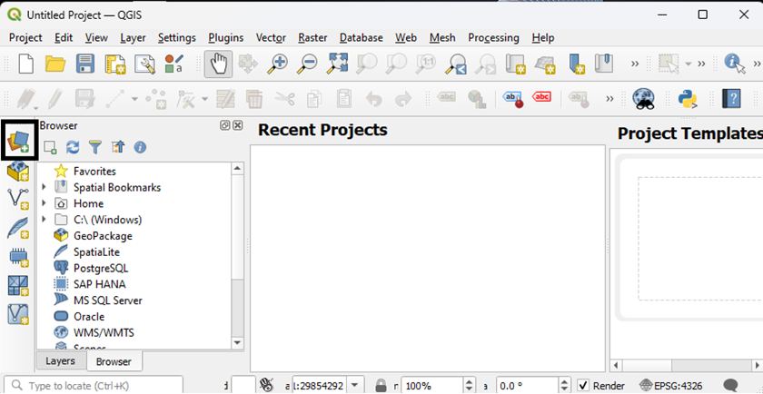
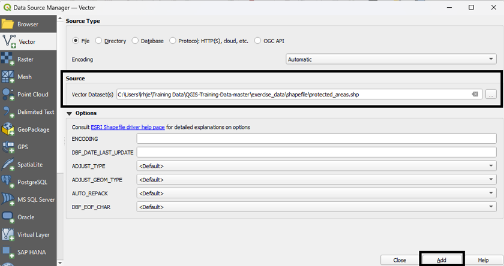
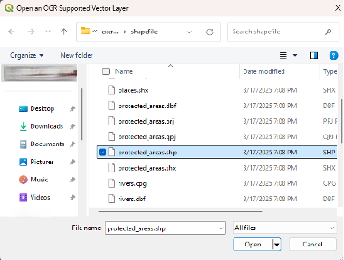
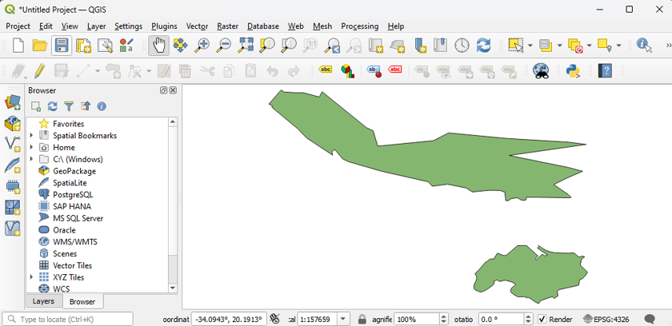
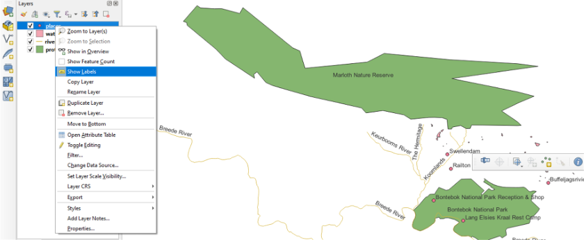
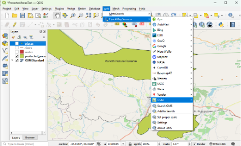
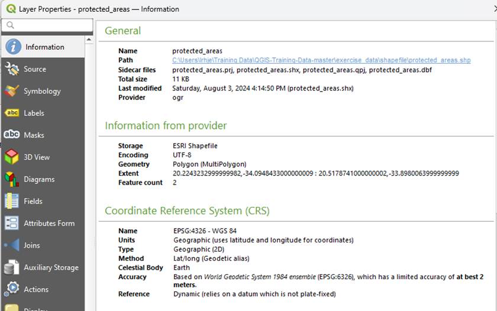
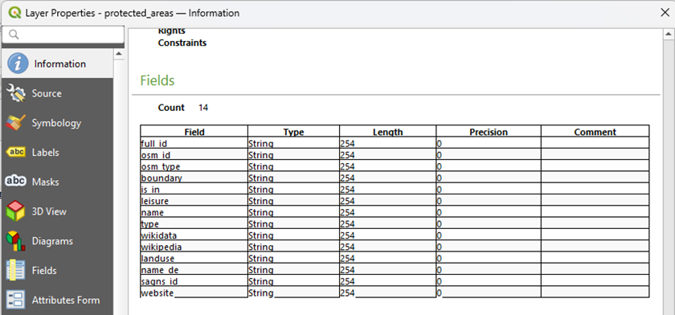
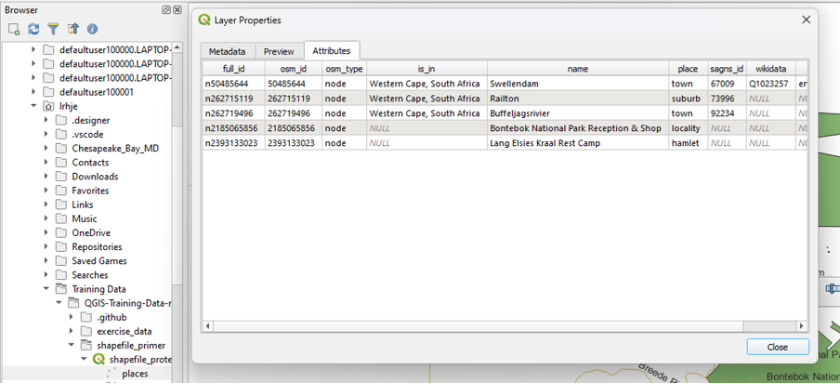

# Shapefile Curation Primer

Authors: Laura Hjerpe - University of Virginia Library, Karl Benedict - University of New Mexico, Wenjie Wang - University of Nebraska–Lincoln

Mentor: Aditya Ranganath 

## Overview

| Topic  | Description  |
| :------------- | :------------- |
| Versions  | Original Release: [ESRI Shapefile Technical Description (1998)](https://www.esri.com/content/dam/esrisites/sitecore-archive/Files/Pdfs/library/whitepapers/pdfs/shapefile.pdf) with subsequent extensions by [ESRI](https://www.esri.com/en-us/home)  |
| Primary fields or areas of use  | Shapefiles are broadly used across many disciplines in which [non-topological vector geometries](https://www.esri.com/news/arcuser/0401/topo.html) (i.e. point, line, polygon) and attributes associated with those geometries (e.g. observation timestamp, well depth, street address, population​, etc.​) are stored, visualized, analyzed, and exchanged.  |
| Source and affiliation  | [ESRI](https://www.esri.com/en-us/about/about-esri/company), formerly Environmental Systems Research Institute, Inc.  |
| Metadata standards ([FGDC Geospatial Metadata Standards and Guidelines](https://www.fgdc.gov/metadata/geospatial-metadata-standards))  | The [ISO 19115](https://committee.iso.org/sites/tc211/home/projects/projects---complete-list/iso-19115-1.html) base standard and related family of standards (numbered 191\*\* in the ISO/TC 211 *Geographic information/Geomatics* “Geographic Information” standards collection) are the currently recommended metadata standards-based for geospatial data, including Shapefiles. Some legacy geospatial datasets will have U.S. Federal Geographic Data Committee *Content Standard for Digital Geospatial Metadata (CSDGM)* which is now deprecated.|
| Key questions for curation review  | ​​Are all required and recommended files included?   |
| Tools for curation review  | Desktop Geographic Information System (GIS): [QGIS](https://www.qgis.org/en/site/)   |
| Date Created  | June 24, 2024  |
| Created by  | Laura Hjerpe, Karl Benedict, Wenjie Wang  |
| Date updated and summary of changes made  | 2024-07-31 Peer review version completed |

# Table of Contents

[Shapefiles within the broader context of Spatial Data formats](#Shapefiles-within-the-broader-context-of-Spatial-Data-formats)

[Examples of Geospatial Repositories through which Shapefiles May be Discovered and Accessed](#Examples-of-Geospatial-Repositories-through-which-Shapefiles-May-be-Discovered-and-Accessed)
> [Note on the Complementary Roles of Geospatial Registries, Clearinghouses, and Repositories](#Note-on-the-Complementary-Roles-of-Geospatial-Registries,-Clearinghouses,-and-Repositories)

[Shapefile Dataset Examples](#Shapefile-Dataset-Examples) 

[Description of Format](#Description-of-Format)

[Sample Dataset Citations](#sample-dataset-citations)

[Key Questions to Ask Yourself](#key-questions-to-ask-yourself)

[Key Clarifications To Get From Researcher](#key-clarifications-to-get-from-researcher)

[Commonly Used Coordinate Systems and Projections by Region](#commonly-used-coordinate-systems-and-projections-by-region)

[Applicable Metadata Standard(s), and recommended README and Core Metadata Elements](#applicable-metadata-standards-and-recommended-readme-and-core-metadata-elements)

[Resources for Reviewing Data](#resources-for-reviewing-data)

[Software for Viewing or Analyzing Data](#software-for-viewing-or-analyzing-data)
>[Inspecting Shapefiles with QGIS](#inspecting-shapefiles-with-qgis)
>>[Add a Shapefile to your QGIS Project](#add-a-shapefile-to-your-qgis-project)
>>[View Shapefile Layers with geographies and labels](#view-shapefile-layers-with-geographies-and-labels)
>>>[Access Layer Properties to view field and attribute information](#access-layer-properties-to-view-field-and-attribute-information)

[Preservation Actions](#preservation-actions)

[Documentation of Curation Process: What to Capture from the Curation Process](#documentation-of-curation-process-what-to-capture-from-the-curation-process)

[What To Look for To Ensure This File Meets FAIR Principles](#what-to-look-for-to-ensure-this-file-meets-fair-principles)
>[Findable](#findable)

>[Accessible](#accessible)

>[Interoperable](#interoperable)

>[Reusable](#reusable)

>[Additional Considerations](#additional-considerations)

>[Tools and Resources](#tools-and-resources)

[Ways in Which Fields May Use This Format](#ways-in-which-fields-may-use-this-format)

>[Geographic Information Systems (GIS):](#geographic-information-systems-gis)

>[Environmental Science and Natural Resource Management:](#environmental-science-and-natural-resource-management)

>[Urban Planning and Transportation:](#urban-planning-and-transportation)

>[Public Health and Epidemiology:](#public-health-and-epidemiology)

>[Agriculture and Rural Development:](#agriculture-and-rural-development)

>[Archaeology and Cultural Heritage Management:](#archaeology-and-cultural-heritage-management)

>[Disaster Management and Emergency Response:](#disaster-management-and-emergency-response)

>[Unresolved Issues/Further Questions](#unresolved-issuesfurther-questions)

>>[Long-Term Preservation and Accessibility](#long-term-preservation-and-accessibility)

>>[Tracking Provenance of Data Creation](#tracking-provenance-of-data-creation)

>>[Level of Detail in Dataset](#level-of-detail-in-dataset)

>[Warnings](#warnings)

[Appendix A - Shapefile CURATE(D) checklist](#appendix-a---shapefile-curated-checklist)

>[Check](#check)

>[Understand](#understand)

>[Request](#request)

>[Augment](#augment)

>[Transform](#transform)

>[Evaluate](#evaluate)

>[Document](#document)

>[Bibliography](#bibliography)

## Shapefiles within the broader context of Spatial Data formats

As a category of data, geospatial data consist of individual data values
that are integrated with locational information in a specifically
defined spherical (e.g. latitude and longitude) or planar (X, Y
coordinates) **[coordinate reference
system](https://en.wikipedia.org/wiki/Spatial_reference_system) (CRS,
also referred to as spatial reference system)**, either of which may
also include additional vertical (Z axis) offsets from the specified
coordinates. The specific coordinate values and units may be based upon
a local spherical or [cartesian
coordinate](https://en.wikipedia.org/wiki/Cartesian_coordinate_system)
system or may be recorded in the defined coordinate ranges and
measurement units defined by a specified
[geographic](https://en.wikipedia.org/wiki/Geographic_coordinate_system),
[geocentric](https://en.wikipedia.org/wiki/Earth-centered,_Earth-fixed_coordinate_system),
or
[projected](https://en.wikipedia.org/wiki/Projected_coordinate_system)
coordinate system, with the definition of that system encoded in a
geospatial data format.

Geospatial data values are typically represented using one of two
high-level data models: raster and vector. **Raster data** consist of
continuous or categorical data values that are assigned to specific
locations (pixels) within a regular grid which, in turn, correspond with
specific spatial locations.

**Vector data**, on the other hand, consist of
**features**/**geometries** defined by one or more vertices, each of
which is associated with a specific spherical or cartesian coordinate
and optionally a vertical offset from that position. Three fundamental
feature types can be defined using individual vertices:

- Points – individual locations defined by a single vertex

- Lines – a series of two or more vertices that are connected in a
  single open sequence (i.e. no connections between vertices that create
  a closed polygon – see next)

- Polygons - a series of three or more vertices that are connected and
  closed (i.e. the last vertex in the series connects to the first)

Specific geospatial applications and formats may build upon these
fundamental feature types through the definition of data models that are
collections of individual base geometries (e.g. [multipoint, multipart
line, and multipart
polygons](https://www.esri.com/about/newsroom/arcuser/multipart/), and
[GeometryCollection](https://datatracker.ietf.org/doc/html/rfc7946#section-3.1.8)
\[from the IETF specification of the GeoJSON format\]), differentiate
between 2-dimensional (i.e. spherical or cartesian X-Y coordinates) and
3-dimensional (2-dimensional with additional vertical offset values)
data models, and those that encode the spatial relationships between
features through shared geometry ([geospatial
topology](https://en.wikipedia.org/wiki/Geospatial_topology)), with
topological support enabling support for and enforcement of expanded
data integrity rules. Vector data integrate one or more **attribute
values** with each feature, allowing for the association of those values
with the specific locations defined by the feature geometries.

Given this high-level definition of terms (in **bold** above) and
concepts related to spatial data, Shapefiles are a geospatial *vector
data format* that encodes *feature geometries*, *does not include
topology*, and links *attribute values* to those geometries.

## Examples of Geospatial Repositories through which Shapefiles May be Discovered and Accessed

Depending upon the context (e.g. sponsoring agency, data type/content,
creating organization) within which geospatial data are created and used
they may be discovered, accessed, and preserved in specific
disciplinary/organizational repositories or general repositories. Given
the broad applicability of geospatial data across disciplines they are
frequently placed in disciplinary repositories that contain the breadth
of data applicable to a particular discipline, potentially limiting
direct repository support for the specialized metadata and data formats
that have been developed for geospatial data. This limitation can
potentially be mitigated through the cross-registration/deposit of
geospatial data into registries and clearinghouses that are specifically
designed to enable enhanced discovery, access, and use of geospatial
data (see note below).

While a more comprehensive list of candidate repositories can be found
in a registry of research data repositories such as
[re3data.org](https://www.re3data.org/), examples of disciplinary
repositories that have a strong focus on geospatial data, including
shapefiles, include:

[ScienceBase](https://www.sciencebase.gov/catalog/)

ScienceBase is a U.S. Geological Survey (USGS) Trusted Digital
Repository providing access to scientific data products and resources.

[National Historical Geographic Information
System](https://www.nhgis.org/)

The National Historical Geographic Information System provides historic
tabular and spatial data related to socio-economic time-series data from
1790 to present, and is part of the collection of the [Core-Trust
Seal](https://coretrustseal.org/) certified
[IPUMS](https://www.ipums.org/) suite of data repositories.

[World Data Center for Climate](https://www.wdc-climate.de/ui/)

The WDCC archives and disseminates global Earth System data in support
of the international climate research community.

### Note on the Complementary Roles of Geospatial Registries, Clearinghouses, and Repositories

Geospatial Data Clearinghouses and Registries are specialized platforms
that are typically designed to provide data discovery, access, and use
capabilities that might be considered value-added services on top of the
datasets stored in those systems (in the case of Clearinghouses) or
discoverable through those systems (in the case of registries). *Such
systems do not necessarily provide long-term digital preservation
capabilities or associated persistent identifiers (such as DOIs) for the
data upon which they are built - two key characteristics that commonly
define trusted repositories* (e.g. [CoreTrustSeal
Requirements](https://doi.org/10.5281/zenodo.7051011) or the [USGS
Fundamental Science Practices (FSP) Standards for Establishing Trusted
Repositories for USGS Digital
Assets](https://www.usgs.gov/office-of-science-quality-and-integrity/fundamental-science-practices-fsp-standards-establishing))
and enable effective data citation (e.g. [Data Citation Synthesis Group:
Joint Declaration of Data Citation
Principles](https://doi.org/10.25490/a97f-egyk)). For these reasons
geospatial data clearinghouses may be considered high-value platforms
for providing access to geospatial data but must be separately evaluated
to determine if additional digital preservation actions, such as
placement in a separate trusted data repository, are needed for a
specific dataset.

## Shapefile Dataset Examples

[TIGER/Line
Shapefiles](https://www.census.gov/geographies/mapping-files/time-series/geo/tiger-line-file.2023.html#list-tab-790442341)

The TIGER/Line Shapefiles are extracts of selected geographic and
cartographic information from the Census Bureau’s Master Address File
(MAF)/Topologically Integrated Geographic Encoding and Referencing
(TIGER) system. The Shapefiles include information for the fifty states,
the District of Columbia, Puerto Rico, and the Island areas (American
Samoa, the Commonwealth of the Northern Mariana Islands, Guam, and the
United States Virgin Islands). The Shapefiles include polygon boundaries
of geographic areas and features, linear features including roads and
hydrography, and point features.

[Geospatial Dataset of Roads and Settlement Features for the Chesapeake
Bay Eastern Shore Region of Maryland, USA,
1865](https://doi.org/10.7910/DVN/KPILKU)

This dataset contains geospatial (GIS) data files that capture
historical roads and points of interest for the Chesapeake Bay Eastern
Shore region of Maryland, as derived from Simon J. Martenet’s Map of
Maryland: Atlas Edition (1866). Maryland counties covered include
present-day Cecil, Caroline, Dorchester, Kent, Queen Anne’s, Somerset,
Talbot, Wicomico, and Worcester counties. Geospatial data layers include
roads, landings, ferries, churches, shops, mills, schools, hotels, towns
with post offices, and towns with courthouses. These data can be used to
support historical geographic, economic, social, and cultural analyses.

Note: The README file includes additional details about data sources,
digital map creation methods, and spatial reference information.

[Twin Cities Land Use Map from the Twin Cities Metropolitan Planning
Commission
(1958)](https://geo.btaa.org/catalog/b98a7b39-830a-48ca-84c2-06332aaebbb8#metadata)

High-quality GIS land use maps for the Twin Cities Metropolitan Area for
1958 that were developed from paper maps (no GIS version existed
previously). The GIS Shapefiles were exported using ArcGIS Quick Import
Tool from the Data Interoperability Toolbox. The coverage files were
imported into a file geodatabase then exported to a .shp file for
long-term use without proprietary software. An example output of the
final GIS file is included as a pdf, in addition, a scan of the original
1958 map (held in the UMN Borchert Map Library) is included as a pdf.
Metadata was extracted as an xml file. Finally, all associated coverage
files and original map scans were zipped into one file for download and
reuse.

## Description of Format

The ESRI Shapefile format was developed and released as a proprietary
format for encoding and exchanging non-topological geometry and
attribute data for spatial features in a dataset. While released as a
proprietary format, the [published
documentation](https://www.esri.com/content/dam/esrisites/sitecore-archive/Files/Pdfs/library/whitepapers/pdfs/shapefile.pdf)
has enabled geospatial application developers to implement support for
reading and writing files in the Shapefile format, resulting in broad
support and use of the Shapefile format for the exchange and use of
non-topological feature data.

Structure Documentation

- [ESRI Shapefile Technical Description
  (1998)](https://www.esri.com/content/dam/esrisites/sitecore-archive/Files/Pdfs/library/whitepapers/pdfs/shapefile.pdf)

- [Library of Congress Format
  Description](https://www.loc.gov/preservation/digital/formats/fdd/fdd000280.shtml)

The base file structure of a shapefile consists of required and optional
files – all of which must share the same file prefix, with each
component file then having its own specific extension. While the
original 1998 technical description required use of an 8.3 naming
convention (filename prefixes limited to only 8 characters with a three
letter suffix/extension), subsequent system development has relaxed this
length requirement while still
[recommending](https://community.esri.com/t5/data-management-blog/how-to-name-things-in-arcgis/ba-p/897194)
that Shapefile names start with an alpha character (a-Z), contain no
spaces, and limit the use of special characters to “\_” if used. **All
files must share the same name prefix and be co-located within the same
file system directory/folder, with this co-location requirement often
facilitated through sharing Shapefiles as a compressed archive file such
as Zip or tar.gz**.

Required files for a minimal valid Shapefile:

- Main file (x.shp): ex. counties.shp (2 GB size limit)

- Index file (x.shx): ex. counties.shx

- dBase file (x.dbf): ex. counties.dbf (2 GB size limit)

Required (i.e. if the files are already present ensure that they are
included in the preserved/shared file package):

- Spatial Index for read/write instances - Part 1 (x.sbn): ex.
  counties.sbn

- Spatial Index for read/write instances - Part 2 (x.sbx): ex.
  counties.sbx

- Geocoding index for read/write instances - required if present
  (x.ixs): ex. counties.ixs

Optional files

- Projections Definition File –  
  *This is strongly recommended and required if coordinate reference
  system information is to be included in file (x.prj): ex.
  counties.prj*

- Spatial Index - Part 1 - for read-only Shapefiles (x.fbn): ex.
  counties.fbn

- Spatial Index - Part 2 - for read-only Shapefiles (x.fbx): ex.
  counties.fbx

- Attribute Index - Part 1 (x.ain): ex. counties.ain

- Attribute Index - Part 2 (x.aih): ex. counties.aih

- Geocoding Index for read/write ODB format Shapefiles (x.mxs): ex.
  counties.mxs

- Metadata File (x.xml): ex. counties.xml  
  *This is strongly recommended as an additional machine-readable
  documentation element that may be generated by a variety of GIS
  applications.*

- Character set codepage specification file (x.cpg): ex. counties.cpg  
  *This is particularly important if the dataset contains diacritic or
  other international characters in attribute names or content that are
  not included in the default
  [ISO-8859-1](https://en.wikipedia.org/wiki/ISO/IEC_8859-1) (Latin 1)
  characterset.*

- ArcView 3.x Attribute Index - no longer used by ArcGIS (x.atx): ex.
  counties.atx

- Projections Definition File (for shapefiles are generated in QGIS) ex.
  counties.qpj

[MIME
Types](https://www.iana.org/assignments/media-types/media-types.xhtml)

- application/octet-stream (main file)

- application/dbf

- application/dbase

- application/vnd.shx

- application/vnd.shp

- application/vnd.dbf

- Metadata: text/xml

Additionally, as Shapefiles use the Dbase DBF file format for storing
attribute data (in the x.dbf file) they inherit the limitations of that
format, including: attribute (column) name length limited to 10
alphanumeric characters (a-Z, 0-9); underscores “\_” only allowed
between characters and included in the 10-character attribute name
limit; no spaces in column names; a limit of 255 attribute columns; and
attribute data types of floating point, integer, date, and text (254
character limit), all stored internally as text.

## Sample Dataset Citations

Seven typical elements included in data citations are Author,
Publication, Year, Title of the data, Publisher, Digital Object
Identifier (DOI), and Access Date and Time. If relevant, you may add
other elements, such as query parameters, direct access link, data
format, 3rd party producer, editor or contributor, publication place,
and data within a larger work. Source: [USGS Data
Citation](https://www.usgs.gov/data-management/data-citation#elements).
Below are several examples of dataset citations according to APA and
Chicago style guides and suggested data citations provided by data
repositories or clearinghouses.

APA style:

United States Census Bureau, 2023. 2023 TIGER/Line Shapefiles: States
(and equivalent) (machine readable data files). U.S. Department of
Commerce. <https://www.census.gov/cgi-bin/geo/shapefiles/index.php>,
(Accessed 2 June 2024)

Chicago style:

U.S. Department of Commerce. United States Census Bureau. TIGER/Line
Shapefiles: States (and equivalent) (machine readable data files), 2023.
Distributed by the U.S. Census Bureau.
<https://www.census.gov/cgi-bin/geo/shapefiles/index.php>.

Harvard Dataverse suggested citation:

Mennis, Jeremy; Yuen, Kai, 2023, “Geospatial Dataset of Roads and
Settlement Features for the Chesapeake Bay Eastern Shore Region of
Maryland, USA, 1865”, <https://doi.org/10.7910/DVN/KPILKU>, Harvard
Dataverse, V1 (Accessed 9 June 2024)

BTAA-GIN suggested citation:

Chen, Wei, Levinson, David M. (2013). Twin Cities Land Use Map from the
Twin Cities Metropolitan Planning Commission (1958). University of
Minnesota. <http://dx.doi.org/10.13020/D6059J> (dataset) (Accessed 9
June 2024)

USGS ScienceBase suggested citation:

Seymour, W. A., and Traum, J. A., 2021, Petaluma Model GIS Data: U.S.
Geological Survey data release, <https://doi.org/10.5066/P9IQDHIT>,
(Accessed 9 June 2024).

## Key Questions to Ask Yourself

*Are there any Shapefile components missing from the zipfile?* At
minimum, there should be three Shapefile components: .shp, .shx, and
.dbf. The Shapefile layer will not fail if a .prj file is not included
but the shapefile could be misregistered with other spatial data if it
lacks a .prj file that defines its coordinate reference system.
Therefore, inclusion of a .prj file is strongly encouraged.

If reviewing a large number of Shapefiles at one time, this Shapefile
inventory python script might be useful:
<https://github.com/mkernik/geodct/tree/main/shapefileTools>. The
Shapefile inventory python script will generate a file list and a
curation report that lists shapefiles, field names, flags corrupt
shapefiles and more. See the README file for instructions on how to
setup and call the Shapefile inventory python script and provide the
path of the shapefile folder in [OSGeo4W
Shell](https://trac.osgeo.org/osgeo4w/).

[OSGeo](https://www.osgeo.org/) is a nonprofit organization that
supports and promotes open source geospatial software. OSGeo4W shell is
a command line interface for the Windows operating system provided by
OSGeo which allows users to install, manage, and run various OSGeo
software packages on Windows. It provides an environment to execute
GIS-related commands and scripts efficiently.

*Do all Shapefile components have the same prefix (e.g., ferries.shp,
ferries.shx, and ferries.dbf)?*

*Are there obvious georeference errors such as features (e.g. animals,
plants, buildings, or parks) mapped to the wrong country or hemisphere?*
This could be caused by missing projection (coordinate reference system)
metadata, which are contained in the .prj Shapefile component.

*Are there polygons with misaligned edges – often appearing as
overlapping areas or gaps between polygons representing adjacent areas,
such as lots, neighborhoods, cities or counties?* This is a particular
concern with Shapefiles because they do not contain topological
information (spatial relationships), such as shared edges and direction.
Examples of a misaligned edge can be found in the [Align topological
edges](https://pro.arcgis.com/en/pro-app/latest/help/editing/align-topology-edges.htm)
in ArcGIS Pro Help web page, and a more complete listing of potential
topological errors can be found at the USGS [Topology and Network
Errors](https://www.usgs.gov/ngp-standards-and-specifications/topology-and-network-errors)
page. If the curator identifies misaligned edges, they should inform the
researcher. The researcher should fix the error, or minimally, document
it.

*Did the researcher include data reuse limitations in the metadata or
documentation?* Example: “The boundary information in the TIGER/Line
Shapefiles is for statistical data collection and tabulation purposes
only. Their depiction and designation for statistical purposes does not
constitute a determination of jurisdictional authority or rights of
ownership or entitlement and are not legal land descriptions.”
[TIGER/Line Shapefile Legal
Disclaimers](https://www2.census.gov/geo/pdfs/maps-data/data/tiger/tgrshp2023/TGRSHP2023_TechDoc_Ch1.pdf).

## Key Clarifications To Get From Researcher

*What kind of documentation or metadata about your data, datasets, or
files has been created?* If the data does not address details, such as
lineage, geographies, attributes, time periods, and data use
limitations, you may need to contact the data submitter for
clarification.

*Were the data converted from a geodatabase or another format to a
Shapefile?* Losing data from file conversion is a common issue,
especially when converting from a Geodatabase to Shapefile format. A
common sign that a Shapefile originally started in another format is
truncated field names or text attribute field content that exceeds the
10- and 254-character limits respectively. Indications of these as
potential issues include documentation that does not match the table
attribute names or descriptions and text attribute content that
terminates at the 254-character limit when examined.

Shapefiles, a format introduced in the early 1990s, have a 2 GB size
limit, a maximum field name length of 10 characters, and allow a field
maximum of 254 text characters. Shapefiles do not support subtypes
(e.g., arterial roads, local streets), field type attribute rules (e.g.,
code values, limited number ranges) or topology. In comparison, the
proprietary ESRI Geodatabase, a more recent, robust format, has no size
limit, a maximum field name length of 54 characters, a text field width
of over 2 billion characters, and it supports subtypes, field type
attribute rules, and topology. See [Geoprocessing Considerations for
Shapefile
Output](https://desktop.arcgis.com/en/arcmap/latest/manage-data/shapefiles/geoprocessing-considerations-for-shapefile-output.htm)

It may be worth further discussion with the data creator/submitter if
they did export from a Geodatabase about alternative open export
formats, such as [GeoPackage](https://www.geopackage.org/). Moreover,
GeoPackage data maybe easier to share because it comes in one file as
opposed to Shapefile data, which comes in multiple files.

*Where does the raw data come from, and how does it end up in this
form?* Cite the underlying georeferenced source. The data could come
from many sources, such as digitized georeferenced images, surveys or
field-based data collection, geocoding, or a derivative generated
algorithmic processing of another dataset. In addition, the software and
hardware used to produce and/or work with this data should be described.
See [Preserving Geospatial Data](http://doi.org/10.7207/twr23-01) below. 
If ArcGIS or other software was used, the version should be
indicated. For examples of descriptions of lineage and tools used to
create the Shapefiles, see *Shapefile Dataset Examples* above.

*What does the data represent?*

*What attributes are included. What are their field types?*

*What units are in fields?*

*What is the geographic extent?*

*What is the scale of the geographies represented? How does this
translate into appropriate use of the data?*

*How might topology or lack of topology limit specific uses, such as
land survey or boundary mapping?*

*What is the reference time for the included geometries and attribute
values? Geometries and attribute values may change over time.*

*What is the coordinate reference system; is it projected? If so what’s
the projection?*

## Commonly Used Coordinate Systems and Projections by Region

A coordinate system is a framework used to define the positions of
points in space. In geographic information systems (GIS), coordinate
systems are essential for accurately mapping and analyzing spatial data.
There are two primary types of coordinate systems: geographic and
projected.

Geographic coordinate systems use a three-dimensional spherical surface
to define locations on the Earth. They are based on latitude and
longitude, with a datum providing the reference model for the Earth’s
shape. The most common datum used globally is the WGS84.

Projected coordinate systems, on the other hand, represent the curved
surface of the Earth on a flat plane. This involves mathematical
transformations known as map projections, which convert the spherical
coordinates into two-dimensional Cartesian coordinates (x, y). Different
projections are used based on the needs of the map, such as minimizing
distortion in area, shape, distance, or direction. Examples include the
Universal Transverse Mercator (UTM) and Albers Equal-Area projections.
The choice of coordinate system and projection is crucial for accurately
representing spatial data and ensuring consistency across different
datasets. Esri offers [helpful examples in their
blog](https://www.esri.com/arcgis-blog/products/arcgis-pro/mapping/gcs_vs_pcs/),
including visual illustrations. Here’s another [helpful list of
projection types](https://en.wikipedia.org/wiki/List_of_map_projections)
along with associated images. While it doesn’t include [EPSG
codes](https://epsg.org/home.html) or [other
identifiers](https://spatialreference.org/), the projection names can be
used to look up the corresponding IDs within a specific identifier
system.

It is generally recommended to document the projection or coordinate
system selected by the researcher to preserve the original intent and
geographic accuracy. The key is that the CRS is documented in a machine
and human readable format (e.g. the .prj file and in the metadata) that
includes standard identifiers (such as EPSG code) and definition for the
specific CRS. However, during the curation process it may be useful to
recommend certain projections for specific use cases—particularly for
interoperability or standardization purposes. It is also good to be
aware that some countries establish [specific coordinate systems or map
projections](https://en.wikipedia.org/wiki/List_of_national_coordinate_reference_systems)
as standards for their data. Additionally, here are some commonly used
coordinate systems and map projections in different regions:

Global:

1.  WGS84 (World Geodetic System 1984): A global geographic coordinate
    system used for GPS and most international mapping. (EPSG:4326)

2.  UTM (Universal Transverse Mercator): A global projected coordinate
    system that divides the world into a series of 6-degree longitudinal
    zones, each with its own projection.

North America:

1.  NAD83 (North American Datum 1983): A geographic coordinate system
    commonly used in North America. (EPSG:4269)

2.  NAD27 (North American Datum 1927): An older geographic coordinate
    system, still used for some historical data. (EPSG:4267)

3.  State Plane Coordinate System (SPCS): A set of projected coordinate
    systems used in the United States, each state having one or more
    zones tailored to minimize distortion.

Europe

1.  ETRS89 (European Terrestrial Reference System 1989): The standard
    coordinate system for Europe. (EPSG:4258)

2.  British National Grid (OSGB36): A projected coordinate system used
    in Great Britain. (EPSG:27700)

Australia

1.  GDA94 (Geocentric Datum of Australia 1994): A geographic coordinate
    system widely used in Australia. (EPSG:4283)

2.  MGA (Map Grid of Australia): A projected coordinate system based on
    UTM, using the GDA94 datum.

Asia

1.  Tokyo Datum: A geographic coordinate system used historically in
    Japan. (EPSG:4301)

2.  China Geodetic Coordinate System 2000 (CGCS2000): The modern
    geographic coordinate system for China. (EPSG:4490)

South America

1.  SIRGAS (Geocentric Reference System for the Americas): A continental
    system used across South America, similar to WGS84. (EPSG:4674)

Africa

1.  Cape Datum: An older geographic coordinate system used in South
    Africa. (EPSG:4222)

2.  Hartebeesthoek94 (Hartebeesthoek Radio Astronomy Observatory 1994):
    The current standard geographic coordinate system for South Africa.
    (EPSG:4148)

Middle East

1.  Ain el Abd 1970: A geographic coordinate system used in several
    Middle Eastern countries. (EPSG:4204)

## Applicable Metadata Standard(s), and recommended README and Core Metadata Elements

The [ISO
19115](https://committee.iso.org/sites/tc211/home/projects/projects---complete-list/iso-19115-1.html)
base standard and related family of standards - numbered 191\*\* in the
ISO/TC 211 *Geographic information/Geomatics* “Geographic Information”
standards collection - are the currently defined standards-based
metadata that are recommended for geospatial data. The transition and
adoption of the ISO 191\*\* standards family has been a long one and
there are many instances of the use of the previously recommended (in
the U.S.) Federal Geographic Data Committee Content Standard for Digital
Geospatial Metadata
([CSDGM](https://www.fgdc.gov/metadata/csdgm-standard)) that will be
encountered when searching for and accessing geospatial data.

The specific required and optional elements of the ISO standard depend
upon data type and characteristics and as a result a “minimal” metadata
record (i.e. a metadata record that would meet structural requirements
when evaluated using an XML schema) can be created that is only
minimally useful. The value and utility of a metadata record for a
Shapefile can be substantially improved through the use of additional
optional metadata elements within the 19115 standard (see [T. Habermann,
2020](https://metadatagamechangers.com/blog/2020/12/23/minimum-metadata)
for a discussion of the minimal value of minimal metadata). Because of
this, a number of guidance documents have been developed to aid in the
development of ISO 19115 compliant metadata that also meet dataset and
use case specific requirements for discovery, access, understanding, and
use. Formalized requirements representing this guidance is are specified
as application profiles (e.g. the [FGDC North American Profile of
ISO19115:2003 - Geographic Information - Metadata
(2007)](https://www.fgdc.gov/standards/projects/incits-l1-standards-projects/NAP-Metadata/napMetadataProfileV11_7-26-07.pdf)
and profiles listed in the [RDA Metadata Standards
Catalog](https://rdamsc.bath.ac.uk/msc/m22)). Examples of these
guidelines documents and technical specifications include:

- [USGS Metadata Creation Web
  Page](https://www.usgs.gov/data-management/metadata-creation)

- [NOAA Metadata Creation Reference Web
  Page](https://www.ncei.noaa.gov/resources/metadata/create)

- [ESRI ISO Metadata Creation
  Instructions](https://pro.arcgis.com/en/pro-app/latest/help/metadata/create-iso-19115-and-iso-19139-metadata.htm)

- [FGDC Technical Guidance: Data.gov and the GeoPlatform Metadata
  Recommendations: Including Guidelines for National Geospatial Data
  Assets
  (NGDA)](https://www.fgdc.gov/technical-guidance/metadata/fgdc-technical-guidance-datagov-geoplatform-ngda.pdf)

- [ICSM ISO19115-1 Metadata Good Practice
  Guide](https://www.icsm.gov.au/sites/default/files/5a-Good%20Practice%20document.pdf)

The RDA ISO 19115 [RDA Metadata Standards
Catalog](https://rdamsc.bath.ac.uk/msc/m22) contains a valuable list of
references related to the standard itself, related standards and
profiles, tools for creating ISO metadata, and users of the standard
that can be visited to view examples of their application of the
standard.

Key metadata elements that should be included in what could be
considered a “complete” README and geospatial data metadata record
include the following common elements (from [Hatfield Consultants
(2020). *Canadian Geospatial Data Infrastructure Cookbook*, Canadian
Geospatial Data Infrastructure Information Product 59e: Section 4.1,
pp. 38-42](https://publications.gc.ca/collections/collection_2021/rncan-nrcan/M124-10-1-2020-eng.pdf)
– a language preference selection is required prior to accessing the
linked document)

> *Identification information*: information that allows the geospatial
> dataset to be uniquely identified and distinguished from other
> datasets (e.g., name of the dataset, keywords, basic description and
> geographic extents) and assists in cataloging the geospatial dataset.
>
> *Data quality information*: information that could include
> completeness of the dataset, processes used to create and maintain it,
> and the amount of validation or verification performed on the dataset.
>
> *Spatial data representation information*: information that could
> include precision and accuracy of vector geometry or the resolution of
> raster data.
>
> *Non-spatial (attribute or tabular) data information*: information
> about the attribute data associated with features in geospatial data
> in vector format, or attribute data associated with cells of
> geospatial data in raster format. This could include the meaning of
> attribute names, valid values, domain or range for attribute values,
> and method used to collect and update attribute values.
>
> *Distribution information*: information that can be used to govern the
> distribution of the geospatial dataset, including the identity of the
> organization creating and maintaining the dataset, and date the
> dataset was published or made available to the public.

The US Federal Geographic Data Committee (FGDC) provides a [useful
sample](https://www.fgdc.gov/technical-guidance) ISO 19139 (the ISO
standard identifier for the XML encoding of the ISO 19115 standard)
record from which the following high-level ISO 19115 content categories
have been extracted to illustrate the parts of the ISO standard that are
important in creating a useful metadata record – though the specific
content or applicability of these elements must be determined by the
specifics of the Shapefile being curated:

- \<gmd:language\>

- \<gmd:characterSet\>

- \<gmd:contact\>

  - \<gmd:CI_ResponsibleParty\>

- \<gmd:dateStamp\>

- \<gmd:metadataStandardName\>

- \<gmd:metadataStandardVersion\>

- \<gmd:referenceSystemInfo\>

- \<gmd:identificationInfo\>

  - \<gmd:MD_DataIdentification\>

    - \<gmd:citation\>

    - \<gmd:abstract\>

    - \<gmd:purpose\>

    - \<gmd:credit\>

    - \<gmd:status\>

    - \<gmd:pointOfContact\>

  - \<gmd:resourceMaintenance\>

  - \<gmd:graphicOverview\>

  - \<gmd:descriptiveKeywords\>

  - \<gmd:resourceConstraints\>

  - \<gmd:aggregationInfo\>

  - \<gmd:spatialRepresentationType\>

  - \<gmd:topicCategory\>

  - \<gmd:environmentDescription\>

  - \<gmd:extent\>

- \<gmd:contentInfo\>

  - \<gmd:MD_FeatureCatalogueDescription\>

- \<gmd:distributionInfo\>

  - \<gmd:MD_Distribution\>

  - \<gmd:distributionFormat\>

  - \<gmd:distributor\>

  - \<gmd:transferOptions\>

    - \<gmd:MD_DigitalTransferOptions\>

- \<gmd:dataQualityInfo\>

  - \<gmd:DQ_DataQuality\>

    - \<gmd:scope\>

    - \<gmd:report\>

    - \<gmd:lineage\>

- \<gmd:metadataConstraints\>

- \<gmi:acquisitionInformation\>

  - \<gmi:MI_AcquisitionInformation\>

  - \<gmi:instrument\>

  - \<gmi:platform\>

If the Shapefiles will be placed into a repository that does not
directly support the ISO 19115-1 family of standards but does support
the commonly used (for data-related DOI provisioning) DataCite metadata
standard, elements of the ISO metadata can be integrated into the
DataCite metadata. The inclusion of “HasMetadata”,
“relatedMetadataSchema”, and “DocumentedBy” DataCite metadata elements
can reference the full ISO metadata record and other documentation,
including a README file. This approach is consistent with Habermann’s
(2020) recommendation from the [Minimum Metadata blog
post](https://metadatagamechangers.com/blog/2020/12/23/minimum-metadata)
referenced above:

> First, the “HasMetadata” relationType, along with the
> relatedMetadataSchema, makes it possible to connect to more detailed
> metadata from a DataCite record and to let the user know the dialect
> of those metadata. If, for example, an organization has complete
> metadata compliant with ISO 19115-1, that metadata can include data
> quality, user feedback, instrumentation, and lineage metadata not
> included in DataCite metadata. Letting the user know that those
> metadata exist can help them understand these important aspects of the
> data. Second, the “DocumentedBy” relationType makes it possible to
> connect to documentation of the resource, typically documents rather
> than structured metadata. This could point to published reports or
> papers that contain important details about how the data were
> processed or why the data were collected. This information is helpful
> when trying to understand the data and decide if it is trustworthy.

## Resources for Reviewing Data

In the process of working with Shapefile data, it’s crucial to have
access to reliable resources for reviewing and understanding the
intricacies of the data, such as the materials referenced above relating
the format description. Additional source materials that should be
consulted include:

*Official Documentation:* Start with the official documentation provided
by the organization or platform that created or maintains the Shapefile
format. This documentation often includes detailed specifications, data
structure explanations, and usage guidelines.

*Software Manuals:* If you’re using specific GIS software to work with
Shapefiles, refer to its manuals. These manuals usually offer insights
into how the software handles Shapefiles, data manipulation techniques,
and troubleshooting tips.

## Software for Viewing or Analyzing Data

Shapefiles can be read, visualized, and analyzed in a wide variety of
applications including (a short list of many):

- Desktop Geographic Information System (GIS):

  - Open Source: [QGIS](https://www.qgis.org/en/site/), [GRASS
    GIS](https://grass.osgeo.org/), [uDig](http://udig.refractions.net/)

  - Commercial off-the-shelf (COTS):
    [ArcGIS](https://www.arcgis.com/index.html)

- Programming Languages:

  - R: e.g. [sf
    package](https://cran.r-project.org/web/packages/sf/index.html)

  - Python: [GeoPandas
    module](https://geopandas.org/en/stable/getting_started/introduction.html)

- Online mapping applications:

  - COTS: [ArcGIS Online](https://www.arcgis.com/index.html), Tableau

  - Open Source: [GeoServer](https://geoserver.org/),
    [MapServer](https://mapserver.org/)

- Metadata Creation/Management

  - R:
    [Geometa](https://cran.r-project.org/web/packages/geometa/index.html)
    R Package

  - COTS: [ArcGIS
    Pro](https://pro.arcgis.com/en/pro-app/latest/help/metadata/create-iso-19115-1-and-iso-19115-3-metadata.htm)

  - Open Source/Web-based: [GeoNetwork
    Opensource](https://geonetwork-opensource.org/)

### Inspecting Shapefiles with QGIS

QGIS is a free tool that can be used to inspect Shapefiles. Download
QGIS from the download page at <https://qgis.org/download> and follow
the installation prompts.

See the [QGIS Training
Manual](https://docs.qgis.org/latest/en/docs/training_manual/index.html)
and for more guidance and information. Shapefiles from the exercise
folder of the [Training Data
Repository](https://github.com/qgis/QGIS-Training-Data/archive/master.zip)
were used to create the map examples used for the screenshots in the
steps show below. **Warning: Clicking the Training Data Repostory link
will download the data.**

#### Add a Shapefile to your QGIS Project

1.  *Access Data Source Manager* to select *Shapefile layers*. After
    opening QGIS, you will see a window with two panels(tabs) labelled
    as *Layers* and *Browser* and a blank *Recent Projects* window,
    where your map will be displayed. Select *Data Source Manager*, the
    top button on the side toolbar, to add Shapefile layers that can be
    viewed on the *Recent Projects* window.

*QGIS main menu with black box around Data Source Manage icon on the
left side toolbar.*

2.  In the *Data Source Manager* – *Vector* window, select a Shapefile.
    The Shapefile called protected_area.shp has been selected as an
    example. Choose **Add** to add the Shapefile layer and **Close** to
    get back to the main menu.

*Data Source Manager menu with Vector selected*

Note: Although there are multiple files in a Shapefile layer, you only
need to select the .shp extension to retrieve all files associated with
the protected area layer.

*Selecting protected areas Shapefile with .shp extension*

#### View Shapefile Layers with geographies and labels

3.  The protected areas Shapefile layer is shown in the main menu. Add
    external layers by selecting the *Data Source Manager* toolbar
    button again. These external layers can be added for comparison,
    review, and to provide additional context.

*Protected area map with one layer*

4.  The external places, water, and river layers have been added. Right
    click on a layer in the *Layers* panel to select the *Show Labels*
    option to make place, river and protected area names visible. This
    may help you determine if the names are truncated, or the geography
    is off. You can use this view to check for misaligned edges,
    georeference errors, and complete or accurate names. To focus on a
    specific layer, uncheck the other layers.

*Protected area map with multiple layers and names*

Note: It may be helpful to use the QuickMapServices (QMS) plugin to
compare shapes of areas, such as parks, bodies of water, and place names
to another map. For more information on QMS, see [<u>9.2 Lesson: Useful
QGIS
Plugins</u>](https://docs.qgis.org/latest/en/docs/training_manual/qgis_plugins/plugin_examples.html)
and the [<u>QMS
homepage</u>](https://nextgis.com/blog/quickmapservices/).

*QuickMapServices dropdown menu with selected Open Street Map (OSM)
Standard basemap.*

#### Access Layer Properties to view field and attribute information 

5.  Access the *Layer Properties* menu by selecting *Properties* from
    the right click menu on the *Layer*s panel. The *Information* tab is
    selected for the protected areas layer. Note the *Coordinate
    Reference System* information. The same information is on the
    *Properties Layer Metadata* tab (not shown).

*Layer Properties menu with Information selected for protected area with
Coordinate Reference System details*

6.  Scroll down to see *Fields* on the *Properties Information* tab.

*Layer Properties menu with Information selected for protected area with
Fields list*

7.  From the *Browser* panel, navigate to your *Project* folder
    (Shapefile_protected_areas). Right click on a layer, such as places
    and select *Properties*. On the *Attribute* tab, you can see
    attribute names and values, which can be compared against attribute
    metadata, and/or a separate data dictionary or codebook to make sure
    all variables are defined.

*Layer Properties menu from Browser panel for protected areas with
Attributes tab selected*

In cases where datasets are in a highly local coordinate system, such as
NAD83 (North American Datum 1983)/Maryland (ftUS), there may be
instances where you would see inconsistencies between locations of
small-scale/local features when mapped concurrently with the same
features collected/managed at larger map scales (typically with lower
locational precision and/or accuracy) and stored in large scale
coordinate systems, such as WGS84 (World Geodetic System 1984). These
inconsistencies may not necessarily require correction but curators
should be aware of this possibility and consider discussing this with
the data producer.

## Preservation Actions

Preservation actions are crucial for ensuring the longevity, integrity,
and accessibility of Shapefile data. Here’s a set of preservation
actions that can help safeguard Shapefile data for future use:

*Regular Backups:* Establish a routine schedule for backing up Shapefile
data to secure storage locations, such as external hard drives, cloud
storage services, or network servers.

*Comprehensive Metadata:* Create and maintain comprehensive metadata
records for Shapefile datasets, including information about data source,
creation date, projection, processing steps, attribute definitions, and
data quality.

*Standardized Metadata Formats:* Adhere to standardized metadata
formats, such as FGDC (Federal Geographic Data Committee) CSDGM or the
ISO (International Organization for Standardization) 191\*\* family
standards, to ensure consistency and interoperability.

*Regular Format Checks:* Periodically assess the compatibility of
Shapefile data with current and emerging GIS software and standards.
Consider migrating data to more sustainable open standard formats, such
as [GeoPackage](https://www.geopackage.org/), which is widely supported
across different GIS platforms.

*Data Conversion Tools:* Use data conversion tools and utilities to
facilitate the migration of Shapefile data between different file
formats while preserving spatial and attribute information.

## Documentation of Curation Process: What to Capture from the Curation Process

- Any additional processing and format conversion activities should be
  documented in the developed metadata.

- An inventory of Shapefile component files should be included in the
  curation record to assist in ongoing tracking of file completeness.

## What To Look for To Ensure This File Meets FAIR Principles

Ensuring that Shapefile data adheres to the FAIR principles (Findable,
Accessible, Interoperable, and Reusable) is essential for maximizing its
value and impact within the GIS (Geographic Information Systems)
community. This section outlines key considerations for evaluating
Shapefile data to ensure compliance with FAIR principles:

### Findable

*Descriptive Metadata:* Assess whether the Shapefile data is accompanied
by comprehensive metadata that provides detailed descriptions of its
content, purpose, spatial extent, attributes, and provenance.

*Persistent Identifiers:* Verify the presence of persistent identifiers,
such as DOIs (Digital Object Identifiers) or URLs, that uniquely
identify the Shapefile dataset and facilitate its discovery and citation
in data repositories.

### Accessible

*Open Access Policies:* Ensure that Shapefile data is made openly
accessible to users without unnecessary restrictions or barriers,
adhering to open access policies and licensing agreements.

*Data Repositories:* Check if the Shapefile dataset is deposited in
trusted data repositories or archives that provide reliable access
mechanisms, such as download links, APIs (Application Programming
Interfaces), or web services. As Shapefiles are inherently
location-specific, repositories that support location-based search are
particularly valuable.

### Interoperable

*Standardized Formats:* Evaluate whether the Shapefile data is stored in
standardized formats that are widely supported and interoperable with
various GIS software and systems.

*Coordinate Reference Systems (CRS):* Verify that the Shapefile data is
georeferenced using standard coordinate reference systems and
projections and that the CRS for the Shapefile is clearly included in
the metadata, enabling seamless integration with other spatial datasets.

### Reusable

*Licensing Information:* Review the licensing terms associated with the
Shapefile data to determine the permissions and conditions for its
reuse, redistribution, and modification by users.

*Data Quality Assurance:* Assess the quality and reliability of the
Shapefile data by examining metadata completeness, spatial accuracy,
attribute consistency, and adherence to relevant standards.

### Additional Considerations

*Versioning and Provenance:* Look for versioning information and
provenance records that document the history of changes, updates, and
transformations applied to the Shapefile dataset over time.

*Data Documentation:* Ensure that the Shapefile data is accompanied by
comprehensive documentation, including data dictionaries, coordinate
reference system, field descriptions, processing methodologies, and data
transformation records.

### Tools and Resources

*FAIR Assessment Tools:* Explore FAIR assessment tools and frameworks,
such as FAIRshake or FAIR Metrics, that provide structured methodologies
for evaluating the compliance of Shapefile data with FAIR principles.

*Community Guidelines:* Refer to community guidelines, best practices,
and case studies developed by the GIS community to promote FAIR data
sharing and stewardship in the context of spatial data.

## Ways in Which Fields May Use This Format

The Shapefile format is widely used across various fields due to its
versatility, compatibility, and support for spatial data representation.
The diverse ways in which fields may utilize the Shapefile format
include:

### Geographic Information Systems (GIS):

*Spatial Analysis:* Shapefiles are fundamental to GIS applications,
enabling spatial analysis tasks such as proximity analysis, spatial
interpolation, and overlay operations.

*Mapping and Visualization:* GIS professionals use Shapefiles to create
maps, visualize spatial patterns, and communicate geographic information
effectively to stakeholders.

### Environmental Science and Natural Resource Management:

*Habitat Mapping:* Shapefiles are utilized for habitat mapping, species
distribution modeling, and biodiversity assessment in environmental
science research.

*Resource Management:* Natural resource management agencies use
Shapefiles to delineate land use zones, manage protected areas, and
monitor environmental change over time.

### Urban Planning and Transportation:

*Urban Development:* Shapefiles are employed in urban planning to
analyze land use patterns, assess infrastructure needs, and support
urban growth management.

*Transportation Planning:* Transportation agencies utilize Shapefiles
for route planning, traffic analysis, and infrastructure development in
urban and regional contexts.

### Public Health and Epidemiology:

*Disease Mapping:* Shapefiles are used for disease mapping, spatial
epidemiology, and outbreak analysis to identify geographic patterns and
hotspots of disease transmission.

*Healthcare Access:* Public health researchers leverage Shapefiles to
assess healthcare access, service availability, and disparities in
healthcare provision across geographic areas.

### Agriculture and Rural Development:

*Precision Agriculture:* Shapefiles support precision agriculture
techniques, including crop yield mapping, soil fertility analysis, and
variable rate application of inputs.

*Rural Planning:* Agricultural extension services utilize Shapefiles to
plan rural development projects, assess land suitability for farming,
and manage agricultural land parcels.

### Archaeology and Cultural Heritage Management:

*Site Documentation:* Archaeologists use Shapefiles for site
documentation, cultural resource management, and spatial analysis of
archaeological sites and artifacts.

*Heritage Preservation:* Cultural heritage agencies employ Shapefiles to
inventory, document, and preserve historic sites, monuments, and
cultural landscapes.

### Disaster Management and Emergency Response:

*Risk Assessment:* Shapefiles support disaster risk assessment, hazard
mapping, and vulnerability analysis to mitigate the impacts of natural
disasters and climate-related events.

*Emergency Planning:* Emergency management agencies use Shapefiles for
emergency planning, evacuation route mapping, and resource allocation
during disaster response operations.

## Unresolved Issues/Further Questions

### Long-Term Preservation and Accessibility

*Issue:* Ensuring the long-term preservation and accessibility of
Shapefile data poses challenges related to format obsolescence, data
migration, and evolving technological landscapes.

*Further Questions:* What strategies and best practices can be
implemented to safeguard Shapefile data against format obsolescence and
ensure its accessibility and usability for future generations? How can
advancements in data preservation technologies and standards be
leveraged to address these challenges?

### Tracking Provenance of Data Creation

*Issue:* Maintaining a comprehensive record of data creation processes,
including data collection methodologies, transformation steps, and
quality control measures, remains a challenge.

*Further Questions:* How can we implement standardized frameworks for
tracking the provenance of Shapefile data creation across different
organizations and projects? What tools and technologies can facilitate
the capture and documentation of data lineage information?

### Level of Detail in Dataset

*Issue:* Determining the appropriate level of detail for Shapefile
datasets can be subjective and context-dependent, leading to variations
in dataset granularity and usability.

*Further Questions:* How can we establish guidelines or standards for
defining the level of detail in Shapefile datasets based on specific
applications and user requirements? What methods can be employed to
balance data granularity with storage and processing considerations?

## Warnings

- Shapefiles are composed of multiple files (see *Description of Format*
  above), some of which are required, required if present, or optional.
  If all *required* files are not included in the full set of files
  preserved/shared, the Shapefile may be missing critical content and
  potentially damaged beyond use. Shapefiles are often
  shared/distributed as ZIP or tar.gz archives to reduce the likelihood
  of individual Shapefile file components becoming separated from the
  file collection that makes up a Shapefile.

- While the attribute data for a Shapefile is stored in a DBF file (a
  common tabular data format supported by many databases and potentially
  editable in those and other tools), opening and modifying the
  attribute file (ending in “.dbf”) can break the linkages between the
  rows in the attribute table and the corresponding features stored in
  other parts of the Shapefile. **Do not** edit the attribute table DBF
  file outside of a tool that is specifically designed to work with
  Shapefiles as a whole.

# Appendix A - Shapefile CURATE(D) checklist

The following list is adapted from the original Data Curation Network
[CURATE(D) checklist](https://z.umn.edu/curate) to serve as a guide for
Shapefiles.

## Check

- Files open properly in an appropriate GIS application that fully
  supports the Shapefile format.

  - All required elements, and desired optional elements of the
    composite file format are included in the Shapefile file collection.
    The required elements are:

    - Main file (x.shp): ex. counties.shp (2 GB size limit)

    - Index file (x.shx): ex. counties.shx

    - dBase file (x.dbf): ex. counties.dbf (2 GB size limit)

- No sensitive or prohibited material is contained within the feature
  attributes encoded in the file. For example archaeological site
  locations, sensitive species locations, or other categories of
  [Controlled Unclassified
  Information](https://www.archives.gov/cui/registry/category-list).

- Files contain no PII, or, if present, it is approved, expected, and
  properly addressed.

- If PII is present, there is documented consent from the individual(s)
  in question.

- Metadata is in standards-based machine and human readable formats
  (i.e. ISO 19115 or FGDC CSDGM, and README), includes core spatial
  reference system (coordinate system) metadata and feature attribute
  descriptive information, and is adequate, consistent, and complete.

## Understand

- Feature attributes are clearly defined and include attribute names,
  content types, descriptive information for each attribute, units, and
  other supporting information.

- The purpose and intended use of the Shapefile content is clear

## Request

- If metadata is missing or unclear, request the information needed to
  resolve.

- If purpose/intent is unclear, ask how the Shapefile content should be
  used, stored, and accessed.

- If copyright and use information is not included, verify these details
  with the submitter.

## Augment

- Create or verify checksums to confirm data integrity, both for
  individual file components, and, if created, a single archival
  (e.g. ZIP) file containing all individual file components.

- Create or enhance metadata based on information provided by the
  submitter as well as processes taken by curator and other staff.

- Create or enhance README

## Transform

- Create a single archival file (e.g. ZIP, tar.gz) containing all the
  individual file components as a means for ensuring all files remain
  together when preserved and transferred.

## Evaluate

Do the files meet FAIR standards?

### Findable

- Metadata is robust and complete.

- The Shapefile components are collectively assigned a unique
  identifier.

- Searchable within repository search and web (if applicable) -
  including location-based search if available.

### Accessible

- Downloadable from the repository.

- Free, open (if copyright and protocols for use allow).

### Interoperable

- Metadata conforms to an appropriate spatial metadata schema (i.e. ISO
  19115 or FGDC CSDGM) and uses controlled vocabulary relative to
  discipline, institution, etc.

- Metadata is machine-readable.

### Reusable

- Copyright and policies concerning access and use are present and clear
  to users.

- Preferred citations are available to users (if applicable).

- Provenance information is available (creator, owner, stewardship,
  processing steps).

- Contact information is available for assistance.

## Document

- Curation activities are transparent and recorded, including names and
  dates.

- Any PII present is accompanied by consent form(s).

- Any sensitive information is accompanied by proper explanation(s),
  warning(s), and/or restriction(s).

- Provenance is documented in metadata or accompanying file(s).

Suggested Citation: Benedict, Karl; Hjerpe, Laura; Narlock, Mikala;
Ranganath, Aditya; Wang, Wenjie. (2025). Shapefile Data Curation Primer.
[Data Curation Network GitHub
Repository](https://github.com/DataCurationNetwork/data-primers.)

*This work was created as part of the Data Curation Network …*

## Bibliography

9.2. Lesson: Useful QGIS Plugins—QGIS Documentation. (n.d.). Retrieved
March 21, 2025, from
<https://docs.qgis.org/latest/en/docs/training_manual/qgis_plugins/plugin_examples.html>

Align topological edges—ArcGIS Pro \| Documentation. (n.d.). Retrieved
March 21, 2025, from
<https://pro.arcgis.com/en/pro-app/latest/help/editing/align-topology-edges.htm>

Blondel, E., & Consortium, R. (2025). geometa: Tools for Reading and
Writing ISO/OGC Geographic Metadata (Version 0.9.1) \[Computer
software\]. <https://cran.r-project.org/web/packages/geometa/index.html>

Board, C. S. and C. (2022). CoreTrustSeal Requirements 2023-2025.
<https://doi.org/10.5281/zenodo.7051012>

Bureau, U. C. (n.d.). TIGER/Line Shapefiles. Census.Gov. Retrieved March
17, 2025, from
<https://www.census.gov/geographies/mapping-files/time-series/geo/tiger-line-file.html>

Butler, H., Daly, M., Doyle, A., Gillies, S., Schaub, T., & Hagen, S.
(2016). The GeoJSON Format (Request for Comments No. RFC 7946). Internet
Engineering Task Force. <https://doi.org/10.17487/RFC7946>

Cartesian coordinate system. (2025). In Wikipedia.
<https://en.wikipedia.org/w/index.php?title=Cartesian_coordinate_system&oldid=1280737509>

Chen, W., & Levinson, D. M. (2014). 1958 Twin Cities Land Use Map from
the Twin Cities Metropolitan Planning Commission, GIS Data Files
\[Dataset\]. Data Repository for the University of Minnesota (DRUM).
<https://doi.org/10.13020/D6059J>

Content Standard for Digital Geospatial Metadata (CSDGM)—Federal
Geographic Data Committee. (n.d.). \[Page\]. Retrieved March 21, 2025,
from <https://www.fgdc.gov/metadata/csdgm-standard>

CoreTrustSeal. (n.d.). CoreTrustSeal. Retrieved March 17, 2025, from
<https://www.coretrustseal.org/>

Create ISO 19115 and ISO 19139 metadata—ArcGIS Pro \| Documentation.
(n.d.). Retrieved March 21, 2025, from
<https://pro.arcgis.com/en/pro-app/latest/help/metadata/create-iso-19115-and-iso-19139-metadata.htm>

Create ISO 19115-1 and ISO 19115-3 metadata—ArcGIS Pro \| Documentation.
(n.d.). Retrieved March 21, 2025, from
<https://pro.arcgis.com/en/pro-app/latest/help/metadata/create-iso-19115-1-and-iso-19115-3-metadata.htm>

Creating Metadata. (2024, March 6). National Centers for Environmental
Information (NCEI).
<https://www.ncei.noaa.gov/resources/metadata/create>

Data Citation \| U.S. Geological Survey. (n.d.). Retrieved March 17,
2025, from <https://www.usgs.gov/data-management/data-citation>

Data Citation Synthesis Group, & Martone, M. (2014). Joint Declaration
of Data Citation Principles. Force11.
<https://doi.org/10.25490/A97F-EGYK>

Dubinin, M. (2015, January 14). QuickMapServices: Easy basemaps in QGIS
\| NextGIS. <https://nextgis.com/blog/quickmapservices/>

Earth-centered, Earth-fixed coordinate system. (2024). In Wikipedia.
<https://en.wikipedia.org/w/index.php?title=Earth-centered,_Earth-fixed_coordinate_system&oldid=1263086982>

Environmental Systems Research Institute (ESRI). (1998). ESRI Shapefile
Technical Description.
<https://www.esri.com/content/dam/esrisites/sitecore-archive/Files/Pdfs/library/whitepapers/pdfs/shapefile.pdf>

EPSG Geodetic Parameter Dataset. (n.d.). Retrieved March 21, 2025, from
<https://epsg.org/home.html>

ESRI Shapefile. (2020, May 29). \[Web page\].
<https://www.loc.gov/preservation/digital/formats/fdd/fdd000280.shtml>

Federal Geographic Data Committee (FGDC). (2022, December 13). FGDC
Technical Guidance: Data.gov and The GeoPlatform Metadata
Recommendations.  Including Guidelines for National Geospatial Data
Assets (NGDA).
<https://www.fgdc.gov/technical-guidance/metadata/fgdc-technical-guidance-datagov-geoplatform-ngda.pdf>

FGDC Technical Guidance—Federal Geographic Data Committee. (n.d.).
\[Page\]. Retrieved March 21, 2025, from
<https://www.fgdc.gov/technical-guidance>

Fundamental Science Practices (FSP) Standards for Establishing Trusted
Repositories for USGS Digital Assets \| U.S. Geological Survey. (n.d.).
Retrieved March 17, 2025, from
<https://www.usgs.gov/office-of-science-quality-and-integrity/fundamental-science-practices-fsp-standards-establishing>

Geodct/shapefileTools at main · mkernik/geodct. (n.d.). GitHub.
Retrieved March 21, 2025, from
<https://github.com/mkernik/geodct/tree/main/shapefileTools>

Geographic coordinate system. (2025). In Wikipedia.
<https://en.wikipedia.org/w/index.php?title=Geographic_coordinate_system&oldid=1280123759>

Geographic Products Branch, Geography Division, U.S. Census Bureau.
(n.d.). Legal Disclaimer, Citation Information and Contact. U.S. Census
Bureau. Retrieved March 17, 2025, from
<https://www2.census.gov/geo/pdfs/maps-data/data/tiger/tgrshp2023/TGRSHP2023_TechDoc_Ch1.pdf>

Geographic vs Projected Coordinate Systems. (n.d.). ArcGIS Blog.
Retrieved March 21, 2025, from
<https://www.esri.com/arcgis-blog/products/arcgis-pro/mapping/gcs_vs_pcs/>

Geoprocessing considerations for shapefile output—ArcMap \|
Documentation. (n.d.). Retrieved March 17, 2025, from
<https://desktop.arcgis.com/en/arcmap/latest/manage-data/shapefiles/geoprocessing-considerations-for-shapefile-output.htm>

Geospatial topology. (2024). In Wikipedia.
<https://en.wikipedia.org/w/index.php?title=Geospatial_topology&oldid=1226490779>

GFZ German Research Centre For Geosciences, Humboldt-Universität Zu
Berlin, Germany  Karlsruhe Institute Of Technology (KIT), Purdue
University Libraries, Bertelmann, R., Buys, M., Cousijn, H., Dierolf,
U., Elger, K., Fenner, M., Ferguson, L. M., Fritze, F., Fuchs, C.,
Goebelbecker, H.-J., Gundlach, J., Kindling, M., Kloska, G., Klump, J.,
Kramer, C., … van de Sandt, S. (2013). Registry of Research Data
Repositories. DataCite. <https://doi.org/10.17616/R3D>

GIS Software for Mapping and Spatial Analytics \| Esri. (n.d.).
Retrieved March 17, 2025, from <https://www.esri.com/en-us/home>

Habermann, T. (2020, December 28). Minimum Metadata. Metadata Game
Changers.
<https://metadatagamechangers.com/blog/2020/12/23/minimum-metadata>

Hatfield Consultants LLP. (2020). Canadian Geospatial Data
Infrastructure cookbook: Recipes and case studies (No. 59e; p. 59e).
<https://doi.org/10.4095/328063>

Home—GeoNetwork opensource. (n.d.). Retrieved March 21, 2025, from
<https://geonetwork-opensource.org/>

Homepage \| IPUMS. (n.d.). Retrieved March 17, 2025, from
<https://www.ipums.org/>

Home—Spatial Reference. (n.d.). Retrieved March 21, 2025, from
<https://spatialreference.org/>

How To Name Things In ArcGIS. (2016, May 7). Esri Community.
<https://community.esri.com/t5/data-management-blog/how-to-name-things-in-arcgis/ba-p/897194>

Intergovernmental Panel on Surveying and Mapping (ICSM). (2019). ICSM
ISO19115-1 Metadata Good Practice Guide.

IPUMS NHGIS \| National Historical Geographic Information System.
(n.d.). Retrieved March 17, 2025, from <https://www.nhgis.org/>

ISO 19115 – Metadata Standards Catalog. (n.d.). Retrieved March 21,
2025, from <https://rdamsc.bath.ac.uk/msc/m22>

ISO 19115-1 Geographic information—Metadata—Part 1: Fundamentals.
(n.d.). Retrieved March 17, 2025, from
<https://committee.iso.org/sites/tc211/home/projects/projects---complete-list/iso-19115-1.html>

ISO/IEC 8859-1. (2025). In Wikipedia.
<https://en.wikipedia.org/w/index.php?title=ISO/IEC_8859-1&oldid=1281607902>

Latest Documentation for QGIS. (n.d.). Retrieved March 21, 2025, from
<https://docs.qgis.org/3.34/en/docs/index.html>

Media Types. (n.d.). Retrieved March 17, 2025, from
<https://www.iana.org/assignments/media-types/media-types.xhtml>

Mennis, J., & Yuen, K. (2023). Geospatial Dataset of Roads and
Settlement Features for the Chesapeake Bay Eastern Shore Region of
Maryland, USA, 1865 \[Dataset\]. Harvard Dataverse.
<https://doi.org/10.7910/DVN/KPILKU>

Metadata Creation \| U.S. Geological Survey. (n.d.). Retrieved March 21,
2025, from <https://www.usgs.gov/data-management/metadata-creation>

NAP - Metadata Working Group. (2007, July 26). North American Profile of
ISO19115:2003—Geographic information – Metadata (NAP – Metadata, version
1.1).
<https://www.fgdc.gov/standards/projects/incits-l1-standards-projects/NAP-Metadata/napMetadataProfileV11_7-26-07.pdf>

OGC GeoPackage. (n.d.). Retrieved March 21, 2025, from
<https://www.geopackage.org/>

OSGeo. (n.d.). OSGeo. Retrieved March 21, 2025, from
<https://www.osgeo.org/>

OSGeo4W. (n.d.). Retrieved March 21, 2025, from
<https://trac.osgeo.org/osgeo4w/>

Projected coordinate system. (2024). In Wikipedia.
<https://en.wikipedia.org/w/index.php?title=Projected_coordinate_system&oldid=1265156829>

QGIS. (n.d.). Retrieved September 16, 2024, from <https://www.qgis.org/>

QGIS Training Manual—QGIS Documentation. (n.d.). Retrieved March 21,
2025, from
<https://docs.qgis.org/latest/en/docs/training_manual/index.html>

Rupani, P. (2023, November 16). Mapping Complex Data with Multipart
Geometries. Esri.
<https://www.esri.com/about/newsroom/arcuser/multipart/>

ScienceBase Catalog Home. (n.d.). Retrieved March 17, 2025, from
<https://www.sciencebase.gov/catalog/>

Snow, M. A. (2023). Preserving Geospatial Data. Digital Preservation
Coalition. <https://doi.org/10.7207/twr23-01>

Spatial reference system. (2024). In Wikipedia.
<https://en.wikipedia.org/w/index.php?title=Spatial_reference_system&oldid=1244261003>

Standards \| Metadata \| Geospatial Metadata Standards and
Guidelines—Federal Geographic Data Committee. (n.d.). Retrieved March
17, 2025, from
<https://www.fgdc.gov/metadata/geospatial-metadata-standards>

Understanding Topology and Shapefiles. (n.d.). Retrieved March 17, 2025,
from <https://www.esri.com/news/arcuser/0401/topo.html>

U.S. Geological Survey. (n.d.). Topology and Network Errors \| U.S.
Geological Survey. Retrieved March 21, 2025, from
<https://www.usgs.gov/ngp-standards-and-specifications/topology-and-network-errors>

World Data Center for Climate. (n.d.). Retrieved March 17, 2025, from
<https://www.wdc-climate.de/ui/>
