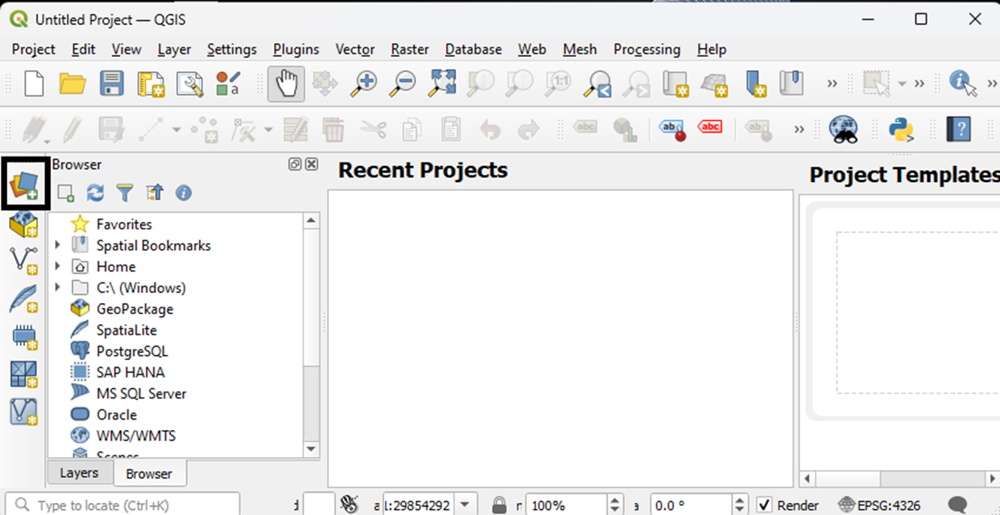
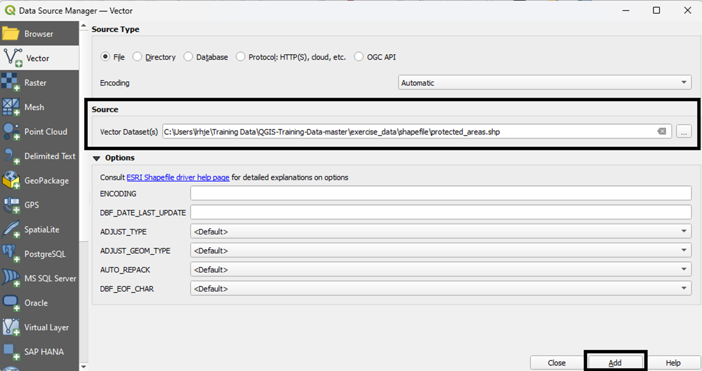
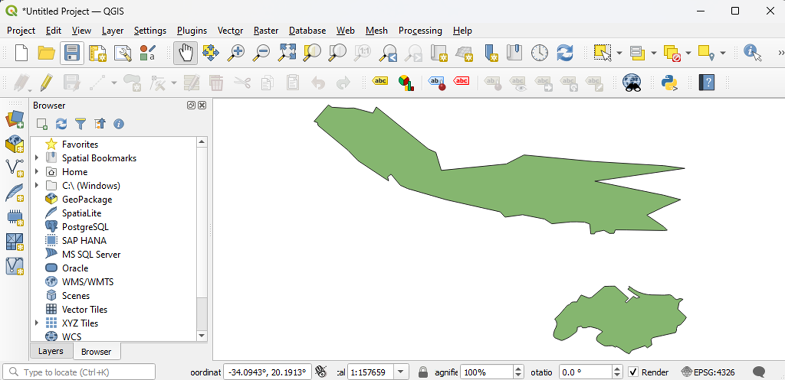
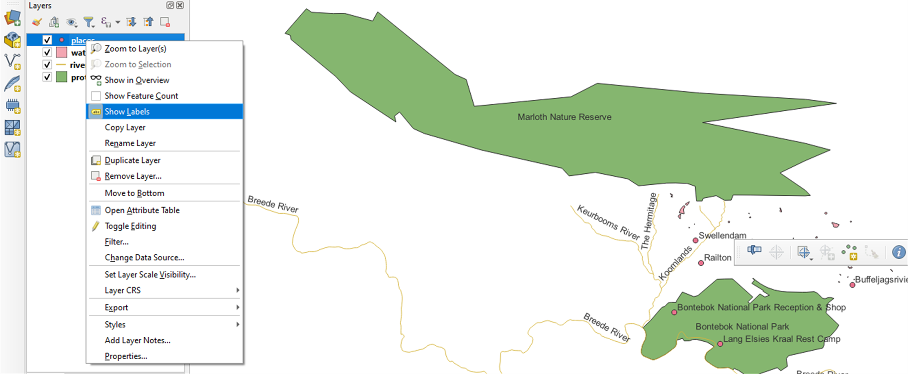
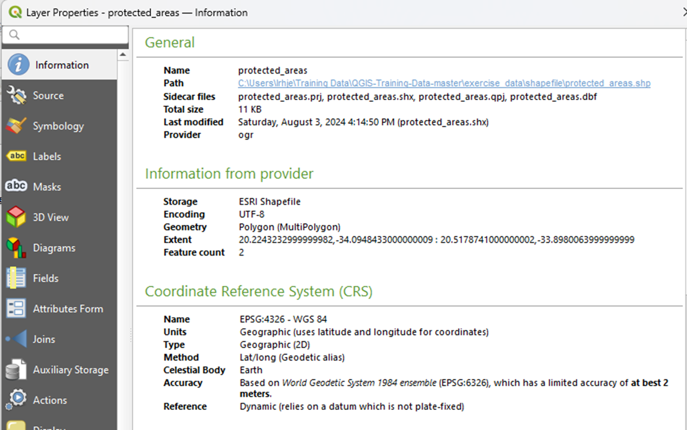
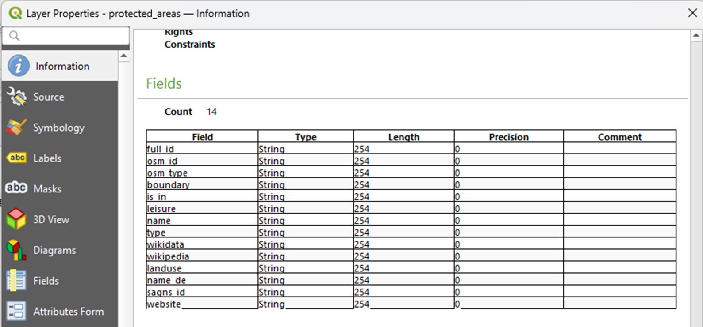
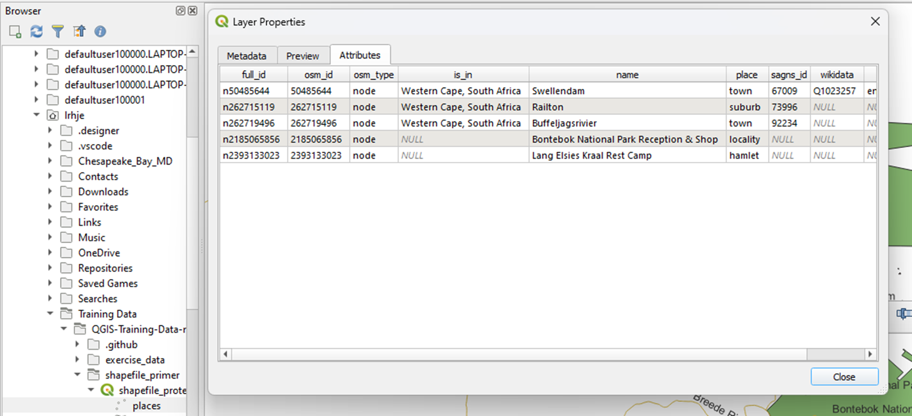
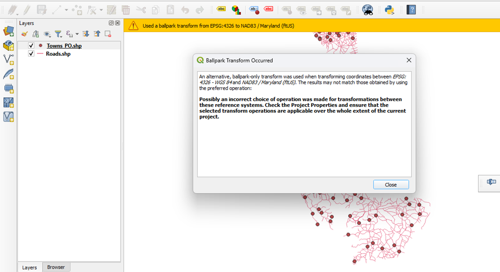

# Shapefile Curation Primer

# To-Do
- [x] Section 7 reference format references in section 1 above
- [x] Section 7 paragraph breaks before "Official Documentation", and "Software manuals"
- [x] Section 9 paragraph breaks before "Regular backups", "Comprehensive metadata", "Standardized Metadata Formats", "Regular Format Checks", "Data Conversion Tools"
- [x] Add MIME types ref. - https://www.iana.org/assignments/media-types/media-types.xhtml
- [x] Consider location of "Geospatial Data Repositories" section to just above regional repositories ...
- [x] Consider separate discussion of difference between registries, clearinghouses, and trusted repositories ...
- [x] Add section on using QGIS to inspect Shapefiles.
- [x] Check other GIS primers for data citation suggestions and add as needed.
- [x] Move GIS Shapefile repositories section under paragraph on registries, clearinghouses, and trusted repositories.
- [ ] **I'v got a question: do we want dataset or dataset?**
- [ ] Verify that dataset or dataset is spelled consistently.
- [ ] **I'v got a question: do we want title or sentence capitalization for headings?**
- [ ] Verify that heading capitalization is consistent.
- [ ] **I'v got a question: do we want to capitalize Shapefile?**
- [ ] Verify that capitalization of Shapefile or Shapefile is consistent.
- [ ] Please check Inspecting Shapefiles with QGIS. Do the steps make sense to you from the perspective of someone who works with GIS data all the time?
- [ ] **Add bibliography of resources cited in the text.**
[ ] ... additional to-do items go here

## Overview

  
  | Topic                      | Description                                   |
  | -------------------------- | ---------------------------------------------- |
  | Versions                   | Original Release: [ESRI Shapefile Technical Description (1998)](https://www.esri.com/content/dam/esrisites/sitecore-archive/Files/Pdfs/library/whitepapers/pdfs/shapefile.pdf) with subsequent extensions by [ESRI](https://www.esri.com/en-us/home) |
  | Primary fields or areas of use | Shapefiles are broadly used across many disciplines in which [non-topological vector geometries](https://www.esri.com/news/arcuser/0401/topo.html) (i.e. point, line, polygon) and attributes associated with those geometries (e.g. observation timestamp, well depth, street address, population) are stored, visualized, analyzed, and exchanged. 
  | Source and affiliation     | [ESRI](https://www.esri.com/en-us/about/about-esri/company), formerly Environmental Systems Research Institute, Inc. |        
  | Metadata standards  ([FGDC Geospatial Metadata Standards and Guidelines](https://www.fgdc.gov/metadata/geospatial-metadata-standards)) |  U.S. Federal Geographic Data Committee *Content Standard for Digital Geospatial Metadata (CSDGM)* (deprecated)  
 *International Standards Organization (ISO) 191xx series of metadata standards*  
 **Note**: ESRI's ArcGIS produces an ESRI metadata record (.xml) as part of the process of managing metadata. FGDC or ISO metadata can (and should) be explicitly generated as a complement to any proprietary metadata produced by tools such as ArcGIS. |
  | Key questions for curation review | Are all required files included?  
 What is the coordinate reference system for the data? **If there is one, ensure that the .prj file is included in the file collection and correctly matches the specified coordinate reference system - including datum**.  
 Is the data dictionary included in the appropriate and complete (ISO or FGDC) geospatial metadata document? |
  | Tools for curation review  | Desktop Geographic Information System (GIS): [QGIS](https://www.qgis.org/en/site/)  
 Desktop GIS: [ArcGIS](https://www.arcgis.com/index.html)  
 R for programmatic/automated review/testing, e.g. [`sf` package](https://cran.r-project.org/web/packages/sf/index.html)  
  Python for programming/automated review/testing, e.g. [`GeoPandas` module](https://geopandas.org/en/stable/getting_started/introduction.html) |
  | Date Created               | June 24, 2024 |
  | Created by                 | Laura Hjerpe, Karl Benedict, Wenjie Wang |
  | Date updated and summary of changes made | 2024-07-31 Peer review version completed  
 TBD edits from peer review |                
 
 ##  Description of Format

The ESRI Shapefile format was developed and released as a proprietary format for encoding and exchanging non-topological geometry and attribute data for spatial features (points, lines, polygons - AKA features) in a dataset. While released as a proprietary format, the [published documentation](https://www.esri.com/content/dam/esrisites/sitecore-archive/Files/Pdfs/library/whitepapers/pdfs/shapefile.pdf) has enabled geospatial application developers to implement support for reading and writing files in the Shapefile format, resulting in broad support and use of the Shapefile format for the exchange and use of non-topological feature data. 

Structure Documentation

* [ESRI Shapefile Technical Description (1998)](https://www.esri.com/content/dam/esrisites/sitecore-archive/Files/Pdfs/library/whitepapers/pdfs/shapefile.pdf)
* [Library of Congress Format Description](https://www.loc.gov/preservation/digital/formats/fdd/fdd000280.shtml)

Base File Structure (multiple files - originally specified to follow 8.3 naming convention). **All files must share the same name prefix and be co-located within the same file system directory/folder**.

Required files:

  - Main file (x.shp): ex. counties.shp
  - Index file (x.shx): ex. counties.shx
  - dBase file (x.dbf): ex. counties.dbf
  - Projections Definition File - **required if coordinate reference system information is to be included in file** (x.prj): ex. counties.prj

Required if present (i.e. if the files are already present ensure that they are included in the preserved/shared file package):

  - Spatial Index for read/write instances - Part 1 (x.sbn): ex. counties.sbn
  - Spatial Index for read/write instances - Part 2 (x.sbx): ex. counties.sbx
  - Geocoding index for read/write instances - required if present (x.ixs): ex. counties.ixs

Additional optional files

  - Spatial Index - Part 1 - for read-only Shapefiles (x.fbn): ex. counties.fbn
  - Spatial Index - Part 2 - for read-only Shapefiles (x.fbx): ex. counties.fbx
  - Attribute Index - Part 1 (x.ain): ex. counties.ain
  - Attribute Index - Part 2 (x.aih): ex. counties.aih
  - Geocoding Index for read/write ODB format Shapefiles (x.mxs): ex. counties.mxs
  - ArcGIS Metadata File (x.xml): ex. counties.xml
  - Character set codepage specification file (x.cpg): ex. counties.cpg
  - ArcView 3.x Attribute Index - no longer used by ArcGIS (x.atx): ex. counties.atx
   
  [MIME Types](https://www.iana.org/assignments/media-types/media-types.xhtml)   
    
  - application/octet-stream (main file)
  - application/dbf
  - application/dbase
  - application/vnd.shx
  - application/vnd.shp
  - application/vnd.dbf
  - Metadata: text/xml                  

## Complementary Roles of Geospatial Registries, Clearinghouses, and Repositories

Geospatial Data Clearinghouses and Registries are specialized platforms that are typically designed to provide data discovery, access, and use capabilities that might be considered value-added services on top of the datasets stored in those systems (in the case of Clearinghouses) or discoverable through those systems (in the case of registries). Such systems do not necessarily provide long-term digital preservation capabilities or associated persistent identifiers (such as DOIs) for the data upon which they are built - two key characteristics that commonly define trusted repositories (e.g. [USGS Fundamental Science Practices (FSP) Standards for Establishing Trusted Repositories for USGS Digital Assets](https://www.usgs.gov/office-of-science-quality-and-integrity/fundamental-science-practices-fsp-standards-establishing)) and enable effective data citation (e.g. [Data Citation Synthesis Group: Joint Declaration of Data Citation Principles](https://doi.org/10.25490/a97f-egyk)). For these reasons geospatial data clearinghouses such as those listed below may be considered high-value platforms for providing access to geospatial data, but must be separately evaluated to determine if additional digital preservation actions, such as placement in a separate trusted data repository, are needed for a specific dataset.

One example of a geospatial data registry is the US Government [Geopspatial Data Catalog](https://catalog.data.gov/dataset/?metadata_type=geospatial) which constitutes a large portion of the holdings of the broader [Data.gov](https://data.gov/) initiative. Many specialized regional and topical repositories/clearinghouses of geospatial data exist - with Shapefiles as a commonly supported data distribution format. Examples of such specialized resources include:

* The [Texas Geographic Information Office](https://tnris.org/) that provides discovery and access to a curated collection of geospatial data related to the US state of Texas.
* The [New Mexico Resource Geographic Information System](https://rgis.unm.edu/) that provides discovery and access to a curated collection of geospatial data and associated web services for the state of New Mexico. 
* [GeoPlatform](https://www.geoplatform.gov) suports discovery and registering geospatial data assets with special emphasis on 177 National Geospatial Data Assets (NGDAs) across 18 data themes as guided by the Federal Geographic Data Committee (FGDIC).
*[The Big Ten Academic Alliance Geospatial Information Network (BTAA-GIN)](https://btaa.org/library/programs-and-services/geoportal) is a collaboration of library-affiliated staff from Big Ten Academic Alliance universities. The program aims to support the geospatial research community by building and maintaining a collective open-source spatial data infrastructure featuring metadata optimized for spatial discovery platforms.  The BTAA Geoportal contains images, scanned maps, and geospatial data in Shapefile format.

## Examples of Geospatial Repositories through which Shapefiles May be Discovered and Accessed

[ScienceBase](https://www.sciencebase.gov/catalog/#)

ScienceBase is a U.S. Geological Survey (USGS) Trusted Digital Repository providing access to scientific data products and resources.

[National Historical Geographic Information System](https://www.nhgis.org/)

The National Historical Geographic Information System provides historic tabular and spatial data related to socio-economic time-series data from 1790 to present, and is part of the collection of the [Core-Trust Seal](https://coretrustseal.org/) certified [IPUMS](https://www.ipums.org/) suite of data repositories. 
  
## Shapefile Dataset Examples:

[TIGER/Line Shapefiles](https://www.census.gov/geographies/mapping-files/time-series/geo/tiger-line-file.2023.html#list-tab-790442341)

The TIGER/Line Shapefiles are extracts of selected geographic and cartographic information from the Census Bureau's Master Address File (MAF)/Topologically Integrated Geographic Encoding and Referencing (TIGER) system. The Shapefiles include information for the fifty states, the District of Columbia, Puerto Rico, and the Island  areas (American Samoa, the Commonwealth of the Northern Mariana Islands, Guam, and the United States Virgin Islands). The Shapefiles include polygon boundaries of geographic areas and features, linear features including roads and hydrography, and point features.

[Geospatial Dataset of Roads and Settlement Features for the Chesapeake Bay Eastern Shore Region of Maryland, USA, 1865](https://doi.org/10.7910/DVN/KPILKU)

This dataset contains geospatial (GIS) data files that capture historical roads and points of interest for the Chesapeake Bay Eastern Shore region of Maryland, as derived from Simon J. Martenet's Map of Maryland: Atlas Edition (1866). Maryland counties covered include present-day Cecil, Caroline, Dorchester, Kent, Queen Anne’s, Somerset, Talbot, Wicomico, and Worcester counties. Geospatial data layers include roads, landings, ferries, churches, shops, mills, schools, hotels, towns with post offices, and towns with court houses. These data can be used to support historical geographic, economic, social, and cultural analyses.

Note:The README file includes additional details about data sources, digital map creation methods, and spatial reference information. 

[Twin Cities Land Use Map from the Twin Cities Metropolitan Planning Commission (1958)](https://geo.btaa.org/catalog/b98a7b39-830a-48ca-84c2-06332aaebbb8#metadata)

High-quality GIS land use maps for the Twin Cities Metropolitan Area for 1958 that were developed from paper maps (no GIS version existed previously). The GIS Shapefiles were exported using ArcGIS Quick Import Tool from the Data Interoperability Toolbox. The coverage files were imported into a file geodatabase then exported to a .shp file for long-term use without proprietary software. An example output of the final GIS file is include as a pdf, in addition, a scan of the original 1958 map (held in the UMN Borchert Map Library) is included as a pdf. Metadata was extracted as an xml file. Finally, all associated coverage files and original map scans were zipped into one file for download and reuse.

## Sample Dataset Citations

Seven typical elements included in data citations are Author, Publication, Year, Title of the data, Publisher, Digital Object Identifier (DOI), and Access Date and Time. If relevant, you may add other elements, such as query parameters, direct access link, data format, 3rd party producer, editor or contributor, publication place, and data within a larger work. Source: [USGS Data Citation](https://www.usgs.gov/data-management/data-citation#elements). Below are several examples of dataset citations according to APA and Chicago style guides and suggested data citations provided by data repositories or clearinghouses.

APA style:

United States Census Bureau, 2023. 2023 TIGER/Line Shapefiles: States (and equivalent) (machine readable data files). U.S. Department of Commerce. [https://www.census.gov/cgi-bin/geo/shapefiles/index.php](https://www.census.gov/cgi-bin/geo/shapefiles/index.php), (Accessed 2 June 2024)

Chicago style:

U.S. Department of Commerce. United States Census Bureau. TIGER/Line Shapefiles: States (and equivalent) (machine readable data files), 2023. Distributed by the U.S.Census Bureau.  [https://www.census.gov/cgi-bin/geo/shapefiles/index.php](https://www.census.gov/cgi-bin/geo/shapefiles/index.php).

Harvard Dataverse suggested citation:

Mennis, Jeremy; Yuen, Kai, 2023, "Geospatial Dataset of Roads and Settlement Features for the Chesapeake Bay Eastern Shore Region of Maryland, USA, 1865", [https://doi.org/10.7910/DVN/KPILKU](https://doi.org/10.7910/DVN/KPILKU), Harvard Dataverse, V1 (Accessed 9 June 2024)

BTAA-GIN suggested citation:

Chen, Wei, Levinson, David M. (2013). Twin Cities Land Use Map from the Twin Cities Metropolitan Planning Commission (1958). University of Minnesota. [http://dx.doi.org/10.13020/D6059J](http://dx.doi.org/10.13020/D6059J) (dataset) (Accessed 9 June 2024)

USGS ScienceBase suggested citation:

Seymour, W. A., and Traum, J. A., 2021, Petaluma Model GIS Data: U.S. Geological Survey data release, [https://doi.org/10.5066/P9IQDHIT](https://doi.org/10.5066/P9IQDHIT), (Accessed 9 June 2024).

##  Key questions to ask yourself

*Are there any Shapefiles missing from the zipfile?* At minimum, there should be three Shapefiles:.shp, .shx, and .dbf.

*Do all Shapefiles have the same prefix (e.g., ferries.shp, ferries.shx, and ferries.dbf)?*

*Are there obvious georeference errors such as animals, plants, buildings, or parks mapped to the wrong country or hemisphere?* This could be caused by missing projection coordinate metadata, which are contained in the .prj Shapefile.

*Are there polygons with misaligned edges, appearing as overlapping areas or gaps between polygons representing adjacent areas, such as lots, neigborhoods, cities or counties?* This is a particular concern with Shapefiles because they do not contain topological information (spatial relationships), such as shared edges and direction.

*Did the researcher include data reuse limitations in the metadata or documentation?*  Example: "The boundary information in the TIGER/Line Shapefiles is for statistical data collection and tabulation purposes only. Their depiction and designation for statistical purposes does not constitute a determination of jurisdictional authority or rights of ownership or entitlement and are not legal land descriptions." [TIGER/Line Shapefile Legal Disclaimers](https://www2.census.gov/geo/pdfs/maps-data/data/tiger/tgrshp2023/TGRSHP2023_TechDoc_Ch1.pdf).

## Commonly Used Coordinate Systems and Projections by Region

**This section separates "Key questions to ask yourself" from "Key clarifications to get from user."  Should we instead put this immediately after "Key clarifications to get from researcher"?**

A coordinate system is a framework used to define the positions of points in space. In geographic information systems (GIS), coordinate systems are essential for accurately mapping and analyzing spatial data. There are two primary types of coordinate systems: geographic and projected.

Geographic coordinate systems use a three-dimensional spherical surface to define locations on the Earth. They are based on latitude and longitude, with a datum providing the reference model for the Earth's shape. The most common datum used globally is the WGS84.

Projected coordinate systems, on the other hand, represent the curved surface of the Earth on a flat plane. This involves mathematical transformations known as map projections, which convert the spherical coordinates into two-dimensional Cartesian coordinates (x, y). Different projections are used based on the needs of the map, such as minimizing distortion in area, shape, distance, or direction. Examples include the Universal Transverse Mercator (UTM) and Albers Equal-Area projections. The choice of coordinate system and projection is crucial for accurately representing spatial data and ensuring consistency across different datasets.

Here are some commonly used coordinate systems and map projections in different regions:
Global:

1.	WGS84 (World Geodetic System 1984): A global geographic coordinate system used for GPS and most international mapping.
2.	UTM (Universal Transverse Mercator): A global projected coordinate system that divides the world into a series of 6-degree longitudinal zones, each with its own projection.

North America:

1.	NAD83 (North American Datum 1983): A geographic coordinate system commonly used in North America.
2.	NAD27 (North American Datum 1927): An older geographic coordinate system, still used for some historical data.
3.	State Plane Coordinate System (SPCS): A set of projected coordinate systems used in the United States, each state having one or more zones tailored to minimize distortion.

Europe

1.	ETRS89 (European Terrestrial Reference System 1989): The standard coordinate system for Europe.
2.	British National Grid (OSGB36): A projected coordinate system used in Great Britain.

Australia

1.	GDA94 (Geocentric Datum of Australia 1994): A geographic coordinate system widely used in Australia.
2.	MGA (Map Grid of Australia): A projected coordinate system based on UTM, using the GDA94 datum.

Asia

1.	Tokyo Datum: A geographic coordinate system used historically in Japan.
2.	China Geodetic Coordinate System 2000 (CGCS2000): The modern geographic coordinate system for China.

South America

1.	SIRGAS (Geocentric Reference System for the Americas): A continental system used across South America, similar to WGS84.

Africa

1.	Cape Datum: An older geographic coordinate system used in South Africa.
2.	Hartebeesthoek94 (Hartebeesthoek Radio Astronomy Observatory 1994): The current standard geographic coordinate system for South Africa.

Middle East

1.	Ain el Abd 1970: A geographic coordinate system used in several Middle Eastern countries.

## Key clarifications to get from researcher

**Was the data transferred from a geodatabase to a Shapefile format?**  
If so, there could be significant data loss since Shapefiles do not support advanced features, such as time values in the date field, null values, location subtypes (e.g, arterial streets, local streets), field type attribute rules (e.g, coded values, limited number ranges), linkages with additional tabular data within the geodatabase, and topology, as mentioned in Key questions to ask yourself. In addition, the overall file size is limited to 2 gigabytes. See [Geoprocessing Considerations for Shapefile Output](https://desktop.arcgis.com/en/arcmap/latest/manage-data/shapefiles/geoprocessing-considerations-for-shapefile-output.htm)

**Where does the raw data come from, and how does it end up in this form?** 
Data digitized from georeferenced images should cite the underlying georeferenced source. In addition, the software and hardware used to produce and/or work with this data should be described. See [Preserving Geospatial Data](http://doi.org/10.7207/twr23-01), page 5. If ArcGIS or other software was used, the version should be indicated. 
For examples of descriptions of lineage and tools used to create the Shapefiles, see [Shapefile Dataset Examples](#shapefile-dataset-examples).

**What aspects of the visualization are important (e.g., scale, boundary lines, natural or artificial physical features, resolution, color)?**

**What dates do the non-geospatial data cover (e.g., land use designations, railroad stations)? Is this data supposed to be historical or current?**

**What dates do the geospatial data cover (e.g, cities, states, countries)? Is this data supposed to be historical or current?**

**What kind of documentation or metadata about your data, datasets, or files has been created?**

## Applicable metadata standard, core elements and readme requirements

The [ISO 19115](https://committee.iso.org/sites/tc211/home/projects/projects---complete-list/iso-19115-1.html) base standard and related family of standards - numbered 191** in the ISO/TC 211 *Geographic information/Geomatics* "Geographic Information" standards collection - are the currently defined standards-based metadata recommended for geospatial data, including Shapefiles. The specific required and optional elements of the ISO standard depend upon data type and characteristics and as a result a "minimal" metadata record (i.e. a metadata record that would meet structural requirements when evaluated using an XML schema) can be created that is only minimally useful, but could be substantially improved through the use of additional metadata elements within the 19115 standard that are optional (see [T. Habermann, 2020](https://metadatagamechangers.com/blog/2020/12/23/minimum-metadata) for a discussion of the minimal value of minimal metadata). Because of this, a number of guidance documents have been developed to aid in the development of ISO 19115 compliant metadata that also meet dataset and use case specific requirements for discovery, access, understanding, and use - with formalized requirements being referred to as application profiles (e.g. the [FGDC North American Profile of ISO19115:2003 - Geographic Information - Metadata (2007)](https://www.fgdc.gov/standards/projects/incits-l1-standards-projects/NAP-Metadata/napMetadataProfileV11_7-26-07.pdf)) and profiles listed in the [RDA Metadata Standards Catalog](https://rdamsc.bath.ac.uk/msc/m22)). Examples of these guidelines documents include:

* [USGS Metadata Creation Web Page](https://www.usgs.gov/data-management/metadata-creation)
* [NOAA Metadata Creation Reference Web Page](https://www.ncei.noaa.gov/resources/metadata/create)
* [ESRI ISO Metadata Creation Instructions](https://pro.arcgis.com/en/pro-app/latest/help/metadata/create-iso-19115-and-iso-19139-metadata.htm)
* [FGDC Technical Guidance: Data.gov and the GeoPlatform Metadata Recommendations: Including Guidelines for National Geospatial Data Assets (NGDA)](https://www.fgdc.gov/technical-guidance/metadata/fgdc-technical-guidance-datagov-geoplatform-ngda.pdf)
* [ICSM ISO19115-1 Metadata Good Practice Guide](https://www.icsm.gov.au/sites/default/files/5a-Good%20Practice%20document.pdf)

The RDA ISO 19115 [RDA Metadata Standards Catalog](https://rdamsc.bath.ac.uk/msc/m22) contains a valuable list of references related to the standard itself, related standards and profiles, tools for creating ISO metadata, and users of the standard that can be visited to view examples of their application of the standard.

Key metadata elements that should be included in what could be considered a "complete" geospatial data metadata record include the following common elements (from [Hatfield Consultants (2020). *Canadian Geospatial Data Infrastructure Cookbook*, Canadian Geospatial DAta Infrastructure Information Product 59e: Section 4.1, pp. 38-42](https://publications.gc.ca/collections/collection_2021/rncan-nrcan/M124-10-1-2020-eng.pdf)):

> Identification information: information that allows the geospatial dataset to be uniquely identified
and distinguished from other datasets (e.g., name of the dataset, keywords, basic description and
geographic extents) and assists in cataloging the geospatial dataset.
> * *Data quality information*: information that could include completeness of the dataset, processes used to create and maintain it, and the amount of validation or verification performed on the dataset.
> * *Spatial data representation information*: information that could include precision and accuracy of vector geometry or the resolution of raster data.
> * *Non-spatial (attribute or tabular) data information*: information about the attribute data associated with features in geospatial data in vector format, or attribute data associated with cells of geospatial data in raster format. This could include the meaning of attribute names, valid values, domain or range for attribute values, and method used to collect and update attribute values.
> * *Distribution information*: information that can be used to govern the distribution of the geospatial dataset, including the identity of the organization creating and maintaining the dataset, and date the dataset was published or made available to the public.

If the Shapefiles will be placed into a repository that does not directly support the ISO 19115-1 family of standards, but does support the commonly used (for data-related DOI provisioning) DataCite metadata standard, elements of the ISO metadata can be integrated into the DataCite metadata, with the additional inclusion of "HasMetadata", "relatedMetadataSchema", and  "DocumentedBy" DataCite metadata elements that reference the full ISO metadata record and other documentation as well. This approach is consistent with Habermann's (2020) recommendation from the [Minimum Metadata blog post](https://metadatagamechangers.com/blog/2020/12/23/minimum-metadata) referenced above: 

> First, the “HasMetadata” relationType, along with the relatedMetadataSchema, makes it possible to connect to more detailed metadata from a DataCite record and to let the user know the dialect of those metadata. If, for example, an organization has complete metadata compliant with ISO 19115-1, that metadata can include data quality, user feedback, instrumentation, and lineage metadata not included in DataCite metadata. Letting the user now that those metadata exist can help them understand these important aspects of the data.  Second, the “DocumentedBy” relationType makes it possible to connect to documentation of the resource, typically documents rather than structured metadata. This could point to published reports or papers that contain important details about how the data were processed or why the data were collected. This information is helpful when trying to understand the data and decide if it is trustworthy.

## Resources for reviewing data

In the process of working with Shapefile data, it's crucial to have access to reliable resources for reviewing and understanding the intricacies of the data, such as the materials referenced above relating the format description. **Here's a session dedicated to exploring various resources \[is there a reference/link missing here?- kb\]** that can aid in the comprehensive review of Shapefile data:

*Official Documentation:* Start with the official documentation provided by the organization or platform that created or maintains the Shapefile format. This documentation often includes detailed specifications, data structure explanations, and usage guidelines.

*Software Manuals:* If you're using specific GIS software to work with Shapefiles, refer to its manuals. These manuals usually offer insights into how the software handles Shapefiles, data manipulation techniques, and troubleshooting tips.

## Software for viewing or analyzing data

Shapefiles can be read, visualized, and analyzed in a wide variety of applications including (a short list of many):

  * Desktop Geographic Information System (GIS):
    * Open Source: [QGIS](https://www.qgis.org/en/site/), [GRASS GIS](https://grass.osgeo.org/), [uDig](http://udig.refractions.net/)
    * Commercial: [ArcGIS](https://www.arcgis.com/index.html)
  * Programming Languages:
    * R: e.g. [`sf` package](https://cran.r-project.org/web/packages/sf/index.html) 
    * Python: [`GeoPandas` module](https://geopandas.org/en/stable/getting_started/introduction.html)
  * Online mapping applications: 
    * Commercial: [ArcGIS Online](https://www.arcgis.com/index.html)
    * Open Source: [GeoServer](https://geoserver.org/), [MapServer](https://mapserver.org/)

### Inspecting Shapefiles with QGIS

QGIS is a free tool that can be used to inspect Shapefiles. Download QGIS from the download page at https://qgis.org/download/ and follow the installation prompts. 

1. After opening QGIS, you will see a window with two panels(tabs) labelled as Layers and Browser and a blank Recent Projects window, where your map will be displayed. Select Data Source Manager, the top button on the side toolbar, to add Shapefile layers that can be viewed on the Recent Projects window.

2. In the Data Source Manager – Vector window, select a Shapefile. The Shapefile called protected_area.shp has been selected as an example. Choose **Add** to add the Shapefile layer and **Close** to get back to the main menu.

3. The protected areas Shapefile layer is shown in the main menu. Add more layers by selecting the Data Source Manager toolbar button again.

3. Places, water, and river layers have been added. Right click on a layer in the Layers panel to select the Show Labels option to make place, river and protected area names visible.  You can use this view to check for misaligned edges, georeference errors, and complete or accurate names.  To focus on a specific layer, uncheck the other layers.

4. Access the Layer Properties menu by selecting Properties from the right click menu on the Layer. The Information tab is selected for the protected areas layer. Note the Coordinate Reference System information.

5. Scroll down to see Fields on the Properties Information tab.

6. From the Browser panel, navigate to your Project folder (Shapefile_protected_areas). Right click on a layer, such as places and select Properties.  On the Attribute tab, you can see Attribute names and values, which can be compared against a data dictionary or codebook to make sure all variables are defined.

This warning message appeared after adding a Shapefile for towns with post offices.  This message is warning the user that there was a transformation of coordinates between EPSG:4326 - WGS 84 and NAD83/Maryland (ftUS) and that properties should be checked to make sure that this transformation is applicable to the whole extent of the project. 

The warning message screenshot was created from [Geospatial Dataset of Roads and Settlement Features for the Chesapeake Bay Eastern Shore Region of Maryland, USA, 1865](https://doi.org/10.7910/DVN/KPILKU). As noted in the README file, all Shapefiles are in North American Datum (NAD) 1983 Maryland State Plane.

See the [QGIS Training Manual](https://docs.qgis.org/3.34/en/docs/training_manual/) and [QGIS Documentation](https://docs.qgis.org/3.34/en/docs/index.html#) for more guidance and information. Shapefiles from the exercise folder of the [Training Data Repostory](https://github.com/qgis/QGIS-Training-Data/archive/master.zip) were used to create the map examples used for the screenshots. 

## Preservation actions

Preservation actions are crucial for ensuring the longevity, integrity, and accessibility of Shapefile data. Here's a set of preservation actions that can help safeguard Shapefile data for future use:

*Regular Backups:* Establish a routine schedule for backing up Shapefile data to secure storage locations, such as external hard drives, cloud storage services, or network servers.

*Comprehensive Metadata:* Create and maintain comprehensive metadata records for Shapefile datasets, including information about data source, creation date, projection, attribute definitions, and data quality.

*Standardized Metadata Formats:* Adhere to standardized metadata formats, such as FGDC (Federal Geographic Data Committee) or ISO (International Organization for Standardization), to ensure consistency and interoperability.

*Regular Format Checks:* Periodically assess the compatibility of Shapefile data with current and emerging GIS software and standards. Consider migrating data to more sustainable formats, such as GeoPackage or Esri File Geodatabase, if necessary.

*Data Conversion Tools:* Use data conversion tools and utilities to facilitate the migration of Shapefile data between different file formats while preserving spatial and attribute information.

## What to look for to make sure this file meets FAIR principles

Ensuring that Shapefile data adheres to the FAIR principles (Findable, Accessible, Interoperable, and Reusable) is essential for maximizing its value and impact within the GIS (Geographic Information Systems) community. Here's a session dedicated to outlining key considerations for evaluating Shapefile data to ensure compliance with FAIR principles:

### Findable

*Descriptive Metadata:* Assess whether the Shapefile data is accompanied by comprehensive metadata that provides detailed descriptions of its content, purpose, spatial extent, attributes, and provenance. 

*Persistent Identifiers:* Verify the presence of persistent identifiers, such as DOIs (Digital Object Identifiers) or URLs, that uniquely identify the Shapefile dataset and facilitate its discovery and citation in data repositories.

### Accessible

*Open Access Policies:* Ensure that Shapefile data is made openly accessible to users without unnecessary restrictions or barriers, adhering to open access policies and licensing agreements.

*Data Repositories:* Check if the Shapefile dataset is deposited in trusted data repositories or archives that provide reliable access mechanisms, such as download links, APIs (Application Programming Interfaces), or web services.

### Interoperable

*Standardized Formats:* Evaluate whether the Shapefile data is stored in standardized formats that are widely supported and interoperable with various GIS software and systems, such as ESRI Shapefile or GeoPackage.

*Coordinate Reference Systems (CRS):* Verify that the Shapefile data is georeferenced using standard coordinate reference systems and projections, enabling seamless integration with other spatial datasets.

### Reusable

*Licensing Information:* Review the licensing terms associated with the Shapefile data to determine the permissions and conditions for its reuse, redistribution, and modification by users.

*Data Quality Assurance:* Assess the quality and reliability of the Shapefile data by examining metadata completeness, spatial accuracy, attribute consistency, and adherence to relevant standards.

### Additional Considerations

*Versioning and Provenance:* Look for versioning information and provenance records that document the history of changes, updates, and transformations applied to the Shapefile dataset over time.

*Data Documentation:* Ensure that the Shapefile data is accompanied by comprehensive documentation, including data dictionaries, field descriptions, processing methodologies, and data transformation records.

### Tools and Resources

*FAIR Assessment Tools:* Explore FAIR assessment tools and frameworks, such as FAIRshake or FAIR Metrics, that provide structured methodologies for evaluating the compliance of Shapefile data with FAIR principles.

*Community Guidelines:* Refer to community guidelines, best practices, and case studies developed by the GIS community to promote FAIR data sharing and stewardship in the context of spatial data.

## Ways in which fields may use this format

The Shapefile format is widely used across various fields due to its versatility, compatibility, and support for spatial data representation. Here's a session exploring the diverse ways in which fields may utilize the Shapefile format:

### Geographic Information Systems (GIS):
*Spatial Analysis:* Shapefiles are fundamental to GIS applications, enabling spatial analysis tasks such as proximity analysis, spatial interpolation, and overlay operations.

*Mapping and Visualization:* GIS professionals use Shapefiles to create maps, visualize spatial patterns, and communicate geographic information effectively to stakeholders.

### Environmental Science and Natural Resource Management:

*Habitat Mapping:* Shapefiles are utilized for habitat mapping, species distribution modeling, and biodiversity assessment in environmental science research.

*Resource Management:* Natural resource management agencies use Shapefiles to delineate land use zones, manage protected areas, and monitor environmental change over time.

### Urban Planning and Transportation:

*Urban Development:* Shapefiles are employed in urban planning to analyze land use patterns, assess infrastructure needs, and support urban growth management.

*Transportation Planning:* Transportation agencies utilize Shapefiles for route planning, traffic analysis, and infrastructure development in urban and regional contexts.

### Public Health and Epidemiology:

*Disease Mapping:* Shapefiles are used for disease mapping, spatial epidemiology, and outbreak analysis to identify geographic patterns and hotspots of disease transmission.

*Healthcare Access:* Public health researchers leverage Shapefiles to assess healthcare access, service availability, and disparities in healthcare provision across geographic areas.

### Agriculture and Rural Development:

*Precision Agriculture:* Shapefiles support precision agriculture techniques, including crop yield mapping, soil fertility analysis, and variable rate application of inputs.

*Rural Planning:* Agricultural extension services utilize Shapefiles to plan rural development projects, assess land suitability for farming, and manage agricultural land parcels.

### Archaeology and Cultural Heritage Management:

*Site Documentation:* Archaeologists use Shapefiles for site documentation, cultural resource management, and spatial analysis of archaeological sites and artifacts.

*Heritage Preservation:* Cultural heritage agencies employ Shapefiles to inventory, document, and preserve historic sites, monuments, and cultural landscapes.

### Disaster Management and Emergency Response:

*Risk Assessment:* Shapefiles support disaster risk assessment, hazard mapping, and vulnerability analysis to mitigate the impacts of natural disasters and climate-related events.

*Emergency Planning:* Emergency management agencies use Shapefiles for emergency planning, evacuation route mapping, and resource allocation during disaster response operations.

## Unresolved Issues/Further Questions 

### Long-Term Preservation and Accessibility

*Issue:* Ensuring the long-term preservation and accessibility of Shapefile data poses challenges related to format obsolescence, data migration, and evolving technological landscapes.

*Further Questions:* What strategies and best practices can be implemented to safeguard Shapefile data against format obsolescence and ensure its accessibility and usability for future generations? How can advancements in data preservation technologies and standards be leveraged to address these challenges?

### Tracking Provenance of Data Creation

*Issue:* Maintaining a comprehensive record of data creation processes, including data collection methodologies, transformation steps, and quality control measures, remains a challenge.

*Further Questions:* How can we implement standardized frameworks for tracking the provenance of Shapefile data creation across different organizations and projects? What tools and technologies can facilitate the capture and documentation of data lineage information?

### Level of Detail in Dataset

*Issue:* Determining the appropriate level of detail for Shapefile datasets can be subjective and context-dependent, leading to variations in dataset granularity and usability.

*Further Questions:* How can we establish guidelines or standards for defining the level of detail in Shapefile datasets based on specific applications and user requirements? What methods can be employed to balance data granularity with storage and processing considerations?

## Documentation of curation process: What to capture from curation process

## Warnings

* Shapefiles are composed of multiple files (see *Description of Format* above), some of which are **required, required if present\[Should this be required and required if present? LH\]** in the collection of files generated by a specific process or tool, or optional. If all *required* files are not included in the full set of files preserved/shared, the Shapefile may be missing critical content and potentially damaged beyond use. Shapefiles are often shared/distributed as Zip archives to reduce the liklihood of individual Shapefile file components becoming separatd from the file collection that makes up a Shapefile. 
* While the attribute data for a Shapefile is stored in a DBF file (a common tabular data format supported by many databases and potentially editable in those and other tools) opening and modifying the attribute file (ending in ".dbf") can break the linkages between the rows in the attribute table and the corresponding features stored in other parts of the Shapefile. **Do not** edit the the attribute table DBF file outside of a tool that is specifically designed to work with Shapefiles as a whole. 

## Appendix A - filetype CURATED checklist

**Do we want to remove Appendix A?**
----------------
Suggested Citation: Battista, Andrew; Brittnacher, Tom; Garrett, Zenobie; Moore, Jennifer; Pirmann, Carrie. (2019). GeoDatabase Data Curation Primer. [Data Curation Network GitHub Repository](https://github.com/DataCurationNetwork/data-primers.)

*This work was created as part of the Data Curation Network ...*
