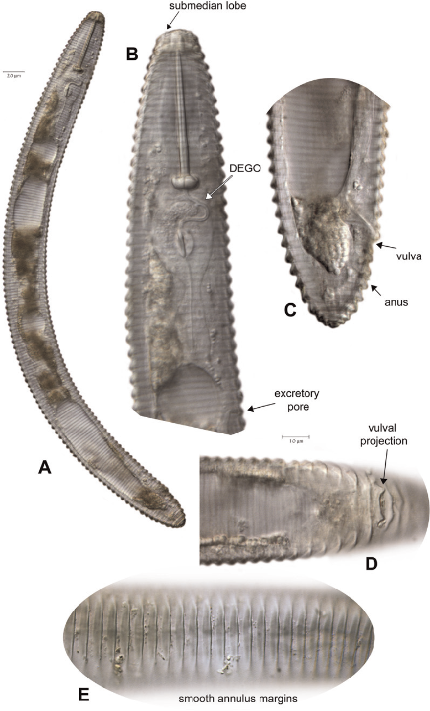

# Simple Darwin Core for Non-Biologists Primer

Authors: Megan N. O'Donnell and Leslie M. Delserone

DCN Mentor: Jake Carlson

## Overview

|   Topic   |   Description   |
| :------------- | :------------- |
| File Extension | Most commonly seen as .txt or .csv |
| Structure | Most commonly tabular for digital data |
| Versions | [Last GitHub Release: 2021-07-15](https://github.com/tdwg/dwc/releases)   [https://doi.org/10.5281/zenodo.5251698](https://doi.org/10.5281/zenodo.5251698) |
| Primary fields or areas of use | Data, images, or objects in the biological sciences, biodiversity informatics, ecology, evolutionary biology, natural history, etc. |
| Source and affiliation | Biodiversity Information Standards (TDWG) |
| Metadata standards | Darwin Core: [https://www.tdwg.org/standards/dwc/](https://www.tdwg.org/standards/dwc/) |
| Key questions for curation review | <li>Will Darwin Core add value to the data?</li><li>Will application of the metadata make the data easier to use and integrate with other data?</li><li>Are these data that can be described by Darwin Core?</li><li>Do the data describe biological occurrences of wildlife or describe natural history specimens?</li><li>What fields need to be included to make the data understandable and complete enough to be of use to other researchers?</li><li>What fields need to be included to make the data compatible with other data or databases (see Appendix B)?</li><li>If needed, is there a readme file, DublinCore record, or other form of documentation providing the provenance (i.e., history and context) of the data?</li><li>Is there additional digital or physical evidence (e.g., lab notebooks, labels, photographs, specimens, etc.) that validates the occurrence data?</li><li>Can this evidence be linked to the Darwin Core occurrences with identifiers?</li>|
| Tools for curation review | <li>Visual inspection, comparison with requirements of repository or datasets to be combined</li><li>[Darwin Core Archive Assistant Add-on](https://workspace.google.com/marketplace/app/darwin_core_archive_assistant/567341081140)</li><li>[GBIF Data Validation Tool](https://www.gbif.org/tools/data-validator/about)</li><li>[Simple DarwinCore Cheat sheet](https://bit.ly/simpleDWC-cheatsheet)</li>
| Date Created | 2022-09-01 |
| Created by | M. N. O’Donnell and L. M. Delserone   DCN Mentor - Jake Carlson|
| Date updated and summary of changes made | 2023-04. DCN reviewers’ revisions incorporated |

**Suggested Citation:** O’Donell, Megan N. and Delserone, Leslie M. (2023). Simple Darwin Core for Non-Biologists Primer. Data Curation Network[GitHub Repository](https://github.com/DataCurationNetwork/data-primers).

[Introduction](#introduction)

> [DwC Communities](#dwc-communities)

[Description of Simple DwC](#description-of-simple-dwc)

> [Example use cases highlighting the differences among selected Simple DwC fields](#example-use-cases-highlighting-the-differences-among-selected-simple-dwc-fields)  
> [Examples of Simple DwC records](#examples-of-simple-dwc-records)  
> [Notes on DwC usage](#notes-on-dwc-usage)

[Key Questions to Ask Yourself](#key-questions-to-ask-yourself)

[Key Clarifications to Get from the Researcher](#key-clarifications-to-get-from-the-researcher)

[Metadata Standard and Core Elements](#metadata-standard-and-core-elements)

> [Simple DwC cheat sheet](#simple-dwc-cheat-sheet)  
> [2023-24 cheat sheet release notes](#cheat-sheet-release-notes)  
> [Using the cheat sheet](#using-the-cheat-sheet) 

[Tips and Tricks for Simple DwC](#tips-and-tricks-for-simple-dwc)

> [Identifiers](#identifiers)  
> [Multiple values (lists)](#multiple-values-lists)  
> [Relationships](#relationships)

[Resources for Reviewing Data](#resources-for-reviewing-data)

[Software for Viewing or Analyzing Data](#software-for-viewing-or-analyzing-data)

[Preservation Actions](#preservation-actions)

> [Key questions and actions](#key-questions-and-actions)

[Ways in Which Research Fields May Use This Format](#ways-in-which-research-fields-may-use-this-format)

> [Sharing records](#sharing-records)  
> [Natural history collections](#natural-history-collections)  
> [Archival records](#archival-records)

[Unresolved Issues](#unresolved-issues)

[Notes for Curation Process](#notes-for-curation-process)

> [Appendix A - filetype CURATE(D) checklist](#appendix-a---filetype-curated-checklist)  
> [Appendix B - Examples of common biodiversity repositories](#appendix-b---examples-of-common-biodiversity-repositories)

[References](#references)

[Additional Resources](#additional-resources)

> [Acknowledgements](#acknowledgements)

[Example 1 - Application of Simple DwC to a Photomicrograph of a Nematode (Single Occurrence, Single Record)](#example-1---application-of-simple-dwc-to-a-photomicrograph-of-a-nematode-single-occurrence-single-record)

[Example 2 - Iowa Lakeside Laboratory Avian Collection - Simple DwC Records](#example-2---iowa-lakeside-laboratory-avian-collection---simple-dwc-records)

# Introduction

Biodiversity researchers are interested in the associations between life forms and their environments. Their research data can be digital and/or physical in nature. Digital data formats are numerous, but some of the most frequently used formats include tabular data (.txt, .csv) and images (.jpeg, .png, .tiff), while physical collections range from large to microscopic organisms. These data document a life form’s unique relationship in space and time with its environment, and provide a record of and insights into climate change, other environmental challenges, and the loss of species (Wieczorek et al., 2012).

In the late 1990s, the community of biodiversity researchers initiated
the development of the Darwin Core (DwC) metadata standard in order to
better describe and share data and objects. It expands upon older
methods and standards of recording and reporting organismal data
captured in researchers’ paper field notebooks, in the literature, on
labels attached to specimens in museum collections, and by citizen
scientists. After a decade of work by the Taxonomic Databases Working
Group (TDWG), the standard was approved in 2009 (Wieczorek et al.,
2012). Darwin Core has continued to mature and develop, and continues to
add resources and new parts to the standard including:

- a core list of terms([http://rs.tdwg.org/dwc/doc/list/](http://rs.tdwg.org/dwc/doc/list/)), and

- an XML implementation([http://rs.tdwg.org/dwc/terms/guides/xml/](https://dwc.tdwg.org/xml/)),

- incorporation into the Resource Description Format (RDF;[http://rs.tdwg.org/dwc/terms/guides/rdf/](http://rs.tdwg.org/dwc/terms/guides/rdf/)), and

- several controlled vocabularies (see [https://www.tdwg.org/standards/dwc/](https://www.tdwg.org/standards/dwc/)).

This primer focuses on Simple DwC
([http://rs.tdwg.org/dwc/terms/simple/](http://rs.tdwg.org/dwc/terms/simple/)),
a “mechanism used to share biodiversity information using the simplest
methods and structure” (Darwin Core Task Group, 2014). With Simple DwC,
the DwC schema is applied to a single flat file (i.e., table or
spreadsheet). Because it is a self-contained data set that can be
opened, edited, and analyzed using a wide variety of software, Simple
DwC is easier to implement than other forms of DwC that use XML, RDF, or
relational databases. The introduction to the Simple DwC documentation
states, “Simple Darwin Core is a predefined subset of the terms that
have common use across a wide variety of biodiversity applications. The
terms used in Simple Darwin Core are those that are found at the
cross-section of taxonomic names, places, and events that document
biological occurrences on the planet. The two driving principles are
simplicity and flexibility” (Darwin Core Maintenance Group, 2021). The
primer’s goal is to assist a curator presented with a data set
structured in Simple DwC, or to assist a curator in a decision to apply
the standard to a data set.

## DwC Communities

As previously mentioned, DwC developed within the biodiversity research
community. Researchers who might use Simple DwC, or generate relevant
data to which the standard may be applied, are biologists,
bioinformatics scientists, ecologists, evolutionary biologists, natural
historians, and citizen scientists. Darwin Core also is incorporated
into software[^1] used by natural history museums and herbaria to
inventory and describe the specimens they house.

# Description of Simple DwC 

Simple DwC
([http://rs.tdwg.org/dwc/terms/simple/2021-07-15](http://rs.tdwg.org/dwc/terms/simple/2021-07-15))
has a simple structure of *records* and *fields* (think *rows* and
*columns*) arranged in a matrix and usually saved as a spreadsheet. It
is important to understand that a single record (i.e., a row) documents
a *single occurrence*[^2]*,* and a collection of records (i.e., the
spreadsheet file) documents *multiple occurrences*. An *occurrence* is
“an existence of an Organism…at a particular place at a particular time”
(see
[https://dwc.tdwg.org/terms/#occurrence](https://dwc.tdwg.org/terms/#occurrence)).

Simple DwC is defined as such by its developers because there are no
mandatory fields; a researcher (or a curator) determines which fields
best describe an occurrence. What is “mandatory” (or best practice) is
that the same fields appear in the collection of records describing
multiple occurrences of that life form. Inconsistent usage and
population of selected fields is a common flaw in DwC files eligible for
submission to a larger database.

It is difficult to know how and where to start when everything is
allowed. Simple DwC does not define which fields are “must have,” “nice
to have,” or “does not apply” as the nature of the occurrence (i.e.,
data or resource being described) will determine which fields are
appropriate to populate. However, most biodiversity databases and
repositories have required, or highly recommended, fields that introduce
standardization within their systems. The “required” fields used by
these databases include the taxonomic classification of an organism
(kingdom through specific/infraspecific epithet), scientific name and
its authorship, accepted name, taxonomic status, bibliographic citation,
and date and time of sighting or collection.

For these reasons, the type of data/resource as well as the final
destination of the finished Simple DwC data set should be considered in
determining which fields are populated. In addition, the curator should
consider the likely value or use of the data by others in deciding which
Simple DwC fields should be populated and to what extent; consultation
with the data creator/collector may be desirable.

## Example use cases highlighting the differences among selected Simple DwC fields

- An herbarium is inventorying their flowering plant specimens. Important information for this use case includes when and where the organism was found, its taxonomy, who collected it, who identified it, and the specimen’s inventory number.

- A research group is tracking the spread of a destructive introduced species (ex: [spotted lanternfly](https://www.invasivespeciesinfo.gov/terrestrial/invertebrates/spotted-lanternfly)). Important information for this use case includes detailed information on when and where the organism was found, including GPS coordinates, how it was collected, who identified it, its life stage, sex, reproductive potential, and links to associated image and DNA evidence.

- A library has historic records of local bird sightings it would like to share more widely. Important information for this use case includes when and where the organism was found, its taxonomy, who found it, and information on where to locate the source documents.

## Examples of Simple DwC records

All of the examples in the following section are from the Global
Biodiversity Information Facility ([GBIF](https://www.gbif.org/))
which is likely the largest database in the world built on DwC. The GBIF
stores two versions of each record: the original record and an
interpreted (i.e., standardized) version that has been optimized for use
in the GBIF (Global Biodiversity Information Facility, n.d.). The
“remarks” column in the records details the changes between the two
versions.

**Single records**: metadata describing a *single occurrence*.

- [Museum specimen of a *Procyon lotor* (Northern raccoon) skull](https://www.gbif.org/occurrence/2432514018)
- [Herbarium specimen of an orchid](https://www.gbif.org/occurrence/1258994455)
- [iNaturalist digital photo of Dog Vomit Slime Mold](https://www.gbif.org/occurrence/2013690510)

**Many records** (i.e., data set): a set of metadata describing
*multiple occurrences*.

- [iNaturalist Research-grade Observations](https://www.gbif.org/occurrence/search?dataset_key=50c9509d-22c7-4a22-a47d-8c48425ef4a7)
- [*Procyon lotor* (Northern Raccoon)](https://www.gbif.org/occurrence/search?taxon_key=5218786)

## Notes on DwC usage

The DwC standard documents individual life forms, not populations[^3].
For populations, the ecological research community uses Ecological
Metadata Language, which is beyond the scope of this document to
describe (EML; see
[https://www.dcc.ac.uk/resources/metadata-standards/eml-ecological-metadata-language](https://www.dcc.ac.uk/resources/metadata-standards/eml-ecological-metadata-language)).

The GBIF is currently working to [establish a new relational database
model](https://www.gbif.org/new-data-model) based on DwC that can
support a wider variety of uses. How this effort will impact DwC and
Simple DwC is not yet known but it may result in some standardization of
“required fields” for different types of DwC use cases in the future.

# Key Questions to Ask Yourself

- Will Darwin Core add value to the data?

  - Will application of the metadata make the data easier to use and integrate with other data?

- Are these data that can be described by Darwin Core?

  - Do the data describe biological occurrences of wildlife or describe natural history specimens?

- What fields need to be included to make the data:

  - Understandable and complete enough to be of use to other researchers?

  - Compatible with other data or databases (see Appendix B)?

- If needed, is there a readme file, DublinCore record, or other form of documentation providing the provenance (i.e., history and context) of the data?

- Is there additional digital or physical evidence (e.g., lab notebooks, labels, photographs, specimens, etc.) that validates the occurrence data?

  - Can this evidence be linked to the Darwin Core occurrences with identifiers?

# Key Clarifications to Get from the Researcher

1.  How were the data collected and recorded?

2.  How might the data be used by others and for what purpose?

3.  Do the data contain any sensitive information that needs to be withheld or obscured (e.g., location information of protected habitat or species)?

4.  Where/how will the records be shared? Is there a larger database to which these data should be uploaded?

# Metadata Standard and Core Elements

To reiterate, the DwC metadata standard is essentially a vocabulary used
to describe *an occurrence* of a lifeform in a specific place and time.
There are 10 points of guidance in the section, *Are there any rules?
(Normative)* in the *Simple Darwin Core* document found at
[http://rs.tdwg.org/dwc/terms/simple/](https://dwc.tdwg.org/simple/).
These rules constitute eight “shoulds” and two “must nots”, and cover
such matters as which terms may be used where and suggestions for how to
populate various fields.

As there are no required fields in Simple DwC, choosing which fields to
populate can be challenging; there are over 150 fields organized among
the seven classes addressed in this primer (omitting GeologicalContext,
explained later) and one category, which are thematic groupings of
fields (Table 1). The nature of the resource being described (i.e.,
observation, specimen, etc.) and what is known about it will determine
which fields in each class will be populated. It would be highly unusual
to use all fields and entire classes may end up being omitted. As
previously mentioned, integration with biodiversity
repositories/databases (see Appendix B) also may determine the final
selection of fields.

***Table 1**. Summary of the eight classes and one category used in
Simple Darwin Core. Each class/category contains multiple descriptive
fields except for Material Sample which has just one field.*

| **Class/Category**      | **Summary**                                                                                                                                                                    |
|-------------------------|--------------------------------------------------------------------------------------------------------------------------------------------------------------------------------|
| Record-level (category) | Describes the DwC record itself as well as information on the institution(s) issuing the record and/or in possession of the specimen or data from which the record was derived |
| Organism                | Describes the type of organism or organismal group                                                                                                                             |
| Occurrence              | Temporal information associated with an organism (e.g., time, life stage, count)                                                                                               |
| Event                   | Describes actions performed by a human or machine such as the collection of samples, observations, or evidence                                                                 |
| Location                | Spatial information associated with an event and/or occurrence                                                                                                                 |
| GeologicalContext       | Geological context information (primarily for *fossil specimens*)                                                                                                              |
| Identification          | Information on how the organism was identified                                                                                                                                 |
| Taxon                   | Information regarding the scientific classification of the organism                                                                                                            |
| Material Sample         | The URI of a material sample associated with an event                                                                                                                          |

## Simple DwC cheat sheet 

As many of the official DwC class and field descriptions (see *Darwin
Core Quick Reference Guide*,
[https://dwc.tdwg.org/terms](https://dwc.tdwg.org/terms/)) are
presented with brief definitions or assume a high familiarity with
biodiversity or natural history data, we developed a “cheat sheet”
(available at
[https://bit.ly/simpleDWC-cheatsheet](https://bit.ly/simpleDWC-cheatsheet))
in conjunction with this primer to help users without these literacies.

The cheat sheet is not authoritative and the authors cannot guarantee
that it is 100% accurate, up-to-date, or conforms with how different
communities or databases have implemented DwC. Specific notes about how
the cheat sheet is formatted, as well as its limitations, are noted
below. Always consult and defer to the [DwC Quick Reference
Guide](https://dwc.tdwg.org/terms/) for the most current and
authoritative information.

### 2023-24 cheat sheet release notes:

- Disclaimers:

  - The cheat sheet has not been fully vetted by the DwC community and should be considered a work in progress. Comments to help with its development are welcome and can be submitted to the [DCN Contact Form](https://datacurationnetwork.org/contact/).

  - There are many fields in DwC and we do not cover them all. For example, the Geological Context class has been omitted because the official documentation does not include recommendations for controlled vocabularies and neither author has the geological background to provide recommendations.

### Using the cheat sheet

The cheat sheet is a spreadsheet file consisting of three tabs:

1.  **DwC_Fields:** The cheatsheet. Contains DwC field definitions, details, recommendations, formatting requirements, etc.

2.  **Values:** The data dictionary for DwC_Fields. Contains information that explains each column and the controlled vocabularies used.

3.  **DwC_Classes:** A quick reference guide with a definition of each of DwC’s eight classes and one category (also see Table 1).

# Tips and Tricks for Simple DwC

## Identifiers

Every field with a name that ends in “ID” should be populated with a
Uniform Resource Identifier (URI), Uniform Resource Locator (URL), or an
unique ID code (data or project-specific, or geographic; see Example 1)
. These fields are coded as “URI or ID” in the Requirement column of the
cheatsheet.

## Multiple values (lists)

As you cannot repeat fields, separators need to be used when listing
more than one value in a field (see Example 1). Fields where this is
expected are coded as “list” in the Requirement column of the
cheatsheet. The following format is recommended for lists: Separate
values in a list with space + vertical bar + space ( \| ). Example:
*Apple \| Orange \| Kiwi*

## Relationships

When representing relationships within a field a “key”:”value” encoding
schema is recommended. This can be combined with the list recommendation
to enter a list of relationships in one field. Fields where this is
expected are coded as “relationship” in the Requirement column of the
cheatsheet. The following format is recommended for relationships: The
key should represent the relationship and the value should represent the
target; enclose both the key and the value in quotes and separate it
with a colon (“x”:“y” ). Examples: *“parent of”:“x” ; {“wingspan in
cm”:“25” \| “weightInGrams”:“0.5”}*

# Resources for Reviewing Data

- Because Simple DwC has no required fields, and most fields lack established vocabularies, validation is best performed against a target dataset or database.[^4]

- [OpenRefine](https://openrefine.org/) is an open source tool that curators possibly can use to quality check and explore a Simple DwC dataset.

<!-- -->

- [Darwin Core Archive Assistant Add-on](https://workspace.google.com/marketplace/app/darwin_core_archive_assistant/567341081140): An add-on for Google Sheets that guides researchers through the process of creating and publishing data in the Darwin Core Standard and through the Darwin Core Archive format[^5].   Note: untested by primer authors.

<!-- -->

- [GBIF Data Validation Tool](https://www.gbif.org/tools/data-validator/about): This tool validates against GBIF’s standards for DwC (see [https://www.gbif.org/standards](https://www.gbif.org/standards)).   Note: untested by primer authors.

# Software for Viewing or Analyzing Data

As Simple DwC files are flat text files (.txt, .csv), they can be opened
and viewed by a wide variety of text editors (e.g., Open Refine,
Notepad, Notepad++), spreadsheet software (Microsoft Excel, Calc, Google
Sheets) and statistical processing software like R.

# Preservation Actions

Plain text files (.txt, .csv) are stable and generally considered
appropriate archival file formats for flat file tabular data such as
Simple DwC. To ensure the best compatibility, UTF-8 encoding is
recommended over ANSI and ASCII.

The majority of biodiversity databases that ingest DwC files are not
archival - their purpose is to be a discovery and analysis tool and most
do not have long-term access missions. For this reason, it may be wise
to archive a copy of the Simple DwC records in an archival data
repository. When archiving these data, additional documentation about
the data’s origin and provenance may be needed.

In some cases, the flat files may have associated or supplemental data
(e.g., physical specimens,
[images](https://iastate.figshare.com/articles/figure/Common_loon_ILH_Birds_0001267_/19233447),
[3-D models](https://skfb.ly/owHrx)). Curation and preservation
activities may need to include cross-references to these associated data
(e.g., inclusion of persistent identifiers in the record).

## Key questions and actions

1.  Since DwC does not contain information on the provenance of the data set, make sure to get all of the required information (such as who made it, when, and for what reason) from the researcher.

2.  If not already saved as a UTF-8 encoded plain-text file, can the data be safely exported and stored in this format?

3.  Verify if any associated or supplemental digital data associated with these records also will need to be preserved. If so, this may significantly increase the complexity and storage space needed to preserve it.

4.  Are the DwC records already publicly available? If not, can they be made publicly available through a data repository and/or through a biodiversity database (see Appendix B)?

# Ways in Which Research Fields May Use This Format

## Sharing records

The primary reason to use DwC is to share species occurrence records
between institutions, organizations, studies, and individuals so that
they can be examined and analyzed in new ways. This is primarily
achieved through large biodiversity and natural history databases such
as those listed in appendix B.

## Natural history collections

One of the most common use cases for DwC is to catalog and document
natural history collections of animal, plant and fossil specimens.

- [Consortium of Midwest Herbaria](https://midwestherbaria.org/portal/index.php): The Consortium’s catalog uses DwC to provide robust search options and includes specimens from a large number of herbaria and science museums. Note: The user interface does not display records using DwC but rather runs on it.

## Archival records

Darwin Core can also be used to report occurrences found in archival
records in a standardized format.

[Records Committee review for rare bird sighting on Red-throated Loon
at Cedar Lake,
1984](https://avian.lib.iastate.edu/documents/178/view): A simple
DWC record was created based on a [documented
observation](https://n2t.net/ark:/87292/w9513tv8b) submitted to a
local committee to review. Note: the web page also contains fields that
are not part of DwC to make the archival collection more accessible.

[Iowa Published Records on
eBird](https://ebird.org/profile/MTI4ODkyMA/US-IA) (free account
required to view): Reporting of rare species sightings in Iowa to eBird
as documented by the Iowa Ornithologists
Union.

# Unresolved Issues

- Simple DwC files do not contain metadata explaining the provenance of the data they contain. For this reason a readme file, DublinCore record, or other form of documentation may be helpful for providing the history and context of the data.

- Simple DwC is far from “simple” which has restricted who uses it and in what settings it is applied. For those who are new to the schema, we recommend spending time exploring similar data sets and records to see what fields were included and how they were used (see Examples 1 and 2).

# Notes for Curation Process:

**Transformations to the data**

- Document any actions taken to make the data both FAIR and sharable (e.g., field crosswalking, file format changes, adding new data, etc.).

**Decisions about what data to share**

- Document how you came to any decisions about which parts of the dataset will or will not be shared publicly.

**Provenance**

- If archiving a copy of the dataset additional information about where the data came from, who created it, etc. may need to be created.

## Appendix A - filetype CURATE(D) checklist

Refer to the Data Curation Network’s CURATE(D) steps, available at
[https://datacurationnetwork.org/outputs/workflows/](https://datacurationnetwork.org/outputs/workflows/).

## Appendix B - Examples of common biodiversity repositories

**eBird** ([https://ebird.org](https://ebird.org)) - Managed by
the Cornell University Lab of Ornithology, its “data document bird
distribution, abundance, habitat use, and trends through checklist data
collected within a simple, scientific framework”. Registration for a
free account required.

**GBIF** (Global Biodiversity Information Facility;
[https://www.gbif.org/](https://www.gbif.org/)) - “An
international network and data infrastructure funded by the world's
governments and aimed at providing anyone, anywhere, open access to data
about all types of life on Earth”. The data document and support
continuing research in such areas as agriculture and food security,
business, climate change, conservation, DNA barcoding and metagenomics,
human health and One Health, and soil. The other named databases on this
list are integrated with GBIF which provides a unified search engine for
all taxa and geographic regions.

**iDigBio** (Integrated Digitized Biocollections;
[https://www.idigbio.org/](https://www.idigbio.org/)) - Funded by
the U.S. National Science Foundation, “data and images for millions of
biological specimens are being made available in electronic format for
the research community, government agencies, students, educators, and
the general public”.

**iNaturalist**
([https://www.inaturalist.org/](https://www.inaturalist.org/)) -
Sponsored by the California Academy of Sciences and the National
Geographic Society, it collects citizen scientists’ observations and
shares these with GBIF.

A “List of Biodiversity Databases” is available via Wikipedia
([https://en.wikipedia.org/wiki/List_of_biodiversity_databases](https://en.wikipedia.org/wiki/List_of_biodiversity_databases);
last accessed March 2023).

**VertNet** ([https://vertnet.org/](https://vertnet.org/)) - an
NSF funded database that, despite the name, accepts digital biodiversity
and natural history data from many different types of lifeforms.

# References

Darwin Core Task Group. 2014. Simple Darwin Core. Biodiversity
Information Standards (TDWG).
[http://rs.tdwg.org/dwc/terms/simple/](http://rs.tdwg.org/dwc/terms/simple/)

Darwin Core Maintenance Group. 2021. Simple Darwin Core. Biodiversity
Information Standards (TDWG).
[http://rs.tdwg.org/dwc/terms/simple/2021-07-15](http://rs.tdwg.org/dwc/terms/simple/2021-07-15)

Global Biodiversity Information Facility. (n.d.) What is Darwin Core,
and why does it matter? \[website\] Available at
[https://www.gbif.org/darwin-core](https://www.gbif.org/darwin-core)

Wieczorek J, Bloom D, Guralnick R, Blum S, Döring M, Giovanni R, et al.
(2012) Darwin Core: An Evolving Community-Developed Biodiversity Data
Standard. PLoS ONE 7(1): e29715.
[https://doi.org/10.1371/journal.pone.0029715](https://doi.org/10.1371/journal.pone.0029715)

# Additional Resources

Biodiversity Information Standards (TDWG). (n.d.) News. Available at
[https://www.tdwg.org/news/](https://www.tdwg.org/news/)

gCUBE. (2013). Darwin Core Terms. Available at
[https://gcube.wiki.gcube-system.org/gcube/Darwin_Core_Terms](https://gcube.wiki.gcube-system.org/gcube/Darwin_Core_Terms)

Ocean Biogeographic Information System. Manual, Darwin Core. (n.d.)
Available at
[https://obis.org/manual/darwincore/](https://obis.org/manual/darwincore/)

RDA Metadata Directory. Ecology. (n.d.) Available at
[https://rd-alliance.github.io/metadata-directory/subjects/ecology.html](https://rd-alliance.github.io/metadata-directory/subjects/ecology.html)

RDA Metadata Directory. Zoology. (n.d.) Available at
[https://rd-alliance.github.io/metadata-directory/subjects/zoology.html](https://rd-alliance.github.io/metadata-directory/subjects/zoology.html)

### Acknowledgements

The authors thank reviewers Sarah J. Wright (Cornell University) and
Scout Calvert (University of Nebraska-Lincoln) and mentor/reviewer Jake
Carlson (University of Michigan) for their thoughtful insights (and
patience) as we completed this primer. Additional thanks are also owed
to Heather Campbell and Wesley Teal of the Metadata Department of the
Iowa State University Library for their feedback on the usefulness of
the cheat sheet.

# Example 1 - Application of Simple DwC to a Photomicrograph of a Nematode (Single Occurrence, Single Record)

*Used by permission, courtesy of T.O. Powers, P.G. Mullin, and R.
Higgins*

N.B. In a flat file format, the **bold** field terms would be column
headings, and the information after each equal sign would fill one row.

**Record-level**

**type** = Image

**language** = en

**license** = https://creativecommons.org/licenses/by-sa/4.0/legalcode

**rightsHolder** = Thomas O. Powers

**bibliographicCitation** = Olson, M., Harris, T., Higgins, R., Mullin,
P., Powers, K., Olsen, S., Powers. T.O. Species delimitation and
description of Mesocriconema nebraskense n. sp. (Nematoda:
Criconematidae), a morphologically cryptic, parthenogenetic species from
North American grasslands. J Nematol 49, 42-66 (2017).
[https://doi.org/10.21307/jofnem-2017-045](https://doi.org/10.21307/jofnem-2017-045)

**institutionCode** = UNL

**collectionCode** = Criconematidae of the Great Plains

**basisOfRecord** = PreservedSpecimen

**Occurrence**

**recordedBy** = M. Olson

**sex** = female

**lifeStage** = adult

**preparations** = glass slide mount \| photograph

**disposition** = voucher elsewhere

**otherCatalogNumbers** = HWML 99848

**Event**

**year** = 2013

**habitat** = remnant tall-grass prairie

**Identification**

**identifiedBy** = M. Olson, P.G. Mullin, T.O. Powers

**Organism**

**organismID** = NID 7028

**organismName** = Mesocriconema nebraskense n. sp.

**organismRemarks** = holotype

**Taxon**

**scientificName** = Mesocriconema nebraskense n. sp.

**kingdom** = Animalia

**phylum** = Nematoda

**class** = Secernentea

**order** = Tylenchida

**family** = Criconematidae

**genus** = Mesocriconema

**specificEpithet** = nebraskense

**taxonRank** = species

**nomenclaturalCode** = ICZN

**Location**

**higherGeographyID** = 8724947

**higherGeography** = North America \| United States \| Nebraska \|
Lancaster

**continent** = North America

**country** = United States

**countryCode** = US

**stateProvince** = Nebraska

**county** = Lancaster

**municipality** = Denton

**locality** = Spring Creek Prairie

**locationAccordingTo** = Getty Thesaurus of Geographic Names \| T.O.
Powers

**decimalLatitude** = 40.6920460

**decimalLongitude** = 96.8532120

# Example 2 - Iowa Lakeside Laboratory Avian Collection - Simple DwC Records 

[https://doi.org/10.25380/iastate.19787314.v2](https://doi.org/10.25380/iastate.19787314.v2)

A Simple DwC CSV file containing 362 occurrences associated with
specimens held by Iowa Lakeside Laboratory.

- Images of the specimens associated with the records can be found at: [https://doi.org/10.25380/iastate.c.5981629](https://doi.org/10.25380/iastate.c.5981629).

- The collection can be explored on GBIF at: [https://www.gbif.org/dataset/738de9a9-1871-4fc9-a755-8ca3724bec46](https://www.gbif.org/dataset/738de9a9-1871-4fc9-a755-8ca3724bec46)

- The GRSCICOLL Record for the collection is [https://www.gbif.org/grscicoll/collection/0e9a25a7-4075-4749-94a0-6ead07a1c4d8](https://www.gbif.org/grscicoll/collection/0e9a25a7-4075-4749-94a0-6ead07a1c4d8)

Note: Many of the original identifications are wrong or incomplete.
Updated identifications have been obtained but need to be processed and
uploaded to both the repository and GBIF.

[^1]: For example, Symbiota
    ([https://symbiota.org/](https://symbiota.org/)) crosswalks
    to Darwin Core or has 1:1 field matches (see
    [https://symbiota.org/symbiota-occurrence-data-fields-2/](https://symbiota.org/symbiota-occurrence-data-fields-2/))

[^2]: An occurrence is the equivalent of an “observation” in the
    parlance of [Tidy
    data](https://vita.had.co.nz/papers/tidy-data.html).

[^3]: There are some fields (organismQuantity, individualCount) that can
    be used to record some information about populations, but these
    fields are mostly used for sampling (i.e., collection) events.

[^4]: Note: Some biodiversity databases have adopted custom fields or
    specific rules for some DwC fields so it is best to contact them and
    ask which fields they support if you plan to integrate the data with
    them.

[^5]: A Darwin Core Archive is a different way of storing the data
    contained in a DwC dataset. Instead of a flat-file, it is more akin
    to a relational database and stores information more efficiently
    than a flat file. It is the default export format for
    [Symbiota](https://symbiota.org/), a popular open-source
    biodiversity data management software.
