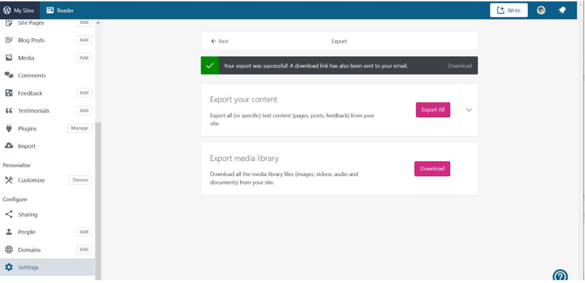

# Wordpress.com (hosted) primer

|   Topic   |   Description   |
| :------------- | :------------- |
| File Extensions |XML Export of a WordPress.com site (“WXR” (WordPress eXtended RSS files))|
| MIME Type |text/xml|
| Structure |XML document|
| Versions |Jan 2019 version 5.1 (export options are governed by current version, regardless of when site was built)|
| Primary fields or areas of use |Multidisciplinary, multipurpose|
| Source and affiliation |WordPress.com is offered by Automattic [https://automattic.com/](https://automattic.com/)|
| Metadata |WordPress name space; [Dublin Core](http://dublincore.org/specifications/dublin-core/dcmi-terms/2012-06-14/?v=elements) name space; [WFW](https://github.com/simplepie/simplepie-ng/wiki/Spec:-Well-Formed-Web) name space
| Key questions for curation review |**1.** What is the intention for depositing on the site? **2.** Can administration/ownership of the site be transferred? **3.** Will the site no longer be hosted? **4.** Who might want to view the site and for what kinds of uses?|
| Tools for curation review |Any program that can open an XML file (e.g. Oxygen, Editix, Notepad, TextEdit, etc)|
| Date Created |April 26, 2019|
| Created by |Heather James, Marquette University - [heather.james@marquette.edu](heather.james@marquette.edu)
| Date updated and summary of changes made |V1|

**Suggested Citation:** James, Heather. (2019). Wordpress.com (hosted) primer. [Data Curation Network GitHub Repository.](https://github.com/DataCurationNetwork/data-primers)

An archived version of this primer is available at:Heather James. (2019). Wordpress.com (Hosted) Data Curation Primer. Retrieved from the University of Minnesota Digital Conservancy: [http://hdl.handle.net/11299/202810](http://hdl.handle.net/11299/202810).

This work was created as part of the Data Curation Network "Specialized Data Curation Workshop" #1 co-located with the Digital Library Federation (DLF) Forum 2018 in Las Vegas, Nevada on October 17-18, 2018. These workshops have been generously funded by the Institute of Museum and Library Services # RE-85-18-0040-18.

See also: Primers authored by the workshop attendees at DLF: http://datacurationnetwork.org.

# Overview
WordPress.com is the hosted version of the open source WordPress.org software [https://wordpress.com/support/com-vs-org/](https://wordpress.com/support/com-vs-org/) offering a free online publishing platform with optional features, plans, and custom domains available for additional cost; [https://wordpress.com/about/](https://wordpress.com/about/). This primer will focus exclusively on the WordPress.com free site export and archiving process. In the future additional primers and/or additions to this primer may be beneficial in order to cover the variations with WordPress.com Business Plan sites and WordPress.org software.

# Table of Contents

<!-- TOC depthFrom:1 depthTo:6 withLinks:1 updateOnSave:undetermined orderedList:0 -->

- [Description of Format](#Description-of-Format)
- [Examples](#Examples)
- [Sample data set citations](#Sample-data-set-citations)
- [Key questions to ask yourself](#Key-questions-to-ask-yourself)
- [Key clarifications to get from researcher](#Key-clarifications-to-get-from-researcher)
- [Applicable metadata standard, core elements and readme requirements](#Applicable-metadata-standard,-core-elements-and-readme-requirements)
- [Resources for reviewing data](#Resources-for-reviewing-data)
- [Software for viewing or analyzing data](#Software-for-viewing-or-analyzing-data)
- [Preservation actions](#Preservation-actions)
- [Metadata](#Metadata)
- [Transforming the exported blog into a PDF](#Transforming-the-exported-blog-into-a-PDF)
- [Ensuring the deposit meets FAIR principles](#Ensuring-the-deposit-meets-FAIR-principles)
- [Appendix A](#Appendix-A)

<!-- /TOC -->

# Description of Format
WordPress.com is an online publishing platform, run by Automattic [https://automattic.com](https://automattic.com/), a company started by Matt Mullenweg - a founding developer of WordPress.org software. Automattic maintains the hosting, backups, security, indexing and search engine optimization, and feature development for all WordPress.com sites. WordPress.com is currently one of the most popular online publishing platforms around the world primarily based on its free/low cost user-friendly interface for creating websites and blogs. It offers a very low technical knowledge threshold for users to create good looking sites without having to arrange for servers and domain space. Users, on the free account platform, are not able to manipulate the code in order to further customize their sites, nor are they able to access all of the files associated with their sites. Free accounts do not allow third party plugins.

When looking to archive or migrate their WordPress.com site, users are limited to the Export options - “content” (text of posts, pages, comments, categories, and tags) and “media”(media in this case indicates all files that were uploaded to populate the site, including images, audio, or video) within WordPress.com and creating their own screen captures.

For the purposes of this primer, the site itself is being considered as data, regardless of the content of the site. This is not a primer for specifically curating data sets that have been uploaded onto websites hosted at WordPress.com; it assumes that the site in its entirety is being deposited and curated for how it might be reused by others as its own type of data or possibly multiple data types.

# Examples

[https://digitalmarquette.wordpress.com/about/](https://digitalmarquette.wordpress.com/about/)

[https://sundoglit.com/washer/](https://sundoglit.com/washer/)

[https://06880danwoog.com/](https://06880danwoog.com/)

[http://datacurationnetwork.org](http://datacurationnetwork.org) (migrated to Wordpress Jan 22, 2019)

# Key questions to ask yourself

- Why is the site being deposited to a repository? Will the site no longer be hosted? Will it sit idle and no longer be maintained? *Is the depositor actually asking the curator to take over maintenance of the site?*

- What are the expectations and goals in archiving this site? Is there an expected audience or user group for this deposited site?

- Are scans/screen shots of the active site sufficient (e.g. ArchiveIt captures or HTTrack crawls)? Even screenshots may be useful to capture the visual of the site?

- Is there a hope that this site can still offer interaction after it is curated into the repository? To what degree is that possible given the repository software? What features does the repository software offer along the lines of widgets and plugins (e.g. map features, comments threads, etc.)

- How will the deposited content need to relate to whatever does/does not exist on the live site - if there still is one after deposit?

# Key clarifications to get from researcher

- Is the site a WordPress.com hosted site or an independently hosted site that uses the WordPress.org software? (WordPress.org software on another hosting platform will lead to a different set of options for exporting, and the author/depositor may have more control to customize the export - that is not what is covered in this primer.)

- Who will perform the export? WordPress.com login credentials and ownership of the site are necessary to perform the export. These can be shared with the curator (i.e. the owner of the site can give their login credentials to the curator), or the owner can perform the export and send the files to the curator.

  - Another option, in many ways a better recommendation, is to have the owner transfer the site to a WordPress.com account that is run by the repository manager so that the curator can handle the export and have administrative privileges to compare the XML document to the actual site. This option only works if the site is no longer going to be maintained.[https://en.support.wordpress.com/transferring-a-site-to-another-wordpress-com-account/](https://en.support.wordpress.com/transferring-a-site-to-another-wordpress-com-account/)

- Are there additional files (media) associated with the site? These will not be included in the site export XML file and need to be exported separately.

- Creator - who was the site creator (this is not indicated on the XML)? Name and contact information as well as any institutional affiliations should be collected.

- Editors - who were the site editors (called “authors” in WordPress.com XML export document)? Names and contact information should be collected, as well as any institutional affiliations.

- Handles for authors/creators - connect the names of site editors to their WordPress.com handles in order to understand tagged contributions from site “authors.”

- Domain - what was the public domain for the site?

- Revisions to title of site, migration from other domains? Was the site transferred from one (or more)domain(s) to another prior to deposit?

- Date of creation? Date of migration *to* WordPress.com (if applicable)? Date of deposit? Date of take down (if applicable)? Dates for major revisions?

- Major revisions - notes on major content or organizational changes to the site? These will not be indicated in the XML export.

# Applicable metadata standard, core elements and readme requirements

WordPress.com uses its own name space (xmlns:wp) along with Dublin Core primarily. The elements employed in the XML export file are included at the top of the file.

Readme file should include glossary of creator and author handles, information on any plugins employed (if this was allowed on older versions or becomes a possibility in the future for free accounts), dates of major revisions to the site, provenance of migrations from other domains prior to WordPress.com.

# Software for viewing or analyzing data

- XML export file: basic program to open .xml (Oxygen, Editix, Notepad, TextEdit)

- Additional files: may vary widely

- Screen captures: ArchiveIt.org, HTTrack, Jing, etc. (The depth of crawling and capturing among these options is vastly different (full download to screen shot); this is a question of what’s necessary for preserving a sense of the visual layout of the site to accompany the text and file downloads.)

# Preservation actions

Determine that the site is a WordPress.com hosted site

- If url includes “wordpress.com” in the address bar then it is definitely a free WordPress.com hosted site

- Check Page Source info and look for metadata line “<link rel='dns-prefetch' href='//s2.wp.com' />”

  - “s2” in the above line may be replaced by a number of other options
  

Decide on elements to be captured and organization of the individual files within the repository collection

- Scans of layout of site

- Uploaded files

- XML of text and metadata for site

- Other?

Discuss goals and purposes for deposit with owner (see **Key questions to ask yourself** above).

Verify the plan for the future of the live site and determine who will perform the export (see **Key clarifications to get from researcher** above).

Export the content of the site as well as the media library (see **Export process** below)

Compare XML exported document with live site as published to determine differences. Determine with owner/depositor about whether explicating these differences would be important to potential reuse of the site as a dataset.

Ensure that ReadMe file to accompany the site includes baseline information (see **Applicable metadata standard, core elements and readme requirements** bove) as well as any additional explanation about differences between the XML document and the live site as published (see ​􏰀9 “Updates and changes” below) *and* any media files (any uploaded files) that should have further explanation. It may be the case that individual media files should have their own ReadMe documents to accompany them.

Upload the XML document, any media files, and any other types of captures of the site into repository

Export process [https://en.support.wordpress.com/export/](https://en.support.wordpress.com/export/) (as dashboard is set up January 2019, may change with WP updates)

- Login at WordPress.com with owner credentials for the site being deposited

- Verify that you are at the My Sites dashboard

- Verify that you are looking at the dashboard for the correct site or navigate to the correct site using “Switch Site” and select appropriate site

- Select “Settings” on the dashboard of the appropriate site (bottom of left navigation column)

- Select “Export” on Settings page

- In “Export your content” box, either select “Export All” button for whole site export, or select drop down arrow for options to select specific content (options include targeted posts, pages, or all feedback). (See “Receiving exported files” below for notes on receiving exported XML file.)

- Ensure that the site is not set to Private (see "Receiving exported files" below). In "Export media library" box, select "Download." Follow prompts for handling download according to your machine's settings (i.e. Save File or Open, etc.)

Screenshot of Settings page on My Sites dashboard

Receiving exported files (as of January 2019): After making a selection in the “Export your content” box (see screen shot above), the XML file(s), whether of the entire site or of targeted content, will be made available through a download link that is sent to the email associated with the owner’s account. The download link is active for 7 days. Larger sites may include more than one file; in this case the download link will contiain a .zip file

If the WordPress.com site is set to “Private” it may impact the export of the media files because part of the export process create links to those media files. This is primarily intended for users who plan to migrate their site rather than deposit it, so it may not be a problem for the deposit process. In order to check or change the visibility of the site, go to “My Sites → Settings → General → Visibility” and select “Allow search engines to index this site.” The setting can be reverted to private after the export if the owner desires. The “Export media library” download (see screenshot above) offers an immediate download as a .tar file that can be extracted. The files within are organized into folders labeled by year (of posting on the site) and named coinciding with their item titles on the XML document. Depending on the type of files that were uploaded to the site, a variety of software may be needed to view them. In a repository, they should likely be uploaded in their native file format.

# Metadata

The exported XML document indicates usage of elements from 3-5 namespaces (wordpress, wellformedweb, dublin core, and potentially others based on customizations that may have been allowed in the account)

In XML document site metadata, “<pubDate>” seems to automatically populate with date of last activity, which will be export date.

Updates and changes:

These are hard to follow completely. Unless the curator is able to consult the site author about each item that appears in the XML but not on the live site, it may be difficult for curators to determine what was a drafted but unpublished post as opposed to something that was deleted. This is particularly true of comments, which may have been submitted but not approved. For pages and posts, it is easy to see the account handle of the creator, but in the case where there may be multiple people with privileges to edit the site, this information may not be sufficiently complete. Ultimately, though, perhaps it makes sense to consider whether understanding the site at this level of depth is necessary for the curator. If it is determined that parsing all of the differences between the XML exported document and the live published site is worthwhile for potential future reuse then this would need to be explicated in the ReadMe file to accompany the site-dataset.

What information is lost:

The header of the XML file contains the disclaimer, “This file is not intended to serve as a complete backup of your site.” WordPress.com does not give further explanation of this disclaimer, and professional customer support is only available for paid accounts. The theme files (CSS, etc.) are not present to go along with this XML file of content, and the media files are separate. But it’s not clear whether any content is not being exported in the file. It appears that the disclaimer is pointed only at the support files that would allow for importing it elsewhere. It is important to note that WordPress.com does not support versioning, so that a history of changes to the site will not be recorded in the exported XML document. These should be discussed with the owner/depositor.

WP XML export header (WXR header) excerpts

# Transforming the exported blog into a PDF

Another option in the curation process would be to transform the exported XML into a PDF formatted to imitate a book.

There are multiple tools available for transforming the XML document into a PDF. One that we tested is [BlogBooker for WordPress](https://www.blogbooker.com/wordpress.php) which produced reasonably successful .pdfs of the posts, though not of the other site content. In the case of our test site, that meant that sidebar content like related websites and banner images and text as well as other pages of the site (About, Get Involved, etc.) were not captured. In BlogBooker there is not an option or setting to force the process to include other kinds of content.

Also, the site needs to still be hosted in order for the BlogBooker to download and insert any images that are indicated in the XML document.

There may be other similar programs that offer more options, but likely for a cost. There are numerous plugins that offer the same service, some are free, but third party plugins are not currently usable with the free version of WordPress.com

# Ensuring the deposit meets FAIR principles

Findable:

This is largely dependent on the repository and the ways in which the repository software can provide search engine optimization. The generation of metadata, specifically metadata that contributes to search engine indexing will also improve findability. Finally, it should be addressed how traffic will be redirected from the live site or the former site location (whether url is still live or link is broken) to the deposited site/dataset.

Accessible:

Regarding open access to the deposited content, this should be addressed with the owner/depositor at the start. There is nothing specific to this format of data that impacts the openness of the content. Regarding ADA accessibility, transforming the exported XML into PDFs and making the PDFs accessible through screen readers is a useful consideration, even if there was not already another incentive to transforming the XML to PDF. XML itself does not present issues for screen readers, so for some users, the XML file will be the most useful, but this depends on their reuse needs. ADA accessibility of media files and screen captures or site scans will vary widely and cannot be effectively covered here. Any other technical barriers to accessing deposited content are likely dependent on repository software and collection setup.

Interoperable:

The best strategy for increasing the interoperability of the deposited content is to upload multiple file formats including the XML, an image file or site scan of the site as it appeared live, and a text ReadMe file to contextualize and explain the site/dataset.

It may be problematic that the WordPress namespace in the XML is not publicly available for viewing the index of elements. This depends on what reuses a user has in mind. A workaround might be using Python to build a script for mapping the WordPress namespace to whatever other schema a user is working with. There are discussions debating the interoperability of XML as a format, but applicable solutions have not been identified at the time of writing this primer.

Reusable:

This is largely the same as above. It will be highly case-specific for a curator and depositor to gauge who might want to reuse the deposited site/dataset and in what ways. In general, clear metadata and organization of the files so that media files can be easily located when they are indicated in the XML content export will aid in reuse.

Documenting the curation process, either within the ReadMe file or as an additional file will also help users understand the choices made during the deposit process and any additional information gathered during the curation process that is not already covered in the ReadMe file. This may aid in reuse in other ways.

# Appendix A - 

[Wordpress Curated Checklist](https://docs.google.com/document/d/1TqGhf2LP8XkKTt2G65bU3wzWY4NQhJmy0wrnFn3M2qA/edit). Modified by Heather James from the Data Curation Network's [Checklist of Curated Steps](https://docs.google.com/document/d/1RWt2obXOOeJRRFmVo9VAkl4h41cL33Zm5YYny3hbPZ8/edit)

Consulted: 

- David Kwasny, Emerging Technologies Librarian, Marquette University

- Elisabeth Kaune, Coordinator Metadata, Marquette University

- Elizabeth Wawrzyniak, Digital Humanities Specialist, Marquette University

Reviewed:

- Wendy Kozlowski, Data Curation Specialist, Cornell University

- Lisa Johnston, Research Data Management/Curation Lead & Co-Director of University Digital Conservancy, University of Minnesota
