# Tutorial for Using the Data Curation Primer: netCDF

Version 1: 2019-04-09

Creator(s): Sophie Hou (sophie.hou@ronininstitute.org) - National Center for Atmospheric Research/University Corporation for Atmospheric Research

# Purpose

This document is a supplemental primer to the main [IMLS-Data-CurationFormat Profile-netCDF primer.](https://deepblue.lib.umich.edu/handle/2027.42/145724) Within this primer, the NCAR Global Climate Four-Dimensional Data Assimilation (CFDDA) Hourly 40 km Reanalysis dataset from the Research Data Archive (RDA) at the National Center for Atmospheric Research (NCAR) is used to demonstrate how to assess a netCDF-based dataset according to the main primer’s instructions. In particular, Panoply, a curation review tool that is recommended by the main primer, is used to examine the dataset in order to help answer the questions outlined in the “Key Questions for Curation Review” section of the main primer. 

The following sections demonstrate how to access the netCDF-based CFDDA dataset from the RDA and use Panoply to examine the dataset content.

# Introduction to the Research Data Archive (the provider for the sample dataset used)

The [Research Data Archive (RDA) at NCAR](https://rda.ucar.edu) contains a large and diverse collection of meteorological and oceanographic observations, operational and reanalysis model outputs, and remote sensing datasets, many of which are in the netCDF file format, to support atmospheric and geosciences research, along with ancillary datasets, such as topography/bathymetry, vegetation, and land use.

# Suggest Citation for the Sample Dataset Used

- Rife, D. L., J. O. Pinto, A. J. Monaghan, C. A. Davis, and J. R. Hannan. 2014. NCAR Global Climate Four-Dimensional Data Assimilation (CFDDA) Hourly 40 km Reanalysis. Research Data Archive at the National Center for Atmospheric Research, Computational and Information Systems Laboratory. https://doi.org/10.5065/D6M32STK. Accessed dd mmm yyyy.

Suggested Citation: Sophie Hou. (2019). Tutorial for using the netCDF Data Curation Primer. [Data Curation Network GitHub Repository.](https://github.com/DataCurationNetwork/data-primers)

An archived version of this primer is available at: University of Minnesota Digital Conservancy.http://hdl.handle.net/11299/202810.

This work was created as part of the Data Curation Network “Specialized Data Curation” Workshop #1 co-located with the Digital Library Federation (DLF) Forum 2018 in Las Vegas, Nevada on October 17-18, 2018. See also: Primers authored by the workshop attendees at DLF. http://datacurationnetwork.org.

# Instructions to Obtain the Sample Dataset Used

Note:

In order to download data files from the RDA, a free, valid user account is required. To register with the RDA, select “Register Now” at the top of the RDA’s website (https://rda.ucar.edu/), and follow the instructions to submit information via the “Data User Registration” page. Once registered, users will be able to access all the other unrestricted datasets in the RDA.

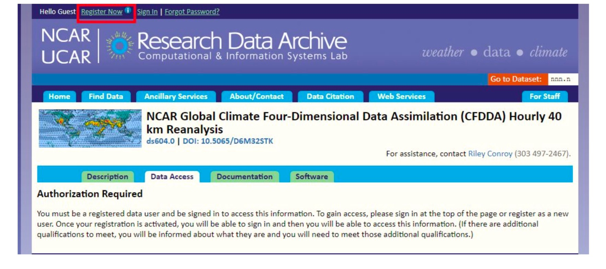

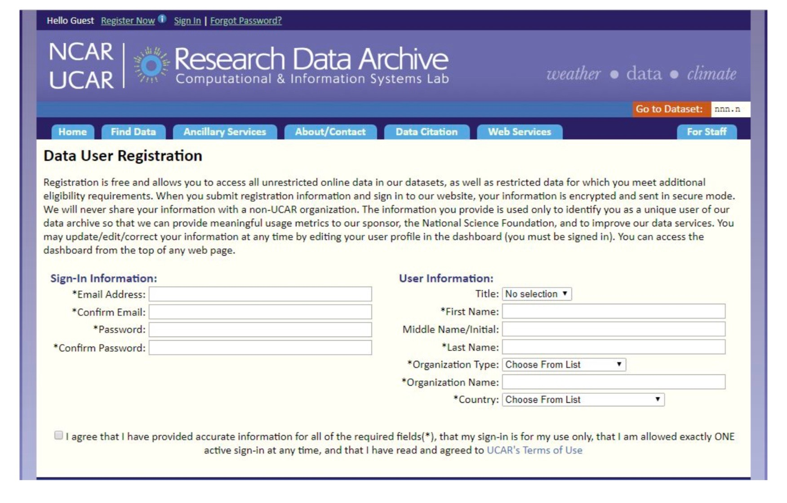

1) Click on the following digital object identifier link: https://doi.org/10.5065/D6M32STK

2) From the dataset’s landing page, select the “Data Access” tab.

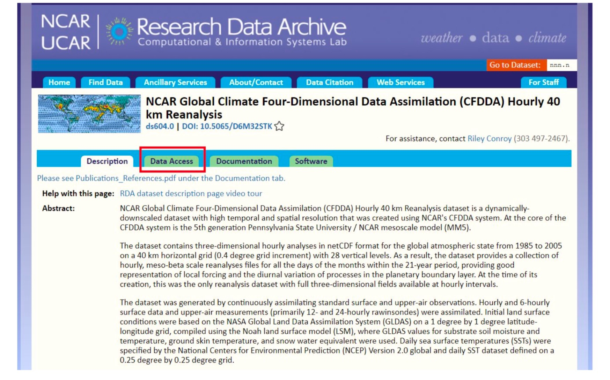

3) From the “Data Access” page, select “Web File Listing” option by clicking on the label (the first option available in the table).

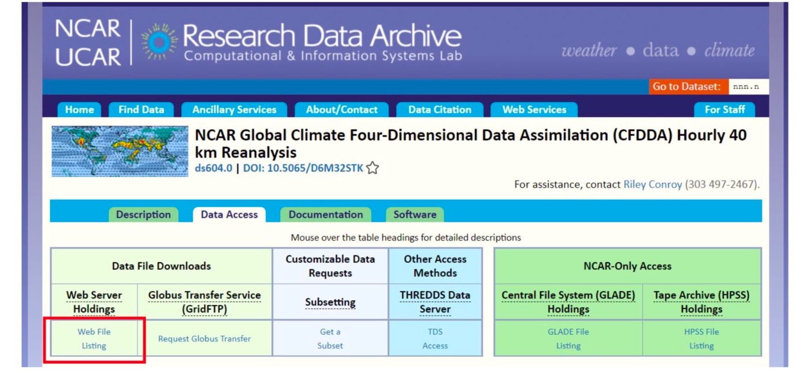

4) Select “Complete File List” option, and then select “All CFDDA”.

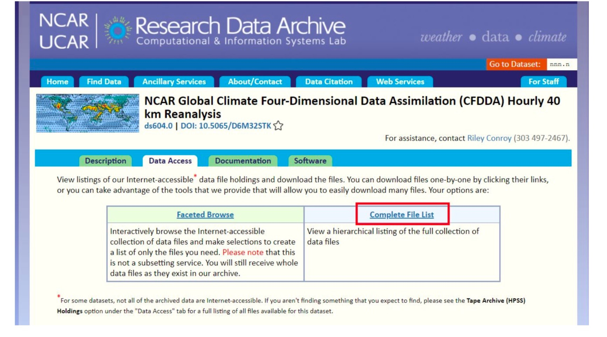

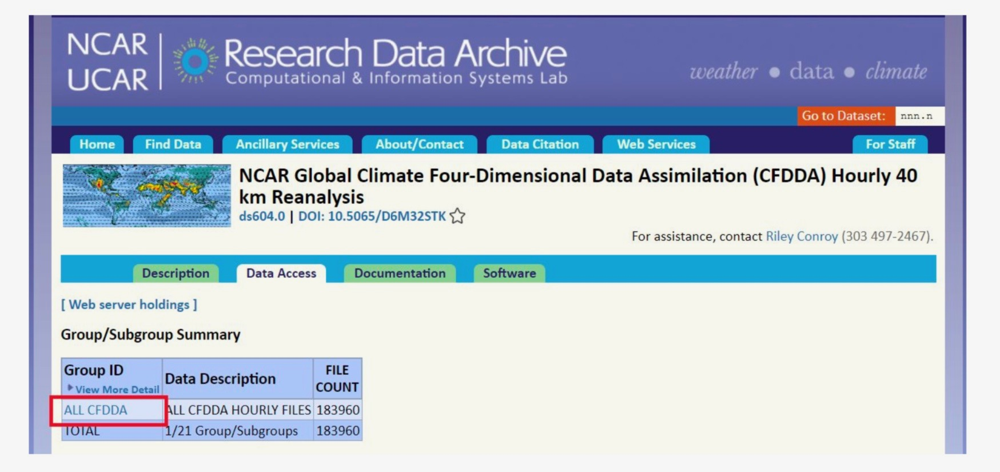

5) From the subsequent page, choose any one of the Group IDs (from “CFDDA 1985” to “CFDDA 2005”), and then any one of the files. This should initiate the file download automatically. For this primer, the data file that is associated with selecting “CFDDA 1985” and then “CFDDA 1985.02” is used.

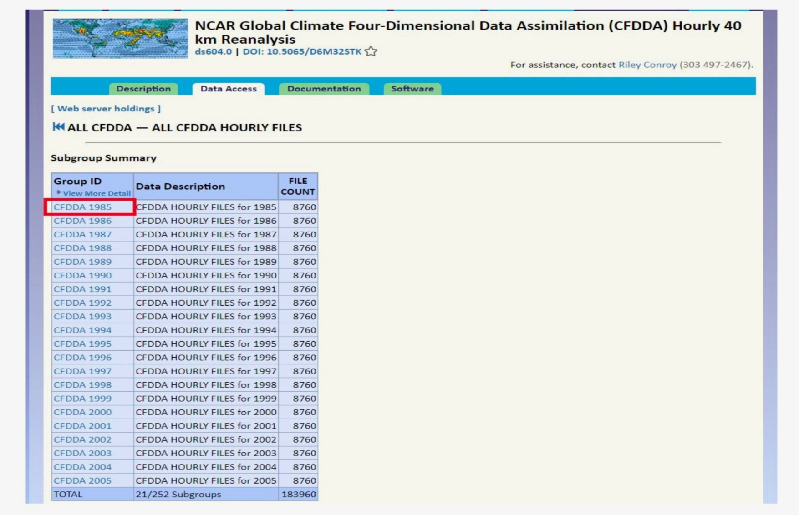

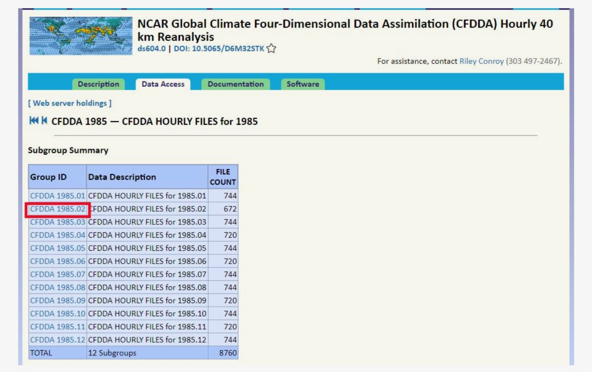

# Sample Visualization for the Sample Dataset Used

The visualization is created using the following conditions:

- File name: cfdda_1985010100.v2.nc

- Parameter: ground_t (standard_name = "surface_temperature"; long_name = "Ground temperature")

- Panoply setting: Create a georeferenced Longitude-Latitude plot

**Instructions for Obtaining and Installing Panoply:** Please follow the instructions outlined in the ”How do I use this tool?” section of the [main primer](https://deepblue.lib.umich.edu/handle/2027.42/145724).

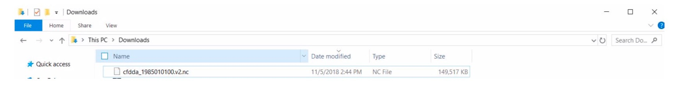

# Key Questions to Answer

(The following questions are the assessment questions that are recommended by the main primer when evaluating a netCDF-based dataset. The version of CFDDA files that are available in November, 2018 is used in this document.)

1) How are netCDF files organized in the dataset?

a) How many total netCDF files are included in the dataset, and are there any zip files or directories used to divide them?

i) For the entire CFDDA dataset, there is a total of 183,960 files. If more than one file is desired, there are several options that are available for downloading groups of files, including via Globus Transfer Service (GridFTP), the Unidata’s Thematic Real-time Environmental Distributed Data Services (THREDDS), and HyperText Transfer Protocol (HTTP). In this example, only one file is used, and when it is downloaded, it is shown as “cfdda_1985010100.v2.nc”.

b) Are there any clues as to the reasons or rationale for the file or directory divisions?

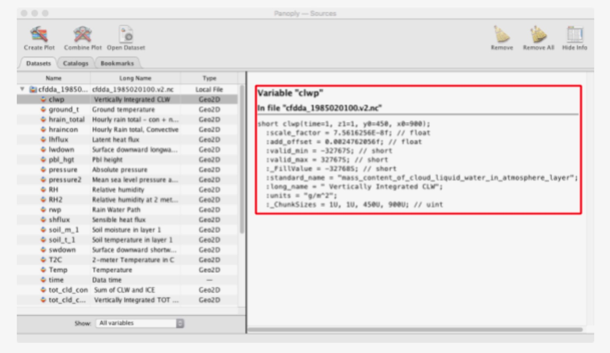

i) From the title and the abstract on the dataset’s landing page, the CFDDA dataset is described as a dataset that “contains three-dimensional hourly analyses in netCDF format for the global atmospheric state from 1985 to 2005 on a 40 km horizontal grid (0.4 degree grid increment) with 28 vertical levels”. This description helps in indicating that the files should at least be available for the years indicated as well as with hourly resolution.

Additionally, in general, a brief discussion with the submitter can also help in clarifying the reasons or rationales for the file or directory dvisions.

c) To what extent is the organizational structure explained by the metadata, documentation, or file-naming conventions?

i) In addition to the title and abstract that are available on the CFDDA dataset’s landing page, the dataset also includes a User Documentation and a document on the dataset’s file naming convention and format. Both of these documents are available on the dataset’s [Documentation](https://rda.ucar.edu/datasets/ds604.0/#!docs) page.

Both of these documents help in explaining that the files are structured as follows:

CFDDA → YYYY → MM → DD → hh

where

- “CFDDA”: allows the data files to identify their association with this particular dataset. All the data files contain the prefix “CFDDA.”

- YYYY: is the four digit year of the data file.

- MM: is the two digit month of the data file.

- DD: is the two digit day of the data file.

- hh: is the two digit hour of the data file.

Currently, the files are in their second revision, and this information is also included in the file naming convention (i.e. “v2” is included as part of the file names).

If the organizational structure is not readily explained by the extant metadata and documentation and/or if metadata and documentation do not exist initially, the organization structure information should be added once the information is clarified/determined.

2) How thorough is the embedded metadata in the headers?

a) To what extent are long_name, standard_name, units, and other attributes clear and unambiguous?

i) By examining the CFDDA dataset’s parameters in Panoply using the sample data file (an example is shown in the screenshot below), all parameters are shown to have long_name, standard_name, and units.

A careful review of long_name, standard_name, and units reveals that it is not readily clear how long_name and standard_name are assigned. Also, the standard_name appeart to include more details than the long_name. For example, for the “pbl_hgt” parameter, the standard_name is "atmosphere_boundary_layer_thickness" while the long_name is "Pbl height". Another example is the “clwp” parameter; for this parameter, the standard_name is "mass_content_of_cloud_liquid_water_in_atmosphere_layer" while the long_name is " Vertically Integrated CLW". Besides these three attributes, it might also not be readily clear how to interpret the following attributes: scale_factor, add_offset, and _ChunkSizes.

In the case of the CFDDA dataset, since a User Document is available with explanations of the dataset’s parameters, studying the User Document helps in clarifying that the standard_names are values from the Climate and Forecast Metadata Conventions (CF Conventions, http://cfconventions.org/​) and the long_names are the original parameter names assigned by the research team that created the dataset.

If the long_name values are not readily readable/understandable and/or the standard_name values do not appear to come from a standard, additional discussions should be conducted with the submitter. Any explanations of the attribute value assignments should also be documented once the information is clarified/determined.

As for scale_factor, add_offset, and _ChunkSizes, these are netCDF file attributes. The following resources provide explanations for these attributes and can be used by the curators to learn more about them:

- [NetCDF User's Guide - Attribute Conventions](http://www.bic.mni.mcgill.ca/users/sean/Docs/netcdf/guide.txn_18.html) (for scale_factor and add_offset)

- [Setting the Chunksizes in NetCDF-4](https://www.unidata.ucar.edu/software/netcdf/workshops/2012/nc4chunking/Chunking.html)

Please note that for this question, it is assumed that it is a human who needs to understand understand long_name, standard_name, units, and other attributes clearly and unambiguously. Enabling a machine (e.g. via a script) to have the ability to decipher the values of the long_name, standard_name, units, and other attributes clearly and unambiguously is an additional topic that will need to be evaluated separately.

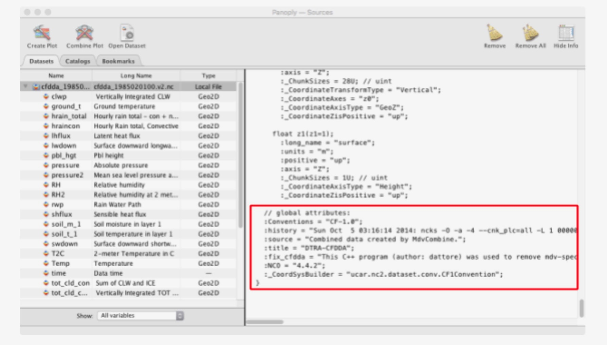

b) Does there appear to be any empty fields or missing information? Are there fields in which additional detail might help users better understand the data?

i) In addition to the long_name, standard_name, and units information, most of the parameters also have valid_min, valid_max, and data type information. Together, these pieces of information help indicated that this particular sample data file of the CFDDA dataset does not contain empty fields.

In order to determine whether a data file has any missing information, it is helpful to know the parameters that are expected to be part of the file. In the case of the CFDDA dataset, a User Documentation is available, and the Documentation includes a listing and the explanation for all the parameters that should be part of the dataset. By comparing the list in the User Documentation and the parameters shown in Panoply, it can be confirmed that there is no missing information for this sample data file.

It is important to note that even when a sample data file does not have an empty field or missing information, it could still be necessary for a curator to be able to verify and confirm that all the other files in the dataset include the same fields and do not have missing information. The method for achieving this confirmation could vary depending on the resources and expertise that are available to the repository. It is a task that might also be accomplished through collaborating with the submitter. The best way to check for empty fields or missing information for all the data files from a dataset could require additional discussions, possibly including between the repository and the submitter.

c) What conventions (if any) are declared in the global attributes, and does the header conform to those conventions?

i) For data files that are in the netCDF format, the CF Conventions can be used as the metadata standard, and this was discussed per the main primer. Consequently, it would be helpful to confirm if the sample data file follows the CF Conventions or any other conventions.

By examining the global attribute, it is confirmed that the sample data file is using “CF-1.0”.

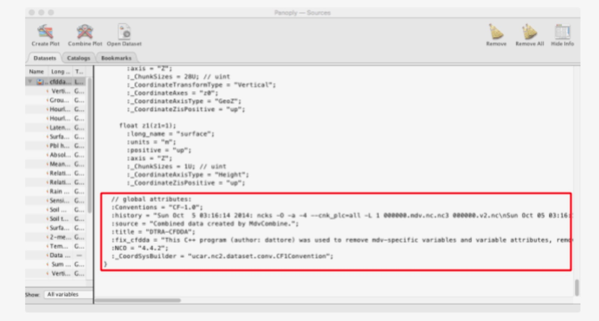

Details of global attributes:

// global attributes: :Conventions = "CF-1.0";
:history = "Sat Oct 4 23:58:49 2014: ncks -O -a -4 --cnk_plc=all -L 1 000000.mdv.nc.nc3 000000.v2.nc\nSat Oct 04 23:58:46 2014: fix_cfdda 000000.mdv.nc\n/raid15/CFDDA/mdv/GLOBAL/19850101/000000.mdv\n/raid15/CFDDA/mdv /GLOBAL/19850101/000000.mdv\n/raid15/CFDDA/mdv/GLOBAL/19850101/000000.mdv\n/ra id15/CFDDA/mdv/GLOBAL/19850101/000000.mdv\n/raid15/CFDDA/mdv/GLOBAL/19850101/ 000000.mdv\n/raid15/CFDDA/mdv/GLOBAL/19850101/000000.mdv\n/raid15/CFDDA/mdv/GL OBAL/19850101/000000.mdv\n/raid15/CFDDA/mdv/GLOBAL/19850101/000000.mdv\n/raid1 5/CFDDA/mdv/GLOBAL/19850101/000000.mdv\n/raid15/CFDDA/mdv/GLOBAL/19850101/00 0000.mdv\n/raid15/CFDDA/mdv/GLOBAL/19850101/000000.mdv\n/raid15/CFDDA/md";
:source = "Combined data created by MdvCombine.";
:title = "DTRA-CFDDA";
:fix_cfdda = "This C++ program (author: dattore) was used to remove mdv-specific variables and
variable attributes, remove dimensions and coordinate variables *x1* and *y1* (which were duplicates of *x0* and *y0*), and correct the *standard_name* and *units* attributes for several variables for CF-compliance. The program read the HDF5/netCDF4 file, made the noted changes, wrote the resulting output as netCDF3, and used ncks to convert back to netCDF4.";
:NCO = "4.4.2";
:_CoordSysBuilder = "ucar.nc2.dataset.conv.CF1Convention";

Additionally, by comparing the standard names used for the parameters that are in the sample data file with the values in the CF Conventions, it is confirmed that the values are from the CF Conventions.

d) Do you see evidence that a particular disciplinary standard (such as metadata, controlled vocabulary, etc.) is being used? If not, would the data benefit from the use of a particular disciplinary standard?

i) In the case of the CFDDA dataset, it is using the netCDF format and the CF Conventions, which are the disciplinary standards.

In addition to using the CF Conventions, the [Global Change Master Directory (GCMD) Keywords](https://earthdata.nasa.gov/earth-observation-data/find-data/gcmd/gcmd-keywords) is another set of controlled vocabularies that is commonly used within the geoscience community. Selecting and adding specific keywords to the CFDDA dataset could help in enhancing the discovery, identification, and understandability of the dataset.

The “self-describing” nature of the netCDF file format enables the parametric information to be contained as part of the dataset. However, additional metadata types, including descriptive, administrative, preservation, should also be documented. For these additional pieces of information, metadata standards that are typically used by the geoscience community, such as ISO19115 and GCMD Directory Interchange Format (DIF), can be considered.

3) What steps were involved in producing these netCDF files?

a) Are configuration files and scripts for analysis or plotting included in the dataset?

i) Since all the data files from the CFDDA dataset are in the netCDF format, the CFDDA data files can be analyzed or plotted readily by using existing netCDF-compatible software (i.e. the CFDDA dataset does not need special or additional configuration files and scripts for analysis or plotting).

If a dataset does not contain only netCDF files, the relationship between the netCDF files and the other files within the dataset should be discussed, clarified, and documented.

b) Do the global attributes in the headers of the netCDF files clearly indicate who the author is, what data sources and/or models were used, and how the files were changed during post-processing?

i) Currently, the global attributes provide some background information regarding how the dataset was produced (please see the screenshot below). However, the information does not include who the author is. Also, the information regarding what data sources and/or models were used as well as how the files were changed during post-processing is minimal and could be considered somewhat cryptic.

Since the CFDDA dataset has a User Documentation that includes detailed information regarding authors of the dataset, the data sources and models used, as well as the post-processing method used, the User Documentation is helping in clarifying the provenance of the CFDDA dataset. However, it is important to note that even with the available User Documentation, it would be helpful to update the global attributes of the data files, so that the attribution information is more human readable and understandable. More importantly, if the User Documentation is not available, it is recommended that the repository works with the submitter to improve the global attributes as well as to create a document to supplement the global attributes.

c) Does the descriptive metadata or documentation describe (at least in brief) how the files were produced, modified, analyzed, and used to create visualizations?

i) For the CFDDA dataset, in addition to the User Documentation, additional documents, such as the “Use_of_MM5.pdf”, “WRF_Obs_Nudging.pdf”, and “Initial_Input_Conditions_and_Data_Processing_Info.pdf”, are available on the dataset’s [Documentation](https://rda.ucar.edu/datasets/ds604.0/#!docs) page. Together, all these documents help in describing how the data files were produced, modified, and processed.

However, it is important to note the process for collecting and documenting these types of information could be time consuming and requires collaborations with the researchers. Without the researchers’ participation, it would be difficult to obtain accurate and quality information in these areas. As a result, ideally, it would be helpful for the repository to be involved during the research life cycle; otherwise, it would be useful for the repository to be able to interview the researchers, such as by using the [Data Curation Profiles](http://datacurationprofiles.org), in order to compile the relevant descriptive metadata and information for documentation.

# Acknowledgement

Sophie would like to thank Susan Borda and Jake Carlson (University of Michigan) for being her mentors, the Data Curation Network team for providing the opportunity and support to publish this primer, and NCAR and its RDA for sharing the CFDDA dataset.
